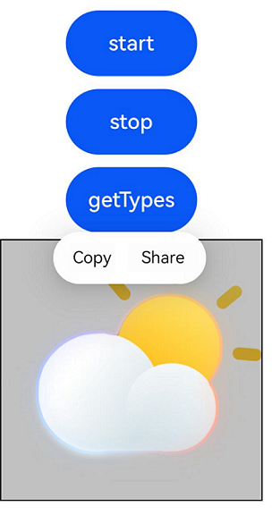

#  Canvas
<!--Kit: ArkUI-->
<!--Subsystem: ArkUI-->
<!--Owner: @sd-wu-->
<!--Designer: @sunbees-->
<!--Tester: @liuli0427-->
<!--Adviser: @Brilliantry_Rui-->

The **Canvas** component can be used to customize drawings.

> **NOTE**
>
>  This component is supported since API version 8. Updates will be marked with a superscript to indicate their earliest API version.

## Child Components

Not supported

## APIs

### Canvas

Canvas(context?: CanvasRenderingContext2D | DrawingRenderingContext)

Creates a **Canvas** component. The maximum allowed size cannot exceed 10000 px × 10000 px. If the size exceeds this limit, the **Canvas** component will fail to be created.

**Widget capability**: This API can be used in ArkTS widgets since API version 9.

**Atomic service API**: This API can be used in atomic services since API version 11.

**System capability**: SystemCapability.ArkUI.ArkUI.Full

**Parameters**

| Name | Type   | Mandatory| Description  |
| ------- | ------------------------------------------------------------ | ---- | ------------------------------------------------------------ |
| context | [CanvasRenderingContext2D](ts-canvasrenderingcontext2d.md) \| [DrawingRenderingContext<sup>12+</sup>](ts-drawingrenderingcontext.md) | No  | 2D rendering context for a canvas.<br>**CanvasRenderingContext2D**: Canvases cannot share one **CanvasRenderingContext2D** object. For details, see [CanvasRenderingContext2D](ts-canvasrenderingcontext2d.md). **DrawingRenderingContext**: Canvases cannot share one **DrawingRenderingContext** object. For details, see [DrawingRenderingContext](ts-drawingrenderingcontext.md).<br>The **null** value is treated as invalid.|

### Canvas<sup>12+</sup>

Canvas(context: CanvasRenderingContext2D | DrawingRenderingContext, imageAIOptions: ImageAIOptions)

Creates a **Canvas** component. You can specify a **CanvasRenderingContext2D** or **DrawingRenderingContext** object, along with AI image analysis options.

**Atomic service API**: This API can be used in atomic services since API version 12.

**System capability**: SystemCapability.ArkUI.ArkUI.Full

**Parameters**

| Name | Type | Mandatory| Description|
| ------- | ------------------------------------------------------------ | ---- | ------------------------------------------------------------ |
| context | [CanvasRenderingContext2D](ts-canvasrenderingcontext2d.md) \| [DrawingRenderingContext<sup>12+</sup>](ts-drawingrenderingcontext.md) | Yes  | 2D rendering context for a canvas.<br>**CanvasRenderingContext2D**: Canvases cannot share one **CanvasRenderingContext2D** object. For details, see [CanvasRenderingContext2D](ts-canvasrenderingcontext2d.md). **DrawingRenderingContext**: Canvases cannot share one **DrawingRenderingContext** object. For details, see [DrawingRenderingContext](ts-drawingrenderingcontext.md).<br>The **null** value is treated as invalid.|
| imageAIOptions  | [ImageAIOptions](ts-image-common.md#imageaioptions12) | Yes  | AI image analysis options. You can configure the analysis type or bind an analyzer controller through this parameter.<br>The **null** and **undefined** values are handled as the default values of [ImageAIOptions](ts-image-common.md#imageaioptions12).|

## Attributes

In addition to the [universal attributes](ts-component-general-attributes.md), the following attributes are supported.

### enableAnalyzer<sup>12+</sup>

Sets whether to enable the AI image analyzer, which supports subject recognition, text recognition, and object lookup. This attribute can be dynamically set using [attributeModifier](ts-universal-attributes-attribute-modifier.md#attributemodifier).
For the settings to take effect, this attribute must be used together with [StartImageAnalyzer](ts-canvasrenderingcontext2d.md#startimageanalyzer12) and [StopImageAnalyzer](ts-canvasrenderingcontext2d.md#stopimageanalyzer12) of [CanvasRenderingContext2D](ts-canvasrenderingcontext2d.md).
This attribute cannot be used together with the [overlay](ts-universal-attributes-overlay.md#overlay) attribute. If they are set at the same time, the **CustomBuilder** attribute in **overlay** has no effect. This feature depends on device capabilities.

>**NOTE**
>
> This API can be called within [attributeModifier](ts-universal-attributes-attribute-modifier.md#attributemodifier) since API version 20.

**Atomic service API**: This API can be used in atomic services since API version 12.

**System capability**: SystemCapability.ArkUI.ArkUI.Full

**Parameters**

| Name| Type   | Mandatory| Description|
| ------ | ------- | ---- | ------------------------------------------------------------ |
| enable  | boolean | Yes  | Whether to enable the AI image analyzer for subject recognition, text recognition, and object lookup within the component content.<br>**true**: Enable the AI image analyzer. **false**: Disable the AI analyzer.<br>The **null** and **undefined** values are handled as the default value.<br>Default value: **false**|

## Events

In addition to the [universal events](ts-component-general-events.md), the following events are supported.

### onReady

onReady(event: VoidCallback)

Triggered when the **Canvas** component is initialized or when its size changes. Dynamic attribute setting using [attributeModifier](ts-universal-attributes-attribute-modifier.md#attributemodifier) is supported.

When this event is triggered, the canvas is cleared. The width and height of the **Canvas** component are then determined and can be obtained, allowing you to use APIs related to the **Canvas** component for drawing. If only the position of the canvas changes, only the [onAreaChange](ts-universal-component-area-change-event.md#onareachange) event is triggered, not the **onReady** event. The [onAreaChange](ts-universal-component-area-change-event.md#onareachange) event is triggered after the **onReady** event.

**Widget capability**: This API can be used in ArkTS widgets since API version 9.

**Atomic service API**: This API can be used in atomic services since API version 11.

**System capability**: SystemCapability.ArkUI.ArkUI.Full

**Parameters**

| Name| Type   | Mandatory| Description|
| ------ | ------- | ---- | ------------------------------------------------------------ |
| event  | [VoidCallback](ts-types.md#voidcallback12) | Yes  | Triggered when the **Canvas** component is initialized or when its size changes.|

## Example

### Example 1: Using APIs in CanvasRenderingContext2D

This example describes how to use the APIs in **CanvasRenderingContext2D** for drawing on a canvas.

```ts
// xxx.ets
@Entry
@Component
struct CanvasExample {
  private settings: RenderingContextSettings = new RenderingContextSettings(true);
  private context: CanvasRenderingContext2D = new CanvasRenderingContext2D(this.settings);

  build() {
    Flex({ direction: FlexDirection.Column, alignItems: ItemAlign.Center, justifyContent: FlexAlign.Center }) {
      Canvas(this.context)
        .width('100%')
        .height('100%')
        .backgroundColor('#ffff00')
        .onReady(() => {
          this.context.fillRect(0, 30, 100, 100)
        })
    }
    .width('100%')
    .height('100%')
  }
}
```
  

### Example 2: Using APIs in DrawingRenderingContext

This example describes how to use the APIs in **DrawingRenderingContext** for drawing on a canvas.

```ts
// xxx.ets
@Entry
@Component
struct CanvasExample {
  private context: DrawingRenderingContext = new DrawingRenderingContext();

  build() {
    Flex({ direction: FlexDirection.Column, alignItems: ItemAlign.Center, justifyContent: FlexAlign.Center }) {
      Canvas(this.context)
        .width('100%')
        .height('100%')
        .backgroundColor('rgb(213,213,213)')
        .onReady(() => {
          this.context.canvas.drawCircle(200, 200, 100)
          this.context.invalidate()
        })
    }
    .width('100%')
    .height('100%')
  }
}
```
  

### Example 3: Dynamically Setting Attributes and Methods of the Canvas Component Using attributeModifier

This example demonstrates how to dynamically set the **enableAnalyzer** attribute and **onReady** method of the **Canvas** component using **attributeModifier**.

```ts
// xxx.ets
import { BusinessError } from '@kit.BasicServicesKit';

class MyCanvasModifier implements AttributeModifier<CanvasAttribute> {
  context: CanvasRenderingContext2D = new CanvasRenderingContext2D()

  applyNormalAttribute(instance: CanvasAttribute): void {
    // Draw an image with the width and height of 200 vp from (0, 0).
    instance.onReady(() => {
      let image = new ImageBitmap("image.png")
      this.context.drawImage(image, 0, 0, 200, 200)
    })
    // Enable the AI image analyzer, which can be triggered by a long press after the start button is tapped.
    instance.enableAnalyzer(true)
  }
}

@Entry
@Component
struct attributeDemo {
  @State modifier: MyCanvasModifier = new MyCanvasModifier()
  private settings: RenderingContextSettings = new RenderingContextSettings(true)
  private context: CanvasRenderingContext2D = new CanvasRenderingContext2D(this.settings)
  private config: ImageAnalyzerConfig = {
    types: [ImageAnalyzerType.SUBJECT, ImageAnalyzerType.TEXT]
  }
  private aiController: ImageAnalyzerController = new ImageAnalyzerController()
  private options: ImageAIOptions = {
    types: [ImageAnalyzerType.SUBJECT, ImageAnalyzerType.TEXT],
    aiController: this.aiController
  }

  build() {
    Row() {
      Column() {
        Button('start')
          .width(100)
          .height(50)
          .margin(5)
          .onClick(() => {
            this.context.startImageAnalyzer(this.config)
              .then(() => {
                console.info("analysis complete")
              })
              .catch((error: BusinessError) => {
                console.info("error code: " + error.code)
              })
          })
        Button('stop')
          .width(100)
          .height(50)
          .margin(5)
          .onClick(() => {
            this.context.stopImageAnalyzer()
          })
        Button('getTypes')
          .width(100)
          .height(50)
          .margin(5)
          .onClick(() => {
            this.aiController.getImageAnalyzerSupportTypes()
          })
        Canvas(this.context, this.options)
          .borderWidth(1)
          .height(200)
          .width(200)
          .attributeModifier(this.modifier)
          .onAppear(() => {
            this.modifier.context = this.context
          })
      }
    }
  }
}
```

  
