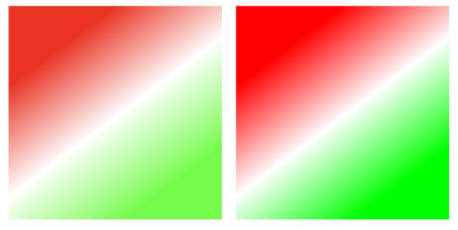

# CanvasGradient
<!--Kit: ArkUI-->
<!--Subsystem: ArkUI-->
<!--Owner: @sd-wu-->
<!--Designer: @sunbees-->
<!--Tester: @liuli0427-->
<!--Adviser: @Brilliantry_Rui-->

**CanvasGradient** provides a canvas gradient object.

>  **NOTE**
>
>  This component is supported since API version 8. Updates will be marked with a superscript to indicate their earliest API version.


## addColorStop

addColorStop(offset: number, color: string): void

Adds a color stop for the **CanvasGradient** object based on the specified offset and gradient color.

**Widget capability**: This API can be used in ArkTS widgets since API version 9.

**Atomic service API**: This API can be used in atomic services since API version 11.

**System capability**: SystemCapability.ArkUI.ArkUI.Full

**Parameters**

| Name| Type| Mandatory| Description|
| ------ | ------ | ---- | ---------------------------------------- |
| offset | number | Yes | Relative position of the gradient stop along the gradient vector, represented by the ratio of the distance between the gradient stop and the start point to the total length. The value ranges from 0 to 1.<br>If the value of **offset** is less than 0 or greater than 1, there is no gradient effect.<br>Invalid values **undefined** and **null** are treated as invalid inputs. **NaN** and **Infinity** values will trigger **CanvasGradient** exceptions.|
| color  | string | Yes | Gradient color to set. For details about the color notation, see the description of the string type in [ResourceColor](ts-types.md#resourcecolor).<br>Invalid values result in no gradient effect being displayed.|


**Example**

This example shows how to add a color stop using **addColorStop**. Colors in RGB or ARGB format can be set.

  ```ts
  // xxx.ets
  @Entry
  @Component
  struct AddColorStop {
    private settings: RenderingContextSettings = new RenderingContextSettings(true);
    private context: CanvasRenderingContext2D = new CanvasRenderingContext2D(this.settings);

    build() {
      Flex({ direction: FlexDirection.Column, alignItems: ItemAlign.Center, justifyContent: FlexAlign.Center }) {
        Canvas(this.context)
          .width('100%')
          .height('100%')
          .backgroundColor('#ffff00')
          .onReady(() => {
            let grad = this.context.createLinearGradient(50, 0, 300, 100)
            grad.addColorStop(0.0, '#ff0000')
            grad.addColorStop(0.5, '#ffffff')
            grad.addColorStop(1.0, '#00ff00')
            this.context.fillStyle = grad
            this.context.fillRect(0, 0, 400, 400)
          })
      }
      .width('100%')
      .height('100%')
    }
  }
  ```
  

 
 ## addColorStop<sup>20+</sup>

addColorStop(offset: number, color: string | ColorMetrics): void

Adds a color stop for the **CanvasGradient** object based on the specified offset and gradient color. Colors in RGB or ARGB format can be set. You can set P3 color gamut values by passing in the [ColorMetrics](../js-apis-arkui-graphics.md#colormetrics12) type, which can achieve richer color reproduction on devices that support high color gamut.

**Widget capability**: This API can be used in ArkTS widgets since API version 20.

**Atomic service API**: This API can be used in atomic services since API version 20.

**System capability**: SystemCapability.ArkUI.ArkUI.Full

**Parameters**

| Name| Type| Mandatory| Description|
| ------ | ------ | ---- | ---------------------------------------- |
| offset | number | Yes | Relative position of the gradient stop along the gradient vector, represented by the ratio of the distance between the gradient stop and the start point to the total length. The value ranges from 0 to 1.<br>If the value of **offset** is less than 0 or greater than 1, there is no gradient effect.<br>Invalid values **undefined** and **null** are treated as invalid inputs. **NaN** and **Infinity** values will trigger **CanvasGradient** exceptions.|
| color  | string \| [ColorMetrics](../js-apis-arkui-graphics.md#colormetrics12) | Yes | Color of the gradient fill.<br>You can use the [colorWithSpace](../js-apis-arkui-graphics.md#colorwithspace20) method to construct a color with the color gamut attribute [ColorSpace](ts-appendix-enums.md#colorspace20) set to SRGB or DISPLAY_P3. The color gamut attributes of each gradient ColorMetrics must be the same. If different color gamut attributes are set, an exception is thrown, and the error code is 103701.<br>Setting null and undefined is invalid.  |

**Error codes**

For details about the following error codes, see [Canvas Component Error Codes](../errorcode-canvas.md).

| ID| Error Message|
| -------- | -------- |
| 103701   | The color's ColorSpace is not the same as the last color's. |

> **NOTE**
>
> Only the [fillStyle](ts-canvasrenderingcontext2d.md#fillstyle) and [strokeStyle](ts-canvasrenderingcontext2d.md#strokestyle) attributes of the [CanvasRenderingContext2D](ts-canvasrenderingcontext2d.md) object support the CanvasGradient object with the P3 wide color gamut. In addition, the color gamut mode of the window where the Canvas component is located must be set to wide color gamut mode WIDE_GAMUT by calling the [setWindowColorSpace](../arkts-apis-window-Window.md#setwindowcolorspace9) method.<br>


**Example**

Sets the gradient breakpoint value of a specified color gamut, including the offset and color. Set the color gamut mode of the window to wide color gamut. For details, see [setWindowColorSpace](../arkts-apis-window-Window.md#setwindowcolorspace9).
  ```ts
// xxx.ets
import { BusinessError } from '@kit.BasicServicesKit';
import { ColorMetrics } from '@kit.ArkUI'

@Entry
@Component
struct AddColorStop {
  private settings: RenderingContextSettings = new RenderingContextSettings(true);
  private context: CanvasRenderingContext2D = new CanvasRenderingContext2D(this.settings);

  build() {
    Flex({ direction: FlexDirection.Column, alignItems: ItemAlign.Center, justifyContent: FlexAlign.Center }) {
      Canvas(this.context)
        .width('100%')
        .height('100%')
        .onReady(() => {
          // Set fillStyle to gradient with the SRGB color gamut.
          let gradSRGB = this.context.createLinearGradient(85, 10, 160, 110)
          // Use try catch to capture possible exceptions.
          try {
            gradSRGB.addColorStop(0.0, ColorMetrics.colorWithSpace(ColorSpace.SRGB, 1.0, 0.0, 0.0, 1.0))
            gradSRGB.addColorStop(0.5, ColorMetrics.colorWithSpace(ColorSpace.SRGB, 1.0, 1.0, 1.0, 1.0))
            gradSRGB.addColorStop(1.0, ColorMetrics.colorWithSpace(ColorSpace.SRGB, 0.0, 1.0, 0.0, 1.0))
          } catch (error) {
            let e: BusinessError = error as BusinessError;
            console.error(`Failed to addColorStop. Code: ${e.code}, message: ${e.message}`);
          }
          this.context.fillStyle = gradSRGB
          this.context.fillRect(10, 10, 150, 150)

          // Set fillStyle to the gradient effect of the DISPLAY_P3 color gamut.
          let gradP3 = this.context.createLinearGradient(245, 10, 320, 110)
          // Use try catch to capture possible exceptions.
          try {
            gradP3.addColorStop(0.0, ColorMetrics.colorWithSpace(ColorSpace.DISPLAY_P3, 1.0, 0.0, 0.0, 1.0))
            gradP3.addColorStop(0.5, ColorMetrics.colorWithSpace(ColorSpace.DISPLAY_P3, 1.0, 1.0, 1.0, 1.0))
            gradP3.addColorStop(1.0, ColorMetrics.colorWithSpace(ColorSpace.DISPLAY_P3, 0.0, 1.0, 0.0, 1.0))
          } catch (error) {
            let e: BusinessError = error as BusinessError;
            console.error(`Failed to addColorStop. Code: ${e.code}, message: ${e.message}`);
          }
          this.context.fillStyle = gradP3
          this.context.fillRect(170, 10, 150, 150)
        })
    }
    .width('100%')
    .height('100%')
  }
}
  ```
  
