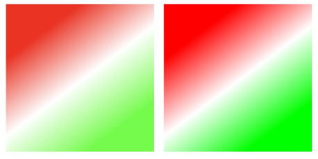
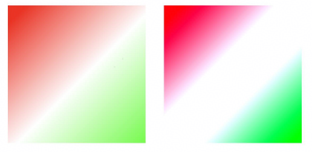

# CanvasGradient

<!--Kit: ArkUI-->
<!--Subsystem: ArkUI-->
<!--Owner: @camlostshi-->
<!--Designer: @fenglinbailu-->
<!--Tester: @liuli0427-->
<!--Adviser: @Brilliantry_Rui-->
<!-- md-trans-meta sourceCommit=48422a8cba8102090ab3a5b055a79ff6f52ce339 translatedAt=2026-08-21T02:21:04.857Z pushedAt=2026-08-21T06:00:04.950Z -->

A gradient object that allows multiple color breakpoints to be set through the **addColorStop** method, achieving smooth color transitions. It is suitable for canvas filling and stroking scenarios.

>  **NOTE**
>
>  The initial APIs of this module are supported since API version 8. Newly added APIs will be marked with a superscript to indicate their earliest API version.

## addColorStop

addColorStop(offset: number, color: string): void

Sets the gradient breakpoint value, including the offset and color. You can call **addColorStop** multiple times to set multiple breakpoints. The breakpoints are sorted by **offset** value in ascending order, and color interpolation is performed between adjacent breakpoints during rendering.

**Widget capability**: This API can be used in ArkTS widgets since API version 9.

**Atomic service API**: This API can be used in atomic services since API version 11.

**System capability**: SystemCapability.ArkUI.ArkUI.Full

**Parameters**

| Name| Type| Mandatory| Description|
| ------ | ------ | ---- | ---------------------------------------- |
| offset | number | Yes | Proportion of the distance from the gradient breakpoint to the start point to the total length. The value range is [0, 1].<br>Setting **offset** < 0 or **offset** > 1 produces no gradient effect.<br>Abnormal values **undefined** and **null** are treated as invalid, and the gradient breakpoint is not added. NaN causes the **CanvasGradient** object to be abnormal and unable to generate gradient effects properly. Infinity causes the entire **CanvasGradient** to not take effect. |
| color | string | Yes | Gradient color. The string type supports the following formats: **'rgb(255, 255, 255)'**, **'rgba(255, 255, 255, 1.0)'**, **'#RGB'**, **'#ARGB'**, **'#RRGGBB'**, and **'#AARRGGBB'**. For details, see the **string** type description in [ResourceColor](ts-types.md#resourcecolor).<br>If the color is not set in the specified format, no gradient effect is produced. When **null** or **undefined** is set, it is treated as invalid and the breakpoint is not added.|

**Example**

Set the gradient breakpoint value through **addColorStop**, including the offset and color.

  ```ts
  // xxx.ets
  @Entry
  @Component
  struct AddColorStop {
    private settings: RenderingContextSettings = new RenderingContextSettings(true);
    private context: CanvasRenderingContext2D = new CanvasRenderingContext2D(this.settings);

    build() {
      Flex({ direction: FlexDirection.Column, alignItems: ItemAlign.Center, justifyContent: FlexAlign.Center }) {
        Canvas(this.context)
          .width('100%')
          .height('100%')
          .backgroundColor('rgb(213,213,213)')
          .onReady(() => {
            let grad = this.context.createLinearGradient(50, 0, 300, 100)
            grad.addColorStop(0.0, 'rgb(39,135,217)')
            grad.addColorStop(0.5, 'rgb(255,238,240)')
            grad.addColorStop(1.0, 'rgb(23,169,141)')
            this.context.fillStyle = grad
            this.context.fillRect(0, 0, 400, 400)
          })
      }
      .width('100%')
      .height('100%')
    }
  }
  ```

  

## addColorStop<sup>20+</sup>

addColorStop(offset: number, color: string | ColorMetrics): void

Sets the gradient breakpoint value, including the offset and color. Colors in RGB or ARGB format are supported. P3 wide color gamut color values can be set by passing in the [ColorMetrics](../js-apis-arkui-graphics.md#colormetrics12) type. Since API version 26.0.0, BT2020 wide color gamut and HDR brightening are also supported.

**Widget capability**: This API can be used in ArkTS widgets since API version 20.

**Atomic service API**: This API can be used in atomic services since API version 20.

**Model restriction:** This API can be used only in the stage model.

**System capability**: SystemCapability.ArkUI.ArkUI.Full

**Parameters**

| Name| Type| Mandatory| Description|
| ------ | ------ | ---- | ---------------------------------------- |
| offset | number | Yes | Proportion of the distance from the gradient breakpoint to the start point to the total length. The value range is [0, 1].<br>Setting **offset** < 0 or **offset** > 1 produces no gradient effect.<br>Abnormal values **undefined** and **null** are treated as invalid, and the gradient breakpoint is not added. NaN causes the **CanvasGradient** object to be abnormal and unable to generate gradient effects properly. Infinity causes the entire **CanvasGradient** to not take effect. |
| color  | string \| [ColorMetrics](../js-apis-arkui-graphics.md#colormetrics12) | Yes | Color of the gradient. The string type supports the following formats: **'rgb(255, 255, 255)'**, **'rgba(255, 255, 255, 1.0)'**, **'#RGB'**, **'#ARGB'**, **'#RRGGBB'**, and **'#AARRGGBB'**.<br>You can use the [colorWithSpace](../js-apis-arkui-graphics.md#colorwithspace20) method to construct a color with a specified color space attribute. The **ColorMetrics** type can construct a color with the specified color space attribute [ColorSpace](ts-appendix-enums.md#colorspace20) set to **sRGB** or **DISPLAY_P3**. Since API version 26.0.0, constructing a color in the BT2020 color space is supported, along with HDR brightening. All gradient breakpoints in the same **CanvasGradient** object must use the same color space attribute. If different color spaces are set, an exception is thrown with error code 103701, the breakpoint is not added, and the **CanvasGradient** object retains its previous state.<br>No gradient effect is produced when the color is not set in the required format. **null** and **undefined** are treated as invalid, and the breakpoint is not added.   |

**Error codes**

For details about the error codes, see [Canvas Component Error Codes](../errorcode-canvas.md).

| ID| Error Message|
| -------- | -------- |
| 103701   | The color's ColorSpace is not the same as the last color's. |

>  **NOTE**
>
>  Only the [fillStyle](ts-components-canvas-common-property.md#fillstyle) and [strokeStyle](ts-components-canvas-common-property.md#strokestyle) attributes of the [CanvasRenderingContext2D](ts-canvasrenderingcontext2d.md) object support setting a wide color gamut **CanvasGradient** object. When using HDR colors, you must set the color gamut mode of the window where the **Canvas** component is located to the wide gamut mode **WIDE_GAMUT** through the [setWindowColorSpace](../arkts-apis-window-Window.md#setwindowcolorspace9) method. If the preceding conditions are not met, the wide color gamut color settings will not take effect.<br>

**Example**

This example demonstrates how to set the gradient stop value of a specified color gamut using **addColorStop**, including the offset and color. For details about how to set the color gamut mode of the window to wide color gamut, see [setWindowColorSpace](../arkts-apis-window-Window.md#setwindowcolorspace9).

```ts
// xxx.ets
import { BusinessError } from '@kit.BasicServicesKit';
import { ColorMetrics } from '@kit.ArkUI'

@Entry
@Component
struct AddColorStop {
  private settings: RenderingContextSettings = new RenderingContextSettings(true);
  private context: CanvasRenderingContext2D = new CanvasRenderingContext2D(this.settings);

  build() {
    Flex({ direction: FlexDirection.Column, alignItems: ItemAlign.Center, justifyContent: FlexAlign.Center }) {
      Canvas(this.context)
        .width('100%')
        .height('100%')
        .onReady(() => {
          // Set fillStyle to a gradient with sRGB color gamut effect.
          let gradSRGB = this.context.createLinearGradient(85, 10, 160, 110)
          // Use try catch to capture possible exceptions.
          try {
            gradSRGB.addColorStop(0.0, ColorMetrics.colorWithSpace(ColorSpace.SRGB, 1.0, 0.0, 0.0, 1.0))
            gradSRGB.addColorStop(0.5, ColorMetrics.colorWithSpace(ColorSpace.SRGB, 1.0, 1.0, 1.0, 1.0))
            gradSRGB.addColorStop(1.0, ColorMetrics.colorWithSpace(ColorSpace.SRGB, 0.0, 1.0, 0.0, 1.0))
          } catch (error) {
            let e: BusinessError = error as BusinessError;
            console.error(`Failed to addColorStop. Code: ${e.code}, message: ${e.message}`);
          }
          this.context.fillStyle = gradSRGB
          this.context.fillRect(10, 10, 150, 150)

          // Set fillStyle to the gradient effect of the DISPLAY_P3 color gamut.
          let gradP3 = this.context.createLinearGradient(245, 10, 320, 110)
          // Use try catch to capture possible exceptions.
          try {
            gradP3.addColorStop(0.0, ColorMetrics.colorWithSpace(ColorSpace.DISPLAY_P3, 1.0, 0.0, 0.0, 1.0))
            gradP3.addColorStop(0.5, ColorMetrics.colorWithSpace(ColorSpace.DISPLAY_P3, 1.0, 1.0, 1.0, 1.0))
            gradP3.addColorStop(1.0, ColorMetrics.colorWithSpace(ColorSpace.DISPLAY_P3, 0.0, 1.0, 0.0, 1.0))
          } catch (error) {
            let e: BusinessError = error as BusinessError;
            console.error(`Failed to addColorStop. Code: ${e.code}, message: ${e.message}`);
          }
          this.context.fillStyle = gradP3
          this.context.fillRect(170, 10, 150, 150)
        })
    }
    .width('100%')
    .height('100%')
  }
}
```



The following example demonstrates the brightness difference between SDR and HDR gradients. Through [ColorMetrics](../js-apis-arkui-graphics.md#colormetrics12), you can construct HDR colors in the BT2020 color gamut, where color component values can exceed 1.0. The portion exceeding 1.0 is used to represent highlight effects beyond the normal screen brightness range. The left side uses an sRGB red-to-white-to-green gradient, while the right side uses HDR colors in the BT2020 color gamut with a highlight white brightness multiplier of 1.5. On an HDR-capable screen, the highlight area on the right is noticeably brighter than that on the left.

>  **NOTE**
>
>  When using HDR colors, you must set the color gamut mode of the window where the **Canvas** component is located to the wide gamut mode (**WIDE_GAMUT**) through the [setWindowColorSpace](../arkts-apis-window-Window.md#setwindowcolorspace9) method. Otherwise, the HDR brightening effect will not take effect.

Since API version 26.0.0, the [addColorStop](#addcolorstop20) API additionally supports HDR brightening through the [ColorMetrics](../js-apis-arkui-graphics.md#colormetrics12) type input parameter.

```ts
// xxx.ets
import { ColorMetrics } from '@kit.ArkUI';
import { BusinessError } from '@kit.BasicServicesKit';

@Entry
@Component
struct CanvasGradientDemo {
  private settings: RenderingContextSettings = new RenderingContextSettings(true);
  private context: CanvasRenderingContext2D = new CanvasRenderingContext2D(this.settings);

  build() {
    Column({ space: 30 }) {
      Canvas(this.context)
        .width(340)
        .height(240)
        .onReady(() => {
          // HDR gradients support brightness values exceeding 1.0. On HDR-capable devices, the highlight area on the right will be brighter than that on the left.
          this.drawCanvas();
        })
    }
    .width('100%')
    .height('100%')
    .justifyContent(FlexAlign.Center)
  }

  private drawCanvas() {
    // Left: SDR gradient, red -> white -> green
    let gradSDR = this.context.createLinearGradient(20, 20, 160, 160)
    try {
      gradSDR.addColorStop(0.0, ColorMetrics.colorWithSpace(ColorSpace.SRGB, 1.0, 0.0, 0.0, 1.0)) // Red
      gradSDR.addColorStop(0.5, ColorMetrics.colorWithSpace(ColorSpace.SRGB, 1.0, 1.0, 1.0, 1.0)) // White
      gradSDR.addColorStop(1.0, ColorMetrics.colorWithSpace(ColorSpace.SRGB, 0.0, 1.0, 0.0, 1.0)) // Green
    } catch (error) {
      let e: BusinessError = error as BusinessError;
      console.error(`SDR Failed to addColorStop. Code: ${e.code}, message: ${e.message}`);
    }
    this.context.fillStyle = gradSDR
    this.context.fillRect(10, 10, 150, 150)

    this.context.fillStyle = '#FFFFFF'
    this.context.font = '16px sans-serif'
    this.context.textAlign = 'center'
    this.context.fillText("SDR", 85, 190)

    // Right: HDR gradient, red -> bright white (brightness 1.5) -> green
    let gradHDR = this.context.createLinearGradient(190, 20, 330, 160)
    try {
      gradHDR.addColorStop(0.0, ColorMetrics.createHDRColor(ColorSpace.BT2020, 1.0, 0.0, 0.0, 1.0)) // Red
      gradHDR.addColorStop(0.5, ColorMetrics.createHDRColor(ColorSpace.BT2020, 1.5, 1.5, 1.5, 1.0)) // Bright white
      gradHDR.addColorStop(1.0, ColorMetrics.createHDRColor(ColorSpace.BT2020, 0.0, 1.0, 0.0, 1.0)) // Green
    } catch (error) {
      let e: BusinessError = error as BusinessError;
      console.error(`HDR Failed to addColorStop. Code: ${e.code}, message: ${e.message}`);
    }
    this.context.fillStyle = gradHDR
    this.context.fillRect(180, 10, 150, 150)

    this.context.fillStyle = '#FFFFFF'
    this.context.fillText("HDR", 255, 190)
  }
}
```

