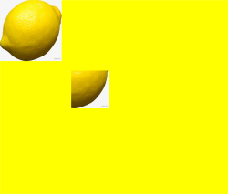

# ImageData

<!--Kit: ArkUI-->
<!--Subsystem: ArkUI-->
<!--Owner: @camlostshi-->
<!--Designer: @fenglinbailu-->
<!--Tester: @liuli0427-->
<!--Adviser: @Brilliantry_Rui-->
<!-- md-trans-meta sourceCommit=0ac6eaf21c519d27b118617e6aaa0ba03069a649 translatedAt=2026-07-30T02:33:31.518Z pushedAt=2026-08-01T06:42:55.877Z -->

The **ImageData** object stores pixel data rendered on a canvas, supporting reading, modifying, and manipulating pixels. It is suitable for scenarios such as image processing, pixel-level editing, and special effect filters. With **ImageData**, you can precisely control each pixel of an image, implement custom image processing algorithms, and provide flexible pixel-level data access for canvas drawing.

>  **NOTE**
>
>  The initial APIs of this module are supported since API version 8. Newly added APIs will be marked with a superscript to indicate their earliest API version.
>
>  When creating an **ImageData** object, the width and height must not exceed 16384 px, and the area must not exceed 16000 px × 16000 px. If the area exceeds this limit, the object cannot be rendered properly. If the created area exceeds 536870911 square pixels, the width and height of the return value are both 0 px, and **data** is **undefined**.

## constructor

constructor(width: number, height: number, data?: Uint8ClampedArray)

Creates an **ImageData** object with the specified width, height, and pixel data. If **data** is not defined, a one-dimensional array filled with zeros is used. When creating the object, the width and height must not exceed 16384 px, and the maximum area must not exceed 16000 px × 16000 px. If the area exceeds the maximum limit, the object cannot be rendered properly. If the created area exceeds 536870911 square pixels, the width and height of the return value are both 0 px, and **data** is **undefined**.

**Widget capability**: This API can be used in ArkTS widgets since API version 9.

**Atomic service API**: This API can be used in atomic services since API version 11.

**System capability**: SystemCapability.ArkUI.ArkUI.Full

**Parameters**

| Name| Type | Mandatory | Description|
| ------ | ----- | ----- | ----- |
| width | number | Yes | Width of the rectangular area, in vp. The width and height must not exceed 16384 px, and the maximum area must not exceed 16000 px × 16000 px. If the maximum area is exceeded, rendering will be abnormal. When the created area exceeds 536870911 square pixels, the width and height of the returned object are 0, and **data** is **undefined**.<br>Invalid values such as **NaN**, **Infinity**, negative numbers, and **0** are treated as **0**. |
| height | number | Yes | Height of the rectangular area, in vp. The width and height must not exceed 16384 px, and the maximum area must not exceed 16000 px × 16000 px. If the maximum area is exceeded, rendering will be abnormal. When the created area exceeds 536870911 square pixels, the width and height of the returned object are 0, and **data** is **undefined**.<br>Invalid values such as **NaN**, **Infinity**, negative numbers, and **0** are treated as **0**. |
| data | [Uint8ClampedArray](../../apis-arkts/arkts-apis-arkts-collections-Uint8ClampedArray.md) | No | One-dimensional array that stores pixel data in RGBA format. Each pixel occupies 4 bytes, in the order of R, G, B, and A. Data values range from 0 to 255. The array length must be width × height × 4. Pass this parameter when custom pixel data for **ImageData** is needed, for example, when pixel-level processing or modification of an image is required. When the invalid value **undefined** is passed, **data** is **undefined**.<br>Default value: a one-dimensional array with all values set to 0 |

## constructor<sup>12+</sup>

constructor(width: number, height: number, data?: Uint8ClampedArray, unit?: LengthMetricsUnit)

Creates an **ImageData** object with the specified width, height, and pixel data. If **data** is not defined, a one-dimensional array filled with zeros is used. The unit parameter can be used to configure the unit mode of the **ImageData** object. When creating the object, the width and height must not exceed 16384 px, and the maximum area must not exceed 16000 px × 16000 px. If the area exceeds the maximum limit, the object cannot be rendered properly. If the created area exceeds 536870911 square pixels, the width and height of the return value are both 0 px, and **data** is **undefined**. Invalid values such as **NaN**, **Infinity**, negative numbers, and **0** are treated as 0. When you need to use the vp unit for responsive layout or to adapt to different screen densities, you can specify the unit mode through the **unit** parameter.

**Widget capability**: This API can be used in ArkTS widgets since API version 12.

**Atomic service API**: This API can be used in atomic services since API version 12.

**Model restriction:** This API can be used only in the stage model.

**System capability**: SystemCapability.ArkUI.ArkUI.Full

**Parameters**

| Name| Type | Mandatory | Description|
| ------ | ----- | ----- | ----- |
| width | number | Yes | Width of the rectangular area. The unit is determined by the unit parameter, and the default unit is vp. The width and height cannot exceed 16384 px, and the maximum area cannot exceed 16000 px × 16000 px. If the maximum area is exceeded, the content cannot be rendered properly. If the created area exceeds 536870911 square pixels, the width and height of the returned object are 0, and **data** is **undefined**.<br>Invalid values such as **NaN**, **Infinity**, negative numbers, and **0** are treated as 0. |
| height | number | Yes | Height of the rectangular area. The unit is determined by the **unit** parameter, and the default unit is vp. The width and height cannot exceed 16384 px, and the maximum area cannot exceed 16000 px × 16000 px. If the maximum area is exceeded, the content cannot be rendered properly. If the created area exceeds 536870911 square pixels, the width and height of the returned object are 0, and **data** is **undefined**.<br>Invalid values such as **NaN**, **Infinity**, negative numbers, and **0** are treated as **0**. |
| data | [Uint8ClampedArray](../../apis-arkts/arkts-apis-arkts-collections-Uint8ClampedArray.md) | No | One-dimensional array that stores pixel data in RGBA format. Each pixel occupies 4 bytes, in the order of R, G, B, and A, with data values ranging from 0 to 255. Pass this parameter when custom pixel data of **ImageData** is required, for example, when pixel-level processing or modification of an image is needed.<br>If the invalid value **undefined** is passed, **data** is **undefined**.<br>Default value: a one-dimensional array with all values set to 0. |
| unit  | [LengthMetricsUnit](../js-apis-arkui-graphics.md#lengthmetricsunit12) | No   | Unit mode of the **ImageData** object. Once configured, it cannot be dynamically changed. The configuration method is the same as that of [CanvasRenderingContext2D](ts-canvasrenderingcontext2d.md). Pass this parameter when the vp unit is needed for responsive layout or adaptation to different screen densities.<br>Invalid values such as **undefined**, **NaN**, and **Infinity** are processed as the default value.<br>Default value: **DEFAULT**. |

## Properties

**Widget capability**: This API can be used in ArkTS widgets since API version 9.

**Atomic service API**: This API can be used in atomic services since API version 11.

**System capability**: SystemCapability.ArkUI.ArkUI.Full

| Name    | Type  | Read-Only| Optional| Description|
| ------ | -------- | --------- | ---------- | ------------------------------ |
| width | number | Yes| No| Actual width of the rectangle.<br>The unit is px.|
| height | number | Yes| No| Actual height of the rectangle.<br>The unit is px.|
| data | [Uint8ClampedArray](../../apis-arkts/arkts-apis-arkts-collections-Uint8ClampedArray.md) | Yes | No | One-dimensional array that stores pixel data in RGBA format. Each pixel occupies 4 bytes, in the order of R, G, B, and A, with data values ranging from 0 to 255. |

>  **NOTE**
>
>  The [px2vp](../arkts-apis-uicontext-uicontext.md#px2vp12) API can be used for unit conversion.

## Example

Draw an image using **drawImage**, obtain an **ImageData** object through the **getImageData** API, and then draw the image data onto the canvas using the **putImageData** API.

  ```ts
  // xxx.ets
  @Entry
  @Component
  struct Translate {
    private settings: RenderingContextSettings = new RenderingContextSettings(true);
    private context: CanvasRenderingContext2D = new CanvasRenderingContext2D(this.settings);
    // Replace "common/images/1234.png" with the image resource file you use.
    private img: ImageBitmap = new ImageBitmap("common/images/1234.png");

    build() {
      Flex({ direction: FlexDirection.Column, alignItems: ItemAlign.Center, justifyContent: FlexAlign.Center }) {
        Canvas(this.context)
          .width('100%')
          .height('100%')
          .backgroundColor('#ffff00')
          .onReady(() => {
            this.context.drawImage(this.img, 0, 0, 130, 130)
            let imageData = this.context.getImageData(50, 50, 130, 130)
            this.context.putImageData(imageData, 150, 150)
          })
      }
      .width('100%')
      .height('100%')
    }
  }
  ```

  