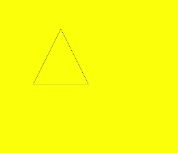
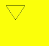
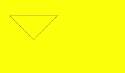
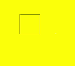
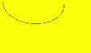
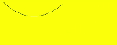
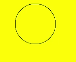
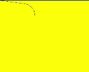
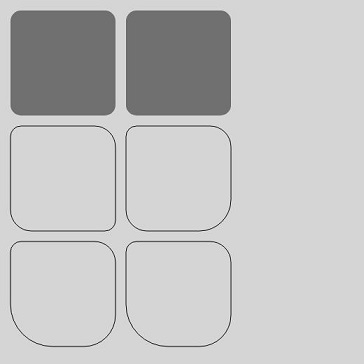

# Path2D

<!--Kit: ArkUI-->
<!--Subsystem: ArkUI-->
<!--Owner: @camlostshi-->
<!--Designer: @fenglinbailu-->
<!--Tester: @liuli0427-->
<!--Adviser: @Brilliantry_Rui-->
<!-- md-trans-meta sourceCommit=0ac6eaf21c519d27b118617e6aaa0ba03069a649 translatedAt=2026-07-30T02:36:37.367Z pushedAt=2026-08-01T06:42:55.887Z -->

A path object that supports path description and combination through its APIs, and can be drawn through the **stroke** or **fill** API of **Canvas**. **Path2D** supports path reuse, combination of multiple paths, and creation of paths based on SVG path strings. It is suitable for scenarios where the same path needs to be drawn multiple times, complex graphics need to be dynamically combined, or graphics need to be drawn based on SVG path data.

>  **NOTE**
>
>  The initial APIs of this module are supported since API version 8. Newly added APIs will be marked with a superscript to indicate their earliest API version.
>
>  The **Path2D** object does not support resetting an already set path. To create a new path, create an empty **Path2D** object.
>
>  The methods of the **Path2D** object cannot take effect on paths set in [CanvasRenderingContext2D](./ts-canvasrenderingcontext2d.md) and [OffscreenCanvasRenderingContext2D](./ts-offscreencanvasrenderingcontext2d.md) objects.

## constructor

constructor()

Constructs an empty **Path2D** object.

**Widget capability**: This API can be used in ArkTS widgets since API version 9.

**Atomic service API**: This API can be used in atomic services since API version 11.

**System capability**: SystemCapability.ArkUI.ArkUI.Full

## constructor<sup>12+</sup>

constructor(unit: LengthMetricsUnit)

Constructs an empty Path2D object. The unit mode of the Path2D object can be configured.

**Widget capability**: This API can be used in ArkTS widgets since API version 12.

**Atomic service API**: This API can be used in atomic services since API version 12.

**Model restriction:** This API can be used only in the stage model.

**System capability**: SystemCapability.ArkUI.ArkUI.Full

**Parameters**

| Name | Type    | Mandatory|  Description  |
| ----- | -------- | ---- | ---------- |
| unit  | [LengthMetricsUnit](../js-apis-arkui-graphics.md#lengthmetricsunit12) | Yes | Unit mode of the **Path2D** object. Once configured, it cannot be dynamically changed. The configuration method is the same as that of [CanvasRenderingContext2D](./ts-canvasrenderingcontext2d.md).<br>Abnormal values **NaN** and **Infinity** are processed as the default value.<br>Default value: **DEFAULT**|

## constructor

constructor(path: Path2D)

Constructs a Path2D object using a path object.

**Widget capability**: This API can be used in ArkTS widgets since API version 9.

**Atomic service API**: This API can be used in atomic services since API version 11.

**System capability**: SystemCapability.ArkUI.ArkUI.Full

**Parameters**

| Name | Type    | Mandatory|  Description  |
| ----- | -------- | ---- | ---------- |
| path | Path2D | Yes | Path object to be copied. The newly created **Path2D** object will contain the same path data as the original path. An empty path object is created when the value is **null** or **undefined**. |

## constructor<sup>12+</sup>

constructor(path: Path2D, unit: LengthMetricsUnit)

When a path object is used to construct a Path2D object, the unit mode of the Path2D object can be configured.

**Widget capability**: This API can be used in ArkTS widgets since API version 12.

**Atomic service API**: This API can be used in atomic services since API version 12.

**Model restriction:** This API can be used only in the stage model.

**System capability**: SystemCapability.ArkUI.ArkUI.Full

**Parameters**

| Name | Type    | Mandatory|  Description  |
| ----- | -------- | ---- | ---------- |
| path | Path2D | Yes | **Path2D** path object to be copied. Used to create a new **Path2D** object based on an existing path. The incoming path object is not modified, and the newly created object contains a complete copy of the path. |
| unit | [LengthMetricsUnit](../js-apis-arkui-graphics.md#lengthmetricsunit12) | Yes | Unit mode for configuring the **Path2D** object. It cannot be dynamically changed after configuration. The configuration method is the same as that of [CanvasRenderingContext2D](./ts-canvasrenderingcontext2d.md).<br>Abnormal values **NaN** and **Infinity** are treated as the default value.<br>Default value: **DEFAULT** |

## constructor

constructor(d: string)

Constructs a Path2D object using a path string that complies with the SVG path description specifications.

**Widget capability**: This API can be used in ArkTS widgets since API version 9.

**Atomic service API**: This API can be used in atomic services since API version 11.

**System capability**: SystemCapability.ArkUI.ArkUI.Full

**Parameters**

| Name | Type    | Mandatory|  Description  |
| ----- | -------- | ---- | ---------- |
| d | string | Yes | Path string that complies with the SVG path description specification. For the format, see [SVG Path Syntax](./ts-drawing-components-path.md#svg-path-syntax). Abnormal values are treated as invalid values. |

## constructor<sup>12+</sup>

constructor(description: string, unit: LengthMetricsUnit)

Constructs a Path2D object using a path string that complies with the SVG path specifications. The unit mode of the Path2D object can be configured.

**Widget capability**: This API can be used in ArkTS widgets since API version 12.

**Atomic service API**: This API can be used in atomic services since API version 12.

**Model restriction:** This API can be used only in the stage model.

**System capability**: SystemCapability.ArkUI.ArkUI.Full

**Parameters**

| Name | Type    | Mandatory|  Description  |
| ----- | -------- | ---- | ---------- |
| description | string | Yes | Path string that conforms to the SVG path description specification. For details about the format, see [SVG Path Syntax](./ts-drawing-components-path.md#svg-path-syntax). Abnormal values are handled as invalid values. |
| unit | [LengthMetricsUnit](../js-apis-arkui-graphics.md#lengthmetricsunit12) | Yes | Unit mode for configuring the **Path2D** object. After configuration, it cannot be dynamically changed. The configuration method is the same as that of [CanvasRenderingContext2D](./ts-canvasrenderingcontext2d.md).<br>Invalid values **NaN** and **Infinity** are handled as the default value.<br>Default value: **DEFAULT** |

## Methods

### addPath

addPath(path: Path2D, transform?: Matrix2D): void

Adds a path to this path.

**Widget capability**: This API can be used in ArkTS widgets since API version 9.

**Atomic service API**: This API can be used in atomic services since API version 11.

**System capability**: SystemCapability.ArkUI.ArkUI.Full

**Parameters**

| Name | Type    | Mandatory|  Description  |
| ----- | -------- | ---- | ---------- |
| path | Path2D | Yes | Path object to be added to the current path.<br>The abnormal values **undefined** and **null** are treated as invalid values. |
| transform | [Matrix2D](./ts-components-canvas-matrix2d.md) | No | Transformation matrix object for the added path, used to perform transformations such as translation, rotation, and scaling on the added path. Pass this parameter when graphic transformation is needed for the added path; it can be omitted when no transformation is required. If not passed, the default value is **null**, indicating that no transformation is applied to the path.<br>The abnormal values **undefined** and **null** are treated as invalid values.<br>Default value: **null** |

**Example**

  ```ts
  // xxx.ets
  @Entry
  @Component
  struct AddPath {
    private settings: RenderingContextSettings = new RenderingContextSettings(true);
    private context: CanvasRenderingContext2D = new CanvasRenderingContext2D(this.settings);
    private path2Da: Path2D = new Path2D('M250 150 L150 350 L350 350 Z');
    private path2Db: Path2D = new Path2D();

    build() {
      Flex({ direction: FlexDirection.Column, alignItems: ItemAlign.Center, justifyContent: FlexAlign.Center }) {
        Canvas(this.context)
          .width('100%')
          .height('100%')
          .backgroundColor('#ffff00')
          .onReady(() => {
            this.path2Db.addPath(this.path2Da)
            this.context.stroke(this.path2Db)
          })
      }
      .width('100%')
      .height('100%')
    }
  }
  ```

  

### closePath

closePath(): void

Moves the current point of the path back to the start point of the path, and draws a straight line between the current point and the start point. If the shape has already been closed or has only one point, this method does nothing.

**Widget capability**: This API can be used in ArkTS widgets since API version 9.

**Atomic service API**: This API can be used in atomic services since API version 11.

**System capability**: SystemCapability.ArkUI.ArkUI.Full

**Example**

  ```ts
  // xxx.ets
  @Entry
  @Component
  struct ClosePath {
    private settings: RenderingContextSettings = new RenderingContextSettings(true);
    private context: CanvasRenderingContext2D = new CanvasRenderingContext2D(this.settings);
    private path2Db: Path2D = new Path2D();
  
    build() {
      Flex({ direction: FlexDirection.Column, alignItems: ItemAlign.Center, justifyContent: FlexAlign.Center }) {
        Canvas(this.context)
          .width('100%')
          .height('100%')
          .backgroundColor('#ffff00')
          .onReady(() => {
            this.path2Db.moveTo(200, 100)
            this.path2Db.lineTo(300, 100)
            this.path2Db.lineTo(200, 200)
            this.path2Db.closePath()
            this.context.stroke(this.path2Db)
          })
      }
      .width('100%')
      .height('100%')
    }
  }
  ```

  

### moveTo

moveTo(x: number, y: number): void

Moves the current coordinate point of the path to the target point, without drawing a line during the movement.

**Widget capability**: This API can be used in ArkTS widgets since API version 9.

**Atomic service API**: This API can be used in atomic services since API version 11.

**System capability**: SystemCapability.ArkUI.ArkUI.Full

**Parameters**

| Name | Type | Mandatory | Description |
| ---- | ------ | ---- | -------- |
| x | number | Yes | X-axis coordinate of the target point.<br>Before API version 18, when **NaN** or **Infinity** is set, the entire path is not displayed; when **null** or **undefined** is set, the current API does not take effect. In API version 18 and later, when **NaN**, **Infinity**, **null**, or **undefined** is set, the current API does not take effect, and other path methods with valid parameters are drawn normally.<br>Default unit: vp |
| y | number | Yes | Y-axis coordinate of the target point.<br>Before API version 18, when **NaN** or **Infinity** is set, the entire path is not displayed; when **null** or **undefined** is set, the current API does not take effect. In API version 18 and later, when **NaN**, **Infinity**, **null**, or **undefined** is set, the current API does not take effect, and other path methods with valid parameters are drawn normally.<br>Default unit: vp |

> **NOTE**
>
> In versions earlier than API version 18, if the moveTo API is not executed or the moveTo API passes invalid parameters, the path starts with (0,0).
>
> In API version 18 and later, if the moveTo API is not executed or the moveTo API passes invalid parameters, the path starts from the start point of the lineTo, arcTo, bezierCurveTo, or quadraticCurveTo API that is called for the first time.

**Example**

  ```ts
  // xxx.ets
  @Entry
  @Component
  struct MoveTo {
    private settings: RenderingContextSettings = new RenderingContextSettings(true);
    private context: CanvasRenderingContext2D = new CanvasRenderingContext2D(this.settings);
    private path2Db: Path2D = new Path2D();
  
    build() {
      Flex({ direction: FlexDirection.Column, alignItems: ItemAlign.Center, justifyContent: FlexAlign.Center }) {
        Canvas(this.context)
          .width('100%')
          .height('100%')
          .backgroundColor('#ffff00')
          .onReady(() => {
            this.path2Db.moveTo(50, 100)
            this.path2Db.lineTo(250, 100)
            this.path2Db.lineTo(150, 200)
            this.path2Db.closePath()
            this.context.stroke(this.path2Db)
          })
      }
      .width('100%')
      .height('100%')
    }
  }
  ```

  

### lineTo

lineTo(x: number, y: number): void

Draws a straight line from the current point to the target point.

**Widget capability**: This API can be used in ArkTS widgets since API version 9.

**Atomic service API**: This API can be used in atomic services since API version 11.

**System capability**: SystemCapability.ArkUI.ArkUI.Full

**Parameters**

| Name | Type    | Mandatory|  Description  |
| ----- | -------- | ---- | ---------- |
| x    | number | Yes| X coordinate of the target point.<br>In versions earlier than API version 18, **NaN** or **Infinity** values prevent the entire path from rendering, and **null** or **undefined** values cause the current API to have no effect. Since API version 18, **NaN**, **Infinity**, **null**, or **undefined** values cause the current API to have no effect, and other path APIs with valid parameters continue to render correctly.<br>Default unit: vp.|
| y    | number | Yes| Y coordinate of the target point.<br>In versions earlier than API version 18, **NaN** or **Infinity** values prevent the entire path from rendering, and **null** or **undefined** values cause the current API to have no effect. Since API version 18, **NaN**, **Infinity**, **null**, or **undefined** values cause the current API to have no effect, and other path APIs with valid parameters continue to render correctly.<br>Default unit: vp.|

**Example**

  ```ts
  // xxx.ets
  @Entry
  @Component
  struct LineTo {
    private settings: RenderingContextSettings = new RenderingContextSettings(true);
    private context: CanvasRenderingContext2D = new CanvasRenderingContext2D(this.settings);
    private path2Db: Path2D = new Path2D();
  
    build() {
      Flex({ direction: FlexDirection.Column, alignItems: ItemAlign.Center, justifyContent: FlexAlign.Center }) {
        Canvas(this.context)
          .width('100%')
          .height('100%')
          .backgroundColor('#ffff00')
          .onReady(() => {
            this.path2Db.moveTo(100, 100)
            this.path2Db.lineTo(100, 200)
            this.path2Db.lineTo(200, 200)
            this.path2Db.lineTo(200, 100)
            this.path2Db.closePath()
            this.context.stroke(this.path2Db)
          })
      }
      .width('100%')
      .height('100%')
    }
  }
  ```

  

### bezierCurveTo

bezierCurveTo(cp1x: number, cp1y: number, cp2x: number, cp2y: number, x: number, y: number): void

Draws a cubic Bezier curve on the canvas.

**Widget capability**: This API can be used in ArkTS widgets since API version 9.

**Atomic service API**: This API can be used in atomic services since API version 11.

**System capability**: SystemCapability.ArkUI.ArkUI.Full

**Parameters**

| Name | Type    | Mandatory|  Description  |
| ----- | -------- | ---- | ---------- |
| cp1x | number | Yes | X-coordinate of the first Bezier control point.<br>Before API version 18, when this parameter is set to **NaN** or **Infinity**, the entire path is not displayed; when set to **null** or **undefined**, the current API does not take effect. Since API version 18, when this parameter is set to **NaN**, **Infinity**, **null**, or **undefined**, the current API does not take effect, and other path methods with valid parameters are drawn normally.<br>Default unit: vp |
| cp1y | number | Yes | Y-coordinate of the first Bezier control point.<br>Before API version 18, when this parameter is set to **NaN** or **Infinity**, the entire path is not displayed; when set to **null** or **undefined**, the current API does not take effect. Since API version 18, when this parameter is set to **NaN**, **Infinity**, **null**, or **undefined**, the current API does not take effect, and other path methods with valid parameters are drawn normally.<br>Default unit: vp |
| cp2x | number | Yes | X-coordinate of the second Bezier control point.<br>Before API version 18, when this parameter is set to **NaN** or **Infinity**, the entire path is not displayed; when set to **null** or **undefined**, the current API does not take effect. Since API version 18, when this parameter is set to **NaN**, **Infinity**, **null**, or **undefined**, the current API does not take effect, and other path methods with valid parameters are drawn normally.<br>Default unit: vp |
| cp2y | number | Yes | Y-coordinate of the second Bezier control point.<br>Before API version 18, when this parameter is set to **NaN** or **Infinity**, the entire path is not displayed; when set to **null** or **undefined**, the current API does not take effect. Since API version 18, when this parameter is set to **NaN**, **Infinity**, **null**, or **undefined**, the current API does not take effect, and other path methods with valid parameters are drawn normally.<br>Default unit: vp |
| x    | number | Yes| X coordinate of the end point on the Bezier curve.<br>In versions earlier than API version 18, **NaN** or **Infinity** values prevent the entire path from rendering, and **null** or **undefined** values cause the current API to have no effect. Since API version 18, **NaN**, **Infinity**, **null**, or **undefined** values cause the current API to have no effect, and other path APIs with valid parameters continue to render correctly.<br>Default unit: vp   |
| y    | number | Yes| Y coordinate of the end point on the bezier curve.<br>In versions earlier than API version 18, **NaN** or **Infinity** values prevent the entire path from rendering, and **null** or **undefined** values cause the current API to have no effect. Since API version 18, **NaN**, **Infinity**, **null**, or **undefined** values cause the current API to have no effect, and other path APIs with valid parameters continue to render correctly.<br>Default unit: vp   |

**Example**

  ```ts
  // xxx.ets
  @Entry
  @Component
  struct BezierCurveTo {
    private settings: RenderingContextSettings = new RenderingContextSettings(true);
    private context: CanvasRenderingContext2D = new CanvasRenderingContext2D(this.settings);
    private path2Db: Path2D = new Path2D();
  
    build() {
      Flex({ direction: FlexDirection.Column, alignItems: ItemAlign.Center, justifyContent: FlexAlign.Center }) {
        Canvas(this.context)
          .width('100%')
          .height('100%')
          .backgroundColor('#ffff00')
          .onReady(() => {
            this.path2Db.moveTo(10, 10)
            this.path2Db.BezierCurveTo(20, 100, 200, 100, 200, 20)
            this.context.stroke(this.path2Db)
          })
      }
      .width('100%')
      .height('100%')
    }
  }
  ```

  

### quadraticCurveTo

quadraticCurveTo(cpx: number, cpy: number, x: number, y: number): void

Creates a quadratic Bezier curve path.

**Widget capability**: This API can be used in ArkTS widgets since API version 9.

**Atomic service API**: This API can be used in atomic services since API version 11.

**System capability**: SystemCapability.ArkUI.ArkUI.Full

**Parameters**

| Name | Type    | Mandatory|  Description  |
| ----- | -------- | ---- | ---------- |
| cpx  | number | Yes | X coordinate of the Bezier control point.<br>Before API version 18, when **NaN** or **Infinity** is set, the entire path is not displayed; when **null** or **undefined** is set, the current API does not take effect. Since API version 18, when **NaN**, **Infinity**, **null**, or **undefined** is set, the current API does not take effect, and other path methods with valid parameters are drawn normally.<br>Default unit: vp |
| cpy  | number | Yes | Y coordinate of the Bezier control point.<br>Before API version 18, when **NaN** or **Infinity** is set, the entire path is not displayed; when **null** or **undefined** is set, the current API does not take effect. Since API version 18, when **NaN**, **Infinity**, **null**, or **undefined** is set, the current API does not take effect, and other path methods with valid parameters are drawn normally.<br>Default unit: vp |
| x    | number | Yes| X coordinate of the end point on the Bezier curve.<br>In versions earlier than API version 18, **NaN** or **Infinity** values prevent the entire path from rendering, and **null** or **undefined** values cause the current API to have no effect. Since API version 18, **NaN**, **Infinity**, **null**, or **undefined** values cause the current API to have no effect, and other path APIs with valid parameters continue to render correctly.<br>Default unit: vp.|
| y    | number | Yes| Y coordinate of the end point on the Bezier curve.<br>In versions earlier than API version 18, **NaN** or **Infinity** values prevent the entire path from rendering, and **null** or **undefined** values cause the current API to have no effect. Since API version 18, **NaN**, **Infinity**, **null**, or **undefined** values cause the current API to have no effect, and other path APIs with valid parameters continue to render correctly.<br>Default unit: vp.|

**Example**

  ```ts
  // xxx.ets
  @Entry
  @Component
  struct QuadraticCurveTo {
    private settings: RenderingContextSettings = new RenderingContextSettings(true);
    private context: CanvasRenderingContext2D = new CanvasRenderingContext2D(this.settings);
    private path2Db: Path2D = new Path2D();
  
    build() {
      Flex({ direction: FlexDirection.Column, alignItems: ItemAlign.Center, justifyContent: FlexAlign.Center }) {
        Canvas(this.context)
          .width('100%')
          .height('100%')
          .backgroundColor('#ffff00')
          .onReady(() => {
            this.path2Db.moveTo(10, 10)
            this.path2Db.quadraticCurveTo(100, 100, 200, 20)
            this.context.stroke(this.path2Db)
          })
      }
      .width('100%')
      .height('100%')
    }
  }
  ```

  

### arc

arc(x: number, y: number, radius: number, startAngle: number, endAngle: number, counterclockwise?: boolean): void

Draws an arc on the canvas.

**Widget capability**: This API can be used in ArkTS widgets since API version 9.

**Atomic service API**: This API can be used in atomic services since API version 11.

**System capability**: SystemCapability.ArkUI.ArkUI.Full

**Parameters**

| Name | Type    | Mandatory|  Description  |
| ----- | -------- | ---- | ---------- |
| x                | number  | Yes| X coordinate of the center point of the arc.<br>In versions earlier than API version 18, **NaN** or **Infinity** values prevent the entire path from rendering, and **null** or **undefined** values cause the current API to have no effect. Since API version 18, **NaN**, **Infinity**, **null**, or **undefined** values cause the current API to have no effect, and other path APIs with valid parameters continue to render correctly.<br>Default unit: vp.|
| y                | number  | Yes| Y coordinate of the center point of the arc.<br>In versions earlier than API version 18, **NaN** or **Infinity** values prevent the entire path from rendering, and **null** or **undefined** values cause the current API to have no effect. Since API version 18, **NaN**, **Infinity**, **null**, or **undefined** values cause the current API to have no effect, and other path APIs with valid parameters continue to render correctly.<br>Default unit: vp.|
| radius           | number  | Yes | Radius of the arc circle. Value range: [0, +∞).<br>Before API version 18, when **NaN** or **Infinity** is set, the entire path is not displayed; when **null** or **undefined** is set, the current API does not take effect. Since API version 18, when **NaN**, **Infinity**, **null**, or **undefined** is set, the current API does not take effect, and other path methods with valid parameters are drawn normally.<br>Default unit: vp.    |
| startAngle       | number  | Yes | Start radian of the arc.<br>Before API version 18, when **NaN** or **Infinity** is set, the entire path is not displayed; when **null** or **undefined** is set, the current API does not take effect. Since API version 18, when **NaN**, **Infinity**, **null**, or **undefined** is set, the current API does not take effect, and other path methods with valid parameters are drawn normally.<br>Default unit: radian.   |
| endAngle         | number  | Yes | End radian of the arc.<br>Before API version 18, when **NaN** or **Infinity** is set, the entire path is not displayed; when **null** or **undefined** is set, the current API does not take effect. Since API version 18, when **NaN**, **Infinity**, **null**, or **undefined** is set, the current API does not take effect, and other path methods with valid parameters are drawn normally.<br>Default unit: radian.   |
| counterclockwise | boolean | No| Whether to draw the arc counterclockwise.<br>**true**: Draw the arc counterclockwise.<br>**false**: Draw the arc clockwise.<br>Default value: **false**. If **null** or **undefined** is set, the default value is used. |

**Example**

  ```ts
  // xxx.ets
  @Entry
  @Component
  struct Arc {
    private settings: RenderingContextSettings = new RenderingContextSettings(true);
    private context: CanvasRenderingContext2D = new CanvasRenderingContext2D(this.settings);
    private path2Db: Path2D = new Path2D();
  
    build() {
      Flex({ direction: FlexDirection.Column, alignItems: ItemAlign.Center, justifyContent: FlexAlign.Center }) {
        Canvas(this.context)
          .width('100%')
          .height('100%')
          .backgroundColor('#ffff00')
          .onReady(() => {
            this.path2Db.arc(100, 75, 50, 0, 6.28)
            this.context.stroke(this.path2Db)
          })
      }
      .width('100%')
      .height('100%')
    }
  }
  ```

  

### arcTo

arcTo(x1: number, y1: number, x2: number, y2: number, radius: number): void

Creates an arc path based on the control points and arc radius. The control points (x1, y1) and (x2, y2) are used to determine the tangent direction of the arc.

**Widget capability**: This API can be used in ArkTS widgets since API version 9.

**Atomic service API**: This API can be used in atomic services since API version 11.

**System capability**: SystemCapability.ArkUI.ArkUI.Full

**Parameters**

| Name | Type    | Mandatory|  Description  |
| ----- | -------- | ---- | ---------- |
| x1     | number | Yes| X coordinate of the first point on the arc.<br>In versions earlier than API version 18, **NaN** or **Infinity** values prevent the entire path from rendering, and **null** or **undefined** values cause the current API to have no effect. Since API version 18, **NaN**, **Infinity**, **null**, or **undefined** values cause the current API to have no effect, and other path APIs with valid parameters continue to render correctly.<br>Default unit: vp.|
| y1     | number | Yes| Y coordinate of the first point on the arc.<br>In versions earlier than API version 18, **NaN** or **Infinity** values prevent the entire path from rendering, and **null** or **undefined** values cause the current API to have no effect. Since API version 18, **NaN**, **Infinity**, **null**, or **undefined** values cause the current API to have no effect, and other path APIs with valid parameters continue to render correctly.<br>Default unit: vp.|
| x2     | number | Yes| X coordinate of the second point on the arc.<br>In versions earlier than API version 18, **NaN** or **Infinity** values prevent the entire path from rendering, and **null** or **undefined** values cause the current API to have no effect. Since API version 18, **NaN**, **Infinity**, **null**, or **undefined** values cause the current API to have no effect, and other path APIs with valid parameters continue to render correctly.<br>Default unit: vp.|
| y2     | number | Yes| Y coordinate of the second point on the arc.<br>In versions earlier than API version 18, **NaN** or **Infinity** values prevent the entire path from rendering, and **null** or **undefined** values cause the current API to have no effect. Since API version 18, **NaN**, **Infinity**, **null**, or **undefined** values cause the current API to have no effect, and other path APIs with valid parameters continue to render correctly.<br>Default unit: vp.|
| radius | number | Yes | Radius of the arc. Value range: [0, +∞).<br>Before API version 18, when **NaN** or **Infinity** is set, the entire path is not displayed; when **null** or **undefined** is set, the current API does not take effect. Since API version 18, when **NaN**, **Infinity**, **null**, or **undefined** is set, the current API does not take effect, and other path methods with valid parameters are drawn normally.<br>Default unit: vp |

**Example**

  ```ts
  // xxx.ets
  @Entry
  @Component
  struct ArcTo {
    private settings: RenderingContextSettings = new RenderingContextSettings(true);
    private context: CanvasRenderingContext2D = new CanvasRenderingContext2D(this.settings);
    private path2Db: Path2D = new Path2D();

    build() {
      Flex({ direction: FlexDirection.Column, alignItems: ItemAlign.Center, justifyContent: FlexAlign.Center }) {
        Canvas(this.context)
          .width('100%')
          .height('100%')
          .backgroundColor('#ffff00')
          .onReady(() => {
            this.path2Db.moveTo(0, 0)
            this.path2Db.arcTo(150, 20, 150, 70, 50)
            this.context.stroke(this.path2Db)
          })
      }
      .width('100%')
      .height('100%')
    }
  }
  ```

  

### ellipse

ellipse(x: number, y: number, radiusX: number, radiusY: number, rotation: number, startAngle: number, endAngle: number, counterclockwise?: boolean): void

Draws an ellipse path at the specified center point with the given x-axis radius, y-axis radius, and rotation angle.

**Widget capability**: This API can be used in ArkTS widgets since API version 9.

**Atomic service API**: This API can be used in atomic services since API version 11.

**System capability**: SystemCapability.ArkUI.ArkUI.Full

**Parameters**

| Name | Type    | Mandatory|  Description  |
| ----- | -------- | ---- | ---------- |
| x                | number  | Yes | X coordinate of the ellipse center.<br>In versions earlier than API version 18, **NaN** or **Infinity** values prevent the entire path from rendering, and **null** or **undefined** values cause the current API to have no effect. Since API version 18, **NaN**, **Infinity**, **null**, or **undefined** values cause the current API to have no effect, and other path APIs with valid parameters continue to render correctly.<br>Default unit: vp.|
| y                | number  | Yes | Y coordinate of the ellipse center.<br>In versions earlier than API version 18, **NaN** or **Infinity** values prevent the entire path from rendering, and **null** or **undefined** values cause the current API to have no effect. Since API version 18, **NaN**, **Infinity**, **null**, or **undefined** values cause the current API to have no effect, and other path APIs with valid parameters continue to render correctly.<br>Default unit: vp.|
| radiusX          | number  | Yes  | Radius length of the ellipse on the x-axis. Value range: [0, +∞).<br>Before API version 18, when **NaN** or **Infinity** is set, the entire path is not displayed; when **null** or **undefined** is set, the current API does not take effect. Since API version 18, when **NaN**, **Infinity**, **null**, or **undefined** is set, the current API does not take effect, and other path methods with valid parameters are drawn normally.<br>Default unit: vp|
| radiusY          | number  | Yes  | Radius length of the ellipse on the y-axis. Value range: [0, +∞).<br>Before API version 18, when **NaN** or **Infinity** is set, the entire path is not displayed; when **null** or **undefined** is set, the current API does not take effect. Since API version 18, when **NaN**, **Infinity**, **null**, or **undefined** is set, the current API does not take effect, and other path methods with valid parameters are drawn normally.<br>Default unit: vp|
| rotation         | number  | Yes  | Rotation angle of the ellipse.<br>Before API version 18, when **NaN** or **Infinity** is set, the entire path is not displayed; when **null** or **undefined** is set, the current API does not take effect. Since API version 18, when **NaN**, **Infinity**, **null**, or **undefined** is set, the current API does not take effect, and other path methods with valid parameters are drawn normally.<br>Default unit: radian                           |
| startAngle       | number  | Yes  | Starting angle for drawing the ellipse.<br>Before API version 18, when **NaN** or **Infinity** is set, the entire path is not displayed; when **null** or **undefined** is set, the current API does not take effect. Since API version 18, when **NaN**, **Infinity**, **null**, or **undefined** is set, the current API does not take effect, and other path methods with valid parameters are drawn normally.<br>Default unit: radian                        |
| endAngle         | number  | Yes  | Ending angle for drawing the ellipse.<br>Before API version 18, when **NaN** or **Infinity** is set, the entire path is not displayed; when **null** or **undefined** is set, the current API does not take effect. Since API version 18, when **NaN**, **Infinity**, **null**, or **undefined** is set, the current API does not take effect, and other path methods with valid parameters are drawn normally.<br>Default unit: radian                        |
| counterclockwise | boolean | No | Whether to draw the ellipse counterclockwise.<br>**true**: Draw an ellipse in the counterclockwise direction.<br>**false**: Draw an ellipse in the clockwise direction.<br>Default value: **false**. If **null** or **undefined** is set, the default value is used.|

**Example**

  ```ts
  // xxx.ets
  @Entry
  @Component
  struct CanvasExample {
    private settings: RenderingContextSettings = new RenderingContextSettings(true);
    private context: CanvasRenderingContext2D = new CanvasRenderingContext2D(this.settings);
    private path2Db: Path2D = new Path2D();

    build() {
      Flex({ direction: FlexDirection.Column, alignItems: ItemAlign.Center, justifyContent: FlexAlign.Center }) {
        Canvas(this.context)
          .width('100%')
          .height('100%')
          .backgroundColor('#ffff00')
          .onReady(() => {
            this.path2Db.ellipse(200, 200, 50, 100, 0, Math.PI * 1, Math.PI * 2)
            this.context.stroke(this.path2Db)
          })
      }
      .width('100%')
      .height('100%')
    }
  }
  ```

  

### rect

rect(x: number, y: number, w: number, h: number): void

Creates a rectangle on the canvas.

>  **NOTE**
>
>  To create a rounded rectangle path, use the [roundRect](#roundrect20) method.

**Widget capability**: This API can be used in ArkTS widgets since API version 9.

**Atomic service API**: This API can be used in atomic services since API version 11.

**System capability**: SystemCapability.ArkUI.ArkUI.Full

**Parameters**

| Name | Type    | Mandatory|  Description  |
| ----- | -------- | ---- | ---------- |
| x    | number | Yes| X coordinate of the upper left corner of the rectangle.<br>In versions earlier than API version 18, **NaN** or **Infinity** values prevent the entire path from rendering, and **null** or **undefined** values cause the current API to have no effect. Since API version 18, **NaN**, **Infinity**, **null**, or **undefined** values cause the current API to have no effect, and other path APIs with valid parameters continue to render correctly.<br>Default unit: vp.|
| y    | number | Yes| Y coordinate of the upper left corner of the rectangle.<br>In versions earlier than API version 18, **NaN** or **Infinity** values prevent the entire path from rendering, and **null** or **undefined** values cause the current API to have no effect. Since API version 18, **NaN**, **Infinity**, **null**, or **undefined** values cause the current API to have no effect, and other path APIs with valid parameters continue to render correctly.<br>Default unit: vp.|
| w    | number | Yes | Width of the rectangle. A negative value draws the rectangle to the left.<br>Before API version 18, when **NaN** or **Infinity** is set, the entire path is not displayed; when **null** or **undefined** is set, the current API does not take effect. Since API version 18, when **NaN**, **Infinity**, **null**, or **undefined** is set, the current API does not take effect, and other path methods with valid parameters are drawn normally.<br>To draw a complete rectangle, value range: [-x, Canvas width - x].<br>Default unit: vp |
| h    | number | Yes | Height of the rectangle. A negative value draws the rectangle upward.<br>Before API version 18, when **NaN** or **Infinity** is set, the entire path is not displayed; when **null** or **undefined** is set, the current API does not take effect. Since API version 18, when **NaN**, **Infinity**, **null**, or **undefined** is set, the current API does not take effect, and other path methods with valid parameters are drawn normally.<br>To draw a complete rectangle, value range: [-y, Canvas height - y].<br>Default unit: vp |

**Example**

  ```ts
  // xxx.ets
  @Entry
  @Component
  struct CanvasExample {
    private settings: RenderingContextSettings = new RenderingContextSettings(true);
    private context: CanvasRenderingContext2D = new CanvasRenderingContext2D(this.settings);
    private path2Db: Path2D = new Path2D();
  
    build() {
      Flex({ direction: FlexDirection.Column, alignItems: ItemAlign.Center, justifyContent: FlexAlign.Center }) {
        Canvas(this.context)
          .width('100%')
          .height('100%')
          .backgroundColor('#ffff00')
          .onReady(() => {
            this.path2Db.rect(20, 20, 100, 100);
            this.context.stroke(this.path2Db)
          })
      }
      .width('100%')
      .height('100%')
    }
  }
  ```

  

### roundRect<sup>20+</sup>

roundRect(x: number, y: number, w: number, h: number, radii?: number | Array\<number>): void

Creates a rounded rectangle path. This method does not directly render the content. To draw a rounded rectangle on the canvas, use the fill or stroke method.

**Widget capability**: This API can be used in ArkTS widgets since API version 20.

**Atomic service API**: This API can be used in atomic services since API version 20.

**Model restriction:** This API can be used only in the stage model.

**System capability**: SystemCapability.ArkUI.ArkUI.Full

**Parameters**

| Name  | Type    | Mandatory  | Description           |
| ---- | ------ | ---- | ------------- |
| x    | number | Yes    | X coordinate of the top-left corner of the rectangle.<br>**null** is treated as **0**. **undefined** is treated as an invalid value, and no drawing is performed.<br>When **NaN** or **Infinity** is set, the current API does not take effect, and other path methods with valid parameters are drawn normally.<br>To draw a complete rectangle, the value range is [0, Canvas width).<br>Default unit: vp |
| y    | number | Yes    | Y coordinate of the top-left corner of the rectangle.<br>**null** is treated as **0**. **undefined** is treated as an invalid value, and no drawing is performed.<br>When **NaN** or **Infinity** is set, the current API does not take effect, and other path methods with valid parameters are drawn normally.<br>To draw a complete rectangle, the value range is [0, Canvas height).<br>Default unit: vp |
| w    | number | Yes    | Width of the rectangle. A negative value draws to the left.<br>**null** is treated as **0**. **undefined** is treated as an invalid value, and no drawing is performed.<br>When **NaN** or **Infinity** is set, the current API does not take effect, and other path methods with valid parameters are drawn normally.<br>To draw a complete rectangle, the value range is [-x, Canvas width - x].<br>Default unit: vp |
| h    | number | Yes    | Height of the rectangle. A negative value draws upward.<br>**null** is treated as **0**. **undefined** is treated as an invalid value, and no drawing is performed.<br>When **NaN** or **Infinity** is set, the current API does not take effect, and other path methods with valid parameters are drawn normally.<br>To draw a complete rectangle, the value range is [-y, Canvas height - y].<br>Default unit: vp |
| radii | number \| Array\<number> | No | Number or array specifying the arc radii of the rectangle corners.<br>When the parameter type is number, the arc radius of all rectangle corners is set to this number.<br>When the parameter type is Array\<number>, the array length ranges from 1 to 4, and the radii are set as follows:<br>[Arc radii of all rectangle corners]<br>[Arc radii of the top-left and bottom-right corners, arc radii of the top-right and bottom-left corners]<br>[Arc radius of the top-left corner, arc radii of the top-right and bottom-left corners, arc radius of the bottom-right corner]<br>[Arc radius of the top-left corner, arc radius of the top-right corner, arc radius of the bottom-right corner, arc radius of the bottom-left corner]<br>If radii contains negative numbers or the array length is 0 or greater than 4, an exception is thrown. Error code: 103701.<br>Default value: **0**. **null** and **undefined** are treated as the default value.<br>If the arc radius exceeds the width or height of the rectangle, it is scaled down proportionally to the width or height.<br>Default unit: vp |

**Error codes**

For details about the following error codes, see [Canvas Error Codes](../errorcode-canvas.md).

| ID | Error Message |
| -------- | -------- |
| 103701 | Parameter error. Possible causes:<br> 1. The param radii is a list that has zero or more than four elements.<br> 2. The param radii contains negative value.|

**Example**

This example shows how to draw six rounded rectangles.

1. Create a rounded rectangle with the start point (10vp, 10vp), width and height of 100vp, and arc radius of 10vp for the four rectangle corners, and fill the rounded rectangle.

2. Create a rounded rectangle with the start point (120vp, 10vp), width and height of 100vp, and arc radius of 10vp for the four rectangle corners, and fill the rounded rectangle.

3. Creates a rounded rectangle with the start point (10vp, 120vp), width and height of 100 vp, and the radius of the upper-left and lower-right rounded corners of 10 vp, and the radius of the upper-right and lower-left rounded corners of 20 vp. The rounded rectangle is outlined.

4. Creates a rounded rectangle with the start point (120vp, 120vp), width and height of 100 vp, and the radius of the upper-left rounded corner of 10 vp, the radius of the upper-right and lower-left rounded corners of 20 vp, and the radius of the lower-right rounded corner of 30 vp. The rounded rectangle is outlined.

5. Creates a rounded rectangle with the start point (10vp, 230vp), width and height of 100 vp, and the radius of the upper-left rounded corner of 10 vp, the radius of the upper-right rounded corner of 20 vp, the radius of the lower-right rounded corner of 30 vp, and the radius of the lower-left rounded corner of 40 vp. The rounded rectangle is outlined.

6. Creates a rounded rectangle with the start point (220vp, 330vp), width and height of -100 vp, and the radius of the upper-left rounded corner of 10 vp, the radius of the upper-right rounded corner of 20 vp, the radius of the lower-right rounded corner of 30 vp, and the radius of the lower-left rounded corner of 40 vp. The rounded rectangle is outlined.

  ```ts
  // xxx.ets
  import { BusinessError } from '@kit.BasicServicesKit';

  @Entry
  @Component
  struct CanvasExample {
    private settings: RenderingContextSettings = new RenderingContextSettings(true);
    private context: CanvasRenderingContext2D = new CanvasRenderingContext2D(this.settings);
    private pathA: Path2D = new Path2D();
    private pathB: Path2D = new Path2D();

    build() {
      Flex({ direction: FlexDirection.Column, alignItems: ItemAlign.Center, justifyContent: FlexAlign.Center }) {
        Canvas(this.context)
          .width('100%')
          .height('100%')
          .backgroundColor('#D5D5D5')
          .onReady(() => {
            try {
              this.context.fillStyle = '#707070'
              // Create a rounded rectangle with the start point (10vp, 10vp), width and height of 100 vp, and four rounded corners with a radius of 10 vp.
              this.pathA.roundRect(10, 10, 100, 100, 10)
              // Create a rounded rectangle with the start point (120vp, 10vp), width and height of 100 vp, and four rounded corners with a radius of 10 vp.
              this.pathA.roundRect(120, 10, 100, 100, [10])
              this.context.fill(this.pathA)
              // Create a rounded rectangle with the start point (10vp, 120vp), width and height of 100 vp, and four rounded corners with a radius of 10 vp in the upper left and lower right corners, and a radius of 20 vp in the upper right and lower left corners.
              this.pathB.roundRect(10, 120, 100, 100, [10, 20])
              // Create a rounded rectangle with the start point (120vp, 120vp), width and height of 100 vp, and four rounded corners with a radius of 10 vp in the upper left corner, a radius of 20 vp in the upper right and lower left corners, and a radius of 30 vp in the lower right corner.
              this.pathB.roundRect(120, 120, 100, 100, [10, 20, 30])
              // Create a rounded rectangle with the start point (10vp, 230vp), width and height of 100 vp, and four rounded corners with a radius of 10 vp in the upper left corner, a radius of 20 vp in the upper right corner, a radius of 30 vp in the lower right corner, and a radius of 40 vp in the lower left corner.
              this.pathB.roundRect(10, 230, 100, 100, [10, 20, 30, 40])
              // Create a rounded rectangle with the start point (220vp, 330vp), width and height of -100 vp, and four rounded corners with a radius of 10 vp in the upper left corner, a radius of 20 vp in the upper right corner, a radius of 30 vp in the lower right corner, and a radius of 40 vp in the lower left corner.
              this.pathB.roundRect(220, 330, -100, -100, [10, 20, 30, 40])
              this.context.stroke(this.pathB)
            } catch (error) {
              let e: BusinessError = error as BusinessError;
              console.error(`Failed to create roundRect. Code: ${e.code}, message: ${e.message}`);
            }
          })
      }
      .width('100%')
      .height('100%')
    }
  }
  ```

  