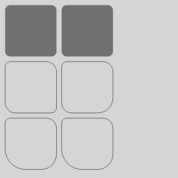

# Path2D
<!--Kit: ArkUI-->
<!--Subsystem: ArkUI-->
<!--Owner: @sd-wu-->
<!--Designer: @sunbees-->
<!--Tester: @liuli0427-->
<!--Adviser: @Brilliantry_Rui-->

**Path2D** allows you to describe a path through an existing path. This path can be drawn through the **stroke** or **fill** API of **Canvas**.

>  **NOTE**
>
>  This component is supported since API version 8. Updates will be marked with a superscript to indicate their earliest API version.
>
>  The Path2D object does not support the resetting of an existing path. If a new path is required, you can create an empty Path2D object.
>
>  The methods of the Path2D object do not take effect for the paths set in the [CanvasRenderingContext2D](./ts-canvasrenderingcontext2d.md) and [OffscreenCanvasRenderingContext2D](./ts-offscreencanvasrenderingcontext2d.md) objects.

## Constructor

### constructor

constructor()

Constructs an empty **Path2D** object.

**Widget capability**: This API can be used in ArkTS widgets since API version 9.

**Atomic service API**: This API can be used in atomic services since API version 11.

**System capability**: SystemCapability.ArkUI.ArkUI.Full

### constructor<sup>12+</sup>

constructor(unit: LengthMetricsUnit)

Constructs an empty Path2D object. The unit mode of the Path2D object can be configured.

**Widget capability**: This API can be used in ArkTS widgets since API version 12.

**Atomic service API**: This API can be used in atomic services since API version 12.

**System capability**: SystemCapability.ArkUI.ArkUI.Full

**Parameters**

| Name | Type    | Mandatory|  Description  |
| ----- | -------- | ---- | ---------- |
| unit  | [LengthMetricsUnit](../js-apis-arkui-graphics.md#lengthmetricsunit12) | Yes| Unit mode of the Path2D object. The value cannot be dynamically changed once set. The configuration method is the same as that of [CanvasRenderingContext2D](ts-canvasrenderingcontext2d.md).<br>Invalid values **NaN** and **Infinity** are treated as the default value.<br>Default value: DEFAULT|

### constructor

constructor(path: Path2D)

Constructs a Path2D object using a path object.

**Widget capability**: This API can be used in ArkTS widgets since API version 9.

**Atomic service API**: This API can be used in atomic services since API version 11.

**System capability**: SystemCapability.ArkUI.ArkUI.Full

**Parameters**

| Name | Type    | Mandatory|  Description  |
| ----- | -------- | ---- | ---------- |
| path | Path2D | Yes| **Path** object.|

### constructor<sup>12+</sup>

constructor(path: Path2D, unit: LengthMetricsUnit)

When a path object is used to construct a Path2D object, the unit mode of the Path2D object can be configured.

**Widget capability**: This API can be used in ArkTS widgets since API version 12.

**Atomic service API**: This API can be used in atomic services since API version 12.

**System capability**: SystemCapability.ArkUI.ArkUI.Full

**Parameters**

| Name | Type    | Mandatory|  Description  |
| ----- | -------- | ---- | ---------- |
| path | Path2D | Yes| **Path** object.|
| unit | [LengthMetricsUnit](../js-apis-arkui-graphics.md#lengthmetricsunit12) | Yes| Unit mode of the Path2D object. The value cannot be dynamically changed once set. The configuration method is the same as that of [CanvasRenderingContext2D](ts-canvasrenderingcontext2d.md).<br>Invalid values **NaN** and **Infinity** are treated as the default value.<br>Default value: DEFAULT|

### constructor

constructor(d: string)

Constructs a Path2D object using a path string that complies with the SVG path description specifications.

**Widget capability**: This API can be used in ArkTS widgets since API version 9.

**Atomic service API**: This API can be used in atomic services since API version 11.

**System capability**: SystemCapability.ArkUI.ArkUI.Full

**Parameters**

| Name | Type    | Mandatory|  Description  |
| ----- | -------- | ---- | ---------- |
| d | string | Yes| Path that complies with the [SVG path syntax](ts-drawing-components-path.md#svg-path-syntax). Invalid values are treated as invalid inputs.|

### constructor<sup>12+</sup>

constructor(description: string, unit: LengthMetricsUnit)

Constructs a Path2D object using a path string that complies with the SVG path specifications. The unit mode of the Path2D object can be configured.

**Widget capability**: This API can be used in ArkTS widgets since API version 12.

**Atomic service API**: This API can be used in atomic services since API version 12.

**System capability**: SystemCapability.ArkUI.ArkUI.Full

**Parameters**

| Name | Type    | Mandatory|  Description  |
| ----- | -------- | ---- | ---------- |
| description | string | Yes| Path that complies with the [SVG path syntax](ts-drawing-components-path.md#svg-path-syntax). Invalid values are treated as invalid inputs.|
| unit | [LengthMetricsUnit](../js-apis-arkui-graphics.md#lengthmetricsunit12) | Yes| Unit mode of the Path2D object. The value cannot be dynamically changed once set. The configuration method is the same as that of [CanvasRenderingContext2D](ts-canvasrenderingcontext2d.md).<br>Invalid values **NaN** and **Infinity** are treated as the default value.<br>Default value: DEFAULT|

## Methods

### addPath

addPath(path: Path2D, transform?: Matrix2D): void

Adds a path to this path.

**Widget capability**: This API can be used in ArkTS widgets since API version 9.

**Atomic service API**: This API can be used in atomic services since API version 11.

**System capability**: SystemCapability.ArkUI.ArkUI.Full

**Parameters**

| Name | Type    | Mandatory|  Description  |
| ----- | -------- | ---- | ---------- |
| path      | Path2D | Yes| Path to be added to this path. Unit: px.<br>The **undefined** and **null** values are treated as invalid.|
| transform | [Matrix2D](ts-components-canvas-matrix2d.md) | No| Transformation matrix of the new path.<br>The **undefined** and **null** values are treated as invalid.<br>Default value: **null**.|


**Example**

  ```ts
  // xxx.ets
  @Entry
  @Component
  struct AddPath {
    private settings: RenderingContextSettings = new RenderingContextSettings(true);
    private context: CanvasRenderingContext2D = new CanvasRenderingContext2D(this.settings);
    private path2Da: Path2D = new Path2D("M250 150 L150 350 L350 350 Z");
    private path2Db: Path2D = new Path2D();

    build() {
      Flex({ direction: FlexDirection.Column, alignItems: ItemAlign.Center, justifyContent: FlexAlign.Center }) {
        Canvas(this.context)
          .width('100%')
          .height('100%')
          .backgroundColor('#ffff00')
          .onReady(() => {
            this.path2Db.addPath(this.path2Da)
            this.context.stroke(this.path2Db)
          })
      }
      .width('100%')
      .height('100%')
    }
  }
  ```

  


### closePath

closePath(): void

Moves the current point of the path back to the start point of the path, and draws a straight line between the current point and the start point. If the shape has already been closed or has only one point, this method does nothing.

**Widget capability**: This API can be used in ArkTS widgets since API version 9.

**Atomic service API**: This API can be used in atomic services since API version 11.

**System capability**: SystemCapability.ArkUI.ArkUI.Full

**Example**

  ```ts
  // xxx.ets
  @Entry
  @Component
  struct ClosePath {
    private settings: RenderingContextSettings = new RenderingContextSettings(true);
    private context: CanvasRenderingContext2D = new CanvasRenderingContext2D(this.settings);
    private path2Db: Path2D = new Path2D();
  
    build() {
      Flex({ direction: FlexDirection.Column, alignItems: ItemAlign.Center, justifyContent: FlexAlign.Center }) {
        Canvas(this.context)
          .width('100%')
          .height('100%')
          .backgroundColor('#ffff00')
          .onReady(() => {
            this.path2Db.moveTo(200, 100)
            this.path2Db.lineTo(300, 100)
            this.path2Db.lineTo(200, 200)
            this.path2Db.closePath()
            this.context.stroke(this.path2Db)
          })
      }
      .width('100%')
      .height('100%')
    }
  }
  ```

  


### moveTo

moveTo(x: number, y: number): void

Moves the current coordinate point of the path to the target point, without drawing a line during the movement.

**Widget capability**: This API can be used in ArkTS widgets since API version 9.

**Atomic service API**: This API can be used in atomic services since API version 11.

**System capability**: SystemCapability.ArkUI.ArkUI.Full

**Parameters**

| Name  | Type    | Mandatory| Description      |
| ---- | ------ | ---- | -------- |
| x    | number | Yes| X coordinate of the target point.<br>In versions earlier than API version 18, **NaN** or **Infinity** values prevent the entire path from rendering, and **null** or **undefined** values cause the current API to have no effect. Since API version 18, **NaN**, **Infinity**, **null**, or **undefined** values cause the current API to have no effect, and other path APIs with valid parameters continue to render correctly.<br>Default unit: vp.|
| y    | number | Yes| Y coordinate of the target point.<br>In versions earlier than API version 18, **NaN** or **Infinity** values prevent the entire path from rendering, and **null** or **undefined** values cause the current API to have no effect. Since API version 18, **NaN**, **Infinity**, **null**, or **undefined** values cause the current API to have no effect, and other path APIs with valid parameters continue to render correctly.<br>Default unit: vp.|

> **NOTE**
>
> In versions earlier than API version 18, if the moveTo API is not executed or the moveTo API passes invalid parameters, the path starts with (0,0).
>
> In API version 18 and later, if the moveTo API is not executed or the moveTo API passes invalid parameters, the path starts from the start point of the lineTo, arcTo, bezierCurveTo, or quadraticCurveTo API that is called for the first time.

**Example**

  ```ts
  // xxx.ets
  @Entry
  @Component
  struct MoveTo {
    private settings: RenderingContextSettings = new RenderingContextSettings(true);
    private context: CanvasRenderingContext2D = new CanvasRenderingContext2D(this.settings);
    private path2Db: Path2D = new Path2D();
  
    build() {
      Flex({ direction: FlexDirection.Column, alignItems: ItemAlign.Center, justifyContent: FlexAlign.Center }) {
        Canvas(this.context)
          .width('100%')
          .height('100%')
          .backgroundColor('#ffff00')
          .onReady(() => {
            this.path2Db.moveTo(50, 100)
            this.path2Db.lineTo(250, 100)
            this.path2Db.lineTo(150, 200)
            this.path2Db.closePath()
            this.context.stroke(this.path2Db)
          })
      }
      .width('100%')
      .height('100%')
    }
  }
  ```

  


### lineTo

lineTo(x: number, y: number): void

Draws a straight line from the current point to the target point.

**Widget capability**: This API can be used in ArkTS widgets since API version 9.

**Atomic service API**: This API can be used in atomic services since API version 11.

**System capability**: SystemCapability.ArkUI.ArkUI.Full

**Parameters**

| Name | Type    | Mandatory|  Description  |
| ----- | -------- | ---- | ---------- |
| x    | number | Yes| X coordinate of the target point.<br>In versions earlier than API version 18, **NaN** or **Infinity** values prevent the entire path from rendering, and **null** or **undefined** values cause the current API to have no effect. Since API version 18, **NaN**, **Infinity**, **null**, or **undefined** values cause the current API to have no effect, and other path APIs with valid parameters continue to render correctly.<br>Default unit: vp.|
| y    | number | Yes| Y coordinate of the target point.<br>In versions earlier than API version 18, **NaN** or **Infinity** values prevent the entire path from rendering, and **null** or **undefined** values cause the current API to have no effect. Since API version 18, **NaN**, **Infinity**, **null**, or **undefined** values cause the current API to have no effect, and other path APIs with valid parameters continue to render correctly.<br>Default unit: vp.|

**Example**

  ```ts
  // xxx.ets
  @Entry
  @Component
  struct LineTo {
    private settings: RenderingContextSettings = new RenderingContextSettings(true);
    private context: CanvasRenderingContext2D = new CanvasRenderingContext2D(this.settings);
    private path2Db: Path2D = new Path2D();
  
    build() {
      Flex({ direction: FlexDirection.Column, alignItems: ItemAlign.Center, justifyContent: FlexAlign.Center }) {
        Canvas(this.context)
          .width('100%')
          .height('100%')
          .backgroundColor('#ffff00')
          .onReady(() => {
            this.path2Db.moveTo(100, 100)
            this.path2Db.lineTo(100, 200)
            this.path2Db.lineTo(200, 200)
            this.path2Db.lineTo(200, 100)
            this.path2Db.closePath()
            this.context.stroke(this.path2Db)
          })
      }
      .width('100%')
      .height('100%')
    }
  }
  ```

  


### bezierCurveTo

bezierCurveTo(cp1x: number, cp1y: number, cp2x: number, cp2y: number, x: number, y: number): void

Draws a cubic Bezier curve on the canvas.

**Widget capability**: This API can be used in ArkTS widgets since API version 9.

**Atomic service API**: This API can be used in atomic services since API version 11.

**System capability**: SystemCapability.ArkUI.ArkUI.Full

**Parameters**

| Name | Type    | Mandatory|  Description  |
| ----- | -------- | ---- | ---------- |
| cp1x | number | Yes| X coordinate of the first parameter of the bezier curve.<br>In versions earlier than API version 18, **NaN** or **Infinity** values prevent the entire path from rendering, and **null** or **undefined** values cause the current API to have no effect. Since API version 18, **NaN**, **Infinity**, **null**, or **undefined** values cause the current API to have no effect, and other path APIs with valid parameters continue to render correctly.<br>Default unit: vp.|
| cp1y | number | Yes| Y coordinate of the first parameter of the bezier curve.<br>In versions earlier than API version 18, **NaN** or **Infinity** values prevent the entire path from rendering, and **null** or **undefined** values cause the current API to have no effect. Since API version 18, **NaN**, **Infinity**, **null**, or **undefined** values cause the current API to have no effect, and other path APIs with valid parameters continue to render correctly.<br>Default unit: vp.|
| cp2x | number | Yes| X coordinate of the second parameter of the bezier curve.<br>In versions earlier than API version 18, **NaN** or **Infinity** values prevent the entire path from rendering, and **null** or **undefined** values cause the current API to have no effect. Since API version 18, **NaN**, **Infinity**, **null**, or **undefined** values cause the current API to have no effect, and other path APIs with valid parameters continue to render correctly.<br>Default unit: vp.|
| cp2y | number | Yes| Y coordinate of the second parameter of the bezier curve.<br>In versions earlier than API version 18, **NaN** or **Infinity** values prevent the entire path from rendering, and **null** or **undefined** values cause the current API to have no effect. Since API version 18, **NaN**, **Infinity**, **null**, or **undefined** values cause the current API to have no effect, and other path APIs with valid parameters continue to render correctly.<br>Default unit: vp.|
| x    | number | Yes| X coordinate of the end point on the bezier curve.<br>In versions earlier than API version 18, **NaN** or **Infinity** values prevent the entire path from rendering, and **null** or **undefined** values cause the current API to have no effect. Since API version 18, **NaN**, **Infinity**, **null**, or **undefined** values cause the current API to have no effect, and other path APIs with valid parameters continue to render correctly.<br>Default unit: vp.   |
| y    | number | Yes| Y coordinate of the end point on the bezier curve.<br>In versions earlier than API version 18, **NaN** or **Infinity** values prevent the entire path from rendering, and **null** or **undefined** values cause the current API to have no effect. Since API version 18, **NaN**, **Infinity**, **null**, or **undefined** values cause the current API to have no effect, and other path APIs with valid parameters continue to render correctly.<br>Default unit: vp.   |

**Example**

  ```ts
  // xxx.ets
  @Entry
  @Component
  struct BezierCurveTo {
    private settings: RenderingContextSettings = new RenderingContextSettings(true);
    private context: CanvasRenderingContext2D = new CanvasRenderingContext2D(this.settings);
    private path2Db: Path2D = new Path2D();
  
    build() {
      Flex({ direction: FlexDirection.Column, alignItems: ItemAlign.Center, justifyContent: FlexAlign.Center }) {
        Canvas(this.context)
          .width('100%')
          .height('100%')
          .backgroundColor('#ffff00')
          .onReady(() => {
            this.path2Db.moveTo(10, 10)
            this.path2Db.bezierCurveTo(20, 100, 200, 100, 200, 20)
            this.context.stroke(this.path2Db)
          })
      }
      .width('100%')
      .height('100%')
    }
  }
  ```

  


### quadraticCurveTo

quadraticCurveTo(cpx: number, cpy: number, x: number, y: number): void

Creates a quadratic Bezier curve path.

**Widget capability**: This API can be used in ArkTS widgets since API version 9.

**Atomic service API**: This API can be used in atomic services since API version 11.

**System capability**: SystemCapability.ArkUI.ArkUI.Full

**Parameters**

| Name | Type    | Mandatory|  Description  |
| ----- | -------- | ---- | ---------- |
| cpx  | number | Yes| X coordinate of the bezier curve parameter.<br>In versions earlier than API version 18, **NaN** or **Infinity** values prevent the entire path from rendering, and **null** or **undefined** values cause the current API to have no effect. Since API version 18, **NaN**, **Infinity**, **null**, or **undefined** values cause the current API to have no effect, and other path APIs with valid parameters continue to render correctly.<br>Default unit: vp.|
| cpy  | number | Yes| Y coordinate of the bezier curve parameter.<br>In versions earlier than API version 18, **NaN** or **Infinity** values prevent the entire path from rendering, and **null** or **undefined** values cause the current API to have no effect. Since API version 18, **NaN**, **Infinity**, **null**, or **undefined** values cause the current API to have no effect, and other path APIs with valid parameters continue to render correctly.<br>Default unit: vp.|
| x    | number | Yes| X coordinate of the end point on the bezier curve.<br>In versions earlier than API version 18, **NaN** or **Infinity** values prevent the entire path from rendering, and **null** or **undefined** values cause the current API to have no effect. Since API version 18, **NaN**, **Infinity**, **null**, or **undefined** values cause the current API to have no effect, and other path APIs with valid parameters continue to render correctly.<br>Default unit: vp.|
| y    | number | Yes| Y coordinate of the end point on the bezier curve.<br>In versions earlier than API version 18, **NaN** or **Infinity** values prevent the entire path from rendering, and **null** or **undefined** values cause the current API to have no effect. Since API version 18, **NaN**, **Infinity**, **null**, or **undefined** values cause the current API to have no effect, and other path APIs with valid parameters continue to render correctly.<br>Default unit: vp.|

**Example**

  ```ts
  // xxx.ets
  @Entry
  @Component
  struct QuadraticCurveTo {
    private settings: RenderingContextSettings = new RenderingContextSettings(true);
    private context: CanvasRenderingContext2D = new CanvasRenderingContext2D(this.settings);
    private path2Db: Path2D = new Path2D();
  
    build() {
      Flex({ direction: FlexDirection.Column, alignItems: ItemAlign.Center, justifyContent: FlexAlign.Center }) {
        Canvas(this.context)
          .width('100%')
          .height('100%')
          .backgroundColor('#ffff00')
          .onReady(() => {
            this.path2Db.moveTo(10, 10)
            this.path2Db.quadraticCurveTo(100, 100, 200, 20)
            this.context.stroke(this.path2Db)
        })
      }
      .width('100%')
      .height('100%')
    }
  }
  ```

  


### arc

arc(x: number, y: number, radius: number, startAngle: number, endAngle: number, counterclockwise?: boolean): void

Draws an arc on the canvas.

**Widget capability**: This API can be used in ArkTS widgets since API version 9.

**Atomic service API**: This API can be used in atomic services since API version 11.

**System capability**: SystemCapability.ArkUI.ArkUI.Full

**Parameters**

| Name | Type    | Mandatory|  Description  |
| ----- | -------- | ---- | ---------- |
| x                | number  | Yes| X coordinate of the center point of the arc.<br>In versions earlier than API version 18, **NaN** or **Infinity** values prevent the entire path from rendering, and **null** or **undefined** values cause the current API to have no effect. Since API version 18, **NaN**, **Infinity**, **null**, or **undefined** values cause the current API to have no effect, and other path APIs with valid parameters continue to render correctly.<br>Default unit: vp.|
| y                | number  | Yes| Y coordinate of the center point of the arc.<br>In versions earlier than API version 18, **NaN** or **Infinity** values prevent the entire path from rendering, and **null** or **undefined** values cause the current API to have no effect. Since API version 18, **NaN**, **Infinity**, **null**, or **undefined** values cause the current API to have no effect, and other path APIs with valid parameters continue to render correctly.<br>Default unit: vp.|
| radius           | number  | Yes| Radius of the arc.<br>In versions earlier than API version 18, **NaN** or **Infinity** values prevent the entire path from rendering, and **null** or **undefined** values cause the current API to have no effect. Since API version 18, **NaN**, **Infinity**, **null**, or **undefined** values cause the current API to have no effect, and other path APIs with valid parameters continue to render correctly.<br>Default unit: vp.   |
| startAngle       | number  | Yes| Start radian of the arc.<br>In versions earlier than API version 18, **NaN** or **Infinity** values prevent the entire path from rendering, and **null** or **undefined** values cause the current API to have no effect. Since API version 18, **NaN**, **Infinity**, **null**, or **undefined** values cause the current API to have no effect, and other path APIs with valid parameters continue to render correctly.<br>Unit: radian.  |
| endAngle         | number  | Yes| End radian of the arc.<br>In versions earlier than API version 18, **NaN** or **Infinity** values prevent the entire path from rendering, and **null** or **undefined** values cause the current API to have no effect. Since API version 18, **NaN**, **Infinity**, **null**, or **undefined** values cause the current API to have no effect, and other path APIs with valid parameters continue to render correctly.<br>Unit: radian.  |
| counterclockwise | boolean | No| Whether to draw the arc counterclockwise.<br>true: Draw the arc counterclockwise.<br>false: Draw the arc clockwise.<br>Default value: false. If null or undefined is set, the default value is used. |

**Example**

  ```ts
  // xxx.ets
  @Entry
  @Component
  struct Arc {
    private settings: RenderingContextSettings = new RenderingContextSettings(true);
    private context: CanvasRenderingContext2D = new CanvasRenderingContext2D(this.settings);
    private path2Db: Path2D = new Path2D();
  
    build() {
      Flex({ direction: FlexDirection.Column, alignItems: ItemAlign.Center, justifyContent: FlexAlign.Center }) {
        Canvas(this.context)
          .width('100%')
          .height('100%')
          .backgroundColor('#ffff00')
          .onReady(() => {
            this.path2Db.arc(100, 75, 50, 0, 6.28)
            this.context.stroke(this.path2Db)
          })
      }
      .width('100%')
      .height('100%')
    }
  }
  ```

  


### arcTo

arcTo(x1: number, y1: number, x2: number, y2: number, radius: number): void

Draws an arc based on the radius and points on the arc.

**Widget capability**: This API can be used in ArkTS widgets since API version 9.

**Atomic service API**: This API can be used in atomic services since API version 11.

**System capability**: SystemCapability.ArkUI.ArkUI.Full

**Parameters**

| Name | Type    | Mandatory|  Description  |
| ----- | -------- | ---- | ---------- |
| x1     | number | Yes| X coordinate of the first point on the arc.<br>In versions earlier than API version 18, **NaN** or **Infinity** values prevent the entire path from rendering, and **null** or **undefined** values cause the current API to have no effect. Since API version 18, **NaN**, **Infinity**, **null**, or **undefined** values cause the current API to have no effect, and other path APIs with valid parameters continue to render correctly.<br>Default unit: vp.|
| y1     | number | Yes| Y coordinate of the first point on the arc.<br>In versions earlier than API version 18, **NaN** or **Infinity** values prevent the entire path from rendering, and **null** or **undefined** values cause the current API to have no effect. Since API version 18, **NaN**, **Infinity**, **null**, or **undefined** values cause the current API to have no effect, and other path APIs with valid parameters continue to render correctly.<br>Default unit: vp.|
| x2     | number | Yes| X coordinate of the second point on the arc.<br>In versions earlier than API version 18, **NaN** or **Infinity** values prevent the entire path from rendering, and **null** or **undefined** values cause the current API to have no effect. Since API version 18, **NaN**, **Infinity**, **null**, or **undefined** values cause the current API to have no effect, and other path APIs with valid parameters continue to render correctly.<br>Default unit: vp.|
| y2     | number | Yes| Y coordinate of the second point on the arc.<br>In versions earlier than API version 18, **NaN** or **Infinity** values prevent the entire path from rendering, and **null** or **undefined** values cause the current API to have no effect. Since API version 18, **NaN**, **Infinity**, **null**, or **undefined** values cause the current API to have no effect, and other path APIs with valid parameters continue to render correctly.<br>Default unit: vp.|
| radius | number | Yes| Radius of the arc.<br>In versions earlier than API version 18, **NaN** or **Infinity** values prevent the entire path from rendering, and **null** or **undefined** values cause the current API to have no effect. Since API version 18, **NaN**, **Infinity**, **null**, or **undefined** values cause the current API to have no effect, and other path APIs with valid parameters continue to render correctly.<br>Default unit: vp.|

**Example**

  ```ts
  // xxx.ets
  @Entry
  @Component
  struct ArcTo {
    private settings: RenderingContextSettings = new RenderingContextSettings(true);
    private context: CanvasRenderingContext2D = new CanvasRenderingContext2D(this.settings);
    private path2Db: Path2D = new Path2D();

    build() {
      Flex({ direction: FlexDirection.Column, alignItems: ItemAlign.Center, justifyContent: FlexAlign.Center }) {
        Canvas(this.context)
          .width('100%')
          .height('100%')
          .backgroundColor('#ffff00')
          .onReady(() => {
            this.path2Db.moveTo(0, 0)
            this.path2Db.arcTo(150, 20, 150, 70, 50)
            this.context.stroke(this.path2Db)
          })
      }
      .width('100%')
      .height('100%')
    }
  }
  ```

  


### ellipse

ellipse(x: number, y: number, radiusX: number, radiusY: number, rotation: number, startAngle: number, endAngle: number, counterclockwise?: boolean): void

Draws an ellipse in the specified rectangular region on the canvas.

**Widget capability**: This API can be used in ArkTS widgets since API version 9.

**Atomic service API**: This API can be used in atomic services since API version 11.

**System capability**: SystemCapability.ArkUI.ArkUI.Full

**Parameters**

| Name | Type    | Mandatory|  Description  |
| ----- | -------- | ---- | ---------- |
| x                | number  | Yes | X coordinate of the ellipse center.<br>In versions earlier than API version 18, **NaN** or **Infinity** values prevent the entire path from rendering, and **null** or **undefined** values cause the current API to have no effect. Since API version 18, **NaN**, **Infinity**, **null**, or **undefined** values cause the current API to have no effect, and other path APIs with valid parameters continue to render correctly.<br>Default unit: vp.|
| y                | number  | Yes | Y coordinate of the ellipse center.<br>In versions earlier than API version 18, **NaN** or **Infinity** values prevent the entire path from rendering, and **null** or **undefined** values cause the current API to have no effect. Since API version 18, **NaN**, **Infinity**, **null**, or **undefined** values cause the current API to have no effect, and other path APIs with valid parameters continue to render correctly.<br>Default unit: vp.|
| radiusX          | number  | Yes | Radius of the ellipse on the x-axis.<br>In versions earlier than API version 18, **NaN** or **Infinity** values prevent the entire path from rendering, and **null** or **undefined** values cause the current API to have no effect. Since API version 18, **NaN**, **Infinity**, **null**, or **undefined** values cause the current API to have no effect, and other path APIs with valid parameters continue to render correctly.<br>Default unit: vp.|
| radiusY          | number  | Yes | Radius of the ellipse on the y-axis.<br>In versions earlier than API version 18, **NaN** or **Infinity** values prevent the entire path from rendering, and **null** or **undefined** values cause the current API to have no effect. Since API version 18, **NaN**, **Infinity**, **null**, or **undefined** values cause the current API to have no effect, and other path APIs with valid parameters continue to render correctly.<br>Default unit: vp.|
| rotation         | number  | Yes | Rotation angle of the ellipse.<br>In versions earlier than API version 18, **NaN** or **Infinity** values prevent the entire path from rendering, and **null** or **undefined** values cause the current API to have no effect. Since API version 18, **NaN**, **Infinity**, **null**, or **undefined** values cause the current API to have no effect, and other path APIs with valid parameters continue to render correctly.<br>Unit: radian                          |
| startAngle       | number  | Yes | Angle of the start point for drawing the ellipse.<br>In versions earlier than API version 18, **NaN** or **Infinity** values prevent the entire path from rendering, and **null** or **undefined** values cause the current API to have no effect. Since API version 18, **NaN**, **Infinity**, **null**, or **undefined** values cause the current API to have no effect, and other path APIs with valid parameters continue to render correctly.<br>Unit: radian                       |
| endAngle         | number  | Yes | Angle of the end point for drawing the ellipse.<br>In versions earlier than API version 18, **NaN** or **Infinity** values prevent the entire path from rendering, and **null** or **undefined** values cause the current API to have no effect. Since API version 18, **NaN**, **Infinity**, **null**, or **undefined** values cause the current API to have no effect, and other path APIs with valid parameters continue to render correctly.<br>Unit: radian                       |
| counterclockwise | boolean | No | Whether to draw the ellipse counterclockwise.<br>true: Draw an ellipse in the counterclockwise direction.<br>false: Draw an ellipse in the clockwise direction.<br>Default value: false. If null or undefined is set, the default value is used.|

**Example**

  ```ts
  // xxx.ets
  @Entry
  @Component
  struct CanvasExample {
    private settings: RenderingContextSettings = new RenderingContextSettings(true);
    private context: CanvasRenderingContext2D = new CanvasRenderingContext2D(this.settings);
    private path2Db: Path2D = new Path2D();

    build() {
      Flex({ direction: FlexDirection.Column, alignItems: ItemAlign.Center, justifyContent: FlexAlign.Center }) {
        Canvas(this.context)
          .width('100%')
          .height('100%')
          .backgroundColor('#ffff00')
          .onReady(() => {
            this.path2Db.ellipse(200, 200, 50, 100, 0, Math.PI * 1, Math.PI * 2)
            this.context.stroke(this.path2Db)
          })
      }
      .width('100%')
      .height('100%')
    }
  }
  ```

  


### rect

rect(x: number, y: number, w: number, h: number): void

Creates a rectangle on the canvas.

**Widget capability**: This API can be used in ArkTS widgets since API version 9.

**Atomic service API**: This API can be used in atomic services since API version 11.

**System capability**: SystemCapability.ArkUI.ArkUI.Full

**Parameters**

| Name | Type    | Mandatory|  Description  |
| ----- | -------- | ---- | ---------- |
| x    | number | Yes| X coordinate of the upper left corner of the rectangle.<br>In versions earlier than API version 18, **NaN** or **Infinity** values prevent the entire path from rendering, and **null** or **undefined** values cause the current API to have no effect. Since API version 18, **NaN**, **Infinity**, **null**, or **undefined** values cause the current API to have no effect, and other path APIs with valid parameters continue to render correctly.<br>Default unit: vp.|
| y    | number | Yes| Y coordinate of the upper left corner of the rectangle.<br>In versions earlier than API version 18, **NaN** or **Infinity** values prevent the entire path from rendering, and **null** or **undefined** values cause the current API to have no effect. Since API version 18, **NaN**, **Infinity**, **null**, or **undefined** values cause the current API to have no effect, and other path APIs with valid parameters continue to render correctly.<br>Default unit: vp.|
| w    | number | Yes| Width of the rectangle.<br>In versions earlier than API version 18, **NaN** or **Infinity** values prevent the entire path from rendering, and **null** or **undefined** values cause the current API to have no effect. Since API version 18, **NaN**, **Infinity**, **null**, or **undefined** values cause the current API to have no effect, and other path APIs with valid parameters continue to render correctly.<br>Default unit: vp.|
| h    | number | Yes| Height of the rectangle.<br>In versions earlier than API version 18, **NaN** or **Infinity** values prevent the entire path from rendering, and **null** or **undefined** values cause the current API to have no effect. Since API version 18, **NaN**, **Infinity**, **null**, or **undefined** values cause the current API to have no effect, and other path APIs with valid parameters continue to render correctly.<br>Default unit: vp.|

**Example**

  ```ts
  // xxx.ets
  @Entry
  @Component
  struct CanvasExample {
    private settings: RenderingContextSettings = new RenderingContextSettings(true);
    private context: CanvasRenderingContext2D = new CanvasRenderingContext2D(this.settings);
    private path2Db: Path2D = new Path2D();
  
    build() {
      Flex({ direction: FlexDirection.Column, alignItems: ItemAlign.Center, justifyContent: FlexAlign.Center }) {
        Canvas(this.context)
          .width('100%')
          .height('100%')
          .backgroundColor('#ffff00')
          .onReady(() => {
            this.path2Db.rect(20, 20, 100, 100);
            this.context.stroke(this.path2Db)
          })
      }
      .width('100%')
      .height('100%')
    }
  }
  ```

  

### roundRect<sup>20+</sup>

roundRect(x: number, y: number, w: number, h: number, radii?: number | Array\<number>): void

Creates a rounded rectangle path. This method does not directly render the content. To draw a rounded rectangle on the canvas, use the fill or stroke method.

**Widget capability**: This API can be used in ArkTS widgets since API version 20.

**Atomic service API**: This API can be used in atomic services since API version 20.

**System capability**: SystemCapability.ArkUI.ArkUI.Full

**Parameters**

| Name  | Type    | Mandatory  | Description           |
| ---- | ------ | ---- | ------------- |
| x    | number | Yes   | X coordinate of the upper left corner of the rectangle.<br>If the value is null, the value 0 is used. If the value is undefined, the value is invalid and no drawing is performed.<br>To draw a complete rectangle, the options are as follows: [0, Canvas width)<br>Default unit: vp.|
| y    | number | Yes   | Y coordinate of the upper left corner of the rectangle.<br>If the value is null, 0 is used. If the value is undefined, it is regarded as an invalid value and no drawing is performed.<br>To draw a complete rectangle, the value range is [0, Canvas height).<br>Default unit: vp.|
| w    | number | Yes   | Width of the rectangle. A negative value indicates that the rectangle is drawn from left to right.<br>If the value is null, 0 is used. If the value is undefined, it is regarded as an invalid value and no drawing is performed.<br>To draw a complete rectangle, the value range is [-x, Canvas width - x].<br>Default unit: vp.|
| h    | number | Yes   | Height of the rectangle. A negative value indicates that the rectangle is drawn from bottom to top.<br>If the value is null, 0 is used. If the value is undefined, it is regarded as an invalid value and no drawing is performed.<br>To draw a complete rectangle, the value range is [-y, Canvas height - y].<br>Default unit: vp.|
| radii | number \| Array\<number> | No| Number or list of the arc radius used for the rectangle corner.<br>If the parameter type is number, the arc radius of all rectangle corners is the number.<br>If the parameter type is Array\<number>, the number is 1 to 4.<br>[Arc radius of all rectangle corners]<br>[Arc radius of the upper left and lower right rectangle corners, and arc radius of the upper right and lower left rectangle corners]<br>[Arc radius of the upper left rectangle corner, arc radius of the upper right and lower left rectangle corners, and arc radius of the lower right rectangle corner]<br>[Arc radius of the upper left rectangle corner, arc radius of the upper right rectangle corner, arc radius of the lower right rectangle corner, and arc radius of the lower left rectangle corner]<br>If the value of radii is negative or the number of lists is not within the range of [1, 4], error code 103701 is reported.<br>Default value: 0. If the value is null or undefined, the default value is used.<br>If the arc radius exceeds the width and height of the rectangle, the arc radius is scaled proportionally to the width and height.<br>Default unit: vp.|

**Error codes**

For details about the following error codes, see [Canvas Error Codes](../errorcode-canvas.md).

| ID| Error Message| Possible Causes|
| -------- | -------- | -------- |
| 103701   | Parameter error.| 1. The param radii is a list that has zero or more than four elements; 2. The param radii contains negative value. |

**Example**

This example shows how to draw six rounded rectangles.

1. Create a rounded rectangle with the start point (10vp, 10vp), width and height of 100vp, and arc radius of 10vp for the four rectangle corners, and fill the rounded rectangle.

2. Create a rounded rectangle with the start point (120vp, 10vp), width and height of 100vp, and arc radius of 10vp for the four rectangle corners, and fill the rounded rectangle.

3. Creates a rounded rectangle with the start point (10vp, 120vp), width and height of 100 vp, and the radius of the upper-left and lower-right rounded corners of 10 vp, and the radius of the upper-right and lower-left rounded corners of 20 vp. The rounded rectangle is outlined.

4. Creates a rounded rectangle with the start point (120vp, 120vp), width and height of 100 vp, and the radius of the upper-left rounded corner of 10 vp, the radius of the upper-right and lower-left rounded corners of 20 vp, and the radius of the lower-right rounded corner of 30 vp. The rounded rectangle is outlined.

5. Creates a rounded rectangle with the start point (10vp, 230vp), width and height of 100 vp, and the radius of the upper-left rounded corner of 10 vp, the radius of the upper-right rounded corner of 20 vp, the radius of the lower-right rounded corner of 30 vp, and the radius of the lower-left rounded corner of 40 vp. The rounded rectangle is outlined.

6. Creates a rounded rectangle with the start point (220vp, 330vp), width and height of -100 vp, and the radius of the upper-left rounded corner of 10 vp, the radius of the upper-right rounded corner of 20 vp, the radius of the lower-right rounded corner of 30 vp, and the radius of the lower-left rounded corner of 40 vp. The rounded rectangle is outlined.

  ```ts
  // xxx.ets
  import { BusinessError } from '@kit.BasicServicesKit';

  @Entry
  @Component
  struct CanvasExample {
    private settings: RenderingContextSettings = new RenderingContextSettings(true);
    private context: CanvasRenderingContext2D = new CanvasRenderingContext2D(this.settings);
    private pathA: Path2D = new Path2D();
    private pathB: Path2D = new Path2D();

    build() {
      Flex({ direction: FlexDirection.Column, alignItems: ItemAlign.Center, justifyContent: FlexAlign.Center }) {
        Canvas(this.context)
          .width('100%')
          .height('100%')
          .backgroundColor('#D5D5D5')
          .onReady(() => {
            try {
              this.context.fillStyle = '#707070'
              // Create a rounded rectangle with the start point (10vp, 10vp), width and height of 100 vp, and four rounded corners with a radius of 10 vp.
              this.pathA.roundRect(10, 10, 100, 100, 10)
              // Create a rounded rectangle with the start point (120vp, 10vp), width and height of 100 vp, and four rounded corners with a radius of 10 vp.
              this.pathA.roundRect(120, 10, 100, 100, [10])
              this.context.fill(this.pathA)
              // Create a rounded rectangle with the start point (10vp, 120vp), width and height of 100 vp, and four rounded corners with a radius of 10 vp in the upper left and lower right corners, and a radius of 20 vp in the upper right and lower left corners.
              this.pathB.roundRect(10, 120, 100, 100, [10, 20])
              // Create a rounded rectangle with the start point (120vp, 120vp), width and height of 100 vp, and four rounded corners with a radius of 10 vp in the upper left corner, a radius of 20 vp in the upper right and lower left corners, and a radius of 30 vp in the lower right corner.
              this.pathB.roundRect(120, 120, 100, 100, [10, 20, 30])
              // Create a rounded rectangle with the start point (10vp, 230vp), width and height of 100 vp, and four rounded corners with a radius of 10 vp in the upper left corner, a radius of 20 vp in the upper right corner, a radius of 30 vp in the lower right corner, and a radius of 40 vp in the lower left corner.
              this.pathB.roundRect(10, 230, 100, 100, [10, 20, 30, 40])
              // Create a rounded rectangle with the start point (220vp, 330vp), width and height of -100 vp, and four rounded corners with a radius of 10 vp in the upper left corner, a radius of 20 vp in the upper right corner, a radius of 30 vp in the lower right corner, and a radius of 40 vp in the lower left corner.
              this.pathB.roundRect(220, 330, -100, -100, [10, 20, 30, 40])
              this.context.stroke(this.pathB)
            } catch (error) {
              let e: BusinessError = error as BusinessError;
              console.error(`Failed to create roundRect. Code: ${e.code}, message: ${e.message}`);
            }
          })
      }
      .width('100%')
      .height('100%')
    }
  }
  ```

  
