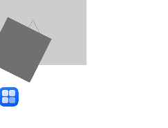

# OffscreenCanvas

<!--Kit: ArkUI-->
<!--Subsystem: ArkUI-->
<!--Owner: @camlostshi-->
<!--Designer: @fenglinbailu-->
<!--Tester: @liuli0427-->
<!--Adviser: @Brilliantry_Rui-->
<!-- md-trans-meta sourceCommit=0ac6eaf21c519d27b118617e6aaa0ba03069a649 translatedAt=2026-07-30T02:35:51.899Z pushedAt=2026-08-01T06:42:55.883Z -->

The **OffscreenCanvas** component is used to draw custom graphics.

When the [Canvas](ts-components-canvas-canvas.md) component or [CanvasRenderingContext2D](ts-canvasrenderingcontext2d.md) object is used, rendering, animation, and user interaction usually occur on the main thread of the application. Calculations related to canvas animation and rendering may affect application performance. **OffscreenCanvas** allows for rendering off the screen. This means that some tasks can be run in a separate thread to reduce the load on the main thread.

> **NOTE**
>
> This component is supported since API version 8. Updates to new APIs in later versions are marked with a superscript to indicate the initial API version of the API.
>
> **OffscreenCanvas** cannot be used in **ServiceExtensionAbility**. For offscreen drawing in **ServiceExtensionAbility**, use the [drawing module](../../apis-arkgraphics2d/arkts-apis-graphics-drawing.md) instead.

## Child Components

Not supported

## constructor

constructor(width: number, height: number)

Constructs an **OffscreenCanvas** object.

**Widget capability**: This API can be used in ArkTS widgets since API version 9.

**Atomic service API**: This API can be used in atomic services since API version 11.

**System capability**: SystemCapability.ArkUI.ArkUI.Full

**Parameters**

| Name| Type| Mandatory| Description                       |
| ------ | -------- | ---- | ------------------------------------- |
| width  | number   | Yes  | Width of the **OffscreenCanvas** component.<br>Abnormal values **NaN** and **Infinity** are treated as invalid values, and negative numbers are treated as 0.<br>Unit: vp. |
| height | number   | Yes  | Height of the **OffscreenCanvas** component.<br>Abnormal values **NaN** and **Infinity** are treated as invalid values, and negative numbers are treated as 0.<br>Unit: vp. |

## constructor<sup>12+</sup>

constructor(width: number, height: number, unit: LengthMetricsUnit)

Creates an **OffscreenCanvas** object, with support for configuring the unit mode.

**Widget capability**: This API can be used in ArkTS widgets since API version 12.

**Atomic service API**: This API can be used in atomic services since API version 12.

**Model restriction:** This API can be used only in the stage model.

**System capability**: SystemCapability.ArkUI.ArkUI.Full

**Parameters**

| Name| Type| Mandatory| Description                       |
| ------ | -------- | ---- | ------------------------------------- |
| width  | number   | Yes  | Width of the **OffscreenCanvas** component.<br>Abnormal values **NaN** and **Infinity** are treated as invalid values, and negative numbers are treated as 0.<br>The unit is determined by the unit parameter. Default unit: vp. |
| height | number   | Yes  | Height of the **OffscreenCanvas** component.<br>Abnormal values **NaN** and **Infinity** are treated as invalid values, and negative numbers are treated as 0.<br>The unit is determined by the unit parameter. Default unit: vp. |
| unit   | [LengthMetricsUnit](../js-apis-arkui-graphics.md#lengthmetricsunit12) | Yes   |  Unit mode of the **OffscreenCanvas** object. Once configured, it cannot be changed dynamically. The configuration method is the same as that of [CanvasRenderingContext2D](ts-canvasrenderingcontext2d.md). Optional values: **DEFAULT** (default unit mode, which uses vp as the unit and automatically adapts based on the screen density) and PX (px pixel unit, which is suitable for scenarios requiring precise pixel control, where the width and height values are calculated based on physical pixels).<br>Abnormal values **NaN** and **Infinity** are treated as the default value.<br>Default value: **DEFAULT**.|

## Attributes

**Widget capability**: This API can be used in ArkTS widgets since API version 9.

**Atomic service API**: This API can be used in atomic services since API version 11.

**System capability**: SystemCapability.ArkUI.ArkUI.Full

The following attributes are supported.

| Name  | Type  | Read Only| Optional| Description|
| ------ | ------ | ------ | ------- | ---- |
| width  | number | No  |  No  | Width of the **OffscreenCanvas** component.<br>Abnormal values **NaN** and **Infinity** are treated as invalid values, and negative numbers are treated as 0.<br>Unit: vp. |
| height | number | No  |  No  | Height of the **OffscreenCanvas** component.<br>Abnormal values **NaN** and **Infinity** are treated as invalid values, and negative numbers are treated as 0.<br>Unit: vp. |

### width

**Example**

```ts
// xxx.ets
@Entry
@Component
struct OffscreenCanvasPage {
  private settings: RenderingContextSettings = new RenderingContextSettings(true);
  private context: CanvasRenderingContext2D = new CanvasRenderingContext2D(this.settings);
  private offCanvas: OffscreenCanvas = new OffscreenCanvas(200, 300);

  build() {
    Flex({ direction: FlexDirection.Row, alignItems: ItemAlign.Start, justifyContent: FlexAlign.Start }) {
      Column() {
        Canvas(this.context)
          .width('100%')
          .height('100%')
          .borderWidth(5)
          .borderColor('#057D02')
          .backgroundColor('#FFFFFF')
          .onReady(() => {
            let offContext = this.offCanvas.getContext("2d", this.settings)
            offContext.fillStyle = '#CDCDCD'
            offContext.fillRect(0, 0, this.offCanvas.width, 150)
            let image = this.offCanvas.transferToImageBitmap()
            this.context.setTransform(1, 0, 0, 1, 50, 200)
            this.context.transferFromImageBitmap(image)
          })
      }
    }.width('100%').height('100%')
  }
}
```


### height

**Example**

```ts
// xxx.ets
@Entry
@Component
struct OffscreenCanvasPage {
  private settings: RenderingContextSettings = new RenderingContextSettings(true);
  private context: CanvasRenderingContext2D = new CanvasRenderingContext2D(this.settings);
  private offCanvas: OffscreenCanvas = new OffscreenCanvas(200, 300);

  build() {
    Flex({ direction: FlexDirection.Row, alignItems: ItemAlign.Start, justifyContent: FlexAlign.Start }) {
      Column() {
        Canvas(this.context)
          .width('100%')
          .height('100%')
          .borderWidth(5)
          .borderColor('#057D02')
          .backgroundColor('#FFFFFF')
          .onReady(() => {
            let offContext = this.offCanvas.getContext("2d", this.settings)
            offContext.fillStyle = '#CDCDCD'
            offContext.fillRect(0, 0, 100, this.offCanvas.height)
            let image = this.offCanvas.transferToImageBitmap()
            this.context.setTransform(1, 0, 0, 1, 50, 200)
            this.context.transferFromImageBitmap(image)
          })
      }
    }.width('100%').height('100%')
  }
}
```


## Methods

### transferToImageBitmap

transferToImageBitmap(): ImageBitmap

Creates an **ImageBitmap** object from the current content of the **OffscreenCanvas** component.

> **NOTE**
>
> After the **OffscreenCanvas** object has been passed to a Worker thread through **postMessage**, the original thread (sender) is not allowed to call the **transferToImageBitmap** method of the object. Otherwise, an exception is thrown.

**Widget capability**: This API can be used in ArkTS widgets since API version 9.

**Atomic service API**: This API can be used in atomic services since API version 11.

**System capability**: SystemCapability.ArkUI.ArkUI.Full

**Return value**

| Type                                              | Description                   |
| -------------------------------------------------- | ----------------------- |
| [ImageBitmap](ts-components-canvas-imagebitmap.md) | **ImageBitmap** object created.|

**Example**

```ts
// xxx.ets
@Entry
@Component
struct OffscreenCanvasPage {
  private settings: RenderingContextSettings = new RenderingContextSettings(true);
  private context: CanvasRenderingContext2D = new CanvasRenderingContext2D(this.settings);
  private offCanvas: OffscreenCanvas = new OffscreenCanvas(400, 600);

  build() {
    Flex({ direction: FlexDirection.Column, alignItems: ItemAlign.Center, justifyContent: FlexAlign.Center }) {
      Canvas(this.context)
        .width('100%')
        .height('100%')
        .borderWidth(5)
        .borderColor('rgb(39,135,217)')
        .backgroundColor('#FFFFFF')
        .onReady(() => {
          let offContext = this.offCanvas.getContext("2d", this.settings)
          offContext.fillStyle = '#CDCDCD'
          offContext.fillRect(0, 0, 400, 600)
          offContext.fillStyle = '#000000'
          offContext.font = '40px serif bold'
          offContext.fillText('Offscreen : Hello World!', 20, 60)
          let image = this.offCanvas.transferToImageBitmap()
          this.context.transferFromImageBitmap(image)
        })
    }
    .width('100%')
    .height('100%')
  }
}
```


### getContext<sup>10+</sup>

getContext(contextType: "2d", options?: RenderingContextSettings): OffscreenCanvasRenderingContext2D

Obtains the drawing context of the offscreen canvas.

> **NOTE**
>
> - After the **OffscreenCanvas** object uses **getContext** to obtain the drawing context, the object cannot be passed to any other thread through **postMessage**. Otherwise, an exception is thrown.
>
> - After the **OffscreenCanvas** object has been passed to a Worker thread through **postMessage**, the original thread (sender) is not allowed to call the **getContext** method of the object. Otherwise, an exception is thrown.

**Atomic service API**: This API can be used in atomic services since API version 11.

**Model restriction:** This API can be used only in the stage model.

**System capability**: SystemCapability.ArkUI.ArkUI.Full

**Parameters**

| Name | Type| Mandatory| Description   |
| ----------- | ------------------------------------------------------------ | ---- | ------------------------------------------------------------ |
| contextType | string | Yes  | Type of the drawing context of the **OffscreenCanvas** component. Currently, only the "2d" type is supported.<br>"2d": Creates an **OffscreenCanvasRenderingContext2D** object that represents a 2D rendering context.<br>The abnormal values **undefined** and **null** are treated as invalid values, and the API returns **undefined**.|
| options      | [RenderingContextSettings](ts-canvasrenderingcontext2d.md#renderingcontextsettings) | No | Parameters used to configure the **OffscreenCanvasRenderingContext2D** object. See [RenderingContextSettings](ts-canvasrenderingcontext2d.md#renderingcontextsettings). This parameter is passed when custom rendering context settings (such as enabling antialiasing) are required. If not passed, the default settings are used (**antialias** defaults to **false**).<br>The abnormal values **undefined** and **null** are treated as the default values of [RenderingContextSettings](ts-canvasrenderingcontext2d.md#renderingcontextsettings).<br>Default value: **null** |

**Return value**

| Type                                                        | Description                             |
| ------------------------------------------------------------ | --------------------------------- |
| [OffscreenCanvasRenderingContext2D](ts-offscreencanvasrenderingcontext2d.md) | Drawing context of the offscreen canvas. If the input parameter **contextType** of the **getContext** method is not **"2d"** (including null or undefined), **undefined** will be returned. Before using the method, check whether the return value is **undefined**.|

**Example**

```ts
@Entry
@Component
struct OffscreenCanvasExamplePage {
  private settings: RenderingContextSettings = new RenderingContextSettings(true);
  private context: CanvasRenderingContext2D = new CanvasRenderingContext2D(this.settings);
  private offscreenCanvas: OffscreenCanvas = new OffscreenCanvas(600, 800);

  build() {
    Flex({ direction: FlexDirection.Row, alignItems: ItemAlign.Start, justifyContent: FlexAlign.Start }) {
      Column() {
        Canvas(this.context)
          .width('100%')
          .height('100%')
          .backgroundColor('#FFFFFF')
          .onReady(() => {
            let offContext = this.offscreenCanvas.getContext("2d", this.settings)
            offContext.font = '70px sans-serif'
            offContext.fillText('Offscreen : Hello World!', 20, 60)
            offContext.fillStyle = '#0000ff'
            offContext.fillRect(230, 350, 50, 50)
            offContext.fillStyle = '#EE0077'
            offContext.translate(70, 70)
            offContext.fillRect(230, 350, 50, 50)
            offContext.fillStyle = '#77EE0077'
            offContext.translate(-70, -70)
            offContext.fillStyle = '#00ffff'
            offContext.rotate(45 * Math.PI / 180);
            offContext.fillRect(180, 120, 50, 50);
            offContext.rotate(-45 * Math.PI / 180);
            offContext.beginPath()
            offContext.moveTo(10, 150)
            offContext.bezierCurveTo(20, 100, 200, 100, 200, 20)
            offContext.stroke()
            offContext.fillStyle = '#FF00FF'
            offContext.fillRect(100, 100, 60, 60)
            let imageData = this.offscreenCanvas.transferToImageBitmap()
            this.context.transferFromImageBitmap(imageData)
          })
      }.width('100%').height('100%')
    }
    .width('100%')
    .height('100%')
  }
}
```


## Concurrent Thread Drawing

Since API version 11, when an app creates a [worker thread](../../../arkts-utils/worker-introduction.md), it can use **postMessage** to pass the **OffscreenCanvas** instance to the worker for drawing, and use **onmessage** to receive the **ImageBitmap** object sent by the worker thread for display.

> **NOTE**
>
> After the **OffscreenCanvas** object uses **getContext** to obtain the drawing context, the object cannot be passed to any other thread through **postMessage**. Otherwise, an exception is thrown.
>
> After the **OffscreenCanvas** object has been passed to a Worker thread through **postMessage**, the original thread (sender) is not allowed to call the **getContext** or **transferToImageBitmap** method of the object. Otherwise, an exception is thrown.
>
> After the **OffscreenCanvas** object has been passed to a Worker thread through **postMessage**, the object cannot be passed to other threads through **postMessage** again. Otherwise, an exception is thrown.
>
> The previewer of DevEco Studio does not support displaying content drawn in a worker thread.

**Example**

```ts
import { worker } from '@kit.ArkTS';
import { BusinessError } from '@kit.BasicServicesKit';
import { image } from '@kit.ImageKit';
import { resourceManager } from '@kit.LocalizationKit';
import { common } from '@kit.AbilityKit';

@Entry
@Component
struct OffscreenCanvasExamplePage {
  private settings: RenderingContextSettings = new RenderingContextSettings(true);
  private context: CanvasRenderingContext2D = new CanvasRenderingContext2D(this.settings);
  private myWorker = new worker.ThreadWorker('entry/ets/workers/Worker.ets');
  private imgPixelMap: image.PixelMap | undefined = undefined

  aboutToAppear(): void {
    let context = this.getUIContext().getHostContext() as common.UIAbilityContext;
    const resourceMgr: resourceManager.ResourceManager = context.resourceManager;
    try {
      this.imgPixelMap = resourceMgr.getDrawableDescriptor($r("app.media.startIcon").id).getPixelMap();
    } catch (error) {
      console.error(`resourceMgr getDrawableDescriptor error, error code: ${(error as BusinessError).code}`);
    }
  }

  build() {
    Flex({ direction: FlexDirection.Row, alignItems: ItemAlign.Start, justifyContent: FlexAlign.Start }) {
      Column() {
        Canvas(this.context)
          .width('100%')
          .height('100%')
          .borderWidth(5)
          .borderColor('#057D02')
          .backgroundColor('#FFFFFF')
          .onReady(() => {
            let offCanvas = new OffscreenCanvas(600, 800)
            // Draw an image in the worker thread.
            this.myWorker.postMessage({ myOffCanvas: offCanvas, imgPixelMap: this.imgPixelMap });
            this.myWorker.onmessage = (e): void => {
              if (e.data.myImage) {
                let image: ImageBitmap = e.data.myImage
                this.context.transferFromImageBitmap(image)
              }
            }
          })
      }
      .width('100%')
      .height('100%')
    }
    .width('100%')
    .height('100%')
  }
}
```

After the main thread sends the **OffscreenCanvas** instance through **postMessage**, the worker thread can receive it in **onmessage** for display.

```ts
// entry/src/main/ets/workers/Worker.ets
import { MessageEvents, ThreadWorkerGlobalScope, worker } from '@kit.ArkTS';
import { image } from '@kit.ImageKit';

const workerPort: ThreadWorkerGlobalScope = worker.workerPort;

workerPort.onmessage = (e: MessageEvents) => {
  if (e.data.myOffCanvas) {
    let offCanvas: OffscreenCanvas = e.data.myOffCanvas
    let offContext = offCanvas.getContext("2d")
    offContext.fillStyle = '#CDCDCD'
    offContext.fillRect(0, 0, 200, 150)

    let imgPixelMap: image.PixelMap = e.data.imgPixelMap
    let imgBitmap: ImageBitmap = new ImageBitmap(imgPixelMap)
    offContext.drawImage(imgBitmap, 0, 200)

    let path2d = new Path2D("M250 150 L150 350 L350 350 Z")
    offContext.stroke(path2d)

    let matrix: Matrix2D = new Matrix2D()
    matrix.scaleX = 1
    matrix.scaleY = 1
    matrix.rotateX = -0.5
    matrix.rotateY = 0.5
    matrix.translateX = 10
    matrix.translateY = 10
    offContext.setTransform(matrix)
    offContext.fillStyle = "#707070"
    offContext.fillRect(20, 20, 100, 100)

    let image = offCanvas.transferToImageBitmap()
    workerPort.postMessage({ myImage: image });
  }
}
```

