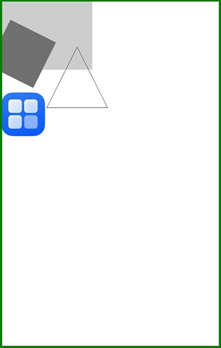

#  OffscreenCanvas
<!--Kit: ArkUI-->
<!--Subsystem: ArkUI-->
<!--Owner: @sd-wu-->
<!--Designer: @sunbees-->
<!--Tester: @liuli0427-->
<!--Adviser: @HelloCrease-->

The **OffscreenCanvas** component is used to draw custom graphics.

When the [Canvas](ts-components-canvas-canvas.md) component or [CanvasRenderingContext2D](ts-canvasrenderingcontext2d.md) is used, rendering, animation, and user interaction usually occur on the main thread of the application. Calculations related to canvas animation and rendering may affect application performance. **OffscreenCanvas** allows for rendering off the screen. This means that some tasks can be run in a separate thread to reduce the load on the main thread.

> **NOTE**
>
> This component is supported since API version 8. Updates will be marked with a superscript to indicate their earliest API version.
>
> OffscreenCanvas cannot be used in ServiceExtensionAbility. It is recommended that you use the [drawing module](../../apis-arkgraphics2d/arkts-apis-graphics-drawing.md) for offscreen drawing in ServiceExtensionAbility.

## Child Components

Not supported

## Constructor

### constructor

constructor(width: number, height: number)

Constructs an OffscreenCanvas for creating an offscreen canvas object.

**Widget capability**: This API can be used in ArkTS widgets since API version 9.

**Atomic service API**: This API can be used in atomic services since API version 11.

**System capability**: SystemCapability.ArkUI.ArkUI.Full

**Parameters**

| Name| Type| Mandatory| Description                       |
| ------ | -------- | ---- | ------------------------------------- |
| width  | number   | Yes | Width of the offscreen canvas.<br>**NaN** and **Infinity** are treated as invalid values.<br>Default unit: vp|
| height | number   | Yes | Height of the offscreen canvas.<br>**NaN** and **Infinity** are treated as invalid values.<br>Default unit: vp|

### constructor<sup>12+</sup>

constructor(width: number, height: number, unit: LengthMetricsUnit)

Constructs an OffscreenCanvas for creating an offscreen canvas object. The unit mode of the OffscreenCanvas can be configured.

**Widget capability**: This API can be used in ArkTS widgets since API version 12.

**Atomic service API**: This API can be used in atomic services since API version 12.

**System capability**: SystemCapability.ArkUI.ArkUI.Full

**Parameters**

| Name| Type| Mandatory| Description                       |
| ------ | -------- | ---- | ------------------------------------- |
| width  | number   | Yes | Width of the offscreen canvas.<br>**NaN** and **Infinity** are treated as invalid values.<br>Default unit: vp|
| height | number   | Yes | Height of the offscreen canvas.<br>**NaN** and **Infinity** are treated as invalid values.<br>Default unit: vp|
| unit   | [LengthMetricsUnit](../js-apis-arkui-graphics.md#lengthmetricsunit12) | Yes  |  Unit mode of the OffscreenCanvas object. The value cannot be dynamically changed once set. The configuration method is the same as that of [CanvasRenderingContext2D](ts-canvasrenderingcontext2d.md).<br>Invalid values **NaN** and **Infinity** are treated as the default value.<br>Default value: **DEFAULT**.|

## Attributes

**Widget capability**: This API can be used in ArkTS widgets since API version 9.

**Atomic service API**: This API can be used in atomic services since API version 11.

**System capability**: SystemCapability.ArkUI.ArkUI.Full

The following attributes are supported.

| Name  | Type  | Read Only| Optional| Description|
| ------ | ------ | ------ | ------- | ---- |
| width  | number | No |  No | Width of the offscreen canvas.<br>Default unit: vp|
| height | number | No |  No | Height of the offscreen canvas.<br>Default unit: vp|

### width

```ts
// xxx.ets
@Entry
@Component
struct OffscreenCanvasPage {
  private settings: RenderingContextSettings = new RenderingContextSettings(true);
  private context: CanvasRenderingContext2D = new CanvasRenderingContext2D(this.settings);
  private offCanvas: OffscreenCanvas = new OffscreenCanvas(200, 300);

  build() {
    Flex({ direction: FlexDirection.Row, alignItems: ItemAlign.Start, justifyContent: FlexAlign.Start }) {
      Column() {
        Canvas(this.context)
          .width('100%')
          .height('100%')
          .borderWidth(5)
          .borderColor('#057D02')
          .backgroundColor('#FFFFFF')
          .onReady(() => {
            let offContext = this.offCanvas.getContext("2d", this.settings)
            offContext.fillStyle = '#CDCDCD'
            offContext.fillRect(0, 0, this.offCanvas.width, 150)
            let image = this.offCanvas.transferToImageBitmap()
            this.context.setTransform(1, 0, 0, 1, 50, 200)
            this.context.transferFromImageBitmap(image)
          })
      }
    }.width('100%').height('100%')
  }
}
```


### height

```ts
// xxx.ets
@Entry
@Component
struct OffscreenCanvasPage {
  private settings: RenderingContextSettings = new RenderingContextSettings(true);
  private context: CanvasRenderingContext2D = new CanvasRenderingContext2D(this.settings);
  private offCanvas: OffscreenCanvas = new OffscreenCanvas(200, 300);

  build() {
    Flex({ direction: FlexDirection.Row, alignItems: ItemAlign.Start, justifyContent: FlexAlign.Start }) {
      Column() {
        Canvas(this.context)
          .width('100%')
          .height('100%')
          .borderWidth(5)
          .borderColor('#057D02')
          .backgroundColor('#FFFFFF')
          .onReady(() => {
            let offContext = this.offCanvas.getContext("2d", this.settings)
            offContext.fillStyle = '#CDCDCD'
            offContext.fillRect(0, 0, 100, this.offCanvas.height)
            let image = this.offCanvas.transferToImageBitmap()
            this.context.setTransform(1, 0, 0, 1, 50, 200)
            this.context.transferFromImageBitmap(image)
          })
      }
    }.width('100%').height('100%')
  }
}
```


## Methods

### transferToImageBitmap

transferToImageBitmap(): ImageBitmap

Creates an **ImageBitmap** object from the most recently rendered image of the offscreen canvas.

**Widget capability**: This API can be used in ArkTS widgets since API version 9.

**Atomic service API**: This API can be used in atomic services since API version 11.

**System capability**: SystemCapability.ArkUI.ArkUI.Full

**Return value**

| Type                                              | Description                   |
| -------------------------------------------------- | ----------------------- |
| [ImageBitmap](ts-components-canvas-imagebitmap.md) | **ImageBitmap** object created.|

**Example**

```ts
// xxx.ets
@Entry
@Component
struct OffscreenCanvasPage {
  private settings: RenderingContextSettings = new RenderingContextSettings(true);
  private context: CanvasRenderingContext2D = new CanvasRenderingContext2D(this.settings);
  private offCanvas: OffscreenCanvas = new OffscreenCanvas(400, 600);

  build() {
    Flex({ direction: FlexDirection.Column, alignItems: ItemAlign.Center, justifyContent: FlexAlign.Center }) {
      Canvas(this.context)
        .width('100%')
        .height('100%')
        .borderWidth(5)
        .borderColor('rgb(39,135,217)')
        .backgroundColor('#FFFFFF')
        .onReady(() => {
          let offContext = this.offCanvas.getContext("2d", this.settings)
          offContext.fillStyle = '#CDCDCD'
          offContext.fillRect(0, 0, 400, 600)
          offContext.fillStyle = '#000000'
          offContext.font = '40px serif bold'
          offContext.fillText("Offscreen : Hello World!", 20, 60)
          let image = this.offCanvas.transferToImageBitmap()
          this.context.transferFromImageBitmap(image)
        })
    }
    .width('100%')
    .height('100%')
  }
}
```


### getContext<sup>10+</sup>

getContext(contextType: "2d", options?: RenderingContextSettings): OffscreenCanvasRenderingContext2D

Obtains the drawing context of the offscreen canvas.

**Atomic service API**: This API can be used in atomic services since API version 11.

**System capability**: SystemCapability.ArkUI.ArkUI.Full

**Parameters**

| Name | Type| Mandatory| Description   |
| ----------- | ------------------------------------------------------------ | ---- | ------------------------------------------------------------ |
| contextType | string | Yes  | Type of the drawing context of the offscreen canvas. The value can only be **"2d"**.<br>2d: Creates an OffscreenCanvasRenderingContext2D object that represents the 2D rendering context.<br>Abnormal values undefined and null are processed as invalid values. The current interface returns undefined.|
| options      | [RenderingContextSettings](ts-canvasrenderingcontext2d.md#renderingcontextsettings) | No| Parameters of the **OffscreenCanvasRenderingContext2D** object. For details, see [RenderingContextSettings](ts-canvasrenderingcontext2d.md#renderingcontextsettings).<br>Undefined and null values are processed based on the default value of [RenderingContextSettings](ts-canvasrenderingcontext2d.md#renderingcontextsettings).<br>Default value: **null**.|

**Return value**

| Type                                                        | Description                             |
| ------------------------------------------------------------ | --------------------------------- |
| [OffscreenCanvasRenderingContext2D](ts-offscreencanvasrenderingcontext2d.md) | Drawing context of the offscreen canvas. If the input parameter contextType of the getContext method is not 2d (including null or undefined), undefined is returned. Before using the method, check whether the return value is undefined.|

**Example**

```ts
@Entry
@Component
struct OffscreenCanvasExamplePage {
  private settings: RenderingContextSettings = new RenderingContextSettings(true);
  private context: CanvasRenderingContext2D = new CanvasRenderingContext2D(this.settings);
  private offscreenCanvas: OffscreenCanvas = new OffscreenCanvas(600, 800);

  build() {
    Flex({ direction: FlexDirection.Row, alignItems: ItemAlign.Start, justifyContent: FlexAlign.Start }) {
      Column() {
        Canvas(this.context)
          .width('100%')
          .height('100%')
          .backgroundColor('#FFFFFF')
          .onReady(() => {
            let offContext = this.offscreenCanvas.getContext("2d", this.settings)
            offContext.font = '70px sans-serif'
            offContext.fillText("Offscreen : Hello World!", 20, 60)
            offContext.fillStyle = "#0000ff"
            offContext.fillRect(230, 350, 50, 50)
            offContext.fillStyle = "#EE0077"
            offContext.translate(70, 70)
            offContext.fillRect(230, 350, 50, 50)
            offContext.fillStyle = "#77EE0077"
            offContext.translate(-70, -70)
            offContext.fillStyle = "#00ffff"
            offContext.rotate(45 * Math.PI / 180);
            offContext.fillRect(180, 120, 50, 50);
            offContext.rotate(-45 * Math.PI / 180);
            offContext.beginPath()
            offContext.moveTo(10, 150)
            offContext.bezierCurveTo(20, 100, 200, 100, 200, 20)
            offContext.stroke()
            offContext.fillStyle = '#FF00FF'
            offContext.fillRect(100, 100, 60, 60)
            let imageData = this.offscreenCanvas.transferToImageBitmap()
            this.context.transferFromImageBitmap(imageData)
          })
      }.width('100%').height('100%')
    }
    .width('100%')
    .height('100%')
  }
}
```


## Concurrent Thread Drawing

Since API version 11, when an application creates a [worker thread](../../../arkts-utils/worker-introduction.md), it can use **postMessage** to pass the **OffscreenCanvas** instance to the worker thread for drawing, and use **onmessage** to receive the drawing results sent by the worker thread for display.

> **NOTE**
>
> After the **OffscreenCanvas** instance uses **getContext** to obtain the drawing context, it cannot be passed to other threads through **postMessage**. Otherwise, an exception is thrown.
>
> After an **OffscreenCanvas** object is passed to a thread through **postMessage**, it cannot use the **getContext** or **transferToImageBitmap** APIs. Otherwise, an exception is thrown.
>
> After an **OffscreenCanvas** object is passed to a thread through **postMessage**, it cannot be passed to any other thread through **postMessage**. Otherwise, an exception is thrown.
>
> The content drawn in the Worker thread cannot be previewed in DevEco Studio Previewer.

**Example**

```ts
import { worker } from '@kit.ArkTS';
import { image } from '@kit.ImageKit';
import { resourceManager } from '@kit.LocalizationKit';
import { common } from '@kit.AbilityKit';

@Entry
@Component
struct OffscreenCanvasExamplePage {
  private settings: RenderingContextSettings = new RenderingContextSettings(true);
  private context: CanvasRenderingContext2D = new CanvasRenderingContext2D(this.settings);
  private myWorker = new worker.ThreadWorker('entry/ets/workers/Worker.ts');
  private imgPixelMap: image.PixelMap | undefined = undefined

  aboutToAppear(): void {
    let context = this.getUIContext().getHostContext() as common.UIAbilityContext;
    const resourceMgr: resourceManager.ResourceManager = context.resourceManager;
    this.imgPixelMap = resourceMgr.getDrawableDescriptor($r("app.media.startIcon").id).getPixelMap()
  }

  build() {
    Flex({ direction: FlexDirection.Row, alignItems: ItemAlign.Start, justifyContent: FlexAlign.Start }) {
      Column() {
        Canvas(this.context)
          .width('100%')
          .height('100%')
          .borderWidth(5)
          .borderColor('#057D02')
          .backgroundColor('#FFFFFF')
          .onReady(() => {
            let offCanvas = new OffscreenCanvas(600, 800)
            this.myWorker.postMessage({ myOffCanvas: offCanvas, imgPixelMap: this.imgPixelMap });
            this.myWorker.onmessage = (e): void => {
              if (e.data.myImage) {
                let image: ImageBitmap = e.data.myImage
                this.context.transferFromImageBitmap(image)
              }
            }
          })
      }
      .width('100%')
      .height('100%')
    }
    .width('100%')
    .height('100%')
  }
}
```

After the main thread sends the **OffscreenCanvas** instance through **postMessage**, the worker thread can receive it in **onmessage** for display.

```ts
import { ErrorEvent, MessageEvents, ThreadWorkerGlobalScope, worker } from '@kit.ArkTS';
import { image } from '@kit.ImageKit';

const workerPort: ThreadWorkerGlobalScope = worker.workerPort;

workerPort.onmessage = (e: MessageEvents) => {
  if (e.data.myOffCanvas) {
    let offCanvas: OffscreenCanvas = e.data.myOffCanvas
    let offContext = offCanvas.getContext("2d")
    offContext.fillStyle = '#CDCDCD'
    offContext.fillRect(0, 0, 200, 150)

    let imgPixelMap: image.PixelMap = e.data.imgPixelMap
    let imgBitmap: ImageBitmap = new ImageBitmap(imgPixelMap)
    offContext.drawImage(imgBitmap, 0, 200)

    let path2d = new Path2D("M250 150 L150 350 L350 350 Z")
    offContext.stroke(path2d)

    let matrix: Matrix2D = new Matrix2D()
    matrix.scaleX = 1
    matrix.scaleY = 1
    matrix.rotateX = -0.5
    matrix.rotateY = 0.5
    matrix.translateX = 10
    matrix.translateY = 10
    offContext.setTransform(matrix)
    offContext.fillStyle = "#707070"
    offContext.fillRect(20, 20, 100, 100)

    let image = offCanvas.transferToImageBitmap()
    workerPort.postMessage({ myImage: image });
  }
}
```


<!--no_check-->