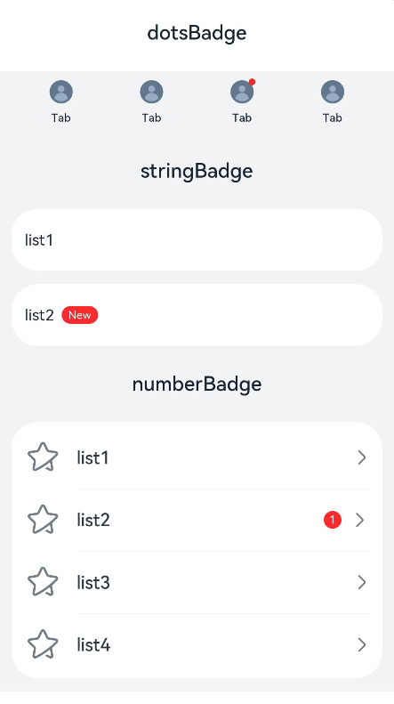
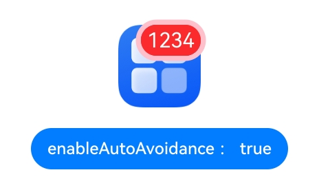

# Badge

<!--Kit: ArkUI-->
<!--Subsystem: ArkUI-->
<!--Owner: @Zhang-Dong-hui-->
<!--Designer: @xiangyuan6-->
<!--Tester:@jiaoaozihao-->
<!--Adviser: @Brilliantry_Rui-->
<!-- md-trans-meta sourceCommit=fd10fbb9e5b5e2e1e561a46b9ca4925a29d1a0a3 translatedAt=2026-06-30T12:27:26.256Z pushedAt=2026-07-02T09:00:03.436Z -->

The **Badge** component is a container that can be attached to another component for notification and reminder purposes.

>  **NOTE**
>
> This component is supported since API version 7. Updates will be marked with a superscript to indicate their earliest API version.

## Child Components

This component supports only one child component.

>  **NOTE**
>
> - Allowed child component types: built-in and custom components, including rendering control types ([if/else](../../../ui/rendering-control/arkts-rendering-control-ifelse.md), [ForEach](../../../ui/rendering-control/arkts-rendering-control-foreach.md), and [LazyForEach](../../../ui/rendering-control/arkts-rendering-control-lazyforeach.md)).
>
> - A custom component defaults to a width and height of 0. You must explicitly set its width and height; otherwise, the **Badge** component will not be displayed.
>
> - When there are multiple child components, only the last child component is displayed on the UI. However, the status update of other child components will still cause the badge and its child components to be re-rendered.
>
> - Child component layout is independent and does not automatically adjust to avoid overlapping with the badge.

## APIs

### Badge

Badge(value: BadgeParamWithNumber)

Creates a badge with the given numerical value.

**Widget capability**: This API can be used in ArkTS widgets since API version 9.

**Atomic service API**: This API can be used in atomic services since API version 11.

**System capability**: SystemCapability.ArkUI.ArkUI.Full

**Parameters**

| Name| Type| Mandatory| Description|
| -------- | -------- | -------- | -------- |
| value |  [BadgeParamWithNumber](#badgeparamwithnumber)| Yes| Options of the numeric badge.|

### Badge

Badge(value: BadgeParamWithString)

Creates a badge with the given string.

**Widget capability**: This API can be used in ArkTS widgets since API version 9.

**Atomic service API**: This API can be used in atomic services since API version 11.

**System capability**: SystemCapability.ArkUI.ArkUI.Full

This component supports the scaling effect for visibility transition since API version 12.

**Parameters**

| Name| Type                                             | Mandatory| Description            |
| ------ | ----------------------------------------------------- | ---- | -------------------- |
| value  | [BadgeParamWithString](#badgeparamwithstring) | Yes  | Options of the string-type badge.|

## BadgeParam

Provides basic parameters for creating a badge.

**Widget capability**: This API can be used in ArkTS widgets since API version 9.

**Atomic service API**: This API can be used in atomic services since API version 11.

**System capability**: SystemCapability.ArkUI.ArkUI.Full

| Name| Type| Read-Only| Optional| Description|
| -------- | -------- | -------- | -------- | -------- |
| position | [BadgePosition](#badgeposition)\|[Position<sup>10+</sup>](ts-types.md#position)| No| Yes| Position to display the badge relative to the parent component.<br>Default value: **BadgePosition.RightTop**<br>**NOTE**<br> With the **Position** type, percentage values are not supported. If an invalid value is set, the default value **(0,0)**, which indicates the upper left corner of the component, will be used.<br>With the **BadgePosition** type, the position is mirrored based on the [Direction](ts-appendix-enums.md#direction) property.|
| style | [BadgeStyle](#badgestyle) | No | No | Style of the **Badge** component, including the text color, text size, badge color, and badge size. |

## BadgeParamWithNumber

Inherits from [BadgeParam](#badgeparam) and has all attributes of **BadgeParam**.

**Widget capability**: This API can be used in ArkTS widgets since API version 9.

**Atomic service API**: This API can be used in atomic services since API version 11.

**System capability**: SystemCapability.ArkUI.ArkUI.Full

| Name| Type| Read-Only| Optional| Description|
| -------- | -------- | -------- | -------- | -------- |
| count | number | No| No| Number of notifications.<br>**NOTE**<br>If the value is less than or equal to 0 and less than the value of **maxCount**, no badge is displayed.<br>Value range: [-2147483648, 2147483647]. If the value is out of the range, 4294967296 is added or subtracted so that the value is within the range. If the value is not an integer, it is rounded off to the nearest integer. For example, 5.5 is rounded off to 5.|
| maxCount | number | No| Yes| Maximum number of messages. If the number of messages exceeds the maximum, only **maxCount+** is displayed. For example, if **maxCount** is 99, **99+** is displayed.<br>Default value: **99**<br>Value range: [-2147483648, 2147483647]. If the value is out of the range, 4294967296 is added or subtracted so that the value is within the range. If the value is not an integer, it is rounded off to the nearest integer. For example, 5.5 is rounded off to 5.|

## BadgeParamWithString

Inherits from [BadgeParam](#badgeparam) and has all attributes of **BadgeParam**.

**Widget capability**: This API can be used in ArkTS widgets since API version 9.

**Atomic service API**: This API can be used in atomic services since API version 11.

**System capability**: SystemCapability.ArkUI.ArkUI.Full

| Name| Type| Read-Only| Optional| Description|
| -------- | -------- | -------- | -------- | -------- |
| value | [ResourceStr](ts-types.md#resourcestr) | No| No| Text string of the badge content.<br>**NOTE**<br>The ResourceStr type is supported since API version 20.|

## BadgePosition

Enumerates the display positions of a badge.

**Widget capability**: This API can be used in ArkTS widgets since API version 9.

**Atomic service API**: This API can be used in atomic services since API version 11.

**System capability**: SystemCapability.ArkUI.ArkUI.Full

| Name| Value| Description|
| -------- | -------- |-------- |
| RightTop | - | Upper right corner. |
| Right | - | Vertical center on the right. |
| Left | - | Vertical center on the left. |

## BadgeStyle

Defines the style of the **Badge** component, including text color, text size, font weight, badge color, and badge size.

**System capability**: SystemCapability.ArkUI.ArkUI.Full

| Name                     | Type                                                        | Read-Only| Optional| Description                                                        |
| ------------------------- | ------------------------------------------------------------ | ---- | ---- | ------------------------------------------------------------ |
| color                     | [ResourceColor](ts-types.md#resourcecolor)                   | No  | Yes  | Font color.<br>Default value: **Color.White**<br>**Widget capability**: This API can be used in ArkTS widgets since API version 9.<br>**Atomic service API**: This API can be used in atomic services since API version 11.|
| fontSize                  | number&nbsp;\|&nbsp;[ResourceStr](ts-types.md#resourcestr)   | No   | Yes   | Text size. The string type supports the string format of a number value, with optional units including px, vp, fp, and lpx, for example, **10** or **10fp**. If no unit is specified, the default unit is **fp**.<br/>Default value: **10vp**<br/>Default unit: fp<br/>
The value must be greater than 0; if the value is 0, the text is not displayed; if the value is less than 0, the default value is used.<br/>Note:<br/>1. Percentage value is not supported. If a percentage value is set, the default value is used.<br/>2. Since API version 20, the ResourceStr type is supported.<br/>**Widget capability:** This API can be used in ArkTS widgets since API version 9.<br/>**Atomic service API:** This API can be used in atomic services since API version 11. |
| badgeSize                 | number&nbsp;\|&nbsp;[ResourceStr](ts-types.md#resourcestr)   | No   | Yes   | Size of the badge. The string type supports the string format of a number value, with optional units including px, vp, fp, and lpx, for example, 16 or **16fp**. If no unit is specified, the default unit is fp.<br/>Default value: **16vp**<br/>Default unit: fp<br/>
The value must be greater than 0; if the value is 0, the badge is not displayed; if the value is less than 0, the default value is used.<br/>Note:<br/>1. Percentage value is not supported. If a percentage value is set, the default value is used.<br/>2. Since API version 20, the ResourceStr type is supported.<br/>3. When **fontSize** is set and **badgeSize** is less than **fontSize**, **badgeSize** takes effect based on **fontSize**.<br/>**Widget capability:** This API can be used in ArkTS widgets since API version 9.<br/>**Atomic service API:** This API can be used in atomic services since API version 11. |
| badgeColor                | [ResourceColor](ts-types.md#resourcecolor)                   | No  | Yes  | Badge color.<br>Default value: **Color.Red**<br>**Widget capability**: This API can be used in ArkTS widgets since API version 9.<br>**Atomic service API**: This API can be used in atomic services since API version 11.|
| fontWeight<sup>10+</sup>  | number \|[FontWeight](ts-appendix-enums.md#fontweight) \|&nbsp;[ResourceStr](ts-types.md#resourcestr) | No   | Yes   | Font weight of the text. The number type value range is [100, 900], with an interval of 100. A larger value indicates a heavier font weight. If the number type value is outside the range, the default value **400** is used. The string type supports the string format of a number value, for example, **400**, as well as **bold**, **bolder**, **lighter**, **regular**, and **medium**, which correspond to the respective enum values in **FontWeight**.<br/>Default value: **FontWeight.Normal**<br/>Note:<br/>Percentage value is not supported. If a percentage value is set, the default value is used. Since API version 20, the ResourceStr type is supported.<br/>**Atomic service API:** This API can be used in atomic services since API version 11.<br/>**Model restriction:** This API can be used only in the stage model. |
| borderColor<sup>10+</sup> | [ResourceColor](ts-types.md#resourcecolor)                   | No   | Yes   | Border color of the badge background.<br/>Default value: **Color.Red**<br/>**Atomic service API:** This API can be used in atomic services since API version 11.<br/>**Model restriction:** This API can be used only in the stage model.     |
| borderWidth<sup>10+</sup> | [Length](ts-types.md#length)                                 | No   | Yes   | Border width of the badge background.<br/>Default value: **1**<br/>Unit: vp<br/>Note:<br/>Percentage value is not supported. If a percentage value is set, the default value is used.<br/>**Atomic service API:** This API can be used in atomic services since API version 11.<br/>**Model restriction:** This API can be used only in the stage model. |
| outerBorderColor<sup>22+</sup> | [ResourceColor](ts-types.md#resourcecolor)                   | No   | Yes   | Outer border color of the badge background.<br/>Default value: **Color.White**<br/>**Atomic service API:** This API can be used in atomic services since API version 22.<br/>**Model restriction:** This API can be used only in the stage model.   |
| outerBorderWidth<sup>22+</sup> | [LengthMetrics](../js-apis-arkui-graphics.md#lengthmetrics12)                   | No   | Yes   | Outer border width of the badge background.<br/>Default value: **0**<br/>Unit: vp<br/>Percentage value is not supported. If a percentage value is set, the default value is used.<br/>**Atomic service API:** This API can be used in atomic services since API version 22.<br/>**Model restriction:** This API can be used only in the stage model. |
| enableAutoAvoidance<sup>22+</sup> | boolean                                 | No   | Yes   | Whether to enable avoidance when the badge text extends its display.<br/>**true**: yes; **false**: no.<br/>Default value: **true**<br/> Note:<br/>1. The avoidance effect is that the badge text extends its display toward the inside of the component.<br/>2. When the outer border width is greater than 0, the extension starting point of the badge is the inner side of the outer border.<br/>3. When **position** is set to specific coordinate values, the badge does not perform avoidance processing.<br/>**Atomic service API:** This API can be used in atomic services since API version 22.<br/>**Model restriction:** This API can be used only in the stage model.|

> **NOTE**
> When **borderWidth** is greater than 0 and **borderColor** differs from **badgeColor**, the badge is drawn first, followed by the border. Due to anti-aliasing of edge pixels, semi-transparent pixels are generated, resulting in border lines in the **badgeColor** at the four corners. To implement related scenarios, it is recommended to use the [Text](ts-basic-components-text.md) component with [outline](ts-universal-attributes-outline.md#outline) instead of the **Badge** component.

## Attributes

The [universal attributes](ts-component-general-attributes.md) are supported.

## Events

The [universal events](ts-component-general-events.md) are supported.

## Example

### Example 1: Setting the Badge Content

This example uses the **count** parameter of [BadgeParamWithNumber](#badgeparamwithnumber) and the **value** parameter of [BadgeParamWithString](#badgeparamwithstring) to demonstrate how the badge component displays different effects when empty values, characters, and numbers are passed in.

```ts
// xxx.ets
@Entry
@Component
struct BadgeExample {
  @Builder
  tabBuilder(index: number) {
    Column() {
      if (index === 2) {
        Badge({
          value: '',
          style: { badgeSize: 6, badgeColor: '#FA2A2D' }
        }) {
          Image('/common/public_icon_off.svg')
            .width(24)
            .height(24)
        }
        .width(24)
        .height(24)
        .margin({ bottom: 4 })
      } else {
        Image('/common/public_icon_off.svg')
          .width(24)
          .height(24)
          .margin({ bottom: 4 })
      }
      Text('Tab')
        .fontColor('#182431')
        .fontSize(10)
        .fontWeight(500)
        .lineHeight(14)
    }.width('100%').height('100%').justifyContent(FlexAlign.Center)
  }

  @Builder
  itemBuilder(value: string) {
    Row() {
      Image('common/public_icon.svg').width(32).height(32).opacity(0.6)
      Text(value)
        .width(177)
        .height(21)
        .margin({ left: 15, right: 76 })
        .textAlign(TextAlign.Start)
        .fontColor('#182431')
        .fontWeight(500)
        .fontSize(16)
        .opacity(0.9)
      Image('common/public_icon_arrow_right.svg').width(12).height(24).opacity(0.6)
    }.width('100%').padding({ left: 12, right: 12 }).height(56)
  }

  build() {
    Column() {
      // Badge of the red dot type
      Text('dotsBadge').fontSize(18).fontColor('#182431').fontWeight(500).margin(24)
      Tabs() {
        TabContent()
          .tabBar(this.tabBuilder(0))
        TabContent()
          .tabBar(this.tabBuilder(1))
        TabContent()
          .tabBar(this.tabBuilder(2))
        TabContent()
          .tabBar(this.tabBuilder(3))
      }
      .width(360)
      .height(56)
      .backgroundColor('#F1F3F5')

      // Create a badge with the given string.
      Column() {
        Text('stringBadge').fontSize(18).fontColor('#182431').fontWeight(500).margin(24)
        List({ space: 12 }) {
          ListItem() {
            Text('list1').fontSize(14).fontColor('#182431').margin({ left: 12 })
          }
          .width('100%')
          .height(56)
          .backgroundColor('#FFFFFF')
          .borderRadius(24)
          .align(Alignment.Start)

          ListItem() {
            Badge({
              value: 'New',
              position: BadgePosition.Right,
              style: { badgeSize: 16, badgeColor: '#FA2A2D' }
            }) {
              Text('list2').width(27).height(19).fontSize(14).fontColor('#182431')
            }.width(49.5).height(19)
            .margin({ left: 12 })
          }
          .width('100%')
          .height(56)
          .backgroundColor('#FFFFFF')
          .borderRadius(24)
          .align(Alignment.Start)
        }.width(336)

        // Create a badge with the given numerical value.
        Text('numberBadge').fontSize(18).fontColor('#182431').fontWeight(500).margin(24)
        List() {
          ListItem() {
            this.itemBuilder('list1')
          }

          ListItem() {
            Row() {
              Image('common/public_icon.svg').width(32).height(32).opacity(0.6)
              Badge({
                count: 1,
                position: BadgePosition.Right,
                style: { badgeSize: 16, badgeColor: '#FA2A2D' }
              }) {
                Text('list2')
                  .width(177)
                  .height(21)
                  .textAlign(TextAlign.Start)
                  .fontColor('#182431')
                  .fontWeight(500)
                  .fontSize(16)
                  .opacity(0.9)
              }.width(240).height(21).margin({ left: 15, right: 11 })

              Image('common/public_icon_arrow_right.svg').width(12).height(24).opacity(0.6)
            }.width('100%').padding({ left: 12, right: 12 }).height(56)
          }

          ListItem() {
            this.itemBuilder('list3')
          }

          ListItem() {
            this.itemBuilder('list4')
          }
        }
        .width(336)
        .height(232)
        .backgroundColor('#FFFFFF')
        .borderRadius(24)
        .padding({ top: 4, bottom: 4 })
        .divider({
          strokeWidth: 0.5,
          color: 'rgba(0,0,0,0.1)',
          startMargin: 60,
          endMargin: 12
        })
      }.width('100%').backgroundColor('#F1F3F5').padding({ bottom: 12 })
    }.width('100%')
  }
}
```



### Example 2: Controlling the Badge Visibility with Numbers

This example shows how to use the **count** property to toggle the visibility of the **Badge** component. Specifically, when the **count** property is set to **0**, the badge is hidden; when it is set to **1**, the badge becomes visible.

```ts
// This example implements scaling when the badge visibility changes.
@Entry
@Component
struct Index {
  @State badgeCount: number = 1;

  build() {
    Column({ space: 40 }) {
      Badge({
        count: this.badgeCount,
        style: {},
        position: BadgePosition.RightTop,
      }) {
        Image($r('app.media.startIcon'))
          .width(50)
          .height(50)
      }
      .width(55)

      Button('count 0').onClick(() => {
        this.badgeCount = 0;
      })
      Button('count 1').onClick(() => {
        this.badgeCount = 1;
      })
    }
    .margin({ top: 20 })
  }
}
```


### Example 3: Setting the Outer Border and Text Extension Mode

Since API version 22, this example uses the **outerBorderColor** and **outerBorderWidth** attributes to set the outer border, and uses the **enableAutoAvoidance** attribute to set whether to avoid the badge text extension.

```ts
// This example implements the custom outer border and text extension direction of the Badge component.
import { LengthMetrics } from '@kit.ArkUI';

@Entry
@Component
struct Index {
  @State badgeValue: string = '1234';
  @State textAvoid:boolean[] = [false, true];
  @State textAvoidIndex: number = 0;
  @State textAvoidString: string [] = ["false", "true"];
  build() {
    Column() {
      Badge({
        value: this.badgeValue,
        style: {
          badgeSize : 30,
          fontSize:20,
          outerBorderColor : Color.Pink,
          outerBorderWidth : LengthMetrics.vp(5),
          enableAutoAvoidance : this.textAvoid[this.textAvoidIndex]
        },
        position:BadgePosition.RightTop
      }) {
        // Replace $r('app.media.startIcon') with the image resource file you use.
        Image($r("app.media.startIcon"))
          .width(80)
          .height(80)
      }
      .direction(Direction.Ltr)
      .margin({ top: 20, bottom: 20 })
      Button("enableAutoAvoidance : " + this.textAvoidString[this.textAvoidIndex])
        .onClick(() => {
          this.textAvoidIndex = (this.textAvoidIndex + 1) % this.textAvoidString.length;
        })
    }
    .width('100%')
    .height('80%')
    .alignItems(HorizontalAlign.Center)
    .justifyContent(FlexAlign.Center)
  }
}
```

