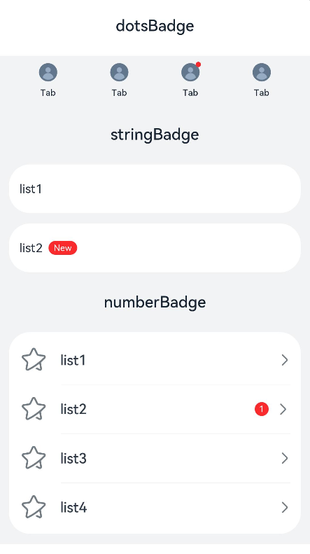
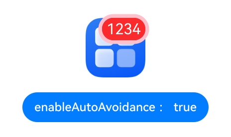

# Badge

<!--Kit: ArkUI-->
<!--Subsystem: ArkUI-->
<!--Owner: @Zhang-Dong-hui-->
<!--Designer: @xiangyuan6-->
<!--Tester:@jiaoaozihao-->
<!--Adviser: @Brilliantry_Rui-->
<!-- md-trans-meta sourceCommit=15d062acadbaecdb97e3e492b286bd277a5fbc2e translatedAt=2026-08-21T02:22:03.945Z pushedAt=2026-08-21T07:06:58.720Z -->

A badge container component that can be attached to a single component for information reminders. It supports three badge formats: number, string, and dot. You can customize the badge style (text color, size, badge color, and size) and display position. It is suitable for scenarios where users need to be reminded of new or unread messages, such as unread message counts and new feature prompts, helping users quickly identify and focus on important information and improving user experience.

>  **NOTE**
>
> This component is supported since API version 7. Updates will be marked with a superscript to indicate their earliest API version.

## Child Components

This component supports only one child component.

>  **NOTE**
>
> - Child component types: system components and custom components, supporting rendering control types ([if/else](../../../ui/rendering-control/arkts-rendering-control-ifelse.md), [ForEach](../../../ui/rendering-control/arkts-rendering-control-foreach.md), and [LazyForEach](../../../ui/rendering-control/arkts-rendering-control-lazyforeach.md)).
>
> - The width and height of a custom component are 0 by default. You need to set its width and height; otherwise, the badge component will not be displayed.
>
> - When there are multiple child components, only the last child component is displayed on the UI, but the state updates of the remaining child components still trigger the re-layout and re-rendering of **Badge** and all its child components.
>
> - It does not affect the layout of child components, that is, it does not actively avoid the content of child components.

## Interfaces

### Badge

Badge(value: BadgeParamWithNumber)

Creates a badge component based on a number.

**Widget capability**: This API can be used in ArkTS widgets since API version 9.

**Atomic service API**: This API can be used in atomic services since API version 11.

**System capability**: SystemCapability.ArkUI.ArkUI.Full

**Parameters**

| Name | Type | Mandatory | Description |
| -------- | -------- | -------- | -------- |
| value | [BadgeParamWithNumber](#badgeparamwithnumber)| Yes | Parameters of the number badge component, used to configure the **Badge** component created based on a number, including the message count, display position, and style. |

### Badge

Badge(value: BadgeParamWithString)

Creates a badge component based on a string.

**Widget capability**: This API can be used in ArkTS widgets since API version 9.

**Atomic service API**: This API can be used in atomic services since API version 11.

**System capability**: SystemCapability.ArkUI.ArkUI.Full

**Parameters**

| Name | Type                                              | Mandatory | Description             |
| ------ | ----------------------------------------------------- | ---- | -------------------- |
| value  | [BadgeParamWithString](#badgeparamwithstring) | Yes   | Parameters of the string badge component. |

## BadgeParam

Contains the basic parameters for creating a Badge component.

**Widget capability**: This API can be used in ArkTS widgets since API version 9.

**Atomic service API**: This API can be used in atomic services since API version 11.

**System capability**: SystemCapability.ArkUI.ArkUI.Full

| Name | Type | Read Only | Optional | Description |
| -------- | -------- | -------- | -------- | -------- |
| position | [BadgePosition](#badgeposition)\|[Position<sup>10+</sup>](ts-types.md#position) | No | Yes | Badge display position.<br>Default value: **BadgePosition.RightTop** <br>**NOTE**<br> When **Position** is used as an input parameter, percentage is not supported. If an invalid value is set, it is processed as (0,0), which is the upper left corner of the component.<br>When **BadgePosition** is used as an input parameter, the mirrored display is controlled by the [Direction](ts-appendix-enums.md#direction) attribute. |
| style | [BadgeStyle](#badgestyle) | No | No | Style of the **Badge** component, including the text color, size, badge color, and badge size. |

## BadgeParamWithNumber

BadgeParamWithNumber inherits from [BadgeParam](#badgeparam) and has all the attributes of BadgeParam.

**Widget capability**: This API can be used in ArkTS widgets since API version 9.

**Atomic service API**: This API can be used in atomic services since API version 11.

**System capability**: SystemCapability.ArkUI.ArkUI.Full

| Name | Type | Read Only | Optional | Description |
| -------- | -------- | -------- | -------- | -------- |
| count | number | No | No | Number of reminder messages.<br>**NOTE**<br>When the value is less than or equal to 0 and less than **maxCount**, the badge is not displayed.<br>Value range: [-2147483648, 2147483647]. If the value is out of range, 4294967296 is added to or subtracted from it to keep it within the range. If the value is not an integer, the decimal part is discarded, for example, 5.5 becomes 5. |
| maxCount | number | No | Yes | Maximum number of messages. When the number exceeds the maximum, only **maxCount+** is displayed. For example, when **maxCount** is 99, `99+` is displayed.<br>Default value: **99**<br>Value range: [-2147483648, 2147483647]. If the value is out of range, 4294967296 is added to or subtracted from it to keep it within the range. If the value is not an integer, the decimal part is discarded, for example, 5.5 becomes 5. |

## BadgeParamWithString

BadgeParamWithString inherits from [BadgeParam](#badgeparam) and has all the properties of BadgeParam.

**Widget capability**: This API can be used in ArkTS widgets since API version 9.

**Atomic service API**: This API can be used in atomic services since API version 11.

**System capability**: SystemCapability.ArkUI.ArkUI.Full

| Name | Type | Read Only | Optional | Description |
| -------- | -------- | -------- | -------- | -------- |
| value | [ResourceStr](ts-types.md#resourcestr) | No | No | Text string of the prompt content.<br>**NOTE**<br>When **value** is an empty string, no text is displayed and only a dot badge is displayed.<br>Since API version 20, the ResourceStr type is supported. |

## BadgePosition

Enumerates the badge display positions.

**Widget capability**: This API can be used in ArkTS widgets since API version 9.

**Atomic service API**: This API can be used in atomic services since API version 11.

**System capability**: SystemCapability.ArkUI.ArkUI.Full

| Name | Value | Description |
| -------- | -------- |-------- |
| RightTop | - | The badge is displayed in the upper right corner. |
| Right | - | The badge is displayed vertically centered on the right. |
| Left | - | The badge is displayed vertically centered on the left. |

## BadgeStyle

Defines the style of a badge, including the text color, size, font weight, badge color, and badge size.

**System capability**: SystemCapability.ArkUI.ArkUI.Full

| Name                      | Type                                                         | Read Only | Optional | Description                                                         |
| ------------------------- | ------------------------------------------------------------ | ---- | ---- | ------------------------------------------------------------ |
| color                     | [ResourceColor](ts-types.md#resourcecolor)                   | No   | Yes   | Text color.<br>Default value: **Color.White**<br>**Widget capability:** This API can be used in ArkTS widgets since API version 9.<br>**Atomic service API:** This API can be used in atomic services since API version 11. |
| fontSize                  | number&nbsp;\|&nbsp;[ResourceStr](ts-types.md#resourcestr)   | No   | Yes   | Text size. The string type supports only the string form of a number value, which can carry a unit. The supported units are "px", "vp", "fp", and "lpx", for example, "10" and "10fp". If no unit is carried, the default unit is "fp".<br>Default value: **10vp**<br>Default unit: **fp**<br>Value range: greater than 0. When the value is 0, the text is not displayed. When the value is less than 0, the default value is used.<br>**NOTE**<br>1. Percentage is not supported. When a percentage is set, the default value is used.<br>2. The ResourceStr type is supported since API version 20.<br>**Widget capability:** This API can be used in ArkTS widgets since API version 9.<br>**Atomic service API:** This API can be used in atomic services since API version 11. |
| badgeSize                 | number&nbsp;\|&nbsp;[ResourceStr](ts-types.md#resourcestr)   | No   | Yes   | Size of the badge. The string type supports only the string form of a number value, which can carry a unit. The supported units are "px", "vp", "fp", and "lpx", for example, "16" and "16fp". If no unit is carried, the default unit is "fp".<br>Default value: **16vp**<br>Default unit: **fp**<br>Value range: greater than 0. When the value is 0, the badge is not displayed. When the value is less than 0, the default value is used.<br>**NOTE**<br>1. Percentage is not supported. When a percentage is set, the default value is used.<br>2. The ResourceStr type is supported since API version 20.<br>3. When **fontSize** is set and **badgeSize** is smaller than **fontSize**, **badgeSize** takes effect as **fontSize**.<br>**Widget capability:** This API can be used in ArkTS widgets since API version 9.<br>**Atomic service API:** This API can be used in atomic services since API version 11. |
| badgeColor                | [ResourceColor](ts-types.md#resourcecolor)                   | No   | Yes   | Badge color.<br>Default value: **Color.Red**<br>**Widget capability:** This API can be used in ArkTS widgets since API version 9.<br>**Atomic service API:** This API can be used in atomic services since API version 11. |
| fontWeight<sup>10+</sup>  | number&nbsp;\|&nbsp;[FontWeight](ts-appendix-enums.md#fontweight)&nbsp;\|&nbsp;[ResourceStr](ts-types.md#resourcestr) | No   | Yes   | Font weight of the text. For the number type, the value range is [100, 900] at an interval of 100. A larger value indicates a heavier font weight. When a number value outside the range is set, the default value 400 is used. The string type supports only the string form of a number value, for example, "400", as well as "bold", "bolder", "lighter", "regular", and "medium", which correspond to the respective enum values in FontWeight.<br>Default value: **FontWeight.Normal**<br>**NOTE**<br>Percentage is not supported. When a percentage is set, the default value is used. The ResourceStr type is supported since API version 20.<br>**Atomic service API:** This API can be used in atomic services since API version 11.<br>**Model restriction:** This API can be used only in the stage model. |
| borderColor<sup>10+</sup> | [ResourceColor](ts-types.md#resourcecolor)                   | No   | Yes   | Base border color.<br>Default value: **Color.Red**<br>**Atomic service API:** This API can be used in atomic services since API version 11.<br>**Model restriction:** This API can be used only in the stage model.     |
| borderWidth<sup>10+</sup> | [Length](ts-types.md#length)                                 | No   | Yes   | Base border width.<br>Default value: **1**<br>Unit: **vp**<br>**NOTE**<br>Percentage is not supported. When a percentage is set, the default value is used.<br>**Atomic service API:** This API can be used in atomic services since API version 11.<br>**Model restriction:** This API can be used only in the stage model. |
| outerBorderColor<sup>22+</sup> | [ResourceColor](ts-types.md#resourcecolor)                   | No   | Yes   | Base outer border color.<br>Default value: **Color.White**<br>**Atomic service API:** This API can be used in atomic services since API version 22.<br>**Model restriction:** This API can be used only in the stage model.   |
| outerBorderWidth<sup>22+</sup> | [LengthMetrics](../js-apis-arkui-graphics.md#lengthmetrics12)                   | No   | Yes   | Base outer border width.<br>Default value: **0**<br>Unit: **vp**<br>Percentage is not supported. When a percentage is set, the default value is used.<br>**Atomic service API:** This API can be used in atomic services since API version 22.<br>**Model restriction:** This API can be used only in the stage model. |
| enableAutoAvoidance<sup>22+</sup> | boolean                                 | No   | Yes   | Whether to avoid the badge text when it extends beyond the component.<br>The value **true** means to avoid, and **false** means not to avoid.<br>Default value: **false**<br>**NOTE**<br>1. The avoidance effect means that the badge text extends toward the inside of the component.<br>2. When the outer border width is greater than 0, the badge starts to extend from the inner side of the outer border.<br>3. When **position** is set to specific coordinate values, the badge does not perform avoidance.<br>**Atomic service API:** This API can be used in atomic services since API version 22.<br>**Model restriction:** This API can be used only in the stage model.|

> **NOTE**
> When `borderWidth` is greater than 0 and the colors of `borderColor` and `badgeColor` are different, the badge is drawn first and then the border. Because edge pixels are anti-aliased, semi-transparent pixels are generated, and border lines in the `badgeColor` color appear at the four corners. To implement such a scenario, you are advised to use the [Text](ts-basic-components-text.md) component and set [outline](ts-universal-attributes-outline.md#outline) instead of the Badge component.

## Attributes

The [universal attributes](ts-component-general-attributes.md) are supported.

## Events

The [universal events](ts-component-general-events.md) are supported.

## Examples

### Example 1: Setting Badge Component Content

This example uses the input parameter **count** of [BadgeParamWithNumber](#badgeparamwithnumber) and the input parameter **value** of [BadgeParamWithString](#badgeparamwithstring) to display different effects of the badge component when null, a character, or a number is passed in.

```ts
// xxx.ets
@Entry
@Component
struct BadgeExample {
  @Builder
  tabBuilder(index: number) {
    Column() {
      if (index === 2) {
        Badge({
          value: '',
          style: { badgeSize: 6, badgeColor: '#FA2A2D' }
        }) {
          Image('/common/public_icon_off.svg')
            .width(24)
            .height(24)
        }
        .width(24)
        .height(24)
        .margin({ bottom: 4 })
      } else {
        Image('/common/public_icon_off.svg')
          .width(24)
          .height(24)
          .margin({ bottom: 4 })
      }
      Text('Tab')
        .fontColor('#182431')
        .fontSize(10)
        .fontWeight(500)
        .lineHeight(14)
    }.width('100%').height('100%').justifyContent(FlexAlign.Center)
  }

  @Builder
  itemBuilder(value: string) {
    Row() {
      Image('common/public_icon.svg').width(32).height(32).opacity(0.6)
      Text(value)
        .width(177)
        .height(21)
        .margin({ left: 15, right: 76 })
        .textAlign(TextAlign.Start)
        .fontColor('#182431')
        .fontWeight(500)
        .fontSize(16)
        .opacity(0.9)
      Image('common/public_icon_arrow_right.svg').width(12).height(24).opacity(0.6)
    }.width('100%').padding({ left: 12, right: 12 }).height(56)
  }

  build() {
    Column() {
      // Badge component of the dot type.
      Text('dotsBadge').fontSize(18).fontColor('#182431').fontWeight(500).margin(24)
      Tabs() {
        TabContent()
          .tabBar(this.tabBuilder(0))
        TabContent()
          .tabBar(this.tabBuilder(1))
        TabContent()
          .tabBar(this.tabBuilder(2))
        TabContent()
          .tabBar(this.tabBuilder(3))
      }
      .width(360)
      .height(56)
      .backgroundColor('#F1F3F5')

      // Badge component created based on a character.
      Column() {
        Text('stringBadge').fontSize(18).fontColor('#182431').fontWeight(500).margin(24)
        List({ space: 12 }) {
          ListItem() {
            Text('list1').fontSize(14).fontColor('#182431').margin({ left: 12 })
          }
          .width('100%')
          .height(56)
          .backgroundColor('#FFFFFF')
          .borderRadius(24)
          .align(Alignment.Start)

          ListItem() {
            Badge({
              value: 'New',
              position: BadgePosition.Right,
              style: { badgeSize: 16, badgeColor: '#FA2A2D' }
            }) {
              Text('list2').width(27).height(19).fontSize(14).fontColor('#182431')
            }.width(49.5).height(19)
            .margin({ left: 12 })
          }
          .width('100%')
          .height(56)
          .backgroundColor('#FFFFFF')
          .borderRadius(24)
          .align(Alignment.Start)
        }.width(336)

        // Badge component created based on a number.
        Text('numberBadge').fontSize(18).fontColor('#182431').fontWeight(500).margin(24)
        List() {
          ListItem() {
            this.itemBuilder('list1')
          }

          ListItem() {
            Row() {
              Image('common/public_icon.svg').width(32).height(32).opacity(0.6)
              Badge({
                count: 1,
                position: BadgePosition.Right,
                style: { badgeSize: 16, badgeColor: '#FA2A2D' }
              }) {
                Text('list2')
                  .width(177)
                  .height(21)
                  .textAlign(TextAlign.Start)
                  .fontColor('#182431')
                  .fontWeight(500)
                  .fontSize(16)
                  .opacity(0.9)
              }.width(240).height(21).margin({ left: 15, right: 11 })

              Image('common/public_icon_arrow_right.svg').width(12).height(24).opacity(0.6)
            }.width('100%').padding({ left: 12, right: 12 }).height(56)
          }

          ListItem() {
            this.itemBuilder('list3')
          }

          ListItem() {
            this.itemBuilder('list4')
          }
        }
        .width(336)
        .height(232)
        .backgroundColor('#FFFFFF')
        .borderRadius(24)
        .padding({ top: 4, bottom: 4 })
        .divider({
          strokeWidth: 0.5,
          color: 'rgba(0,0,0,0.1)',
          startMargin: 60,
          endMargin: 12
        })
      }.width('100%').backgroundColor('#F1F3F5').padding({ bottom: 12 })
    }.width('100%')
  }
}
```



### Example 2: Setting a Number to Control Badge Display

This example uses the **count** attribute to hide and show the badge component when the number is set to **0** and **1**.

```ts
@Entry
@Component
struct Index {
  @State badgeCount: number = 1;

  build() {
    Column({ space: 40 }) {
      Badge({
        count: this.badgeCount,
        style: {},
        position: BadgePosition.RightTop,
      }) {
        Image($r('app.media.startIcon'))
          .width(50)
          .height(50)
      }
      .width(55)

      Button('count 0').onClick(() => {
        this.badgeCount = 0;
      })
      Button('count 1').onClick(() => {
        this.badgeCount = 1;
      })
    }
    .margin({ top: 20 })
  }
}
```


### Example 3: Setting the Outer Border and Text Extension Mode

Since API version 22, this example uses the **outerBorderColor** and **outerBorderWidth** attributes to set the outer border, and uses the **enableAutoAvoidance** attribute to control whether to avoid obstacles when the badge text is extended for display.

```ts
// This example implements custom outer border and text extension direction for the Badge component.
import { LengthMetrics } from '@kit.ArkUI';

@Entry
@Component
struct Index {
  @State badgeValue: string = '1234';
  @State textAvoid: boolean[] = [false, true];
  @State textAvoidIndex: number = 0;
  @State textAvoidString: string [] = ['false', 'true'];
  build() {
    Column() {
      Badge({
        value: this.badgeValue,
        style: {
          badgeSize: 30,
          fontSize: 20,
          outerBorderColor : Color.Pink,
          outerBorderWidth : LengthMetrics.vp(5),
          enableAutoAvoidance : this.textAvoid[this.textAvoidIndex]
        },
        position: BadgePosition.RightTop
      }) {
        // $r('app.media.startIcon') needs to be replaced with the image resource file required by the developer.
        Image($r('app.media.startIcon'))
          .width(80)
          .height(80)
      }
      .direction(Direction.Ltr)
      .margin({ top: 20, bottom: 20 })
      Button('enableAutoAvoidance : ' + this.textAvoidString[this.textAvoidIndex])
        .onClick(() => {
          this.textAvoidIndex = (this.textAvoidIndex + 1) % this.textAvoidString.length;
        })
    }
    .width('100%')
    .height('80%')
    .alignItems(HorizontalAlign.Center)
    .justifyContent(FlexAlign.Center)
  }
}
```

