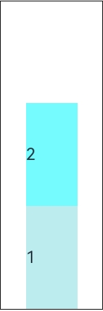

# Column

<!--Kit: ArkUI-->
<!--Subsystem: ArkUI-->
<!--Owner: @camlostshi-->
<!--Designer: @fenglinbailu-->
<!--Tester: @liuli0427-->
<!--Adviser: @Brilliantry_Rui-->
<!-- md-trans-meta sourceCommit=0a724a1bcf6a29fe23177af55231e875c486ee05 translatedAt=2026-08-21T02:21:45.306Z pushedAt=2026-08-21T07:09:25.992Z -->

A container that lays out child components along the vertical direction. It is suitable for scenarios where multiple child components need to be arranged sequentially in the vertical direction, such as list items, form items, and card content. It supports setting attributes such as child component spacing and alignment, enabling quick implementation of vertical linear layout.

>  **NOTE**
>
>  This component is supported since API version 7. Updates will be marked with a superscript to indicate their earliest API version.
>
>  If no height or width is set for the **Column** component, it adapts to the size of child components in the main axis (vertical direction) or cross axis (horizontal direction).

## Child Components

Supported

## APIs

### Column

Column(options?: ColumnOptions)

Creates a vertical linear layout container. You can set the spacing between child components.

>  **NOTE**
>
>  When using multi-component nesting in complex UIs, if layout components are nested too deeply or too many components are nested, additional overhead will be incurred. It is recommended to optimize performance by removing redundant nodes, using layout boundaries to reduce layout calculations, and properly adopting rendering control syntax and layout component methods.

**Widget capability**: This API can be used in ArkTS widgets since API version 9.

**Atomic service API**: This API can be used in atomic services since API version 11.

**System capability**: SystemCapability.ArkUI.ArkUI.Full

**Parameters**

| Name| Type| Mandatory| Description|
| -------- | -------- | -------- | -------- |
| options<sup>18+</sup> | [ColumnOptions](#columnoptions18) | No | Spacing configuration options of the **Column** component. It sets the vertical spacing between elements in the column layout through the **space** attribute. Pass this parameter when a fixed vertical spacing needs to be set for child components; if omitted, no child component spacing is set.<br>**Model restriction:** This API can be used only in the stage model. |

### Column<sup>18+</sup>

Column(options?: ColumnOptions | ColumnOptionsV2)

Creates a vertical linear layout container. You can set the spacing between child components.

>  **NOTE**
>
>  When using multi-component nesting in complex UIs, if layout components are nested too deeply or too many components are nested, additional overhead will be incurred. It is recommended to optimize performance by removing redundant nodes, using layout boundaries to reduce layout calculations, and properly adopting rendering control syntax and layout component methods.

**Widget capability**: This API can be used in ArkTS widgets since API version 18.

**Atomic service API**: This API can be used in atomic services since API version 18.

**Model restriction:** This API can be used only in the stage model.

**System capability**: SystemCapability.ArkUI.ArkUI.Full

**Parameters**

| Name| Type| Mandatory| Description|
| -------- | -------- | -------- | -------- |
| options | [ColumnOptions](#columnoptions18) \| [ColumnOptionsV2](#columnoptionsv218) | No | Spacing configuration options of the **Column** component. The **space** attribute sets the vertical spacing between elements in the column layout. **space** supports settings of the number, string, or Resource type. Pass this parameter when a fixed vertical spacing needs to be set for child components; if omitted, no child component spacing is set. |

## ColumnOptions<sup>18+</sup>

Sets the spacing between child components of the **Column** component.

> **NOTE**
>
> To standardize anonymous object definitions, the element definitions here have been revised in API version 18. While historical version information is preserved for anonymous objects, there may be cases where the outer element's @since version number is higher than inner elements'. This does not affect interface usability.

**Widget capability**: This API can be used in ArkTS widgets since API version 18.

**Atomic service API**: This API can be used in atomic services since API version 18.

**Model restriction:** This API can be used only in the stage model.

**System capability**: SystemCapability.ArkUI.ArkUI.Full

| Name| Type| Read-Only| Optional| Description|
| -------- | -------- | -------- | -------- | -------- |
| space<sup>7+</sup> | string&nbsp;\|&nbsp;number | No | Yes | Vertical spacing between child components in the column layout.<br>If **space** is a negative number or [justifyContent](#justifycontent8) is set to **FlexAlign.SpaceBetween**, **FlexAlign.SpaceAround**, or **FlexAlign.SpaceEvenly**, **space** does not take effect.<br>Value range: [0, +∞)<br>Default value: **0**<br>Invalid value: handled as the default value.<br>Unit: vp<br>**NOTE**<br>The value of **space** is a number greater than or equal to 0, or a string that can be converted to a non-negative number.<br>**Widget capability:** This API can be used in ArkTS widgets since API version 9.<br>**Atomic service API:** This API can be used in atomic services since API version 11. |

## ColumnOptionsV2<sup>18+</sup>

Sets the spacing between child components of the **Column** component. The spacing type **SpaceType** can be number, string, or Resource.

**Widget capability**: This API can be used in ArkTS widgets since API version 18.

**Atomic service API**: This API can be used in atomic services since API version 18.

**Model restriction:** This API can be used only in the stage model.

**System capability**: SystemCapability.ArkUI.ArkUI.Full

| Name| Type| Read-Only| Optional| Description|
| -------- | -------- | -------- | -------- | -------- |
| space | [SpaceType](#spacetype18) | No | Yes | Vertical spacing between elements in the column layout.<br>If **space** is a negative number or [justifyContent](#justifycontent8) is set to **FlexAlign.SpaceBetween**, **FlexAlign.SpaceAround**, or **FlexAlign.SpaceEvenly**, **space** does not take effect.<br>Value range: [0, +∞)<br>Default value: **0**<br>Unit: vp<br>Invalid value: The default value is used.<br>**NOTE**<br>The value of **space** is a number greater than or equal to 0, a string that can be converted to a non-negative number, or a Resource type that can be converted to a number. |

## SpaceType<sup>18+</sup>

type SpaceType = string | number | Resource

Describes the supported data types for the **space** parameter in the constructors of the **Column** component. The type is a union of the following types.

**Widget capability**: This API can be used in ArkTS widgets since API version 18.

**Atomic service API**: This API can be used in atomic services since API version 18.

**Model restriction:** This API can be used only in the stage model.

**System capability**: SystemCapability.ArkUI.ArkUI.Full

|Type|Description|
|---|---|
|number|The value type is number, and the value must be greater than or equal to 0. If a negative number or invalid value is set, the default value **0** is used.|
|string|The value type is string, and the value must be a string that can be converted to a non-negative number. If a negative number or a string that cannot be converted is set, the default value **0** is used.|
|[Resource](ts-types.md#resource)|The value type is a resource reference type. It can take values from system resources or application resources.|

## Attributes

In addition to the [universal attributes](ts-component-general-attributes.md), the following attributes are supported.

### alignItems

alignItems(value: HorizontalAlign)

Alignment mode of the child components in the horizontal direction.

**Widget capability**: This API can be used in ArkTS widgets since API version 9.

**Atomic service API**: This API can be used in atomic services since API version 11.

**System capability**: SystemCapability.ArkUI.ArkUI.Full

**Parameters**

| Name| Type                                                   | Mandatory| Description                                                        |
| ------ | ------------------------------------------------------- | ---- | ------------------------------------------------------------ |
| value  | [HorizontalAlign](ts-appendix-enums.md#horizontalalign) | Yes   | Alignment format of the child components in the horizontal direction.<br>Default value: **HorizontalAlign.Center** |

### justifyContent<sup>8+</sup>

justifyContent(value: FlexAlign)

Alignment mode of the child components in the vertical direction.

**Widget capability**: This API can be used in ArkTS widgets since API version 9.

**Atomic service API**: This API can be used in atomic services since API version 11.

**System capability**: SystemCapability.ArkUI.ArkUI.Full

**Parameters**

| Name| Type                                       | Mandatory| Description                                                      |
| ------ | ------------------------------------------- | ---- | ---------------------------------------------------------- |
| value  | [FlexAlign](ts-appendix-enums.md#flexalign) | Yes   | Alignment format of child components in the vertical direction.<br>Default value: **FlexAlign.Start**<br>**Note:** If the child component does not set [flexShrink](ts-universal-attributes-flex-layout.md#flexshrink), **FlexAlign.Center** and **FlexAlign.End** may not take effect. For details, see the description below. When this parameter is set to **FlexAlign.SpaceBetween**, **FlexAlign.SpaceAround**, or **FlexAlign.SpaceEvenly**, the [space](#columnoptions18) attribute does not take effect. |

>  **NOTE**
>
>  During the column layout, if [flexShrink](ts-universal-attributes-flex-layout.md#flexshrink) is not set for a child component, the child component is not compressed by default. This can result in the total main axis size of all child components exceeding the container's main axis size, which makes **FlexAlign.Center** and **FlexAlign.End** ineffective.

### reverse<sup>12+</sup>

reverse(isReversed: Optional\<boolean\>)

Sets whether to reverse the vertical arrangement of child components.

**Widget capability**: This API can be used in ArkTS widgets since API version 12.

**Atomic service API**: This API can be used in atomic services since API version 12.

**Model restriction:** This API can be used only in the stage model.

**System capability**: SystemCapability.ArkUI.ArkUI.Full

**Parameters**

| Name| Type                                       | Mandatory| Description                                                      |
| ------ | ------------------------------------------- | ---- | ---------------------------------------------------------- |
| isReversed  | [Optional](ts-universal-attributes-custom-property.md#optionalt)\<boolean\> | Yes   | Whether the child components are arranged in reverse order in the vertical direction.<br>Default value: **true**. The value **true** indicates that the child components are arranged in reverse order in the vertical direction, and **false** indicates that they are arranged in normal order. |

>  **NOTE**
>
>  If the **reverse** attribute is not set, the main axis direction is not reversed. If the attribute is set and the parameter value is **undefined**, it defaults to **true**, and the main axis direction is reversed.<br>The universal attribute **direction** only changes the cross axis direction of **Column**, not the main axis direction of **Column**, so it does not affect the **reverse** attribute.

## Events

The [universal events](ts-component-general-events.md) are supported.

## Example

### Example 1: Setting the Layout Attributes of the Column Component

This example demonstrates how to set the layout attributes of the **Column** component, such as the spacing and alignment mode, and its effect.

```json
// resources/base/element/string.json
{
  "string": [
    {
      "name": "stringSpace",
      "value": "5"
    }
  ]
}
```

```ts
// xxx.ets
@Entry
@Component
struct ColumnExample {
  build() {
    Scroll() {
      Column({ space: 5 }) {
        // Set the vertical spacing between two adjacent child components to 5.
        Text('space').width('90%')
        Column({ space: 5 }) {
          Column().width('100%').height(30).backgroundColor(0xAFEEEE)
          Column().width('100%').height(30).backgroundColor(0x00FFFF)
        }.width('90%').height(100).border({ width: 1 })

        // Set the spacing between child elements using the Resource type.
        Text('Resource space').width('90%')
        Column({ space: $r('app.string.stringSpace') }) {
          Column().width('100%').height(30).backgroundColor(0xAFEEEE)
          Column().width('100%').height(30).backgroundColor(0x00FFFF)
        }.width('90%').height(100).border({ width: 1 })

        // Set the alignment mode of the child components in the horizontal direction.
        Text('alignItems(Start)').width('90%')
        Column() {
          Column().width('50%').height(30).backgroundColor(0xAFEEEE)
          Column().width('50%').height(30).backgroundColor(0x00FFFF)
        }.alignItems(HorizontalAlign.Start).width('90%').border({ width: 1 })

        Text('alignItems(End)').width('90%')
        Column() {
          Column().width('50%').height(30).backgroundColor(0xAFEEEE)
          Column().width('50%').height(30).backgroundColor(0x00FFFF)
        }.alignItems(HorizontalAlign.End).width('90%').border({ width: 1 })

        Text('alignItems(Center)').width('90%')
        Column() {
          Column().width('50%').height(30).backgroundColor(0xAFEEEE)
          Column().width('50%').height(30).backgroundColor(0x00FFFF)
        }.alignItems(HorizontalAlign.Center).width('90%').border({ width: 1 })

        // Set the alignment mode of the child components in the vertical direction.
        Text('justifyContent(Center)').width('90%')
        Column() {
          Column().width('90%').height(30).backgroundColor(0xAFEEEE)
          Column().width('90%').height(30).backgroundColor(0x00FFFF)
        }.height(100).border({ width: 1 }).justifyContent(FlexAlign.Center)

        Text('justifyContent(End)').width('90%')
        Column() {
          Column().width('90%').height(30).backgroundColor(0xAFEEEE)
          Column().width('90%').height(30).backgroundColor(0x00FFFF)
        }.height(100).border({ width: 1 }).justifyContent(FlexAlign.End)
      }.width('100%').padding({ top: 5 })
    }.width('100%').height('100%')
  }
}
```


### Example 2: Configuring the Reverse Attribute

This example demonstrates how to set the **reverse** attribute of the **Column** component and its effect.

```ts
@Entry
@Component
struct ColumnReverseSample {
  build() {
    Column() {
      Text("1")
        .width(50)
        .height(100)
        .backgroundColor(0xAFEEEE)

      Text("2")
        .width(50)
        .height(100)
        .backgroundColor(0x00FFFF)
    }
    .height(300)
    .width(100)
    .border({ width: 1 })
    .reverse(true)
  }
}
```

