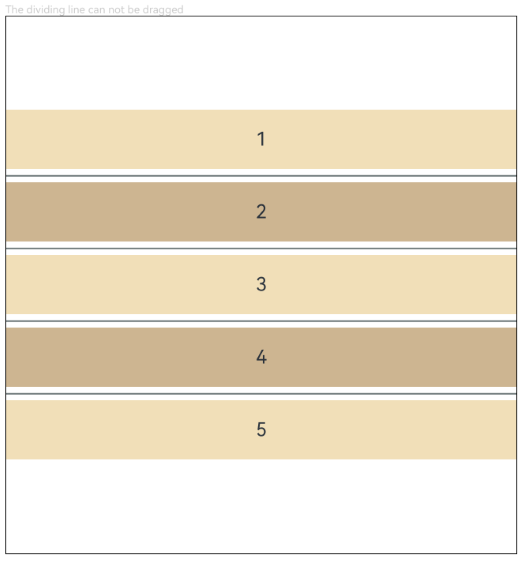

# ColumnSplit
<!--Kit: ArkUI-->
<!--Subsystem: ArkUI-->
<!--Owner: @zju_ljz-->
<!--Designer: @lanshouren-->
<!--Tester: @liuli0427-->
<!--Adviser: @Brilliantry_Rui-->

The **ColumnSplit** component lays out child components vertically and inserts a horizontal divider between every two child components.

>  **NOTE**
>
> This component is supported since API version 7. Updates will be marked with a superscript to indicate their earliest API version.
## Child Components

Supported

This component limits the height of its child components through dividers. During initialization, the divider positions are calculated based on the height of its child components. After initialization, dynamic height modifications to child components do not affect divider positions. To adjust child component heights, drag the adjacent dividers.

After initialization, dynamic changes to the [margin](ts-universal-attributes-size.md#margin), [border](ts-universal-attributes-border.md#border), or [padding](ts-universal-attributes-size.md#padding) attributes may cause the size of the child components to exceed the allowable distance between adjacent dividers. In such cases, dividers cannot be dragged to adjust the height of the child components.
## APIs

ColumnSplit()

Creates a vertical split layout container with dividers between child components.

**Atomic service API**: This API can be used in atomic services since API version 11.

**System capability**: SystemCapability.ArkUI.ArkUI.Full

## Attributes

In addition to the [universal attributes](ts-component-general-attributes.md), the following attributes are supported.

> **NOTE**
>
> The default value of the universal attribute [clip](ts-universal-attributes-sharp-clipping.md) is **true** for the **ColumnSplit** component.

### resizeable

resizeable(value: boolean)

Sets whether the divider can be dragged.

**Atomic service API**: This API can be used in atomic services since API version 11.

**System capability**: SystemCapability.ArkUI.ArkUI.Full

**Parameters**

| Name| Type   | Mandatory| Description                                |
| ------ | ------- | ---- | ------------------------------------ |
| value  | boolean | Yes  | Whether the divider can be dragged. **true**: The divider can be dragged. **false**: The divider cannot be dragged.<br>Default value: **false**<br>Invalid values are treated as the default value.|

### divider<sup>10+</sup>

divider(value: ColumnSplitDividerStyle | null)

Margin of the divider.

**Atomic service API**: This API can be used in atomic services since API version 11.

**System capability**: SystemCapability.ArkUI.ArkUI.Full

**Parameters**

| Name| Type                                                        | Mandatory| Description                                                        |
| ------ | ------------------------------------------------------------ | ---- | ------------------------------------------------------------ |
| value  | [ColumnSplitDividerStyle](#columnsplitdividerstyle10)&nbsp;\|&nbsp;null | Yes  | Margin of the divider, defining the spacing between the divider and adjacent child components.<br>Default value: **null**. If this parameter is set to **null**, the top and bottom margins of the divider are 0.0 vp.<br>Invalid values are treated as the default value.|

## ColumnSplitDividerStyle<sup>10+</sup>

Sets the spacing between the divider and adjacent child components.

**Atomic service API**: This API can be used in atomic services since API version 11.

**System capability**: SystemCapability.ArkUI.ArkUI.Full

| Name| Type| Read-Only| Optional| Description|
| -------- | -------- | -------- | -------- | -------- |
| startMargin | [Dimension](ts-types.md#dimension10)       | No| Yes | Distance between the divider and the child component above it.<br>Default value: **0**<br>Invalid values are treated as the default value.|
| endMargin   | [Dimension](ts-types.md#dimension10)       | No| Yes | Distance between the divider and the child component below it.<br>Default value: **0**<br>Invalid values are treated as the default value.|

>  **NOTE**
>
> Similar to [RowSplit](ts-container-rowsplit.md), the dividers of **ColumnSplit** adjust the height of adjacent child components. However, this adjustment is only applied to the extent that the resulting height stays within the height limits of the child components.
>
> Universal attributes such as [clip](ts-universal-attributes-sharp-clipping.md#clip12) and [margin](ts-universal-attributes-size.md#margin) are supported. If **clip** is not set, the default value **true** is used.

## Events

The [universal events](ts-component-general-events.md) are supported.

## Example

### Example 1: Setting the Resizable ColumnSplit Component

This example shows how to set the resizable **ColumnSplit** component and its effect.

``` ts
// xxx.ets
@Entry
@Component
struct ColumnSplitExample {
  build() {
    Column(){
      Text('The dividing line can be dragged').fontSize(9).fontColor(0xCCCCCC).width('90%')
      ColumnSplit() {
        Text('1').width('100%').height(50).backgroundColor(0xF5DEB3).textAlign(TextAlign.Center)
        Text('2').width('100%').height(50).backgroundColor(0xD2B48C).textAlign(TextAlign.Center)
        Text('3').width('100%').height(50).backgroundColor(0xF5DEB3).textAlign(TextAlign.Center)
        Text('4').width('100%').height(50).backgroundColor(0xD2B48C).textAlign(TextAlign.Center)
        Text('5').width('100%').height(50).backgroundColor(0xF5DEB3).textAlign(TextAlign.Center)
      }
      .borderWidth(1)
      .resizeable(true) // The divider can be dragged.
      .width('90%').height('60%')
    }.width('100%')
  }
}
```


### Example 2: Setting the ColumnSplit Component with Spacing

This example shows how to set the **ColumnSplit** component with spacing and its effect.

``` ts
// xxx.ets
@Entry
@Component
struct ColumnSplitDividerExample {
  build() {
    Column() {
      Text('The dividing line can be dragged').fontSize(9).fontColor(0xCCCCCC).width('90%')
      ColumnSplit() {
        Text('1').width('100%').height(50).backgroundColor(0xF5DEB3).textAlign(TextAlign.Center)
        Text('2').width('100%').height(50).backgroundColor(0xD2B48C).textAlign(TextAlign.Center)
        Text('3').width('100%').height(50).backgroundColor(0xF5DEB3).textAlign(TextAlign.Center)
        Text('4').width('100%').height(50).backgroundColor(0xD2B48C).textAlign(TextAlign.Center)
        Text('5').width('100%').height(50).backgroundColor(0xF5DEB3).textAlign(TextAlign.Center)
      }
      .borderWidth(1)
      .divider ({ startMargin: 5, endMargin: 5 }) // Set the spacing.
      .width('90%')
      .height('60%')
    }.width('100%')
  }
}
```


