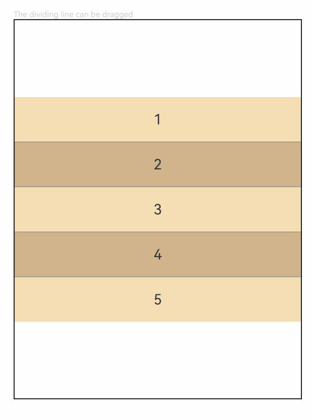
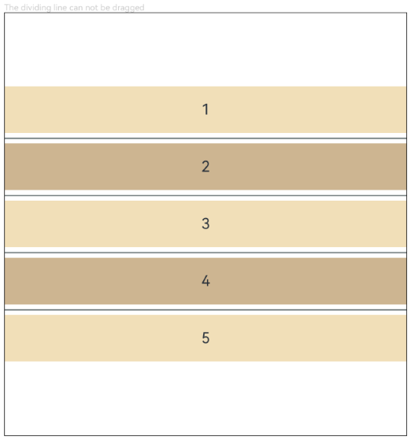

# ColumnSplit

<!--Kit: ArkUI-->
<!--Subsystem: ArkUI-->
<!--Owner: @zju_ljz-->
<!--Designer: @fenglinbailu-->
<!--Tester: @liuli0427-->
<!--Adviser: @Brilliantry_Rui-->
<!-- md-trans-meta sourceCommit=75a7d62c0702c21a06ca0119552a942305a023cc translatedAt=2026-08-21T02:21:34.202Z pushedAt=2026-08-21T07:14:11.394Z -->

The **ColumnSplit** component lays out child components vertically and inserts a horizontal divider between every two child components. It is suitable for scenarios that require a vertical multi-area layout with dynamic area resizing, such as dashboard UIs and adjustable top-bottom split layouts. Through draggable dividers, users can flexibly adjust the height of each area, enhancing UI interactivity and user experience.

>  **NOTE**
>
> This component is supported since API version 7. Updates will be marked with a superscript to indicate their earliest API version.

## Child Components

Supported

**ColumnSplit** limits the height of child components through dividers. During initialization, the divider positions are calculated based on the heights of the child components. After initialization, dynamically modifying the height of child components does not take effect, and the divider positions remain unchanged. After **resizeable** is set to **true**, the height of child components can be changed by dragging adjacent dividers.

After initialization, when dynamic modification of the [margin](ts-universal-attributes-size.md#margin), [border](ts-universal-attributes-border.md#border), or [padding](ts-universal-attributes-size.md#padding) universal attributes causes a child component size to exceed the spacing between adjacent dividers, dragging the divider to change the child component height is not supported.

## APIs

ColumnSplit()

Creates a vertical split layout container with dividers between child components.

**Atomic service API**: This API can be used in atomic services since API version 11.

**System capability**: SystemCapability.ArkUI.ArkUI.Full

## Attributes

In addition to the [universal attributes](ts-component-general-attributes.md), the following attributes are supported.

> **NOTE**
>
> The default value of [shape clipping](ts-universal-attributes-sharp-clipping.md) of the **ColumnSplit** component is **true**.

### resizeable

resizeable(value: boolean)

Sets whether the divider can be dragged. When set to **true**, the user can drag the divider to adjust the height of adjacent child components. When set to **false**, the divider cannot be dragged and the child component height is fixed.

>  **NOTE**
>
> After initialization, when dynamic modification of the [margin](ts-universal-attributes-size.md#margin), [border](ts-universal-attributes-border.md#border), or [padding](ts-universal-attributes-size.md#padding) universal attributes causes a child component size to exceed the spacing between adjacent dividers, dragging the divider to change the child component height is not supported.

**Atomic service API**: This API can be used in atomic services since API version 11.

**System capability**: SystemCapability.ArkUI.ArkUI.Full

**Parameters**

| Name| Type   | Mandatory| Description                                |
| ------ | ------- | ---- | ------------------------------------ |
| value  | boolean | Yes   | Whether the divider can be dragged. The value **true** means that the divider can be dragged, and **false** means the opposite. The height adjustment range of a child component is limited by its maximum and minimum heights. When the size of a child component is greater than the spacing between adjacent dividers, divider drag is not supported. After initialization, when dynamic modification of **margin**, **border**, or **padding** universal attributes causes the size of a child component to be greater than the spacing between adjacent dividers, divider drag to change the height of the child component is not supported.<br>Default value: **false** <br>Illegal value: The default value is used. |

### divider<sup>10+</sup>

divider(value: ColumnSplitDividerStyle | null)

Sets the distance between the divider and the child components.

**Atomic service API**: This API can be used in atomic services since API version 11.

**Model restriction:** This API can be used only in the stage model.

**System capability**: SystemCapability.ArkUI.ArkUI.Full

**Parameters**

| Name| Type                                                        | Mandatory| Description                                                        |
| ------ | ------------------------------------------------------------ | ---- | ------------------------------------------------------------ |
| value | [ColumnSplitDividerStyle](#columnsplitdividerstyle10)&nbsp;\|&nbsp;null | Yes | Margin of the divider, which sets the distance between the divider and child components. The object properties include: **startMargin** (distance between the child component and the divider above) and **endMargin** (distance between the child component and the divider below).<br>Default value: **null**. When set to **null**, the distance between the divider and child components is 0 vp.<br>Illegal value: The default value is used. |

## ColumnSplitDividerStyle<sup>10+</sup>

Sets the distance between the child component and the upper and lower dividers.

**Atomic service API**: This API can be used in atomic services since API version 11.

**Model restriction:** This API can be used only in the stage model.

**System capability**: SystemCapability.ArkUI.ArkUI.Full

| Name| Type| Read-Only| Optional| Description|
| -------- | -------- | -------- | -------- | -------- |
| startMargin | [Dimension](ts-types.md#dimension10)       | No | Yes  | Distance between the child component and the divider above it. This spacing can be adjusted (for example, to prevent content from overlapping with the divider or to improve layout aesthetics).<br>Default value: **0vp**<br>Value range: negative values are not supported.<br>Illegal value: treated as the default value, in which case the attribute value obtained by the [getInspectorByKey()](ts-universal-attributes-component-id.md#getinspectorbykey9) API is **undefined**. |
| endMargin   | [Dimension](ts-types.md#dimension10)       | No | Yes  | Distance between the child component and the divider below it. This spacing can be adjusted (for example, to prevent content from overlapping with the divider or to improve layout aesthetics).<br>Default value: **0vp**<br>Value range: negative values are not supported.<br>Illegal value: treated as the default value, in which case the attribute value obtained by the [getInspectorByKey()](ts-universal-attributes-component-id.md#getinspectorbykey9) API is **undefined**. |

>  **NOTE**
>
> Similar to [RowSplit](ts-container-rowsplit.md), the dividers of **ColumnSplit** adjust the height of adjacent child components. However, this adjustment is only applied to the extent that the resulting height stays within the height limits of the child components.
>
> Universal attributes such as [clip](ts-universal-attributes-sharp-clipping.md#clip12) and [margin](ts-universal-attributes-size.md#margin) are supported. If **clip** is not set, the default value **true** is used.

## Events

The [universal events](ts-component-general-events.md) are supported.

## Examples

### Example 1: Setting the Resizable ColumnSplit Component

This example shows how to set the resizable **ColumnSplit** component and its effect.

``` ts
// xxx.ets
@Entry
@Component
struct ColumnSplitExample {
  build() {
    Column() {
      Text('The dividing line can be dragged').fontSize(9).fontColor(0xCCCCCC).width('90%')
      ColumnSplit() {
        Text('1').width('100%').height(50).backgroundColor(0xF5DEB3).textAlign(TextAlign.Center)
        Text('2').width('100%').height(50).backgroundColor(0xD2B48C).textAlign(TextAlign.Center)
        Text('3').width('100%').height(50).backgroundColor(0xF5DEB3).textAlign(TextAlign.Center)
        Text('4').width('100%').height(50).backgroundColor(0xD2B48C).textAlign(TextAlign.Center)
        Text('5').width('100%').height(50).backgroundColor(0xF5DEB3).textAlign(TextAlign.Center)
      }
      .borderWidth(1)
      .resizeable(true) // Set the divider draggable.
      .width('90%').height('60%')
    }.width('100%')
  }
}
```



### Example 2: Setting the ColumnSplit Component with Spacing

This example shows how to set the **ColumnSplit** component with spacing and its effect.

``` ts
// xxx.ets
@Entry
@Component
struct ColumnSplitDividerExample {
  build() {
    Column() {
      Text('The dividing line can be dragged').fontSize(9).fontColor(0xCCCCCC).width('90%')
      ColumnSplit() {
        Text('1').width('100%').height(50).backgroundColor(0xF5DEB3).textAlign(TextAlign.Center)
        Text('2').width('100%').height(50).backgroundColor(0xD2B48C).textAlign(TextAlign.Center)
        Text('3').width('100%').height(50).backgroundColor(0xF5DEB3).textAlign(TextAlign.Center)
        Text('4').width('100%').height(50).backgroundColor(0xD2B48C).textAlign(TextAlign.Center)
        Text('5').width('100%').height(50).backgroundColor(0xF5DEB3).textAlign(TextAlign.Center)
      }
      .borderWidth(1)
      .divider({ startMargin: 5, endMargin: 5 }) // Set the distance between the divider and child components.
      .width('90%')
      .height('60%')
    }.width('100%')
  }
}
```

