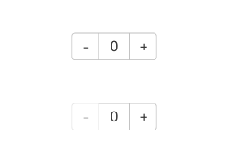

# Counter

<!--Kit: ArkUI-->
<!--Subsystem: ArkUI-->
<!--Owner: @Zhang-Dong-hui-->
<!--Designer: @xiangyuan6-->
<!--Tester: @jiaoaozihao-->
<!--Adviser: @Brilliantry_Rui-->
<!-- md-trans-meta sourceCommit=15d062acadbaecdb97e3e492b286bd277a5fbc2e translatedAt=2026-08-21T02:22:36.263Z pushedAt=2026-08-21T07:19:47.696Z -->

The **Counter** component provides increment and decrement operations. It is suitable for scenarios that require frequent value changes, such as product quantity selection and parameter adjustment, helping users adjust values quickly and intuitively.

>  **NOTE**
>
> - This component is supported since API version 7. Updates will be marked with a superscript to indicate their earliest API version.
> 
> - This component supports [WithTheme](./ts-container-with-theme.md) since API version 26.0.0.
> 

## Child Components

Supported

## APIs

Counter()

**Widget capability**: This API can be used in ArkTS widgets since API version 9.

**Atomic service API**: This API can be used in atomic services since API version 11.

**System capability**: SystemCapability.ArkUI.ArkUI.Full

## Attributes

In addition to the [universal attributes](ts-component-general-attributes.md), the following attributes are supported.

### enableInc<sup>10+</sup>

enableInc(value: boolean)

Sets whether to enable the increment button.

**Atomic service API**: This API can be used in atomic services since API version 11.

**Model restriction:** This API can be used only in the stage model.

**System capability**: SystemCapability.ArkUI.ArkUI.Full

**Parameters**

| Name| Type   | Mandatory| Description                                 |
| ------ | ------- | ---- | ------------------------------------- |
| value  | boolean | Yes   | Whether to disable or enable the increment button.<br>Default value: **true**, which means the increment button is enabled; **false** means the button is disabled. |

### enableDec<sup>10+</sup>

enableDec(value: boolean)

Sets whether to enable the decrement button.

**Atomic service API**: This API can be used in atomic services since API version 11.

**Model restriction:** This API can be used only in the stage model.

**System capability**: SystemCapability.ArkUI.ArkUI.Full

**Parameters**

| Name| Type   | Mandatory| Description                                 |
| ------ | ------- | ---- | ------------------------------------- |
| value  | boolean | Yes  | Whether to enable or disable the decrement button.<br>Default value: **true**, which means the decrement button is enabled; **false** means the decrement button is disabled. |

## Events

In addition to the [universal events](ts-component-general-events.md), the following events are supported.

### onInc

onInc(event:&nbsp;VoidCallback)

Invoked when the value increases.

**Widget capability**: This API can be used in ArkTS widgets since API version 9.

**Atomic service API**: This API can be used in atomic services since API version 11.

**System capability**: SystemCapability.ArkUI.ArkUI.Full

**Parameters**

| Name| Type                                          | Mandatory| Description                                |
| ------ | --------------------------------------------- | ---- | ----------------------------------- |
| event  | [VoidCallback](ts-types.md#voidcallback12)    | Yes   | Callback invoked when the counter value increases. |

### onDec

onDec(event:&nbsp;VoidCallback)

Invoked when the value decreases.

**Widget capability**: This API can be used in ArkTS widgets since API version 9.

**Atomic service API**: This API can be used in atomic services since API version 11.

**System capability**: SystemCapability.ArkUI.ArkUI.Full

**Parameters**

| Name| Type                                          | Mandatory| Description                                |
| ------ | --------------------------------------------- | ---- | ----------------------------------- |
| event  | [VoidCallback](ts-types.md#voidcallback12)    | Yes   | Callback invoked when the value of the Counter decreases. |

## Example

This example shows the basic usage of the **Counter** component. Tap the **+** and **-** buttons to change the counter value.

```ts
// xxx.ets
@Entry
@Component
struct CounterExample {
  @State counterValue1: number = 0;
  @State counterValue2: number = 0;

  build() {
    Column({ space: 50 }) {
      Counter() {
        Text(this.counterValue1.toString())
      }
      .onInc(() => {
        this.counterValue1++;
      })
      .onDec(() => {
        this.counterValue1--;
      })

      Counter() {
        Text(this.counterValue2.toString())
      }
      .onInc(() => {
        this.counterValue2++;
      })
      .onDec(() => {
        this.counterValue2--;
      })
      .enableInc(true)
      .enableDec(false)
    }
    .width('100%')
    .height('100%')
    .justifyContent(FlexAlign.Center)
  }
}
```

