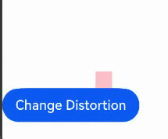

# DistortionComponent (System API)
<!--Kit: ArkUI-->
<!--Subsystem: ArkUI-->
<!--Owner: @hehongyang3-->
<!--Designer: @CCFFWW-->
<!--Tester: @lxl007-->
<!--Adviser: @Brilliantry_Rui-->

Defines a distortion component that provides spatial distortion visual effects.

>  **NOTE**
>
> - The APIs provided by this module are system APIs.
> 
> - The spatial distortion visual effect supports animation. For example, if you change the visual effect parameter in the closure of the [animateTo](../../apis-arkui/arkts-apis-uicontext-uicontext.md#animateto) animation API, a spatial distortion animation is generated.

**Since:** 26.0.0

## Child Components

Child components are supported.

## APIs

### DistortionComponent

DistortionComponent(options?: DistortionComponentOptions)

Creates a component that provides spatial distortion visual effects.

**Since:** 26.0.0

**System API:** This is a system API.

**Model restriction:** This API can be used only in the stage model.

**System capability:** SystemCapability.ArkUI.ArkUI.Full

**Parameters**

| Name | Type                                            | Mandatory| Description                                                        |
| ------- | ------------------------------------------------- | ---- | ------------------------------------------------------------ |
| options | [DistortionComponentOptions](#distortioncomponentoptions)  | No | Spatial distortion options.                                          |

## DistortionComponentOptions

Defines the spatial distortion options.

**Since:** 26.0.0

**System API:** This is a system API.

**Model restriction:** This API can be used only in the stage model.

**System capability:** SystemCapability.ArkUI.ArkUI.Full

| Name       | Type                                             | Read-Only | Optional| Description                                                        |
| ----------- | ------------------------------------------------- | ---- | ---- | ------------------------------------------------------------ |
| distortion  | [DistortionParam](#distortionparam) | No | Yes | Spatial distortion parameters. The spatial distortion effect is generated by specifying the position relationship of four corners and the barrel distortion degree of four edges.                                       |

## DistortionParam

Defines the spatial distortion parameters.

> **NOTE**
> - The coordinates of the four corners of the component can be set as follows: top-left corner: [0, 0], top-right corner: [1, 0], bottom-left corner: [0, 1], bottom-right corner: [1, 1].
> - For example, if the **bottomLeft** attribute is set to **[0.5, 0.5]**, the bottom-left corner is deformed to the position of the component center, and the corresponding distortion effect is generated.
> - When setting the coordinates of the four corners, ensure they follow spatial logic. For example, if **topLeft** is **[0, 0.7]** and **bottomLeft** is **[0, 0.2]**, the top-left corner is lower than the bottom-left corner, which violates the spatial logic and may cause rendering exceptions.

**Since:** 26.0.0

**System API:** This is a system API.

**Model restriction:** This API can be used only in the stage model.

**System capability:** SystemCapability.ArkUI.ArkUI.Full

| Name          | Type   | Read-Only | Optional| Description                                                                                                                                 |
| --------------- | --------- | ---- | ---- | ------------------------------------------------------------------------------------------------------------------------------------- |
| topLeft        | [Vector2](#vector2) | No | No  | Coordinates of the top-left corner.<br>Default value: **[0, 0]**                                                                                     |
| topRight       | [Vector2](#vector2) | No | No  | Coordinates of the top-right corner.<br>Default value: **[1, 0]**                                                                                    |
| bottomLeft     | [Vector2](#vector2) | No | No  | Coordinates of the bottom-left corner.<br>Default value: **[0, 1]**                                                                                    |
| bottomRight    | [Vector2](#vector2) | No | No  | Coordinates of the bottom-right corner.<br>Default value: **[1, 1]**                                                                                  |
| barrelDistortion | [Vector4](#vector4) | No  | No  | Barrel distortion degree of the four edges.<br>The four values in **Vector4** are as follows: **x** indicates the left edge, **y** indicates the right edge, **z** indicates the top edge, and **w** indicates the bottom edge.<br>Default value: **[0, 0, 0, 0]**<br>A positive value indicates outward distortion, and a negative value indicates inward distortion. When the absolute value of the distortion parameter reaches 1, the distortion degree is extreme.<br> Recommended value range for x, y, z, and w: **[-1, 1]**|


## Vector2

type Vector2 = Vector2

Defines the two-dimensional vector, which contains the x and y coordinates and indicates the position relationship.

**Since:** 26.0.0

**System API:** This is a system API.

**Model restriction:** This API can be used only in the stage model.

**System capability:** SystemCapability.ArkUI.ArkUI.Full

| Type  | Description    |
| ------ | -------- |
| [Vector2](../../apis-arkui/js-apis-arkui-graphics.md#vector2)   | A vector that contains two values: **x** and **y**.<br>**x** and **y** indicate the coordinate values.<br>Value range: (-∞, +∞)|


## Vector4

type Vector4 = Vector4

Defines the four-dimensional vector, which contains x, y, z, and w coordinates that indicate the barrel distortion degree.

**Since:** 26.0.0

**System API:** This is a system API.

**Model restriction:** This API can be used only in the stage model.

**System capability:** SystemCapability.ArkUI.ArkUI.Full

| Type  | Description    |
| ------ | -------- |
| [Vector4](../../apis-arkui/js-apis-arkui-graphics.md#vector4)   | A vector that contains four values: **x**, **y**, **z**, and **w**.<br>The values of **x**, **y**, **z**, and **w** indicate the barrel distortion degree on the left, right, top, and bottom sides of the component, respectively.<br>Value range: (-∞, +∞)|


## Attributes

Only the system material attribute [systemMaterial](ts-universal-attributes-image-effect-sys.md#systemmaterial23) is supported.

## Examples

### Example 1: Dynamically Changing the Distortion Visual Effect

This example demonstrates how to use the [DistortionComponent](#distortioncomponent) component to change the value of the **distortion** parameter to produce different distortion effects.

Since API version 26.0.0, the system component **DistortionComponent** is added.

```ts
// Example: Dynamically update the distortion effect. The foreground content of the custom component will be distorted.
@Entry
@Component
struct DistortionExample {
  @State distortionParam: DistortionParam = {
    topLeft: { x: 0.8, y: 0.8 },
    topRight: { x: 1, y: 0.8 },
    bottomLeft: { x: 0.8, y: 1 },
    bottomRight: { x: 1, y: 1 },
    barrelDistortion: {
      x: 0,
      y: 0,
      z: 0,
      w: 0
    },
  }

  build() {
    Column() {
      DistortionComponent({
        distortion: this.distortionParam
      }) {
        Column() {
        }
          .width(100)
          .height(100)
          .backgroundColor(Color.Pink)
      }

      Button('Change Distortion')
        .onClick(() => {
          this.distortionParam = {
            topLeft: { x: 0, y: 0 },
            topRight: { x: 1, y: 0 },
            bottomLeft: { x: 0.8, y: 1 },
            bottomRight: { x: 1, y: 1 },
            barrelDistortion: {
              x: 0,
              y: 0,
              z: 0,
              w: 0
            },
          }
        })
    }
  }
}
```

