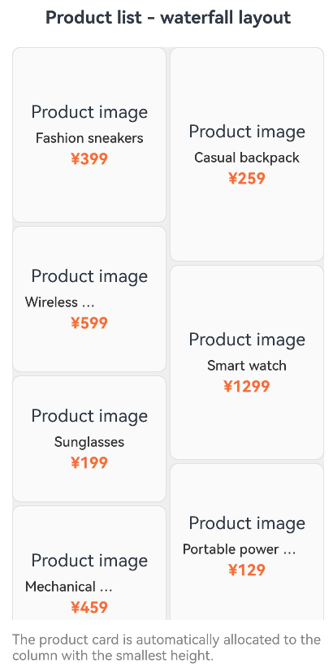
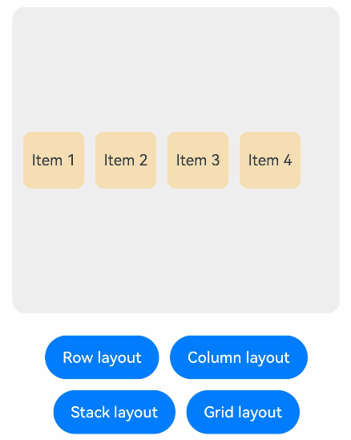
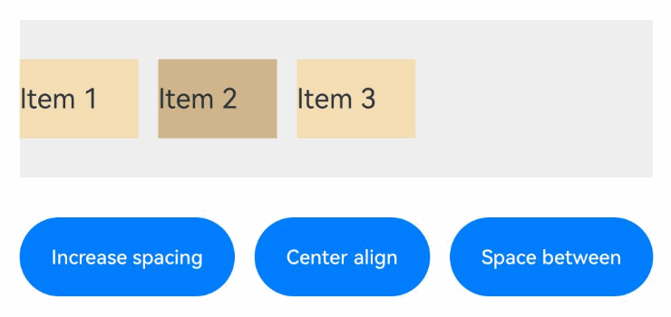

# DynamicLayout

<!--Kit: ArkUI-->
<!--Subsystem: ArkUI-->
<!--Owner: @zju_ljz-->
<!--Designer: @fenglinbailu-->
<!--Tester: @liuli0427-->
<!--Adviser: @Brilliantry_Rui-->
<!-- md-trans-meta sourceCommit=dac4f2b07a7203d2a3ed445760648d35364b1673 translatedAt=2026-08-21T02:22:25.492Z pushedAt=2026-08-21T07:28:16.897Z -->

A dynamic layout container component that supports dynamically switching between different layout algorithms at runtime without altering the state of child components. Using **DynamicLayout** improves layout flexibility and simplifies the development process for UI adaptation and multi-view switching. It is suitable for scenarios such as responsive layouts (adapting to different screen sizes), multi-view mode switching (e.g., switching between list, grid, and waterfall layouts), and user-defined layouts.

> **NOTE**
>
> - This component is supported since API version 24. Updates will be marked with a superscript to indicate their earliest API version.
>
> - The APIs of this module can be used only in the stage model.

## Child Components

Child components are supported.

## APIs

DynamicLayout(algorithm: LayoutAlgorithm)  

Defines the dynamic layout container.

**Widget capability:** This API can be used in ArkTS widgets since API version 24.

**Atomic service API:** This API can be used in atomic services since API version 24.

**Model restriction:** This API can be used only in the stage model.

**System capability:** SystemCapability.ArkUI.ArkUI.Full

**Parameters**

| Name| Type| Mandatory| Description|
| ---- | ---- | ---- | ---- |
| algorithm | [LayoutAlgorithm](../js-apis-arkui-layoutAlgorithm.md#layoutalgorithm-1) | Yes | Layout algorithm for the dynamic layout container. Supported layout algorithm instances include [RowLayoutAlgorithm](../js-apis-arkui-layoutAlgorithm.md#rowlayoutalgorithm) (horizontal linear layout, suitable for horizontal arrangement scenarios), [ColumnLayoutAlgorithm](../js-apis-arkui-layoutAlgorithm.md#columnlayoutalgorithm) (vertical linear layout, suitable for vertical arrangement scenarios), [StackLayoutAlgorithm](../js-apis-arkui-layoutAlgorithm.md#stacklayoutalgorithm) (stack layout, suitable for overlapping scenarios), [GridLayoutAlgorithm](../js-apis-arkui-layoutAlgorithm.md#gridlayoutalgorithm) (grid layout, suitable for regular grid scenarios), and [CustomLayoutAlgorithm](../js-apis-arkui-layoutAlgorithm.md#customlayoutalgorithm) (custom layout, suitable for complex and special layout scenarios). For details, see [LayoutAlgorithm](../js-apis-arkui-layoutAlgorithm.md#layoutalgorithm-1). If an invalid value (such as **null**, **undefined**, or an invalid layout algorithm object) is passed, child components are laid out according to [StackLayoutAlgorithm](../js-apis-arkui-layoutAlgorithm.md#stacklayoutalgorithm), with child components stacked on top of each other. |

## Attributes

The [universal attributes](ts-component-general-attributes.md) are supported.

> **NOTE**
>
> - When the layout algorithm is [RowLayoutAlgorithm](../js-apis-arkui-layoutAlgorithm.md#rowlayoutalgorithm) or [ColumnLayoutAlgorithm](../js-apis-arkui-layoutAlgorithm.md#columnlayoutalgorithm), the [flex layout](ts-universal-attributes-flex-layout.md) attributes set on child components take effect, while the [layoutGravity](ts-universal-attributes-location.md#layoutgravity20) attribute does not.
>
> - When the layout algorithm is [StackLayoutAlgorithm](../js-apis-arkui-layoutAlgorithm.md#stacklayoutalgorithm), the [layoutGravity](ts-universal-attributes-location.md#layoutgravity20) attribute set on child components takes effect, while the [flex layout](ts-universal-attributes-flex-layout.md) attributes do not.
>
> - When the layout algorithm is [CustomLayoutAlgorithm](../js-apis-arkui-layoutAlgorithm.md#customlayoutalgorithm), the [setMeasuredSize](../js-apis-arkui-frameNode.md#setmeasuredsize12) method of the **DynamicLayout** component's [FrameNode](../js-apis-arkui-frameNode.md#framenode-1) takes precedence over the [size settings](ts-universal-attributes-size.md) and [border](ts-universal-attributes-border.md) attributes, and the [measure](../js-apis-arkui-frameNode.md#measure12) and [layout](../js-apis-arkui-frameNode.md#layout12) methods of the child component's [FrameNode](../js-apis-arkui-frameNode.md#framenode-1) take precedence over the [ignoreLayoutSafeArea](ts-universal-attributes-expand-safe-area.md#ignorelayoutsafearea20) attribute.
>
> - When the layout algorithm is [GridLayoutAlgorithm](../js-apis-arkui-layoutAlgorithm.md#gridlayoutalgorithm), the [flex layout](ts-universal-attributes-flex-layout.md) attributes set on child components do not take effect, the [layoutGravity](ts-universal-attributes-location.md#layoutgravity20) attribute does not take effect, and the positions of child components are controlled by the **GridLayoutAlgorithm** parameters.

## Events

The [universal events](ts-component-general-events.md) are supported.

## Examples

### Example 1: Implementing Waterfall Layout Using a Custom Layout Algorithm

This example shows how to override the [onMeasure](../js-apis-arkui-layoutAlgorithm.md#onmeasure) and [onLayout](../js-apis-arkui-layoutAlgorithm.md#onlayout) functions to implement a waterfall layout for displaying a product list. In the waterfall layout, the heights of child components are calculated and the cumulative height of each column is recorded during the measurement phase, and child components are assigned to the column with the smallest current height during the layout phase, achieving an automatic fill effect.

Since API version 24, **onMeasure** and **onLayout** are added.

```typescript
import { DynamicLayout, CustomLayoutAlgorithm, LayoutAlgorithm, FrameNode, LayoutConstraint, Position } from '@kit.ArkUI';

// Waterfall layout algorithm
class WaterfallLayout extends CustomLayoutAlgorithm {
  private columnCount: number = 2;
  private columnGap: number = 10;
  private rowGap: number = 10;

  onMeasure(self: FrameNode, constraint: LayoutConstraint): void {
    const childCount = self.getChildrenCount();
    const columnWidth = (constraint.maxSize.width - (this.columnCount - 1) * this.columnGap) / this.columnCount;

    // Record the current height of each column.
    const columnHeights: number[] = new Array(this.columnCount).fill(0);

    for (let i = 0; i < childCount; i++) {
      const child = self.getChild(i);
      if (child) {
        // Set minSize and maxSize to the same value to restrict the width of child components.
        const childConstraint: LayoutConstraint = {
          maxSize: {
            width: columnWidth,
            height: constraint.maxSize.height
          },
          minSize: {
            width: columnWidth,
            height: 0
          },
          percentReference: constraint.percentReference
        };

        child.measure(childConstraint);

        // Find the column with the minimum height.
        const minColumn = columnHeights.indexOf(Math.min(...columnHeights));
        columnHeights[minColumn] += child.getMeasuredSize().height + this.rowGap;
      }
    }

    const maxHeight = Math.max(...columnHeights);
    self.setMeasuredSize({
      width: constraint.maxSize.width,
      height: maxHeight
    });
  }

  onLayout(self: FrameNode, position: Position): void {
    const childCount = self.getChildrenCount();
    const measuredSize = self.getMeasuredSize();
    const columnWidth = (measuredSize.width - (this.columnCount - 1) * this.columnGap) / this.columnCount;

    // Record the current Y coordinate of each column.
    const columnYs: number[] = new Array(this.columnCount).fill(0);

    for (let i = 0; i < childCount; i++) {
      const child = self.getChild(i);
      if (child) {
        const childSize = child.getMeasuredSize();

        // Find the column with the minimum Y coordinate.
        const minColumn = columnYs.indexOf(Math.min(...columnYs));
        const x = minColumn * (columnWidth + this.columnGap);
        const y = columnYs[minColumn];

        child.layout({ x, y });

        columnYs[minColumn] += childSize.height + this.rowGap;
      }
    }

    self.setLayoutPosition(position);
  }
}

@Entry
@ComponentV2
struct WaterfallLayoutExample {
  @Local algorithm: LayoutAlgorithm = new WaterfallLayout();

  // Product data
  private products: Product[] = [
    { id: '1', name: 'Fashion sneakers', price: '¥399', height: 180, image: 'Product image' },
    { id: '2', name: 'Casual backpack', price: '¥259', height: 220, image: 'Product image' },
    { id: '3', name: 'Wireless Bluetooth earbuds', price: '¥599', height: 150, image: 'Product image' },
    { id: '4', name: 'Smart watch', price: '¥1299', height: 200, image: 'Product image' },
    { id: '5', name: 'Sunglasses', price: '¥199', height: 130, image: 'Product image' },
    { id: '6', name: 'Portable power bank', price: '¥129', height: 170, image: 'Product image' },
    { id: '7', name: 'Mechanical keyboard', price: '¥459', height: 160, image: 'Product image' },
    { id: '8', name: 'Gaming mouse', price: '¥189', height: 140, image: 'Product image' },
    { id: '9', name: 'HD display', price: '¥1599', height: 210, image: 'Product image' },
    { id: '10', name: 'Smart speaker', price: '¥299', height: 190, image: 'Product image' }
  ];

  // Product card component
  @Builder ProductCard(product: Product) {
    Column() {
      Text(product.image)
        .fontSize(18)
        .margin({ bottom: 8 })
      Text(product.name)
        .fontSize(14)
        .fontWeight(FontWeight.Medium)
        .fontColor(0x333333)
        .margin({ bottom: 4 })
        .maxLines(1)
        .textOverflow({ overflow: TextOverflow.Ellipsis })
      Text(product.price)
        .fontSize(16)
        .fontColor(0xFF6B35)
        .fontWeight(FontWeight.Bold)
    }
    .width('100%')
    .padding(12)
    .backgroundColor(0xFAFAFA)
    .borderRadius(8)
    .border({ width: 1, color: 0xE0E0E0 })
    .height(product.height)
    .justifyContent(FlexAlign.Center)
  }

  build() {
    Column() {
      Text('Product list - waterfall layout')
        .fontSize(18)
        .fontWeight(FontWeight.Bold)
        .margin({ bottom: 20 })

      Scroll() {
        DynamicLayout(this.algorithm) {
          ForEach(this.products, (product: Product) => {
            this.ProductCard(product)
          })
        }
        .width('100%')
        .backgroundColor(0xEFEFEF)
        .borderRadius(12)
        .padding(10)
      }
      .scrollable(ScrollDirection.Vertical)
      .scrollBar(BarState.Auto)
      .edgeEffect(EdgeEffect.Spring)
      .width('100%')
      .layoutWeight(1)

      Text('The product card is automatically allocated to the column with the smallest height.')
        .fontSize(14)
        .fontColor(Color.Gray)
        .margin({ top: 12 })
    }
    .padding(20)
    .width('100%')
    .height('100%')
  }
}

// Product data model
interface Product {
  id: string;
  name: string;
  price: string;
  height: number;
  image: string;
}
```



### Example 2: Switching the Layout Algorithm

This example shows how to dynamically switch the layout algorithm of the **DynamicLayout** component by changing the [LayoutAlgorithm](../js-apis-arkui-layoutAlgorithm.md#layoutalgorithm-1) variable decorated with [@Local](../../../ui/state-management/arkts-new-local.md). The example demonstrates how to switch the layout algorithm to [RowLayoutAlgorithm](../js-apis-arkui-layoutAlgorithm.md#rowlayoutalgorithm) (horizontal linear layout), [ColumnLayoutAlgorithm](../js-apis-arkui-layoutAlgorithm.md#columnlayoutalgorithm) (vertical linear layout), [StackLayoutAlgorithm](../js-apis-arkui-layoutAlgorithm.md#stacklayoutalgorithm) (stack layout), and [GridLayoutAlgorithm](../js-apis-arkui-layoutAlgorithm.md#gridlayoutalgorithm) (grid layout).

> **NOTE**
>
> In this example, the preset **layoutGravity** attribute takes effect only under the **Stack** layout algorithm and does not take effect under the **Row** or **Column** layout algorithm.

Since API version 24, **RowLayoutAlgorithm**, **ColumnLayoutAlgorithm**, **StackLayoutAlgorithm**, and **GridLayoutAlgorithm** have been added.

```typescript
import { DynamicLayout, RowLayoutAlgorithm, ColumnLayoutAlgorithm, StackLayoutAlgorithm, GridLayoutAlgorithm, LayoutAlgorithm, LengthMetrics } from '@kit.ArkUI';

@Entry
@ComponentV2
struct LayoutSwitchExample {
  @Local algorithm: LayoutAlgorithm = new RowLayoutAlgorithm({
    space: LengthMetrics.vp(10),
    alignItems: VerticalAlign.Center
  });
  @Local childWidth: string = '20%'
  @Local childHeight: string = '20%'

  build() {
    Column() {
      // Use the status variable to control the layout algorithm.
      DynamicLayout(this.algorithm) {
        Text('Item 1')
          .width(this.childWidth)
          .height(this.childHeight)
          .fontSize(14)
          .textAlign(TextAlign.Center)
          .backgroundColor(0xF5DEB3)
          .borderRadius(8)
          .layoutGravity(LocalizedAlignment.TOP_START)
        Text('Item 2')
          .width(this.childWidth)
          .height(this.childHeight)
          .fontSize(14)
          .textAlign(TextAlign.Center)
          .backgroundColor(0xF5DEB3)
          .borderRadius(8)
          .layoutGravity(LocalizedAlignment.TOP_END)
        Text('Item 3')
          .width(this.childWidth)
          .height(this.childHeight)
          .fontSize(14)
          .textAlign(TextAlign.Center)
          .backgroundColor(0xF5DEB3)
          .borderRadius(8)
          .layoutGravity(LocalizedAlignment.BOTTOM_START)
        Text('Item 4')
          .width(this.childWidth)
          .height(this.childHeight)
          .fontSize(14)
          .textAlign(TextAlign.Center)
          .backgroundColor(0xF5DEB3)
          .borderRadius(8)
          .layoutGravity(LocalizedAlignment.BOTTOM_END)
      }
      .width(300)
      .height(280)
      .backgroundColor(0xEFEFEF)
      .borderRadius(12)
      .padding(10)

      Column({ space: 10 }) {
        Row({ space: 10 }) {
          Button('Row layout')
            .fontSize(14)
            .onClick(() => {
              this.algorithm = new RowLayoutAlgorithm({
                space: LengthMetrics.vp(10),
                alignItems: VerticalAlign.Center
              });
              this.childWidth = '20%'
              this.childHeight = '20%'
            })
          Button('Column layout')
            .fontSize(14)
            .onClick(() => {
              this.algorithm = new ColumnLayoutAlgorithm({
                space: LengthMetrics.vp(10),
                alignItems: HorizontalAlign.Center
              });
              this.childWidth = '20%'
              this.childHeight = '20%'
            })
        }
        Row({ space: 10 }) {
          Button('Stack layout')
            .fontSize(14)
            .onClick(() => {
              this.algorithm = new StackLayoutAlgorithm({
                alignContent: LocalizedAlignment.CENTER
              });
              this.childWidth = '20%'
              this.childHeight = '20%'
            })
          Button('Grid layout')
            .fontSize(14)
            .onClick(() => {
              this.algorithm = new GridLayoutAlgorithm({
                columnsTemplate: '1fr 1fr',
                rowsGap: LengthMetrics.vp(5),
                columnsGap: LengthMetrics.vp(5)
              });
              this.childWidth = '100%'
              this.childHeight = '50%'
            })
        }
      }
      .margin({ top: 20 })
    }
    .padding(20)
  }
}
```



### Example 3: Modifying the Layout Algorithm Attributes

This example shows how to modify the **space** and **justifyContent** attributes of [RowLayoutAlgorithm](../js-apis-arkui-layoutAlgorithm.md#rowlayoutalgorithm) to update the layout effect of the **DynamicLayout** component.

Since API version 24, the **space** and **justifyContent** attributes are added.

```typescript
import { DynamicLayout, RowLayoutAlgorithm, LengthMetrics } from '@kit.ArkUI';

@Entry
@ComponentV2
struct PropertyChangeExample {
  algorithm: RowLayoutAlgorithm = new RowLayoutAlgorithm({
    space: LengthMetrics.vp(10),
    justifyContent: FlexAlign.Start
  });

  build() {
    Column() {
      DynamicLayout(this.algorithm) {
        Text('Item 1')
          .width(60)
          .height(40)
          .fontSize(14)
          .backgroundColor(0xF5DEB3)
        Text('Item 2')
          .width(60)
          .height(40)
          .fontSize(14)
          .backgroundColor(0xD2B48C)
        Text('Item 3')
          .width(60)
          .height(40)
          .fontSize(14)
          .backgroundColor(0xF5DEB3)
      }
      .width('100%')
      .height(80)
      .backgroundColor(0xEFEFEF)

      Row({ space: 10 }) {
        Button('Increase spacing')
          .fontSize(14)
          .onClick(() => {
            // Modify the space attribute to trigger re-layout.
            const currentSpace = this.algorithm.space?.value;
            this.algorithm.space = LengthMetrics.vp(currentSpace as number + 5);
          })
        Button('Center align')
          .fontSize(14)
          .onClick(() => {
            // Modify the justifyContent attribute to trigger re-layout.
            this.algorithm.justifyContent = FlexAlign.Center;
          })
        Button('Space between')
          .fontSize(14)
          .onClick(() => {
            // Set the justifyContent attribute to space-between.
            this.algorithm.justifyContent = FlexAlign.SpaceBetween;
          })
      }
      .margin({ top: 20 })
    }
    .padding(20)
  }
}
```

