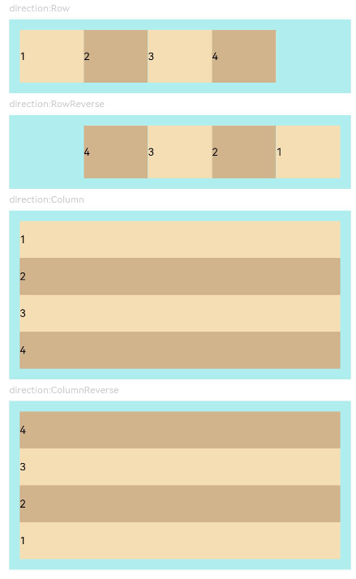
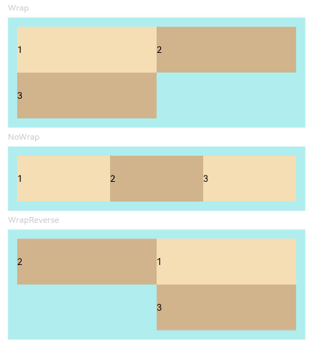
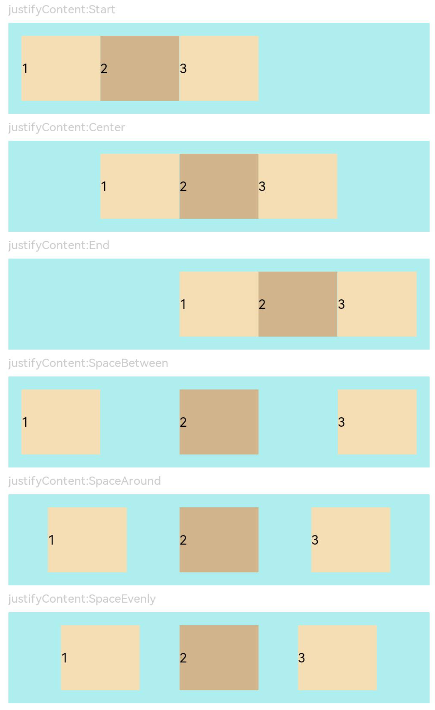
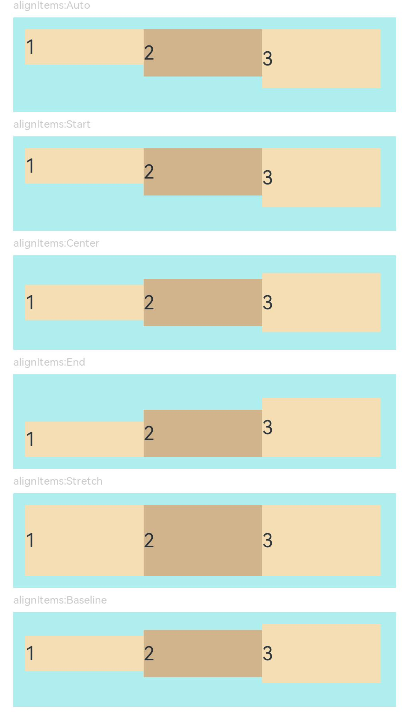
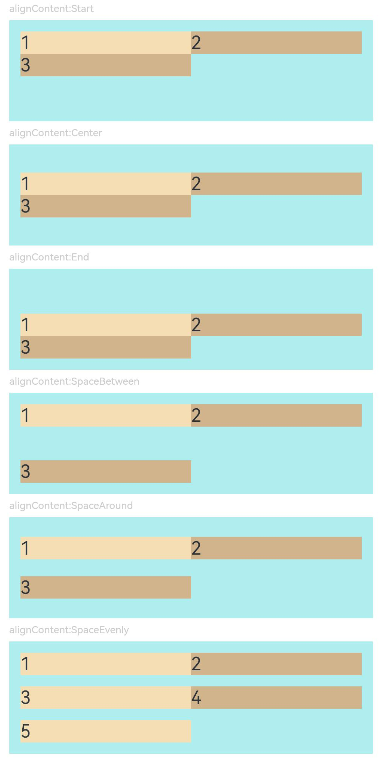
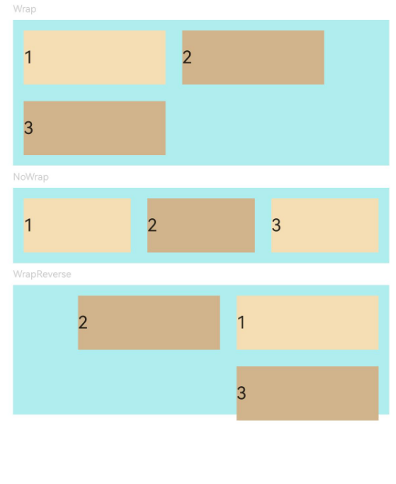
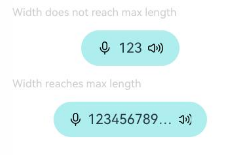

# Flex

<!--Kit: ArkUI-->
<!--Subsystem: ArkUI-->
<!--Owner: @camlostshi-->
<!--Designer: @fenglinbailu-->
<!--Tester: @liuli0427-->
<!--Adviser: @Brilliantry_Rui-->
<!-- md-trans-meta sourceCommit=75a7d62c0702c21a06ca0119552a942305a023cc translatedAt=2026-08-21T02:23:08.218Z pushedAt=2026-08-21T07:32:26.152Z -->

The **Flex** component is a container that uses the flexible box model for layout. It provides an efficient mechanism for arranging and aligning child elements, as well as distributing available space among them.

For details, see [Flex Layout](../../../ui/arkts-layout-development-flex-layout.md).

> **NOTE**
>
> - This component is supported since API version 7. Updates will be marked with a superscript to indicate their earliest API version.
> - The **Flex** component involves a secondary layout process during rendering. Therefore, in scenarios with strict performance requirements, you are advised to use [Column](ts-container-column.md) or [Row](ts-container-row.md) instead. For best practices, see the layout optimization guide - Proper Use of Layout Components.
> - When the main axis length of the **Flex** component is not set, it fills the parent container by default. If a child component with [position](ts-universal-attributes-location.md#position) set is included, the **Flex** component will not fill the parent container. When the main axis length of the [Column](ts-container-column.md) or [Row](ts-container-row.md) component is not set, it follows the child node size by default.
> - When the **Flex**, **Column**, or **Row** component has no child nodes and no width or height is set, the default width and height are **-1**.
> - The main axis length can be set to **auto** to make the **Flex** component adapt to the child component layout. During adaptation, the **Flex** length is constrained by the [constraintSize](ts-universal-attributes-size.md#constraintsize) attribute and the maximum and minimum lengths passed by the parent container, with the **constraintSize** attribute taking higher priority.

## Child Components

This component can contain child components.

## APIs

Flex(value?: FlexOptions)

Creates a **Flex** layout container for arranging and aligning child components in a flexible manner and distributing remaining space.

**Widget capability**: This API can be used in ArkTS widgets since API version 9.

**Atomic service API**: This API can be used in atomic services since API version 11.

**System capability**: SystemCapability.ArkUI.ArkUI.Full

**Parameters**

| Name           | Type       | Mandatory  | Description                                    |
| -------------- | ---------------------------------------- | ---- |  ---------------------------------------- |
| value      | [FlexOptions](#flexoptions) | No    | Configuration options of the **Flex** container, used to set the layout direction, wrapping mode, alignment, and spacing of child components. If not passed, the default configuration is used. For details about the default values of each attribute, see [FlexOptions](#flexoptions).               |

## FlexOptions

Describes the layout and alignment of child components within the **Flex** component.

**System capability**: SystemCapability.ArkUI.ArkUI.Full

| Name| Type| Read-Only| Optional| Description|
| -------- | -------- | -------- | -------- | -------- |
| direction      | [FlexDirection](ts-appendix-enums.md#flexdirection) | No | Yes     | Direction in which child components are arranged in the **Flex** container, that is, the direction of the main axis. After this attribute is set, child components are arranged along the main axis in the specified direction.<br>Default value: **FlexDirection.Row**<br>Invalid values are handled as the default value.<br>The options are as follows:<br>- **Row**: The main axis runs horizontally, starting from the left.<br>- **RowReverse**: The main axis runs horizontally, starting from the right.<br>- **Column**: The main axis runs vertically, starting from the top.<br>- **ColumnReverse**: The main axis runs vertically, starting from the bottom.<br>The starting positions of **Row** and **RowReverse** are affected by the **direction** attribute of the container.<br>**Widget capability:** This API can be used in ArkTS widgets since API version 9.<br>**Atomic service API:** This API can be used in atomic services since API version 11.            |
| wrap           | [FlexWrap](ts-appendix-enums.md#flexwrap) | No | Yes     | Whether the **Flex** container has a single line/column or multiple lines/columns. After this attribute is set, child components are laid out in the container according to the specified wrap mode.<br>Default value: **FlexWrap.NoWrap**<br>Invalid values are handled as the default value.<br>The options are as follows:<br>- **NoWrap**: No wrapping. Child components are truncated if their total width exceeds the container width.<br>- **Wrap**: Wrapping is enabled. The first line is at the top.<br>- **WrapReverse**: Wrapping is enabled. The first line is at the bottom.<br>**Note:** In multi-line layout, the stacking direction of new lines is determined by the cross axis direction.<br>**Widget capability:** This API can be used in ArkTS widgets since API version 9.<br>**Atomic service API:** This API can be used in atomic services since API version 11. |
| justifyContent | [FlexAlign](ts-appendix-enums.md#flexalign) | No | Yes     | Alignment of all child components on the main axis of the **Flex** container. After this attribute is set, child components are distributed and arranged along the main axis according to the specified alignment.<br>Default value: **FlexAlign.Start**<br>Invalid values are handled as the default value.<br>The options are as follows:<br>- **Start**: Aligned with the start edge.<br>- **Center**: Center alignment.<br>- **End**: Aligned with the end edge.<br>- **SpaceBetween**: Aligned with both edges, with equal spacing between child components.<br>- **SpaceAround**: Equal spacing on both sides of each child component.<br>- **SpaceEvenly**: Equal spacing between child components and at both ends.<br>**Note:** When **justifyContent** is set to **SpaceBetween**, **SpaceAround**, or **SpaceEvenly**, the **space** parameter does not take effect.<br>**Widget capability:** This API can be used in ArkTS widgets since API version 9.<br>**Atomic service API:** This API can be used in atomic services since API version 11.                  |
| alignItems     | [ItemAlign](ts-appendix-enums.md#itemalign) | No | Yes     | Alignment of all child components on the cross axis of the **Flex** container. After this attribute is set, child components are positioned along the cross axis according to the specified alignment.<br>Default value: **ItemAlign.Start**<br>Invalid values are handled as the default value.<br>The options are as follows:<br>- **Auto**: Uses the alignment of the parent container.<br>- **Start**: Aligned with the start edge.<br>- **Center**: Center alignment.<br>- **End**: Aligned with the end edge.<br>- **Stretch**: Stretched to fill the container.<br>- **Baseline**: Aligned with the baseline.<br>**Widget capability:** This API can be used in ArkTS widgets since API version 9.<br>**Atomic service API:** This API can be used in atomic services since API version 11.               |
| alignContent   | [FlexAlign](ts-appendix-enums.md#flexalign) | No | Yes     | Alignment of multiple lines of content when there is extra space on the cross axis. This attribute takes effect only when wrap is set to **Wrap** or **WrapReverse**.<br>Default value: **FlexAlign.Start**<br>Invalid values are handled as the default value.<br>The options are as follows:<br>- **Start**: Aligned with the start edge.<br>- **Center**: Center alignment.<br>- **End**: Aligned with the end edge.<br>- **SpaceBetween**: Aligned with both edges, with equal spacing between lines.<br>- **SpaceAround:** Equal spacing on both sides of each line.<br>- **SpaceEvenly**: Equal spacing between lines and at both ends.<br>**Widget capability:** This API can be used in ArkTS widgets since API version 9.<br>**Atomic service API:** This API can be used in atomic services since API version 11.  |
| space<sup>12+</sup>          | [FlexSpaceOptions<sup>12+</sup>](#flexspaceoptions12) | No | Yes   | Spacing between child components in the **Flex** container on the main axis and cross axis. It contains two attributes: **main** and **cross**. Pass this parameter when you need to adjust the spacing between child components. If not passed, there is no spacing between child components.<br>Default value: **{main: LengthMetrics.px(0), cross: LengthMetrics.px(0)}**<br>Invalid values are handled as the default value.<br>When **space.main** or **space.cross** is a negative value, or when **justifyContent** is set to **FlexAlign.SpaceBetween**, **FlexAlign.SpaceAround**, or **FlexAlign.SpaceEvenly**, the **space** parameter does not take effect. The **main** attribute takes effect in both single-line and multi-line layouts, while the **cross** attribute takes effect only when **wrap** is set to **Wrap** or **WrapReverse** (multi-line layout).<br>**Atomic service API:** This API can be used in atomic services since API version 12.<br>**Model restriction:** This API can be used only in the stage model.|

## FlexSpaceOptions<sup>12+</sup>

Sets the spacing between child components along the main axis or cross axis of the **Flex** component.

**Atomic service API**: This API can be used in atomic services since API version 12.

**Model restriction:** This API can be used only in the stage model.

**System capability**: SystemCapability.ArkUI.ArkUI.Full

| Name         | Type       |  Read-Only    | Optional     | Description     |
| ----------- | --------- | ----------- | --------- |----------- |
| main   | [LengthMetrics](../js-apis-arkui-graphics.md#lengthmetrics12)  | No | Yes | Spacing between adjacent child components on the main axis of the **Flex** container. After being set, adjacent child components in the main axis direction are separated by the specified spacing. This takes effect in both single-line and multi-line layouts. This parameter does not take effect when **space.main** is a negative number, or when **justifyContent** is set to **FlexAlign.SpaceBetween**, **FlexAlign.SpaceAround**, or **FlexAlign.SpaceEvenly**.<br>Default value: **LengthMetrics.px(0)** |
| cross  | [LengthMetrics](../js-apis-arkui-graphics.md#lengthmetrics12) | No | Yes | Spacing between adjacent lines on the cross axis of the **Flex** container. After being set, adjacent lines in the cross axis direction are separated by the specified spacing. This takes effect only in multi-line layouts (when **wrap** is set to **Wrap** or **WrapReverse**). This parameter does not take effect when **space.cross** is a negative number, or when **justifyContent** is set to **FlexAlign.SpaceBetween**, **FlexAlign.SpaceAround**, or **FlexAlign.SpaceEvenly**.<br>Default value: **LengthMetrics.px(0)** |

## Attributes

The [universal attributes](ts-component-general-attributes.md) are supported.

## Events

The [universal events](ts-component-general-events.md) are supported.

## Example

### Example 1: Setting the Child Component Layout Direction

This example demonstrates different layout directions for child components by setting the **direction** property.

```ts
// xxx.ets
@Entry
@Component
struct FlexExample1 {
  build() {
    Column() {
      Column({ space: 5 }) {
        Text('direction:Row').fontSize(9).fontColor(0xCCCCCC).width('90%')
        Flex({ direction: FlexDirection.Row }) { // The child components are arranged in the same direction as the main axis runs along the rows.
          Text('1').width('20%').height(50).backgroundColor(0xF5DEB3)
          Text('2').width('20%').height(50).backgroundColor(0xD2B48C)
          Text('3').width('20%').height(50).backgroundColor(0xF5DEB3)
          Text('4').width('20%').height(50).backgroundColor(0xD2B48C)
        }
        .height(70)
        .width('90%')
        .padding(10)
        .backgroundColor(0xAFEEEE)

        Text('direction:RowReverse').fontSize(9).fontColor(0xCCCCCC).width('90%')
        Flex({ direction: FlexDirection.RowReverse }) { // The child components are arranged opposite to the Row direction.
          Text('1').width('20%').height(50).backgroundColor(0xF5DEB3)
          Text('2').width('20%').height(50).backgroundColor(0xD2B48C)
          Text('3').width('20%').height(50).backgroundColor(0xF5DEB3)
          Text('4').width('20%').height(50).backgroundColor(0xD2B48C)
        }
        .height(70)
        .width('90%')
        .padding(10)
        .backgroundColor(0xAFEEEE)

        Text('direction:Column').fontSize(9).fontColor(0xCCCCCC).width('90%')
        Flex({ direction: FlexDirection.Column }) { // The child components are arranged in the same direction as the main axis runs down the columns.
          Text('1').width('100%').height(40).backgroundColor(0xF5DEB3)
          Text('2').width('100%').height(40).backgroundColor(0xD2B48C)
          Text('3').width('100%').height(40).backgroundColor(0xF5DEB3)
          Text('4').width('100%').height(40).backgroundColor(0xD2B48C)
        }
        .height(160)
        .width('90%')
        .padding(10)
        .backgroundColor(0xAFEEEE)

        Text('direction:ColumnReverse').fontSize(9).fontColor(0xCCCCCC).width('90%')
        Flex({ direction: FlexDirection.ColumnReverse }) { // The child components are arranged opposite to the Column direction.
          Text('1').width('100%').height(40).backgroundColor(0xF5DEB3)
          Text('2').width('100%').height(40).backgroundColor(0xD2B48C)
          Text('3').width('100%').height(40).backgroundColor(0xF5DEB3)
          Text('4').width('100%').height(40).backgroundColor(0xD2B48C)
        }
        .height(160)
        .width('90%')
        .padding(10)
        .backgroundColor(0xAFEEEE)
      }.width('100%').margin({ top: 5 })
    }.width('100%')
  }
}
```



### Example 2: Implementing Single- and Multi-Line Layouts

This example demonstrates single-line and multi-line layouts for child components by setting the **wrap** property.

```ts
// xxx.ets
@Entry
@Component
struct FlexExample2 {
  build() {
    Column() {
      Column({ space: 5 }) {
        Text('Wrap').fontSize(9).fontColor(0xCCCCCC).width('90%')
        Flex({ wrap: FlexWrap.Wrap }) { // The child components are arranged in multiple lines.
          Text('1').width('50%').height(50).backgroundColor(0xF5DEB3)
          Text('2').width('50%').height(50).backgroundColor(0xD2B48C)
          Text('3').width('50%').height(50).backgroundColor(0xD2B48C)
        }
        .width('90%')
        .padding(10)
        .backgroundColor(0xAFEEEE)

        Text('NoWrap').fontSize(9).fontColor(0xCCCCCC).width('90%')
        Flex({ wrap: FlexWrap.NoWrap }) { // The child components are arranged in a single line.
          Text('1').width('50%').height(50).backgroundColor(0xF5DEB3)
          Text('2').width('50%').height(50).backgroundColor(0xD2B48C)
          Text('3').width('50%').height(50).backgroundColor(0xF5DEB3)
        }
        .width('90%')
        .padding(10)
        .backgroundColor(0xAFEEEE)

        Text('WrapReverse').fontSize(9).fontColor(0xCCCCCC).width('90%')
        Flex({ wrap: FlexWrap.WrapReverse , direction:FlexDirection.Row }) { // The child components are reversely arranged in multiple lines, and they may overflow.
          Text('1').width('50%').height(50).backgroundColor(0xF5DEB3)
          Text('2').width('50%').height(50).backgroundColor(0xD2B48C)
          Text('3').width('50%').height(50).backgroundColor(0xD2B48C)
        }
        .width('90%')
        .height(120)
        .padding(10)
        .backgroundColor(0xAFEEEE)
      }.width('100%').margin({ top: 5 })
    }.width('100%')
  }
}
```



### Example 3: Setting Alignment Along the Main Axis

This example demonstrates different alignment effects for child components along the main axis by setting the **justifyContent** property.

```ts
// xxx.ets
@Component
struct JustifyContentFlex {
  justifyContent: number = 0;

  build() {
    Flex({ justifyContent: this.justifyContent }) {
      Text('1').width('20%').height(50).backgroundColor(0xF5DEB3)
      Text('2').width('20%').height(50).backgroundColor(0xD2B48C)
      Text('3').width('20%').height(50).backgroundColor(0xF5DEB3)
    }
    .width('90%')
    .padding(10)
    .backgroundColor(0xAFEEEE)
  }
}

@Entry
@Component
struct FlexExample3 {
  build() {
    Column() {
      Column({ space: 5 }) {
        Text('justifyContent:Start').fontSize(9).fontColor(0xCCCCCC).width('90%')
        JustifyContentFlex({ justifyContent: FlexAlign.Start }) // The child components are aligned with the start edge of the main axis.

        Text('justifyContent:Center').fontSize(9).fontColor(0xCCCCCC).width('90%')
        JustifyContentFlex({ justifyContent: FlexAlign.Center }) // The child components are aligned in the center of the main axis.

        Text('justifyContent:End').fontSize(9).fontColor(0xCCCCCC).width('90%')
        JustifyContentFlex({ justifyContent: FlexAlign.End }) // The child components are aligned with the end edge of the main axis.

        Text('justifyContent:SpaceBetween').fontSize(9).fontColor(0xCCCCCC).width('90%')
        JustifyContentFlex({ justifyContent: FlexAlign.SpaceBetween }) // The child components are evenly distributed along the main axis. The first component is aligned with the main-start, the last component is aligned with the main-end.

        Text('justifyContent:SpaceAround').fontSize(9).fontColor(0xCCCCCC).width('90%')
        JustifyContentFlex({ justifyContent: FlexAlign.SpaceAround }) // The child components evenly divide the container layout on the main axis, with equal space on both sides of each child component. Therefore, the distance from the first child component to the line start and from the last child component to the line end is half the distance between adjacent child components.

        Text('justifyContent:SpaceEvenly').fontSize(9).fontColor(0xCCCCCC).width('90%')
        JustifyContentFlex({ justifyContent: FlexAlign.SpaceEvenly }) // The child components are evenly distributed along the main axis. The space between the first component and main-start, the space between the last component and main-end, and the space between any two adjacent components are the same.
      }.width('100%').margin({ top: 5 })
    }.width('100%')
  }
}
```



### Example 4: Setting Alignment Along the Cross Axis

This example demonstrates different alignment effects for child components along the cross axis by setting the **alignItems** property.

```ts
// xxx.ets
@Component
struct AlignItemsFlex {
  alignItems: number = 0;

  build() {
    Flex({ alignItems: this.alignItems }) {
      Text('1').width('33%').height(30).backgroundColor(0xF5DEB3)
      Text('2').width('33%').height(40).backgroundColor(0xD2B48C)
      Text('3').width('33%').height(50).backgroundColor(0xF5DEB3)
    }
    .size({width: '90%', height: 80})
    .padding(10)
    .backgroundColor(0xAFEEEE)
  }
}

@Entry
@Component
struct FlexExample4 {
  build() {
    Column() {
      Column({ space: 5 }) {
        Text('alignItems:Auto').fontSize(9).fontColor(0xCCCCCC).width('90%')
        AlignItemsFlex({ alignItems: ItemAlign.Auto }) // Automatically aligns child components on the cross axis of the container.

        Text('alignItems:Start').fontSize(9).fontColor(0xCCCCCC).width('90%')
        AlignItemsFlex({ alignItems: ItemAlign.Start }) // The items in the container are aligned with the cross-start edge.

        Text('alignItems:Center').fontSize(9).fontColor(0xCCCCCC).width('90%')
        AlignItemsFlex({alignItems: ItemAlign.Center}) // The items in the container are centered along the cross axis.

        Text('alignItems:End').fontSize(9).fontColor(0xCCCCCC).width('90%')
        AlignItemsFlex({ alignItems: ItemAlign.End }) // The items in the container are aligned with the cross-end edge.

        Text('alignItems:Stretch').fontSize(9).fontColor(0xCCCCCC).width('90%')
        AlignItemsFlex({ alignItems: ItemAlign.Stretch }) // The items in the container are stretched and padded along the cross axis.

        Text('alignItems:Baseline').fontSize(9).fontColor(0xCCCCCC).width('90%')
        AlignItemsFlex({ alignItems: ItemAlign.Baseline }) // The items in the container are aligned in such a manner that their text baselines are aligned along the cross axis.
      }.width('100%').margin({ top: 5 })
    }.width('100%')
  }
}
```



### Example 5: Setting Alignment of Multiple Lines

This example demonstrates different alignment effects for multiple lines of content by setting the **alignContent** property.

```ts
// xxx.ets
@Component
struct AlignContentFlex {
  alignContent: number = 0;

  build() {
    Flex({ wrap: FlexWrap.Wrap, alignContent: this.alignContent }) {
      Text('1').width('50%').height(20).backgroundColor(0xF5DEB3)
      Text('2').width('50%').height(20).backgroundColor(0xD2B48C)
      Text('3').width('50%').height(20).backgroundColor(0xD2B48C)
    }
    .size({ width: '90%', height: 90 })
    .padding(10)
    .backgroundColor(0xAFEEEE)
  }
}

@Entry
@Component
struct FlexExample5 {
  build() {
    Column() {
      Column({ space: 5 }) {
        Text('alignContent:Start').fontSize(9).fontColor(0xCCCCCC).width('90%')
        AlignContentFlex({ alignContent: FlexAlign.Start }) // The child components are aligned with the start edge in the multi-row layout.

        Text('alignContent:Center').fontSize(9).fontColor(0xCCCCCC).width('90%')
        AlignContentFlex({ alignContent: FlexAlign.Center }) // The child components are aligned in the center in the multi-row layout.

        Text('alignContent:End').fontSize(9).fontColor(0xCCCCCC).width('90%')
        AlignContentFlex({ alignContent: FlexAlign.End }) // The child components are aligned with the end edge in the multi-row layout.

        Text('alignContent:SpaceBetween').fontSize(9).fontColor(0xCCCCCC).width('90%')
        AlignContentFlex({ alignContent: FlexAlign.SpaceBetween }) // In the multi-row layout, the child component in the first row is aligned with the start edge of the column, and the child component in the last row is aligned with the end edge of the column.

        Text('alignContent:SpaceAround').fontSize(9).fontColor(0xCCCCCC).width('90%')
        AlignContentFlex({ alignContent: FlexAlign.SpaceAround }) // In the multi-row layout, the space between the child component in the first row and the start edge of the column, and that between the child component in the last row and the end edge of the column are both half the size of the space between two adjacent rows.

        Text('alignContent:SpaceEvenly').fontSize(9).fontColor(0xCCCCCC).width('90%')
        Flex({
          wrap: FlexWrap.Wrap,
          alignContent: FlexAlign.SpaceEvenly
        }) {// In the multi-row layout, the space between the child component in the first row and the start edge of the column, the space between the child component in the last row and the end edge of the column, and the space between any two adjacent rows are the same.
          Text('1').width('50%').height(20).backgroundColor(0xF5DEB3)
          Text('2').width('50%').height(20).backgroundColor(0xD2B48C)
          Text('3').width('50%').height(20).backgroundColor(0xF5DEB3)
          Text('4').width('50%').height(20).backgroundColor(0xD2B48C)
          Text('5').width('50%').height(20).backgroundColor(0xF5DEB3)
        }
        .size({ width: '90%', height: 100 })
        .padding({ left: 10, right: 10 })
        .backgroundColor(0xAFEEEE)
      }.width('100%').margin({ top: 5 })
    }.width('100%')
  }
}
```



### Example 6: Setting the Spacing Between Child Components Along the Main Axis or Cross Axis

This example sets the spacing along the main axis and cross axis for child components in single-line or multi-line arrangement by configuring the **space** attribute.

```ts
import {LengthMetrics} from '@kit.ArkUI';

@Entry
@Component
struct FlexExample6 {
  build() {
    Column() {
      Column({ space: 5 }) {
        Text('Wrap').fontSize(9).fontColor(0xCCCCCC).width('90%')
        Flex({ wrap: FlexWrap.Wrap, space: {main: LengthMetrics.px(50), cross: LengthMetrics.px(50)} }) { // The child components are arranged in multiple lines.
          Text('1').width('40%').height(50).backgroundColor(0xF5DEB3)
          Text('2').width('40%').height(50).backgroundColor(0xD2B48C)
          Text('3').width('40%').height(50).backgroundColor(0xD2B48C)
        }
        .width('90%')
        .padding(10)
        .backgroundColor(0xAFEEEE)

        Text('NoWrap').fontSize(9).fontColor(0xCCCCCC).width('90%')
        Flex({ wrap: FlexWrap.NoWrap, space: {main: LengthMetrics.px(50), cross: LengthMetrics.px(50)} }) { // The child components are arranged in a single line.
          Text('1').width('50%').height(50).backgroundColor(0xF5DEB3)
          Text('2').width('50%').height(50).backgroundColor(0xD2B48C)
          Text('3').width('50%').height(50).backgroundColor(0xF5DEB3)
        }
        .width('90%')
        .padding(10)
        .backgroundColor(0xAFEEEE)

        Text('WrapReverse').fontSize(9).fontColor(0xCCCCCC).width('90%')
        Flex({ wrap: FlexWrap.WrapReverse, direction:FlexDirection.Row, space: {main: LengthMetrics.px(50), cross: LengthMetrics.px(50)} }) { // The child components are reversely arranged in multiple lines.
          Text('1').width('40%').height(50).backgroundColor(0xF5DEB3)
          Text('2').width('40%').height(50).backgroundColor(0xD2B48C)
          Text('3').width('40%').height(50).backgroundColor(0xD2B48C)
        }
        .width('90%')
        .height(120)
        .padding(10)
        .backgroundColor(0xAFEEEE)
      }.width('100%').margin({ top: 5 })
    }.width('100%')
  }
}
```



### Example 7: Implementing a Flex Component with Adaptive Width

This example shows how the **Flex** component can automatically adjust to fit the layout of child components when the width is set to **auto**.

```ts
@Component
struct Demo {
  @Require @Prop text: string

  build() {
    Button() {
      Flex() {
        Image($r('sys.media.ohos_ic_public_voice'))
          .width(16)
          .height(16)

        Row() {
          Text(this.text)
            .margin({
              left: 6,
              right: 6
            })
            .fontSize(14)
            .maxLines(1)
            .textOverflow({ overflow: TextOverflow.Ellipsis })
        }

        Image($r('sys.media.ohos_ic_public_sound'))
          .width(16)
          .height(16)
      }.width('auto')
    }
    .backgroundColor(0xAFEEEE)
    .height(36)
    .padding({ left: 16, right: 16 })
    .constraintSize({ maxWidth: 156 })
    .width('auto')
  }
}

@Entry
@Component
struct FlexExample7 {
  build() {
    Column({ space: 12 }) {
      Text('Width does not reach max length').fontSize(11).fontColor(0XCCCCCC).width('50%')
      Demo({ text: '123' })
      Text('Width reaches max length').fontSize(11).fontColor(0XCCCCCC).width('50%')
      Demo({ text: '1234567890-1234567890-1234567890-1234567890' })
    }
  }
}
```

