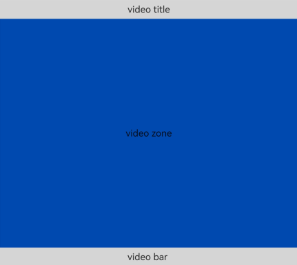
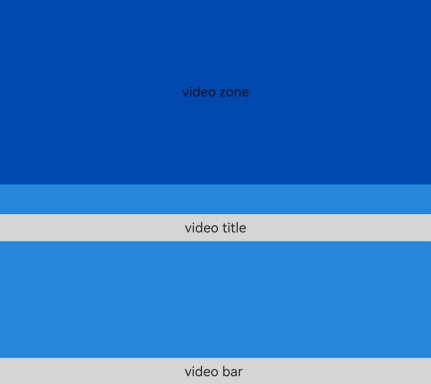

# FolderStack
<!--Kit: ArkUI-->
<!--Subsystem: ArkUI-->
<!--Owner: @fenglinbailu-->
<!--Designer: @lanshouren-->
<!--Tester: @liuli0427-->
<!--Adviser: @Brilliantry_Rui-->

**FolderStack** extends the [Stack](ts-container-stack.md) container, adding the <!--RP1-->foldable phone hover<!--RP1End--> capability. Child components specified in the **upperItems** array of [FolderStackOptions](#folderstackoptions18) automatically avoid the screen crease area and reposition to the upper display.

>  **NOTE**
>
>  This component is supported since API version 11. Updates will be marked with a superscript to indicate their earliest API version.
>
>  The hover capability is designed for and only works on <!--RP2-->dual-fold devices<!--RP2End-->.
>
>  When the component's parent uses [if/else conditional rendering](../../../ui/rendering-control/arkts-rendering-control-ifelse.md), the foldable hover feature is disabled.

## Child Components

Multiple child components are supported.

## APIs

FolderStack(options?: FolderStackOptions)

**Atomic service API**: This API can be used in atomic services since API version 12.

**System capability**: SystemCapability.ArkUI.ArkUI.Full

**Device behavior differences**: On wearables, calling this API results in a runtime exception indicating that the API is undefined. On other devices, the API works correctly.

**Parameters**

| Name      | Type                                   | Mandatory| Description                                                                |
| ------------ | ------------------------------------------- | ---- |----------------------------------------------------------------------|
| options |  [FolderStackOptions](#folderstackoptions18) | No  | Configuration of the **FolderStack** component.|

## FolderStackOptions<sup>18+</sup>

> **NOTE**
>
> To standardize anonymous object definitions, the element definitions here have been revised in API version 18. While historical version information is preserved for anonymous objects, there may be cases where the outer element's @since version number is higher than inner elements'. This does not affect interface usability.

**Atomic service API**: This API can be used in atomic services since API version 18.

**System capability**: SystemCapability.ArkUI.ArkUI.Full

**Device behavior differences**: On wearables, calling this API results in a runtime exception indicating that the API is undefined. On other devices, the API works correctly.

| Name| Type| Read-Only| Optional| Description|
| -------- | -------- | -------- | -------- | -------- |
| upperItems<sup>11+</sup> |    Array<string\>  | No| Yes | Array of IDs of child components that will be moved to the upper half screen in the hover state. On hover, child components with IDs in this array automatically shift away from the crease area and move to the upper half screen, while other components are stacked in the lower half screen.<br>**Atomic service API**: This API can be used in atomic services since API version 12.|

## Attributes

>  **NOTE**
>
>  Setting the **offset** and **margin** attributes may cause the upper and lower half screens to block the crease area. Therefore, avoid setting these attributes with this component.

In addition to the [universal attributes](ts-component-general-attributes.md), the following attributes are supported.

### alignContent

alignContent(value: Alignment)

Sets the alignment of child components in the container. When both this attribute and the [align](ts-universal-attributes-location.md#align) attribute are set, whichever is set last takes effect.

>**NOTE**
>
> This API can be called within [attributeModifier](ts-universal-attributes-attribute-modifier.md#attributemodifier) since API version 12.

**Atomic service API**: This API can be used in atomic services since API version 12.

**System capability**: SystemCapability.ArkUI.ArkUI.Full

**Device behavior differences**: On wearables, calling this API results in a runtime exception indicating that the API is undefined. On other devices, the API works correctly.

**Parameters**

| Name| Type                                       | Mandatory| Description                                                   |
| ------ | ------------------------------------------- | ---- | ------------------------------------------------------- |
| value  | [Alignment](ts-appendix-enums.md#alignment) | Yes  | Alignment of child components in the container.<br>Default value: **Alignment.Center**<br>Invalid values are treated as the default value.|

### enableAnimation

enableAnimation(value: boolean)

Sets whether to enable the default animation.

>**NOTE**
>
> This API can be called within [attributeModifier](ts-universal-attributes-attribute-modifier.md#attributemodifier) since API version 12.

**Atomic service API**: This API can be used in atomic services since API version 12.

**System capability**: SystemCapability.ArkUI.ArkUI.Full

**Device behavior differences**: On wearables, calling this API results in a runtime exception indicating that the API is undefined. On other devices, the API works correctly.

**Parameters**

| Name| Type                                       | Mandatory| Description                               |
| ------ | ------------------------------------------- | ---- | ----------------------------------- |
| value  | boolean | Yes  | Whether to enable the default animation.<br>Default value: **true**. **true**: Enable the default animation. **false**: Disable the default animation.<br>Invalid values are treated as the default value.|

### autoHalfFold

autoHalfFold(value: boolean)

Sets whether to enable auto rotation. This attribute is effective only when auto rotation is disabled in device system settings.

>**NOTE**
>
> This API can be called within [attributeModifier](ts-universal-attributes-attribute-modifier.md#attributemodifier) since API version 12.

**Atomic service API**: This API can be used in atomic services since API version 12.

**System capability**: SystemCapability.ArkUI.ArkUI.Full

**Device behavior differences**: On wearables, calling this API results in a runtime exception indicating that the API is undefined. On other devices, the API works correctly.

**Parameters**

| Name| Type   | Mandatory| Description                               |
| ------ | ------- | ---- | ----------------------------------- |
| value  | boolean | Yes  | Whether to enable auto rotation.<br>Default value: **true**. **true**: Enable auto rotation when the **FolderStack** component is in [half-folded state](ts-appendix-enums.md#foldstatus11). **false**: Disable auto rotation. This setting applies uniformly across all device types.<br>Invalid values are treated as the default value.|

## Events

In addition to the [universal events](ts-component-general-events.md), the following events are supported.

### onFolderStateChange

onFolderStateChange(callback: OnFoldStatusChangeCallback)

Triggered when the fold state of the device changes. This API takes effect only in landscape mode.

>**NOTE**
>
> This API can be called within [attributeModifier](ts-universal-attributes-attribute-modifier.md#attributemodifier) since API version 20.

**Atomic service API**: This API can be used in atomic services since API version 12.

**System capability**: SystemCapability.ArkUI.ArkUI.Full

**Device behavior differences**: On wearables, calling this API results in a runtime exception indicating that the API is undefined. On other devices, the API works correctly.

**Parameters**

| Name    | Type                                           | Mandatory| Description                |
| ---------- | ----------------------------------------------- | ---- | -------------------- |
| callback | [OnFoldStatusChangeCallback](#onfoldstatuschangecallback18) | Yes  | Callback invoked when the fold state of the device changes.|

### onHoverStatusChange<sup>12+</sup>

onHoverStatusChange(handler: OnHoverStatusChangeCallback)

Triggered when the hover state of the device changes.

>**NOTE**
>
> This API can be called within [attributeModifier](ts-universal-attributes-attribute-modifier.md#attributemodifier) since API version 20.

**Atomic service API**: This API can be used in atomic services since API version 12.

**System capability**: SystemCapability.ArkUI.ArkUI.Full

**Device behavior differences**: On wearables, calling this API results in a runtime exception indicating that the API is undefined. On other devices, the API works correctly.

**Parameters**

| Name    | Type                                           | Mandatory| Description                |
| ---------- | ----------------------------------------------- | ---- | -------------------- |
| handler | [OnHoverStatusChangeCallback](#onhoverstatuschangecallback18) | Yes  | Callback invoked when the hover state of the device changes.|

## OnHoverStatusChangeCallback<sup>18+</sup>

type OnHoverStatusChangeCallback = (param: HoverEventParam) => void

Defines the current allback invoked when the hover state of the device changes.

**Atomic service API**: This API can be used in atomic services since API version 18.

**System capability**: SystemCapability.ArkUI.ArkUI.Full

**Device behavior differences**: On wearables, calling this API results in a runtime exception indicating that the API is undefined. On other devices, the API works correctly.

**Parameters**

| Name    | Type                                           | Mandatory| Description                |
| ---------- | ----------------------------------------------- | ---- | -------------------- |
| param | [HoverEventParam](#hovereventparam12) | Yes  | Parameters related to the hover state of the device, including the fold state, hover state, application orientation, and window mode enumeration of the device.|

## OnFoldStatusChangeCallback<sup>18+</sup>

type OnFoldStatusChangeCallback = (event: OnFoldStatusChangeInfo) => void

Current fold state of the device.

**Atomic service API**: This API can be used in atomic services since API version 18.

**System capability**: SystemCapability.ArkUI.ArkUI.Full

**Device behavior differences**: On wearables, calling this API results in a runtime exception indicating that the API is undefined. On other devices, the API works correctly.

**Parameters**

| Name    | Type                                           | Mandatory| Description                |
| ---------- | ----------------------------------------------- | ---- | -------------------- |
| event | [OnFoldStatusChangeInfo](#onfoldstatuschangeinfo18) | Yes  | Current fold state of the device.|


## OnFoldStatusChangeInfo<sup>18+</sup>

Called when the folding state changes. This API takes effect only in landscape mode.

> **NOTE**
>
> To standardize anonymous object definitions, the element definitions here have been revised in API version 18. While historical version information is preserved for anonymous objects, there may be cases where the outer element's @since version number is higher than inner elements'. This does not affect interface usability.

**Atomic service API**: This API can be used in atomic services since API version 18.

**System capability**: SystemCapability.ArkUI.ArkUI.Full

**Device behavior differences**: On wearables, calling this API results in a runtime exception indicating that the API is undefined. On other devices, the API works correctly.

| Name| Type| Read-Only| Optional| Description|
| -------- | -------- | -------- | -------- | -------- |
| foldStatus<sup>11+</sup> | [FoldStatus](ts-appendix-enums.md#foldstatus11) | No| No  | Current fold state of the device.<br>**Atomic service API**: This API can be used in atomic services since API version 12.|

## HoverEventParam<sup>12+</sup>

**Atomic service API**: This API can be used in atomic services since API version 12.

**System capability**: SystemCapability.ArkUI.ArkUI.Full

**Device behavior differences**: On wearables, calling this API results in a runtime exception indicating that the API is undefined. On other devices, the API works correctly.

| Name| Type| Read-Only| Optional| Description|
| -------- | -------- | -------- | -------- | -------- |
| foldStatus       | [FoldStatus](ts-appendix-enums.md#foldstatus11)             | No| No  | Current fold state of the device.|
| isHoverMode      | boolean                                                     | No| No  | Whether hover mode is enabled. **true**: Hover mode is enabled. **false**: Hover mode is disabled.|
| appRotation      | [AppRotation](ts-appendix-enums.md#approtation12)           | No| No  | Current orientation.   |
| windowStatusType | [WindowStatusType](#windowstatustype12) | No| No  | Window mode.   |

## WindowStatusType<sup>12+</sup>

type WindowStatusType = WindowStatusType

Enumerates the window modes.

**Atomic service API**: This API can be used in atomic services since API version 12.

**System capability**: SystemCapability.ArkUI.ArkUI.Full

**Device behavior differences**: On wearables, calling this API results in a runtime exception indicating that the API is undefined. On other devices, the API works correctly.

| Type       | Description                |
| ---------- | ---------------------|
| [WindowStatusType](../arkts-apis-window-e.md#windowstatustype11)  | Window mode.|

## Example

### Example 1: Implementing the Foldable Device Hover Capability with FolderStack

This example implements the foldable device hover capability.

```ts
@Entry
@Component
struct Index {
  build() {
    Column() {
      // Set upperItems to IDs of the child components to be moved to the upper half screen in the hover state. Other components are stacked in the lower half screen.
      FolderStack({ upperItems: ["upperitemsId"] }) {
        // This column is automatically moved up to the upper half screen.
        Column() {
          Text("video zone").height("100%").width("100%").textAlign(TextAlign.Center).fontSize(25)
        }.backgroundColor('rgb(0, 74, 175)').width("100%").height("100%").id("upperitemsId")

        // The following two columns are stacked in the lower half screen.
        Column() {
          Text("video title")
            .width("100%")
            .height(50)
            .textAlign(TextAlign.Center)
            .backgroundColor('rgb(213, 213, 213)')
            .fontSize(25)
        }.width("100%").height("100%").justifyContent(FlexAlign.Start)

        Column() {
          Text("video bar ")
            .width("100%")
            .height(50)
            .textAlign(TextAlign.Center)
            .backgroundColor('rgb(213, 213, 213)')
            .fontSize(25)
        }.width("100%").height("100%").justifyContent(FlexAlign.End)
      }
      .backgroundColor('rgb(39, 135, 217)')
      // Set whether to enable animation.
      .enableAnimation(true)
      // Set whether to enable auto-rotate.
      .autoHalfFold(true)
      // Called when the folding status changes.
      .onFolderStateChange((msg) => {
        if (msg.foldStatus === FoldStatus.FOLD_STATUS_EXPANDED) {
          console.info("The device is currently in the expanded state")
        } else if (msg.foldStatus === FoldStatus.FOLD_STATUS_HALF_FOLDED) {
          console.info("The device is currently in the half folded state")
        } else {
          // .............
        }
      })
      // The hoverStatusChange callback is invoked when the hover status changes.
      .onHoverStatusChange((msg) => {
        console.info('this foldStatus:' + msg.foldStatus);
        console.info('this isHoverMode:' + msg.isHoverMode);
        console.info('this appRotation:' + msg.appRotation);
        console.info('this windowStatusType:' + msg.windowStatusType);
      })
      // If the folderStack component does not occupy the full screen, it is used as a common stack.
      .alignContent(Alignment.Bottom)
      .height("100%")
      .width("100%")
      .backgroundColor('rgb(39, 135, 217)')

    }
    .height("100%")
    .width("100%")
    .borderWidth(1)
    .borderColor('rgb(213, 213, 213)')
    .backgroundColor('rgb(0, 74, 175)')
    .expandSafeArea([SafeAreaType.SYSTEM], [SafeAreaEdge.BOTTOM])
  }
}
```
**Figure 1** Expanded state in landscape mode
<br> 
<br> **Figure 2** Half-folded state in landscape mode
<br> 

### Example 2: Dynamically Setting Attributes and Methods of the FolderStack Component Using attributeModifier

This example demonstrates how to dynamically set the **onFolderStateChange** and **onHoverStatusChange** methods of the **FolderStack** component using **attributeModifier**.

```ts
// xxx.ets
class MyFolderStackModifier implements AttributeModifier<FolderStackAttribute> {
  applyNormalAttribute(instance: FolderStackAttribute): void {
    // Called when the folding status changes.
    instance.onFolderStateChange((msg) => {
      if (msg.foldStatus === FoldStatus.FOLD_STATUS_EXPANDED) {
        console.info("The device is currently in the expanded state")
      } else if (msg.foldStatus === FoldStatus.FOLD_STATUS_HALF_FOLDED) {
        console.info("The device is currently in the half folded state")
      } else if (msg.foldStatus === FoldStatus.FOLD_STATUS_FOLDED) {
        console.info("The device is currently in the folded state")
      } else {
        // .............
      }
    })
    // The hoverStatusChange callback is invoked when the hover status changes.
    instance.onHoverStatusChange((msg) => {
      console.info('this foldStatus:' + msg.foldStatus);
      console.info('this isHoverMode:' + msg.isHoverMode);
      console.info('this appRotation:' + msg.appRotation);
      console.info('this windowStatusType:' + msg.windowStatusType);
    })
  }
}

@Entry
@Component
struct attributeDemo {
  @State modifier: MyFolderStackModifier = new MyFolderStackModifier()

  build() {
    Column() {
      // Set upperItems to IDs of the child components to be moved to the upper half screen in the hover state. Other components are stacked in the lower half screen.
      FolderStack({ upperItems: ["upperitemsId"] }) {
        // This column is automatically moved up to the upper half screen.
        Column() {
          Text("video zone").height("100%").width("100%").textAlign(TextAlign.Center).fontSize(25)
        }.backgroundColor('rgb(0, 74, 175)').width("100%").height("100%").id("upperitemsId")

        // The following two columns are stacked in the lower half screen.
        Column() {
          Text("video title")
            .width("100%")
            .height(50)
            .textAlign(TextAlign.Center)
            .backgroundColor('rgb(213, 213, 213)')
            .fontSize(25)
        }.width("100%").height("100%").justifyContent(FlexAlign.Start)

        Column() {
          Text("video bar ")
            .width("100%")
            .height(50)
            .textAlign(TextAlign.Center)
            .backgroundColor('rgb(213, 213, 213)')
            .fontSize(25)
        }.width("100%").height("100%").justifyContent(FlexAlign.End)
      }
      .backgroundColor('rgb(39, 135, 217)')
      // Set whether to enable animation.
      .enableAnimation(true)
      // Set whether to enable auto-rotate.
      .autoHalfFold(true)
      .attributeModifier(this.modifier)
      // If the <folderStack> component does not occupy the full screen, it is used as a common stack.
      .alignContent(Alignment.Bottom)
      .height("100%")
      .width("100%")
      .backgroundColor('rgb(39, 135, 217)')
    }
    .height("100%")
    .width("100%")
    .borderWidth(1)
    .borderColor('rgb(213, 213, 213)')
    .backgroundColor('rgb(0, 74, 175)')
    .expandSafeArea([SafeAreaType.SYSTEM], [SafeAreaEdge.BOTTOM])
  }
}
```

**Figure 1** Expanded state in landscape mode
<br> Expected log:
<br> The device is currently in the expanded state
<br> this foldStatus:1
<br> this isHoverMode:0
<br> this appRotation:3
<br> this windowStatusType:1
<br> 
<br> **Figure 2** Half-folded state in landscape mode
<br> Expected log:
<br> The device is currently in the half folded state
<br> this foldStatus:3
<br> this isHoverMode:1
<br> this appRotation:3
<br> this windowStatusType:1
<br> 
