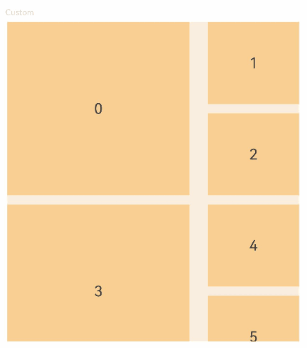

# Grid (System API)

<!--Kit: ArkUI-->
<!--Subsystem: ArkUI-->
<!--Owner: @zcdqs-->
<!--Designer: @zcdqs-->
<!--Tester: @huchuyun-->
<!--Adviser: @Brilliantry_Rui-->

The **Grid** component consists of cells formed by rows and columns. You can specify the cells where items are located to form various layouts.

> **NOTE**
>
> - This component is supported since API version 7. Updates will be marked with a superscript to indicate their earliest API version.
>
> - This topic describes only system APIs provided by the module. For details about its public APIs, see [Grid](ts-container-grid.md).


## GridLayoutOptions<sup>10+</sup>

Defines the grid layout options.

To improve the layout performance and accuracy of the grid that contains nodes of irregular sizes, you can use the **onGetStartIndexByOffset** and **onGetStartIndexByIndex** callback parameters. The two callbacks must be set at the same time to take effect. In this scenario, you are advised to set [onScrollBarUpdate](ts-container-grid.md#onscrollbarupdate10) to accurately locate the scrollbar.

**System capability**: SystemCapability.ArkUI.ArkUI.Full

| Name   | Type     | Read-Only  | Optional| Description                   |
| ----- | ------- | ---- | --  | --------------------- |
| onGetStartIndexByOffset<sup>23+</sup> | [OnGetStartIndexByOffsetCallback](#ongetstartindexbyoffsetcallback23)| No| Yes| Calculates the start line position of the current page in the grid based on the total scrolling offset of the **Grid** component, which is used for fast scrolling or reverse scrolling.<br>**System API**: This is a system API.<br>**Model restriction**: This API can be used only in the stage model.|
| onGetStartIndexByIndex<sup>23+</sup> | [OnGetStartIndexByIndexCallback](#ongetstartindexbyindexcallback23)| No| Yes| Calculates the start line on the page when the grid is scrolled to the specified target index. This API is used to support operations such as [scrollToIndex](ts-container-scroll.md#scrolltoindex).<br>**System API**: This is a system API.<br>**Model restriction**: This API can be used only in the stage model.|

## StartLineInfo<sup>23+</sup> 

Records the position of the start line in the grid.

**System capability**: SystemCapability.ArkUI.ArkUI.Full

**System API**: This is a system API.

**Model constraint**: This API can be used only in the stage model.

| Name| Type| Read-Only| Optional| Description|
|------|------|------|------|------|
| startIndex | number | No| No| Start index of the row where the target index or target offset is located.|
| startLine | number | No| No| Start line of the **GridItem** corresponding to **startIndex**. Generally, the start line is in the **Grid** window. For a **GridItem** that spans multiple lines, the start line of the node needs to be found, which may be outside the window.|
| startOffset | number | No| No| Offset between the top of the **GridItem** corresponding to **startIndex** and the top of the **Grid**.<br>Unit: vp|
| totalOffset | number | No| No| Total scrolling offset, that is, the offset between the top of the first **GridItem** in the **Grid** component and the top of the **Grid** component.<br>Unit: vp |

## OnGetStartIndexByOffsetCallback<sup>23+</sup>

type OnGetStartIndexByOffsetCallback = (totalOffset: number) => StartLineInfo

Calculates the start line position of the current page based on the total offset of the **Grid** component, which is used for fast scrolling or reverse scrolling.

**System capability**: SystemCapability.ArkUI.ArkUI.Full

**System API**: This is a system API.

**Model constraint**: This API can be used only in the stage model.

**Parameters**

| Name| Type| Mandatory| Description|
| ------ | ---- | ---- | ---- |
| totalOffset | number | Yes| Total scrolling offset, that is, the offset between the top of the first **GridItem** in the **Grid** component and the top of the **Grid** component.<br>Unit: vp |

**Return value**

| Type| Description|
| ---- | ---- |
| [StartLineInfo](#startlineinfo23)| Position of the start line in the grid.|

## OnGetStartIndexByIndexCallback<sup>23+</sup>

type OnGetStartIndexByIndexCallback = (targetIndex: number) => StartLineInfo

Calculates the start line on the page when the grid is scrolled to the specified target index. This API is used to support operations such as [scrollToIndex](ts-container-scroll.md#scrolltoindex).

**System capability**: SystemCapability.ArkUI.ArkUI.Full

**System API**: This is a system API.

**Model constraint**: This API can be used only in the stage model.

**Parameters**

| Name| Type| Mandatory| Description|
| ------ | ---- | ---- | ---- |
| targetIndex | number | Yes| Index of the target **GridItem** to be scrolled to.|

**Return value**

| Type| Description|
| ---- | ---- |
| [StartLineInfo](#startlineinfo23)| Position of the start line in the grid.|

## Examples

### Example 1: Basic Usage
This example shows how to use the **onGetStartIndexByOffset** and **onGetStartIndexByIndex** in [GridLayoutOptions](#gridlayoutoptions10) to quickly locate the scrolling position.

**GridLayoutOptions** supports **onGetStartIndexByOffset** and **onGetStartIndexByIndex** since API version 23.
```ts
@Entry
@Component
struct Index {
  numbers: GridDataSource = new GridDataSource([]);
  scroller: Scroller = new Scroller();
  crossCount: number = 3;
  itemHeight: number = 100;
  childrenCount: number = 500;
  @State options: GridLayoutOptions = {
    regularSize: [1, 1],
    irregularIndexes: [],
    onGetIrregularSizeByIndex: (index: number) => {
      return [2, 2]
    },
    // Set two callback functions to accurately calculate the scrolling position of the grid.
    onGetStartIndexByOffset: (offset: number) => {
      if (offset < 0) {
        return {
          startIndex: 0,
          startLine: 0,
          startOffset: -offset,
          totalOffset: offset
        }
      }
      let line = Math.floor(offset / (this.itemHeight * 2))
      let startOffset = -offset % (this.itemHeight * 2)
      return {
        startIndex: line * this.crossCount,
        startLine: line * 2,
        startOffset: startOffset,
        totalOffset: offset
      }
    },
    onGetStartIndexByIndex: (index: number) => {
      let line = Math.floor(index / this.crossCount)
      let offset = index % 3 == 2 ? -this.itemHeight : 0
      return {
        startIndex: line * 3,
        startLine: line * 2,
        startOffset: offset,
        totalOffset: line * this.itemHeight * 2 - offset
      }
    }
  }

  // Initialize the data source and irregular node index in aboutToAppear.
  aboutToAppear() {
    let list: string[] = [];
    let irregularList: number[] = []
    for (let i = 0; i <= this.childrenCount; i++) {
      list.push(i.toString())
      if (i % 3 == 0) {
        irregularList.push(i)
      }
    }
    this.numbers = new GridDataSource(list);
    this.options.irregularIndexes = irregularList
  }

  build() {
    Column({ space: 5 }) {
      Text('Custom').fontColor(0xCCCCCC).fontSize(9).width('90%')
      Grid(this.scroller, this.options) {
        LazyForEach(this.numbers, (day: string, index: number) => {
          if (index % 3 == 0) {
            GridItem() {
              Text(day)
                .fontSize(16)
                .backgroundColor(0xF9CF93)
                .width(200)
                .height(190)
                .textAlign(TextAlign.Center)
            }
          } else {
            GridItem() {
              Text(day)
                .fontSize(16)
                .backgroundColor(0xF9CF93)
                .width(100)
                .height(90)
                .textAlign(TextAlign.Center)
            }
          }
        }, (index: number) => index.toString())
      }
      .columnsTemplate('1fr 1fr 1fr')
      .columnsGap(10)
      .rowsGap(10)
      .edgeEffect(EdgeEffect.Spring)
      .width(320)
      .backgroundColor(0xFAEEE0)
      .height(300)
      .onScrollBarUpdate((index: number, offset: number) => {
        console.info('XXX' + 'Grid onScrollBarUpdate,index : ' + index.toString() + ',offset' + offset.toString());
        return {
          totalOffset: (index / this.crossCount) * (this.itemHeight) * 2 - offset,
          totalLength: this.itemHeight * 2 * (this.childrenCount + 1) / this.crossCount
        };
      }) // The sample code applies only to the current data source. If the data source changes, modify the code.
    }.width('100%').margin({ top: 5 })
  }
}


// GridDataSource.ets
export class GridDataSource implements IDataSource {
  private list: string[] = [];
  private listeners: DataChangeListener[] = [];

  constructor(list: string[]) {
    this.list = list;
  }

  totalCount(): number {
    return this.list.length;
  }

  getData(index: number): string {
    return this.list[index];
  }

  registerDataChangeListener(listener: DataChangeListener): void {
    if (this.listeners.indexOf(listener) < 0) {
      this.listeners.push(listener);
    }
  }

  unregisterDataChangeListener(listener: DataChangeListener): void {
    const pos = this.listeners.indexOf(listener);
    if (pos >= 0) {
      this.listeners.splice(pos, 1);
    }
  }

  // Notify the controller of the data location change.
  notifyDataMove(from: number, to: number): void {
    this.listeners.forEach(listener => {
      listener.onDataMove(from, to);
    })
  }
}
```

