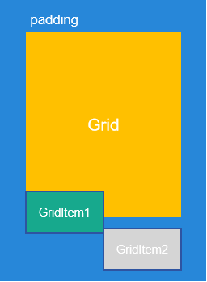
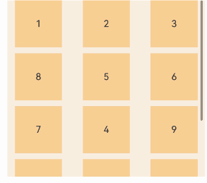
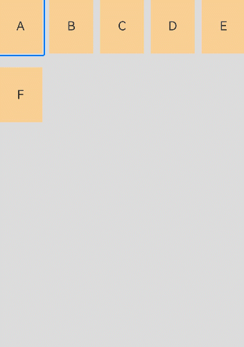
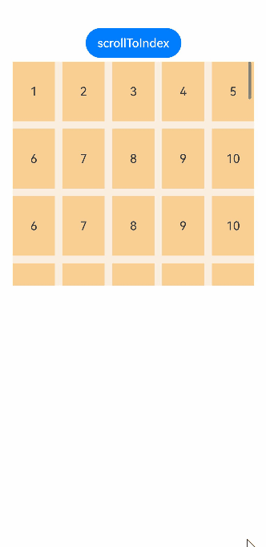
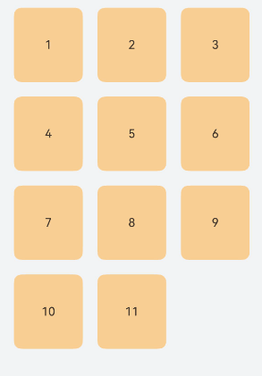
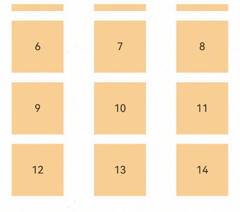

# Grid

<!--Kit: ArkUI-->
<!--Subsystem: ArkUI-->
<!--Owner: @zcdqs; @fangyuhao-->
<!--Designer: @zcdqs-->
<!--Tester: @liuzhenshuo-->
<!--Adviser: @HelloCrease-->

The **Grid** component consists of cells formed by rows and columns. You can specify the cells where items are located to form various layouts.

>  **NOTE**
>
>  This component is supported since API version 7. Updates will be marked with a superscript to indicate their earliest API version.
>
>  The component has been bound with gestures to implement functions such as following the finger. If you need to add custom gestures, refer to [Enhanced Gesture Interception](ts-gesture-blocking-enhancement.md).


## Child Components

Only the [GridItem](ts-container-griditem.md) child component and custom components are supported. When a custom component is used in a grid, you are advised to use GridItem as the top-level component of the custom component. You are not advised to set attributes and event methods for the custom component.
Child components can be dynamically generated using rendering control types [if/else](../../../ui/rendering-control/arkts-rendering-control-ifelse.md), [ForEach ](../../../ui/rendering-control/arkts-rendering-control-foreach.md), [LazyForEach](../../../ui/rendering-control/arkts-rendering-control-lazyforeach.md), and [Repeat](../../../ui/rendering-control/arkts-new-rendering-control-repeat.md). LazyForEach or Repeat is recommended to optimize performance.

>  **NOTE**
>
>  Below are the rules for calculating the indexes of the child components of **Grid**:
>
>  The index increases in ascending order of child components.
>
>  In the **if/else** statement, only the child components in the branch where the condition is met participate in the index calculation.
>
>  In the ForEach/LazyForEach and Repeat statements, the index values of all expanded child components are calculated.
>
>  [if/else](../../../ui/rendering-control/arkts-rendering-control-ifelse.md), [ForEach](../../../ui/rendering-control/arkts-rendering-control-foreach.md), [LazyForEach](../../../ui/rendering-control/arkts-rendering-control-lazyforeach.md), and [Repeat](../../../ui/rendering-control/arkts-new-rendering-control-repeat.md) update the index of the child component when the value changes.
>
>  The child component that has the **visibility** attribute set to **Hidden** or **None** is included in the index calculation.
>
>  The child component that has the **visibility** attribute set to **None** is not displayed, but still takes up the corresponding cell.
>
>  The child component that has the **position** attribute set is displayed in the corresponding cell, offset by the distance specified by **position** relative to the upper left corner of the grid. This child component does not scroll with the corresponding cell and is not displayed after the corresponding cell extends beyond the display range of the grid.
>
>  When there is a gap between child components, it is filled as much as possible based on the current display area. Therefore, the relative position of grid items may change as the grid scrolls.
>
>  From API version 21, the maximum width and height of a single Grid child component are 16777216 px. In API version 20 and earlier versions, the maximum width and height of a single Grid child component are 1000000px. If the child component exceeds the size, the scrolling or display may be abnormal.

## APIs

Grid(scroller?: Scroller, layoutOptions?: GridLayoutOptions)

Creates a **Grid** component.

**Atomic service API**: This API can be used in atomic services since API version 11.

**System capability**: SystemCapability.ArkUI.ArkUI.Full

**Parameters**

| Name  | Type                                   | Mandatory| Description                                                    |
| -------- | ------------------------------------------- | ---- | ------------------------------------------------------------ |
| scroller | [Scroller](ts-container-scroll.md#scroller) | No  | Controller, which can be bound to scrollable components.<br>**NOTE**<br>Cannot be bound to the same scrolling control object as other scrolling components, such as [ArcList](ts-container-arclist.md), [List](ts-container-list.md), [Grid](ts-container-grid.md), [Scroll](ts-container-scroll.md), and [WaterFlow](ts-container-waterflow.md).|
| layoutOptions<sup>10+</sup> | [GridLayoutOptions](#gridlayoutoptions10) | No| Grid layout options.|

## GridLayoutOptions<sup>10+</sup>

Defines the grid layout options. In this API, **irregularIndexes** and **onGetIrregularSizeByIndex** can be used for grids where either **rowsTemplate** or **columnsTemplate** is set. These properties allow you to specify an index array and set the number of rows and columns to be occupied by a grid item at the specified index. For details about the usage, see [Example 3](#example-3-implementing-a-scrollable-grid-with-grid-items-spanning-rows-and-columns). On the other hand, **onGetRectByIndex** can be used for grids where both **rowsTemplate** and **columnsTemplate** are set. It allows you to specify the position and size for the grid item at the specified index. For details about the usage, see [Example 1](#example-1-creating-a-fixed-row-and-column-grid-layout).

To improve the performance of the grid in scenarios such as jump and column quantity change, you are advised to use GridLayoutOptions. Even if the grid does not contain any special cross-row and cross-column nodes, you can use 'Grid(this.scroller, {regularSize: [1, 1]})' to improve the jump performance. For details, see <!--RP1-->Using GridLayoutOptions to Improve Grid Performance<!--RP1End-->.

**System capability**: SystemCapability.ArkUI.ArkUI.Full

| Name   | Type     | Read Only  | Optional| Description                   |
| ----- | ------- | ---- | --  | --------------------- |
| regularSize  | [number, number]  | No   | No| Number of rows and columns occupied by a grid item with regular size. The only supported value is **[1, 1]**, meaning that the grid item occupies one row and one column.<br>**Atomic service API**: This API can be used in atomic services since API version 11. |
| irregularIndexes | number[] | No   | Yes| Size of the GridItem at the specified index in the Grid. The size is irregular. When **onGetIrregularSizeByIndex** is not set, the grid item specified in this parameter occupies an entire row of the grid that scrolls vertically or an entire column of the grid that scrolls horizontally.<br>**Atomic service API**: This API can be used in atomic services since API version 11.|
| onGetIrregularSizeByIndex | (index: number) => [number, number] | No   | Yes| Number of rows and columns occupied by the grid item with an irregular size. This parameter is used together with **irregularIndexes**. In versions earlier than API version 12, the vertical scrolling grid does not support grid items spanning multiple rows, and the horizontal scrolling grid does not support grid items spanning multiple columns.<br>**Atomic service API**: This API can be used in atomic services since API version 11.|
| onGetRectByIndex<sup>11+</sup> | (index: number) => [number, number,number,number] | No | Yes| Position and size of the grid item with the specified index, in the format of [rowStart,columnStart,rowSpan,columnSpan],<br>where **rowStart** indicates the row start position, **columnStart** indicates the column start position,<br>**rowSpan** indicates the number of rows occupied by the grid item, and **columnSpan** indicates the number of columns occupied by the grid item. Their values are unitless.<br>The values of **rowStart** and **columnStart** are natural numbers greater than or equal to 0. If a negative value is set, the default value **0** is used.<br>The values of **rowSpan** and **columnSpan** are natural numbers greater than or equal to 1. If a decimal is set, it is rounded down. If the decimal set is less than 1, the value **1** is used.<br>**NOTE**<br>Case 1: If a grid item finds that the start position specified for it is already occupied, it searches for an available start position from left to right and from top to bottom, starting from position [0,0].<br>Case 2: If any space other than the start position specified for a grid item is occupied, the grid item is displayed within the available space left.<br>**Atomic service API**: This API can be used in atomic services since API version 12.|

## Attributes

In addition to [universal attributes](ts-component-general-attributes.md) and [scrollable component common attributes](ts-container-scrollable-common.md#attributes), the following attributes are also supported.
> **NOTE**
>
> When the common attributes [clip<sup>12+</sup>](ts-universal-attributes-sharp-clipping.md#clip12) and [clip<sup>18+</sup>](ts-universal-attributes-sharp-clipping.md#clip18) are used, the default values are true.
>
> After the padding of the grid is set, if a child component is partially located in the grid content area and partially located in the padding area, the child component is displayed. If the child component is completely located in the padding area, the child component is not displayed. As shown in the following figure, GridItem1 is displayed, but GridItem2 is not displayed.
>
> 

### columnsTemplate

columnsTemplate(value: string)

Sets the number of columns, fixed column width, or minimum column width of the grid. If this attribute is not set, one column will be used.

For example, '1fr 1fr 2fr' divides the parent component into three columns. The width of the parent component is divided into four equal parts. The first column occupies one part, the second column occupies one part, and the third column occupies two parts.

**columnsTemplate('repeat(auto-fit, track-size)')**: The layout automatically calculates the number of columns and the actual column width, while adhering to the minimum column width specified with **track-size**.

**columnsTemplate('repeat(auto-fill, track-size)')**: The layout automatically calculates the number of columns based on the fixed column width specified with **track-size**.

**columnsTemplate('repeat(auto-stretch, track-size)')**: The layout uses **columnsGap** to define the minimum gap between columns and automatically calculates the number of columns and the actual gap size based on the fixed column width specified with **track-size**.

**repeat**, **auto-fit**, **auto-fill**, and **auto-stretch** are keywords. **track-size** indicates the column width, in the unit of px, vp (default), %, or any valid digit. The value must be greater than or equal to one valid column width.<br>
In **auto-stretch** mode, **track-size** must be a valid column width value, in the unit of px, vp, or any valid digit; percentage values (%) are not supported.

For details about the effect, see [Example 8](#example-8-using-adaptive-column-count-settings).

If this attribute is set to **'0fr'**, the column width is 0, and grid item in the column is not displayed. If this attribute is set to any other invalid value, the grid item is displayed as one column.

**Atomic service API**: This API can be used in atomic services since API version 11.

**System capability**: SystemCapability.ArkUI.ArkUI.Full

**Parameters**

| Name| Type  | Mandatory| Description                              |
| ------ | ------ | ---- | ---------------------------------- |
| value  | string | Yes  | Number of columns or minimum column width of the grid.|

### rowsTemplate

rowsTemplate(value: string)

Sets the number of rows, fixed row height, or minimum row height of the grid. If this attribute is not set, one row will be used.

For example, **'1fr 1fr 2fr'** indicates three rows, with the first row taking up 1/4 of the parent component's full height, the second row 1/4, and the third row 2/4.

**rowsTemplate('repeat(auto-fit, track-size)')**: The layout automatically calculates the number of rows and the actual row height, while adhering to the minimum row height specified with **track-size**.

**rowsTemplate('repeat(auto-fill, track-size)')**: The layout automatically calculates the number of rows based on the fixed row height specified with **track-size**.

**rowsTemplate('repeat(auto-stretch, track-size)')**: The layout uses **rowsGap** to define the minimum gap between rows and automatically calculates the number of rows and the actual gap size based on the fixed row height specified with **track-size**.

**repeat**, **auto-fit**, **auto-fill**, and **auto-stretch** are keywords. **track-size** indicates the row height, in the unit of px, vp (default), %, or any valid digit. The value must be greater than or equal to one valid row height.<br>
In **auto-stretch** mode, **track-size** must be a valid row height value, in the unit of px, vp, or any valid digit; percentage values (%) are not supported.

If this attribute is set to **'0fr'**, the row height is 0, and grid item in the row is not displayed. If this attribute is set to any other invalid value, the grid item is displayed as one row.

**Atomic service API**: This API can be used in atomic services since API version 11.

**System capability**: SystemCapability.ArkUI.ArkUI.Full

**Parameters**

| Name| Type  | Mandatory| Description                              |
| ------ | ------ | ---- | ---------------------------------- |
| value  | string | Yes  | Number of rows or minimum row height of the grid.|

>  **NOTE**
>
>  Depending on the settings of the **rowsTemplate** and **columnsTemplate** attributes, the **Grid** component supports the following layout modes:
>
>  1. **rowsTemplate** and **columnsTemplate** are both set
>
>  - The **Grid** component displays only elements in a fixed number of rows and columns and cannot be scrolled.
>  - In this mode, the following attributes do not take effect: **layoutDirection**, **maxCount**, **minCount**, and **cellLength**.
>  - If the width and height of a grid are not set, the grid adapts to the size of its parent component by default.
>  - The size of the grid rows and columns is the size of the grid content area minus the gap between rows and columns. It is allocated based on the proportion of each row and column.
>  - By default, the grid items fill the entire grid.
>
>  2. Either **rowsTemplate** or **columnsTemplate** is set
>
>  - The **Grid** component arranges elements in the specified direction and allows for scrolling to display excess elements.
>  - If **columnsTemplate** is set, the component scrolls vertically, the main axis runs vertically, and the cross axis runs horizontally.
>  - If **rowsTemplate** is set, the component scrolls horizontally, the main axis runs horizontally, and the cross axis runs vertically.
>  - In this mode, the following attributes do not take effect: **layoutDirection**, **maxCount**, **minCount**, and **cellLength**.
>  - The cross axis size of the grid is the cross axis size of the grid content area minus the gaps along the cross axis. It is allocated based on the proportion of each row and column.
>  - The main axis size of the grid is the maximum value of the main axis sizes of all grid items in the cross axis direction of the grid.
>  - In this mode, the size of the GridItem in the cross axis is the same as that of the grid. You can set maxWidth or maxHeight in [constraintSize](./ts-universal-attributes-size.md#constraintsize) to limit the size of the GridItem in the cross axis to be less than that of the grid.
>
>  3. Neither **rowsTemplate** nor **columnsTemplate** is set
>
>  - The **Grid** component arranges elements in the direction specified by **layoutDirection**. The number of columns is jointly determined by the grid width, width of the first element, **minCount**, **maxCount**, and **columnsGap**.
>  - The number of rows is jointly determined by the grid height, height of the first element, **cellLength**, and **rowsGap**. Elements outside the determined range of rows and columns are not displayed and cannot be viewed through scrolling.
>  - In this mode, only the following attributes take effect: **layoutDirection**, **maxCount**, **minCount**, **cellLength**, **editMode**, **columnsGap**, and **rowsGap**.
>  - When **layoutDirection** is set to **Row**, child components are arranged from left to right. When a row is full, a new row will be added. If the remaining height is insufficient, no more elements will be laid out, and the whole content is centered at the top.
>  - When **layoutDirection** is set to **Column**, elements are arranged column by column from top to bottom. If the remaining height is insufficient, no more elements will be laid out, and the whole content is centered at the top.
>  - If there are no grid items in the grid, the width and height of the grid are set to 0.
>

### columnsGap

columnsGap(value: Length)

Sets the gap between columns. A value less than 0 evaluates to the default value.

**Atomic service API**: This API can be used in atomic services since API version 11.

**System capability**: SystemCapability.ArkUI.ArkUI.Full

**Parameters**

| Name| Type                        | Mandatory| Description                        |
| ------ | ---------------------------- | ---- | ---------------------------- |
| value  | [Length](ts-types.md#length) | Yes  | Gap between columns.<br>Default value: **0**<br>Value range: [0, +∞).|

### rowsGap

rowsGap(value: Length)

Sets the gap between rows. A value less than 0 evaluates to the default value.

**Atomic service API**: This API can be used in atomic services since API version 11.

**System capability**: SystemCapability.ArkUI.ArkUI.Full

**Parameters**

| Name| Type                        | Mandatory| Description                        |
| ------ | ---------------------------- | ---- | ---------------------------- |
| value  | [Length](ts-types.md#length) | Yes  | Gap between rows.<br>Default value: **0**<br>Value range: [0, +∞).|

### scrollBar

scrollBar(value: BarState)

Sets the scrollbar state.

**Atomic service API**: This API can be used in atomic services since API version 11.

**System capability**: SystemCapability.ArkUI.ArkUI.Full

**Parameters**

| Name| Type                                     | Mandatory| Description                                                        |
| ------ | ----------------------------------------- | ---- | ------------------------------------------------------------ |
| value  | [BarState](ts-appendix-enums.md#barstate) | Yes  | Scrollbar state.<br>Default value: **BarState.Auto**<br>**NOTE**<br>In API version 9 and earlier versions, the default value is **BarState.Off**. Since API version 10, the default value is **BarState.Auto**.|

### scrollBarColor

scrollBarColor(value: Color | number | string)

Sets the scrollbar color.

**Atomic service API**: This API can be used in atomic services since API version 11.

**System capability**: SystemCapability.ArkUI.ArkUI.Full

**Parameters**

| Name| Type                                                        | Mandatory| Description          |
| ------ | ------------------------------------------------------------ | ---- | -------------- |
| value  | [Color](ts-appendix-enums.md#color) \| number \| string | Yes  | Scrollbar color.<br>Default value: **'\#182431'** (40% opacity)<br>A number value indicates a HEX color in RGB or ARGB format, for example, **0xffffff**. A string value indicates a color in RGB or ARGB format, for example, **'#ffffff'**.|

### scrollBarColor<sup>22+</sup>

scrollBarColor(color: Color | number | string | Resource)

Sets the scrollbar color.

**Atomic service API**: This API can be used in atomic services since API version 22.

**System capability**: SystemCapability.ArkUI.ArkUI.Full

**Parameters**

| Name| Type                                                        | Mandatory| Description          |
| ------ | ------------------------------------------------------------ | ---- | -------------- |
| color  | [Color](ts-appendix-enums.md#color) \| number \| string \| [Resource](ts-types.md#resource) | Yes  | Scrollbar color.<br>Default value: **'\#182431'** (40% opacity)<br>A number value indicates a HEX color in RGB or ARGB format, for example, **0xffffff**. A string value indicates a color in RGB or ARGB format, for example, **'#ffffff'**.|

### scrollBarWidth

scrollBarWidth(value: number | string)

Sets the scrollbar width. This attribute cannot be set in percentage. After the width is set, the scrollbar is displayed with the set width in normal state and pressed state. If the set width exceeds the height of the **Grid** component on the main axis, the scrollbar reverts to the default width.

**Atomic service API**: This API can be used in atomic services since API version 11.

**System capability**: SystemCapability.ArkUI.ArkUI.Full

**Parameters**

| Name| Type                      | Mandatory| Description                                     |
| ------ | -------------------------- | ---- | ----------------------------------------- |
| value  | number \| string | Yes  | Scrollbar width.<br>Default value: **4**<br>Unit: vp<br>If this parameter is set to a value less than or equal to 0, the default value is used. The value **0** means not to show the scrollbar.|

### cachedCount

cachedCount(value: number)

Sets the number of grid items to be cached (preloaded). It works only in [LazyForEach](../../../ui/rendering-control/arkts-rendering-control-lazyforeach.md) and [Repeat](../../../ui/rendering-control/arkts-new-rendering-control-repeat.md) with the **virtualScroll** option enabled. <!--Del-->For details, see [Minimizing White Blocks During Swiping](../../../performance/arkts-performance-improvement-recommendation.md#minimizing-white-blocks-during-swiping).<!--DelEnd-->

The number of the grid items to be cached before and after the currently displayed one equals the value of **cachedCount** multiplied by the number of columns.

In [LazyForEach](../../../ui/rendering-control/arkts-rendering-control-lazyforeach.md) and the [Repeat](../../../ui/rendering-control/arkts-new-rendering-control-repeat.md) component that has **virtualScroll** enabled, **FlowItem** elements outside the visible area and cache range will be released.

**Atomic service API**: This API can be used in atomic services since API version 11.

**System capability**: SystemCapability.ArkUI.ArkUI.Full

**Parameters**

| Name| Type  | Mandatory| Description                                                        |
| ------ | ------ | ---- | ------------------------------------------------------------ |
| value  | number | Yes  | Number of grid items to be cached (preloaded).<br>Default value: the number of rows visible on the screen for vertical scrolling, or the number of columns visible on the screen for horizontal scrolling. The maximum value is 16.<br>Value range: [0, +∞).<br>Values less than 0 are treated as **1**.<br>When the value of value is updated using a state variable, the Grid component does not trigger a layout update. The number of cached nodes is updated only during the next layout.|


### cachedCount<sup>14+</sup>

cachedCount(count: number, show: boolean)

Sets the number of grid items to be cached (preloaded) and specifies whether to display the preloaded nodes.

The number of the grid items to be cached before and after the currently displayed one equals the value of **cachedCount** multiplied by the number of columns. This attribute can be combined with the [clip](ts-universal-attributes-sharp-clipping.md#clip12) or [content clipping](ts-container-scrollable-common.md#clipcontent14) attributes to display the preloaded nodes.

**Atomic service API**: This API can be used in atomic services since API version 14.

**System capability**: SystemCapability.ArkUI.ArkUI.Full

**Parameters**

| Name| Type  | Mandatory| Description                                  |
| ------ | ------ | ---- | -------------------------------------- |
| count  | number | Yes  | Number of grid items to be cached (preloaded).<br>Default value: the number of rows visible on the screen for vertical scrolling, or the number of columns visible on the screen for horizontal scrolling. The maximum value is 16.<br>Value range: [0, +∞).<br>Values less than 0 are treated as **1**.<br>When the count value is updated using the state variable, the Grid component does not trigger layout update. The number of cached nodes is updated only during the next layout.|
| show  | boolean | Yes  | Whether to display the preloaded nodes. If this parameter is set to true, the preloaded GridItem is displayed. If this parameter is set to false, the preloaded GridItem is not displayed.<br> Default value: **false**|


### editMode<sup>8+</sup>

editMode(value: boolean)

Sets whether to enable edit mode. In edit mode, the user can drag the [grid items](ts-container-griditem.md) in the **Grid** component.

**Atomic service API**: This API can be used in atomic services since API version 11.

**System capability**: SystemCapability.ArkUI.ArkUI.Full

**Parameters**

| Name| Type  | Mandatory| Description                                    |
| ------ | ------ | ---- | ---------------------------------------- |
| value  | boolean | Yes  | Whether to enable edit mode. If this parameter is set to true, the Grid component is in the editing mode. If this parameter is set to false, the Grid component is not in the editing mode.<br>Default value: **false**|

### layoutDirection<sup>8+</sup>

layoutDirection(value: GridDirection)

Sets the main axis layout direction of the grid.

**Atomic service API**: This API can be used in atomic services since API version 11.

**System capability**: SystemCapability.ArkUI.ArkUI.Full

**Parameters**

| Name| Type                                    | Mandatory| Description                                          |
| ------ | ---------------------------------------- | ---- | ---------------------------------------------- |
| value  | [GridDirection](#griddirection8) | Yes  | Main axis layout direction of the grid.<br>Default value: **GridDirection.Row**|

### maxCount<sup>8+</sup>

maxCount(value: number)

Sets the maximum number of rows or columns that can be displayed. A value less than 1 evaluates to the default value.

When **layoutDirection** is **Row** or **RowReverse**, the value indicates the maximum number of columns that can be displayed.

When **layoutDirection** is **Column** or **ColumnReverse**, the value indicates the maximum number of rows that can be displayed.

If the value of **maxCount** is smaller than that of **minCount**, the default values of **maxCount** and **minCount** are used.

**Atomic service API**: This API can be used in atomic services since API version 11.

**System capability**: SystemCapability.ArkUI.ArkUI.Full

**Parameters**

| Name| Type  | Mandatory| Description                                         |
| ------ | ------ | ---- | --------------------------------------------- |
| value  | number | Yes  | Maximum number of rows or columns that can be displayed.<br>Default value: **Infinity**|

### minCount<sup>8+</sup>

minCount(value: number)

Sets the minimum number of rows or columns that can be displayed. A value less than 1 evaluates to the default value.

When **layoutDirection** is **Row** or **RowReverse**, the value indicates the minimum number of columns that can be displayed.

When **layoutDirection** is **Column** or **ColumnReverse**, the value indicates the minimum number of rows that can be displayed.

If the value of **minCount** is greater than that of **maxCount**, both **minCount** and **maxCount** are treated as using their default values.

**Atomic service API**: This API can be used in atomic services since API version 11.

**System capability**: SystemCapability.ArkUI.ArkUI.Full

**Parameters**

| Name| Type  | Mandatory| Description                                  |
| ------ | ------ | ---- | -------------------------------------- |
| value  | number | Yes  | Minimum number of rows or columns that can be displayed.<br>Default value: **1**|

### cellLength<sup>8+</sup>

cellLength(value: number)

Sets the height per row or width per column.

When **layoutDirection** is **Row** or **RowReverse**, the value indicates the height per row.

When **layoutDirection** is **Column** or **ColumnReverse**, the value indicates the width per column.

**Atomic service API**: This API can be used in atomic services since API version 11.

**System capability**: SystemCapability.ArkUI.ArkUI.Full

**Parameters**

| Name| Type  | Mandatory| Description                                                   |
| ------ | ------ | ---- | ------------------------------------------------------- |
| value  | number | Yes  | Height per row or width per column.<br>Default value: size of the first element<br>Unit: vp<br>Value range: (0, +∞). If the value is less than or equal to 0, the default value is used.|

### multiSelectable<sup>8+</sup>

multiSelectable(value: boolean)

Sets whether to enable multiselect. When multiselect is enabled, you can use the **selected** attribute and **onSelect** event to obtain the selected status of grid items; you can also set the [style](./ts-universal-attributes-polymorphic-style.md) for the selected state (by default, no style is set for the selected state).

**Atomic service API**: This API can be used in atomic services since API version 11.

**System capability**: SystemCapability.ArkUI.ArkUI.Full

**Parameters**

| Name| Type   | Mandatory| Description                                                        |
| ------ | ------- | ---- | ------------------------------------------------------------ |
| value  | boolean | Yes  | Whether to enable multiselect.<br>Default value: **false**<br>**false**: Multiselect is disabled. **true**: Multiselect is disabled.|

### supportAnimation<sup>8+</sup>

supportAnimation(value: boolean)

Sets whether to enable animation. Currently, the grid item drag animation is supported. Animation is supported only in scrolling mode (only **rowsTemplate** or **columnsTemplate** is set).<br>Drag animations are only supported in grids with fixed size rules; scenarios involving spanning across rows or columns are not supported.

For details about the supportAnimation animation effect, see [Example 5: Implementing Dragging in a Grid](#example-5-implementing-dragging-in-a-grid). For other animation effects, you need to customize the drag effect.

**Atomic service API**: This API can be used in atomic services since API version 11.

**System capability**: SystemCapability.ArkUI.ArkUI.Full

**Parameters**

| Name| Type   | Mandatory| Description                            |
| ------ | ------- | ---- | -------------------------------- |
| value  | boolean | Yes  | Whether to enable animation. If this parameter is set to true, the drag animation of GridItem is supported. If this parameter is set to false, the drag animation of GridItem is not supported.<br>Default value: **false**|

### edgeEffect<sup>10+</sup>

edgeEffect(value: EdgeEffect, options?: EdgeEffectOptions)

Sets the effect used when the scroll boundary is reached.

**Atomic service API**: This API can be used in atomic services since API version 11.

**System capability**: SystemCapability.ArkUI.ArkUI.Full

**Parameters**

| Name               | Type                                                        | Mandatory| Description                                                        |
| --------------------- | ------------------------------------------------------------ | ---- | ------------------------------------------------------------ |
| value                 | [EdgeEffect](ts-appendix-enums.md#edgeeffect)                | Yes  | Effect used when the scroll boundary is reached. The spring and shadow effects are supported.<br>Default value: **EdgeEffect.None**|
| options<sup>11+</sup> | [EdgeEffectOptions](ts-container-scrollable-common.md#edgeeffectoptions11) | No  | Whether to enable the scroll effect when the component content is smaller than the component itself. The value **{ alwaysEnabled: true }** means to enable the scroll effect, and **{ alwaysEnabled: false }** means the opposite.<br>Default value: **{ alwaysEnabled: false }**|

### enableScrollInteraction<sup>10+</sup>

enableScrollInteraction(value: boolean)

Whether to support the scrolling gesture.

**Atomic service API**: This API can be used in atomic services since API version 11.

**System capability**: SystemCapability.ArkUI.ArkUI.Full

**Parameters**

| Name| Type   | Mandatory| Description                               |
| ------ | ------- | ---- | ----------------------------------- |
| value  | boolean | Yes  | Whether to support scroll gestures. Whether to enable scroll gestures. With the value **true**, scrolling via finger or mouse is enabled. With the value **false**, scrolling via finger or mouse is disabled, but this does not affect the scrolling APIs of the [Scroller](ts-container-scroll.md#scroller).<br>Default value: **true**|

> **NOTE**
>
> The component cannot be scrolled by dragging the mouse.

### nestedScroll<sup>10+</sup>

nestedScroll(value: NestedScrollOptions)

Sets the nested scrolling options. Sets the nested scrolling mode in the forward and backward directions to implement scrolling association with the parent component. When the component content is smaller than the component itself and the options of [edgeEffect](#edgeeffect10) is { alwaysEnabled: false }, the sliding gesture of the component itself is not triggered, and the nested scrolling attribute does not take effect. If the parent scrolling component has a sliding gesture, the sliding gesture of the parent component is triggered.

**Atomic service API**: This API can be used in atomic services since API version 11.

**System capability**: SystemCapability.ArkUI.ArkUI.Full

**Parameters**

| Name| Type                                                        | Mandatory| Description          |
| ------ | ------------------------------------------------------------ | ---- | -------------- |
| value  | [NestedScrollOptions](ts-container-scrollable-common.md#nestedscrolloptions10) | Yes  | Nested scrolling options.|

### friction<sup>10+</sup>

friction(value: number | Resource)

Sets the friction coefficient. The parameter takes effect when you manually scroll the scroll area. The parameter affects only the inertial scrolling process and has an indirect impact on the chain effect in the inertial scrolling process.

**Atomic service API**: This API can be used in atomic services since API version 11.

**System capability**: SystemCapability.ArkUI.ArkUI.Full

**Parameters**

| Name| Type                                                | Mandatory| Description                                                       |
| ------ | ---------------------------------------------------- | ---- | ----------------------------------------------------------- |
| value  | number \| [Resource](ts-types.md#resource) | Yes  | Friction coefficient.<br>Default value: **0.9** for wearable devices and **0.6** for non-wearable devices<br>Since API version 11, the default value for non-wearable devices is **0.7**.<br>Since API version 12, the default value for non-wearable devices is **0.75**.<br>Value range: (0, +∞). If this parameter is set to a value less than or equal to 0, the default value is used.|

### alignItems<sup>12+</sup>

alignItems(alignment: Optional\<GridItemAlignment\>)

Sets the alignment mode of grid items in the grid. For details about the usage, see [Example 9](#example-9-setting-grid-item-heights-based-on-the-tallest-item-in-the-current-row).

**Atomic service API**: This API can be used in atomic services since API version 12.

**System capability**: SystemCapability.ArkUI.ArkUI.Full

**Parameters**

| Name    | Type  | Mandatory| Description                           |
| ---------- | ------ | ---- | ------------------------------- |
| alignment | [Optional](ts-universal-attributes-custom-property.md#optionalt12)\<[GridItemAlignment](#griditemalignment12) \>| Yes  | Alignment mode of grid items in the grid.<br>Default value: **GridItemAlignment.DEFAULT**|

### focusWrapMode<sup>20+</sup>

focusWrapMode(mode: Optional\<FocusWrapMode\>)

Sets the focus movement mode of the cross axis.

**Atomic service API**: This API can be used in atomic services since API version 20.

**System capability**: SystemCapability.ArkUI.ArkUI.Full

**Parameters**

| Name| Type                                                        | Mandatory| Description                                                        |
| ------ | ------------------------------------------------------------ | ---- | ------------------------------------------------------------ |
| mode   | [Optional](ts-universal-attributes-custom-property.md#optionalt12)\<[FocusWrapMode](ts-appendix-enums.md#focuswrapmode20)\> | Yes  | Focus movement mode of the cross axis.<br>Default value: FocusWrapMode.DEFAULT<br>**NOTE**<br>If the parameter value is abnormal, the default value is used. That is, the cross axis cannot wrap lines.|

### syncLoad<sup>20+</sup>

syncLoad(enable: boolean)

Sets whether to synchronously load all child components in the grid.

**Atomic service API**: This API can be used in atomic services since API version 20.

**System capability**: SystemCapability.ArkUI.ArkUI.Full

**Parameters**

| Name| Type                                                        | Mandatory| Description                                                        |
| ------ | ------------------------------------------------------------ | ---- | ------------------------------------------------------------ |
| enable   | boolean | Yes  | Whether to synchronously load all child components in the grid.<br> true: yes; false: no. Default value: **true**.<br> **NOTE**<br>When this parameter is set to false, in the first display without animation, if the time consumed by the frame layout exceeds 50 ms, the child components that have not been laid out in the grid are delayed to the next frame for layout.|

## GridItemAlignment<sup>12+</sup>

Enumerates the alignment modes of grid items.

**Atomic service API**: This API can be used in atomic services since API version 12.

**System capability**: SystemCapability.ArkUI.ArkUI.Full

| Name  | Value| Description                                |
| ------ |------| -------------------------------------- |
| DEFAULT  |  0  | Use the default alignment mode of the grid.|
| STRETCH |  1  | Use the height of the tallest grid item in a row as the height for all other grid items in that row.|


> **NOTE**
>
> 1. The **STRETCH** option only takes effect in scrollable grids.<br>
> 2. The **STRETCH** option takes effect only if each grid item in a row is of a regular size (occupying only one row and one column). It is not effective in scenarios where there are grid items spanning across rows or columns.<br>
> 3. When **STRETCH** is used, only grid items without a set height will adopt the height of the tallest grid item in the current row; the height of grid items with a set height will remain unchanged.<br>
> 4. When **STRETCH** is used, the grid undergoes an additional layout process, which may incur additional performance overhead.

## GridDirection<sup>8+</sup>

Enumerates the main axis layout directions.

**Atomic service API**: This API can be used in atomic services since API version 11.

**System capability**: SystemCapability.ArkUI.ArkUI.Full

| Name  |Value| Description                                |
| ------ |------| -------------------------------------- |
| Row  |  0  | Horizontal layout, where the child components are arranged from left to right as the main axis runs along the rows.|
| Column |  1  | Vertical layout, where the child components are arranged from top to bottom as the main axis runs down the columns.|
| RowReverse    |  2  | Reverse horizontal layout, where the child components are arranged from right to left as the main axis runs along the rows.|
| ColumnReverse   |  3  | Reverse vertical layout, where the child components are arranged from bottom up as the main axis runs down the columns.|

## Events

In addition to [universal events](ts-component-general-events.md) and [scrollable component common events](ts-container-scrollable-common.md#events), the following events are also supported.

### onScrollIndex

onScrollIndex(event: (first: number, last: number) => void)

Triggered when the first or last item displayed in the grid changes, that is, when the index of either the first or last item changes. It is triggered once when the grid is initialized.  

**Atomic service API**: This API can be used in atomic services since API version 11.

**System capability**: SystemCapability.ArkUI.ArkUI.Full

**Parameters**

| Name            | Type  | Mandatory| Description                            |
| ------------------ | ------ | ---- | -------------------------------- |
| first              | number | Yes  | Index of the first item of the grid.|
| last<sup>10+</sup> | number | Yes  | Index of the last item of the grid.|

### onItemDragStart<sup>8+</sup>

onItemDragStart(event: (event: ItemDragInfo, itemIndex: number) => (() => any) \| void)

Triggered when a grid item starts to be dragged. If **void** is returned, the drag operation cannot be performed.

This event is triggered when the user long presses a grid item.

Drag gesture recognition is also initiated by a long press, and the event processing mechanism prioritizes child component events. Therefore, when the grid item is bound to the long press gesture, it cannot be dragged. In light of this, if both long press and drag operations are required on the grid item, you can use the universal drag event.

The dragged grid element can be moved within the application window. To restrict the movement range, you can customize gestures. For details, see [Example 16: Customizing the Drag Effect of GridItem](#example-16-customizing-the-drag-effect-of-griditem).

Automatic scrolling is not supported when the grid element is dragged to the edge of the grid. You can use the common drag event to implement this function. For details, see [Example 17: Dragging GridItem Components with Drag Events](#example-17-dragging-griditem-components-with-drag-events).

**Atomic service API**: This API can be used in atomic services since API version 11.

**System capability**: SystemCapability.ArkUI.ArkUI.Full

**Parameters**

| Name   | Type                                 | Mandatory| Description                  |
| --------- | ------------------------------------- | ---- | ---------------------- |
| event     | [ItemDragInfo](ts-container-scrollable-common.md#itemdraginfo) | Yes  | Information about the drag point.        |
| itemIndex | number                                | Yes  | Index of the dragged item.|

### onItemDragEnter<sup>8+</sup>

onItemDragEnter(event: (event: ItemDragInfo) => void)

Triggered when the dragged item enters the drop target of the grid.

**Atomic service API**: This API can be used in atomic services since API version 11.

**System capability**: SystemCapability.ArkUI.ArkUI.Full

**Parameters**

| Name| Type                                 | Mandatory| Description          |
| ------ | ------------------------------------- | ---- | -------------- |
| event  | [ItemDragInfo](ts-container-scrollable-common.md#itemdraginfo) | Yes  | Information about the drag point.|

### onItemDragMove<sup>8+</sup>

onItemDragMove(event: (event: ItemDragInfo, itemIndex: number, insertIndex: number) => void)

Triggered when the dragged item moves over the drop target of the grid.

**Atomic service API**: This API can be used in atomic services since API version 11.

**System capability**: SystemCapability.ArkUI.ArkUI.Full

**Parameters**

| Name     | Type                                 | Mandatory| Description          |
| ----------- | ------------------------------------- | ---- | -------------- |
| event       | [ItemDragInfo](ts-container-scrollable-common.md#itemdraginfo) | Yes  | Information about the drag point.|
| itemIndex   | number                                | Yes  | Initial position of the dragged item.|
| insertIndex | number                                | Yes  | Index of the position to which the dragged item is dropped.|

### onItemDragLeave<sup>8+</sup>

onItemDragLeave(event: (event: ItemDragInfo, itemIndex: number) => void)

Triggered when the dragged item leaves the drop target of the grid.

**Atomic service API**: This API can be used in atomic services since API version 11.

**System capability**: SystemCapability.ArkUI.ArkUI.Full

**Parameters**

| Name   | Type                                 | Mandatory| Description                      |
| --------- | ------------------------------------- | ---- | -------------------------- |
| event     | [ItemDragInfo](ts-container-scrollable-common.md#itemdraginfo) | Yes  | Information about the drag point.            |
| itemIndex | number                                | Yes  | Index of the dragged item.|

### onItemDrop<sup>8+</sup>

onItemDrop(event: (event: ItemDragInfo, itemIndex: number, insertIndex: number, isSuccess: boolean) => void)

Triggered when the dragged grid item is dropped on the drop target of the grid.

**isSuccess** returns **true** if the grid item is dropped within the grid, and returns **false** otherwise.

**Atomic service API**: This API can be used in atomic services since API version 11.

**System capability**: SystemCapability.ArkUI.ArkUI.Full

**Parameters**

| Name     | Type                                 | Mandatory| Description          |
| ----------- | ------------------------------------- | ---- | -------------- |
| event       | [ItemDragInfo](ts-container-scrollable-common.md#itemdraginfo) | Yes  | Information about the drag point.|
| itemIndex   | number                                | Yes  | Initial position of the dragged item.|
| insertIndex | number                                | Yes  | Index of the position to which the dragged item is dropped.|
| isSuccess   | boolean                               | Yes  | Whether the dragged item is successfully dropped.  |

### onScrollBarUpdate<sup>10+</sup>

onScrollBarUpdate(event: (index: number, offset: number) => ComputedBarAttribute)

Triggered at the end of each frame layout in the grid. You can use the callback to set the position and length of the scrollbar.

This API is intended solely for setting the scroll position of the grid. Avoid implementing service logic within this API.

**Atomic service API**: This API can be used in atomic services since API version 11.

**System capability**: SystemCapability.ArkUI.ArkUI.Full

**Parameters**

| Name| Type  | Mandatory| Description                                                        |
| ------ | ------ | ---- | ------------------------------------------------------------ |
| index  | number | Yes  | Index of the first item of the grid.                            |
| offset | number | Yes  | Offset of the displayed first item relative to the start position of the grid, in vp.|

**Return value**

| Type                                                 | Description                |
| ----------------------------------------------------- | -------------------- |
| [ComputedBarAttribute](#computedbarattribute10) | Position and length of the scrollbar.|

### onReachStart<sup>10+</sup>

onReachStart(event: () => void)

Triggered when the grid reaches the start position.

This event is triggered once when the grid is initialized and once when the grid scrolls to the start position. If the edge effect is set to a spring effect, this event is triggered once when the swipe passes the initial position, and triggered again when the swipe rebounds back to the initial position.

**Atomic service API**: This API can be used in atomic services since API version 11.

**System capability**: SystemCapability.ArkUI.ArkUI.Full

**Parameters**

| Name| Type| Mandatory| Description|
| ------ | ------ | ------ | ------|
| event | () => void | Yes| Callback triggered when the grid reaches the start position.|

### onReachEnd<sup>10+</sup>

onReachEnd(event: () => void)

Triggered when the grid reaches the end position. This event is triggered when the grid is not full-screen and the end of the last child component is in the grid.

If the edge effect is set to a spring effect, this event is triggered once when the swipe passes the end position, and triggered again when the swipe rebounds back to the end position.

**Atomic service API**: This API can be used in atomic services since API version 11.

**System capability**: SystemCapability.ArkUI.ArkUI.Full

**Parameters**

| Name| Type| Mandatory| Description|
| ------ | ------ | ------ | ------|
| event | () => void | Yes| Callback triggered when the grid reaches the end position.|

### onScrollFrameBegin<sup>10+</sup>

onScrollFrameBegin(event: OnScrollFrameBeginCallback)

When this API is called back, the event parameter passes the sliding amount that is about to occur. The event processing function can calculate the actual sliding amount required based on the application scenario and return the sliding amount as the return value of the event processing function. The grid slides according to the actual sliding amount of the return value.

This event is triggered when either of the following conditions is met:

1. Scrolling is triggered by user interaction (such as finger sliding and keyboard and mouse operations).
2. The grid scrolls inertia.
3. Call the [fling](ts-container-scroll.md#fling12) API to trigger scrolling.

This event is not triggered in the following scenarios:

1. Other scrolling control APIs are called.
2. The out-of-bounds bounce effect is supported.
3. The scrollbar is dragged.

**Atomic service API**: This API can be used in atomic services since API version 11.

**System capability**: SystemCapability.ArkUI.ArkUI.Full

**Parameters**

| Name| Type                                                   | Mandatory| Description                      |
| ------ | ------------------------------------------------------- | ---- | -------------------------- |
| event | [OnScrollFrameBeginCallback](ts-container-scroll.md#onscrollframebegincallback18)   | Yes  | Callback triggered when each frame scrolling starts.|

### onScrollStart<sup>10+</sup>

onScrollStart(event: () => void)

Triggered when the grid starts scrolling initiated by the user's finger dragging the grid or its scrollbar. This event is also triggered when the animation contained in the scrolling triggered by [Scroller](ts-container-scroll.md#scroller) starts.

**Atomic service API**: This API can be used in atomic services since API version 11.

**System capability**: SystemCapability.ArkUI.ArkUI.Full

**Parameters**

| Name| Type| Mandatory| Description|
| ------ | ------ | ------ | ------|
| event | () => void | Yes| Callback triggered when the grid starts to scroll.|

### onScrollStop<sup>10+</sup>

onScrollStop(event: () => void)

Triggered when the grid stops scrolling This event is triggered when the grid or its scrollbar is dragged and the finger leaves the screen. This event is also triggered when the animation contained in the scrolling triggered by [Scroller](ts-container-scroll.md#scroller) stops.

**Atomic service API**: This API can be used in atomic services since API version 11.

**System capability**: SystemCapability.ArkUI.ArkUI.Full

**Parameters**

| Name| Type| Mandatory| Description|
| ------ | ------ | ------ | ------|
| event | () => void | Yes| Called when the grid stops scrolling.|

### onScroll<sup>(deprecated)</sup>
onScroll(event: (scrollOffset: number, scrollState: [ScrollState](ts-container-list.md#scrollstate)) => void) 

Triggered when the grid scrolls.

This API is available since API version 10.

This API is deprecated since API version 12. You are advised to use [onDidScroll](ts-container-scrollable-common.md#ondidscroll12) instead.

**Atomic service API**: This API can be used in atomic services since API version 11.

**System capability**: SystemCapability.ArkUI.ArkUI.Full

**Parameters**

| Name| Type| Mandatory| Description|
| ------ | ------ | ------ | ------|
| scrollOffset | number | Yes| Scroll offset of each frame. The offset is positive when the grid is scrolled up and negative when the grid is scrolled down.<br>Unit: vp|
| scrollState | [ScrollState](ts-container-list.md#scrollstate) | Yes| Current scroll state.|

## ComputedBarAttribute<sup>10+</sup>

Provides information about the position and length of the scrollbar.

**Atomic service API**: This API can be used in atomic services since API version 11.

**System capability**: SystemCapability.ArkUI.ArkUI.Full

| Name        | Type        | Read Only| Optional|   Description        |
| ----------- | ------------ | ---- | ---- | ---------- |
| totalOffset | number | No| No|  Total offset of the grid content relative to the display area, in px.   |
| totalLength   | number | No| No|  Total length of the grid content, in px.   |

## UIGridEvent<sup>19+</sup>
[getEvent('Grid')](../js-apis-arkui-frameNode.md#geteventgrid19) method in frameNode, which can be used to set scrolling events for the grid node.

Inherits from [UIScrollableCommonEvent](./ts-container-scrollable-common.md#uiscrollablecommonevent19).

### setOnWillScroll<sup>19+</sup>

setOnWillScroll(callback:  OnWillScrollCallback | undefined): void

Sets the callback for the [onWillScroll](./ts-container-scrollable-common.md#onwillscroll12) event.

If the input parameter is undefined, the event callback is reset.

**Atomic service API**: This API can be used in atomic services since API version 19.

**System capability**: SystemCapability.ArkUI.ArkUI.Full

**Parameters**

| Name| Type  | Mandatory| Description                      |
| ------ | ------ | ---- | -------------------------- |
| callback  | [OnWillScrollCallback](./ts-container-scrollable-common.md#onwillscrollcallback12) \| undefined | Yes  | Callback for the onWillScroll event.|

### setOnDidScroll<sup>19+</sup>

setOnDidScroll(callback: OnScrollCallback | undefined): void

Sets the callback for the [onDidScroll](./ts-container-scrollable-common.md#ondidscroll12) event.

If the input parameter is undefined, the event callback is reset.

**Atomic service API**: This API can be used in atomic services since API version 19.

**System capability**: SystemCapability.ArkUI.ArkUI.Full

**Parameters**

| Name| Type  | Mandatory| Description                      |
| ------ | ------ | ---- | -------------------------- |
| callback  | [OnScrollCallback](./ts-container-scrollable-common.md#onscrollcallback12) \| undefined | Yes  | Callback function of the onDidScroll event.|

### setOnScrollIndex<sup>19+</sup>

setOnScrollIndex(callback: OnGridScrollIndexCallback | undefined): void

Sets the callback of the onScrollIndex event.

If the input parameter is undefined, the event callback is reset.

**Atomic service API**: This API can be used in atomic services since API version 19.

**System capability**: SystemCapability.ArkUI.ArkUI.Full

**Parameters**

| Name| Type  | Mandatory| Description                      |
| ------ | ------ | ---- | -------------------------- |
| callback  | [OnGridScrollIndexCallback](#ongridscrollindexcallback19) \| undefined | Yes  | Callback function of the onScrollIndex event.|

## OnGridScrollIndexCallback<sup>19+</sup>
type OnGridScrollIndexCallback = (first: number, last: number) => void

Callback type of the event indicating that the items in the visible area of the Grid component change.

**Atomic service API**: This API can be used in atomic services since API version 19.

**System capability**: SystemCapability.ArkUI.ArkUI.Full

**Parameters**

| Name| Type| Mandatory| Description|
| ------ | ------ | ------ | ------|
| first | number | Yes| Index of the start position of the Grid component.|
| last | number | Yes| Index of the end position of the Grid component.|

## Example

### Example 1: Creating a Fixed Row and Column Grid Layout

This example demonstrates how to use **onGetRectByIndex** in **GridLayoutOptions** to define the position and size of each grid item.

```ts
// xxx.ets
@Entry
@Component
struct GridExample {
  @State numbers1: string[] = ['0', '1', '2', '3', '4'];
  @State numbers2: string[] = ['0', '1', '2', '3', '4', '5'];
  layoutOptions3: GridLayoutOptions = {
    regularSize: [1, 1],
    onGetRectByIndex: (index: number) => {
      if (index == 0) {
        return [0, 0, 1, 1];
      } else if (index == 1) {
        return [0, 1, 2, 2];
      } else if (index == 2) {
        return [0, 3, 3, 3];
      } else if (index == 3) {
        return [3, 0, 3, 3];
      } else if (index == 4) {
        return [4, 3, 2, 2];
      } else {
        return [5, 5, 1, 1];
      }
    }
  };

  build() {
    Column({ space: 5 }) {
      Grid() {
        ForEach(this.numbers1, (day: string) => {
          ForEach(this.numbers1, (day: string) => {
            GridItem() {
              Text(day)
                .fontSize(16)
                .backgroundColor(0xF9CF93)
                .width('100%')
                .height('100%')
                .textAlign(TextAlign.Center)
            }
          }, (day: string) => day)
        }, (day: string) => day)
      }
      .columnsTemplate('1fr 1fr 1fr 1fr 1fr')
      .rowsTemplate('1fr 1fr 1fr 1fr 1fr')
      .columnsGap(10)
      .rowsGap(10)
      .width('90%')
      .backgroundColor(0xFAEEE0)
      .height(300)

      Text('Use of GridLayoutOptions: onGetRectByIndex').fontColor(0xCCCCCC).fontSize(9).width('90%')

      Grid(undefined, this.layoutOptions3) {
        ForEach(this.numbers2, (day: string) => {
          GridItem() {
            Text(day)
              .fontSize(16)
              .backgroundColor(0xF9CF93)
              .width('100%')
              .height('100%')
              .textAlign(TextAlign.Center)
          }
          .height('100%')
          .width('100%')
        }, (day: string) => day)
      }
      .columnsTemplate('1fr 1fr 1fr 1fr 1fr 1fr')
      .rowsTemplate('1fr 1fr 1fr 1fr 1fr 1fr')
      .columnsGap(10)
      .rowsGap(10)
      .width('90%')
      .backgroundColor(0xFAEEE0)
      .height(300)
    }.width('100%').margin({ top: 5 })
  }
}
```


### Example 2: Implementing a Scrollable Grid with Scroll Events

This example shows a scrollable grid with all its scrolling attributes and events specified.

GridDataSource implements the LazyForEach data source interface [IDataSource](ts-rendering-control-lazyforeach.md#idatasource), which is used to provide child components for the grid through LazyForEach.

<!--code_no_check-->
```ts
// GridDataSource.ets
export class GridDataSource implements IDataSource {
  private list: string[] = [];
  private listeners: DataChangeListener[] = [];

  constructor(list: string[]) {
    this.list = list;
  }

  totalCount(): number {
    return this.list.length;
  }

  getData(index: number): string {
    return this.list[index];
  }

  registerDataChangeListener(listener: DataChangeListener): void {
    if (this.listeners.indexOf(listener) < 0) {
      this.listeners.push(listener);
    }
  }

  unregisterDataChangeListener(listener: DataChangeListener): void {
    const pos = this.listeners.indexOf(listener);
    if (pos >= 0) {
      this.listeners.splice(pos, 1);
    }
  }

  // Notify the controller that the data position has changed.
  notifyDataMove(from: number, to: number): void {
    this.listeners.forEach(listener => {
      listener.onDataMove(from, to);
    })
  }

  //Exchange element positions.
  public swapItem(from: number, to: number): void {
    let temp: string = this.list[from];
    this.list[from] = this.list[to];
    this.list[to] = temp;
    this.notifyDataMove(from, to);
  }
}
```

<!--code_no_check-->
```ts
// xxx.ets
import { GridDataSource } from './GridDataSource';

@Entry
@Component
struct GridExample {
  numbers: GridDataSource = new GridDataSource([]);
  scroller: Scroller = new Scroller();
  @State gridPosition: number = 0; // 0: scroll to the top of the grid; 1: scroll to the middle of the grid; 2: scroll to the bottom of the grid.

  aboutToAppear() {
    let list: string[] = [];
    for (let i = 0; i < 5; i++) {
      for (let j = 0; j < 5; j++) {
        list.push(j.toString());
      }
    }
    this.numbers = new GridDataSource(list);
  }

  build() {
    Column({ space: 5 }) {
      Text('scroll').fontColor(0xCCCCCC).fontSize(9).width('90%')
      Grid(this.scroller) {
        LazyForEach(this.numbers, (day: string) => {
          GridItem() {
            Text(day)
              .fontSize(16)
              .backgroundColor(0xF9CF93)
              .width('100%')
              .height(80)
              .textAlign(TextAlign.Center)
          }
        }, (index: number) => index.toString())
      }
      .columnsTemplate('1fr 1fr 1fr 1fr 1fr')
      .columnsGap(10)
      .rowsGap(10)
      .friction(0.6)
      .enableScrollInteraction(true)
      .supportAnimation(false)
      .multiSelectable(false)
      .edgeEffect(EdgeEffect.Spring)
      .scrollBar(BarState.On)
      .scrollBarColor(Color.Grey)
      .scrollBarWidth(4)
      .width('90%')
      .backgroundColor(0xFAEEE0)
      .height(300)
      .onScrollIndex((first: number, last: number) => {
        console.info(first.toString());
        console.info(last.toString());
      })
      .onScrollBarUpdate((index: number, offset: number) => {
        console.info("XXX" + 'Grid onScrollBarUpdate,index : ' + index.toString() + ",offset" + offset.toString());
        return { totalOffset: (index / 5) * (80 + 10) - offset, totalLength: 80 * 5 + 10 * 4 };
      }) // The sample code applies only to the current data source. If the data source changes, modify the code or delete this attribute.
      .onDidScroll((scrollOffset: number, scrollState: ScrollState) => {
        console.info(scrollOffset.toString());
        console.info(scrollState.toString());
      })
      .onScrollStart(() => {
        console.info("XXX" + "Grid onScrollStart");
      })
      .onScrollStop(() => {
        console.info("XXX" + "Grid onScrollStop");
      })
      .onReachStart(() => {
        this.gridPosition = 0;
        console.info("XXX" + "Grid onReachStart");
      })
      .onReachEnd(() => {
        this.gridPosition = 2;
        console.info("XXX" + "Grid onReachEnd");
      })

      Button('next page')
        .onClick(() => {// Click to go to the next page.
          this.scroller.scrollPage({ next: true });
        })
    }.width('100%').margin({ top: 5 })
  }
}
```


### Example 3: Implementing a Scrollable Grid with Grid Items Spanning Rows and Columns

This example shows how to use **irregularIndexes** and **onGetIrregularSizeByIndex** in **GridLayoutOptions** to define custom sizes and spans for grid items.

For details about **GridDataSource** and the complete code, see [Example 2: Implementing a Scrollable Grid with Scroll Events](#example-2-implementing-a-scrollable-grid-with-scroll-events).

<!--code_no_check-->
```ts
// xxx.ets
import { GridDataSource } from './GridDataSource';

@Entry
@Component
struct GridExample {
  numbers: GridDataSource = new GridDataSource([]);
  scroller: Scroller = new Scroller();
  layoutOptions1: GridLayoutOptions = {
    regularSize: [1, 1],        // Only [1, 1] is supported.
    irregularIndexes: [0, 6],   // The grid item whose indexes are 0 and 6 occupies one row.
  };

  layoutOptions2: GridLayoutOptions = {
    regularSize: [1, 1],
    irregularIndexes: [0, 7],   // The number of columns occupied by the grid item whose indexes are 0 and 7 is specified by onGetIrregularSizeByIndex.
    onGetIrregularSizeByIndex: (index: number) => {
      if (index === 0) {
        return [1, 5];
      }
      return [1, index % 6 + 1];
    }
  };

  aboutToAppear() {
    let list: string[] = [];
    for (let i = 0; i < 5; i++) {
      for (let j = 0; j < 5; j++) {
        list.push(j.toString());
      }
    }
    this.numbers = new GridDataSource(list);
  }

  build() {
    Column({ space: 5 }) {
      Grid(this.scroller, this.layoutOptions1) {
        LazyForEach(this.numbers, (day: string) => {
          GridItem() {
            Text(day)
              .fontSize(16)
              .backgroundColor(0xF9CF93)
              .width('100%')
              .height(80)
              .textAlign(TextAlign.Center)
          }.selectable(false)
        }, (index: number) => index.toString())
      }
      .columnsTemplate('1fr 1fr 1fr 1fr 1fr')
      .columnsGap(10)
      .rowsGap(10)
      .multiSelectable(true)
      .scrollBar(BarState.Off)
      .width('90%')
      .backgroundColor(0xFAEEE0)
      .height(300)

      Text('scroll').fontColor(0xCCCCCC).fontSize(9).width('90%')
      // The grid does not scroll, and undefined is used to reserve space.
      Grid(undefined, this.layoutOptions2) {
        LazyForEach(this.numbers, (day: string) => {
          GridItem() {
            Text(day)
              .fontSize(16)
              .backgroundColor(0xF9CF93)
              .width('100%')
              .height(80)
              .textAlign(TextAlign.Center)
          }
        }, (index: number) => index.toString())
      }
      .columnsTemplate('1fr 1fr 1fr 1fr 1fr')
      .columnsGap(10)
      .rowsGap(10)
      .scrollBar(BarState.Off)
      .width('90%')
      .backgroundColor(0xFAEEE0)
      .height(300)
    }.width('100%').margin({ top: 5 })
  }
}
```


### Example 4: Implementing Nested Scrolling in a Grid

This example illustrates how to implement nested scrolling in a grid, using **nestedScroll** and **onScrollFrameBegin**:

For details about **GridDataSource** and the complete code, see [Example 2: Implementing a Scrollable Grid with Scroll Events](#example-2-implementing-a-scrollable-grid-with-scroll-events).

<!--code_no_check-->
```ts
import { GridDataSource } from './GridDataSource';

@Entry
@Component
struct GridExample {
  @State colors: number[] = [0xFFC0CB, 0xDA70D6, 0x6B8E23, 0x6A5ACD, 0x00FFFF, 0x00FF7F];
  numbers: GridDataSource = new GridDataSource([]);
  @State translateY: number = 0;
  private scroller: Scroller = new Scroller();
  private gridScroller: Scroller = new Scroller();
  private touchDown: boolean = false;
  private listTouchDown: boolean = false;
  private scrolling: boolean = false;

  aboutToAppear() {
    let list: string[] = [];
    for (let i = 0; i < 100; i++) {
      list.push(i.toString());
    }
    this.numbers = new GridDataSource(list);
  }

  build() {
    Stack() {
      Column() {
        Row() {
          Text('Head')
        }

        Column() {
          List({ scroller: this.scroller }) {
            ListItem() {
              Grid() {
                GridItem() {
                  Text('GoodsTypeList1')
                }
                .backgroundColor(this.colors[0])
                .columnStart(0)
                .columnEnd(1)

                GridItem() {
                  Text('GoodsTypeList2')
                }
                .backgroundColor(this.colors[1])
                .columnStart(0)
                .columnEnd(1)

                GridItem() {
                  Text('GoodsTypeList3')
                }
                .backgroundColor(this.colors[2])
                .columnStart(0)
                .columnEnd(1)

                GridItem() {
                  Text('GoodsTypeList4')
                }
                .backgroundColor(this.colors[3])
                .columnStart(0)
                .columnEnd(1)

                GridItem() {
                  Text('GoodsTypeList5')
                }
                .backgroundColor(this.colors[4])
                .columnStart(0)
                .columnEnd(1)
              }
              .scrollBar(BarState.Off)
              .columnsGap(15)
              .rowsGap(10)
              .rowsTemplate('1fr 1fr 1fr 1fr 1fr')
              .columnsTemplate('1fr')
              .width('100%')
              .height(200)
            }

            ListItem() {
              Grid(this.gridScroller) {
                LazyForEach(this.numbers, (item: string) => {
                  GridItem() {
                    Text(item)
                      .fontSize(16)
                      .backgroundColor(0xF9CF93)
                      .width('100%')
                      .height('100%')
                      .textAlign(TextAlign.Center)
                  }
                  .width('100%')
                  .height(40)
                  .shadow({ radius: 10, color: '#909399', offsetX: 1, offsetY: 1 })
                  .borderRadius(10)
                  .translate({ x: 0, y: this.translateY })
                }, (item: string) => item)
              }
              .columnsTemplate('1fr 1fr')
              .friction(0.3)
              .columnsGap(15)
              .rowsGap(10)
              .scrollBar(BarState.Off)
              .width('100%')
              .height('100%')
              .layoutDirection(GridDirection.Column)
              .nestedScroll({
                scrollForward: NestedScrollMode.PARENT_FIRST,
                scrollBackward: NestedScrollMode.SELF_FIRST
              })
              .onTouch((event: TouchEvent) => {
                if (event.type == TouchType.Down) {
                  this.listTouchDown = true;
                } else if (event.type == TouchType.Up) {
                  this.listTouchDown = false;
                }
              })
            }
          }
          .scrollBar(BarState.Off)
          .edgeEffect(EdgeEffect.None)
          .onTouch((event: TouchEvent) => {
            if (event.type == TouchType.Down) {
              this.touchDown = true;
            } else if (event.type == TouchType.Up) {
              this.touchDown = false;
            }
          })
          .onScrollFrameBegin((offset: number, state: ScrollState) => {
            if (this.scrolling && offset > 0) {
              let newOffset = this.scroller.currentOffset().yOffset;
              if (newOffset >= 590) {
                this.gridScroller.scrollBy(0, offset);
                return { offsetRemain: 0 };
              } else if (newOffset + offset > 590) {
                this.gridScroller.scrollBy(0, newOffset + offset - 590);
                return { offsetRemain: 590 - newOffset };
              }
            }
            return { offsetRemain: offset };
          })
          .onScrollStart(() => {
            if (this.touchDown && !this.listTouchDown) {
              this.scrolling = true;
            }
          })
          .onScrollStop(() => {
            this.scrolling = false;
          })
        }
        .width('100%')
        .height('100%')
        .padding({ left: 10, right: 10 })
      }

      Row() {
        Text('Top')
          .width(30)
          .height(30)
          .borderRadius(50)
      }
      .padding(5)
      .borderRadius(50)
      .backgroundColor('#ffffff')
      .shadow({ radius: 10, color: '#909399', offsetX: 1, offsetY: 1 })
      .margin({ right: 22, bottom: 15 })
      .onClick(() => {
        this.scroller.scrollTo({ xOffset: 0, yOffset: 0 });
        this.gridScroller.scrollTo({ xOffset: 0, yOffset: 0 });
      })
    }
    .align(Alignment.BottomEnd)
  }
}
```


### Example 5: Implementing Dragging in a Grid

1.  Set **editMode\(true\)** to enable edit mode, where the user can drag the grid items.
2.  In the [onItemDragStart](#onitemdragstart8) callback, set the image to be displayed during dragging.
3.  Through [onItemDrop](#onitemdrop8), obtain the initial position of the dragged item and the position to which the dragged item will be dropped. Through [onItemDrop](#onitemdrop8), complete the array position exchange logic.
4.  Set the supportAnimation(true) attribute to support animations.

> **NOTE**
>
> The drag and drop action is not displayed in the preview.

For details about **GridDataSource** and the complete code, see [Example 2: Implementing a Scrollable Grid with Scroll Events](#example-2-implementing-a-scrollable-grid-with-scroll-events).

<!--code_no_check-->
```ts
import { GridDataSource } from './GridDataSource';

@Entry
@Component
struct GridExample {
  numbers: GridDataSource = new GridDataSource([]);
  scroller: Scroller = new Scroller();
  @State text: string = 'drag';

  @Builder pixelMapBuilder() { // Style for the drag event.
    Column() {
      Text(this.text)
        .fontSize(16)
        .backgroundColor(0xF9CF93)
        .width(80)
        .height(80)
        .textAlign(TextAlign.Center)
    }
  }

  aboutToAppear() {
    let list: string[] = [];
    for (let i = 1; i <= 15; i++) {
      list.push(i + '');
    }
    this.numbers = new GridDataSource(list);
  }

  changeIndex(index1: number, index2: number) { // Exchange the array position.
    this.numbers.swapItem(index1, index2);
  }

  build() {
    Column({ space: 5 }) {
      Grid(this.scroller) {
        LazyForEach(this.numbers, (day: string) => {
          GridItem() {
            Text(day)
              .fontSize(16)
              .backgroundColor(0xF9CF93)
              .width(80)
              .height(80)
              .textAlign(TextAlign.Center)
          }
        }, (day: string) => day)
      }
      .columnsTemplate('1fr 1fr 1fr')
      .columnsGap(10)
      .rowsGap(10)
      .width('90%')
      .backgroundColor(0xFAEEE0)
      .height(300)
      .editMode(true) // Enable edit mode, where the user can drag the grid items.
      .supportAnimation(true) // Set whether to support animation.
      .onItemDragStart((event: ItemDragInfo, itemIndex: number) => { // Triggered when a grid item starts to be dragged.
        this.text = this.numbers.getData(itemIndex);
        return this.pixelMapBuilder(); // Set the image displayed during the dragging.
      })
      .onItemDrop((event: ItemDragInfo, itemIndex: number, insertIndex: number, isSuccess: boolean) => { // Triggered when the dragged item is dropped on the drop target of the grid.
        // If isSuccess is set to false, the item is dropped outside of the grid. If the value of insertIndex is greater than that of length, an item adding event occurs.
        if (!isSuccess || insertIndex >= this.numbers.totalCount()) {
          return;
        }
        console.info('itemIndex:' + itemIndex + ', insertIndex:' + insertIndex); // itemIndex indicates the start position of the drag, and insertIndex indicates the insertion position of the drag.
        this.changeIndex(itemIndex, insertIndex);
      })
    }.width('100%').margin({ top: 5 })
  }
}
```

Below are some examples.

Below shows how the grid looks when dragging of grid items starts.


Below shows how the grid looks when dragging of grid items is in progress.


Below shows how the grid looks after grid item 1 and grid item 6 swap their positions.


Dragging animation:



### Example 6: Implementing Adaptive Grid Layout

Use of layoutDirection, maxCount, minCount, and cellLength.

For details about **GridDataSource** and the complete code, see [Example 2: Implementing a Scrollable Grid with Scroll Events](#example-2-implementing-a-scrollable-grid-with-scroll-events).

<!--code_no_check-->
```ts
import { GridDataSource } from './GridDataSource';

@Entry
@Component
struct GridExample {
  numbers: GridDataSource = new GridDataSource([]);

  aboutToAppear() {
    let list: string[] = [];
    for (let i = 1; i <= 30; i++) {
      list.push(i + '');
    }
    this.numbers = new GridDataSource(list);
  }

  build() {
    Scroll() {
      Column({ space: 5 }) {
        Blank()
        Text('rowsTemplate and columnsTemplate do not set layoutDirection, maxCount, minCount, and cellLength take effect.')
          .fontSize(15).fontColor(0xCCCCCC).width('90%')
        Grid() {
          LazyForEach(this.numbers, (day: string) => {
            GridItem() {
              Text(day).fontSize(16).backgroundColor(0xF9CF93)
            }.width(40).height(80).borderWidth(2).borderColor(Color.Red)
          }, (day: string) => day)
        }
        .height(300)
        .columnsGap(10)
        .rowsGap(10)
        .backgroundColor(0xFAEEE0)
        .maxCount(6)
        .minCount(2)
        .cellLength(0)
        .layoutDirection(GridDirection.Row)
      }
      .width('90%').margin({ top: 5, left: 5, right: 5 })
      .align(Alignment.Center)
    }
  }
}
```


### Example 7: Dynamically Adjusting the Number of Grid Columns with a Pinch Gesture

This example demonstrates how to adjust the number of columns in the grid with a pinch gesture using two fingers.

For details about **GridDataSource** and the complete code, see [Example 2: Implementing a Scrollable Grid with Scroll Events](#example-2-implementing-a-scrollable-grid-with-scroll-events).

<!--code_no_check-->
```ts
// xxx.ets
import { GridDataSource } from './GridDataSource';

@Entry
@Component
struct GridExample {
  numbers: GridDataSource = new GridDataSource([]);
  @State columns: number = 2;

  aboutToAppear() {
    let lastCount = AppStorage.get<number>('columnsCount');
    if (typeof lastCount != 'undefined') {
      this.columns = lastCount;
    }

    let list: string[] = [];
    for (let i = 0; i < 20; i++) {
      for (let j = 0; j < 20; j++) {
        list.push(j.toString());
      }
    }
    this.numbers = new GridDataSource(list);
  }

  build() {
    Column({ space: 5 }) {
      Row() {
        Text('Pinch to change the number of columns')
          .height('5%')
          .margin({ top: 10, left: 20 })
      }

      Grid() {
        LazyForEach(this.numbers, (day: string) => {
          GridItem() {
            Text(day)
              .fontSize(16)
              .backgroundColor(0xF9CF93)
              .width('100%')
              .height(80)
              .textAlign(TextAlign.Center)
          }
        }, (index: number) => index.toString())
      }
      .columnsTemplate('1fr '.repeat(this.columns))
      .columnsGap(10)
      .rowsGap(10)
      .width('90%')
      .scrollBar(BarState.Off)
      .backgroundColor(0xFAEEE0)
      .height('100%')
      .cachedCount(3)
      // Switching the number of columns triggers a reordering animation for the item positions.
      .animation({
        duration: 300,
        curve: Curve.Smooth
      })
      .priorityGesture(
        PinchGesture()
          .onActionEnd((event: GestureEvent) => {
            console.info('end scale:' + event.scale);
            // When a user performs a pinch-to-zoom gesture by moving their fingers apart, and the number of columns decreases to a certain threshold (in this case, 2), it will cause the items to enlarge.
            if (event.scale > 2) {
              this.columns--;
            } else if (event.scale < 0.6) {
              this.columns++;
            }
            // You can set the maximum and minimum number of columns based on the device screen width. Here, the minimum number of columns is 1, and the maximum number of columns is 4.
            this.columns = Math.min(4, Math.max(1, this.columns));
            AppStorage.setOrCreate<number>('columnsCount', this.columns);
          })
      )
    }.width('100%').margin({ top: 5 })
  }
}
```


### Example 8: Using Adaptive Column Count Settings
This example shows the usage of **auto-fill**, **auto-fit**, and **auto-stretch** in [columnsTemplate](#columnstemplate).

```ts
@Entry
@Component
struct GridColumnsTemplate {
  data: number[] = [0, 1, 2, 3, 4, 5];
  data1: number[] = [0, 1, 2, 3, 4, 5];
  data2: number[] = [0, 1, 2, 3, 4, 5];

  build() {
    Column({ space: 10 }) {
      Text('auto-fill auto-calculates the number of columns based on the set column width').width('90%')
      Grid() {
        ForEach(this.data, (item: number) => {
          GridItem() {
            Text('N' + item).height(80)
          }
          .backgroundColor(Color.Orange)
        })
      }
      .width('90%')
      .border({ width: 1, color: Color.Black })
      .columnsTemplate('repeat(auto-fill, 70)')
      .columnsGap(10)
      .rowsGap(10)
      .height(150)

      Text('auto-fit calculates the number of columns based on the specified column width, and then any remaining space is evenly distributed across all columns').width('90%')
      Grid() {
        ForEach(this.data1, (item: number) => {
          GridItem() {
            Text('N' + item).height(80)
          }
          .backgroundColor(Color.Orange)
        })
      }
      .width('90%')
      .border({ width: 1, color: Color.Black })
      .columnsTemplate('repeat(auto-fit, 70)')
      .columnsGap(10)
      .rowsGap(10)
      .height(150)

      Text('auto-stretch calculates the number of columns based on the specified column width, and then any remaining space is evenly distributed into the gaps between columns').width('90%')
      Grid() {
        ForEach(this.data2, (item: number) => {
          GridItem() {
            Text('N' + item).height(80)
          }
          .backgroundColor(Color.Orange)
        })
      }
      .width('90%')
      .border({ width: 1, color: Color.Black })
      .columnsTemplate('repeat(auto-stretch, 70)')
      .columnsGap(10)
      .rowsGap(10)
      .height(150)
    }
    .width('100%')
    .height('100%')
  }
}
```


### Example 9: Setting Grid Item Heights Based on the Tallest Item in the Current Row
This example implements a grid that contains two columns. The grid item in each column consists of two **Column** components with determined heights and one **Text** component with an undetermined height.

By default, the heights of the left and right grid items may differ; however, after the grid's [alignItems](#alignitems12) attribute is set to **GridItemAlignment.STRETCH**, the grid item with a shorter height in a row will adopt the height of the taller grid item, aligning their heights within the same row.

For details about **GridDataSource** and the complete code, see [Example 2: Implementing a Scrollable Grid with Scroll Events](#example-2-implementing-a-scrollable-grid-with-scroll-events).

<!--code_no_check-->
```ts
import { GridDataSource } from './GridDataSource';

@Entry
@Component
struct Index {
  data: GridDataSource = new GridDataSource([]);
  @State items: number[] = [];

  aboutToAppear(): void {
    let list: string[] = [];
    for (let i = 0; i < 100; i++) {
      list.push(i.toString());
      this.items.push(this.getSize());
    }
    this.data= new GridDataSource(list);
  }

  getSize() {
    let ret = Math.floor(Math.random() * 5);
    return Math.max(1, ret);
  }

  build() {
    Column({ space: 10 }) {
      Text('Grid alignItems sample code')

      Grid() {
        LazyForEach(this.data, (item: number) => {
          // GridItem and Column components, when left without explicitly set heights, will by default adapt to the size of their child components. With alignItems set to STRETCH, they will instead take on the height of the tallest component in the current row.
          // If the height is explicitly set, the component maintains the defined height and will not follow the height of the tallest component in the current row.
          GridItem() {
            Column() {
              Column().height(100).backgroundColor('#D5D5D5').width('100%')
              // The Text component in the center is set with flexGrow(1) to automatically fill the available space within the parent component.
              Text('This is a piece of text.'.repeat(this.items[item]))
                .flexGrow(1).width('100%').align(Alignment.TopStart)
                .backgroundColor('#F7F7F7')
              Column().height(50).backgroundColor('#707070').width('100%')
            }
          }
          .border({ color: Color.Black, width: 1 })
        })
      }
      .columnsGap(10)
      .rowsGap(5)
      .columnsTemplate('1fr 1fr')
      .width('80%')
      .height('100%')
      // When the grid has its alignItems attribute set to STRETCH, it adjusts the height of all grid items in a row to match the height of the tallest grid item in that row.
      .alignItems(GridItemAlignment.STRETCH)
      .scrollBar(BarState.Off)
    }
    .height('100%')
    .width('100%')
  }
}

```


### Example 10: Setting Edge Fading
This example demonstrates how to enable the edge fading effect using [fadingEdge](ts-container-scrollable-common.md#fadingedge14).

For details about **GridDataSource** and the complete code, see [Example 2: Implementing a Scrollable Grid with Scroll Events](#example-2-implementing-a-scrollable-grid-with-scroll-events).

<!--code_no_check-->

```ts
// xxx.ets
// This example demonstrates how to implement a Grid component with an edge fading effect and set the length of the fading edge.
import { LengthMetrics } from '@kit.ArkUI';
import { GridDataSource } from './GridDataSource';

@Entry
@Component
struct GridExample {
  numbers: GridDataSource = new GridDataSource([]);
  scroller: Scroller = new Scroller();

  aboutToAppear() {
    let list: string[] = [];
    for (let i = 0; i <= 10; i++) {
      for (let j = 0; j < 5; j++) {
        list.push(j.toString());
      }
    }
    this.numbers = new GridDataSource(list);
  }

  build() {
    Column({ space: 5 }) {
      Text('scroll').fontColor(0xCCCCCC).fontSize(9).width('90%')
      Grid(this.scroller) {
        LazyForEach(this.numbers, (day: string) => {
          GridItem() {
            Text(day)
              .fontSize(16)
              .backgroundColor(0xF9CF93)
              .width('100%')
              .height(80)
              .textAlign(TextAlign.Center)
          }
        }, (index: number) => index.toString())
      }
      .columnsTemplate('1fr 1fr 1fr 1fr 1fr')
      .columnsGap(10)
      .rowsGap(20)
      .height('90%')
      .fadingEdge(true, { fadingEdgeLength: LengthMetrics.vp(80) })

    }.width('100%').margin({ top: 5 })
  }
}
```


### Example 11: Setting the Single-Side Edge Effect

This example demonstrates how to set a single-side edge effect for the **Grid** component using the **edgeEffect** API.

For details about **GridDataSource** and the complete code, see [Example 2: Implementing a Scrollable Grid with Scroll Events](#example-2-implementing-a-scrollable-grid-with-scroll-events).

<!--code_no_check-->
```ts
// xxx.ets
import { GridDataSource } from './GridDataSource';

@Entry
@Component
struct GridExample {
  numbers: GridDataSource = new GridDataSource([]);
  scroller: Scroller = new Scroller();

  aboutToAppear() {
    let list: string[] = [];
    for (let i = 0; i <= 10; i++) {
      for (let j = 0; j < 5; j++) {
        list.push(j.toString());
      }
    }
    this.numbers = new GridDataSource(list);
  }

  build() {
    Column({ space: 5 }) {
      Grid(this.scroller) {
        LazyForEach(this.numbers, (day: string) => {
          GridItem() {
            Text(day)
              .fontSize(16)
              .backgroundColor(0xF9CF93)
              .width('100%')
              .height(80)
              .textAlign(TextAlign.Center)
          }
        }, (index: number) => index.toString())
      }
      .columnsTemplate('1fr 1fr 1fr 1fr 1fr')
      .columnsGap(10)
      .rowsGap(20)
      .edgeEffect(EdgeEffect.Spring, { alwaysEnabled: true, effectEdge: EffectEdge.START })
      .width('90%')
      .backgroundColor(0xDCDCDC)
      .height('80%')

    }.width('100%').margin({ top: 5 })
  }
}
```


### Example 12: Wrap Focus by Arrow Keys

This example demonstrates how to implement the wrap focus by arrow keys effect of the Grid component using the focusWrapMode API.

```ts
// xxx.ets
@Entry
@Component
struct GridExample {
  scroller: Scroller = new Scroller();
  build() {
    Column() {
      Grid(this.scroller) {
        GridItem() {
          Text('A')
            .focusable(true)
            .fontSize(18)
            .fontWeight(5)
            .backgroundColor(0xF9CF93)
            .width('100%')
            .height(80)
            .textAlign(TextAlign.Center)
        }
        GridItem() {
          Text('B')
            .focusable(true)
            .fontSize(18)
            .fontWeight(5)
            .backgroundColor(0xF9CF93)
            .width('100%')
            .height(80)
            .textAlign(TextAlign.Center)
        }
        GridItem() {
          Text('C')
            .focusable(true)
            .fontSize(18)
            .fontWeight(5)
            .backgroundColor(0xF9CF93)
            .width('100%')
            .height(80)
            .textAlign(TextAlign.Center)
        }
        GridItem() {
          Text('D')
            .focusable(true)
            .fontSize(18)
            .fontWeight(5)
            .backgroundColor(0xF9CF93)
            .width('100%')
            .height(80)
            .textAlign(TextAlign.Center)
        }
        GridItem() {
          Text('E')
            .focusable(true)
            .fontSize(18)
            .fontWeight(5)
            .backgroundColor(0xF9CF93)
            .width('100%')
            .height(80)
            .textAlign(TextAlign.Center)
        }
        GridItem() {
          Text('F')
            .focusable(true)
            .fontSize(18)
            .fontWeight(5)
            .backgroundColor(0xF9CF93)
            .width('100%')
            .height(80)
            .textAlign(TextAlign.Center)
        }
      }
      .focusWrapMode(FocusWrapMode.WRAP_WITH_ARROW)
      .columnsTemplate('1fr 1fr 1fr 1fr 1fr')
      .columnsGap(10)
      .rowsGap(20)
      .backgroundColor(0xDCDCDC)
    }.width('100%').margin({ top: 5 })
  }
}
```



### Example 13: Handling Scroll Events

```ts
import { NodeController, FrameNode, typeNode } from '@kit.ArkUI';

class MyNodeController extends NodeController {
  public rootNode: FrameNode | null = null;

  makeNode(uiContext: UIContext): FrameNode | null {
    this.rootNode = new FrameNode(uiContext);
    this.rootNode.commonAttribute.width(100);
    return this.rootNode;
  }

  addCommonEvent(frameNode: FrameNode) {
    let gridEvent: UIGridEvent | undefined = typeNode.getEvent(frameNode, "Grid");
    gridEvent?.setOnWillScroll((scrollOffset: number, scrollState: ScrollState, scrollSource: ScrollSource) => {
      console.info(`onWillScroll scrollOffset = ${scrollOffset}, scrollState = ${scrollState}, scrollSource = ${scrollSource}`);
    });
    gridEvent?.setOnDidScroll((scrollOffset: number, scrollState: ScrollState) => {
      console.info(`onDidScroll scrollOffset = ${scrollOffset}, scrollState = ${scrollState}`);
    });
    gridEvent?.setOnReachStart(() => {
      console.info(`onReachStart`);
    });
    gridEvent?.setOnReachEnd(() => {
      console.info(`onReachEnd`);
    });
    gridEvent?.setOnScrollStart(() => {
      console.info(`onScrollStart`);
    });
    gridEvent?.setOnScrollStop(() => {
      console.info(`onScrollStop`);
    });
    gridEvent?.setOnScrollFrameBegin((offset: number, state: ScrollState) => {
      console.info(`onScrollFrameBegin offset = ${offset}, state = ${state}`);
      return undefined;
    });
    gridEvent?.setOnScrollIndex((first: number, last: number) => {
      console.info(`onScrollIndex start = ${first}, end = ${last}`);
    });
  }
}

@Entry
@Component
struct Index {
  @State index: number = 0;
  private myNodeController: MyNodeController = new MyNodeController();
  @State numbers: string[] = [];

  aboutToAppear() {
    for (let i = 0; i < 5; i++) {
      for (let j = 0; j < 5; j++) {
        this.numbers.push(j.toString());
      }
    }
  }

  build() {
    Column() {
      Button("add CommonEvent to Grid")
        .onClick(() => {
          this.myNodeController!.addCommonEvent(this.myNodeController!.rootNode!.getParent()!.getPreviousSibling()!);
        })
      Grid() {
        ForEach(this.numbers, (day: string, index: number) => {
          GridItem() {
            Text(day)
              .fontSize(16)
              .backgroundColor(0xF9CF93)
              .width('100%')
              .height(80)
              .textAlign(TextAlign.Center)
          }
        }, (day: string, index: number) => index.toString() + day)
      }
      .columnsTemplate('1fr 1fr 1fr 1fr 1fr')
      .columnsGap(10)
      .rowsGap(10)
      .enableScrollInteraction(true)
      .width('90%')
      .backgroundColor(0xFAEEE0)
      .height(300)
      NodeContainer(this.myNodeController)
    }.width("100%")
  }
}
```
### Example 14: Scrolling to a Specified Position

This example uses the scrollToIndex API to scroll the Grid component to a specified position.

For details about **GridDataSource** and the complete code, see [Example 2: Implementing a Scrollable Grid with Scroll Events](#example-2-implementing-a-scrollable-grid-with-scroll-events).

<!--code_no_check-->
```ts
import { GridDataSource } from './GridDataSource';
@Entry
@Component
struct GridScrollToIndexSample {
  numbers: GridDataSource = new GridDataSource([]);
  scroller: Scroller = new Scroller();
  aboutToAppear(): void {
    let list: string[] = [];
    for (let i = 0; i < 10; i++) {
      for (let j = 0; j < 10; j++) {
        list.push((i * 5 + j  + 1).toString());
      }
    }
    this.numbers =  new GridDataSource(list);
  }

  build() {
    Column({ space: 5 }) {
      Button('scrollToIndex')
        .onClick (() => { // Scroll to the corresponding position.
          this.scroller.scrollToIndex(25, true, ScrollAlign.START);
        })
      Grid(this.scroller) {
        LazyForEach(this.numbers, (day: string) => {
          GridItem() {
            Text(day)
              .fontSize(16)
              .backgroundColor(0xF9CF93)
              .width('100%')
              .height(80)
              .textAlign(TextAlign.Center)
          }
        }, (index: number) => index.toString())
      }
      .columnsTemplate('1fr 1fr 1fr 1fr 1fr')
      .columnsGap(10)
      .rowsGap(10)
      .friction(0.6)
      .enableScrollInteraction(true)
      .supportAnimation(false)
      .multiSelectable(false)
      .edgeEffect(EdgeEffect.Spring)
      .scrollBar(BarState.On)
      .scrollBarColor(Color.Grey)
      .scrollBarWidth(4)
      .width('90%')
      .backgroundColor(0xFAEEE0)
      .height(300)
    }.width('100%').margin({ top: 5 })
  }
}
```



### Example 15: Implementing Grid Sliding Selection

This example uses the [PanGesture](./ts-basic-gestures-pangesture.md#pangesture-1) interface to implement the effect of sliding and selecting the grid component at the same time.

For details about **GridDataSource** and the complete code, see [Example 2: Implementing a Scrollable Grid with Scroll Events](#example-2-implementing-a-scrollable-grid-with-scroll-events).

<!--code_no_check-->
```ts
// xxx.ets
import { GridDataSource } from './GridDataSource';
import { display, curves } from '@kit.ArkUI';

enum SlideActionType {
  START,
  UPDATE,
  END
}
//Hot zone
const HOT_AREA_LENGTH =
  Math.round(display.getDefaultDisplaySync().densityDPI * 10 / 25.4 / display.getDefaultDisplaySync().densityPixels);
// Scroll curve: Bezier curve
const SLIDE_SELECT_SPEED_CURVE = curves.cubicBezierCurve(0.33, 0, 0.67, 1);
//Scrolling speed: maximum speed
const AUTO_SPEED_MAX: number = Math.round(2400 / display.getDefaultDisplaySync().densityPixels);
@Entry
@Component
struct GridExample {
  numbers: GridDataSource = new GridDataSource([]);
  scroller: Scroller = new Scroller();
  @State selectedIndexes: string[] = [];
  //Item that changes the selection status during sliding and multi-selection
  @State updateIndex: number = -1;
  @State lastUpdateIndex: number = -1;
  @State updateTimer: number = new Date().valueOf();
  //Whether sliding and multi-selection are supported
  @State canSlideSelect: boolean = false;
  @State isAutoScroll: boolean = false;
  //Stopping gesture
  @State stopGesture: boolean = false;
  private scrollStartIndex: number = 0;
  private scrollEndIndex: number = 0;
  //Initial position of the sliding
  @State startIndex: number = -1;
  @State endIndex: number = -1;
  //Height of the scrolling area
  @State contentHeight: number = 0;
  @State areaY: number = 0;
  //List width
  @State listWidth: number = 0;
  @State oldCheckList: boolean[] = [];
  //Whether the points that are passed during the sliding are selected
  @State setChecked: boolean = false;
  aboutToAppear() {
    let list: string[] = [];
    for (let i = 0; i < 20; i++) {
      for (let j = 0; j < 20; j++) {
        list.push((20 * i + j + 1).toString());
      }
    }
    this.numbers = new GridDataSource(list);
  }
  /**
   * Obtain the current point.
   * @param finger
   * @returns
   */
  getIndex(finger: FingerInfo): number {
    //Initialize data.
    let index = -1;
    try {
      index = this.scroller.getItemIndex(finger.localX, finger.localY);
      if (index === -1) {
        for (let i = this.scrollStartIndex; i <= this.scrollEndIndex; i++) {
          const item = this.scroller.getItemRect(i);
          if (finger.localY < item.y ||
            finger.localY >= item.y && finger.localY <= item.y + item.height && finger.localX < item.x) {
            break;
          }
          index = i;
        }
      }
    } catch {
      this.stopGesture = true;
      return index;
    }
    return index;
  }
  slideActionStart(index: number): void {
    if (index < 0) {
      return;
    }
    console.debug('start index: ' + index.toString());
    const targetIndex = index + 1;
    this.setChecked = !this.selectedIndexes.includes(targetIndex.toString());
    this.startIndex = index;
    this.selectedIndexes.push(targetIndex.toString());
    this.updateIndex = index;

  }
  slideActionUpdate(index: number): void {
    if (!this.canSlideSelect) {
      return;
    }
    if (this.startIndex === -1) {
      // (Initial contact point in the gap) Reconfigure the initial data of the sliding.
      this.slideActionStart(index);
      return;
    }
    if (index === -1) {
      return;
    }

    this.lastUpdateIndex = this.updateIndex;
    this.setItemChecked(index);
    this.updateIndex = index;
  }
  setItemChecked(index: number):void {
    const start = Math.min(this.startIndex, index);
    const end = Math.max(this.startIndex, index);
    for (let i = start; i < end+1;i++) {
      const item = (i+1).toString();
      if (this.setChecked) {
        this.selectedIndexes.push(item);
      } else {
        if (this.selectedIndexes.includes(item)) {
          this.selectedIndexes = this.selectedIndexes.filter(selectIndex => selectIndex != item);
        }
      }

    }
  }
  /**
   * Sliding ends.
   */
  slideActionEnd(): void {
    this.startIndex = -1;
    this.updateIndex = -1;
    this.scroller.scrollBy(0, 0);
    this.isAutoScroll = false;
  }
  /**
   * Automatic scrolling--
   * @param finger
   */
  autoScroll(finger: FingerInfo): void {
    // Multiple selections are not allowed.
    if (!this.canSlideSelect) {
      return;
    }
    let pointY = finger.globalY - this.areaY;
    if (pointY <= HOT_AREA_LENGTH) {
      if (this.isAutoScroll && pointY <= 0) {
        return;
      }
      const speedFlag = pointY > 0 ? SLIDE_SELECT_SPEED_CURVE
        .interpolate(1 - pointY / HOT_AREA_LENGTH) : 1;
      this.scroller.scrollEdge(Edge.Top, {
        velocity: speedFlag * AUTO_SPEED_MAX
      });
      this.isAutoScroll = true;
    } else if (pointY > this.contentHeight - HOT_AREA_LENGTH) {
      if (this.isAutoScroll && pointY >= this.contentHeight) {
        return;
      }
      const speedFlag = pointY < this.contentHeight ? SLIDE_SELECT_SPEED_CURVE
        .interpolate(1 - (this.contentHeight - pointY) / HOT_AREA_LENGTH) : 1;
      this.scroller.scrollEdge(Edge.Bottom, {
        velocity: speedFlag * AUTO_SPEED_MAX
      });
      this.isAutoScroll = true;
    } else {
      if (this.isAutoScroll) {
        this.scroller.scrollBy(0, 0);
        this.isAutoScroll = false;
      }
    }
  }

  panGestureAction(type: SlideActionType, event: GestureEvent | undefined): void {
    if (this.stopGesture || !event) {
      return;
    }
    const finger = event!.fingerList[0];
    const index = this.getIndex(finger);
    switch (type) {
      case SlideActionType.START: {
        this.slideActionStart(index);
        break;
      }
      case SlideActionType.UPDATE: {
        this.slideActionUpdate(index);
        this.autoScroll(finger);
        break;
      }
      case SlideActionType.END: {
        this.slideActionEnd();
        break;
      }
      default: {
      }
    }
  }
  build() {
    Column({ space: 5 }) {
      Grid(this.scroller) {
        LazyForEach(this.numbers, (day: string) => {
          GridItem() {
            Stack() {
              Text(day)
                .fontSize(16)
                .backgroundColor(0xF9CF93)
                .width('100%')
                .height(80)
                .textAlign(TextAlign.Center)
              if (this.canSlideSelect) {
                // Replace $r('app.media.gouxuan') and $r('app.media.weigouxuan') with the image resource files you use.
                Image(this.selectedIndexes.includes(day) ? $r('app.media.gouxuan') :$r('app.media.weigouxuan'));
                  .width(30)
                  .height(30)
                  .position({right:5,top:5})
                  .draggable(false)
              }

            }
          }
        }, (index: number) => index.toString())
      }
      .columnsTemplate('1fr 1fr 1fr')
      .columnsGap(10)
      .rowsGap(10)
      .friction(0.6)
      .enableScrollInteraction(true)
      .supportAnimation(false)
      .multiSelectable(false)
      .edgeEffect(EdgeEffect.Spring)
      .scrollBar(BarState.On)
      .scrollBarColor(Color.Grey)
      .scrollBarWidth(4)
      .width('90%')
      .height('85%')
      .draggable(!this.canSlideSelect)
      .backgroundColor(0xFAEEE0)
      .onAreaChange((oldVal, newVal) => {
        this.listWidth = newVal.width as number;
        this.areaY = newVal.globalPosition.y as number;
        this.contentHeight = newVal.height as number;
      })
      .onScrollIndex((start, end) => {
        this.scrollStartIndex = start;
        this.scrollEndIndex = end;
      })
      .gesture(
        // Swipe gesture
        PanGesture({ direction: PanDirection.Vertical })
          .onActionStart((event: GestureEvent | undefined) => {
            this.panGestureAction(SlideActionType.START, event);
          })
          .onActionUpdate((event: GestureEvent | undefined) => {
            this.panGestureAction(SlideActionType.UPDATE, event);
          })
          .onActionEnd((event?: GestureEvent) => {
            this.panGestureAction(SlideActionType.END, event);
          }),
        GestureMask.Normal
      )
      .onGestureRecognizerJudgeBegin((event: BaseGestureEvent, current: GestureRecognizer,
        recognizers: Array<GestureRecognizer>) => {
        if (this.canSlideSelect && current.isBuiltIn() &&
          current.getType() == GestureControl.GestureType.PAN_GESTURE) {
          return GestureJudgeResult.REJECT;
        }
        return GestureJudgeResult.CONTINUE;
      })
      Row() {
        Button('Start editing').onClick(()=>{
          this.selectedIndexes = [];
          this.canSlideSelect = true;
        })
        Button('End editing').onClick(()=>{
          this.canSlideSelect = false;
          this.selectedIndexes = [];
        })
      }
      .margin({
        bottom: 30
      })
      Text(`${this.selectedIndexes.join(',')}`)
    }.width('100%').margin({ top: 5 })
  }
}
```


### Example 16: Customizing the Drag Effect of GridItem

This example uses the [gesture](./ts-gesture-settings.md#gesture) API to customize the drag effect of the GridItem component.

```ts
import { curves } from '@kit.ArkUI';

@Entry
@Component
struct GridItemExample {
  @State numbers: number[] = [];
  @State dragItem: number = -1;
  @State scaleItem: number = -1;
  @State item: number = -1;
  private dragRefOffsetX: number = 0;
  private dragRefOffsetY: number = 0;
  @State offsetX: number = 0;
  @State offsetY: number = 0;
  private FIX_VP_X: number = 108;
  private FIX_VP_Y: number = 120;

  aboutToAppear() {
    for (let i = 1; i <= 11; i++) {
      this.numbers.push(i);
    }
  }

  itemMove(index: number, newIndex: number): void {
    console.info('index:' + index + ' newIndex:' + newIndex);
    if (!this.isDraggable(newIndex)) {
      return;
    }
    let tmp = this.numbers.splice(index, 1);
    this.numbers.splice(newIndex, 0, tmp[0]);
  }

  // Swipe down.
  down(index: number): void {
    // Specify that the fixed GridItem does not respond to events.
    if (!this.isDraggable(index + 3)) {
      return;
    }
    this.offsetY -= this.FIX_VP_Y;
    this.dragRefOffsetY += this.FIX_VP_Y;
    this.itemMove(index, index + 3);
  }

  // Swipe down (the lower right corner is empty).
  down2(index: number): void {
    if (!this.isDraggable(index + 3)) {
      return;
    }
    this.offsetY -= this.FIX_VP_Y;
    this.dragRefOffsetY += this.FIX_VP_Y;
    this.itemMove(index, index + 3);
  }

  // Swipe up.
  up(index: number): void {
    if (!this.isDraggable(index - 3)) {
      return;
    }
    this.offsetY += this.FIX_VP_Y;
    this.dragRefOffsetY -= this.FIX_VP_Y;
    this.itemMove(index, index - 3);
  }

  // Swipe left.
  left(index: number): void {
    if (!this.isDraggable(index - 1)) {
      return;
    }
    this.offsetX += this.FIX_VP_X;
    this.dragRefOffsetX -= this.FIX_VP_X;
    this.itemMove(index, index - 1);
  }

  // Swipe right.
  right(index: number): void {
    if (!this.isDraggable(index + 1)) {
      return;
    }
    this.offsetX -= this.FIX_VP_X;
    this.dragRefOffsetX += this.FIX_VP_X;
    this.itemMove(index, index + 1);
  }

  // Swipe down to the right.
  lowerRight(index: number): void {
    if (!this.isDraggable(index + 4)) {
      return;
    }
    this.offsetX -= this.FIX_VP_X;
    this.dragRefOffsetX += this.FIX_VP_X;
    this.offsetY -= this.FIX_VP_Y;
    this.dragRefOffsetY += this.FIX_VP_Y;
    this.itemMove(index, index + 4);
  }

  // Swipe up to the right.
  upperRight(index: number): void {
    if (!this.isDraggable(index - 2)) {
      return;
    }
    this.offsetX -= this.FIX_VP_X;
    this.dragRefOffsetX += this.FIX_VP_X;
    this.offsetY += this.FIX_VP_Y;
    this.dragRefOffsetY -= this.FIX_VP_Y;
    this.itemMove(index, index - 2);
  }

  // Swipe down to the left.
  lowerLeft(index: number): void {
    if (!this.isDraggable(index + 2)) {
      return;
    }
    this.offsetX += this.FIX_VP_X;
    this.dragRefOffsetX -= this.FIX_VP_X;
    this.offsetY -= this.FIX_VP_Y;
    this.dragRefOffsetY += this.FIX_VP_Y;
    this.itemMove(index, index + 2);
  }

  // Swipe up to the left.
  upperLeft(index: number): void {
    if (!this.isDraggable(index - 4)) {
      return;
    }
    this.offsetX += this.FIX_VP_X;
    this.dragRefOffsetX -= this.FIX_VP_X;
    this.offsetY += this.FIX_VP_Y;
    this.dragRefOffsetY -= this.FIX_VP_Y;
    this.itemMove(index, index - 4);
  }

  isDraggable(index: number): boolean {
    console.info('index:' + index)
    return index > 1;
  }

  build() {
    Column() {
      Grid() {
        ForEach(this.numbers, (item: number) => {
          GridItem() {
            Text(item + '')
              .fontSize(16)
              .width('100%')
              .textAlign(TextAlign.Center)
              .height(100)
              .borderRadius(10)
              .backgroundColor(0xF9CF93)
              .shadow(this.scaleItem == item ? {
                radius: 70,
                color: '#15000000',
                offsetX: 0,
                offsetY: 0
              } :
                {
                  radius: 0,
                  color: '#15000000',
                  offsetX: 0,
                  offsetY: 0
                })
              .animation({ curve: Curve.Sharp, duration: 300 })
          }
          // Specify that the fixed GridItem does not respond to events.
          .hitTestBehavior(this.isDraggable(this.numbers.indexOf(item)) ? HitTestMode.Default : HitTestMode.None)
          .scale({ x: this.scaleItem == item ? 1.05 : 1, y: this.scaleItem == item ? 1.05 : 1 })
          .zIndex(this.dragItem == item ? 1 : 0)
          .translate(this.dragItem == item ? { x: this.offsetX, y: this.offsetY } : { x: 0, y: 0 })
          .padding(10)
          .gesture(
            // The following combined gestures are recognized in sequential recognition mode. If the long press gesture event is not triggered correctly, the drag gesture event will not be triggered.
            GestureGroup(GestureMode.Sequence,
              LongPressGesture({ repeat: true })
                .onAction((event?: GestureEvent) => {
                  this.getUIContext()?.animateTo({ curve: Curve.Friction, duration: 300 }, () => {
                    this.scaleItem = item;
                  })
                })
                .onActionEnd(() => {
                  this.getUIContext()?.animateTo({ curve: Curve.Friction, duration: 300 }, () => {
                    this.scaleItem = -1;
                  })
                }),
              PanGesture({ fingers: 1, direction: null, distance: 0 })
                .onActionStart(() => {
                  this.dragItem = item;
                  this.dragRefOffsetX = 0;
                  this.dragRefOffsetY = 0;
                })
                .onActionUpdate((event: GestureEvent) => {
                  this.offsetY = event.offsetY - this.dragRefOffsetY;
                  this.offsetX = event.offsetX - this.dragRefOffsetX;
                  this.getUIContext()?.animateTo({ curve: curves.interpolatingSpring(0, 1, 400, 38) }, () => {
                    let index = this.numbers.indexOf(this.dragItem);
                    if (this.offsetY >= this.FIX_VP_Y / 2 && (this.offsetX <= 44 && this.offsetX >= -44) &&
                      ![8, 9, 10].includes(index)) {
                      // Swipe down.
                      this.down(index);
                    } else if (this.offsetY <= -this.FIX_VP_Y / 2 && (this.offsetX <= 44 && this.offsetX >= -44) &&
                      ![0, 1, 2].includes(index)) {
                      // Swipe up.
                      this.up(index);
                    } else if (this.offsetX >= this.FIX_VP_X / 2 && (this.offsetY <= 50 && this.offsetY >= -50) &&
                      ![2, 5, 8, 10].includes(index)) {
                      // Swipe right.
                      this.right(index);
                    } else if (this.offsetX <= -this.FIX_VP_X / 2 && (this.offsetY <= 50 && this.offsetY >= -50) &&
                      ![0, 3, 6, 9].includes(index)) {
                      // Swipe left.
                      this.left(index);
                    } else if (this.offsetX >= this.FIX_VP_X / 2 && this.offsetY >= this.FIX_VP_Y / 2 &&
                      ![2, 5, 7, 8, 9, 10].includes(index)) {
                      // Swipe down to the right.
                      this.lowerRight(index);
                    } else if (this.offsetX >= this.FIX_VP_X / 2 && this.offsetY <= -this.FIX_VP_Y / 2 &&
                      ![0, 1, 2, 5, 8].includes(index)) {
                      // Swipe up to the right.
                      this.upperRight(index);
                    } else if (this.offsetX <= -this.FIX_VP_X / 2 && this.offsetY >= this.FIX_VP_Y / 2 &&
                      ![0, 3, 6, 9, 10].includes(index)) {
                      // Swipe down to the left.
                      this.lowerLeft(index);
                    } else if (this.offsetX <= -this.FIX_VP_X / 2 && this.offsetY <= -this.FIX_VP_Y / 2 &&
                      ![0, 1, 2, 3, 6, 9].includes(index)) {
                      // Swipe up to the left.
                      this.upperLeft(index);
                    } else if (this.offsetX >= this.FIX_VP_X / 2 && this.offsetY >= this.FIX_VP_Y / 2 &&
                    [7].includes(index)) {
                      // Swipe down to the right (the lower right corner is empty).
                      this.down2(index);
                    }
                  })
                })
                .onActionEnd(() => {
                  this.getUIContext()?.animateTo({ curve: curves.interpolatingSpring(0, 1, 400, 38) }, () => {
                    this.dragItem = -1;
                  })
                  this.getUIContext()?.animateTo({
                    curve: curves.interpolatingSpring(14, 1, 170, 17), delay: 150
                  }, () => {
                    this.scaleItem = -1;
                  })
                })
            )
              .onCancel(() => {
                this.getUIContext()?.animateTo({ curve: curves.interpolatingSpring(0, 1, 400, 38) }, () => {
                  this.dragItem = -1;
                })
                this.getUIContext()?.animateTo({
                  curve: curves.interpolatingSpring(14, 1, 170, 17)
                }, () => {
                  this.scaleItem = -1;
                })
              })
          )
        }, (item: number) => item.toString())
      }
      .width('90%')
      .editMode(true)
      .scrollBar(BarState.Off)
      .columnsTemplate('1fr 1fr 1fr')
    }.width('100%').height('100%').backgroundColor('#0D182431').padding({ top: 5 })
  }
}
```



### Example 17: Dragging GridItem Components with Drag Events

This example demonstrates dragging GridItem components to Grid edges to trigger automatic scrolling, implemented through [drag events](./ts-universal-events-drag-drop.md).
For details about **GridDataSource** and the complete code, see [Example 2: Implementing a Scrollable Grid with Scroll Events](#example-2-implementing-a-scrollable-grid-with-scroll-events).

<!--code_no_check-->
```ts
// xxx.ets
import { GridDataSource } from './GridDataSource';

@Entry
@Component
struct Example {
  numbers: GridDataSource = new GridDataSource([]);

  aboutToAppear(): void {
    let list: string[] = [];
    for (let index = 0; index < 100; index++) {
      list.push(index.toString());
    }
    this.numbers = new GridDataSource(list);
  }

  changeIndex(index1: number, index2: number) { // Exchange the array positions.
    console.info(index1 + 'index2:' + index2);
    this.numbers.swapItem(index1, index2);
  }

  build() {
    Column({ space: 5 }) {
      Grid() {
        LazyForEach(this.numbers, (item: number, index: number) => {
          GridItem() {
            Text(item + '')
              .fontSize(16)
              .backgroundColor(0xF9CF93)
              .width(80)
              .height(80)
              .textAlign(TextAlign.Center)
          }
          .width(90)
          .height(90)
          .selectable(true)
          .selected(true)
          .allowDrop([])
          .onDragStart((event: DragEvent) => {
            return { extraInfo: index + '' };
          })
          .onDragEnter((event: DragEvent, extraParams?: string) => {
            console.info(index + "" + extraParams);
          })
          .onDragEnd((event: DragEvent, extraParams?: string) => {
            console.info('onDragEnd' + index + "" + extraParams);
          })
          .onDrop((event?: DragEvent, extraParams?: string) => {
            console.info('drop:' + item + "" + extraParams + JSON.stringify(event!));
            this.changeIndex(parseInt(JSON.parse(extraParams!).extraInfo), index);
          })
        }, (item: string) => item)
      }
      .columnsGap(5)
      .rowsGap(5)
      .columnsTemplate('1fr 1fr 1fr')
      .height(300)
    }
    .width('100%')
  }
}
```


