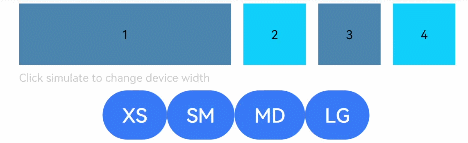

# GridContainer

<!--Kit: ArkUI-->
<!--Subsystem: ArkUI-->
<!--Owner: @fenglinbailu; @zju_ljz-->
<!--Designer: @fenglinbailu-->
<!--Tester: @liuli0427-->
<!--Adviser: @Brilliantry_Rui-->
<!-- md-trans-meta sourceCommit=75a7d62c0702c21a06ca0119552a942305a023cc translatedAt=2026-08-21T02:23:31.734Z pushedAt=2026-08-21T08:32:41.938Z -->

A vertical grid layout container, used only in grid layout scenarios. The grid layout implements responsive layout by dividing the container width into a specified number of columns, allowing child components to occupy different numbers of columns and offsets. It is suitable for responsive page layouts, multi-column content display, dashboard layouts, and other scenarios.

>  **NOTE**
>
>  This component is deprecated since API version 9. You are advised to use the new components [GridCol](ts-container-gridcol.md) and [GridRow](ts-container-gridrow.md) instead.
>
>  This component is supported since API version 7. New APIs added in later versions are marked with superscripts to indicate their starting version.

## Child Components

Supported

## APIs

### GridContainer<sup>(deprecated)</sup>

GridContainer(value?: GridContainerOptions)

Creates a vertical grid layout container.

>  **NOTE**
>
>  This API is supported since API version 7 and deprecated since API version 9. You are advised to use [GridCol](ts-container-gridcol.md#apis) or [GridRow](ts-container-gridrow.md#apis) instead.

**System capability**: SystemCapability.ArkUI.ArkUI.Full

**Parameters**

| Name| Type| Mandatory| Description|
| -------- | -------- | -------- | -------- |
| value | [GridContainerOptions](#gridcontaineroptionsdeprecated) | No | Configuration parameter of **GridContainer**, used to set the number of columns, device width type, gutter, and margin of the grid layout. If not passed, the default configuration is used. |

## GridContainerOptions<sup>(deprecated)</sup>

Defines the grid layout container configuration parameter object, used to set the number of columns, device width type, gutter, and margin for the **GridContainer** component.

>  **NOTE**
>
>  This API is supported since API version 7 and deprecated since API version 9. You are advised to use [GridColOptions](ts-container-gridcol.md#gridcoloptions) or [GridRowOptions](ts-container-gridrow.md#gridrowoptions) instead.

**System capability**: SystemCapability.ArkUI.ArkUI.Full

| Name| Type| Read-Only| Optional| Description|
| -------- | -------- | -------- | -------- | -------- |
| columns | number&nbsp;\|&nbsp;'auto' | No | Yes | Total number of columns in the current layout. If set to a number, it must be a positive integer. When set to a number, a fixed-column layout is used. When set to **'auto'**, the system automatically determines the number of columns based on the device width type (XS: 2 columns, SM: 4 columns, MD: 8 columns, LG: 12 columns). If **0** or a negative number is passed, it is treated as not set, and the system automatically determines the number of columns.<br>Default value: **'auto'** |
| sizeType | [SizeType](#sizetypedeprecated) | No | Yes | Device width type for responsive layout.<br>Default value: **SizeType.Auto** |
| gutter | number&nbsp;\|&nbsp;string | No | Yes | Gutter of the grid layout. Percentage values are not supported. When the type is number, the default unit is vp, with a value range of [0, +∞). If not set, it is automatically determined based on the device width type: 12 vp for XS, and 24 vp for SM, MD, and LG. |
| margin | number&nbsp;\|&nbsp;string | No | Yes | Margin on both sides of the grid layout. Percentage values are not supported. When the type is number, the default unit is vp, with a value range of [0, +∞). If not set, it is automatically determined based on the device width type: 12 vp for XS, 24 vp for SM, 32 vp for MD, and 48 vp for LG. |

## SizeType<sup>(deprecated)</sup>

Enumerates device width types, used to distinguish device types of different widths in the grid layout to implement responsive layout.

>  **NOTE**
>
>  This API is supported since API version 7 and deprecated since API version 9. You are advised to use [GridColColumnOption](ts-container-gridcol.md#gridcolcolumnoption) or [GridRowColumnOption](ts-container-gridrow.md#gridrowcolumnoption) instead.

**System capability**: SystemCapability.ArkUI.ArkUI.Full

| Name| Description|
| -------- | -------- |
| XS | Device with minimum width. Width ≤320 vp. |
| SM | Device with small width. Width 320 vp–600 vp. |
| MD | Device with medium width. Width 600 vp–840 vp. |
| LG | Device with large width. Width ≥840 vp. |
| Auto | Automatically matches the appropriate size type based on the device width. |

## Attributes

The [universal attributes](ts-component-general-attributes.md) and attributes of the [Column](ts-container-column.md#attributes) component are supported.

## Events

The [universal events](ts-component-general-events.md) are supported.

## Example

```ts
// xxx.ets
// Grid Layout example: GridContainer with useSizeType for responsive layout
@Entry
@Component
struct GridContainerExample {
  @State sizeType: SizeType = SizeType.XS // Current device width type

  build() {
    Column({ space: 5 }) {
      // Configure a 12-column grid layout with 10 vp column spacing and 20 vp gutter.
      GridContainer({ columns: 12, sizeType: this.sizeType, gutter: 10, margin: 20 }) {
        Row() {
          // Child components use useSizeType to set span (number of columns occupied) and offset (number of columns offset) for different device width types.
          Text('1')
            .useSizeType({
              xs: { span: 6, offset: 0 },
              sm: { span: 2, offset: 0 },
              md: { span: 2, offset: 0 },
              lg: { span: 2, offset: 0 }
            })
            .height(50).backgroundColor(0x4682B4).textAlign(TextAlign.Center)
          Text('2')
            .useSizeType({
              xs: { span: 2, offset: 6 },
              sm: { span: 6, offset: 2 },
              md: { span: 2, offset: 2 },
              lg: { span: 2, offset: 2 }
            })
            .height(50).backgroundColor(0x00BFFF).textAlign(TextAlign.Center)
          Text('3')
            .useSizeType({
              xs: { span: 2, offset: 8 },
              sm: { span: 2, offset: 8 },
              md: { span: 6, offset: 4 },
              lg: { span: 2, offset: 4 }
            })
            .height(50).backgroundColor(0x4682B4).textAlign(TextAlign.Center)
          Text('4')
            .useSizeType({
              xs: { span: 2, offset: 10 },
              sm: { span: 2, offset: 10 },
              md: { span: 2, offset: 10 },
              lg: { span: 6, offset: 6 }
            })
            .height(50).backgroundColor(0x00BFFF).textAlign(TextAlign.Center)
        }
      }.width('90%')

      Text('Click Simulate to change the device width').fontSize(9).width('90%').fontColor(0xCCCCCC)
      // Click the button to switch the device width type and observe the responsive layout changes.
      Row() {
        Button('XS')
          .onClick(() => {
            this.sizeType = SizeType.XS
          }).backgroundColor(0x317aff)
        Button('SM')
          .onClick(() => {
            this.sizeType = SizeType.SM
          }).backgroundColor(0x317aff)
        Button('MD')
          .onClick(() => {
            this.sizeType = SizeType.MD
          }).backgroundColor(0x317aff)
        Button('LG')
          .onClick(() => {
            this.sizeType = SizeType.LG
          }).backgroundColor(0x317aff)
      }
    }.width('100%').margin({ top: 5 })
  }
}
```

