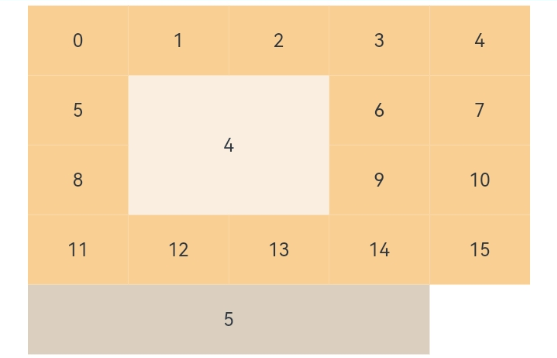
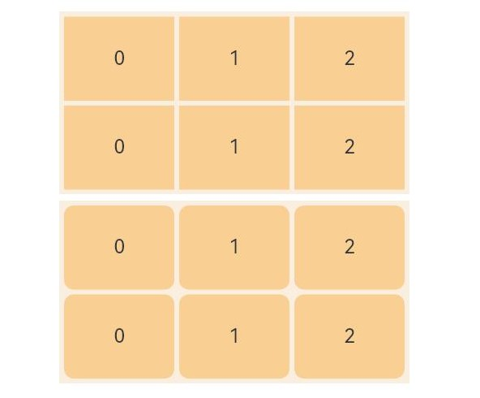

# GridItem

<!--Kit: ArkUI-->
<!--Subsystem: ArkUI-->
<!--Owner: @rongShao-Z; @guozejun-->
<!--Designer: @guozejun-->
<!--Tester: @leiyuqian-->
<!--Adviser: @Brilliantry_Rui-->
<!-- md-trans-meta sourceCommit=f1bbf293e58e8daa3733902ea6b2a7d76e6bbdaa translatedAt=2026-08-04T12:09:08.267Z pushedAt=2026-08-06T08:05:21.496Z -->

The **GridItem** component provides a single item in a grid.

>  **NOTE**
>
>  * This component is supported since API version 7. Updates will be marked with a superscript to indicate their earliest API version.
>  * This component can be used only as a child of [Grid](ts-container-grid.md).
>  * When this component is used with [LazyForEach](../../../ui/rendering-control/arkts-rendering-control-lazyforeach.md), its child components are created when it is created. When this component is used with [if/else](../../../ui/rendering-control/arkts-rendering-control-ifelse.md) or [ForEach](../../../ui/rendering-control/arkts-rendering-control-foreach.md), or when the parent component is **Grid**, its child components are created when it is laid out.
>  * If a **Grid** component contains a large number of **GridItem** components, using [columnStart](#columnstart)/[columnEnd](#columnend) or [rowStart](#rowstart)/[rowEnd](#rowend) to set the size of **GridItem** components can lead to performance issues, especially when **scrollToIndex** is used to scroll to a specific index. This is because **Grid** will traverse all **GridItem** nodes sequentially to find the specified index, which can be time-consuming. To address this issue, it is recommended that you use [GridLayoutOptions](ts-container-grid.md#gridlayoutoptions10) for layout, which significantly improves the efficiency of finding the position of **GridItem** components. For best practices, see [Optimizing Frame Loss for Grid Component Loading](https://developer.huawei.com/consumer/en/doc/best-practices/bpta-improve_grid_performance).

## Child Components

This component can contain a single child component.

## APIs

GridItem(value?: GridItemOptions)

Creates a **GridItem** component.

**Atomic service API**: This API can be used in atomic services since API version 11.

**System capability**: SystemCapability.ArkUI.ArkUI.Full

**Parameters**

| Name| Type                                     | Mandatory| Description                                                    |
| ------ | --------------------------------------------- | ---- | ------------------------------------------------------------ |
| value<sup>11+</sup>  | [GridItemOptions](#griditemoptions11) | No   | Optional parameters for **GridItem**. This object contains the **style** parameter of the [GridItemStyle](#griditemstyle11) enum type. When not passed, the default style is used, that is, **GridItemStyle.NONE**.<br/>**Model restriction:** This API can be used only in the stage model. |

## Attributes

### rowStart

rowStart(value: number)

Sets the start row number of the component.

**Atomic service API**: This API can be used in atomic services since API version 11.

**System capability**: SystemCapability.ArkUI.ArkUI.Full

**Parameters**

| Name| Type  | Mandatory| Description              |
| ------ | ------ | ---- | ------------------ |
| value  | number | Yes  | Start row number of the component.<br>In scenarios where you need to specify the start row and column numbers and the number of rows and columns of a **GridItem**, you are advised to use the [GridLayoutOptions](ts-container-grid.md#gridlayoutoptions10) parameter of the **Grid** component. For details, see [Example 1: Creating a Fixed Row and Column Grid Layout](ts-container-grid.md#example-1-creating-a-fixed-row-and-column-grid-layout) and [Example 3: Implementing a Scrollable Grid with Grid Items Spanning Rows and Columns](ts-container-grid.md#example-3-implementing-a-scrollable-grid-with-grid-items-spanning-rows-and-columns).<br>Value range: [0, Total number of rows – 1].|

### rowEnd

rowEnd(value: number)

Sets the end row number of the component.

**Atomic service API**: This API can be used in atomic services since API version 11.

**System capability**: SystemCapability.ArkUI.ArkUI.Full

**Parameters**

| Name| Type  | Mandatory| Description              |
| ------ | ------ | ---- | ------------------ |
| value  | number | Yes   | End row number of the current element.<br/>In scenarios where you need to specify the start row and column and the occupied rows and columns of a **GridItem**, you are advised to use the [GridLayoutOptions](ts-container-grid.md#gridlayoutoptions10) parameter of **Grid**. For details, see [Example 1: Creating a Fixed Row and Column Grid Layout](ts-container-grid.md#example-1-creating-a-fixed-row-and-column-grid-layout) and [Example 3: Implementing a Scrollable Grid with Grid Items Spanning Rows and Columns](ts-container-grid.md#example-3-implementing-a-scrollable-grid-with-grid-items-spanning-rows-and-columns).<br/>Value range: [0, Total Rows - 1] |

### columnStart

columnStart(value: number)

Sets the start column number of the component.

**Atomic service API**: This API can be used in atomic services since API version 11.

**System capability**: SystemCapability.ArkUI.ArkUI.Full

**Parameters**

| Name| Type  | Mandatory| Description              |
| ------ | ------ | ---- | ------------------ |
| value  | number | Yes  | Start column number of the component.<br>In scenarios where you need to specify the start row and column numbers and the number of rows and columns of a **GridItem**, you are advised to use the [GridLayoutOptions](ts-container-grid.md#gridlayoutoptions10) parameter of the **Grid** component. For details, see [Example 1: Creating a Fixed Row and Column Grid Layout](ts-container-grid.md#example-1-creating-a-fixed-row-and-column-grid-layout) and [Example 3: Implementing a Scrollable Grid with Grid Items Spanning Rows and Columns](ts-container-grid.md#example-3-implementing-a-scrollable-grid-with-grid-items-spanning-rows-and-columns).<br>Value range: [0, Total number of columns – 1].|

### columnEnd

columnEnd(value: number)

Sets the end column number of the component.

**Atomic service API**: This API can be used in atomic services since API version 11.

**System capability**: SystemCapability.ArkUI.ArkUI.Full

**Parameters**

| Name| Type  | Mandatory| Description              |
| ------ | ------ | ---- | ------------------ |
| value  | number | Yes  | End column number of the component.<br>In scenarios where you need to specify the start row and column numbers and the number of rows and columns of a **GridItem**, you are advised to use the [GridLayoutOptions](ts-container-grid.md#gridlayoutoptions10) parameter of the **Grid** component. For details, see [Example 1: Creating a Fixed Row and Column Grid Layout](ts-container-grid.md#example-1-creating-a-fixed-row-and-column-grid-layout) and [Example 3: Implementing a Scrollable Grid with Grid Items Spanning Rows and Columns](ts-container-grid.md#example-3-implementing-a-scrollable-grid-with-grid-items-spanning-rows-and-columns).<br>Value range: [0, Total number of columns – 1].|

In scenarios where you need to specify the start row and column numbers and the number of rows and columns of a **GridItem**, you are advised to use the [GridLayoutOptions](ts-container-grid.md#gridlayoutoptions10) parameter of the **Grid** component. For details, see [Example 1: Creating a Fixed Row and Column Grid Layout](ts-container-grid.md#example-1-creating-a-fixed-row-and-column-grid-layout) and [Example 3: Implementing a Scrollable Grid with Grid Items Spanning Rows and Columns](ts-container-grid.md#example-3-implementing-a-scrollable-grid-with-grid-items-spanning-rows-and-columns).

Rules for setting **rowStart**, **rowEnd**, **columnStart**, and **columnEnd**:

* The valid value range of **rowStart** and **rowEnd** is 0 to the total number of rows minus 1. The valid value range of **columnStart** and **columnEnd** is 0 to the total number of columns minus 1.

* If **rowStart**, **rowEnd**, **columnStart**, or **columnEnd** is set, **GridItem** components occupy the specified number of rows (**rowEnd** - **rowStart** + 1) or columns (**columnEnd** - **columnStart** + 1).

* **GridItem** components with properly configured **rowStart**/**rowEnd**/**columnStart**/**columnEnd** attributes can only be laid out according to the specified grid coordinates when the parent **Grid** has both **columnsTemplate** and **rowsTemplate** defined.

* In the **Grid** component with both **columnsTemplate** and **rowsTemplate** set, **GridItem** components that have **rowStart**/**rowEnd** or **columnStart**/**columnEnd** set are laid out in a row-by-row then column-by-column manner.

* In the **Grid** component with only **columnsTemplate** set, **GridItem** components that have **columnStart**/**columnEnd** set are laid out in the specified columns. If there are already grid items in those columns, the grid items will be laid out in another row.

* In the **Grid** component with only **rowsTemplate** set, **GridItem** components that have **rowStart**/**rowEnd** set are laid out on the specified rows. If there are already grid items in those rows, the grid items will be laid out in another column.

* In the **Grid** component with neither **columnsTemplate** nor **rowsTemplate** set, the row and column number attributes have no effect for **GridItem** components.

The following table describes the rules for handling abnormal values for **GridItem** row and column numbers.

| Attribute Setting | Exception Type| Layout Principles After Correction |
| ----- |----| ------------------------ |
| Only **columnsTemplate** is set |  Any row or column exception| Laid out in a row-by-row then column-by-column manner|
| Only **rowsTemplate** is set|  Any row or column exception| Laid out in a row-by-row then column-by-column manner|
| Both **rowsTemplate** and **columnsTemplate** are set|  rowStart < rowEnd | Row span = min(rowEnd - rowStart + 1, total number of rows)|
| Both **rowsTemplate** and **columnsTemplate** are set|  rowStart > rowEnd | Laid out in a row-by-row then column-by-column manner|
| Both **rowsTemplate** and **columnsTemplate** are set|  columnStart < columnEnd | Column span = min(columnEnd - columnStart + 1, total number of columns)|
| Both **rowsTemplate** and **columnsTemplate** are set|  columnStart > columnEnd | Laid out in a row-by-row then column-by-column manner|

### forceRebuild<sup>(deprecated)</sup>

forceRebuild(value: boolean)

Whether to re-create the component when it is being built.

> **NOTE**
>
> This API is supported since API version 7 and deprecated since API version 9. Whether to re-create the component is automatically determined based on the component attributes and child component changes. No manual configuration is required.

**System capability**: SystemCapability.ArkUI.ArkUI.Full

**Parameters**

| Name | Type   | Mandatory | Description                                                   |
| ------ | ------- | ---- | ------------------------------------------------------- |
| value  | boolean | Yes   | Whether to recreate this node when the component build is triggered. The value **true** means to recreate the node, and **false** means not to forcibly recreate the node.<br/>Default value: **false** |

### selectable<sup>8+</sup>

selectable(value: boolean)

Sets whether the grid item is selectable in the mouse selection box area. This attribute takes effect only when mouse box selection is enabled for the parent **Grid** container.

This attribute must be used before the [polymorphic style](./ts-universal-attributes-polymorphic-style.md) is set. Otherwise, the style settings will not take effect.

**Atomic service API**: This API can be used in atomic services since API version 11.

**System capability**: SystemCapability.ArkUI.ArkUI.Full

**Parameters**

| Name| Type   | Mandatory| Description                                                 |
| ------ | ------- | ---- | ----------------------------------------------------- |
| value  | boolean | Yes  | Whether the grid item is selectable in the mouse selection box area. The value **true** means that the grid item is selectable in the mouse selection box area, and **false** means the opposite.<br>Default value: **true**.|

### selected<sup>10+</sup>

selected(value: boolean)

Sets whether the grid item is selected. This attribute supports two-way binding through [$$](../../../ui/state-management/arkts-two-way-sync.md).

This attribute must be used before the [polymorphic style](./ts-universal-attributes-polymorphic-style.md) is set. Otherwise, the style settings will not take effect.

**Atomic service API**: This API can be used in atomic services since API version 11.

**Model restriction:** This API can be used only in the stage model.

**System capability**: SystemCapability.ArkUI.ArkUI.Full

**Parameters**

| Name| Type   | Mandatory| Description                                    |
| ------ | ------- | ---- | ---------------------------------------- |
| value  | boolean | Yes   | Whether the current **GridItem** is selected. The value **true** indicates the selected state, and **false** indicates the unselected state.<br/>Default value: **false** |

## GridItemOptions<sup>11+</sup>

Defines the **GridItem** style object, used to configure the style options of **GridItem**.

**Atomic service API**: This API can be used in atomic services since API version 12.

**Model restriction:** This API can be used only in the stage model.

**System capability**: SystemCapability.ArkUI.ArkUI.Full

| Name | Type                 | Read-Only| Optional| Description                        |
| ----- | -------------------- | ---- | --- | ---------------------------- |
| style | [GridItemStyle](#griditemstyle11) | No | Yes | Style of **GridItem**.<br/>Default value: **GridItemStyle.NONE**<br/>When set to **GridItemStyle.NONE**, no style is applied.<br/>When set to **GridItemStyle.PLAIN**, the **Hover** and **Press** state styles are displayed. The **Hover** state is the style when the mouse hovers over the item, and the **Press** state is the style when the item is pressed. |

## GridItemStyle<sup>11+</sup>

Enumerates the **GridItem** styles, used to define the interaction state styles of **GridItem**.

**Atomic service API**: This API can be used in atomic services since API version 12.

**Model restriction:** This API can be used only in the stage model.

**System capability**: SystemCapability.ArkUI.ArkUI.Full

| Name |Value| Description                  |
| ----- |----| ------------------------ |
| NONE  |  0 | No style. **Hover** and **Press** state styles are not displayed.                 |
| PLAIN |  1 | Displays **Hover** and **Press** state styles. The **Hover** state is the style when the mouse hovers, and the **Press** state is the style when pressed. |

> **NOTE**
>
> To set the focused style for the grid item, the grid container must have paddings of greater than 4 vp for accommodating the focus frame of the grid item.

## Events

### onSelect<sup>8+</sup>

onSelect(event: (isSelected: boolean) => void)

Triggered when the selected state of the grid item changes.

**Atomic service API**: This API can be used in atomic services since API version 11.

**System capability**: SystemCapability.ArkUI.ArkUI.Full

**Parameters**

| Name    | Type   | Mandatory| Description                                                        |
| ---------- | ------- | ---- | ------------------------------------------------------------ |
| isSelected | boolean | Yes | Whether the item is selected. The value **true** indicates that the item enters the mouse selection range and is selected, and **false** indicates that the item moves out of the mouse selection range and is not selected. |

## Example

### Example 1: Setting the Grid Item Position

The **GridItem** component sets its own position by setting reasonable **rowStart**, **rowEnd**, **columnStart**, and **columnEnd** attributes. For scenarios where you need to specify the start row and column and the occupied rows and columns of **GridItem**, it is recommended to use the [GridLayoutOptions](ts-container-grid.md#gridlayoutoptions10) parameter of **Grid**. For details, refer to [Example 1: Creating a Fixed Row and Column Grid Layout](ts-container-grid.md#example-1-creating-a-fixed-row-and-column-grid-layout) and [Example 3: Implementing a Scrollable Grid with Grid Items Spanning Rows and Columns](ts-container-grid.md#example-3-implementing-a-scrollable-grid-with-grid-items-spanning-rows-and-columns) of Grid.

```ts
// xxx.ets
@Entry
@Component
struct GridItemExample {
  @State numbers: string[] = ['0', '1', '2', '3', '4', '5', '6', '7', '8', '9', '10', '11', '12', '13', '14', '15'];

  build() {
    Column() {
      Grid() {
        GridItem() {
          Text('4')
            .fontSize(16)
            .backgroundColor(0xFAEEE0)
            .width('100%')
            .height('100%')
            .textAlign(TextAlign.Center)
        }.rowStart(1).rowEnd(2).columnStart(1).columnEnd(2) // Set valid row and column numbers.

        ForEach(this.numbers, (item: string) => {
          GridItem() {
            Text(item)
              .fontSize(16)
              .backgroundColor(0xF9CF93)
              .width('100%')
              .height('100%')
              .textAlign(TextAlign.Center)
          }
        }, (item: string) => item)

        GridItem() {
          Text('5')
            .fontSize(16)
            .backgroundColor(0xDBD0C0)
            .width('100%')
            .height('100%')
            .textAlign(TextAlign.Center)
        }.columnStart(1).columnEnd(4) // No row number is set, so positioning does not follow columnStart(1). Here, the layout starts from row 5, column index 0, and spans 4 columns.
      }
      .columnsTemplate('1fr 1fr 1fr 1fr 1fr')
      .rowsTemplate('1fr 1fr 1fr 1fr 1fr')
      .width('90%').height(300)
    }.width('100%').margin({ top: 5 })
  }
}
```



### Example 2: Setting the Grid Item Style

This example shows how to set the grid item style using **GridItemOptions**.

```ts
// xxx.ets
@Entry
@Component
struct GridItemExample {
  @State numbers: string[] = ['0', '1', '2'];

  build() {
    Column({ space: 5 }) {
      Grid() {
        ForEach(this.numbers, (rowItem: string) => {
          ForEach(this.numbers, (item: string) => {
            GridItem({ style: GridItemStyle.NONE }) {
              Text(item)
                .fontSize(16)
                .width('100%')
                .height('100%')
                .textAlign(TextAlign.Center)
                .focusable(true)
            }
            .backgroundColor(0xF9CF93)
          }, (item: string) => item)
        }, (rowItem: string) => rowItem)
      }
      .columnsTemplate('1fr 1fr 1fr')
      .rowsTemplate('1fr 1fr')
      .columnsGap(4)
      .rowsGap(4)
      .width('60%')
      .backgroundColor(0xFAEEE0)
      .height(150)
      .padding('4vp')

      Grid() {
        ForEach(this.numbers, (rowItem: string) => {
          ForEach(this.numbers, (item: string) => {
            GridItem({ style: GridItemStyle.PLAIN }) {
              Text(item)
                .fontSize(16)
                .width('100%')
                .height('100%')
                .textAlign(TextAlign.Center)
                .focusable(true)
            }
            .backgroundColor(0xF9CF93)
          }, (item: string) => item)
        }, (rowItem: string) => rowItem)
      }
      .columnsTemplate('1fr 1fr 1fr')
      .rowsTemplate('1fr 1fr')
      .columnsGap(4)
      .rowsGap(4)
      .width('60%')
      .backgroundColor(0xFAEEE0)
      .height(150)
      .padding('4vp')
    }.width('100%').margin({ top: 5 })
  }
}
```

