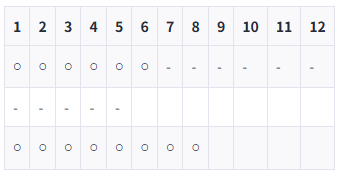
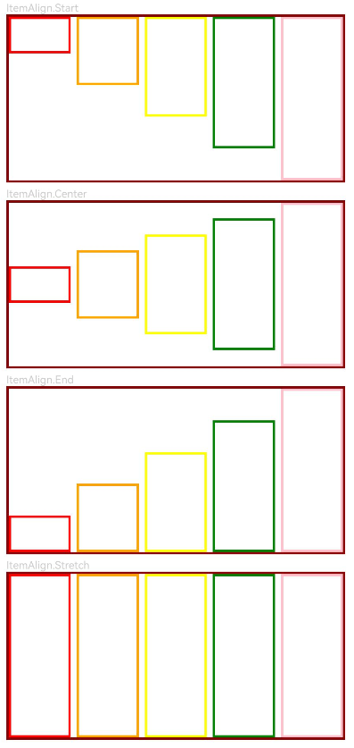

# GridRow

<!--Kit: ArkUI-->
<!--Subsystem: ArkUI-->
<!--Owner: @zju_ljz-->
<!--Designer: @fenglinbailu-->
<!--Tester: @liuli0427-->
<!--Adviser: @Brilliantry_Rui-->
<!-- md-trans-meta sourceCommit=75a7d62c0702c21a06ca0119552a942305a023cc translatedAt=2026-08-21T02:24:01.415Z pushedAt=2026-08-21T08:33:55.781Z -->

The responsive grid layout provides rules for layout design and resolves issues of dynamic layout across devices with different sizes, thereby ensuring layout consistency across layouts on different devices.

The **GridRow** component is used in a grid layout, together with its child component [GridCol](ts-container-gridcol.md).

It supports dynamically adjusting the number of columns and gutter sizes based on device sizes and breakpoints to implement responsive layout.

> **NOTE**
>
> This component is supported since API version 9. Updates will be marked with a superscript to indicate their earliest API version.

## Child Components

This component can contain the **GridCol** child component.

## APIs

GridRow(option?: GridRowOptions)

Defines a grid row layout container. It can only be used with grid child components in grid layout scenarios.

**Widget capability**: This API can be used in ArkTS widgets since API version 9.

**Atomic service API**: This API can be used in atomic services since API version 11.

**System capability**: SystemCapability.ArkUI.ArkUI.Full

**Parameters**

| Name|Type|Mandatory|Description|
|-----|-----|----|----|
| option | [GridRowOptions](#gridrowoptions) | No | Layout options of the grid row layout container. This parameter is passed when you need to customize the grid layout (such as setting the number of columns, gutter, breakpoint positions, and arrangement direction). If not passed, the default configuration is used. **GridRow** must be used together with [GridCol](ts-container-gridcol.md) child components. |

## GridRowOptions

Defines layout options of the **GridRow** container.

**Widget capability**: This API can be used in ArkTS widgets since API version 9.

**Atomic service API**: This API can be used in atomic services since API version 11.

**System capability**: SystemCapability.ArkUI.ArkUI.Full

| Name| Type| Read-Only| Optional| Description|
| -------- | -------- | -------- | -------- | -------- |
|columns| number \| [GridRowColumnOption](#gridrowcolumnoption) |  No | Yes |Number of layout columns.<br>The value must be a positive integer.<br>- Before API version 20: The default value is **12**.<br>- Since API version 20: The default value is **{ xs: 2, sm: 4, md: 8, lg: 12, xl: 12, xxl: 12 }**.<br>Invalid value: The default value is used.|
|gutter|[Length](ts-types.md#length) \| [GutterOption](#gutteroption)|  No | Yes |Grid layout gutter.<br>Default value: **0vp**<br>Invalid value: The default value is used.<br>Unit: vp|
|breakpoints|[BreakPoints](#breakpoints)|  No | Yes |Used to set the monotonically increasing array of breakpoint positions, and the reference object for breakpoint switching (based on the app window or container size).<br>Default value:<br>**{<br>value: ["320vp", "600vp", "840vp"],<br>reference: BreakpointsReference.WindowSize<br>}**<br>Invalid value: The default value is used.<br>Unit: vp|
|direction|[GridRowDirection](#gridrowdirection)|  No | Yes |Grid layout arrangement direction. Supports **Row** (row-wise arrangement, suitable for conventional LTR layouts) and **RowReverse** (reverse row-wise arrangement, suitable for RTL layouts or scenarios requiring reverse arrangement).<br>Default value: **GridRowDirection.Row**<br>Invalid value: The default value is used.|

## GutterOption

Provides the gutter options for the grid layout to define the spacing between child components in different directions.

**Widget capability**: This API can be used in ArkTS widgets since API version 9.

**Atomic service API**: This API can be used in atomic services since API version 11.

**System capability**: SystemCapability.ArkUI.ArkUI.Full

| Name| Type| Read-Only| Optional| Description|
| -------- | -------- | -------- | -------- | -------- |
| x  | [Length](ts-types.md#length) \| [GridRowSizeOption](#gridrowsizeoption) | No  | Yes  | Horizontal gutter between child components in the grid. Value range: a number or string greater than or equal to 0.<br>Default value: **0vp**.<br>Invalid value: the default value is used.<br>Unit: vp    |
| y  | [Length](ts-types.md#length) \| [GridRowSizeOption](#gridrowsizeoption) | No  | Yes   | Vertical gutter between child components in the grid. Value range: a number or string greater than or equal to 0.<br>Default value: **0vp**.<br>Invalid value: the default value is used.<br>Unit: vp    |

## GridRowColumnOption

Describes the grid column number configuration for different device width types.

Before API Version 20, if only partial breakpoints are set for **GridRow**'s grid column count, unconfigured breakpoints inherit the column count from the nearest smaller configured breakpoint (for instance, **sm** is the nearest smaller breakpoint of **md**). If no such smaller breakpoint is configured, the default grid column count 12 is used as a fallback.

<!--code_no_check-->

```ts
columns: {xs:2, md:4, lg:8} // Equivalent to columns: {xs:2, sm:2, md:4, lg:8, xl:8, xxl:8}.
columns: {md:4, lg:8} // Equivalent to columns: {xs:12, sm:12, md:4, lg:8, xl:8, xxl:8}.
```

Since API version 20, if only partial breakpoints are set for **GridRow**'s grid column count, unconfigured breakpoints inherit the column count from the nearest smaller configured breakpoint. If no smaller configured breakpoint is available, the value from the nearest larger configured breakpoint is used as a fallback.

<!--code_no_check-->

```ts
columns: {xs:2, md:4, lg:8} // Equivalent to columns: {xs:2, sm:2, md:4, lg:8, xl:8, xxl:8}.
columns: {md:4, lg:8} // Equivalent to columns: {xs:4, sm:4, md:4, lg:8, xl:8, xxl:8}.
```

Recommendation: Explicitly configure **GridRow** column spans for all required breakpoints to prevent unexpected layout behavior caused by automatic value inheritance.

The width of each column is the content area size of the **GridRow** component minus the gutter of the grid child components, and then divided by the total number of columns. For example, if a **GridRow** with a width of 800 vp has **columns** set to 12, **gutter** set to 10 vp, and **padding** set to 20 vp, the width of each column is (800 – 20 × 2 – 10 × 11)/12.

**Widget capability**: This API can be used in ArkTS widgets since API version 9.

**Atomic service API**: This API can be used in atomic services since API version 11.

**System capability**: SystemCapability.ArkUI.ArkUI.Full

| Name| Type| Read-Only| Optional| Description|
| -------- | -------- | -------- | -------- | -------- |
| xs  | number | No    | Yes  | Number of grid columns of the grid container on a minimum-width device. The value is a positive integer.<br>- Before API version 20: the default value is **12**.<br>- Since API version 20: the default value is **2**.<br>If an invalid value is set, the default value is used.    |
| sm  | number | No    | Yes  | Number of grid columns of the grid container on a small-width device. The value is a positive integer.<br>- Before API version 20: the default value is **12**.<br>- Since API version 20: the default value is **4**.<br>If an invalid value is set, the default value is used.      |
| md  | number | No    | Yes  | Number of grid columns of the grid container on a medium-width device. The value is a positive integer.<br>- Before API version 20: the default value is **12**.<br>- Since API version 20: the default value is **8**.<br>If an invalid value is set, the default value is used.    |
| lg  | number | No   | Yes   | Number of grid columns of the grid container on a large-width device. The value is a positive integer.<br>- Before API version 20: the default value is **12**.<br>- Since API version 20: the default value is **12**.<br>If an invalid value is set, the default value is used.      |
| xl  | number | No    | Yes  | Number of grid columns of the grid container on an extra-large-width device. The value is a positive integer.<br>- Before API version 20: the default value is **12**.<br>- Since API version 20: the default value is **12**.<br>If an invalid value is set, the default value is used.    |
| xxl | number | No    | Yes  | Number of grid columns of the grid container on an extra-extra-large-width device. The value is a positive integer.<br>- Before API version 20: the default value is **12**.<br>- Since API version 20: the default value is **12**.<br>If an invalid value is set, the default value is used.    |

## GridRowSizeOption

Describes the gutter sizes for different device width types.

**Widget capability**: This API can be used in ArkTS widgets since API version 9.

**Atomic service API**: This API can be used in atomic services since API version 11.

**System capability**: SystemCapability.ArkUI.ArkUI.Full

| Name| Type| Read-Only| Optional| Description|
| -------- | -------- | -------- | -------- | -------- |
| xs  | [Length](ts-types.md#length) | No  | Yes   | Gutter of the grid child components on minimum-width type devices. Value range: a number or string greater than or equal to 0.<br>Default value: **0vp**<br>Unit: vp<br>Invalid value: handled as the default value.    |
| sm  | [Length](ts-types.md#length) | No  | Yes   | Gutter of the grid child components on small-width type devices. Value range: a number or string greater than or equal to 0.<br>Default value: **0vp**<br>Unit: vp<br>Invalid value: handled as the default value.      |
| md  | [Length](ts-types.md#length) | No  | Yes   | Gutter of the grid child components on medium-width type devices. Value range: a number or string greater than or equal to 0.<br>Default value: **0vp**<br>Unit: vp<br>Invalid value: handled as the default value.    |
| lg  | [Length](ts-types.md#length) | No  | Yes   | Gutter of the grid child components on large-width type devices. Value range: a number or string greater than or equal to 0.<br>Default value: **0vp**<br>Unit: vp<br>Invalid value: handled as the default value.      |
| xl  | [Length](ts-types.md#length) | No  | Yes   | Gutter of the grid child components on extra-large-width type devices. Value range: a number or string greater than or equal to 0.<br>Default value: **0vp**<br>Unit: vp<br>Invalid value: handled as the default value.    |
| xxl | [Length](ts-types.md#length) | No  | Yes   | Gutter of the grid child components on extra-extra-large-width type devices. Value range: a number or string greater than or equal to 0.<br>Default value: **0vp**<br>Unit: vp<br>Invalid value: handled as the default value.    |

## BreakPoints

Sets breakpoints for the responsive grid container. For details about breakpoints, see [Breakpoints](../../../ui/arkts-layout-development-grid-layout.md#breakpoints).

**Widget capability**: This API can be used in ArkTS widgets since API version 9.

**Atomic service API**: This API can be used in atomic services since API version 11.

**System capability**: SystemCapability.ArkUI.ArkUI.Full

| Name | Type | Read-Only | Optional | Description |
| -------- | -------- | -------- | -------- | -------- |
| value  | Array&lt;string&gt; | No | Yes | Monotonically increasing array of breakpoint positions. The string format is "number+vp", for example, "320vp" and "600vp".<br>Default value: **["320vp", "600vp", "840vp"]** <br>Invalid value: The default value is used.<br>Unit: vp<br>The default breakpoints apply to most scenarios. You can customize them for special screen sizes or specific layout requirements.    |
| reference  | [BreakpointsReference](#breakpointsreference) | No | Yes | Reference object for breakpoint switching. The options are **WindowSize** (using the window as the reference) and **ComponentSize** (using the container as the reference).<br>Default value: **BreakpointsReference.WindowSize** <br>Invalid value: The default value is used. |

<!--code_no_check-->

```ts
  // Enable the xs, sm, and md breakpoints.
  breakpoints: {value: ['100vp', '200vp']}
  // Enable four breakpoints: xs, sm, md, and lg. The breakpoint range must be monotonically increasing.
  breakpoints: {value: ['320vp', '600vp', '840vp']}
  // Enable five breakpoints: xs, sm, md, lg, and xl. The count of breakpoint ranges must not be greater than the total number of configurable breakpoints minus one.
  breakpoints: {value: ['320vp', '600vp', '840vp', '1080vp']}
```

## BreakpointsReference

Breakpoint reference of the grid container component.

**Widget capability**: This API can be used in ArkTS widgets since API version 9.

**Atomic service API**: This API can be used in atomic services since API version 11.

**System capability**: SystemCapability.ArkUI.ArkUI.Full

| Name| Value| Description|
| -------- | -------- | -------- |
| WindowSize | 0 | Uses the window as the reference. Breakpoint calculation is based on the app window size, suitable for scenarios where responsive layout needs to adapt to overall window size changes. |
| ComponentSize | 1 | Uses the container as the reference. Breakpoint calculation is based on the size of the **GridRow** component itself, suitable for scenarios where responsive layout needs to adapt to component container size changes, for example, when **GridRow** is nested in another container. |

## GridRowDirection

Grid element arrangement direction.

> **NOTE**
>
> - Grid elements can be arranged only in the **Row** or **RowReverse** direction, but not in the **Column** or **ColumnReverse** direction.
> - The location and size of a grid child component can only be calculated through **span** and **offset**. When the **span** values of multiple child components exceed the specified number of columns, they automatically wrap to a new row.
> - When the **span** of a single element exceeds the maximum number of columns, the **span** is set to the maximum number of columns by default.
> - When the **offset** of a new row plus the **span** of the child component exceeds the total number of columns, the next child component is placed on a new row.
> - Example: Item1: GridCol({ span: 6 }), Item2: GridCol({ span: 8, offset:11 }).
>
>   

**Widget capability**: This API can be used in ArkTS widgets since API version 9.

**Atomic service API**: This API can be used in atomic services since API version 11.

**System capability**: SystemCapability.ArkUI.ArkUI.Full

| Name| Value  | Description|
| -------- | ---- | -------- |
| Row | 0 | Grid elements are arranged in the row direction. This is suitable for regular LTR (left-to-right) layout scenarios. |
| RowReverse | 1 | Grid elements are arranged in the reverse row direction. This is suitable for RTL (right-to-left) language layouts or scenarios that require reverse arrangement. |

## Attributes

In addition to the [universal attributes](ts-component-general-attributes.md), the following attributes are supported.

### alignItems<sup>10+</sup>

alignItems(value: ItemAlign)

Sets the alignment mode of **GridCol** within **GridRow** along the cross axis. The **GridCol** component can also set its own alignment mode through **alignSelf([ItemAlign](ts-appendix-enums.md#itemalign))**. When both alignment modes are set, the setting of the **GridCol** component takes precedence.

**Widget capability**: This API can be used in ArkTS widgets since API version 10.

**Atomic service API**: This API can be used in atomic services since API version 11.

**Model restriction:** This API can be used only in the stage model.

**System capability**: SystemCapability.ArkUI.ArkUI.Full

**Parameters**

| Name| Type                                       | Mandatory| Description                                                        |
| ------ | ------------------------------------------- | ---- | ------------------------------------------------------------ |
| value  | [ItemAlign](ts-appendix-enums.md#itemalign) | Yes   | Alignment mode of **GridCol** within **GridRow** along the cross axis.<br>Default value: **ItemAlign.Start**<br>Invalid value: The default value is used.<br>**NOTE**<br>The supported **ItemAlign** values are: **ItemAlign.Start**, **ItemAlign.Center**, **ItemAlign.End**, **ItemAlign.Stretch**. |

## Events

In addition to the [universal events](ts-component-general-events.md), the following events are supported.

### onBreakpointChange

onBreakpointChange(callback: (breakpoints: string) => void)

Triggered when the breakpoint changes. The **breakpoints** parameter received by the callback indicates the current breakpoint value (with possible values of **"xs"**, **"sm"**, **"md"**, **"lg"**, **"xl"**, and **"xxl"**). You can perform corresponding UI layout adjustments or service logic processing based on the breakpoint value in the callback.

> **NOTE**
>
> - When [breakpointsreference](#breakpointsreference) is set to **BreakpointsReference.ComponentSize**, do not dynamically modify the [padding](ts-universal-attributes-size.md#padding) or [margin](ts-universal-attributes-size.md#margin) attribute of the **GridRow** component in the **onBreakpointChange** callback. Otherwise, it may cause cyclic triggering of component size calculation, layout jitter, or rendering performance degradation.

**Widget capability**: This API can be used in ArkTS widgets since API version 9.

**Atomic service API**: This API can be used in atomic services since API version 11.

**System capability**: SystemCapability.ArkUI.ArkUI.Full

**Parameters**

| Name  | Type  | Mandatory  | Description  |
| ----- | ------ | ---- | ---------------------------------------- |
|callback| (breakpoints: string) => void |Yes|Callback invoked when the breakpoint changes. The parameter **breakpoints** indicates the current breakpoint value, which can be `"xs"`, `"sm"`, `"md"`, `"lg"`, `"xl"`, or `"xxl"`.|

## Example

### Example 1: Basic Usage of Grid Layout

This example demonstrates the basic usage of the **GridRow** component.

```ts
// xxx.ets
@Entry
@Component
struct GridRowExample {
  @State bgColors: Color[] = [Color.Red, Color.Orange, Color.Yellow, Color.Green, Color.Pink, Color.Grey, Color.Blue, Color.Brown]
  @State currentBp: string = 'unknown'

  build() {
    Column() {
      GridRow({
        columns: 5,
        gutter: { x: 5, y: 10 },
        breakpoints: { value: ['400vp', '600vp', '800vp'],
          reference: BreakpointsReference.WindowSize },
        direction: GridRowDirection.Row
      }) {
        ForEach(this.bgColors, (color: Color) => {
          GridCol({ span: { xs: 1, sm: 2, md: 3, lg: 4 }, offset: 0, order: 0 }) {
            Row().width('100%').height('20vp')
          }.borderColor(color).borderWidth(2)
        })
      }.width('100%').height('100%')
      .onBreakpointChange((breakpoint) => {
        this.currentBp = breakpoint
      })
    }.width('80%').margin({ left: 10, top: 5, bottom: 5 }).height(200)
    .border({ color: '#880606', width: 2 })
  }
}
```


### Example 2: Basic Usage of AlignItems

This example demonstrates the effect of the **GridCol** component in different **alignItems** alignment modes.

```ts
@ComponentV2
struct AlignItemsDemo {
  bgColors: Color[] = [Color.Red, Color.Orange, Color.Yellow, Color.Green, Color.Pink];
  @Param alignment: ItemAlign = ItemAlign.Start; // Receive the alignItems attribute value passed from the parent component.

  ToString(alignment: ItemAlign): string {
    switch (alignment) {
      case ItemAlign.Start:
        return 'ItemAlign.Start';
      case ItemAlign.Center:
        return 'ItemAlign.Center';
      case ItemAlign.End:
        return 'ItemAlign.End';
      case ItemAlign.Stretch:
        return 'ItemAlign.Stretch';
      default:
        return 'ItemAlign.Auto';
    }
  }

  build() {
    Column() {
      Text(this.ToString(this.alignment))
        .fontSize(9)
        .fontColor(0xCCCCCC)
        .width('90%')
        .alignSelf(ItemAlign.Start)
      GridRow({
        columns: 5,
        gutter: { x: 5, y: 10 },
      }) {
        ForEach(this.bgColors, (color: Color, index: number) => {
          GridCol({ span: 1 }) {
            Row() {
            }.width('100%').height(`${(index + 1) * 20}%`) // Set different heights for the Row in GridCol to observe the effect of the alignItems attribute.
          }.borderColor(color).borderWidth(2)
        })
      }
      .border({ color: '#880606', width: 2 })
      .alignItems(this.alignment)
      .width('100%')
    }
    .height('20%')
  }
}

@Entry
@ComponentV2
struct GridRowExample {
  alignmentArray: ItemAlign[] = [ItemAlign.Start, ItemAlign.Center, ItemAlign.End, ItemAlign.Stretch];

  build() {
    Column({ space: 15 }) {
      ForEach(this.alignmentArray, (ele: ItemAlign) => {
        AlignItemsDemo({ alignment: ele })
      })
    }.width('80%').margin({ left: 10, top: 5, bottom: 5 }).height('100%')
  }
}
```

