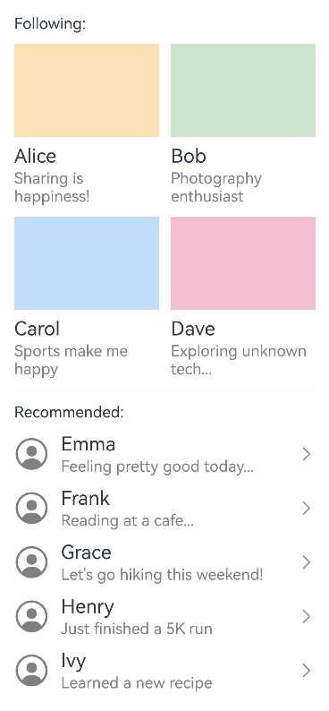

# LazyColumnLayout

<!--Kit: ArkUI-->
<!--Subsystem: ArkUI-->
<!--Owner: @yylong; @rongShao-Z; @yangcan18-->
<!--Designer: @yylong-->
<!--Tester: @leiyuqian-->
<!--Adviser: @Brilliantry_Rui-->

This component is used to implement a vertical linear layout that supports lazy loading. Its parent component can only be [List](ts-container-list.md), [Scroll](ts-container-scroll.md), [WaterFlow](ts-container-waterflow.md), or [FlowItem](ts-container-flowitem.md). It can also be encapsulated using custom components or [NodeContainer](ts-basic-components-nodecontainer.md) components and then applied to the preceding components.

This component supports the nested lazy-loading containers, including [LazyVGridLayout](ts-container-lazyvgridlayout.md), [LazyVWaterFlowLayout](ts-container-lazyvwaterflowlayout.md), and **LazyColumnLayout** itself.

> **NOTE**
>
> - This component's height adapts to content by default. You are advised not to set the height, height constraint, or aspect ratio. Otherwise, the display may be abnormal.
> - The lazy loading conditions of this component in different parent components are as follows:
>   1. In the **List** component: The layout direction of the **List** component must be vertical (that is, the [listDirection](ts-container-list.md#listdirection) attribute is set to **Axis.Vertical**). Using this component in a non-vertical **List** will cause application crash. If either the [lanes](ts-container-list.md#lanes9), [chainAnimation](ts-container-list.md#chainanimation) or [scrollSnapAlign](ts-container-list.md#scrollsnapalign10) attribute is set for the **List** component, the lazy loading feature of the component will become invalid.
>   2. In the **Scroll** component: The layout direction of the **Scroll** component must be vertical (that is, the [scrollable](ts-container-scroll.md#scrollable) attribute must be set to **ScrollDirection.Vertical**). Using this component in a non-vertical **Scroll** component will cause application crash.
>   3. In the **WaterFlow** component: The layout direction of the **WaterFlow** component must be vertical (that is, the [layoutDirection](ts-container-waterflow.md#layoutdirection) attribute must be set to **FlexDirection.Column**). Using this component in a non-vertical **WaterFlow** component will cause application crash. When the **WaterFlow** component is in multi-column mode or the layout direction is **FlexDirection.Row** or **FlexDirection.RowReverse**, the lazy loading feature of this component will become invalid. In addition, using this component in the **WaterFlow** component whose layout direction is **FlexDirection.ColumnReverse** will cause display exceptions.
> - When lazy loading is enabled, the component only loads child components within the visible area of the parent component, with pre-loading of half-screen content above and below the viewport during frame idle periods.

**Since:** 26.0.0

## Modules to Import

```ts
import { LazyColumnLayout } from '@kit.ArkUI';
```

## APIs

LazyColumnLayout()

Creates a vertical lazy-loading linear layout container.

**Since:** 26.0.0

**Atomic service API:** This API can be used in atomic services since API version 26.0.0.

**Model restriction:** This API can be used only in the stage model.

**System capability**: SystemCapability.ArkUI.ArkUI.Full

## Attributes

In addition to the [universal attributes](ts-component-general-attributes.md), the following attributes are supported.

### space

space(space: LengthMetrics | undefined)

Sets the vertical spacing between child components. If this attribute is not set, the default spacing is **0vp**.

**Since:** 26.0.0

**Atomic service API:** This API can be used in atomic services since API version 26.0.0.

**Model restriction:** This API can be used only in the stage model.

**System capability**: SystemCapability.ArkUI.ArkUI.Full

**Parameters**

| Name| Type                        | Mandatory| Description                        |
| ------ | ---------------------------- | ---- | ---------------------------- |
| space  |  [LengthMetrics](../js-apis-arkui-graphics.md#lengthmetrics12) \| undefined | Yes  | Vertical spacing between child components.<br>If the value is less than 0, **0vp** is used.<br>If the input parameter is **undefined**, **0vp** is used.|

### alignItems

alignItems(value: HorizontalAlign | undefined)

Sets the alignment mode of the child components in the horizontal direction. If this API is not called, the default alignment mode is **HorizontalAlign.Center**.

**Since:** 26.0.0

**Atomic service API:** This API can be used in atomic services since API version 26.0.0.

**Model restriction:** This API can be used only in the stage model.

**System capability**: SystemCapability.ArkUI.ArkUI.Full

**Parameters**

| Name| Type                                                   | Mandatory| Description                                                        |
| ------ | ------------------------------------------------------- | ---- | ------------------------------------------------------------ |
| value  | [HorizontalAlign](ts-appendix-enums.md#horizontalalign) \| undefined | Yes  | Alignment mode of child components in the horizontal direction.<br>If the input parameter is **undefined**, **HorizontalAlign.Center** is used.|

## Events

In addition to the [universal events](ts-component-general-events.md), the following events are supported.

### onVisibleIndexesChange

onVisibleIndexesChange(callback: OnVisibleIndexesChangeCallback | undefined)

Sets a callback for **onVisibleIndexesChange**. This callback is triggered when **LazyColumnLayout** is initialized and when the index of a child component in the visible area changes. It returns the start and end indexes of the child components in the visible area. This API uses an asynchronous callback to return the result.

**Since:** 26.0.0

**Atomic service API:** This API can be used in atomic services since API version 26.0.0.

**Model restriction:** This API can be used only in the stage model.

**System capability**: SystemCapability.ArkUI.ArkUI.Full

**Parameters**

| Name| Type  | Mandatory| Description                                 |
| ------ | ------ | ---- | ------------------------------------- |
| callback  | [OnVisibleIndexesChangeCallback](ts-container-scrollable-common.md#onvisibleindexeschangecallback) \| undefined | Yes  | Callback function.<br>If the input parameter is **undefined**, the listening is canceled.|

## Examples

### Example 1: Implementing Lazy-Loading Linear Layout

This example demonstrates how to use the [Scroll](ts-container-scroll.md) and **LazyColumnLayout** components to implement lazy-loading linear layout and how to use [onVisibleIndexesChange](#onvisibleindexeschange) to call back indexes when the visible area changes.

Since API version 26.0.0, the **LazyColumnLayout** component and the **onVisibleIndexesChange** event are supported.

```ts
import { LengthMetrics, LazyColumnLayout, LazyColumnLayoutAttribute } from '@kit.ArkUI';

class Follow {
  name: string;
  image: Resource;
  description: string;

  constructor(name: string, image: Resource, description: string) {
    this.name = name;
    this.image = image;
    this.description = description;
  }
}

class Recommend {
  name: string;
  icon: Resource;
  description: string;

  constructor(name: string, icon: Resource, description: string) {
    this.name = name;
    this.icon = icon;
    this.description = description;
  }
}

@Entry
@Component
struct LazyColumnLayoutSample1 {
  private followList: Follow[] = [
    new Follow('Alice', $r('app.media.icon'), 'Sharing is happiness!'), // $r('app.media.icon') needs to be replaced with the required image resource file.
    new Follow('Bob', $r('app.media.icon'), 'Photography enthusiast'),
    new Follow('Carol', $r('app.media.icon'), 'Sports make me happy'),
    new Follow('Dave', $r('app.media.icon'), 'Exploring unknown tech...'),
    // ...
  ]
  // Convert followList into an array of two elements each.
  private followPairs: Follow[][] = []
  private recommend: Recommend[] = [
    new Recommend('Emma', $r('sys.symbol.person_crop_circle_fill'), 'Feeling pretty good today...'),
    new Recommend('Frank', $r('sys.symbol.person_crop_circle_fill'), 'Reading at a cafe...'),
    new Recommend('Grace', $r('sys.symbol.person_crop_circle_fill'), 'Let's go hiking this weekend!'),
    new Recommend('Henry', $r('sys.symbol.person_crop_circle_fill'), 'Just finish a 5K run'),
    new Recommend('Ivy', $r('sys.symbol.person_crop_circle_fill'), 'Learned a new recipe'),
    new Recommend('John', $r('sys.symbol.person_crop_circle_fill'), 'Finally launched the project'),
    new Recommend('Kate', $r('sys.symbol.person_crop_circle_fill'), 'Listening to an old song...'),
    new Recommend('Leo', $r('sys.symbol.person_crop_circle_fill'), 'Ready to go on a trip'),
    new Recommend('Mike', $r('sys.symbol.person_crop_circle_fill'), 'What a beautiful day!'),
    new Recommend('Nina', $r('sys.symbol.person_crop_circle_fill'), 'Working overtime. Please do not disturb.'),
    new Recommend('Oscar', $r('sys.symbol.person_crop_circle_fill'), 'Got a little kitten'),
    new Recommend('Paul', $r('sys.symbol.person_crop_circle_fill'), 'Playing basketball.'),
    // ...
  ]

  private itemColor(index: number): string {
    const colors: string[] = ['#FFE0B2', '#C8E6C9', '#BBDEFB', '#F8BBD0']
    return colors[index % colors.length]
  }

  aboutToAppear() {
    for (let i = 0; i < this.followList.length; i += 2) {
      this.followPairs.push(this.followList.slice(i, i + 2))
    }
  }

  build() {
    Column() {
      Scroll() {
        LazyColumnLayout() {
          Text('Following:')

          LazyColumnLayout() {
            ForEach(this.followPairs, (pair: Follow[], rowIndex: number) => {
              Row({ space: 12 }) {
                ForEach(pair, (item: Follow, colIndex: number) => {
                  Column() {
                    Image(item.image).height(96).width('100%').backgroundColor(this.itemColor(rowIndex * 2 + colIndex))
                    Text(item.name).fontSize(20).margin({ top: 8 })
                    Text(item.description).fontSize(16).fontColor(Color.Gray).margin({ top: 2 })
                  }
                  .alignItems(HorizontalAlign.Start)
                  .layoutWeight(1)
                }, (item: Follow) => JSON.stringify(item))
              }
              .width('100%')
            })
          }
          .space(LengthMetrics.vp(12))

          Divider().height(2)

          Text ('Recommended:')

          LazyColumnLayout() {
            ForEach(this.recommend, (item: Recommend, index: number) => {
              Row() {
                SymbolGlyph(item.icon).fontSize(36).fontColor([Color.Gray])
                Column() {
                  Text(item.name).fontSize(20)
                  Text(item.description).fontSize(16).fontColor(Color.Gray).margin({ top: 2 })
                }
                .margin({ left: 12 })
                .alignItems(HorizontalAlign.Start)

                Blank()
                SymbolGlyph($r('sys.symbol.chevron_forward')).fontSize(20).fontColor([Color.Gray])
              }
              .width('100%')
            }, (item: Recommend) => JSON.stringify(item))
          }
          .space(LengthMetrics.vp(12))
          .onVisibleIndexesChange((start: number, end: number) => {
            console.info('LazyColumnLayout visible indexes: start: ' + start + ', end: ' + end);
          })
        }
        .padding({ left: 24, right: 24 })
        .space(LengthMetrics.vp(12))
        .alignItems(HorizontalAlign.Start)
      }
      .layoutWeight(1)
    }
    .width('100%')
    .height('100%')
  }
}
```

