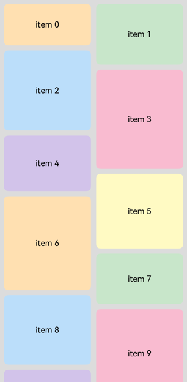
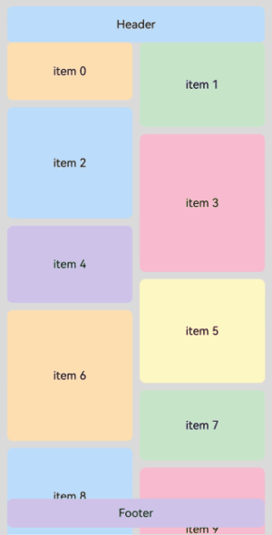

# LazyVWaterFlowLayout

<!--Kit: ArkUI-->
<!--Subsystem: ArkUI-->
<!--Owner: @rongShao-Z; @guozejun-->
<!--Designer: @guozejun-->
<!--Tester: @leiyuqian-->
<!--Adviser: @Brilliantry_Rui-->
<!-- md-trans-meta sourceCommit=b6f38d021a31abc28b1dd271b68098ebc074e7ab translatedAt=2026-08-04T12:13:12.244Z pushedAt=2026-08-10T02:28:19.824Z -->

The **LazyVWaterFlowLayout** component is used to implement a waterfall layout that supports lazy loading, suitable for displaying a large number of list items with varying heights, such as image walls and product lists. Through the lazy loading mechanism, this component only loads content in and near the visible area, reducing memory usage and rendering overhead, and improving scrolling smoothness. This component should be placed under a vertical [List](ts-container-list.md), [Scroll](ts-container-scroll.md), or [WaterFlow](ts-container-waterflow.md) component, and supports being used after being wrapped by [FlowItem](ts-container-flowitem.md), [LazyColumnLayout](ts-container-lazycolumnlayout.md), a custom component, or [NodeContainer](ts-basic-components-nodecontainer.md).

For more usage scenarios and complete examples of lazy-loading layouts, see [Creating Lazy Layouts](../../../ui/arkts-layout-development-create-lazy-layout.md).

> **NOTE**
>
> - The height of the **LazyVWaterFlowLayout** component adapts to content by default. You are advised not to set attributes that fix or constrain the vertical dimension of the component. Setting such attributes may cause display exceptions or scrolling failures. The attributes involved include [height](ts-universal-attributes-size.md#height), the **height** in [size](ts-universal-attributes-size.md#size), minHeight/maxHeight in [constraintSize](ts-universal-attributes-size.md#constraintsize), [aspectRatio](ts-universal-attributes-layout-constraints.md#aspectratio), [layoutWeight](ts-universal-attributes-size.md#layoutweight), and the scenario where [height](ts-universal-attributes-size.md#height15) takes a [LayoutPolicy](ts-universal-attributes-size.md#layoutpolicy15) value.
> - When the parent component sets the main axis dimension, **LazyVWaterFlowLayout** performs lazy loading based on the visible area of the parent component. When the parent component does not set the main axis dimension, **LazyVWaterFlowLayout** is stretched by its content, causing all child components to be loaded and laid out.
> - The lazy loading support conditions for this component under different parent components are as follows:
>   1. Under the **List** component, the **List** component's layout direction must be vertical (that is, the [listDirection](ts-container-list.md#listdirection) attribute is set to **Axis.Vertical**). Using this component in a non-vertical List will cause the app to crash. When the **List** has any one or more of the [lanes](ts-container-list.md#lanes9), [chainAnimation](ts-container-list.md#chainanimation), or [scrollSnapAlign](ts-container-list.md#scrollsnapalign10) attributes set, the lazy loading feature of this component becomes invalid.
>   2. Under the **Scroll** component, the **Scroll** component's layout direction must be vertical (that is, the [scrollable](ts-container-scroll.md#scrollable) attribute is set to ScrollDirection.Vertical). Using this component in a non-vertical **Scroll** will cause the app to crash.
>   3. Under the **WaterFlow** component, lazy loading is supported only when the **WaterFlow** component is in single-column mode or a single-column segment in segmented layout, and the [layoutDirection](ts-container-waterflow.md#layoutdirection) attribute is set to **FlexDirection.Column**. When the **WaterFlow** is in multi-column mode or the layout direction is **FlexDirection.Row** or **FlexDirection.RowReverse**, the lazy loading feature of this component becomes invalid. In addition, using this component under a **WaterFlow** component with the layout direction set to **FlexDirection.ColumnReverse** will cause display exceptions.
>   4. When used after being wrapped by **FlowItem**, **LazyColumnLayout**, a custom component, or **NodeContainer**, the lazy loading behavior depends on the configuration conditions of the upper-level scroll component (such as **WaterFlow**, **Scroll**, or **List**).
> - When lazy loading is in effect, this component only loads the child components within the visible area of the parent component, and preloads content half a screen above and below the visible area during idle time between frames.
> - The parent component here refers to the nearest upper-level scroll component of the current component. For specific meanings in other documents, refer to the corresponding content.

**Since:** 26.0.0

## Modules to Import

```ts
import { LazyVWaterFlowLayout } from '@kit.ArkUI';
```

## APIs

LazyVWaterFlowLayout()

Creates a vertical **LazyVWaterFlowLayout** component. This component should be placed under a vertical [List](ts-container-list.md), [Scroll](ts-container-scroll.md), or [WaterFlow](ts-container-waterflow.md) component, and supports being used after being wrapped by [FlowItem](ts-container-flowitem.md), [LazyColumnLayout](ts-container-lazycolumnlayout.md), a custom component, or [NodeContainer](ts-basic-components-nodecontainer.md). You are advised not to set the height, height constraint, or aspect ratio. Setting these may cause display exceptions.

**Since:** 26.0.0

**Atomic service API:** This API can be used in atomic services since API version 26.0.0.

**Model restriction:** This API can be used only in the stage model.

**System capability:** SystemCapability.ArkUI.ArkUI.Full

## Attributes

In addition to the [universal attributes](ts-component-general-attributes.md), the following attributes are supported.

### columnsTemplate

columnsTemplate(value: string | ItemFillPolicy | undefined)

Sets the number of columns, fixed column width, or minimum column width of the current **LazyVWaterFlowLayout**. If this attribute is not set, one column is used by default.

- When **value** is of the string type, you can set the number of columns, fixed column width, or minimum column width of the current **LazyVWaterFlowLayout**. Typical values and their meanings are as follows. For usage effects, see [Example 3](#example-3-setting-adaptive-column-count):

  1. **columnsTemplate('1fr 1fr 2fr')** divides the **LazyVWaterFlowLayout** into three columns, with the component width divided into four equal parts: the first column takes up one part, the second column takes up one part, and the third column takes up two parts.

  2. **columnsTemplate('repeat(auto-fit, track-size)')** sets the minimum column width to **track-size** and automatically calculates the number of columns and the actual column width.

  3. **columnsTemplate('repeat(auto-fill, track-size)')** sets the fixed column width to **track-size** and automatically calculates the number of columns.

  4. **columnsTemplate('repeat(auto-stretch, track-size)')** sets the fixed column width to **track-size**, uses [columnsGap](#columnsgap) as the minimum column spacing, and automatically calculates the number of columns and the actual column spacing.

  Here, **repeat**, **auto-fit**, **auto-fill**, and **auto-stretch** are keywords. **track-size** is the column width, which supports units including px, vp, %, or a valid number. The default unit is vp. **track-size** must include at least one valid column width.

  The **auto-fit** mode and **auto-stretch** mode support only one valid column width value for **track-size**, and in the **auto-stretch** mode, **track-size** supports only px, vp, and valid numbers, not %. The **auto-fill** mode supports one or more valid column widths, for example, **columnsTemplate('repeat(auto-fill, 20)')** and **columnsTemplate('repeat(auto-fill, 20 80px)')**.

- When **value** is of the **ItemFillPolicy** type, the number of columns is determined based on the [breakpoint type](../../../ui/arkts-layout-development-grid-layout.md#breakpoints) corresponding to the width of the **LazyVWaterFlowLayout** component. For example, when the **fillType** attribute of **ItemFillPolicy** is set to **PresetFillType.BREAKPOINT_DEFAULT**, two columns are displayed when the component width falls within the sm or smaller breakpoint interval, three columns when within the md breakpoint interval, and five columns when within the lg or larger breakpoint interval, with each column set to **1fr** (meaning each column takes up one equal portion of the available width).

- When **value** is set to **undefined**, the default value (one column) is restored.

**Since:** 26.0.0

**Atomic service API:** This API can be used in atomic services since API version 26.0.0.

**Model restriction:** This API can be used only in the stage model.

**System capability:** SystemCapability.ArkUI.ArkUI.Full

**Parameters**

| Name| Type  | Mandatory| Description                              |
| ------ | ------ | ---- | ---------------------------------- |
| value  | string \| [ItemFillPolicy](ts-types.md#itemfillpolicy22) \| undefined | Yes   | Number of columns, fixed column width, minimum column width value, or breakpoint fill policy of **LazyVWaterFlowLayout**. |

### columnsGap

columnsGap(value: LengthMetrics | undefined): T

Sets the gap between columns. The default value is **LengthMetrics.vp(0)**. If a value less than 0 is set, **LengthMetrics.vp(0)** is used. When used together with the **repeat(auto-stretch, track-size)** mode of [columnsTemplate](#columnstemplate), this value serves as the minimum column spacing, and the system automatically calculates the actual column gap and number of columns.

**Since:** 26.0.0

**Atomic service API:** This API can be used in atomic services since API version 26.0.0.

**Model restriction:** This API can be used only in the stage model.

**System capability:** SystemCapability.ArkUI.ArkUI.Full

**Parameters**

| Name| Type                        | Mandatory| Description                        |
| ------ | ---------------------------- | ---- | ---------------------------- |
| value  |  [LengthMetrics](../js-apis-arkui-graphics.md#lengthmetrics12) \| undefined | Yes   | Gap between columns.<br/>Default value: **LengthMetrics.vp**(0)<br/>Value range: [0, +∞)<br/>When set to a value less than 0, it is treated as **LengthMetrics.vp(0)**.<br/>When the method input parameter is **undefined**, it is restored to the default value (**LengthMetrics.vp(0)**). |

**Return value**

| Type| Description          |
| --- | -------------- |
| T | Current **LazyVWaterFlowLayout** component itself, used to support chained calls. |

### rowsGap

rowsGap(value: LengthMetrics | undefined): T

Sets the gap between rows. The default value is **LengthMetrics.vp(0)**. If a value less than 0 is set, **LengthMetrics.vp(0)** is used.

**Since:** 26.0.0

**Atomic service API:** This API can be used in atomic services since API version 26.0.0.

**Model restriction:** This API can be used only in the stage model.

**System capability:** SystemCapability.ArkUI.ArkUI.Full

**Parameters**

| Name| Type                        | Mandatory| Description                        |
| ------ | ---------------------------- | ---- | ---------------------------- |
| value  | [LengthMetrics](../js-apis-arkui-graphics.md#lengthmetrics12) \| undefined | Yes   | Gap between rows.<br/>Default value: **LengthMetrics.vp**(0)<br/>Value range: [0, +∞)<br/>If set to a value less than 0, **LengthMetrics.vp(0)** is used.<br/>If the method input parameter is **undefined**, the default value (**LengthMetrics.vp(0)**) is restored. |

**Return value**

| Type| Description          |
| --- | -------------- |
| T | Current **LazyVWaterFlowLayout** component itself, used to support chained calls. |

### header

header(builder: CustomBuilder | undefined): T

Sets the header component of the current **LazyVWaterFlowLayout**. If this API is not used, no header component is set by default. The sticky style of the header component takes effect only after being set through the [sticky](#sticky) attribute.

> **NOTE**
>
> The header component is located at the top area of the container, typically used to display titles, group descriptions, or other elements fixed in front of the content.
>
> When this component scrolls into the visible area with the scroll container, and the header sticky style is set through [sticky](#sticky), the header will stick to the top of the visible area of the scroll container.

**Since:** 26.0.0

**Atomic service API:** This API can be used in atomic services since API version 26.0.0.

**Model restriction:** This API can be used only in the stage model.

**System capability**: SystemCapability.ArkUI.ArkUI.Full

**Parameters**

| Name | Type                                                     | Mandatory | Description                                                         |
| ------ | -------------------------------------------------------- | ---- | ------------------------------------------------------------ |
| builder | [CustomBuilder](ts-types.md#custombuilder8) \| undefined | Yes   | Constructor of the header component.<br/>When the input parameter is **undefined**, no header component is set. If a header component already exists, it is also removed. |

**Return value**

| Type | Description           |
| --- | -------------- |
| T | Returns the current **LazyVWaterFlowLayout** component itself, used to support chained calls. |

### footer

footer(builder: CustomBuilder | undefined): T

Sets the footer component of the current **LazyVWaterFlowLayout**. If this API is not used, no footer component is set by default. The sticky style of the footer component takes effect only after being set through the [sticky](#sticky) attribute.

> **NOTE**
>
> The footer component is located at the bottom area of the container, typically used to display supplementary information, loading status, or other elements fixed behind the content.
>
> When this component scrolls into the visible area with the scroll container, and the footer sticky style is set through [sticky](#sticky), the footer will stick to the bottom of the visible area of the scroll container.

**Since:** 26.0.0

**Atomic service API:** This API can be used in atomic services since API version 26.0.0.

**Model restriction:** This API can be used only in the stage model.

**System capability:** SystemCapability.ArkUI.ArkUI.Full

**Parameters**

| Name| Type  | Mandatory| Description                                 |
| ------ | ------ | ---- | ------------------------------------- |
| builder | [CustomBuilder](ts-types.md#custombuilder8) \| undefined | Yes | Footer component constructor.<br/>When the input parameter is **undefined**, no footer component is set. If a footer component already exists, it will be removed. |

**Return value**

| Type| Description          |
| --- | -------------- |
| T | Current **LazyVWaterFlowLayout** component itself, used to support chained calls. |

### sticky

sticky(sticky: StickyStyle | undefined): T

Sets the sticky style of [header](#header) and [footer](#footer).

When this component scrolls into the visible area with the scroll container, and the optional **sticky** attribute is set for header stick-to-top or footer stick-to-bottom, the header will stick to the top of the visible area of the scroll container, and the footer will stick to the bottom of the visible area of the scroll container. If **sticky** is not set, the header component does not stick to the top and the footer component does not stick to the bottom by default.

> **NOTE**
>
> Due to floating-point calculation precision, gaps may appear during scrolling after **sticky** is set. You can use [pixelRound](ts-universal-attributes-pixelRoundForComponent.md#pixelround) to specify downward pixel rounding for the current component to resolve this issue.

**Since:** 26.0.0

**Atomic service API:** This API can be used in atomic services since API version 26.0.0.

**Model restriction:** This API can be used only in the stage model.

**System capability**: SystemCapability.ArkUI.ArkUI.Full

**Parameters**

| Name | Type                                                              | Mandatory | Description                                                         |
| ------ | ----------------------------------------------------------------- | ---- | ------------------------------------------------------------ |
| sticky | [StickyStyle](ts-container-list.md#stickystyle9) \| undefined | Yes   | Sticky style of the header component and footer component. The **sticky** attribute can be set to **StickyStyle.Header** (header component sticks to the top), **StickyStyle.Footer** (footer component sticks to the bottom), **StickyStyle.BOTH** (both header sticks to the top and footer sticks to the bottom), or **StickyStyle.None** (sticky style disabled).<br/>When the input parameter is **undefined**, the default value **StickyStyle.None** is restored.<br/>If this API is not used, the header component does not stick to the top and the footer component does not stick to the bottom by default. |

**Return value**

| Type | Description           |
| --- | -------------- |
| T | Returns the current **LazyVWaterFlowLayout** component itself, used to support chained calls. |

## Events

In addition to the [universal events](ts-component-general-events.md), the following events are supported.

### onVisibleIndexesChange

onVisibleIndexesChange(callback: OnVisibleIndexesChangeCallback | undefined): T

Sets the **onVisibleIndexesChange** callback. When the indexes of child components in the visible area of **LazyVWaterFlowLayout** change, the callback is triggered, returning the start index and end index of the child components in the visible area.

> **NOTE**
>
> When the parent component sets the main axis dimension, **LazyVWaterFlowLayout** performs lazy loading based on the visible area of the parent component. In this case, in the **onVisibleIndexesChange** callback, **start** returns the index of the child component at the start position of the current visible area, and **end** returns the index of the child component at the end position of the current visible area.
>
> When the parent component does not set the main axis dimension, **LazyVWaterFlowLayout** is stretched by its content, causing all child components to be loaded and laid out. In this case, in the **onVisibleIndexesChange** callback, **start** returns 0, and **end** returns the index of the last child component in the data source.
>
> When the lazy loading feature of this component becomes invalid due to the parent component configuration conditions mentioned above, all child components are loaded and laid out. In this case, in the **onVisibleIndexesChange** callback, **start** returns 0, and **end** returns the index of the last child component in the data source.
>
> The parent component here refers to the nearest **List**, **Scroll**, or **WaterFlow** component found upward from the current component. **FlowItem**, **LazyColumnLayout**, custom components, and **NodeContainer** serve only as intermediate wrapping layers and are not considered parent components here. For specific meanings in other documents, refer to the corresponding content.

**Since:** 26.0.0

**Atomic service API:** This API can be used in atomic services since API version 26.0.0.

**Model restriction:** This API can be used only in the stage model.

**System capability:** SystemCapability.ArkUI.ArkUI.Full

**Parameters** 

| Name| Type  | Mandatory| Description                                 |
| ------ | ------ | ---- | ------------------------------------- |
| callback  | [OnVisibleIndexesChangeCallback](ts-container-scrollable-common.md#onvisibleindexeschangecallback) \| undefined | Yes   | Callback invoked when the index of a child component in the visible area changes.<br/>When the method input parameter is **undefined**, the listening is canceled. |

**Return value**

| Type | Description           |
| --- | -------------- |
| T | Returns the current **LazyVWaterFlowLayout** component itself, used to support chained calls. |

## Examples

### Example 1: Implementing Lazy-Loading Waterfall Layout

This example shows how to use the [Scroll](ts-container-scroll.md) and **LazyVWaterFlowLayout** components to implement the lazy-loading waterfall layout.

**MyDataSource** implements the **LazyForEach** data source API [IDataSource](ts-rendering-control-lazyforeach.md#idatasource), which is used to provide child components for **LazyVWaterFlowLayout** through **LazyForEach**.

Since API version 26.0.0, the **LazyVWaterFlowLayout** component is supported.

<!--code_no_check-->

```ts
import { LengthMetrics, LazyVWaterFlowLayout, LazyVWaterFlowLayoutAttribute } from '@kit.ArkUI';
// MyDataSource is a custom data source class that implements the IDataSource interface required by LazyForEach.
import { MyDataSource } from './MyDataSource';

@Entry
@Component
struct LazyVWaterFlowLayoutSample1 {
  private arr : MyDataSource<number> = new MyDataSource<number>();

  // Return a random height.
  private itemHeight(index: number): number {
    return 80 + (index * 37 % 121);
  }

  private itemColor(index: number): string {
    const colors: string[] = ['#FFE0B2', '#C8E6C9', '#BBDEFB', '#F8BBD0', '#D1C4E9', '#FFF9C4'];
    return colors[index % colors.length];
  }

  build() {
    Column() {
      Scroll() {
        LazyVWaterFlowLayout() {
          LazyForEach(this.arr, (item: number) => {
            Column() {
              Text('item ' + item.toString())
                .fontSize(16)
                .fontColor(Color.Black)
            }
            .height(this.itemHeight(item))
            .width('100%')
            .borderRadius(8)
            .backgroundColor(this.itemColor(item))
            .justifyContent(FlexAlign.Center)
          })
        }
        .columnsTemplate('1fr 1fr')
        .rowsGap(LengthMetrics.vp(10))
        .columnsGap(LengthMetrics.vp(10))
        .onVisibleIndexesChange((start: number, end: number) => {
          console.info('LazyVWaterFlowLayout visible indexes: start: ' + start + ', end: ' + end);
          // Scroll listener: Load more data when the scroll is about to reach the bottom.
          if (end + 20 >= this.arr.totalCount()) {
            // Add 100 new items to the data source.
            let currentCount = this.arr.totalCount();
            for (let i = currentCount; i < currentCount + 100; i++) {
              this.arr.pushData(i);
            }
          }
        })
      }
      .padding(10)
      .layoutWeight(1)
    }
    .width('100%')
    .height('100%')
    .backgroundColor('#DCDCDC')
  }

  aboutToAppear(): void {
    for (let i = 0; i < 100; i++) {
      this.arr.pushData(i);
    }
  }
}
```

<!--code_no_check-->

```ts
// MyDataSource.ets
export class BasicDataSource<T> implements IDataSource {
  private listeners: DataChangeListener[] = [];
  protected dataArray: T[] = [];

  public totalCount(): number {
    return this.dataArray.length;
  }

  public getData(index: number): T {
    return this.dataArray[index];
  }

  registerDataChangeListener(listener: DataChangeListener): void {
    if (this.listeners.indexOf(listener) < 0) {
      console.info('add listener');
      this.listeners.push(listener);
    }
  }

  unregisterDataChangeListener(listener: DataChangeListener): void {
    const pos = this.listeners.indexOf(listener);
    if (pos >= 0) {
      console.info('remove listener');
      this.listeners.splice(pos, 1);
    }
  }

  notifyDataReload(): void {
    this.listeners.forEach(listener => {
      listener.onDataReloaded();
    });
  }

  notifyDataAdd(index: number): void {
    this.listeners.forEach(listener => {
      listener.onDataAdd(index);
    });
  }

  notifyDataChange(index: number): void {
    this.listeners.forEach(listener => {
      listener.onDataChange(index);
    });
  }

  notifyDataDelete(index: number): void {
    this.listeners.forEach(listener => {
      listener.onDataDelete(index);
    });
  }

  notifyDataMove(from: number, to: number): void {
    this.listeners.forEach(listener => {
      listener.onDataMove(from, to);
    });
  }

  notifyDatasetChange(operations: DataOperation[]): void {
    this.listeners.forEach(listener => {
      listener.onDatasetChange(operations);
    });
  }
}

export class MyDataSource<T> extends BasicDataSource<T> {
  public shiftData(): void {
    this.dataArray.shift();
    this.notifyDataDelete(0);
  }
  public unshiftData(data: T): void {
    this.dataArray.unshift(data);
    this.notifyDataAdd(0);
  }
  public pushData(data: T): void {
    this.dataArray.push(data);
    this.notifyDataAdd(this.dataArray.length - 1);
  }

  public popData(): void {
    const deleteIndex = this.dataArray.length - 1;
    this.dataArray.pop();
    this.notifyDataDelete(deleteIndex);
  }

  public clearData(): void {
    this.dataArray = [];
    this.notifyDataReload();
  }
}
```



### Example 2: Setting Header or Footer Component and Sticky Styles

This example nests **LazyVWaterFlowLayout** inside [Scroll](ts-container-scroll.md), and implements sticky styles at the top and bottom of the waterfall layout through [header](#header), [footer](#footer), and [sticky](#sticky). During scrolling, the header sticks to the top of the visible area, and the footer sticks to the bottom of the visible area.

Since API version 26.0.0, the header, footer, and sticky attributes are supported.

<!--code_no_check-->

```ts
import { LengthMetrics, LazyVWaterFlowLayout, LazyVWaterFlowLayoutAttribute, StickyStyle } from '@kit.ArkUI';
// MyDataSource is a custom data source class that implements the IDataSource interface required by LazyForEach.
import { MyDataSource } from './MyDataSource';

@Entry
@Component
struct LazyVWaterFlowLayoutStickyDemo {
  private arr : MyDataSource<number> = new MyDataSource<number>();

  // Return a random height.
  private itemHeight(index: number): number {
    return 80 + (index * 37 % 121);
  }

  private itemColor(index: number): string {
    const colors: string[] = ['#FFE0B2', '#C8E6C9', '#BBDEFB', '#F8BBD0', '#D1C4E9', '#FFF9C4'];
    return colors[index % colors.length];
  }

  // Build the header component.
  @Builder
  HeaderBuilder() {
    Column() {
      Text('Header')
        .fontSize(16)
        .fontColor(Color.Black)
    }
    .height(50)
    .width('100%')
    .borderRadius(8)
    .backgroundColor('#BBDEFB')
    .justifyContent(FlexAlign.Center)
  }

  @Builder
  FooterBuilder() {
    Column() {
      Text('Footer')
        .fontSize(16)
        .fontColor(Color.Black)
    }
    .height(40)
    .width('100%')
    .borderRadius(8)
    .backgroundColor('#D1C4E9')
    .justifyContent(FlexAlign.Center)
  }

  build() {
    Column() {
      Scroll() {
        LazyVWaterFlowLayout() {
          LazyForEach(this.arr, (item: number) => {
            Column() {
              Text('item ' + item.toString())
                .fontSize(16)
                .fontColor(Color.Black)
            }
            .height(this.itemHeight(item))
            .width('100%')
            .borderRadius(8)
            .backgroundColor(this.itemColor(item))
            .justifyContent(FlexAlign.Center)
          })
        }
        .columnsTemplate('1fr 1fr')
        .rowsGap(LengthMetrics.vp(10))
        .columnsGap(LengthMetrics.vp(10))
        .header(this.HeaderBuilder)
        .footer(this.FooterBuilder)
        // Set both the header and footer to sticky.
        .sticky(StickyStyle.BOTH)
        .onVisibleIndexesChange((start: number, end: number) => {
          console.info('LazyVWaterFlowLayout visible indexes: start: ' + start + ', end: ' + end);
          // Scroll listener: load more data in advance when about to reach the bottom.
          if (end + 20 >= this.arr.totalCount()) {
            // Add 100 new data items to the data source.
            let currentCount = this.arr.totalCount();
            for (let i = currentCount; i < currentCount + 100; i++) {
              this.arr.pushData(i);
            }
          }
        })
      }
      .padding(10)
      .layoutWeight(1)
    }
    .width('100%')
    .height('100%')
    .backgroundColor('#DCDCDC')
  }

  aboutToAppear(): void {
    for (let i = 0; i < 100; i++) {
      this.arr.pushData(i);
    }
  }
}
```



### Example 3: Setting Adaptive Column Count

This example uses [columnsTemplate](#columnstemplate) to set **repeat(auto-fill, track-size)** and **ItemFillPolicy**, implementing adaptive column count for **LazyVWaterFlowLayout**.

Since API version 26.0.0, the [columnsTemplate](#columnstemplate) interface is supported.

<!--code_no_check-->

```ts
import {
  LengthMetrics,
  LazyColumnLayout,
  LazyColumnLayoutAttribute,
  LazyVWaterFlowLayout,
  LazyVWaterFlowLayoutAttribute,
} from '@kit.ArkUI';
// MyDataSource is a custom data source class that implements the IDataSource interface required by LazyForEach.
import { MyDataSource } from './MyDataSource';

@Entry
@Component
struct LazyVWaterFlowLayoutColumnsTemplateDemo {
  private autoFillData: MyDataSource<number> = new MyDataSource<number>();
  private breakpointData: MyDataSource<number> = new MyDataSource<number>();
  private breakpointPolicy: ItemFillPolicy = { fillType: PresetFillType.BREAKPOINT_DEFAULT };

  aboutToAppear(): void {
    // Initialize a fixed amount of data without scroll-to-bottom loading.
    for (let i = 0; i < 18; i++) {
      this.autoFillData.pushData(i);
      this.breakpointData.pushData(i);
    }
  }

  private itemHeight(index: number): number {
    return 80 + (index * 37 % 121)
  }

  private itemColor(index: number): string {
    const colors: string[] = ['#CDE7FF', '#D8F5D0', '#FFE6A8', '#F8D7DA', '#E4D7FF', '#D2F4EA']
    return colors[index % colors.length]
  }

  @Builder
  ModeTitle(title: string, description: string) {
    Column() {
      Text(title)
        .fontSize(16)
        .fontWeight(FontWeight.Medium)
        .fontColor('#182230')
      Text(description)
        .fontSize(12)
        .fontColor('#667085')
    }
    .alignItems(HorizontalAlign.Start)
    .width('100%')
    .padding({ bottom: 8 })
  }

  @Builder
  AutoFillHeader() {
    this.ModeTitle('repeat(auto-fill, 96vp)',
      'Fixed column width of 96vp, LazyVWaterFlowLayout automatically calculates the number of waterfall columns based on available width.')
  }

  @Builder
  BreakpointHeader() {
    this.ModeTitle('ItemFillPolicy: BREAKPOINT_DEFAULT',
      'Determine the number of columns based on the breakpoint type corresponding to the component width: 2 columns for sm and below, 3 columns for md, and 5 columns for lg and above.')
  }

  @Builder
  WaterFlowItemBuilder(item: number) {
    Text('item ' + item)
      .height(this.itemHeight(item))
      .width('100%')
      .borderRadius(8)
      .backgroundColor(this.itemColor(item))
      .fontColor('#182230')
      .textAlign(TextAlign.Center)
  }

  build() {
    Column() {
      Scroll() {
        LazyColumnLayout() {
          // repeat(auto-fill, 96vp): Fixed column width of 96vp, automatically calculate the number of waterfall columns based on available width.
          LazyVWaterFlowLayout() {
            LazyForEach(this.autoFillData, (item: number) => {
              this.WaterFlowItemBuilder(item)
            })
          }
          .columnsTemplate('repeat(auto-fill, 96)')
          .rowsGap(LengthMetrics.vp(8))
          .columnsGap(LengthMetrics.vp(8))
          .header(this.AutoFillHeader)
          .padding(8)
          .backgroundColor('#F7F9FC')
          .border({ width: 1, color: '#D0D5DD' })
          .borderRadius(8)

          // ItemFillPolicy: Determine the number of columns based on the breakpoint type corresponding to the component width.
          LazyVWaterFlowLayout() {
            LazyForEach(this.breakpointData, (item: number) => {
              this.WaterFlowItemBuilder(item)
            })
          }
          .columnsTemplate(this.breakpointPolicy)
          .rowsGap(LengthMetrics.vp(8))
          .columnsGap(LengthMetrics.vp(8))
          .header(this.BreakpointHeader)
          .padding(8)
          .backgroundColor('#F7F9FC')
          .border({ width: 1, color: '#D0D5DD' })
          .borderRadius(8)
        }
        .space(LengthMetrics.vp(16))
        .width('100%')
      }
      .width('100%')
      .scrollable(ScrollDirection.Vertical)
      .layoutWeight(1)
    }
    .width('100%')
    .height('100%')
    .padding({ top: 48, left: 12, right: 12, bottom: 12 })
  }
}
```


<!--no_check-->