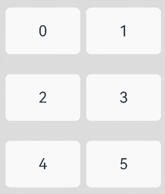
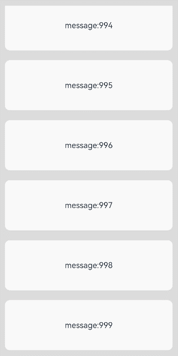
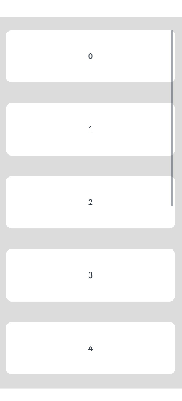
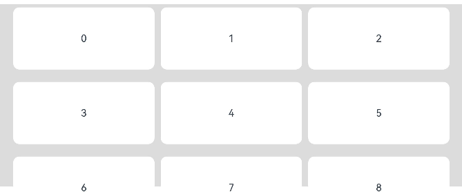
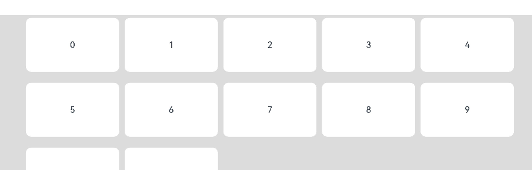

# List

<!--Kit: ArkUI-->
<!--Subsystem: ArkUI-->
<!--Owner: @yylong-->
<!--Designer: @yylong-->
<!--Tester: @liuzhenshuo-->
<!--Adviser: @Brilliantry_Rui-->

The **List** component provides a list container that presents a series of list items arranged in a column with the same width. It supports presentations of the same type of data in a multiple and coherent row style, for example, images or text.

Lazy loading of List loads the child components in the visible area as required. Compared with full loading, lazy loading can improve the app startup speed and reduce the memory usage. The lazy loading capabilities vary when the list is used together with [ForEach ](../../../ui/rendering-control/arkts-rendering-control-foreach.md), [LazyForEach ](../../../ui/rendering-control/arkts-rendering-control-lazyforeach.md), or [Repeat ](../../../ui/rendering-control/arkts-new-rendering-control-repeat.md).

 - When the list is used together with ForEach, all subnodes are created at a time. The nodes within the screen range are laid out and rendered when needed. When a user swipes, the nodes that are out of the screen range are not removed from the tree, and the nodes that are within the screen range are laid out and rendered.

 - When the list is used together with LazyForEach, all nodes within the screen range are created, laid out, and rendered at a time. When a user swipes, the nodes that are out of the screen range are removed from the tree, and the nodes that are within the screen range are created, laid out, and rendered.

 - When the list is used together with Repeat with [virtualScroll](./ts-rendering-control-repeat.md#virtualscroll), the lazy loading behavior is the same as that of LazyForEach. When the list is used together with Repeat without virtualScroll, the lazy loading behavior is the same as that of ForEach.

If a scrollable component is nested in a list component, the scrolling directions are the same, and the main axis size is not set for the list component, the list component loads all child components. As a result, lazy loading does not take effect. In this scenario, you are advised to use the [ListItemGroup](ts-container-listitemgroup.md) component to optimize the performance.

The preloading of the list component refers to that, in addition to loading child components in the visible area, some child components that are not displayed are also loaded in advance. Preloading can reduce frame loss during scrolling and improve smoothness. Preloading takes effect only when lazy loading is used. You can set the number of preloaded subcomponents for the list component using [cachedCount](#cachedcount). By default, one screen of subcomponents above and below the visible area are preloaded (a maximum of 16 rows of subcomponents can be preloaded). When the list component is used together with [ForEach ](../../../ui/rendering-control/arkts-rendering-control-foreach.md), [LazyForEach ](../../../ui/rendering-control/arkts-rendering-control-lazyforeach.md), or [Repeat ](../../../ui/rendering-control/arkts-new-rendering-control-repeat.md), the preloading capability varies.

 - When the list component is used together with ForEach and cachedCount is set, in addition to child components in the visible area, child components within the range of cachedCount outside the visible area are pre-arranged in idle timeslots.

 - When the list component is used together with LazyForEach and cachedCount is set, in addition to child components in the visible area, child components within the range of cachedCount outside the visible area are pre-created and pre-arranged in idle timeslots.

 - When the list component is used together with Repeat with [virtualScroll](./ts-rendering-control-repeat.md#virtualscroll), the preloading behavior is the same as that of LazyForEach. When the list component is used together with Repeat without virtualScroll, the preloading behavior is the same as that of ForEach.

> **NOTE**
>
> This component is supported since API version 7. Updates will be marked with a superscript to indicate their earliest API version.
>
> The component has been bound with gestures to implement functions such as following the finger. For details about how to add custom gestures, see [Enhanced Gesture Interception](ts-gesture-blocking-enhancement.md).

## Child Components

Only the [ListItem](ts-container-listitem.md) and [ListItemGroup](ts-container-listitemgroup.md) child components and custom components are supported. When a custom component is used in the List component, you are advised to use ListItem or ListItemGroup as the top-level component of the custom component. You are not advised to set attributes and event methods for the custom component.
Child components can be dynamically generated using rendering control types [if/else](../../../ui/rendering-control/arkts-rendering-control-ifelse.md), [ForEach](../../../ui/rendering-control/arkts-rendering-control-foreach.md), [LazyForEach](../../../ui/rendering-control/arkts-rendering-control-lazyforeach.md), and [Repeat](../../../ui/rendering-control/arkts-new-rendering-control-repeat.md). LazyForEach or Repeat is recommended to optimize performance.

> **NOTE**
>
> If frame freezing occurs when you process a large number of child components, consider using lazy loading, list item caching, dynamic preloading, component reuse, and layout optimization. For best practices, see [Optimizing Frame Loss for Long List Loading](https://developer.huawei.com/consumer/en/doc/best-practices/bpta-best-practices-long-list).
>
> From API version 21, the maximum width and height of a single child component of List are 16777216 px. From API version 20 or earlier, the maximum width and height of a single child component of List are 1000000px. If a child component exceeds the maximum width or height, scrolling or display exceptions may occur.
>
> Below are the rules for calculating the indexes of the child components of **List**:
>
> - The index increases in ascending order of child components.
>
> - In the **if/else** statement, only the child components for which the condition evaluates to true participate in the index calculation.
>
> - In the **ForEach**, **LazyForEach**, or **Repeat** statement, the indexes of all expanded subnodes are calculated.
>
> - After the [if/else](../../../ui/rendering-control/arkts-rendering-control-ifelse.md), [ForEach](../../../ui/rendering-control/arkts-rendering-control-foreach.md), [LazyForEach](../../../ui/rendering-control/arkts-rendering-control-lazyforeach.md), and [Repeat](../../../ui/rendering-control/arkts-new-rendering-control-repeat.md) statements are changed, the index of child nodes is updated.
>
> - Each **ListItemGroup** component is taken as a whole and assigned an index, and the indexes of the list items within are not included in the index calculation.
>
> - Child components of **List** whose **visibility** attribute is set to **Hidden** or **None** are included in the index calculation.

## APIs

List(options?: [ListOptions](#listoptions18))

Creates a list container.

**Widget capability**: This API can be used in ArkTS widgets since API version 9.

**Atomic service API**: This API can be used in atomic services since API version 11.

**System capability**: SystemCapability.ArkUI.ArkUI.Full

**Parameters**

| Name | Type| Mandatory| Description|
| ------ | ---- | ---- | ---- |
| options    | [ListOptions](#listoptions18)  | No  | Options of the **List** component.|

## ListOptions<sup>18+</sup>

Defines the options of the **List** component.

> **NOTE**
>
> To standardize anonymous object definitions, the element definitions here have been revised in API version 18. While historical version information is preserved for anonymous objects, there may be cases where the outer element's @since version number is higher than inner elements'. This does not affect interface usability.

**Widget capability**: This API can be used in ArkTS widgets since API version 18.

**Atomic service API**: This API can be used in atomic services since API version 18.

**System capability**: SystemCapability.ArkUI.ArkUI.Full

| Name      | Type                                   | Read-Only| Optional| Description                                                    |
| ------------ | ------------------------------------------- | ---- | -- | ------------------------------------------------------------ |
| initialIndex<sup>7+</sup> | number | No| Yes| Index of the item to be displayed at the start when the list is initially loaded.<br>Default value: **0**<br>**NOTE**<br>If the set value is a negative number or is greater than the index of the last item in the list, the value is invalid. In this case, the default value will be used.<br>From API version 14, if scrollToIndex or scrollEdge without animation in the Scroller controller is called before the first layout after the List component is created (for example, in the onAttach event of the List component), the value of initialIndex will be overwritten.<br>After initialIndex is set, the list starts layout from the child component corresponding to initialIndex. The child components before initialIndex are not involved in layout and the accurate size cannot be calculated. Therefore, the total scrolling offset of the list obtained through the [currentOffset](ts-container-scroll.md#currentoffset) API is estimated and may be inaccurate. You can set [childrenMainSize](#childrenmainsize12) to ensure the accuracy of the total scrolling offset of the list.<br>**Widget capability**: This API can be used in ArkTS widgets since API version 9.<br>**Atomic service API**: This API can be used in atomic services since API version 11.|
| space<sup>7+</sup>        | number \| string                  | No  | Yes| Spacing between list items along the main axis.<br>Default value: **0**<br>If the parameter type is number, the unit is vp.<br>**NOTE**<br>If this parameter is set to a negative number or a value greater than or equal to the length of the list content area, the default value is used.<br>If this parameter is set to a value less than the width of the list divider, the width of the list divider is used as the spacing.<br> Child components of **List** whose **visibility** attribute is set to **None** are not displayed, but the spacing above and below them still takes effect.<br>**Widget capability**: This API can be used in ArkTS widgets since API version 9.<br>**Atomic service API**: This API can be used in atomic services since API version 11.|
| scroller<sup>7+</sup>      | [Scroller](ts-container-scroll.md#scroller) | No  | Yes| Scroller, After being bound to a list, it can be used to control the scrolling of the list.<br>**NOTE**<br>Do not bind the same scroll control object to other scrollable components, such as [ArcList](ts-container-arclist.md), [List](ts-container-list.md), [Grid](ts-container-grid.md), [Scroll](ts-container-scroll.md), and [WaterFlow](ts-container-waterflow.md).<br>**Widget capability**: This API can be used in ArkTS widgets since API version 9.<br>**Atomic service API**: This API can be used in atomic services since API version 11.|

## Attributes

In addition to [universal attributes](ts-component-general-attributes.md) and [scrollable component common attributes](ts-container-scrollable-common.md#attributes), the following attributes are also supported.

> **NOTE**
>
> The default value of the universal attribute [clip](ts-universal-attributes-sharp-clipping.md) is **true** for the **List** component.

### listDirection

listDirection(value: Axis)

Sets the direction in which the list items are arranged.

**Widget capability**: This API can be used in ArkTS widgets since API version 9.

**Atomic service API**: This API can be used in atomic services since API version 11.

**System capability**: SystemCapability.ArkUI.ArkUI.Full

**Parameters**

| Name| Type                             | Mandatory| Description                                      |
| ------ | --------------------------------- | ---- | ------------------------------------------ |
| value  | [Axis](ts-appendix-enums.md#axis) | Yes  | Direction in which the list items are arranged.<br>Default value: **Axis.Vertical**|

### divider

divider(value: [ListDividerOptions](#listdivideroptions18) | null)

Sets the style of the divider for the list items. By default, there is no divider.

The divider is drawn between list items along the main axis, and not above the first list item and below the last list item.

In multi-column mode, the start margin of the divider between ListItems is calculated from the start edge of the cross axis of each column. In single-column mode, the start margin of the divider between ListItems is calculated from the start edge of the cross axis of List.

When a list item has [polymorphic styles](ts-universal-attributes-polymorphic-style.md) applied, the dividers above and below the pressed child component are not rendered.

**Widget capability**: This API can be used in ArkTS widgets since API version 9.

**Atomic service API**: This API can be used in atomic services since API version 11.

**System capability**: SystemCapability.ArkUI.ArkUI.Full

**Parameters**

| Name| Type                                                        | Mandatory| Description                                                        |
| ------ | ------------------------------------------------------------ | ---- | ------------------------------------------------------------ |
| value  | [ListDividerOptions](#listdivideroptions18) \| null | Yes  | Style of the divider for the list items.<br>Default value: **null**|

### scrollBar

scrollBar(value: BarState)

Sets the scrollbar state.

**Widget capability**: This API can be used in ArkTS widgets since API version 9.

**Atomic service API**: This API can be used in atomic services since API version 11.

**System capability**: SystemCapability.ArkUI.ArkUI.Full

**Parameters**

| Name| Type                                     | Mandatory| Description                                                        |
| ------ | ----------------------------------------- | ---- | ------------------------------------------------------------ |
| value  | [BarState](ts-appendix-enums.md#barstate) | Yes  | Scrollbar state.<br>Default value: BarState.Off for API version 9 or earlier, and BarState.Auto for API version 10 or later.|

### cachedCount

cachedCount(value: number)

Number of ListItem or ListItemGroup elements to be preloaded. In lazy loading scenarios, only the ListItem elements above and below the List display area are preloaded. In non-lazy loading scenarios, all elements are loaded. For both lazy and non-lazy loading, only the content within the list display area plus the content equivalent to **cachedCount** outside the display area is laid out. <!--Del-->For details, see [Minimizing White Blocks During Swiping](../../../performance/arkts-performance-improvement-recommendation.md#minimizing-white-blocks-during-swiping).<!--DelEnd-->

When **cachedCount** is set for a list, the system preloads and lays out the **cachedCount**-specified number of rows of list items both above and below the currently visible area of the list. When calculating the number of rows for list items, the system takes into account the number of rows from the list items within a list item group. If a list item group does not contain any list items, then the entire list item group is counted as one row.

When a list is nested with **LazyForEach**, and within **LazyForEach** there is a list item group, **LazyForEach** will create **cachedCount**-specified number of list item groups both above and below the currently visible area of the list.

**Widget capability**: This API can be used in ArkTS widgets since API version 9.

**Atomic service API**: This API can be used in atomic services since API version 11.

**System capability**: SystemCapability.ArkUI.ArkUI.Full

**Parameters**

| Name| Type  | Mandatory| Description                                                        |
| ------ | ------ | ---- | ------------------------------------------------------------ |
| value  | number | Yes  | Number of list items or list item groups to be preloaded (cached).<br>Default value: number of nodes visible on the screen, with the maximum value of 16<br>Value range: [0, +∞)|

### cachedCount<sup>14+</sup>

cachedCount(count: number, show: boolean)

Sets the number of list items or list item groups to be cached (preloaded) and specifies whether to display the preloaded nodes.

When **cachedCount** is set for the list, the system preloads and lays out the **cachedCount**-specified number of rows of list items both above and below the currently visible area of the list. When calculating the number of rows for list items, the system takes into account the number of rows from the list items within a list item group. If a list item group does not contain any list items, then the entire list item group is counted as one row. This attribute can be combined with the [clip](ts-universal-attributes-sharp-clipping.md#clip12) or [content clipping](ts-container-scrollable-common.md#clipcontent14) attributes to display the preloaded nodes.

> **NOTE**
>
> You are advised to set cachedCount to n/2 (n indicates the number of list items displayed on one screen). You also need to consider other factors to balance the experience and memory usage. For best practices, see [Cache List Items](https://developer.huawei.com/consumer/en/doc/best-practices/bpta-best-practices-long-list#section11667144010222).


**Widget capability**: This API can be used in ArkTS widgets since API version 14.

**Atomic service API**: This API can be used in atomic services since API version 14.

**System capability**: SystemCapability.ArkUI.ArkUI.Full

**Parameters**

| Name| Type  | Mandatory| Description                                  |
| ------ | ------ | ---- | -------------------------------------- |
| count  | number | Yes  | Number of list items to be preloaded.<br>Default value: number of nodes visible on the screen, with the maximum value of 16<br>Value range: [0, +∞)|
| show  | boolean | Yes  | Whether to display the preloaded list items. If this parameter is set to true, the preloaded ListItem is displayed. If this parameter is set to false, the preloaded ListItem is not displayed.<br> Default value: **false**|

### cachedCount<sup>22+</sup>

cachedCount(count: number | CacheCountInfo, show: boolean)

Sets the number of list items or list item groups to be cached (preloaded) and specifies whether to display the preloaded nodes.

If the first parameter of the cachedCount attribute is of the number type, count rows of list items are preloaded and laid out above and below the display area in the idle timeslot between frames.

If the first parameter of the cachedCount attribute is of the CacheCountInfo type, when the number of cached rows is less than CacheCountInfo.minCount, the rows are preloaded and laid out in the idle timeslot between frames. When the number of cached rows is greater than CacheCountInfo.maxCount, the nodes that exceed the range are destroyed or reused. When the UI is idle (no animation or user operation), CacheCountInfo.maxCount lines of ListItem are preloaded above and below the display area.

When calculating the number of ListItem rows, the number of ListItem rows in the ListItemGroup is calculated. If a list item group does not contain any list items, then the entire list item group is counted as one row. This attribute can be combined with the [clip](ts-universal-attributes-sharp-clipping.md#clip12) or [clipContent](ts-container-scrollable-common.md#clipcontent14) attributes to display the preloaded nodes.

Default behavior: The count parameter is of the number type by default. The value is set based on the number of nodes displayed on the screen. The maximum value is 16. Preloaded ListItems are not involved in drawing by default.

> **NOTE**
>
> You are advised to set cachedCount to n/2 (n indicates the number of list items displayed on one screen). You also need to consider other factors to balance the experience and memory usage. From API version 22 onwards, the maximum and minimum number of cached nodes can be set. You can set the maximum number of cached nodes to a larger value, for example, twice the minimum number of cached nodes. Nodes are created during the idle time of the UI thread, reducing the number of nodes created during preloading and scrolling, improving the scrolling smoothness. For details about the best practice, see [Optimizing the Frame Loss Caused by Slow Loading of Long Lists - Caching List Items](https://developer.huawei.com/consumer/cn/doc/best-practices/bpta-best-practices-long-list#section11667144010222).


**Widget capability**: This API can be used in ArkTS widgets since API version 22.

**Atomic service API**: This API can be used in atomic services since API version 22.

**System capability**: SystemCapability.ArkUI.ArkUI.Full

**Parameters**

| Name| Type  | Mandatory| Description                                  |
| ------ | ------ | ---- | -------------------------------------- |
| count  | number \| [CacheCountInfo](ts-types.md#cachecountinfo22) | Yes  | Number of preloaded ListItems.<br>Value range: [0, +∞)<br>If the parameter type is CacheCountInfo, the parameter indicates the maximum and minimum pre-loaded range.|
| show  | boolean | Yes  | Whether to display the preloaded list items.<br>true: The preloaded ListItem is displayed.<br>false: The preloaded ListItem is not displayed.|

### edgeEffect

edgeEffect(value: EdgeEffect, options?: EdgeEffectOptions)

Sets the effect used when the scroll boundary is reached.

> **NOTE**
>
> By default, this component can produce a bounce effect only when there is more than one screen of content. To enable the spring effect, set options of edgeEffect to { alwaysEnabled: true }.

**Widget capability**: This API can be used in ArkTS widgets since API version 9.

**Atomic service API**: This API can be used in atomic services since API version 11.

**System capability**: SystemCapability.ArkUI.ArkUI.Full

**Parameters**

| Name               | Type                                                        | Mandatory| Description                                                        |
| --------------------- | ------------------------------------------------------------ | ---- | ------------------------------------------------------------ |
| value                 | [EdgeEffect](ts-appendix-enums.md#edgeeffect)                | Yes  | Effect used when the scroll boundary is reached. The spring and shadow effects are supported.<br>Default value: **EdgeEffect.Spring**|
| options<sup>11+</sup> | [EdgeEffectOptions](ts-container-scrollable-common.md#edgeeffectoptions11) | No  | Whether to enable the scroll effect when the component content is smaller than the component itself. The value **{ alwaysEnabled: true }** means to enable the scroll effect, and **{ alwaysEnabled: false }** means the opposite.<br>Default value: **{ alwaysEnabled: false }**|

### chainAnimation

chainAnimation(value: boolean)

Whether to enable the chain linkage effect for the current List component.


> **NOTE**
>
> - During scrolling, the list item being actively dragged by the user's finger is considered the active object, while adjacent items are driven objects. The active object triggers a physics-based spring animation that affects the driven objects.
> - The driving effect of the chain linkage effect is reflected in the spacing between ListItems. The spacing in the static state can be set by using the space parameter of the List component. If the space parameter is not set and the chain linkage effect is enabled, the spacing is 20 vp by default.
> - After the chain linkage effect is enabled, the divider of the List component is not displayed.
> - The chain linkage effect takes effect only when the List component is in single-column mode and the edge effect is of the EdgeEffect.Spring type.

**Widget capability**: This API can be used in ArkTS widgets since API version 9.

**Atomic service API**: This API can be used in atomic services since API version 11.

**System capability**: SystemCapability.ArkUI.ArkUI.Full

**Parameters**

| Name| Type   | Mandatory| Description                                                        |
| ------ | ------- | ---- | ------------------------------------------------------------ |
| value  | boolean | Yes  | Whether to enable chained animations.<br>**false** (default): Chained animations are disabled. **true**: Chained animations are enabled.|

### multiSelectable<sup>8+</sup>

multiSelectable(value: boolean)

Sets whether to enable multiselect.

**Widget capability**: This API can be used in ArkTS widgets since API version 9.

**Atomic service API**: This API can be used in atomic services since API version 11.

**System capability**: SystemCapability.ArkUI.ArkUI.Full

**Parameters**

| Name| Type   | Mandatory| Description                                                        |
| ------ | ------- | ---- | ------------------------------------------------------------ |
| value  | boolean | Yes  | Whether to enable multiselect.<br>**false** (default): Multiselect is disabled. **true**: Multiselect is enabled.|

### lanes<sup>9+</sup>

lanes(value: number | LengthConstrain, gutter?: Dimension)

Sets the number of columns or rows in the list. If the value is set to the **gutter** type, it indicates the gap between columns. It takes effect when the number of columns is greater than 1.

The rules are as follows:

- If value is of the number type, the number of columns or rows is specified. The column width is obtained by dividing the cross-axis size of the List component by the number of columns.
- If value is of the LengthConstrain type, the minimum and maximum number of columns or rows are specified. That is, the value parameter of lanes is set to {minLength, maxLength}. The number of lanes (that is, the number of columns) is determined based on the width of the List component to ensure that the column width meets the {minLength, maxLength} restriction during scaling. minLength is preferentially met. That is, the cross axis size of ListItem meets the minimum restriction.
 - If the value parameter of lanes is set to {minLength, maxLength} and the cross-axis size constraint of the parent component is infinite, the list is displayed in one column. The column width of the list is equal to the column width of the largest ListItem in the display area.
- Each list item group occupies one row in multi-column mode. Its child list items are arranged based on the **lanes** attribute of the list.
- When the value parameter of lanes is set to {minLength, maxLength}, the number of columns in ListItemGroup is calculated based on the cross-axis size of ListItemGroup. If the cross-axis width of the list item group is different from that of the list, the number of columns in the list item group may be different from that in the list.

**Widget capability**: This API can be used in ArkTS widgets since API version 9.

**Atomic service API**: This API can be used in atomic services since API version 11.

**System capability**: SystemCapability.ArkUI.ArkUI.Full

**Parameters**

| Name              | Type                                                        | Mandatory| Description                                    |
| -------------------- | ------------------------------------------------------------ | ---- | ---------------------------------------- |
| value                | number \| [LengthConstrain](ts-types.md#lengthconstrain) | Yes  | Number of columns or rows in the list.<br>Default value: **1**<br>Value range: [1, +∞)|
| gutter<sup>10+</sup> | [Dimension](ts-types.md#dimension10)                         | No  | Gap between columns.<br>Default value: **0**<br>Value range: [0, +∞)|

### lanes<sup>22+</sup>

lanes(value: number | LengthConstrain | ItemFillPolicy, gutter?: Dimension)

Sets the number of columns and the column spacing of the List component. By default, the List component is displayed in one column.

**Widget capability**: This API can be used in ArkTS widgets since API version 22.

**Atomic service API**: This API can be used in atomic services since API version 22.

**System capability**: SystemCapability.ArkUI.ArkUI.Full

**Parameters**

| Name              | Type                                                        | Mandatory| Description                                                        |
| -------------------- | ------------------------------------------------------------ | ---- | ------------------------------------------------------------ |
| value                | number \| [LengthConstrain](ts-types.md#lengthconstrain) \| [ItemFillPolicy](./ts-types.md#itemfillpolicy22) | Yes  | Number of columns in the layout of the list component.<br> If this parameter is set to a number, the number of columns is determined by the value of the number type. The value range of the number type is [1, +∞).<br>If this parameter is set to the LengthConstrain type, the number of columns is determined based on the maximum and minimum values in LengthConstrain.<br>If this parameter is set to the ItemFillPolicy type, the number of columns is determined based on the [breakpoint type](../../../ui/arkts-layout-development-grid-layout.md#breakpoints) corresponding to the width of the **List** component. This type takes effect only when the scrolling direction of the list is vertical.|
| gutter | [Dimension](ts-types.md#dimension10)                         | No  | Gap between columns.<br>Default value: **0**<br>Value range: [0, +∞)  

### alignListItem<sup>9+</sup>

alignListItem(value: ListItemAlign)

Layout mode of ListItem in the cross axis direction of List when the width of the cross axis of List is greater than the width of the cross axis of ListItem multiplied by lanes plus (lanes – 1) multiplied by gutter.

**Widget capability**: This API can be used in ArkTS widgets since API version 9.

**Atomic service API**: This API can be used in atomic services since API version 11.

**System capability**: SystemCapability.ArkUI.ArkUI.Full

**Parameters**

| Name| Type                                    | Mandatory| Description                                                  |
| ------ | ---------------------------------------- | ---- | ------------------------------------------------------ |
| value  | [ListItemAlign](#listitemalign9) | Yes  | Alignment mode of list items along the cross axis.<br>Default value: **ListItemAlign.Start**|

### sticky<sup>9+</sup>

sticky(value: StickyStyle)

Sets whether to pin the header to the top or the footer to the bottom in the [list item group](ts-container-listitemgroup.md), if set. To support both the pin-to-top and pin-to-bottom features, set **sticky** to **StickyStyle.Header \| StickyStyle.Footer**. From API version 20, the sticky attribute can also be set to StickyStyle.BOTH to support both header sticking and footer sticking.

> **NOTE**
>
> Occasionally, after **sticky** is set, floating-point calculation precision may result in small gaps appearing during scrolling. To address this issue, you can apply the [pixelRound](ts-universal-attributes-pixelRoundForComponent.md#pixelround) attribute to the current component, which rounds down the pixel values and help eliminate the gaps.

**Widget capability**: This API can be used in ArkTS widgets since API version 9.

**Atomic service API**: This API can be used in atomic services since API version 11.

**System capability**: SystemCapability.ArkUI.ArkUI.Full

**Parameters**

| Name| Type                                | Mandatory| Description                                                      |
| ------ | ------------------------------------ | ---- | ---------------------------------------------------------- |
| value  | [StickyStyle](#stickystyle9) | Yes  | Whether to pin the header to the top or the footer to the bottom in the list item group.<br>Default value: **StickyStyle.None**|

### scrollSnapAlign<sup>10+</sup>

scrollSnapAlign(value: ScrollSnapAlign)

Sets the scroll snap alignment effect for list items. This effect aligns list items to the nearest snap point when scrolling ends.

This API is available only when the heights of list items are the same. During the alignment animation, the scroll operation source type reported by the **onWillScroll** event is **ScrollSource.FLING**.

**Atomic service API**: This API can be used in atomic services since API version 11.

**System capability**: SystemCapability.ArkUI.ArkUI.Full

**Parameters**

| Name| Type                                         | Mandatory| Description                                                     |
| ------ | --------------------------------------------- | ---- | --------------------------------------------------------- |
| value  | [ScrollSnapAlign](#scrollsnapalign10) | Yes  | Alignment mode of the scroll snap position.<br>Default value: **ScrollSnapAlign.NONE**|

### scrollSnapAnimationSpeed<sup>22+</sup>

scrollSnapAnimationSpeed(speed: ScrollSnapAnimationSpeed)

Sets the speed of the snap animation. This parameter takes effect only when the scrolling alignment effect is set.

**Atomic service API**: This API can be used in atomic services since API version 22.

**System capability**: SystemCapability.ArkUI.ArkUI.Full

**Parameters**

| Name| Type                                         | Mandatory| Description                                                     |
| ------ | --------------------------------------------- | ---- | --------------------------------------------------------- |
| speed  | [ScrollSnapAnimationSpeed](#scrollsnapanimationspeed22) | Yes  | Speed of the scrolling animation.<br>Default value: ScrollSnapAnimationSpeed.NORMAL|

### enableScrollInteraction<sup>10+</sup>

enableScrollInteraction(value: boolean)

Sets whether to support the scrolling gesture.

**Atomic service API**: This API can be used in atomic services since API version 11.

**System capability**: SystemCapability.ArkUI.ArkUI.Full

**Parameters**

| Name| Type   | Mandatory| Description                               |
| ------ | ------- | ---- | ----------------------------------- |
| value  | boolean | Yes  | Whether to support scroll gestures. Whether to enable scroll gestures. With the value **true**, scrolling via finger or mouse is enabled. With the value **false**, scrolling via finger or mouse is disabled, but this does not affect the scrolling APIs of the [Scroller](ts-container-scroll.md#scroller).<br>Default value: **true**|

> **NOTE**
>
> The component cannot be scrolled by dragging the mouse.

### nestedScroll<sup>10+</sup>

nestedScroll(value: NestedScrollOptions)

Sets the nested scrolling mode in the forward and backward directions to implement scrolling association with the parent component.

**Atomic service API**: This API can be used in atomic services since API version 11.

**System capability**: SystemCapability.ArkUI.ArkUI.Full

**Parameters**

| Name| Type                                                        | Mandatory| Description          |
| ------ | ------------------------------------------------------------ | ---- | -------------- |
| value  | [NestedScrollOptions](ts-container-scrollable-common.md#nestedscrolloptions10) | Yes  | Nested scrolling options.<br>Default value: { scrollForward: NestedScrollMode.SELF_ONLY, scrollBackward: NestedScrollMode.SELF_ONLY }|

### friction<sup>10+</sup>

friction(value: number | Resource)

Friction coefficient, which takes effect when you manually scroll the scrollable area. This parameter affects only the inertial scrolling process. A value less than or equal to 0 evaluates to the default value.

**Atomic service API**: This API can be used in atomic services since API version 11.

**System capability**: SystemCapability.ArkUI.ArkUI.Full

**Parameters**

| Name| Type                                                | Mandatory| Description                                                        |
| ------ | ---------------------------------------------------- | ---- | ------------------------------------------------------------ |
| value  | number \| [Resource](ts-types.md#resource) | Yes  | Friction coefficient.<br>Default value: 0.6 for non-wearable devices and 0.9 for wearable devices.<br>For non-wearable devices, the default value is 0.7 since API version 11.<br>For non-wearable devices, the default value is 0.75 since API version 12.|

### contentStartOffset<sup>11+</sup>

contentStartOffset(value: number)

Sets the offset from the start of the list content to the boundary of the list display area.

If the sum of contentStartOffset and contentEndOffset exceeds the length of the list content area, contentStartOffset and contentEndOffset are set to 0.

**Atomic service API**: This API can be used in atomic services since API version 12.

**System capability**: SystemCapability.ArkUI.ArkUI.Full

**Parameters**

| Name| Type  | Mandatory| Description                                           |
| ------ | ------ | ---- | ----------------------------------------------- |
| value  | number | Yes  | Offset from the start of the list content to the boundary of the list display area.<br>Default value: **0**<br>Unit: vp<br>**NOTE**<br>If this parameter is set to a negative value, the default value is used.|

### contentStartOffset<sup>22+</sup>

contentStartOffset(offset: number | Resource)

Sets the offset from the start of the list content to the boundary of the list display area. Compared with [contentStartOffset<sup>11+</sup>](#contentstartoffset11), the parameter name is changed to offset and the resource type is supported.

If the sum of contentStartOffset and contentEndOffset exceeds the length of the list content area, contentStartOffset and contentEndOffset are set to 0.

**Atomic service API**: This API can be used in atomic services since API version 22.

**System capability**: SystemCapability.ArkUI.ArkUI.Full

**Parameters**

| Name| Type  | Mandatory| Description                                           |
| ------ | ------ | ---- | ----------------------------------------------- |
| offset  | number \| [Resource](ts-types.md#resource) | Yes  | Offset from the start of the list content to the boundary of the list display area.<br>Default value: **0**<br>Unit: vp<br>If the value is abnormal, for example, a negative number or a non-digit resource, the default value is used.|

### contentEndOffset<sup>11+</sup>

contentEndOffset(value: number)

Sets the offset from the end of the list content to the boundary of the list display area.

If the sum of contentStartOffset and contentEndOffset exceeds the length of the list content area, contentStartOffset and contentEndOffset are set to 0.

**Atomic service API**: This API can be used in atomic services since API version 12.

**System capability**: SystemCapability.ArkUI.ArkUI.Full

**Parameters**

| Name| Type  | Mandatory| Description                                         |
| ------ | ------ | ---- | --------------------------------------------- |
| value  | number | Yes  | Offset from the end of the list content to the boundary of the list display area.<br>Default value: **0**<br>Unit: vp<br>**NOTE**<br>If the value is a negative number, the default value is used.|

### contentEndOffset<sup>22+</sup>

contentEndOffset(offset: number | Resource)

Sets the offset from the end of the list content to the boundary of the list display area. Compared with [contentEndOffset<sup>11+</sup>](#contentendoffset11), the parameter name is changed to offset and the resource type is supported.

If the sum of contentStartOffset and contentEndOffset exceeds the length of the list content area, contentStartOffset and contentEndOffset are set to 0.

**Atomic service API**: This API can be used in atomic services since API version 22.

**System capability**: SystemCapability.ArkUI.ArkUI.Full

**Parameters**

| Name| Type  | Mandatory| Description                                         |
| ------ | ------ | ---- | --------------------------------------------- |
| offset  | number \| [Resource](ts-types.md#resource) | Yes  | Offset from the end of the list content to the boundary of the list display area.<br>Default value: **0**<br>Unit: vp<br>If the value is abnormal, for example, a negative number or a non-digit resource, the default value is used.|

### childrenMainSize<sup>12+</sup>

childrenMainSize(value: ChildrenMainSize)

Sets the size information of the child components of a **List** component along the main axis.

> **NOTE**
> - This attribute provides the size information of all child components in the main axis direction for the List component. This ensures that the List component can maintain the accuracy of the scrolling position when the main axis sizes of child components are inconsistent, child components are added or deleted, or [scrollToIndex](ts-container-scroll.md#scrolltoindex) is used. In this way, [scrollTo](ts-container-scroll.md#scrollto) can accurately jump to the specified position, [currentOffset](ts-container-scroll.md#currentoffset) can obtain the accurate scrolling position, and the built-in scroll bar can be smoothly moved without jump.
> - If the child component is ListItemGroup, the overall size of ListItemGroup in the main axis direction needs to be accurately calculated based on the number of columns of ListItemGroup, the spacing between ListItem in ListItemGroup in the main axis direction, and the size of the header, footer, and ListItem in ListItemGroup, and then the size is transferred to the List component.
> - If the child component contains ListItemGroup, the [childrenMainSize](./ts-container-listitemgroup.md#childrenmainsize12) attribute must be set for each ListItemGroup. The List component and each ListItemGroup component must be bound to a ChildrenMainSize object through the childrenMainSize attribute interface in one-to-one mode.
> - When LazyForEach is used to generate child components in the multi-column scenario, ensure that LazyForEach generates all ListItemGroup components or all ListItem components.

**Atomic service API**: This API can be used in atomic services since API version 12.

**System capability**: SystemCapability.ArkUI.ArkUI.Full

**Parameters**

| Name    | Type  | Mandatory| Description                           |
| ---------- | ------ | ---- | ------------------------------- |
| value | [ChildrenMainSize](ts-container-scrollable-common.md#childrenmainsize12) | Yes  | This object is used to maintain the size information of child components in the main axis direction.|

### maintainVisibleContentPosition<sup>12+</sup>

maintainVisibleContentPosition(enabled: boolean)

Sets whether the visible content position should remain unchanged when data is inserted or deleted above the visible area.

**Atomic service API**: This API can be used in atomic services since API version 12.

**System capability**: SystemCapability.ArkUI.ArkUI.Full

**Parameters**

| Name| Type   | Mandatory| Description                                                        |
| ------ | ------- | ---- | ------------------------------------------------------------ |
| enabled  | boolean | Yes  | Whether the visible content position should remain unchanged when data is inserted or deleted above the visible area.<br>Default value: **false**<br>**false**: The visible content position will change when data is inserted or deleted. **true**: The visible content position remains unchanged when data is inserted or deleted.|

> **NOTE**
> - The position of visible content can remain unchanged only when LazyForEach is used to insert or delete data outside the display area and this attribute is set to true. When ForEach is used to insert or delete data, or LazyForEach is used to reload data, the position of visible content changes accordingly even if the maintainVisibleContentPosition attribute is set to true.
> - From API version 20, if [Repeat ](../../../ui/rendering-control/arkts-new-rendering-control-repeat.md) is used in the lazy loading scenario, the content position remains unchanged even if the maintainVisibleContentPosition attribute is set to true when data is inserted or deleted outside the display area.
> - When **maintainVisibleContentPosition** is set to **true**, inserting or deleting data above the visible area will trigger **onDidScroll** and **onScrollIndex** events.
> - In a multi-column scenario, setting **maintainVisibleContentPosition** to **true** allows you to insert or delete entire rows of data while keeping the visible content position unchanged. If the insertion or deletion does not involve entire rows, however, the visible content position will still change.

### stackFromEnd<sup>19+</sup>

stackFromEnd(enabled: boolean)

Sets whether the list's layout starts from the bottom (end) rather than the top (beginning).

**Atomic service API**: This API can be used in atomic services since API version 19.

**System capability**: SystemCapability.ArkUI.ArkUI.Full

**Parameters**

| Name| Type   | Mandatory| Description                                                        |
| ------ | ------- | ---- | ------------------------------------------------------------ |
| enabled  | boolean | Yes  | Whether the list's layout starts from the bottom (end) rather than the top (beginning).<br>**false** (default): The layout starts from the top. **true**: The layout starts from the bottom.|

> **NOTE**
> - When **stackFromEnd** is set to **true**, the following rules apply:<br>If the content of the **List** component is shorter than the component height, the content will be aligned to the bottom of the component.
> - If the height of a list item in the visible area changes, or if a new list item is inserted, the list items above the changed or inserted item will move upwards to accommodate the new layout.
> - When stackFromEnd is set to true, the default value of initialIndex in [ListOptions](#listoptions18) is the total number of items minus 1.

### focusWrapMode<sup>20+</sup>

focusWrapMode(mode: Optional\<FocusWrapMode\>)

Sets the focus movement mode of the arrow keys.

**Atomic service API**: This API can be used in atomic services since API version 20.

**System capability**: SystemCapability.ArkUI.ArkUI.Full

**Parameters**

| Name| Type                                                        | Mandatory| Description                                                        |
| ------ | ------------------------------------------------------------ | ---- | ------------------------------------------------------------ |
| mode   | [Optional](ts-universal-attributes-custom-property.md#optionalt12)\<[FocusWrapMode](ts-appendix-enums.md#focuswrapmode20)\> | Yes  | Focus movement mode of the cross-axis direction arrow keys.<br>Default value: FocusWrapMode.DEFAULT<br>**NOTE**<br>If the value is abnormal, the default value is used. That is, the cross-axis direction arrow keys cannot move to the next line.|

### syncLoad<sup>20+</sup>

syncLoad(enable: boolean)

Sets whether to synchronously load all child components in the list.

**Atomic service API**: This API can be used in atomic services since API version 20.

**System capability**: SystemCapability.ArkUI.ArkUI.Full

**Parameters**

| Name| Type                                                        | Mandatory| Description                                                        |
| ------ | ------------------------------------------------------------ | ---- | ------------------------------------------------------------ |
| enable   | boolean | Yes  | Whether to synchronously load all child components in the list.<br>true: synchronous loading; false: asynchronous loading. Default value: **true**.<br>**NOTE**<br>When this parameter is set to false, in the first display and scrollToIndex redirection scenarios without animation, if the time consumed by the frame layout exceeds 50 ms, the child components that have not been laid out in the list are delayed to the next frame for layout.|

### editMode<sup>(deprecated)</sup>

editMode(value: boolean)

Sets whether to enable edit mode. For details about how to delete selected list items, see [Example 3](#example-3-setting-the-editable-mode).

This parameter is deprecated since API version 9 and has no replacement.

**System capability**: SystemCapability.ArkUI.ArkUI.Full

**Parameters**

| Name| Type  | Mandatory| Description                                              |
| ------ | ------ | ---- | -------------------------------------------------- |
| value  | boolean | Yes  | Whether to enable edit mode.<br>Default value: false, indicating that the current list component is not in the editable mode.|

## ListItemAlign<sup>9+</sup>

Sets the alignment mode of child components in the cross-axis direction of the list.

**Widget capability**: This API can be used in ArkTS widgets since API version 9.

**Atomic service API**: This API can be used in atomic services since API version 11.

**System capability**: SystemCapability.ArkUI.ArkUI.Full

| Name    |  Value | Description                     |
| ------ | ------ | ------------------------- |
| Start  | 0 | The list items are packed toward the start edge of the **List** component along the cross axis.|
| Center | 1 | The list items are centered in the **List** component along the cross axis.|
| End    | 2 | The list items are packed toward the end edge of the **List** component along the cross axis.|

## StickyStyle<sup>9+</sup>

Enumerated values of the ListItemGroup sticky effect.

**System capability**: SystemCapability.ArkUI.ArkUI.Full

| Name    |  Value | Description                              |
| ------ | ------ | ---------------------------------- |
| None   | 0 | In the **ListItemGroup** component, the header is not pinned to the top, and the footer is not pinned to the bottom.<br>**Widget capability**: This API can be used in ArkTS widgets since API version 9.<br>**Atomic service API**: This API can be used in atomic services since API version 11.|
| Header | 1 | In the **ListItemGroup** component, the header is pinned to the top, and the footer is not pinned to the bottom.<br>**Widget capability**: This API can be used in ArkTS widgets since API version 9.<br>**Atomic service API**: This API can be used in atomic services since API version 11. |
| Footer | 2 | In the **ListItemGroup** component, the footer is pinned to the bottom, and the header is not pinned to the top.<br>**Widget capability**: This API can be used in ArkTS widgets since API version 9.<br>**Atomic service API**: This API can be used in atomic services since API version 11. |
| BOTH<sup>20+</sup> | 3 | The header and footer of ListItemGroup are sticky.<br>**Widget capability**: This API can be used in ArkTS widgets since API version 20.<br>**Atomic service API**: This API can be used in atomic services since API version 20.|

## ScrollSnapAlign<sup>10+</sup>

Enumerates the alignment modes of list items when scrolling ends.

**Atomic service API**: This API can be used in atomic services since API version 11.

**System capability**: SystemCapability.ArkUI.ArkUI.Full

| Name    |  Value | Description                                    |
| ------ | ------ | ---------------------------------------- |
| NONE   | 0 | No alignment. This is the default value.           |
| START  | 1 | The first item in the view is aligned at the start of the list.<br>**NOTE**<br>When the list hits the end, the items at the end must be completely displayed. In this case, the items at the start may not be aligned.|
| CENTER | 2 | The middle items in the view are aligned in the center of the list.<br>**NOTE**<br>The top and end items can be aligned in the center of the list, and the list may be blank.|
| END    | 3 | The last item in the view is aligned at the end of the list.<br>**NOTE**<br>When the list hits the start, the items at the start must be completely displayed. In this case, the items at the end may not be aligned.|

## ScrollSnapAnimationSpeed<sup>22+</sup>

Enumerates speeds of the snap animation.

**Atomic service API**: This API can be used in atomic services since API version 22.

**System capability**: SystemCapability.ArkUI.ArkUI.Full

| Name    |  Value | Description                                    |
| ------ | ------ | ---------------------------------------- |
| NORMAL   | 0 | By default, the animation speed of a list is limited. This mode is usually used when a list item is large and you need to swipe to scroll one list item.           |
| SLOW  | 1 | The list limit animation is slow. It is usually used when the list size is small and multiple list items need to be scrolled.|

## CloseSwipeActionOptions<sup>11+</sup>

Implements the callbacks and events for the [ListItem](ts-container-listitem.md) in the [expanded](ts-container-listitem.md#swipeactionstate11) state.

**Atomic service API**: This API can be used in atomic services since API version 12.

**System capability**: SystemCapability.ArkUI.ArkUI.Full

| Name    | Type    | Read-Only| Optional| Description                  |
| ------- | -------- | ---- | -- | ---------------------- |
| onFinish | ()=>void | No  | Yes| Triggered after the collapse animation is complete.|

## ListDividerOptions<sup>18+</sup>

Defines the divider style of the list or list item group.

> **NOTE**
>
> To standardize anonymous object definitions, the element definitions here have been revised in API version 18. While historical version information is preserved for anonymous objects, there may be cases where the outer element's @since version number is higher than inner elements'. This does not affect interface usability.

**Widget capability**: This API can be used in ArkTS widgets since API version 18.

**Atomic service API**: This API can be used in atomic services since API version 18.

**System capability**: SystemCapability.ArkUI.ArkUI.Full

| Name    | Type    | Read-Only| Optional| Description                  |
| ------- | -------- | ---- | -- | ---------------------- |
| strokeWidth<sup>7+</sup> | [Length](ts-types.md#length) | No  | No| Width of the divider.<br>Unit: vp<br>**NOTE**<br>If this parameter is set to a negative number, a percentage, or a value greater than or equal to the length of the list content area, the value 0 is used.<br>**Widget capability**: This API can be used in ArkTS widgets since API version 9.<br>**Atomic service API**: This API can be used in atomic services since API version 11.|
| color<sup>7+</sup> | [ResourceColor](ts-types.md#resourcecolor) | No  | Yes| Color of the divider.<br>Default value: **0x08000000**<br>**Widget capability**: This API can be used in ArkTS widgets since API version 9.<br>**Atomic service API**: This API can be used in atomic services since API version 11.|
| startMargin<sup>7+</sup> | [Length](ts-types.md#length) | No  | Yes| Distance between the divider and the start edge of the list.<br>Default value: **0**<br>Unit: vp<br>**NOTE**<br>If this parameter is set to a negative number or a percentage, the default value is used.<br>If the sum of endMargin and startMargin exceeds the column width, both startMargin and endMargin are set to 0.<br>**Widget capability**: This API can be used in ArkTS widgets since API version 9.<br>**Atomic service API**: This API can be used in atomic services since API version 11.|
| endMargin<sup>7+</sup> | [Length](ts-types.md#length) | No  | Yes| Distance between the divider and the end edge of the list.<br>Default value: **0**<br>Unit: vp<br> **NOTE**<br>If this parameter is set to a negative number or a percentage, the default value is used.<br>If the sum of endMargin and startMargin exceeds the column width, both startMargin and endMargin are set to 0.<br>**Widget capability**: This API can be used in ArkTS widgets since API version 9.<br>**Atomic service API**: This API can be used in atomic services since API version 11.|

## Events

In addition to [universal events](ts-component-general-events.md) and [scrollable component common events](ts-container-scrollable-common.md#events), the following events are also supported.

### onScrollIndex

onScrollIndex(event: (start: number, end: number, center: number) => void)

Triggered when a child component enters or leaves the list display area. During index calculation, each **ListItemGroup** component is taken as a whole and assigned an index, and the indexes of the list items within are not included in the calculation.

When the list edge scrolling effect is the spring effect, the **onScrollIndex** event is not triggered when the user scrolls the list to the edge or releases the list to rebound.

This event is triggered once when the list is initialized and when the index of the first list item or the next list item in the list display area changes.

Since API version 10, this event is also triggered when the child component in the center of the list display area changes.

**Widget capability**: This API can be used in ArkTS widgets since API version 9.

**Atomic service API**: This API can be used in atomic services since API version 11.

**System capability**: SystemCapability.ArkUI.ArkUI.Full

**Parameters**

| Name              | Type  | Mandatory| Description                                  |
| -------------------- | ------ | ---- | -------------------------------------- |
| start                | number | Yes  | Index of the first child component in the list display area.    |
| end                  | number | Yes  | Index of the last child component in the list display area.|
| center<sup>10+</sup> | number | Yes  | Index of the center child component in the list display area.|

### onReachStart

onReachStart(event: () => void)

Triggered when the list reaches the start position.

This event is triggered once when **initialIndex** is **0** during list initialization and once when the list scrolls to the start position. When the list edge scrolling effect is the spring effect, this event is triggered once when the list passes the start position and is triggered again when the list returns to the start position.

**Widget capability**: This API can be used in ArkTS widgets since API version 9.

**Atomic service API**: This API can be used in atomic services since API version 11.

**System capability**: SystemCapability.ArkUI.ArkUI.Full

**Parameters**

| Name| Type| Mandatory| Description|
| ------ | ------ | ------ | ------|
| event | () => void | Yes| Callback triggered when the list reaches the start position.|

### onReachEnd

onReachEnd(event: () => void)

Called when the list reaches the end position. This callback is triggered when the last child component appears in the list view due to scrolling or content/layout changes.

If the child component does not fill the list and can be completely displayed in the list without scrolling, this event is triggered during the first loading.

When the list edge scrolling effect is the spring effect, this event is triggered once when the list passes the end position and is triggered again when the list returns to the end position.

**Widget capability**: This API can be used in ArkTS widgets since API version 9.

**Atomic service API**: This API can be used in atomic services since API version 11.

**System capability**: SystemCapability.ArkUI.ArkUI.Full

**Parameters**

| Name| Type| Mandatory| Description|
| ------ | ------ | ------ | ------|
| event | () => void | Yes| Callback triggered when the list reaches the end position.|

### onScrollFrameBegin<sup>9+</sup>

onScrollFrameBegin(event: OnScrollFrameBeginCallback)

When this API is called back, the event parameter passes the amount of the upcoming scrolling. The event processing function can calculate the actual amount of scrolling required based on the application scenario and return the actual amount of scrolling as the return value of the event processing function. The list scrolls according to the actual amount of scrolling returned.

If **listDirection** is set to **Axis.Vertical**, the return value is the amount by which the list needs to scroll in the vertical direction. If **listDirection** is set to **Axis.Horizontal**, the return value is the amount by which the list needs to scroll in the horizontal direction.

This event is triggered when any of the following conditions is met:

1. Scrolling is triggered by user interaction (such as finger sliding and keyboard and mouse operations).
2. The list scrolls inertia.
3. Scrolling is triggered by calling the [fling](ts-container-scroll.md#fling12) API.

This event is not triggered when any of the following conditions is met:

1. Scrolling control APIs other than [fling](ts-container-scroll.md#fling12) are called.
2. The out-of-bounds bounce effect is supported.
3. The scrollbar is dragged.

**Widget capability**: This API can be used in ArkTS widgets since API version 9.

**Atomic service API**: This API can be used in atomic services since API version 11.

**System capability**: SystemCapability.ArkUI.ArkUI.Full

**Parameters**

| Name| Type                               | Mandatory| Description                      |
| ------ | ----------------------------------- | ---- | -------------------------- |
| event | [OnScrollFrameBeginCallback](ts-container-scroll.md#onscrollframebegincallback18)   | Yes  | Callback triggered when each frame scrolling starts.|

### onScrollStart<sup>9+</sup>

onScrollStart(event: () => void)

Triggered when the list starts scrolling initiated by the user's finger dragging the list or its scrollbar. This event is also triggered when the animation contained in the scrolling triggered by [Scroller](ts-container-scroll.md#scroller) starts.

**Widget capability**: This API can be used in ArkTS widgets since API version 9.

**Atomic service API**: This API can be used in atomic services since API version 11.

**System capability**: SystemCapability.ArkUI.ArkUI.Full

**Parameters**

| Name| Type| Mandatory| Description|
| ------ | ------ | ------ | ------|
| event | () => void | Yes| Callback triggered when the list starts to scroll.|

### onScrollStop

onScrollStop(event: () => void)

Triggered when the list stops scrolling This event is triggered when the sliding stops after the user's finger leaves the screen. This event is also triggered when the animation contained in the scrolling triggered by [Scroller](ts-container-scroll.md#scroller) stops.

**Widget capability**: This API can be used in ArkTS widgets since API version 9.

**Atomic service API**: This API can be used in atomic services since API version 11.

**System capability**: SystemCapability.ArkUI.ArkUI.Full

**Parameters**

| Name| Type| Mandatory| Description|
| ------ | ------ | ------ | ------|
| event | () => void | Yes| Callback triggered when the list stops sliding.|

### onItemMove

onItemMove(event: (from: number, to: number) => boolean)

Triggered when a list item moves.

**Atomic service API**: This API can be used in atomic services since API version 11.

**System capability**: SystemCapability.ArkUI.ArkUI.Full

**Parameters**

| Name| Type  | Mandatory| Description          |
| ------ | ------ | ---- | -------------- |
| from   | number | Yes  | Index of the item before moving.|
| to     | number | Yes  | Index of the item after moving.|

**Return value**

| Type   | Description          |
| ------- | -------------- |
| boolean | Whether the item is moved. If the return value is true, the list element is moved. If the return value is false, the list element is not moved.|

### onItemDragStart<sup>8+</sup>

onItemDragStart(event: (event: ItemDragInfo, itemIndex: number) => ((() => any) \| void))

Triggered when a list item starts to be dragged.

The automatic scrolling of the list cannot be triggered when the list is dragged to the edge of the list. You can use the [onMove](./ts-universal-attributes-drag-sorting.md#onmove) API of ForEach, LazyForEach, or Repeat to implement this effect. For details, see [Example 12: Implementing Dragging with OnMove](#example-12-implementing-dragging-with-onmove). However, note that the [onMove](./ts-universal-attributes-drag-sorting.md#onmove) API does not support cross-ListItemGroup dragging.

>**NOTE**
>
> This API can be called within [attributeModifier](ts-universal-attributes-attribute-modifier.md#attributemodifier) since API version 14.

**Atomic service API**: This API can be used in atomic services since API version 11.

**System capability**: SystemCapability.ArkUI.ArkUI.Full

**Parameters**

| Name   | Type                                                     | Mandatory| Description                  |
| --------- | --------------------------------------------------------- | ---- | ---------------------- |
| event     | [ItemDragInfo](ts-container-scrollable-common.md#itemdraginfo) | Yes  | Information about the drag point.        |
| itemIndex | number                                                    | Yes  | Index of the dragged item.|

### onItemDragEnter<sup>8+</sup>

onItemDragEnter(event: (event: ItemDragInfo) => void)

Called when the dragged list element is within the list range.

**Atomic service API**: This API can be used in atomic services since API version 11.

**System capability**: SystemCapability.ArkUI.ArkUI.Full

**Parameters**

| Name| Type                                                     | Mandatory| Description          |
| ------ | --------------------------------------------------------- | ---- | -------------- |
| event  | [ItemDragInfo](ts-container-scrollable-common.md#itemdraginfo) | Yes  | Information about the drag point.|

### onItemDragMove<sup>8+</sup>

onItemDragMove(event: (event: ItemDragInfo, itemIndex: number, insertIndex: number) => void)

Called when the dragged list element is moved within the list range.

**Atomic service API**: This API can be used in atomic services since API version 11.

**System capability**: SystemCapability.ArkUI.ArkUI.Full

**Parameters**

| Name     | Type                                                     | Mandatory| Description          |
| ----------- | --------------------------------------------------------- | ---- | -------------- |
| event       | [ItemDragInfo](ts-container-scrollable-common.md#itemdraginfo) | Yes  | Information about the drag point.|
| itemIndex   | number                                                    | Yes  | Initial position of the dragged item.|
| insertIndex | number                                                    | Yes  | Index of the position to which the dragged item is dropped.|

### onItemDragLeave<sup>8+</sup>

onItemDragLeave(event: (event: ItemDragInfo, itemIndex: number) => void)

Called when the dragged list element is out of the list range.

**Atomic service API**: This API can be used in atomic services since API version 11.

**System capability**: SystemCapability.ArkUI.ArkUI.Full

**Parameters**

| Name   | Type                                                     | Mandatory| Description                      |
| --------- | --------------------------------------------------------- | ---- | -------------------------- |
| event     | [ItemDragInfo](ts-container-scrollable-common.md#itemdraginfo) | Yes  | Information about the drag point.            |
| itemIndex | number                                                    | Yes  | Index of the dragged item.|

### onItemDrop<sup>8+</sup>

onItemDrop(event: (event: ItemDragInfo, itemIndex: number, insertIndex: number, isSuccess: boolean) => void)

The list bound to this event can be used as the drag release target. This event is triggered when the drag stops within the list range.

During cross-list drag, if onItemDrop is bound to the position where the drag is released, the value of isSuccess is true. Otherwise, the value of isSuccess is false. During dragging within a list, **isSuccess** is the return value of the **onItemMove** event.

**Atomic service API**: This API can be used in atomic services since API version 11.

**System capability**: SystemCapability.ArkUI.ArkUI.Full

**Parameters**

| Name     | Type                                                     | Mandatory| Description          |
| ----------- | --------------------------------------------------------- | ---- | -------------- |
| event       | [ItemDragInfo](ts-container-scrollable-common.md#itemdraginfo) | Yes  | Information about the drag point.|
| itemIndex   | number                                                    | Yes  | Initial position of the dragged item.|
| insertIndex | number                                                    | Yes  | Index of the position to which the dragged item is dropped.|
| isSuccess   | boolean                                                   | Yes  | Whether the release is successful. If the return value is true, the list element is successfully released. If the return value is false, the list element is not successfully released. |

### onScrollVisibleContentChange<sup>12+</sup>
onScrollVisibleContentChange(handler: OnScrollVisibleContentChangeCallback)

Triggered when a child component enters or leaves the list display area. During index calculation, the list item, header of the list item group, and footer of the list item group each are counted as a child component.

When the list edge scrolling effect is the spring effect, the **onScrollVisibleContentChange** event is not triggered when the user scrolls the list to the edge or releases the list to rebound.

This event is triggered once when the list is initialized and when the index of the first child component or the next child component in the list display area changes.

**Atomic service API**: This API can be used in atomic services since API version 12.

**System capability**: SystemCapability.ArkUI.ArkUI.Full

**Parameters**

| Name| Type| Mandatory| Description|
| ------ | ------ | ------ | ------|
| handler | [OnScrollVisibleContentChangeCallback](#onscrollvisiblecontentchangecallback12) | Yes| Callback invoked when the displayed content changes.|

### onItemDelete<sup>(deprecated)</sup>

onItemDelete(event: (index: number) => boolean)

Triggered when a list item is deleted.

This API has been deprecated since API version 9 and has no substitute.

**System capability**: SystemCapability.ArkUI.ArkUI.Full

**Parameters**

| Name| Type  | Mandatory| Description                    |
| ------ | ------ | ---- | ------------------------ |
| index  | number | Yes  | Index of the deleted list item.|

**Return value**

| Type   | Description          |
| ------- | -------------- |
| boolean | Whether the list item is deleted.|

### onScroll<sup>(deprecated)</sup>
onScroll(event: (scrollOffset: number, scrollState: [ScrollState](#scrollstate)) => void) 

Triggered when the list scrolls.

This API is deprecated since API version 12. You are advised to use [onDidScroll](ts-container-scrollable-common.md#ondidscroll12) instead.

**Widget capability**: This API can be used in ArkTS widgets since API version 9.

**Atomic service API**: This API can be used in atomic services since API version 11.

**System capability**: SystemCapability.ArkUI.ArkUI.Full

**Parameters**
| Name| Type| Mandatory| Description|
| ------ | ------ | ------ | ------|
| scrollOffset | number | Yes| Offset relative to the previous frame. The offset is positive when the list content scrolls up and negative when the list content scrolls down.<br>Unit: vp|
| scrollState | [ScrollState](ts-container-list.md#scrollstate) | Yes| Current scroll state.|

## ScrollState

Scrolling state.

**Widget capability**: This API can be used in ArkTS widgets since API version 9.

**Atomic service API**: This API can be used in atomic services since API version 11.

**System capability**: SystemCapability.ArkUI.ArkUI.Full

| Name    |  Value | Description                                    |
| ------ | ------ | ---------------------------------------- |
| Idle   |  0  | Idle state. Triggered when the scroll state returns to idle, and when the controller's non-animated methods are used to control the scroll.|
| Scroll |  1  | Scrolling state. Triggered when the list is dragged with the finger, when the scrollbar is dragged, or when the mouse scroll wheel is used.|
| Fling  |  2  | Inertial scrolling state. Triggered by all animated scroll actions. This includes: Inertial scrolling that occurs after a fling;<br>Bounce-back scrolling when the swipe reaches the edge; Inertial scrolling after quickly dragging the built-in scrollbar and releasing;<br>Scrolling controlled by the animated methods provided by the scroller.|


## ListScroller<sup>11+</sup>

Implements the scroll controller of the **List** component. A **List** component is bound to a **ListScroller** on a one-to-one basis.

**Atomic service API**: This API can be used in atomic services since API version 12.

**System capability**: SystemCapability.ArkUI.ArkUI.Full

>  **NOTE**
>
>  **ListScroller** inherits from [Scroller](ts-container-scroll.md#scroller) and has all methods of [Scroller](ts-container-scroll.md#scroller).


### Objects to Import

```
listScroller: ListScroller = new ListScroller();
```


### getItemRectInGroup<sup>11+</sup>

getItemRectInGroup(index: number, indexInGroup: number): RectResult

Obtains the size of a [list item](ts-container-listitem.md) in a [list item group](ts-container-listitemgroup.md) and its position relative to the list.

**Atomic service API**: This API can be used in atomic services since API version 12.

**System capability**: SystemCapability.ArkUI.ArkUI.Full

**Parameters**

| Name  | Type  | Mandatory  | Description             |
| ----- | ------ | ---- | ----------------- |
| index | number | Yes   | Index of the list item group in the list.|
| indexInGroup | number | Yes   | Index of the list item in the list item group.|

> **NOTE**
>
> - The value of **index** must be the index of a child component visible in the display area. Otherwise, the value is considered invalid.
> - The child component for which **index** is set must be a list item group. Otherwise, the **index **value is considered invalid.
> - The value of **indexInGroup** must be the index of a list item in the list item group visible in the display area. Otherwise, the value is considered invalid.
> - When **index** or **indexInGroup** is set to an invalid value, the returned size and position are both **0**.

**Return value**

| Type      | Description      |
| -------------------  | -------- |
| [RectResult](ts-universal-attributes-on-child-touch-test.md#rectresult) | Size of the list item in the list item group and its position relative to the list.<br>Unit: vp|


**Error codes**

For details about the error codes, see [Universal Error Codes](../../errorcode-universal.md) and [Scrollable Component Error Codes](../errorcode-scroll.md).

| ID| Error Message|
| ------- | -------- |
| 401      | Parameter error. Possible causes: 1. Mandatory parameters are left unspecified; 2.Incorrect parameters types; 3. Parameter verification failed.   |
| 100004   | Controller not bound to component.                               |
### getVisibleListContentInfo<sup>14+</sup>

getVisibleListContentInfo(x: number, y: number): VisibleListContentInfo

Obtains the index information of the child component at the specified coordinates.

**Atomic service API**: This API can be used in atomic services since API version 14.

**System capability**: SystemCapability.ArkUI.ArkUI.Full

**Parameters**

| Name  | Type  | Mandatory  | Description             |
| ----- | ------ | ---- | ----------------- |
| x | number | Yes   | X-coordinate, in vp.|
| y | number | Yes   | Y-coordinate, in vp.|

**Return value**

| Type      | Description      |
| -------------------  | -------- |
|  [VisibleListContentInfo](#visiblelistcontentinfo12) | Index information of the child component at the specified coordinates.|

> **NOTE**
>
> - The reference point of the input coordinates (x, y) is the position of the List component.
> - If the coordinates are within the range of ListItem and the parent component of ListItem is List, the value of index in the returned object is the index of ListItem in List, and the values of itemGroupArea and itemIndexInGroup are undefined.
> - If the coordinates are within the range of ListItem and the parent component of ListItem is ListItemGroup, the value of index in the returned object is the index of ListItemGroup in List, the value of itemGroupArea is ListItemGroupArea.IN_LIST_ITEM_AREA, and the value of itemIndexInGroup is the index of ListItem in ListItemGroup.
> - If the coordinates are not within the range of ListItem but within the range of header or footer of ListItemGroup, the value of index in the returned object is the index of ListItemGroup in List, and the value of itemIndexInGroup is undefined. If the coordinates are within the range of header, the value of itemGroupArea is ListItemGroupArea.IN_HEADER_AREA. If the coordinates are within the range of footer, the value of itemGroupArea is ListItemGroupArea.IN_FOOTER_AREA.
> - If the coordinates are not within the ListItem or ListItemGroup header or footer, but within the ListItemGroup, the index member of the returned object is the index of the ListItemGroup in the List, itemIndexInGroup is undefined, and itemGroupArea is ListItemGroupArea.NONE.
> - If the coordinates are not within the ListItem or ListItemGroup, the index member of the returned object is -1, itemIndexInGroup is undefined, and itemGroupArea is undefined.

**Error codes**

For details about the error codes, see [Universal Error Codes](../../errorcode-universal.md) and [Scrollable Component Error Codes](../errorcode-scroll.md).

| ID| Error Message|
| ------- | -------- |
| 401      | Parameter error. Possible causes: 1. Mandatory parameters are left unspecified; 2.Incorrect parameters types; 3. Parameter verification failed.   |
| 100004   |The controller not bound to component.|
### scrollToItemInGroup<sup>11+</sup>

scrollToItemInGroup(index: number, indexInGroup: number, smooth?: boolean, align?: ScrollAlign): void

Scrolls to the specified list item in the specified list item group.

**Atomic service API**: This API can be used in atomic services since API version 12.

**System capability**: SystemCapability.ArkUI.ArkUI.Full

**Parameters**

| Name               | Type| Mandatory| Description                                                    |
| --------------------- | -------- | ---- | ------------------------------------------------------------ |
| index                 | number   | Yes  | Index of the target list item group in the current container.<br>**NOTE**<br>If the value set is a negative value or greater than the maximum index of the items in the container, the value is deemed abnormal, and no scrolling will be performed.                    |
| indexInGroup          | number   | Yes  | Index of the target list item in the list item group specified by **index**.<br>**NOTE**<br>If the value set is a negative value or greater than the maximum index of the items in the list item group, the value is deemed abnormal, and no scrolling will be performed.|
| smooth                | boolean  | No  | Whether the sliding animation is enabled. The options are true (enabled) and false (disabled).<br>Default value: **false**<br>**NOTE**<br>When the animation is enabled, all items that are passed will be loaded and layout calculation will be performed. If a large number of items are loaded, performance problems may occur.|
| align                 | [ScrollAlign](ts-container-scroll.md#scrollalign10)  | No  | How the list item to scroll to is aligned with the container.<br>Default value: **ScrollAlign.START**|

**Error codes**

For details about the error codes, see [Universal Error Codes](../../errorcode-universal.md) and [Scrollable Component Error Codes](../errorcode-scroll.md).

| ID| Error Message|
| ------- | -------- |
| 401      | Parameter error. Possible causes: 1. Mandatory parameters are left unspecified; 2.Incorrect parameters types; 3. Parameter verification failed.   |
| 100004   | Controller not bound to component.                               |

### closeAllSwipeActions<sup>11+</sup>

closeAllSwipeActions(options?: CloseSwipeActionOptions): void

Collapses the [list items](ts-container-listitem.md) in the [EXPANDED](ts-container-listitem.md#swipeactionstate11) state and sets callback events.

**Atomic service API**: This API can be used in atomic services since API version 12.

**System capability**: SystemCapability.ArkUI.ArkUI.Full

**Parameters**

| Name | Type                                 | Mandatory| Description                                           |
| ------- | ------------------------------------ | ---- | ----------------------------------------------- |
| options | [CloseSwipeActionOptions](#closeswipeactionoptions11) | No  | Callback events for collapsing [list items](ts-container-listitem.md) in the [EXPANDED](ts-container-listitem.md#swipeactionstate11) state.|


**Error codes**

For details about the error codes, see [Universal Error Codes](../../errorcode-universal.md) and [Scrollable Component Error Codes](../errorcode-scroll.md).

| ID| Error Message|
| ------- | -------- |
| 401      | Parameter error. Possible causes: 1. Mandatory parameters are left unspecified; 2.Incorrect parameters types; 3. Parameter verification failed.   |
| 100004   | Controller not bound to component.                               |

> **NOTE**
>
> - A **ListScroller** must be bound to the **List** component.

## OnScrollVisibleContentChangeCallback<sup>12+</sup>

type OnScrollVisibleContentChangeCallback = (start: VisibleListContentInfo, end: VisibleListContentInfo) => void

Called when a child component enters or leaves the list display area.

If the values of start and end are both -1, the List list is empty.

If the values of start and end are both 0, the List list contains only one child component.

>**NOTE**
>
> This API can be called within [attributeModifier](ts-universal-attributes-attribute-modifier.md#attributemodifier) since API version 14.

**Atomic service API**: This API can be used in atomic services since API version 12.

**System capability**: SystemCapability.ArkUI.ArkUI.Full

**Parameters**

| Name| Type| Mandatory| Description|
| ------ | ------ | ------ | ------|
| start | [VisibleListContentInfo](#visiblelistcontentinfo12) | Yes| 1. Index of the first child component in the list display area.<br>2. If the first child component in the list display area is ListItemGroup, you can obtain the area where the first child component in the list display area belongs.<br>3. If the first child component in the list display area is ListItem in ListItemGroup, you can obtain the index of ListItem in ListItemGroup.|
| end | [VisibleListContentInfo](#visiblelistcontentinfo12) | Yes| 1. Index of the last child component in the list display area.<br>2. If the last child component in the list display area is ListItemGroup, you can obtain the area where the last child component in the list display area belongs.<br>3. If the last child component in the list display area is ListItem in ListItemGroup, you can obtain the index of ListItem in ListItemGroup.|

## VisibleListContentInfo<sup>12+</sup>

Details of the child components in the visible content area of the list.

**Atomic service API**: This API can be used in atomic services since API version 12.

**System capability**: SystemCapability.ArkUI.ArkUI.Full

| Name| Type| Read-Only| Optional| Description|
| ------ | ------ | -- | ------ | ------|
| index | number | No| No| Index of ListItem or ListItemGroup in the list.|
| itemGroupArea | [ListItemGroupArea](#listitemgrouparea12) | No| Yes| Area where ListItemGroup is located.|
| itemIndexInGroup | number | No| Yes| Index of ListItem in ListItemGroup.|

## ListItemGroupArea<sup>12+</sup>

Enumerates the areas of ListItemGroup.

**Atomic service API**: This API can be used in atomic services since API version 12.

**System capability**: SystemCapability.ArkUI.ArkUI.Full

| Name    |  Value | Description                                    |
| ------ | ------ | ---------------------------------------- |
| NONE |  0  | Area other than the ListItem, header, and footer areas in ListItemGroup.|
| IN_LIST_ITEM_AREA |  1  | ListItem area in ListItemGroup.|
| IN_HEADER_AREA |  2  | Header area in ListItemGroup.|
| IN_FOOTER_AREA |  3  | Footer area in ListItemGroup.|

## UIListEvent<sup>19+</sup>
Returns the value of the [getEvent('List')](../js-apis-arkui-frameNode.md#geteventlist19) method in frameNode, which can be used to set the scroll event for the List node.

UIListEvent is inherited from [UIScrollableCommonEvent](./ts-container-scrollable-common.md#uiscrollablecommonevent19).

### setOnWillScroll<sup>19+</sup>

setOnWillScroll(callback:  OnWillScrollCallback | undefined): void

Sets the callback for the [onWillScroll](./ts-container-scrollable-common.md#onwillscroll12) event.

If the input parameter is undefined, the event callback is reset.

**Atomic service API**: This API can be used in atomic services since API version 19.

**System capability**: SystemCapability.ArkUI.ArkUI.Full

**Parameters**

| Name| Type  | Mandatory| Description                      |
| ------ | ------ | ---- | -------------------------- |
| callback  | [OnWillScrollCallback](./ts-container-scrollable-common.md#onwillscrollcallback12) \| undefined | Yes  | Callback function of the onWillScroll event.|

### setOnDidScroll<sup>19+</sup>

setOnDidScroll(callback: OnScrollCallback | undefined): void

Sets the callback for the [onDidScroll](./ts-container-scrollable-common.md#ondidscroll12) event.

If the input parameter is undefined, the event callback will be reset.

**Atomic service API**: This API can be used in atomic services since API version 19.

**System capability**: SystemCapability.ArkUI.ArkUI.Full

**Parameters**

| Name| Type  | Mandatory| Description                      |
| ------ | ------ | ---- | -------------------------- |
| callback  | [OnScrollCallback](./ts-container-scrollable-common.md#onscrollcallback12) \| undefined | Yes  | Callback for the onDidScroll event.|

### setOnScrollIndex<sup>19+</sup>

setOnScrollIndex(callback: OnListScrollIndexCallback | undefined): void

Sets the callback for the onScrollIndex event.

If the input parameter is undefined, the event callback will be reset.

**Atomic service API**: This API can be used in atomic services since API version 19.

**System capability**: SystemCapability.ArkUI.ArkUI.Full

**Parameters**

| Name| Type  | Mandatory| Description                      |
| ------ | ------ | ---- | -------------------------- |
| callback  | [OnListScrollIndexCallback](#onlistscrollindexcallback19) \| undefined | Yes  | Callback for the onScrollIndex event.|

### setOnScrollVisibleContentChange<sup>19+</sup>

setOnScrollVisibleContentChange(callback: OnScrollVisibleContentChangeCallback | undefined): void

Sets the callback for the [onScrollVisibleContentChange](#onscrollvisiblecontentchange12) event.

If the input parameter is undefined, the event callback is reset.

**Atomic service API**: This API can be used in atomic services since API version 19.

**System capability**: SystemCapability.ArkUI.ArkUI.Full

**Parameters**

| Name| Type  | Mandatory| Description                      |
| ------ | ------ | ---- | -------------------------- |
| callback  |  [OnScrollVisibleContentChangeCallback](./ts-container-list.md#onscrollvisiblecontentchangecallback12) \| undefined | Yes  | Callback function for the onScrollVisibleContentChange event.|

## OnListScrollIndexCallback<sup>19+</sup>
type OnListScrollIndexCallback = (start: number, end: number, center: number) => void

Callback type of the item change event in the visible area of the List component.

**Widget capability**: This API can be used in ArkTS widgets since API version 19.

**Atomic service API**: This API can be used in atomic services since API version 19.

**System capability**: SystemCapability.ArkUI.ArkUI.Full

**Parameters**

| Name              | Type  | Mandatory| Description                                  |
| -------------------- | ------ | ---- | -------------------------------------- |
| start   | number | Yes  | Index of the first child component in the display area of the List component.    |
| end     | number | Yes  | Index of the last child component in the list display area.|
| center  | number | Yes  | Index of the center child component in the list display area.|

## Example

### Example 1: Adding a Scroll Event
In this example, a vertical list is implemented, and a callback is invoked when the first or last item displayed in the list changes.

ListDataSource implements the LazyForEach data source interface [IDataSource](ts-rendering-control-lazyforeach.md#idatasource), which is used to provide child components for the list through LazyForEach.

<!--code_no_check-->
```ts
// ListDataSource.ets
export class ListDataSource implements IDataSource {
  private list: number[] = [];
  private listeners: DataChangeListener[] = [];

  constructor(list: number[]) {
    this.list = list;
  }

  totalCount(): number {
    return this.list.length;
  }

  getData(index: number): number {
    return this.list[index];
  }

  registerDataChangeListener(listener: DataChangeListener): void {
    if (this.listeners.indexOf(listener) < 0) {
      this.listeners.push(listener);
    }
  }

  unregisterDataChangeListener(listener: DataChangeListener): void {
    const pos = this.listeners.indexOf(listener);
    if (pos >= 0) {
      this.listeners.splice(pos, 1);
    }
  }

  // Notify the controller that data has been deleted.
  notifyDataDelete(index: number): void {
    this.listeners.forEach(listener => {
      listener.onDataDelete(index);
    });
  }

  // Notify the controller to add data.
  notifyDataAdd(index: number): void {
    this.listeners.forEach(listener => {
      listener.onDataAdd(index);
    });
  }

  // Delete an element at the specified index.
  public deleteItem(index: number): void {
    this.list.splice(index, 1);
    this.notifyDataDelete(index);
  }

  // Insert an element at a specified index.
  public insertItem(index: number, data: number): void {
    this.list.splice(index, 0, data);
    this.notifyDataAdd(index);
  }
}
```

<!--code_no_check-->
```ts
// xxx.ets
import { ListDataSource } from './ListDataSource';

@Entry
@Component
struct ListExample {
  private arr: ListDataSource = new ListDataSource([0, 1, 2, 3, 4, 5, 6, 7, 8, 9]);

  build() {
    Column() {
      List({ space: 20, initialIndex: 0 }) {
        LazyForEach(this.arr, (item: number) => {
          ListItem() {
            Text('' + item)
              .width('100%').height(100).fontSize(16)
              .textAlign(TextAlign.Center).borderRadius(10).backgroundColor(0xFFFFFF)
          }
        }, (item: number) => item.toString())
      }
      .listDirection(Axis.Vertical) // Arrangement direction
      .scrollBar(BarState.Off)
      .friction(0.6)
      .divider({ strokeWidth: 2, color: 0xFFFFFF, startMargin: 20, endMargin: 20 }) // Divider
      .edgeEffect(EdgeEffect.Spring) // Set the edge scrolling effect to Spring.
      .onScrollIndex((firstIndex: number, lastIndex: number, centerIndex: number) => {
        console.info('first' + firstIndex);
        console.info('last' + lastIndex);
        console.info('center' + centerIndex);
      })
      .onScrollVisibleContentChange((start: VisibleListContentInfo, end: VisibleListContentInfo) => {
        console.info(' start index: ' + start.index +
                    ' start item group area: ' + start.itemGroupArea +
                    ' start index in group: ' + start.itemIndexInGroup);
        console.info(' end index: ' + end.index +
                    ' end item group area: ' + end.itemGroupArea +
                    ' end index in group: ' + end.itemIndexInGroup);
      })
      .onDidScroll((scrollOffset: number, scrollState: ScrollState) => {
        console.info(`onScroll scrollState = ScrollState` + scrollState + `, scrollOffset = ` + scrollOffset);
      })
      .width('90%')
    }
    .width('100%')
    .height('100%')
    .backgroundColor(0xDCDCDC)
    .padding({ top: 5 })
  }
}
```


### Example 2: Setting Child Element Alignment
This example showcases the alignment effects of child elements in the cross-axis direction of the **List** component using different **ListItemAlign** enumeration values.

For details about **ListDataSource** and the complete code, see [Example 1: Adding a Scroll Event](#example-1-adding-a-scroll-event).

<!--code_no_check-->
```ts
// xxx.ets
import { ListDataSource } from './ListDataSource';

@Entry
@Component
struct ListLanesExample {
  arr: ListDataSource = new ListDataSource([0, 1, 2, 3, 4, 5, 6, 7, 8, 9, 10, 11, 12, 13, 14, 15, 16, 17, 18, 19]);
  @State alignListItem: ListItemAlign = ListItemAlign.Start;

  build() {
    Column() {
      List({ space: 20, initialIndex: 0 }) {
        LazyForEach(this.arr, (item: string) => {
          ListItem() {
            Text('' + item)
              .width('100%')
              .height(100)
              .fontSize(16)
              .textAlign(TextAlign.Center)
              .borderRadius(10)
              .backgroundColor(0xFFFFFF)
          }
          .border({ width: 2, color: Color.Green })
        }, (item: string) => item)
      }
      .height(300)
      .width('90%')
      .friction(0.6)
      .border({ width: 3, color: Color.Red })
      .lanes({ minLength: 40, maxLength: 40 })
      .alignListItem(this.alignListItem)
      .scrollBar(BarState.Off)

      Button ('Click to change alignListItem:' + this.alignListItem).onClick(() => {
        if (this.alignListItem == ListItemAlign.Start) {
          this.alignListItem = ListItemAlign.Center;
        } else if (this.alignListItem == ListItemAlign.Center) {
          this.alignListItem = ListItemAlign.End;
        } else {
          this.alignListItem = ListItemAlign.Start;
        }
      })
    }.width('100%').height('100%').backgroundColor(0xDCDCDC).padding({ top: 5 })
  }
}
```


### Example 3: Setting the Editable Mode
This example illustrates how to set whether the current **List** component is in editable mode.

For details about **ListDataSource** and the complete code, see [Example 1: Adding a Scroll Event](#example-1-adding-a-scroll-event).

<!--code_no_check-->
```ts
// xxx.ets
import { ListDataSource } from './ListDataSource';

@Entry
@Component
struct ListExample {
  arr: ListDataSource=new ListDataSource([0, 1, 2, 3, 4, 5, 6, 7, 8, 9]);
  @State editFlag: boolean = false;

  build() {
    Stack({ alignContent: Alignment.TopStart }) {
      Column() {
        List({ space: 20, initialIndex: 0 }) {
          LazyForEach(this.arr, (item: number, index?: number) => {
            ListItem() {
              Flex({ direction: FlexDirection.Row, alignItems: ItemAlign.Center }) {
                Text('' + item)
                  .width('100%')
                  .height(80)
                  .fontSize(20)
                  .textAlign(TextAlign.Center)
                  .borderRadius(10)
                  .backgroundColor(0xFFFFFF)
                  .flexShrink(1)
                if (this.editFlag) {
                  Button() {
                    Text('delete').fontSize(16)
                  }.width('30%').height(40)
                  .onClick(() => {
                    if (index != undefined) {
                      console.info(this.arr.getData(index) + 'Delete');
                      this.arr.deleteItem(index);
                      console.info(JSON.stringify(this.arr));
                      this.editFlag = false;
                    }
                  }).stateEffect(true)
                }
              }
            }
          }, (item: number) => item.toString())
        }.width('90%')
        .scrollBar(BarState.Off)
        .friction(0.6)
      }.width('100%')

      Button('edit list')
        .onClick(() => {
          this.editFlag = !this.editFlag;
        }).margin({ top: 5, left: 20 })
    }.width('100%').height('100%').backgroundColor(0xDCDCDC).padding({ top: 5 })
  }
}
```


### Example 4: Setting the Alignment Mode for the Scroll Snap Position
This example shows how to configure the **List** component to align the scroll snap position to the center.

For details about **ListDataSource** and the complete code, see [Example 1: Adding a Scroll Event](#example-1-adding-a-scroll-event).

<!--code_no_check-->
```ts
// xxx.ets
import { ListDataSource } from './ListDataSource';

@Entry
@Component
struct ListExample {
  private arr: ListDataSource=new ListDataSource([]);
  private scrollerForList: Scroller = new Scroller();

  aboutToAppear() {
    let list: number[] = [];
    for (let i = 0; i < 20; i++) {
      list.push(i);
    }
    this.arr = new ListDataSource(list);
  }

  build() {
    Column() {
      Row() {
        List({ space: 20, initialIndex: 3, scroller: this.scrollerForList }) {
          LazyForEach(this.arr, (item: number) => {
            ListItem() {
              Text('' + item)
                .width('100%').height(100).fontSize(16)
                .textAlign(TextAlign.Center)
            }
            .borderRadius(10).backgroundColor(0xFFFFFF)
            .width('60%')
            .height('80%')
          }, (item: number) => JSON.stringify(item))
        }
        .chainAnimation(true)
        .edgeEffect(EdgeEffect.Spring)
        .listDirection(Axis.Horizontal)
        .height('100%')
        .width('100%')
        .scrollSnapAlign(ScrollSnapAlign.CENTER)
        .borderRadius(10)
        .backgroundColor(0xDCDCDC)
      }
      .width('100%')
      .height('100%')
      .backgroundColor(0xDCDCDC)
      .padding({ top: 10 })
    }
  }
}

```


### Example 5: Implementing Accurate Scrolling
This example shows that, by setting the **childrenMainSize** attribute, the list can jump to an exact specific location when the **scrollTo** API is called, even when the heights of the child components are inconsistent.

If the state management V2 is used, see [List and makeObserved 】（../../../ui/state-management/arkts-v1-v2-migration-application-and-others.md# scrolling component).

For details about **ListDataSource** and the complete code, see [Example 1: Adding a Scroll Event](#example-1-adding-a-scroll-event).

<!--code_no_check-->
```ts
// xxx.ets
import { ListDataSource } from './ListDataSource';

@Entry
@Component
struct ListExample {
  private arr: ListDataSource = new ListDataSource([]);
  private scroller: ListScroller = new ListScroller();
  @State listSpace: number = 10;
  @State listChildrenSize: ChildrenMainSize = new ChildrenMainSize(100);
  aboutToAppear(){
    // Initialize the data source.
    let list: number[] = [];
    for (let i = 0; i < 10; i++) {
      list.push(i);
    }
    this.arr = new ListDataSource(list);
    // The first five items do not have a default main axis size of 100; therefore, it is necessary to inform the list through the ChildrenMainSize.
    this.listChildrenSize.splice(0, 5, [300, 300, 300, 300, 300]);
  }

  build() {
    Column() {
      List({ space: this.listSpace, initialIndex: 4, scroller: this.scroller }) {
        LazyForEach(this.arr, (item: number) => {
          ListItem() {
            Text('item-' + item)
              .height( item < 5 ? 300 : this.listChildrenSize.childDefaultSize)
              .width('90%')
              .fontSize(16)
              .textAlign(TextAlign.Center)
              .borderRadius(10)
              .backgroundColor(0xFFFFFF)
          }
        }, (item: string) => item)
      }
      .backgroundColor(Color.Gray)
      .layoutWeight(1)
      .scrollBar(BarState.On)
      .childrenMainSize(this.listChildrenSize)
      .alignListItem(ListItemAlign.Center)
      Row(){
        Button() { Text('item size + 50') }.onClick(()=>{
          this.listChildrenSize.childDefaultSize += 50;
        }).height('50%').width('30%')
        Button() { Text('item size - 50') }.onClick(()=>{
          if (this.listChildrenSize.childDefaultSize === 0) {
            return;
          }
          this.listChildrenSize.childDefaultSize -= 50;
        }).height('50%').width('30%')
        Button() { Text('scrollTo (0, 310)') }.onClick(()=>{
          // 310: Jump to the position where the top of item 1 is aligned with the top of the list.
          // If childrenMainSize is not set, the scrollTo API may not work correctly when the heights of the list items are inconsistent.
          this.scroller.scrollTo({ xOffset: 0, yOffset: 310 })
        }).height('50%').width('30%')
      }.height('20%')
    }
  }
}

```


### Example 6: Obtaining Child Component Index Information
This example demonstrates how to obtain index information of list items in a **List** component when groups are involved.
```ts
// xxx.ets
class TimeTableDataSource implements IDataSource {
  private list: TimeTable[] = [];

  constructor(list: TimeTable[]) {
    this.list = list;
  }

  totalCount(): number {
    return this.list.length;
  }

  getData(index: number): TimeTable {
    return this.list[index];
  }

  registerDataChangeListener(listener: DataChangeListener): void {
  }

  unregisterDataChangeListener(listener: DataChangeListener): void {
  }
}

class ProjectsDataSource implements IDataSource {
  private list: string[] = [];

  constructor(list: string[]) {
    this.list = list;
  }

  totalCount(): number {
    return this.list.length;
  }

  getData(index: number): string {
    return this.list[index];
  }

  registerDataChangeListener(listener: DataChangeListener): void {
  }

  unregisterDataChangeListener(listener: DataChangeListener): void {
  }
}

@Entry
@Component
struct ListItemGroupExample {
  private timeTable: TimeTable[] = [
  {
    title: 'Monday',
    projects: ['Language', 'Math', 'English']
  },
  {
    title: 'Tuesday',
    projects: ['Physics', 'Chemistry', 'Biology']
  },
  {
    title: 'Wednesday',
    projects: ['History', 'Geography', 'Politics']
  },
  {
    title: 'Thursday',
    projects: ['Art', 'Music', 'Sports']
  }
];
  private scroller: ListScroller = new ListScroller();
  @State listIndexInfo: VisibleListContentInfo = { index: -1 };
  @State mess:string = "null";
  @State itemBackgroundColorArr: boolean[] = [false];
  @Builder
  itemHead(text: string) {
    Text(text)
      .fontSize(20)
      .backgroundColor(0xAABBCC)
      .width('100%')
      .padding(10)
  }

  @Builder
  itemFoot(num: number) {
    Text('Total lessons: ' + num)
      .fontSize(16)
      .backgroundColor(0xAABBCC)
      .width('100%')
      .padding(5)
  }

  build() {
    Column() {
      List({ space: 20, scroller: this.scroller}) {
        LazyForEach(new TimeTableDataSource(this.timeTable), (item: TimeTable, index: number) => {
          ListItemGroup({ header: this.itemHead(item.title), footer: this.itemFoot(item.projects.length) }) {
            LazyForEach(new ProjectsDataSource(item.projects), (project: string, subIndex: number) => {
              ListItem() {
                Text(project)
                  .width('100%')
                  .height(100)
                  .fontSize(20)
                  .textAlign(TextAlign.Center)
                  .backgroundColor(this.itemBackgroundColorArr[index * 3 +subIndex] ? 0x68B4FF: 0xFFFFFF)
              }
            }, (item: string) => item)
          }
          .divider({ strokeWidth: 1, color: Color.Blue }) // Divider between lines
        },(item: string) => item)
      }
      .width('90%')
      .sticky(StickyStyle.Header | StickyStyle.Footer)
      .scrollBar(BarState.Off)
      .gesture(
        PanGesture()
          .onActionUpdate((event: GestureEvent) => {
            if (event.fingerList[0] != undefined && event.fingerList[0].localX != undefined && event.fingerList[0].localY != undefined) {
              this.listIndexInfo  = this.scroller.getVisibleListContentInfo(event.fingerList[0].localX, event.fingerList[0].localY);
              let itemIndex:string = 'undefined';
              if (this.listIndexInfo.itemIndexInGroup != undefined ) {
                itemIndex = this.listIndexInfo.itemIndexInGroup.toString();
                if (this.listIndexInfo.index != undefined && this.listIndexInfo.index >= 0 &&
                  this.listIndexInfo.itemIndexInGroup >= 0 ) {
                  this.itemBackgroundColorArr[this.listIndexInfo.index * 3 + this.listIndexInfo.itemIndexInGroup] = true;
                }
              }
              this.mess = 'index:' + this.listIndexInfo.index.toString() + ' itemIndex:' + itemIndex;
            }
          }))
      .gesture(
        TapGesture({ count: 1 })
          .onAction((event: GestureEvent) => {
            if (event) {
              this.itemBackgroundColorArr.splice(0,this.itemBackgroundColorArr.length);
            }
          })
      )
      Text('You are currently at index '+ this.mess)
        .fontColor(Color.Red)
        .height(50)
    }.width('100%').height('90%').backgroundColor(0xDCDCDC).padding({ top: 5 })
  }
}

interface TimeTable {
  title: string;
  projects: string[];
}

```


### Example 7: Setting Edge Fading
This example demonstrates how to implement a **List** component with an edge fading effect and set the length of the fading edge.

For details about **ListDataSource** and the complete code, see [Example 1: Adding a Scroll Event](#example-1-adding-a-scroll-event).

<!--code_no_check-->
```ts
import { LengthMetrics } from '@kit.ArkUI'
import { ListDataSource } from './ListDataSource';
@Entry
@Component
struct ListExample {
  private arr: ListDataSource=new ListDataSource([0, 1, 2, 3, 4, 5, 6, 7, 8, 9, 10, 11]);
  scrollerForList: Scroller = new Scroller();

  build() {
    Column() {

      List({ space: 20, initialIndex: 0, scroller: this.scrollerForList }) {
        LazyForEach(this.arr, (item: number) => {
          ListItem() {
            Text('' + item)
              .width('100%').height(100).fontSize(16)
              .textAlign(TextAlign.Center).borderRadius(10).backgroundColor(0xFFFFFF)
          }
        }, (item: number) => item.toString())
      }
      .fadingEdge(true, { fadingEdgeLength: LengthMetrics.vp(80) })
    }
    .width('100%')
    .height('100%')
    .backgroundColor(0xDCDCDC)
    .padding({ top: 5 })
  }
}
```


### Example 8: Setting the Single-Side Edge Effect

This example demonstrates how to set a single-side edge effect for the **List** component using the **edgeEffect** API.

For details about **ListDataSource** and the complete code, see [Example 1: Adding a Scroll Event](#example-1-adding-a-scroll-event).

<!--code_no_check-->
```ts
// xxx.ets
import { ListDataSource } from './ListDataSource';

@Entry
@Component
struct ListExample {
  private arr: ListDataSource = new ListDataSource([0, 1, 2, 3, 4, 5, 6, 7, 8, 9, 10, 11]);
  scrollerForList: Scroller = new Scroller();
  build() {
    Column() {
      List({ space: 20, initialIndex: 0, scroller: this.scrollerForList }) {
        LazyForEach(this.arr, (item: number) => {
          ListItem() {
            Text('' + item)
              .width('100%').height(100).fontSize(16)
              .textAlign(TextAlign.Center).borderRadius(10).backgroundColor(0xFFFFFF)
          }
        }, (item: string) => item)
      }
      .edgeEffect(EdgeEffect.Spring, {alwaysEnabled: true, effectEdge: EffectEdge.START})
      .width('90%').height('90%')
    }
    .width('100%')
    .height('100%')
    .backgroundColor(0xDCDCDC)
    .padding({ top: 5 })
  }
}
```


### Example 9: Setting the Focus Change on a List

In API version 20 and later versions, the focusWrapMode API is used to implement the effect of wrapping around when the arrow key is used to move the focus.

```ts
@Entry
@Component
struct ListExample {
  @State arr: number[] = [0, 1, 2, 3, 4, 5, 6, 7, 8, 9]
  build() {
    Stack({ alignContent: Alignment.TopStart }) {
      Column() {
        List({ space: 40, initialIndex: 0 }) {
          ForEach(this.arr, (item: number, index?: number) => {
            ListItem() {
              Flex({ direction: FlexDirection.Row, alignItems: ItemAlign.Center }) {
                Text('' + item)
                  .width(150)
                  .height(93)
                  .fontSize(30)
                  .textAlign(TextAlign.Center)
                  .borderRadius(10)
                  .backgroundColor(0xFFFFFF)
                  .flexShrink(1)
                  .focusable(true)
                  .offset({ left: 5 })
              }
            }
          }, (item: string, index?: number) => item)
        }
        .lanes(2)
        .contentStartOffset(20)
        .contentEndOffset(20)
        .width('100%')
        .scrollBar(BarState.Off)
        .friction(0.6)
        .focusWrapMode(FocusWrapMode.WRAP_WITH_ARROW)
        .alignListItem(ListItemAlign.Center)
        .offset({ left: 20 })
      }.width('90%')
    }.width('100%').height('100%').backgroundColor(0xDCDCDC).padding({ top: 5 })
  }
}
```



### Example 10: Keeping the Display Content Unchanged When Data Is Inserted Outside the Display Area

This example uses the maintainVisibleContentPosition API to implement infinite loading of historical messages when the user scrolls up.

For details about **ListDataSource** and the complete code, see [Example 1: Adding a Scroll Event](#example-1-adding-a-scroll-event).

<!--code_no_check-->
```ts
import { ListDataSource } from './ListDataSource';

@Entry
@Component
struct ListExample {
  private arr: ListDataSource = new ListDataSource([990, 991, 992, 993, 994, 995, 996, 997, 998, 999]);
  build() {
    Column() {
      List({ space: 20, initialIndex: 9 }) {
        LazyForEach(this.arr, (item: number) => {
          ListItem() {
            Text('message:' + item)
              .width('100%').height(100)
              .fontSize(16)
              .textAlign(TextAlign.Center)
              .borderRadius(10)
              .backgroundColor(0xFFFFFF)
          }
        }, (item: number) => item.toString())
      }
      .maintainVisibleContentPosition(true)
      .onScrollIndex((start:number)=>{
        if (start < 5) {
          for (let i = 0; i < 10; i++) {
            this.arr.insertItem(0, this.arr.getData(0) - 1);
          }
        }
      })
    }
    .width('100%')
    .height('100%')
    .backgroundColor(0xDCDCDC)
    .padding(12)
  }
}
```



### Example 11: Setting the Margin of the Scrollbar

Starting from API version 20, this example shows how to use the [scrollBarMargin](./ts-container-scrollable-common.md#scrollbarmargin20) attribute to set the scrollbar margin and avoid the [contentStartOffset](#contentstartoffset11) and [contentEndOffset](#contentendoffset11) areas.

```ts
// xxx.ets
import { LengthMetrics } from '@kit.ArkUI';

@Entry
@Component
struct ListScrollBarMarginExample {
  @State arr: number[] = [0, 1, 2, 3, 4, 5, 6, 7, 8, 9];

  build() {
    Column() {
      List({ space: 40, initialIndex: 0 }) {
        ForEach(this.arr, (item: number, index?: number) => {
          ListItem() {
            Text('' + item)
              .width('100%')
              .height(100)
              .fontSize(16)
              .textAlign(TextAlign.Center)
              .borderRadius(10)
              .backgroundColor(0xFFFFFF)
          }
        }, (item: string, index?: number) => item)
      }
      .contentStartOffset(20)
      .contentEndOffset(20)
      .scrollBar(BarState.On)
      .scrollBarMargin({ start: LengthMetrics.vp(20), end: LengthMetrics.vp(20) })
      .width('90%')
    }
    .width('100%')
    .height('100%')
    .backgroundColor(0xDCDCDC)
    .padding({ top: 5 })
  }
}
```



### Example 12: Implementing Dragging with OnMove

This example demonstrates how to use the [onMove](./ts-universal-attributes-drag-sorting.md#onmove) API of ForEach to sort items by dragging them. The list can automatically scroll when an item is dragged to the edge of the list.

```ts
@Entry
@Component
struct ForEachSort {
  @State arr: Array<string> = [];

  build() {
    Row() {
      List() {
        ForEach(this.arr, (item: string) => {
          ListItem() {
            Text(item.toString())
              .fontSize(16)
              .textAlign(TextAlign.Center)
              .size({ height: 100, width: '100%' })
          }.margin(10)
          .borderRadius(10)
          .backgroundColor('#FFFFFFFF')
        }, (item: string) => item)
          .onMove((from: number, to: number) => {
            let tmp = this.arr.splice(from, 1);
            this.arr.splice(to, 0, tmp[0]);
          })
      }
      .width('100%')
      .height('100%')
      .backgroundColor('#FFDCDCDC')
    }
  }

  aboutToAppear(): void {
    for (let i = 0; i < 100; i++) {
      this.arr.push(i.toString());
    }
  }
}
```


### Example 13: Configuring Lanes Based on Breakpoints

This example demonstrates how to configure lanes for the list component based on breakpoints.

```ts
// xxx.ets
import { ListDataSource } from './ListDataSource';

@Entry
@Component
struct ListExample {
  private arr: ListDataSource = new ListDataSource([0, 1, 2, 3, 4, 5, 6, 7, 8, 9, 10, 11]);
  scrollerForList: Scroller = new Scroller();

  build() {
    Column() {
      List({ space: 20, initialIndex: 0, scroller: this.scrollerForList }) {
        LazyForEach(this.arr, (item: number) => {
          ListItem() {
            Text('' + item)
              .width('100%').height(100).fontSize(16)
              .textAlign(TextAlign.Center).borderRadius(10).backgroundColor(0xFFFFFF)
          }
        }, (item: string) => item)
      }
      .lanes({ fillType: PresetFillType.BREAKPOINT_SM2MD3LG5}, 10)
      .width('90%').height(600)
    }
    .width('100%')
    .height('100%')
    .backgroundColor(0xDCDCDC)
    .padding({ top: 5 })
  }
}
```

When the width of the list is within the sm breakpoint range, two columns are displayed.


When the width of the list is within the md breakpoint range, three columns are displayed.



When the width of the list is within the lg breakpoint range, five columns are displayed.



### Example 14: Obtaining the Total Content Size

This example shows how to obtain the total content size of the list component since API version 22.

```ts
// xxx.ets
@Entry
@Component
struct ListExample {
  private arr: number[] = [0, 1, 2, 3, 4, 5, 6, 7, 8, 9, 10, 11]
  scrollerForList: Scroller = new Scroller()
  @State contentWidth: number = -1;
  @State contentHeight: number = -1;
  build() {
    Column() {
      List({ space: 20, initialIndex: 0, scroller: this.scrollerForList }) {
        ForEach(this.arr, (item: number) => {
          ListItem() {
            Text('' + item)
              .width('100%').height(100).fontSize(16)
              .textAlign(TextAlign.Center).borderRadius(10).backgroundColor(0xFFFFFF)
          }
        }, (item: string) => item)
      }
      .width('90%').height('90%')
      // Call the contentSize function to obtain the content size.
      Button('GetContentSize')
        .onClick(()=> {
          // Call the contentSize function to obtain the width of the content size.
          this.contentWidth=this.scrollerForList.contentSize().width;
          // Call the contentSize function to obtain the height of the content size.
          this.contentHeight=this.scrollerForList.contentSize().height;
        })
      // Display the obtained content size information in text.
      Text('Width: '+ this.contentWidth+', Height: '+ this.contentHeight)
        .fontColor(Color.Red)
        .height(50)
    }
    .width('100%')
    .height('100%')
    .backgroundColor(0xDCDCDC)
    .padding({ top: 5 })
  }
}
```


<!--no_check-->