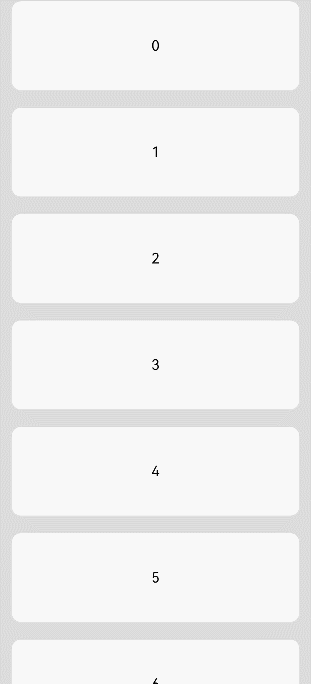
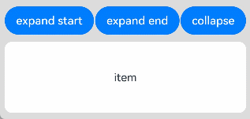

# ListItem

<!--Kit: ArkUI-->
<!--Subsystem: ArkUI-->
<!--Owner: @rongShao-Z; @wind_-->
<!--Designer: @yangcan18-->
<!--Tester: @leiyuqian-->
<!--Adviser: @Brilliantry_Rui-->
<!-- md-trans-meta sourceCommit=d78b3fb65ab1cedf6a668b0bed3dbffdd0bd3b5a translatedAt=2026-08-19T07:12:51.951Z pushedAt=2026-08-20T10:45:03.049Z -->

**ListItem** is used to display a specific list item in a list. It supports capabilities such as swipe-out menus, selected states, mouse frame selection, and card styles. It must be used with the **List** component. It is applicable to scenarios where content needs to be displayed in a list and interactive operations (such as swipe-to-delete and selection marking) need to be performed on individual list items.

> **NOTE**
>
> - This component is supported since API version 7. Updates will be marked with a superscript to indicate their earliest API version.
> - The parent of this component can only be [List](ts-container-list.md) or [ListItemGroup](ts-container-listitemgroup.md).
> - When this component is used with [LazyForEach](../../../ui/rendering-control/arkts-rendering-control-lazyforeach.md), its child components are created when it is created. When this component is used with [if/else](../../../ui/rendering-control/arkts-rendering-control-ifelse.md) or [ForEach](../../../ui/rendering-control/arkts-rendering-control-foreach.md), or when the parent component is **List** or **ListItemGroup**, its child components are created when it is laid out.

## Child Components

This component can contain a single child component.

## APIs

### ListItem<sup>10+</sup>

ListItem(value?: ListItemOptions)

Creates a **ListItem** component.

**Widget capability**: This API can be used in ArkTS widgets since API version 10.

**Atomic service API**: This API can be used in atomic services since API version 11.

**Model restriction**: This API can be used only in the stage model.

**System capability**: SystemCapability.ArkUI.ArkUI.Full

**Parameters**

| Name| Type                                     | Mandatory| Description                                                    |
| ------ | --------------------------------------------- | ---- | ------------------------------------------------------------ |
| value  | [ListItemOptions](#listitemoptions10) | No  | Provides optional parameters for the **ListItem**. This object contains the **style** parameter of the [ListItemStyle](#listitemstyle10) enum type. Pass this parameter when the card style (**ListItemStyle.CARD**) needs to be set. If it is not passed, the default configuration (no style) is used.<br/>Default value: **{ style: ListItemStyle.NONE }** |

### ListItem<sup>(deprecated)</sup>

ListItem(value?: string)

Creates a **ListItem** component.

> **NOTE**
>
> This API is supported since API version 7 and deprecated since API version 10. You are advised to use [ListItem<sup>10+</sup>](#listitem10) instead.

**Widget capability**: This API can be used in ArkTS widgets since API version 9.

**System capability**: SystemCapability.ArkUI.ArkUI.Full

**Parameters**

| Name| Type                     | Mandatory| Description|
| ------ | ----------------------------- | ---- | -------- |
| value  | string | No   | This parameter is deprecated and does not take effect in the current version. You are advised to use [ListItem<sup>10+</sup>](#listitem10) instead. |

## Attributes

In addition to the [universal attributes](ts-component-general-attributes.md), the following attributes are supported.

### sticky<sup>(deprecated)</sup>

sticky(value: Sticky)

Sets the sticky effect of the list item.

> **NOTE**
>
> This API is supported since API version 7 and deprecated since API version 9. You are advised to use [sticky](ts-container-list.md#sticky9) instead.

**System capability**: SystemCapability.ArkUI.ArkUI.Full

**Parameters**

| Name| Type                               | Mandatory| Description                                      |
| ------ | ----------------------------------- | ---- | ------------------------------------------ |
| value  | [Sticky](#stickydeprecated) | Yes  | Sticky effect of the list item.<br>Default value: **Sticky.None**|

### editable<sup>(deprecated)</sup>

editable(value: boolean | EditMode)

Sets whether to enable edit mode, where the list item can be deleted or moved.

> **NOTE**
>
> This API is supported since API version 7 and deprecated since API version 9. No substitute is provided.

**System capability**: SystemCapability.ArkUI.ArkUI.Full

**Parameters**

| Name| Type                                                        | Mandatory| Description                                      |
| ------ | ------------------------------------------------------------ | ---- | ------------------------------------------ |
| value  | boolean&nbsp;\|&nbsp;[EditMode](#editmodedeprecated) | Yes   | Whether the **ListItem** element is editable. When set to **true**, the list item enters the edit mode and can be deleted or moved. When set to **false**, the list item is not editable. When set to an **EditMode** enum value, **None** indicates that the edit operation is not restricted, **Deletable** indicates that the list item can be deleted, and **Movable** indicates that the list item can be moved.<br/>Default value: **false** |

### selectable<sup>8+</sup>

selectable(value: boolean)

Sets whether the current **ListItem** element can be selected by mouse frame selection. This takes effect only when the parent [List](ts-container-list.md) component has [multiSelectable](ts-container-list.md#multiselectable8) set to **true** to enable mouse frame selection.

**Widget capability**: This API can be used in ArkTS widgets since API version 9.

**Atomic service API**: This API can be used in atomic services since API version 11.

**System capability**: SystemCapability.ArkUI.ArkUI.Full

**Parameters**

| Name| Type   | Mandatory| Description                                             |
| ------ | ------- | ---- | ------------------------------------------------- |
| value  | boolean  | Yes   | Whether the **ListItem** element can be selected by mouse frame selection. When set to **true**, it can be selected by mouse frame selection; when set to **false**, it cannot.<br/>Default value: **true**<br/>**Note:** This takes effect only when the outer [List](ts-container-list.md) component sets [multiSelectable](ts-container-list.md#multiselectable8) to **true** to enable mouse frame selection. |

### selected<sup>10+</sup>

selected(value: boolean)

Sets whether the list item is selected. This attribute supports two-way binding through [$$](../../../ui/state-management/arkts-two-way-sync.md). This attribute must be used before the [polymorphic style](./ts-universal-attributes-polymorphic-style.md) is set. Otherwise, the style settings will not take effect.

**Widget capability**: This API can be used in ArkTS widgets since API version 10.

**Atomic service API**: This API can be used in atomic services since API version 11.

**Model restriction**: This API can be used only in the stage model.

**System capability**: SystemCapability.ArkUI.ArkUI.Full

**Parameters**

| Name| Type   | Mandatory| Description                                    |
| ------ | ------- | ---- | ---------------------------------------- |
| value  | boolean | Yes   | Whether the **ListItem** is selected. The value **true** means the selected state, and **false** means the default state.<br/>Default value: **false**<br/>**Note:** This attribute must be set before the polymorphic style is set for the selected state style to take effect. |

### swipeAction<sup>9+</sup>

swipeAction(value: SwipeActionOptions)

Sets the swipe action item displayed when the list item is swiped out from the screen edge.

**Atomic service API**: This API can be used in atomic services since API version 11.

**System capability**: SystemCapability.ArkUI.ArkUI.Full

**Parameters**

| Name| Type                                             | Mandatory| Description                |
| ------ | ------------------------------------------------- | ---- | -------------------- |
| value  | [SwipeActionOptions](#swipeactionoptions9) | Yes   | Configuration of the swipe-out component of the **ListItem**, used to set the component displayed when swiped out, the swipe effect, and the swipe state callback. |

## Sticky<sup>(deprecated)</sup>

Enumerates the sticky effects for list items.

> **NOTE**
>
> This API is supported since API version 7 and deprecated since API version 9. You are advised to use [StickyStyle](ts-container-list.md#stickystyle9) of the List component instead.

**System capability**: SystemCapability.ArkUI.ArkUI.Full

| Name| Value| Description|
| -------- | -------- | -------- |
| None |  0  | No sticky effect. |
| Normal |  1  | The current item sticks to the top. |
| Opacity |  2  | The current item sticks to the top with an opacity change effect. |

## EditMode<sup>(deprecated)</sup>

Enumerates the edit modes of list items.

> **NOTE**
>
> This API is supported since API version 7 and deprecated since API version 9. There is no substitute API.

**System capability**: SystemCapability.ArkUI.ArkUI.Full

| Name    | Value| Description     |
| ------ | ------ | --------- |
| None   |  0  | No restriction on the edit operation.    |
| Deletable |  1  | Deletable. |
| Movable |  2  | Movable. |

## SwipeEdgeEffect<sup>9+</sup>

Enumerates the edge effects.

**Atomic service API**: This API can be used in atomic services since API version 11.

**System capability**: SystemCapability.ArkUI.ArkUI.Full

| Name    | Value| Description     |
| ------ | ------ | --------- |
|   Spring   |    0    | The **ListItem** can continue to be swiped after the swipe distance exceeds the size of the swipe-out component.<br>If a delete area is set, the **ListItem** can continue to be swiped after the swipe distance exceeds the delete threshold,<br/>and it rebounds along the spring damping curve after being released. |
|   None   |    1    | The swipe distance of the **ListItem** cannot exceed the size of the swipe-out component.<br>If a delete area is set, the swipe distance of the **ListItem** cannot exceed the delete threshold,<br/>and when a delete callback is set, releasing the **ListItem** after the delete threshold is reached triggers the delete callback. |

## SwipeActionOptions<sup>9+</sup>

In the **@builder** functions corresponding to **start** and **end**, the top-level component must be a single component. If the top level is a rendering control statement such as **if**/**else** or **ForEach**, ensure that it can generate only a single component. Otherwise, undefined behavior may occur.

The swipe gesture works only in the list item area. If a child component is swiped out of the list item area, the portion outside the list item does not respond to the swipe gesture. Therefore, in multi-column mode, you are advised not to set the swipe-out component too wide.

**System capability**: SystemCapability.ArkUI.ArkUI.Full

| Name                        | Type                                                        | Read-Only| Optional| Description                                                        |
| ---------------------------- | ------------------------------------------------------------ | ---- | -- | ------------------------------------------------------------ |
| start                        | [CustomBuilder](ts-types.md#custombuilder8)&nbsp;\|&nbsp;[SwipeActionItem](#swipeactionitem10) | No   | Yes | Component on the left of the item when the **ListItem** is swiped right (when the **List** is laid out vertically) or component above the item when the **ListItem** is swiped down (when the **List** is laid out horizontally).<br/>Default value: none (the swipe-out component on this side is not displayed when it is not set)<br/>**NOTE**<br/>When the value is a **CustomBuilder** or the builder of **SwipeActionItem**, the top level of the **@builder** function must be a single component. Otherwise, undefined behavior occurs.<br/>**Atomic service API:** This API can be used in atomic services since API version 11. |
| end                          | [CustomBuilder](ts-types.md#custombuilder8)&nbsp;\|&nbsp;[SwipeActionItem](#swipeactionitem10) | No   | Yes | Component on the right of the item when the **ListItem** is swiped left (when the **List** is laid out vertically) or component below the item when the **ListItem** is swiped up (when the **List** is laid out horizontally).<br/>Default value: none (the swipe-out component on this side is not displayed when it is not set)<br/>**NOTE**<br/>When the value is a **CustomBuilder** or the builder of **SwipeActionItem**, the top level of the **@builder** function must be a single component. Otherwise, undefined behavior occurs.<br/>**Atomic service API:** This API can be used in atomic services since API version 11. |
| edgeEffect                   | [SwipeEdgeEffect](#swipeedgeeffect9)                 | No   | Yes | Swipe effect.<br/>Default value: **SwipeEdgeEffect.Spring**<br/>**SwipeEdgeEffect.Spring** indicates the spring effect. After the swipe distance exceeds the size of the swipe-out component, the item can continue to be swiped and rebounds along the spring damping curve. **SwipeEdgeEffect.None** indicates no spring effect, and the swipe distance cannot exceed the size of the swipe-out component.<br/>**Atomic service API:** This API can be used in atomic services since API version 11.                                                |
| onOffsetChange<sup>11+</sup> | (offset: number) => void                                     | No   | Yes | Triggered when the position changes as the list item is swiped left or right (when the list direction is vertical) or swiped up or down (when the list direction is horizontal). The unit is vp.<br/>**Atomic service API:** This API can be used in atomic services since API version 12.<br/>**Model restriction:** This API can be used only in the stage model.|

## SwipeActionItem<sup>10+</sup>

Used to configure the **start** or **end** swipe-out item in [SwipeActionOptions](#swipeactionoptions9), including the action item displayed when swiping out, the distance threshold of the long-distance action area, and the callbacks for entering and exiting the long-distance action area, triggering the action when the finger is lifted, and state changes.

When used as a **start** swipe-out item, it is displayed on the left of the **ListItem** when the **List** is in vertical layout, and above the **ListItem** when the **List** is in horizontal layout. When used as an end swipe-out item, it is displayed on the right of the **ListItem** when the **List** is in vertical layout, and below the **ListItem** when the **List** is in horizontal layout.

**Model restriction**: This API can be used only in the stage model.

**System capability**: SystemCapability.ArkUI.ArkUI.Full

| Name | Type | Read Only | Optional | Description |
| -------------------- | ------------------------------------------------------------ | ---- | -- | ------------------------------------------------------------ |
| actionAreaDistance | [Length](ts-types.md#length) | No | Yes | Distance threshold for long-distance swipe-to-delete of the component. That is, after the swipe-out component is completely swiped into the viewport, the distance threshold for continuing to swipe to trigger deletion.<br/>Default value: **56vp**<br/>**NOTE**<br/>Percentage values are not supported.<br/>If the delete distance threshold is greater than or equal to the size of the **ListItem** in the swipe direction minus the size of the swipe-out component in the swipe direction, or if it is less than or equal to 0, no delete area is formed.<br/>**Atomic service API:** This API can be used in atomic services since API version 11. |
| onAction | () => void | No | Yes | Callback triggered when the finger is lifted after the component enters the long-distance delete area.<br/>**NOTE**<br/>When the final value of **actionAreaDistance** is greater than 0 and less than the size of the **ListItem** in the swipe direction minus the size of the swipe-out component in the swipe direction, the callback is triggered only when the position where the finger is released after swiping is greater than or equal to this value. If **actionAreaDistance** is not set, the default value **56vp** is used for calculation.<br/>**Atomic service API:** This API can be used in atomic services since API version 11. |
| onEnterActionArea | () => void | No | Yes | Callback triggered when the swiped item enters the delete area. It is triggered only once, but is triggered again upon re-entry.<br/>**NOTE**<br/>When the final value of **actionAreaDistance** is greater than 0 and less than the size of the **ListItem** in the swipe direction minus the size of the swipe-out component in the swipe direction, the callback is triggered only when the item enters this area. If **actionAreaDistance** is not set, the default value **56vp** is used for calculation.<br/>**Atomic service API:** This API can be used in atomic services since API version 11. |
| onExitActionArea | () => void | No | Yes | Callback triggered when the swiped item exits the delete area. It is triggered only once, but is triggered again upon re-exit.<br/>**NOTE**<br/>When the final value of **actionAreaDistance** is greater than 0 and less than the size of the **ListItem** in the swipe direction minus the size of the swipe-out component in the swipe direction, the callback is triggered only when the item exits this area. If **actionAreaDistance** is not set, the default value **56vp** is used for calculation.<br/>**Atomic service API:** This API can be used in atomic services since API version 11. |
| builder | [CustomBuilder](ts-types.md#custombuilder8) | No | Yes | Operation item displayed when the list item is swiped left or right (when the list direction is vertical) or swiped up or down (when the list direction is horizontal).<br/>Default value: none (no operation item is displayed when this parameter is not set)<br/>**NOTE**<br/>When **builderComponent** is also set, **builderComponent** takes precedence over this parameter. That is, when both **builder** and **builderComponent** are set, the value set by **builderComponent** prevails.<br/>**Atomic service API:** This API can be used in atomic services since API version 11. |
| builderComponent<sup>18+</sup> | [ComponentContent](../js-apis-arkui-ComponentContent.md) | No | Yes | Operation item displayed when the list item is swiped left or right (when the list direction is vertical) or swiped up or down (when the list direction is horizontal).<br/>Default value: none (no operation item is displayed when this parameter is not set)<br/>**NOTE**<br/>This parameter takes precedence over the **builder** parameter. That is, when both **builder** and **builderComponent** are set, the value set by **builderComponent** prevails.<br/>The same **builderComponent** is not recommended to be used for different **start**/**end** items at the same time; otherwise, display issues may occur.<br/>**Atomic service API:** This API can be used in atomic services since API version 18. |
| onStateChange<sup>11+</sup> | (state:[SwipeActionState](#swipeactionstate11)) => void | No | Yes | Callback triggered when the swipe state of the list item changes.<br/>**Atomic service API:** This API can be used in atomic services since API version 12. |

## ListItemOptions<sup>10+</sup>

Defines **ListItem** component configuration options.

**Atomic service API**: This API can be used in atomic services since API version 11.

**Model restriction**: This API can be used only in the stage model.

**System capability**: SystemCapability.ArkUI.ArkUI.Full

<!--Table: 10%; auto; 10%; 10%; auto-->

| Name | Type                                 | Read-Only| Optional| Description                                                        |
| ----- | ----------------------------------------- | ---- | -- | ------------------------------------------------------------ |
| style | [ListItemStyle](#listitemstyle10) | No | Yes | Card style of the **ListItem** component.<br/>Default value: **ListItemStyle.NONE**<br/>When set to **ListItemStyle.NONE**, no style is applied.<br/>When set to **ListItemStyle.CARD**, it is recommended to use it together with **ListItemGroupStyle.CARD** of [ListItemGroup](ts-container-listitemgroup.md) to display the default card style.<br/>In card style, the default specifications of **ListItem** are: height 48 vp, width 100%, and left and right padding 8 vp. To implement adaptive height of **ListItem**, set **height** to **undefined**.<br/>In card style, default **focus**, **hover**, **press**, **selected**, and **disable** styles are provided for the list items in the card.<br/>**NOTE**<br/>When set to **ListItemStyle.CARD**, the **listDirection** attribute of **List** must be **Axis.Vertical**. If it is set to **Axis.Horizontal**, the display will be disordered. The **alignListItem** attribute of **List** defaults to **ListItemAlign.Center**, which centers the items. |

## ListItemStyle<sup>10+</sup>

Enumerates the card styles of the **ListItem** component.

**Atomic service API**: This API can be used in atomic services since API version 11.

**Model restriction**: This API can be used only in the stage model.

**System capability**: SystemCapability.ArkUI.ArkUI.Full

| Name| Value | Description            |
| ---- | ---- | ------------------ |
| NONE | 0 | No style.          |
| CARD | 1 | Default card style.|

## SwipeActionState<sup>11+</sup>

Enumerates swipe states of list items.

**Atomic service API**: This API can be used in atomic services since API version 12.

**Model restriction**: This API can be used only in the stage model.

**System capability**: SystemCapability.ArkUI.ArkUI.Full

| Name     | Value    | Description                                                      |
| --------- | --------- | ------------------------------------------------------------ |
| COLLAPSED | 0 | Collapsed state, in which the action items are hidden. |
| EXPANDED  | 1 | Expanded state, in which the action items are displayed.<br/>**NOTE**<br/>The swipe action items must be set for the list item. |
| ACTIONING | 2 | Long-distance state, in which the list item is deleted after it enters the long-distance deletion area.<br/>**NOTE**<br/>This state can be entered only when the final value of **actionAreaDistance** is greater than 0 and less than the size of the list item in the swipe direction minus the size of the swipe-out component in the swipe direction, and the position where the finger is released after swiping is greater than or equal to this value. |

## Events

### onSelect<sup>8+</sup>

onSelect(event:&nbsp;(isSelected:&nbsp;boolean)&nbsp;=&gt;&nbsp;void)

Triggered when the selected state of the list item for multiselect changes.

This callback is triggered when the outer [List](ts-container-list.md) component has [multiSelectable](ts-container-list.md#multiselectable8) set to **true** to enable mouse box selection, and the [selectable](#selectable8) attribute of the current ListItem is set to **true**.

**Widget capability**: This API can be used in ArkTS widgets since API version 9.

**Atomic service API**: This API can be used in atomic services since API version 11.

**System capability**: SystemCapability.ArkUI.ArkUI.Full

**Parameters**

| Name    | Type   | Mandatory| Description                                                        |
| ---------- | ------- | ---- | ------------------------------------------------------------ |
| isSelected | boolean | Yes  | Whether the list item is selected for multi-select. Returns **true** if the list item is selected for multi-select; returns **false** otherwise.|

## ListItemSwipeActionManager<sup>21+</sup>

Implements the swipe action menu manager for list items.

### expand<sup>21+</sup>

expand(node: FrameNode, direction: ListItemSwipeActionDirection): void

Expands the swipe action menu for the specified list item.

> **NOTE**
>
> - If the **show** parameter of the **cachedCount** attribute of the **List** component is set to **true**, **ListItems** that have been preloaded outside the display area of the **List** support expansion. Otherwise, nodes outside the display area of the **List** do not support expansion.

**Atomic service API**: This API can be used in atomic services since API version 21.

**Model restriction**: This API can be used only in the stage model.

**System capability**: SystemCapability.ArkUI.ArkUI.Full

**Parameters**

| Name    | Type   | Mandatory| Description                                                        |
| ---------- | ------- | ---- | ------------------------------------------------------------ |
| node | [FrameNode](../js-apis-arkui-frameNode.md) | Yes  | **ListItem** node object.|
| direction | [ListItemSwipeActionDirection](#listitemswipeactiondirection21) | Yes  | Swipe action menu display direction for the **ListItem** component.|

**Error codes**

For details about the error codes, see [Custom Node Error Codes](../errorcode-node.md).

| ID   | Error Message                                                                                            |
|----------|--------------------------------------------------------------------------------------------------|
| 100023   | The component type of the node is incorrect. |
| 106203   | The node not mounted to component tree. |

### collapse<sup>21+</sup>

collapse(node: FrameNode): void

Collapses the swipe action menu for the specified list item.

**Atomic service API**: This API can be used in atomic services since API version 21.

**Model restriction**: This API can be used only in the stage model.

**System capability**: SystemCapability.ArkUI.ArkUI.Full

**Parameters**

| Name    | Type   | Mandatory| Description                                                        |
| ---------- | ------- | ---- | ------------------------------------------------------------ |
| node | [FrameNode](../js-apis-arkui-frameNode.md) | Yes  | **ListItem** node object.|

**Error codes**

For details about the error codes, see [Custom Node Error Codes](../errorcode-node.md).

| ID   | Error Message                                                                                            |
|----------|--------------------------------------------------------------------------------------------------|
| 100023   | The component type of the node is incorrect. |
| 106203   | The node not mounted to component tree. |

## ListItemSwipeActionDirection<sup>21+</sup>

Enumerates the swipe action menu display directions for **ListItem** components.

**Atomic service API**: This API can be used in atomic services since API version 21.

**Model restriction**: This API can be used only in the stage model.

**System capability**: SystemCapability.ArkUI.ArkUI.Full

| Name| Value| Description|
| -------- | -------- | -------- |
| START |  0  | For vertical lists: left side in LTR mode, right side in RTL mode. For horizontal lists: top side.|
| END   |  1  | For vertical lists: right side in LTR mode, left side in RTL mode. For horizontal lists: bottom side.|

## Example

### Example 1: Creating a List Item

This example demonstrates the basic usage of creating a list item.

```ts
// xxx.ets
export class ListDataSource implements IDataSource {
  private list: number[] = [];

  constructor(list: number[]) {
    this.list = list;
  }

  totalCount(): number {
    return this.list.length;
  }

  getData(index: number): number {
    return this.list[index];
  }

  registerDataChangeListener(listener: DataChangeListener): void {
  }

  unregisterDataChangeListener(listener: DataChangeListener): void {
  }
}

@Entry
@Component
struct ListItemExample {
  private arr: ListDataSource = new ListDataSource([0, 1, 2, 3, 4, 5, 6, 7, 8, 9]);

  build() {
    Column() {
      List({ space: 20, initialIndex: 0 }) {
        LazyForEach(this.arr, (item: number) => {
          ListItem() {
            Text('' + item)
              .width('100%')
              .height(100)
              .fontSize(16)
              .textAlign(TextAlign.Center)
              .borderRadius(10)
              .backgroundColor(0xFFFFFF)
          }
        }, (item: number) => item.toString())
      }.width('90%')
      .scrollBar(BarState.Off)
    }.width('100%').height('100%').backgroundColor(0xDCDCDC).padding({ top: 5 })
  }
}
```



### Example 2: Setting the Swipe Action Item

This example shows how to set the swipe action item for a list item using **swipeAction**.

```ts
// xxx.ets
import { BusinessError } from '@kit.BasicServicesKit';

@Entry
@Component
struct ListItemExample2 {
  @State arr: number[] = [0, 1, 2, 3, 4];
  @State enterEndDeleteAreaString: string = 'not enterEndDeleteArea';
  @State exitEndDeleteAreaString: string = 'not exitEndDeleteArea';
  private scroller: ListScroller = new ListScroller();

  @Builder
  itemEnd() {
    Row() {
      Button('Delete').margin(4)
      Button('Set').margin(4).onClick(() => {
        try {
          this.scroller.closeAllSwipeActions();
        } catch (error) {
          console.error(`Failed to close all swipe actions. Code: ${(error as BusinessError).code}, message: ${(error as BusinessError).message}`);
        }
      })
    }.padding(4).justifyContent(FlexAlign.SpaceEvenly)
  }

  build() {
    Column() {
      List({ space: 10, scroller: this.scroller }) {
        ForEach(this.arr, (item: number) => {
          ListItem() {
            Text('item' + item)
              .width('100%')
              .height(100)
              .fontSize(16)
              .textAlign(TextAlign.Center)
              .borderRadius(10)
              .backgroundColor(0xFFFFFF)
          }
          .transition(TransitionEffect.OPACITY)
          .swipeAction({
            end: {
              builder: () => {
                this.itemEnd()
              },
              onAction: () => {
                this.getUIContext()?.animateTo({ duration: 1000 }, () => {
                  let index = this.arr.indexOf(item);
                  this.arr.splice(index, 1);
                });
              },
              actionAreaDistance: 56,
              onEnterActionArea: () => {
                this.enterEndDeleteAreaString = 'enterEndDeleteArea';
                this.exitEndDeleteAreaString = 'not exitEndDeleteArea';
              },
              onExitActionArea: () => {
                this.enterEndDeleteAreaString = 'not enterEndDeleteArea';
                this.exitEndDeleteAreaString = 'exitEndDeleteArea';
              }
            }
          })
        }, (item: number) => item.toString())
      }

      Text(this.enterEndDeleteAreaString).fontSize(20)
      Text(this.exitEndDeleteAreaString).fontSize(20)
    }
    .padding(10)
    .backgroundColor(0xDCDCDC)
    .width('100%')
    .height('100%')
  }
}
```


### Example 3: Applying a Card-style Effect

This example illustrates the card-style effect of the **ListItem** component.

```ts
// xxx.ets
@Entry
@Component
struct ListItemExample3 {
  build() {
    Column() {
      List({ space: 4, initialIndex: 0 }) {
        ListItemGroup({ style: ListItemGroupStyle.CARD }) {
          ForEach([ListItemStyle.CARD, ListItemStyle.CARD, ListItemStyle.NONE], (itemStyle: ListItemStyle, index?: number) => {
            ListItem({ style: itemStyle }) {
              Text('' + index)
                .width('100%')
                .textAlign(TextAlign.Center)
            }
          })
        }

        ForEach([ListItemStyle.CARD, ListItemStyle.CARD, ListItemStyle.NONE], (itemStyle: ListItemStyle, index?: number) => {
          ListItem({ style: itemStyle }) {
            Text('' + index)
              .width('100%')
              .textAlign(TextAlign.Center)
          }
        })
      }
      .width('100%')
      .multiSelectable(true)
      .backgroundColor(0xDCDCDC)
    }
    .width('100%')
    .padding({ top: 5 })
  }
}
```


### Example 4: Setting the Swipe Action Item Using ComponentContent

This example demonstrates how to set the action items displayed during swipe operations in **ListItem** using [ComponentContent](../js-apis-arkui-ComponentContent.md#componentcontent-1).

```ts
// xxx.ets
import { ComponentContent } from '@kit.ArkUI';

class BuilderParams {
  text: string | Resource;
  scroller: ListScroller;

  constructor(text: string | Resource, scroller: ListScroller) {
    this.text = text;
    this.scroller = scroller;
  }
}

@Builder
function itemBuilder(params: BuilderParams) {
  Row() {
    Button(params.text).margin(4)
    Button('Set').margin(4).onClick(() => {
      params.scroller.closeAllSwipeActions();
    })
  }.padding(4).justifyContent(FlexAlign.SpaceEvenly)
}

@Component
struct MyListItem {
  scroller: ListScroller = new ListScroller();
  @State arr: number[] = [0, 1, 2, 3, 4];
  @State project: number = 0;
  startBuilder?: ComponentContent<BuilderParams> = undefined;
  endBuilder?: ComponentContent<BuilderParams> = undefined;
  builderParam = new BuilderParams('delete', this.scroller);

  aboutToAppear(): void {
    this.startBuilder = new ComponentContent(this.getUIContext(), wrapBuilder(itemBuilder), this.builderParam);
    this.endBuilder = new ComponentContent(this.getUIContext(), wrapBuilder(itemBuilder), this.builderParam);
  }

  getStartBuilder() {
    this.startBuilder?.update(new BuilderParams('StartDelete', this.scroller));
    return this.startBuilder;
  }

  getEndBuilder() {
    this.endBuilder?.update(new BuilderParams('EndDelete', this.scroller));
    return this.endBuilder;
  }

  build() {
    ListItem() {
      Text('item' + this.project)
        .width('100%')
        .height(100)
        .fontSize(16)
        .textAlign(TextAlign.Center)
        .borderRadius(10)
        .backgroundColor(0xFFFFFF)
    }
    .transition(TransitionEffect.OPACITY)
    .swipeAction({
      end: {
        builderComponent: this.getEndBuilder(),
        onAction: () => {
          this.getUIContext()?.animateTo({ duration: 1000 }, () => {
            let index = this.arr.indexOf(this.project);
            this.arr.splice(index, 1);
          });
        },
        actionAreaDistance: 56
      },
      start: {
        builderComponent: this.getStartBuilder(),
        onAction: () => {
          this.getUIContext()?.animateTo({ duration: 1000 }, () => {
            let index = this.arr.indexOf(this.project);
            this.arr.splice(index, 1);
          });
        },
        actionAreaDistance: 56
      }
    })
    .padding(5)
  }
}

@Entry
@Component
struct ListItemExample {
  @State arr: number[] = [0, 1, 2, 3, 4];
  private scroller: ListScroller = new ListScroller();

  build() {
    Column() {
      List({ space: 10, scroller: this.scroller }) {
        ListItemGroup() {
          ForEach(this.arr, (project: number) => {
            MyListItem({ scroller: this.scroller, project: project, arr: this.arr })
          }, (item: number) => item.toString())
        }
      }
    }
    .padding(10)
    .backgroundColor(0xDCDCDC)
    .width('100%')
    .height('100%')
  }
}
```


### Example 5: Managing the Swipe Action Menu Through ListItemSwipeActionManager

This example demonstrates how to manage the swipe action menu of a list item using [ListItemSwipeActionManager](#listitemswipeactionmanager21), available since API version 21.

```ts
// xxx.ets
import { BusinessError } from '@kit.BasicServicesKit';

@Entry
@Component
struct ListItemExample5 {
  @Builder
  itemAction(str: string) {
    Row() {
      Button(str).margin(4)
    }.padding(4).justifyContent(FlexAlign.SpaceEvenly)
  }

  build() {
    Flex({ wrap: FlexWrap.Wrap }) {
      Flex({ wrap: FlexWrap.Wrap, justifyContent: FlexAlign.SpaceBetween }) {
        Button('expand start')
          .onClick(() => {
            try {
              let node: FrameNode | null = this.getUIContext().getAttachedFrameNodeById('listItem');
              if (!node) {
                return;
              }
              ListItemSwipeActionManager.expand(node, ListItemSwipeActionDirection.START);
            } catch (error) {
              console.error(`Error expand item. Code: ${(error as BusinessError).code}, message: ${(error as BusinessError).message}`);
            }
          })
        Button('expand end')
          .onClick(() => {
            try {
              let node: FrameNode | null = this.getUIContext().getAttachedFrameNodeById('listItem');
              if (!node) {
                return;
              }
              ListItemSwipeActionManager.expand(node, ListItemSwipeActionDirection.END);
            } catch (error) {
              console.error(`Error expand item. Code: ${(error as BusinessError).code}, message: ${(error as BusinessError).message}`);
            }
          })
        Button('collapse')
          .onClick(() => {
            try {
              let node: FrameNode | null = this.getUIContext().getAttachedFrameNodeById('listItem');
              if (!node) {
                return;
              }
              ListItemSwipeActionManager.collapse(node);
            } catch (error) {
              console.error(`Error collapse item. Code: ${(error as BusinessError).code}, message: ${(error as BusinessError).message}`);
            }
          })
      }
      .margin({ bottom: 10 })

      List({ space: 10 }) {
        ListItem() {
          Text('item')
            .width('100%')
            .height(100)
            .fontSize(16)
            .textAlign(TextAlign.Center)
            .borderRadius(10)
            .backgroundColor(0xFFFFFF)
        }
        .id('listItem')
        .transition(TransitionEffect.OPACITY)
        .swipeAction({
          start: {
            builder: () => {
              this.itemAction('start')
            },
          },
          end: {
            builder: () => {
              this.itemAction('end')
            },
          }
        })
      }
      .height('80%')

    }
    .padding(10)
    .backgroundColor(0xDCDCDC)
    .width('100%')
    .height('100%')
  }
}
```

