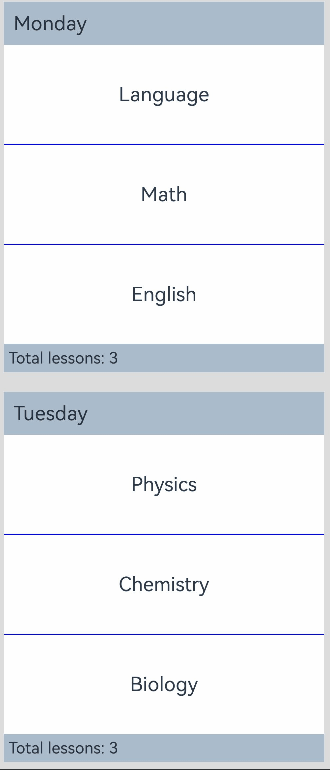
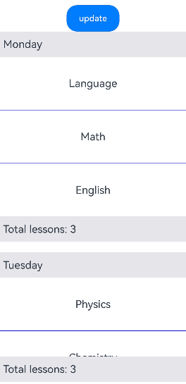
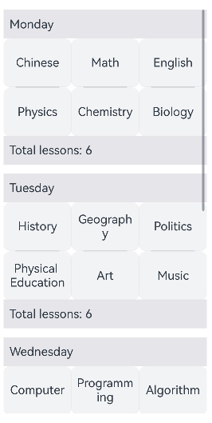
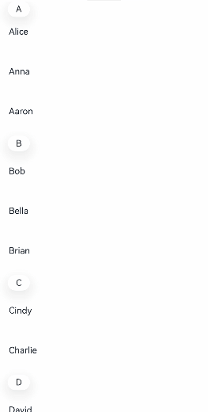

# ListItemGroup

<!--Kit: ArkUI-->
<!--Subsystem: ArkUI-->
<!--Owner: @rongShao-Z; @wind_-->
<!--Designer: @yangcan18-->
<!--Tester: @leiyuqian-->
<!--Adviser: @Brilliantry_Rui-->
<!-- md-trans-meta sourceCommit=deec821b591abb0aeafbc7cd36714c88339c6efa translatedAt=2026-08-19T07:01:26.702Z pushedAt=2026-08-20T10:45:03.038Z -->

This component is used to display list item groups. It supports custom group header and footer areas, card style, dividers, lazy loading, and preloading. It is suitable for scenarios where list items need to be logically grouped for display. By default, it spans the entire width of the [List](ts-container-list.md) component and must be used with the **List** component.

Lazy loading of **ListItemGroup** loads the child components in the visible area as required. Compared with full loading, lazy loading can improve the app startup speed and reduce the memory usage. When **ListItemGroup** is used together with [ForEach](../../../ui/rendering-control/arkts-rendering-control-foreach.md), [LazyForEach](../../../ui/rendering-control/arkts-rendering-control-lazyforeach.md), and [Repeat](../../../ui/rendering-control/arkts-new-rendering-control-repeat.md), the lazy loading capabilities differ as follows:

 - When **ListItemGroup** is used together with **ForEach**, all child nodes are created at a time. The nodes within the screen range are laid out and rendered when needed. When a user swipes, the nodes that are out of the screen range are not removed from the tree, and the nodes that enter the screen range are laid out and rendered.

 - When **ListItemGroup** is used together with **LazyForEach**, all nodes within the screen range are created, laid out, and rendered at a time. When a user swipes, the nodes that are out of the screen range are removed from the tree, and the nodes that enter the screen range are created, laid out, and rendered.

 - When the **ListItemGroup** component is used together with **Repeat** with [virtualScroll](ts-rendering-control-repeat.md#virtualscroll), the lazy loading behavior is the same as that of **LazyForEach**. When the **ListItemGroup** component is used together with **Repeat** without **virtualScroll**, the lazy loading behavior is the same as that of **ForEach**.

Preloading in **ListItemGroup** refers to loading not only the child components within the display area but also some child components outside the display area in advance during idle time slots. Preloading can reduce frame drops during scrolling and improve smoothness. Preloading takes effect only when combined with lazy loading. When the **ListItemGroup** component is used together with [ForEach](../../../ui/rendering-control/arkts-rendering-control-foreach.md), [LazyForEach](../../../ui/rendering-control/arkts-rendering-control-lazyforeach.md), and [Repeat](../../../ui/rendering-control/arkts-new-rendering-control-repeat.md), the preloading capabilities differ:

 - When the **ListItemGroup** component is used together with **ForEach** and [cachedCount](ts-container-list.md#cachedcount) is set, in addition to laying out child components within the display area, child components outside the display area within the range specified by the **cachedCount** attribute of the **List** component are pre-laid out during idle time slots.

 - When the **ListItemGroup** component is used together with **LazyForEach** and [cachedCount](ts-container-list.md#cachedcount) is set, in addition to creating and laying out child components within the display area, child components outside the display area within the range specified by the **cachedCount** attribute of the **List** component are pre-created and pre-laid out during idle time slots.

 - When the **ListItemGroup** component is used together with **Repeat** with [virtualScroll](ts-rendering-control-repeat.md#virtualscroll), the preloading behavior is the same as that of **LazyForEach**. When the **ListItemGroup** component is used together with **Repeat** without **virtualScroll**, the preloading behavior is the same as that of **ForEach**.

> **NOTE**
>
> - This component is supported since API version 9. Updates will be marked with a superscript to indicate their earliest API version.
> - The parent component of this component can only be [List](ts-container-list.md).
> - The **ListItemGroup** component does not support the [universal attribute aspectRatio](ts-universal-attributes-layout-constraints.md#aspectratio).
> - When the [listDirection](ts-container-list.md#listdirection) attribute of the parent **List** component is **Axis.Vertical**, setting the [universal attribute height](ts-universal-attributes-size.md#height) does not take effect. The height of the **ListItemGroup** is the sum of the header height, footer height, and the total height of all **ListItem** components after layout.
> - When the **listDirection** attribute of the parent **List** component is **Axis.Horizontal**, setting the [universal attribute width](ts-universal-attributes-size.md#width) does not take effect. The width of the **ListItemGroup** is the sum of the header width, footer width, and the total width of all **ListItem** components after layout.
> - Setting the layout direction through the **direction** attribute of the **ListItemGroup** does not take effect. The layout direction of the **ListItemGroup** component follows that of the parent **List** component.

## Child Components

Contains the [ListItem](ts-container-listitem.md) child component. Child components can be dynamically generated using rendering control types [if/else](../../../ui/rendering-control/arkts-rendering-control-ifelse.md), [ForEach](../../../ui/rendering-control/arkts-rendering-control-foreach.md), [LazyForEach](../../../ui/rendering-control/arkts-rendering-control-lazyforeach.md), and [Repeat](../../../ui/rendering-control/arkts-new-rendering-control-repeat.md). **LazyForEach** or **Repeat** is recommended to optimize performance.

## APIs

ListItemGroup(options?: ListItemGroupOptions)

Creates a **ListItemGroup** component. The parent component of this component can only be **List**.

**Atomic service API**: This API can be used in atomic services since API version 11.

**System capability**: SystemCapability.ArkUI.ArkUI.Full

**Parameters**

| Name| Type| Mandatory| Description|
| -------- | -------- | -------- | -------- |
| options | [ListItemGroupOptions](#listitemgroupoptions) | No | Parameters of the **ListItemGroup** component, used to configure the header, footer, spacing, and style. If not passed, the default configuration is used (no header or footer, spacing of 0, and no card style). |

## ListItemGroupOptions

Describes the **ListItemGroup** component parameter.

**System capability**: SystemCapability.ArkUI.ArkUI.Full

<!--Table: 20%; 20%; 8%; 8%; 44%-->

| Name             | Type                                           | Read-Only| Optional  | Description                                                    |
| ------------------- | --------------------------------------------------- | ---- | -- | ------------------------------------------------------------ |
| header              | [CustomBuilder](ts-types.md#custombuilder8) &nbsp;   | No   | Yes | Header component of the **ListItemGroup**.<br/>**NOTE**<br/>It can contain a single child component or no child component. If it is not set, there is no header component. This parameter has a lower priority than **headerComponent**. That is, if both header and **headerComponent** are set, the value of **headerComponent** takes effect.<br/>**Atomic service API:** This API can be used in atomic services since API version 11.               |
| headerComponent<sup>13+</sup>              | [ComponentContent](../js-apis-arkui-ComponentContent.md)       | No   | Yes | Used to set the header component of the **ListItemGroup** using a **ComponentContent** parameter.<br/>**NOTE**<br/>It can contain a single child component or no child component. If it is not set, there is no header component. This parameter has a higher priority than **header**. That is, if both **header** and **headerComponent** are set, the value of **headerComponent** takes effect.<br/>It is not recommended to use the same **headerComponent** for different **ListItemGroup** components at the same time, as this may cause display issues.<br/>**Atomic service API:** This API can be used in atomic services since API version 13.<br/>**Model restriction:** This API can be used only in the stage model.              |
| footer              | [CustomBuilder](ts-types.md#custombuilder8) &nbsp;     | No   | Yes | Footer component of the **ListItemGroup**.<br/>**NOTE**<br/>It can contain a single child component or no child component. If it is not set, there is no footer component. This parameter has a lower priority than **footerComponent**. That is, if both footer and **footerComponent** are set, the value of **footerComponent** takes effect.<br/>**Atomic service API:** This API can be used in atomic services since API version 11.               |
| footerComponent<sup>13+</sup>              | [ComponentContent](../js-apis-arkui-ComponentContent.md)       | No   | Yes | Used to set the footer component of the **ListItemGroup** using a **ComponentContent** parameter.<br/>**NOTE**<br/>It can contain a single child component or no child component. If it is not set, there is no footer component. This parameter has a higher priority than footer. That is, if both footer and **footerComponent** are set, the value of **footerComponent** takes effect.<br/>It is not recommended to use the same **footerComponent** for different **ListItemGroup** components at the same time, as this may cause display issues.<br/>**Atomic service API:** This API can be used in atomic services since API version 13.<br/>**Model restriction:** This API can be used only in the stage model.                           |
| space               | number&nbsp;\|&nbsp;string                          | No   | Yes | Spacing between list items. It applies only between **ListItem** components, not between header and **ListItem** or between **footer** and **ListItem**.<br/>Default value: **0**<br/>Unit: vp<br/>**NOTE**<br/>If it is set to a negative value or a value greater than or equal to the length of the List content area, the default value is used. If both **spaceWidth** and space are set, **spaceWidth** takes effect first. When **spaceWidth** is **undefined** or **null**, space takes effect.<br/>**Atomic service API:** This API can be used in atomic services since API version 11.  |
| spaceWidth          | [Dimension](ts-types.md#dimension10)                          | No  | Yes| Spacing between list items. This parameter only affects the spacing between list items, but not spacing between the header and list items or between the footer and list items.<br>Default value: **0**<br>Unit: vp<br>**NOTE**<br>If this parameter is set to a negative number or a value greater than or equal to the length of the list content area, the default value is used. If both **spaceWidth** and **space** are set, **spaceWidth** takes precedence. When **spaceWidth** is **undefined** or **null**, **space** takes effect.<br>**Since**: 26.0.0<br>**Model restriction**: This API can be used only in the stage model.<br>**Atomic service API**: This API can be used in atomic services since API version 26.0.0. |
| style<sup>10+</sup> | [ListItemGroupStyle](#listitemgroupstyle10) | No   | Yes | Card style of the **ListItemGroup** component.<br/>Default value: **ListItemGroupStyle.NONE**<br/>When set to **ListItemGroupStyle.NONE**, no style is applied.<br/>When set to **ListItemGroupStyle.CARD**, it is recommended to use it together with **ListItemStyle.CARD** of [ListItem](ts-container-listitem.md) to display the default card style.<br/>In card style, the default specifications of **ListItemGroup** are as follows: left and right margins of 12 vp, and top, bottom, left, and right padding of 4 vp.<br/>In card style, default **focused**, **hover**, **pressed**, **selected**, and **disabled** styles are provided for the list items in the card.<br/>**NOTE**<br/>When set to **ListItemGroupStyle.CARD**, the **listDirection** attribute of List must be **Axis.Vertical**. If it is set to **Axis.Horizontal**, the display will be disordered. The [alignListItem](ts-container-list.md#alignlistitem9) attribute of **List** defaults to **ListItemAlign.Center**, which centers the items.<br/>**Atomic service API:** This API can be used in atomic services since API version 11.<br/>**Model restriction:** This API can be used only in the stage model. |
| headerStyle | [ListItemGroupHeaderFooterStyle](#listitemgroupheaderfooterstyle) | No   | Yes | Header style of the **ListItemGroup**.<br/>Default value: **ListItemGroupHeaderFooterStyle.NONE**<br/>When set to **ListItemGroupHeaderFooterStyle.NONE**, no style is applied.<br/>When set to **ListItemGroupHeaderFooterStyle.FLOATING**, the header component floats during scrolling.<br/>**Since:** 26.0.0<br/>**Model restriction:** This API can be used only in the stage model.<br/>**Atomic service API:** This API can be used in atomic services since API version 26.0.0. |
| footerStyle | [ListItemGroupHeaderFooterStyle](#listitemgroupheaderfooterstyle) | No   | Yes | Footer style of the **ListItemGroup**.<br/>Default value: **ListItemGroupHeaderFooterStyle.NONE**<br/>When set to **ListItemGroupHeaderFooterStyle.NONE**, no style is applied.<br/>When set to **ListItemGroupHeaderFooterStyle.FLOATING**, the footer component floats during scrolling.<br/>**Since:** 26.0.0<br/>**Model restriction:** This API can be used only in the stage model.<br/>**Atomic service API:** This API can be used in atomic services since API version 26.0.0. |

## Attributes

### divider

divider(value: [ListDividerOptions](ts-container-list.md#listdivideroptions18) | null)

Sets the style of the divider for the list items. By default, there is no divider.

**strokeWidth**, **startMargin**, and **endMargin** cannot be set in percentage.

When a list item has [polymorphic styles](ts-universal-attributes-polymorphic-style.md) applied, the dividers above and below the pressed child component are not rendered.

**Atomic service API**: This API can be used in atomic services since API version 11.

**System capability**: SystemCapability.ArkUI.ArkUI.Full

**Parameters**

| Name| Type                                                        | Mandatory| Description                                                        |
| ------ | ------------------------------------------------------------ | ---- | ------------------------------------------------------------ |
| value  | [ListDividerOptions](ts-container-list.md#listdivideroptions18)&nbsp;\|&nbsp;null| Yes  | Style of the divider for the list items.<br> Default value: **null**|

### childrenMainSize<sup>12+</sup>

childrenMainSize(value: ChildrenMainSize)

Sets the size information of the child components of a **ListItemGroup** component along the main axis.

> **NOTE**
>
> - When the child components of a **List** component include **ListItemGroup**, the **childrenMainSize** attribute must be set for both the **List** component and each **ListItemGroup** component. **ListItemGroup** provides the size information of its child components along the main axis through this attribute, so that the **childrenMainSize** attribute of the **List** component can take effect properly.

**Atomic service API**: This API can be used in atomic services since API version 12.

**Model restriction**: This API can be used only in the stage model.

**System capability**: SystemCapability.ArkUI.ArkUI.Full

**Parameters**

| Name    | Type  | Mandatory| Description                           |
| ---------- | ------ | ---- | ------------------------------- |
| value | [ChildrenMainSize](ts-container-scrollable-common.md#childrenmainsize12) | Yes  | Size information of child components in the main axis direction.|

## ListItemGroupStyle<sup>10+</sup>

Enumerates the card styles of the **ListItemGroup** component.

**Atomic service API**: This API can be used in atomic services since API version 11.

**Model restriction**: This API can be used only in the stage model.

**System capability**: SystemCapability.ArkUI.ArkUI.Full

| Name| Value | Description            |
| ---- | ---- | ------------------ |
| NONE | 0 | No style.          |
| CARD | 1 | Default card style.|

## ListItemGroupHeaderFooterStyle

Enumerates the header and footer styles of **ListItemGroup**.

**Since**: 26.0.0

**Atomic service API**: This API can be used in atomic services since API version 26.0.0.

**System capability**: SystemCapability.ArkUI.ArkUI.Full

**Model restriction**: This API can be used only in the stage model.

| Name    | Value | Description      |
| -------- | ---- | ---------- |
| NONE     | 0    | No style.  |
| FLOATING | 1    | Floating style.|

## Example

### Example 1: Setting a Sticky Header and Footer

This example uses [sticky](ts-container-list.md#sticky9) to implement the sticky header and footer.

**ListDataSource** implements the **LazyForEach** data source API [IDataSource](ts-rendering-control-lazyforeach.md#idatasource), which is used to provide child components for **List** and **ListItemGroup** through **LazyForEach**.

<!--code_no_check-->

```ts
// ListDataSource.ets
export class TimeTableDataSource implements IDataSource {
  private list: TimeTable[] = [];
  private listeners: DataChangeListener[] = [];

  constructor(list: TimeTable[]) {
    this.list = list;
  }

  totalCount(): number {
    return this.list.length;
  }

  getData(index: number): TimeTable {
    return this.list[index];
  }

  registerDataChangeListener(listener: DataChangeListener): void {
    if (this.listeners.indexOf(listener) < 0) {
      this.listeners.push(listener);
    }
  }

  unregisterDataChangeListener(listener: DataChangeListener): void {
    const pos = this.listeners.indexOf(listener);
    if (pos >= 0) {
      this.listeners.splice(pos, 1);
    }
  }

  // Notify the controller of data changes.
  notifyDataChange(index: number): void {
    this.listeners.forEach(listener => {
      listener.onDataChange(index);
    });
  }

  // Modify the first element.
  public change1stItem(temp: TimeTable): void {
    this.list[0] = temp;
    this.notifyDataChange(0);
  }
}

export class ProjectsDataSource implements IDataSource {
  private list: string[] = [];

  constructor(list: string[]) {
    this.list = list;
  }

  totalCount(): number {
    return this.list.length;
  }

  getData(index: number): string {
    return this.list[index];
  }

  registerDataChangeListener(listener: DataChangeListener): void {
  }

  unregisterDataChangeListener(listener: DataChangeListener): void {
  }
}

export interface TimeTable {
  title: string;
  projects: string[];
}
```

<!--code_no_check-->

```ts
// xxx.ets
import { TimeTable, ProjectsDataSource, TimeTableDataSource } from './ListDataSource';
@Entry
@Component
struct ListItemGroupExample {
  itemGroupArray: TimeTableDataSource = new TimeTableDataSource([]);

  aboutToAppear(): void {
    let timeTable: TimeTable[] = [
      {
        title: 'Monday',
        projects: ['Language', 'Math', 'English']
      },
      {
        title: 'Tuesday',
        projects: ['Physics', 'Chemistry', 'Biology']
      },
      {
        title: 'Wednesday',
        projects: ['History', 'Geography', 'Politics']
      },
      {
        title: 'Thursday',
        projects: ['Art', 'Music', 'Sports']
      }
    ];
    this.itemGroupArray = new TimeTableDataSource(timeTable);
  }

  @Builder
  itemHead(text: string) {
    Text(text)
      .fontSize(20)
      .backgroundColor(0xAABBCC)
      .width('100%')
      .padding(10)
  }

  @Builder
  itemFoot(num: number) {
    Text('Total lessons: ' + num)
      .fontSize(16)
      .backgroundColor(0xAABBCC)
      .width('100%')
      .padding(5)
  }

  build() {
    Column() {
      List({ space: 20 }) {
        LazyForEach(this.itemGroupArray, (item: TimeTable) => {
          ListItemGroup({ header: this.itemHead(item.title), footer: this.itemFoot(item.projects.length) }) {
            LazyForEach(new ProjectsDataSource(item.projects), (project: string) => {
              ListItem() {
                Text(project)
                  .width('100%')
                  .height(100)
                  .fontSize(20)
                  .textAlign(TextAlign.Center)
                  .backgroundColor(0xFFFFFF)
              }
            }, (item: string) => item)
          }
          .divider({ strokeWidth: 1, color: Color.Blue }) // Divider between lines
        })
      }
      .width('90%')
      .sticky(StickyStyle.Header | StickyStyle.Footer)
      .scrollBar(BarState.Off)
    }.width('100%').height('100%').backgroundColor(0xDCDCDC).padding({ top: 5 })
  }
}
```



### Example 2: Applying a Card-style Effect

This example illustrates the card-style effect of the **ListItemGroup** component.

```ts
// xxx.ets
@Entry
@Component
struct ListItemGroupExample2 {
  private arr: ArrObject[] = [
    {
      style: ListItemGroupStyle.CARD,
      itemStyles: [ListItemStyle.CARD, ListItemStyle.CARD, ListItemStyle.CARD]
    },
    {
      style: ListItemGroupStyle.CARD,
      itemStyles: [ListItemStyle.CARD, ListItemStyle.CARD, ListItemStyle.NONE]
    },
    {
      style: ListItemGroupStyle.CARD,
      itemStyles: [ListItemStyle.CARD, ListItemStyle.NONE, ListItemStyle.CARD]
    },
    {
      style: ListItemGroupStyle.NONE,
      itemStyles: [ListItemStyle.CARD, ListItemStyle.CARD, ListItemStyle.NONE]
    }
  ];

  build() {
    Column() {
      List({ space: '4vp', initialIndex: 0 }) {
        ForEach(this.arr, (item: ArrObject, index?: number) => {
          ListItemGroup({ style: item.style }) {
            ForEach(item.itemStyles, (itemStyle: number, itemIndex?: number) => {
              ListItem({ style: itemStyle }) {
                if (index != undefined && itemIndex != undefined) {
                  Text('Item ' + (itemIndex + 1) + ' in group ' + (index + 1))
                    .width('100%')
                    .textAlign(TextAlign.Center)
                }
              }
            }, (item: number) => item.toString())
          }
        })
      }
      .width('100%')
      .multiSelectable(true)
      .backgroundColor(0xDCDCDC)
    }
    .width('100%')
    .padding({ top: 5 })
  }
}

interface ArrObject {
  style: number;
  itemStyles: number[];
}
```


### Example 3: Setting Header and Footer

This example uses [ComponentContent](../js-apis-arkui-ComponentContent.md#componentcontent-1) to set the header and footer.

For details about **ListDataSource** and the complete code, see [Example 1: Setting a Sticky Header and Footer](#example-1-setting-a-sticky-header-and-footer).

<!--code_no_check-->

```ts
// xxx.ets
import { ComponentContent } from '@kit.ArkUI';
import { TimeTable, ProjectsDataSource, TimeTableDataSource } from './ListDataSource';

class HeadBuilderParams {
  text: string | Resource;
  constructor(text: string | Resource) {
    this.text = text;
  }
}

class FootBuilderParams {
  num: number | Resource;
  constructor(num: number | Resource) {
    this.num = num;
  }
}

@Builder
function itemHead(params: HeadBuilderParams) {
  Text(params.text)
    .fontSize(20)
    .height('48vp')
    .width('100%')
    .padding(10)
    .backgroundColor($r('sys.color.background_tertiary'))
}

@Builder
function itemFoot(params: FootBuilderParams) {
  Text('Total lessons: ' + params.num.toString())
    .fontSize(20)
    .height('48vp')
    .width('100%')
    .padding(10)
    .backgroundColor($r('sys.color.background_tertiary'))
}

@Component
struct MyItemGroup {
  item: TimeTable = { title: '', projects: [] };
  header?: ComponentContent<HeadBuilderParams> = undefined;
  footer?: ComponentContent<FootBuilderParams> = undefined;
  headerParam = new HeadBuilderParams(this.item.title);
  footerParam = new FootBuilderParams(this.item.projects.length);
  itemArr: ProjectsDataSource = new ProjectsDataSource([]);

  aboutToAppear(): void {
    this.header = new ComponentContent(this.getUIContext(), wrapBuilder(itemHead), this.headerParam);
    this.footer = new ComponentContent(this.getUIContext(), wrapBuilder(itemFoot), this.footerParam);
    this.itemArr = new ProjectsDataSource(this.item.projects);
  }
  getHeader() {
    this.header?.update(new HeadBuilderParams(this.item.title));
    return this.header;
  }

  getFooter() {
    this.footer?.update(new FootBuilderParams(this.item.projects.length));
    return this.footer;
  }

  build() {
    ListItemGroup({
      headerComponent: this.getHeader(),
      footerComponent: this.getFooter()
    }) {
      LazyForEach(this.itemArr, (project: string) => {
        ListItem() {
          Text(project)
            .width('100%')
            .height(100)
            .fontSize(20)
            .textAlign(TextAlign.Center)
        }
      }, (item: string) => item)
    }
    .divider({ strokeWidth: 1, color: Color.Blue }) // Divider between lines
  }
}

@Entry
@Component
struct ListItemGroupExample {
  itemGroupArray: TimeTableDataSource = new TimeTableDataSource([]);
  aboutToAppear(): void {
    let timeTable: TimeTable[] = [
      {
        title: 'Monday',
        projects: ['Language', 'Math', 'English']
      },
      {
        title: 'Tuesday',
        projects: ['Physics', 'Chemistry', 'Biology']
      },
      {
        title: 'Wednesday',
        projects: ['History', 'Geography', 'Politics', 'Sports']
      },
      {
        title: 'Thursday',
        projects: ['Art', 'Music']
      }
    ];
    this.itemGroupArray = new TimeTableDataSource(timeTable);
  }

  build() {
    Column() {
      Button('update').width(100).height(50).onClick(() => {
        this.itemGroupArray.change1stItem({
          title: 'Updated Monday',
          projects: ['Language', 'Physics', 'History', 'Art']
        });
      })
      List({ space: 20 }) {
        LazyForEach(this.itemGroupArray, (item: TimeTable) => {
          MyItemGroup({ item: item })
        }, (item: TimeTable) => item.title) // LazyForEach determines whether to refresh the child component based on the key value.
      }
      .layoutWeight(1)
      .sticky(StickyStyle.Header | StickyStyle.Footer)
      .scrollBar(BarState.Off)
    }
    .backgroundColor($r('sys.color.background_primary'))
  }
}
```



### Example 4: Setting a Multi-Column Layout

This example shows how **ListItemGroup** is used in a multi-column layout. The multi-column layout is implemented by setting the [lanes](ts-container-list.md#lanes9) attribute of the **List** component.

For details about **ListDataSource** and the complete code, see [Example 1: Setting a Sticky Header and Footer](#example-1-setting-a-sticky-header-and-footer).

<!--code_no_check-->

```ts
// xxx.ets
import { ComponentContent } from '@kit.ArkUI';
import { TimeTable, ProjectsDataSource, TimeTableDataSource } from './ListDataSource';

class HeadBuilderParams {
  text: string | Resource;

  constructor(text: string | Resource) {
    this.text = text;
  }
}

class FootBuilderParams {
  num: number | Resource;

  constructor(num: number | Resource) {
    this.num = num;
  }
}

@Builder
function itemHead(params: HeadBuilderParams) {
  Text(params.text)
    .fontSize(20)
    .height('48vp')
    .width('100%')
    .padding(10)
    .backgroundColor($r('sys.color.background_tertiary'))
}

@Builder
function itemFoot(params: FootBuilderParams) {
  Text('Total lessons: ' + params.num.toString())
    .fontSize(20)
    .height('48vp')
    .width('100%')
    .padding(10)
    .backgroundColor($r('sys.color.background_tertiary'))
}

@Component
struct MyItemGroup {
  item: TimeTable = { title: '', projects: [] };
  header?: ComponentContent<HeadBuilderParams> = undefined;
  footer?: ComponentContent<FootBuilderParams> = undefined;
  headerParam = new HeadBuilderParams(this.item.title);
  footerParam = new FootBuilderParams(this.item.projects.length);
  itemArr: ProjectsDataSource = new ProjectsDataSource([]);

  aboutToAppear(): void {
    this.header = new ComponentContent(this.getUIContext(), wrapBuilder(itemHead), this.headerParam);
    this.footer = new ComponentContent(this.getUIContext(), wrapBuilder(itemFoot), this.footerParam);
    this.itemArr = new ProjectsDataSource(this.item.projects);
  }

  getHeader() {
    this.header?.update(new HeadBuilderParams(this.item.title));
    return this.header;
  }

  getFooter() {
    this.footer?.update(new FootBuilderParams(this.item.projects.length));
    return this.footer;
  }

  build() {
    ListItemGroup({
      headerComponent: this.getHeader(),
      footerComponent: this.getFooter()
    }) {
      LazyForEach(this.itemArr, (project: string) => {
        ListItem() {
          // Modify the ListItem style to adapt to the multi-column layout.
          Column() {
            Text(project)
              .fontSize(20)
              .textAlign(TextAlign.Center)
          }
          .width('100%')
          .height(80)
          .padding(8)
          .justifyContent(FlexAlign.Center)
          .backgroundColor($r('sys.color.background_secondary'))
          .borderRadius(12)
          .shadow({
            radius: 4,
            color: '#20000000',
            offsetX: 0,
            offsetY: 2
          })
        }
      }, (item: string) => item)
    }
    .divider({
      strokeWidth: 2,
      color: $r('sys.color.background_tertiary'),
      startMargin: 20,
      endMargin: 20
    })
  }
}

@Entry
@Component
struct ListItemGroupExample {
  itemGroupArray: TimeTableDataSource = new TimeTableDataSource([]);

  aboutToAppear(): void {
    let timeTable: TimeTable[] = [
      {
        title: 'Monday',
        projects: ['Chinese', 'Math', 'English', 'Physics', 'Chemistry', 'Biology']
      },
      {
        title: 'Tuesday',
        projects: ['History', 'Geography', 'Politics', 'Physical Education', 'Art', 'Music']
      },
      {
        title: 'Wednesday',
        projects: ['Computer', 'Programming', 'Algorithm', 'Data Structure', 'Network']
      },
      {
        title: 'Thursday',
        projects: ['Literature', 'Writing', 'Reading', 'Calligraphy']
      },
      {
        title: 'Friday',
        projects: ['Experiment', 'Life', 'Olympiad Mathematics', 'Advanced Mathematics', 'Traditional Chinese Medicine']
      }
    ];
    this.itemGroupArray = new TimeTableDataSource(timeTable);
  }

  build() {
    Column() {
      List({ space: 15 }) {
        LazyForEach(this.itemGroupArray, (item: TimeTable) => {
          MyItemGroup({ item: item })
        }, (item: TimeTable) => item.title)
      }
      .lanes(3) // Set the three-column layout.
      .alignListItem(ListItemAlign.Center) // Align items in the center of the cross axis.
      .layoutWeight(1)
      .scrollBar(BarState.Auto)
      .width('100%')
      .margin(10)
    }
    .backgroundColor($r('sys.color.background_primary'))
    .width('100%')
    .height('100%')
    .padding(10)
  }
}
```



### Example 5: Setting Floating State

This example sets the [headerStyle](#listitemgroupoptions) of **ListItemGroup** to [ListItemGroupHeaderFooterStyle.FLOATING](#listitemgroupheaderfooterstyle) to implement the floating display effect of the group header during scrolling.

```ts
// xxx.ets
export interface ContactGroup {
  letter: string;
  names: string[];
}

@Entry
@Component
struct Index {
  private scroller: Scroller = new Scroller();
  @State groups: ContactGroup[] = [];

  aboutToAppear(): void {
    this.groups = [
      {
        letter: 'A',
        names: ['Alice', 'Anna', 'Aaron']
      },
      {
        letter: 'B',
        names: ['Bob', 'Bella', 'Brian']
      },
      {
        letter: 'C',
        names: ['Cindy', 'Charlie']
      },
      {
        letter: 'D',
        names: ['David', 'Diana', 'Doris']
      }
    ]
  }

  @Builder
  private GroupHeader(letter: string) {
    Row() {
      Text(letter)
        .fontSize("16.0fp")
        .size({width: 40, height: 28})
        .textAlign(TextAlign.Center)
    }.margin({left: 14, right: 14})
  }

  build() {
    List({ scroller: this.scroller , space: 8}) {
      ForEach(this.groups, (group: ContactGroup) => {
        ListItemGroup({ header: this.GroupHeader(group.letter), headerStyle: ListItemGroupHeaderFooterStyle.FLOATING }) {
          ForEach(group.names, (name: string) => {
            ListItem() {
              Text(name)
                .fontSize(16)
                .fontColor('#182431')
                .width('100%')
                .height(72)
                .padding({ left: 16 })
            }
          }, (name: string) => name)
        }
      }, (group: ContactGroup) => group.letter)
    }
    .height('100%')
    .width('100%')
    .scrollBar(BarState.Off)
    .sticky(StickyStyle.Header)
  }
}
```

