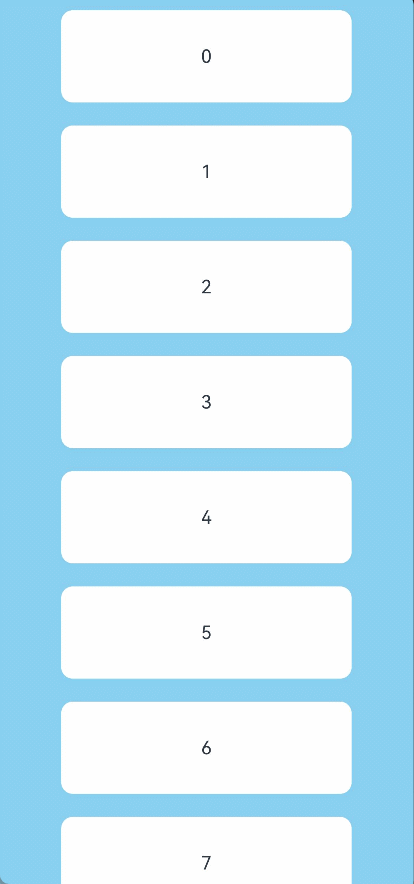
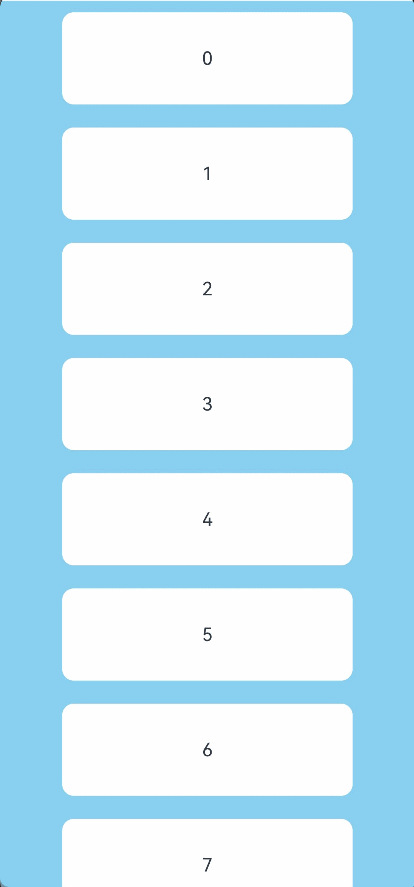
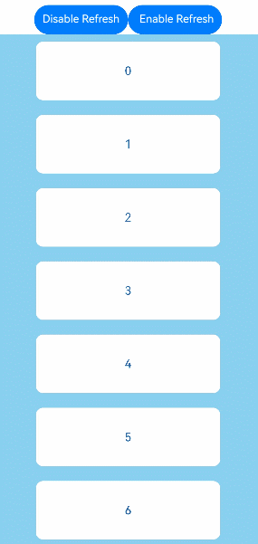
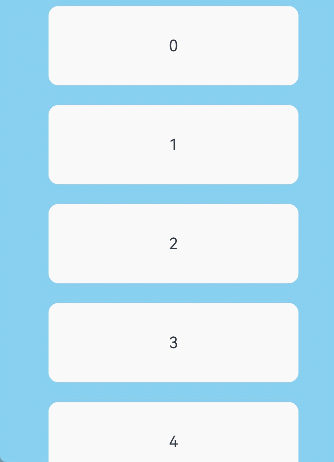

# Refresh

<!--Kit: ArkUI-->
<!--Subsystem: ArkUI-->
<!--Owner: @rongShao-Z; @yangcan18-->
<!--Designer: @yangcan18-->
<!--Tester: @leiyuqian-->
<!--Adviser: @Brilliantry_Rui-->
<!-- md-trans-meta sourceCommit=da78d1d0fef30c934e6eea5cb9ebe0033208326a translatedAt=2026-08-19T07:02:32.837Z pushedAt=2026-08-20T10:45:03.040Z -->

**Refresh** is a container component that provides the pull-to-refresh interaction. It is suitable for scenarios where users need to trigger data updates, such as list data refresh and page content update. It supports custom refresh area display content and text, setting the pull-down offset and drag coefficient, controlling the maximum pull-down distance, and more. It can flexibly adapt to the pull-to-refresh requirements of different apps, delivering a consistent and smooth refresh experience.

>  **NOTE**
>
>  - This component is supported since API version 8. Updates will be marked with a superscript to indicate their earliest API version.
>
>  - Since API version 12, this component supports linkage with vertically scrolling [Swiper](ts-container-swiper.md) and [Web](../arkui-js/js-components-basic-web.md). When the [loop](ts-container-swiper.md#loop) attribute of [Swiper](ts-container-swiper.md) is set to **true**, **Refresh** cannot link with [Swiper](ts-container-swiper.md).
>
>  - When **Refresh** is nested with a [List](ts-container-list.md) component whose content is smaller than the component itself, and there are other components in between, the gesture may be responded to by the intermediate component, causing **Refresh** to fail to produce the pull-to-refresh effect. In this case, set the [alwaysEnabled](ts-container-scrollable-common.md#edgeeffectoptions11) parameter to **true**, and [List](ts-container-list.md) will respond to the gesture and drive the **Refresh** component to produce the pull-to-refresh effect through nested scrolling. For details, see [Example 9: Implementing Pull-to-Refresh in the Non-Full-Screen Scenario](#example-9-implementing-pull-to-refresh-in-the-non-full-screen-scenario).
>
>  - The component has built-in gestures for functions such as drag-follow scrolling. To add custom gesture operations, refer to [Gesture Blocking Enhancement](ts-gesture-blocking-enhancement.md).
>
>  - The component cannot perform pull-to-refresh by pressing and dragging with the mouse.

## Child Components

This component supports only one child component.

Since API version 11, this component's child component moves down with the pull-down gesture.

## APIs

Refresh(value: RefreshOptions)

Creates a **Refresh** container.

**Atomic service API**: This API can be used in atomic services since API version 11.

**System capability**: SystemCapability.ArkUI.ArkUI.Full

**Parameters**

| Name| Type| Mandatory| Description|
| -------- | -------- | -------- | -------- |
| value |  [RefreshOptions](#refreshoptions)| Yes| Parameters of the **Refresh** component.|

## RefreshOptions

Defines the options of the **Refresh** component.

**System capability**: SystemCapability.ArkUI.ArkUI.Full

<!--Table: 20%; 20%; 8%; 8%; 44%-->

| Name        | Type                                     | Read-Only  | Optional| Description                                    |
| ---------- | ---------------------------------------- | ---- | -- | ---------------------------------------- |
| refreshing | boolean                                  | No    | No | Whether the component is currently in the refresh state. The value **true** indicates that the component is refreshing, and **false** indicates that it is not refreshing.<br/>Default value: **false**<br/>This parameter supports two-way binding through [$$](../../../ui/state-management/arkts-two-way-sync.md). <br/>**Atomic service API:** This API can be used in atomic services since API version 11.|
| offset<sup>(deprecated)</sup>    | number&nbsp;\|&nbsp;string   | No    | Yes | Distance from the pull-down start point to the top of the component.<br/>Default value: **16**, in vp. When the type is string, the pixel unit must be explicitly specified, for example, '10px'. If the pixel unit is not specified, for example, '10', the unit is vp. <br/>**Note:** This parameter is supported since API version 8 and deprecated since API version 11. There is no substitute API.<br/>The value range of **offset** is [0vp, 64vp]. A value greater than **64vp** is processed as **64vp**. Percentage and negative values are not supported.|
| friction<sup>(deprecated)</sup>   | number&nbsp;\|&nbsp;string               | No    | Yes | Pull-down drag coefficient.<br/>Value range: [0, 100]. If the value is less than 0 or greater than 100, the default value is used.<br/>Default value: **62**<br/>-&nbsp;**0** indicates that the pull-to-refresh container does not follow the gesture pull-down.<br/>-&nbsp;**100** indicates that the pull-to-refresh container tightly follows the gesture pull-down.<br/>-&nbsp;A larger value indicates that the pull-to-refresh container responds more sensitively to the gesture pull-down.<br/>**Note:** This parameter is supported since API version 8 and deprecated since API version 11. You are advised to use [pullDownRatio](#pulldownratio12) instead. |
| builder<sup>10+</sup>    | [CustomBuilder](ts-types.md#custombuilder8) | No    | Yes | Custom refresh area display content.<br/>**NOTE**<br/>When this parameter is set together with the **refreshingContent** parameter, this parameter does not take effect. When this parameter is used to customize the refresh area display content, **promptText** is not displayed.<br/>In API version 10 and earlier, the height of the custom component is limited to 64vp. In API version 11 and later, this restriction does not apply. <br/>If the custom component has a fixed height, it is displayed below the refresh area at the fixed height. If the custom component has no height set, its height adapts to the refresh area height and changes to 0 as the refresh area height changes. You are advised to set a minimum height constraint for the custom component to prevent its height from being smaller than expected. For details, see [Example 3](#example-3-customizing-the-refreshing-area-content-with-builder). <br/>Since API version 12, you are advised to use the **refreshingContent** parameter instead of the **builder** parameter to customize the refresh area display content, so as to avoid animation interruption caused by the destruction and reconstruction of the custom component during refresh.<br/>**Atomic service API:** This API can be used in atomic services since API version 11.<br/>**Model restriction:** This API can be used only in the stage model.|
| promptText<sup>12+</sup> | [ResourceStr](ts-types.md#resourcestr) | No | Yes | Custom text displayed at the bottom of the refresh area. If this parameter is not set, the text is not displayed.<br/>**NOTE**<br/>For restrictions on the input text, see the **Text** component. When the **builder** or **refreshingContent** parameter is used to customize the refresh area display content, **promptText** is not displayed.<br/>When **promptText** is set and takes effect, the default value of the [refreshOffset](#refreshoffset12) attribute is **96vp**.<br/>The maximum font scale [maxFontScale](ts-basic-components-text.md#maxfontscale12) of the custom text is **2**.<br/>The maximum number of lines of the custom text is 1, and the excess part is truncated with an ellipsis (...). If a multi-line prompt is required, customize the refresh area display content through the **builder** or **refreshingContent** parameter.<br/>**Atomic service API:** This API can be used in atomic services since API version 12.<br/>**Model restriction:** This API can be used only in the stage model.|
| refreshingContent<sup>12+</sup>    | [ComponentContent](../js-apis-arkui-ComponentContent.md) | No    | Yes | Custom refresh area display content.<br/>**NOTE**<br/>When this parameter is set together with the **builder** parameter, the **builder** parameter does not take effect. When this parameter is used to customize the refresh area display content, **promptText** is not displayed.<br/>If the custom component has a fixed height, it is displayed below the refresh area at the fixed height. If the custom component has no height set, its height adapts to the refresh area height and changes to **0** as the refresh area height changes. You are advised to set a minimum height constraint for the custom component to prevent its height from being smaller than expected. For details, see [Example 4](#example-4-customizing-the-refreshing-area-content-with-refreshingcontent). <br/>**Atomic service API:** This API can be used in atomic services since API version 12.<br/>**Model restriction:** This API can be used only in the stage model.|

>  **NOTE**
>  - When neither **builder** nor **refreshingContent** is set, the pull-down displacement effect is implemented by updating the [translate](ts-universal-attributes-transformation.md#translate) attribute of the child component. During the pull-down displacement, the [onAreaChange](ts-universal-component-area-change-event.md#onareachange) event of the child component is not triggered. The [translate](ts-universal-attributes-transformation.md#translate) attribute set on the child component does not take effect.
>  - When **builder** or **refreshingContent** is set, the pull-down displacement effect is implemented by updating the position of the child component relative to the **Refresh** component. During the pull-down displacement, the [onAreaChange](ts-universal-component-area-change-event.md#onareachange) event of the child component can be triggered. When the [position](ts-universal-attributes-location.md#position) attribute is set on the child component, the position of the child component relative to the **Refresh** component is fixed, causing the child component not to follow the pull-down displacement.
>  - When the custom component set through the **builder** parameter has no width or height specified, its size adapts to the child component. When the width is specified but the height is not, its height adapts to the pull-down distance. If the custom component set through the **refreshingContent** parameter has no height specified, its height also adapts to the pull-down distance. When the height of the custom component adapts to the pull-down distance, the height of the component increases as the pull-down distance increases. When the height of the custom component is set to a fixed value or adapts to the maximum height, the spacing between the custom component and the upper boundary of the **Refresh** component increases as the pull-down distance increases.

## Attributes

In addition to the [universal attributes](ts-component-general-attributes.md), the following attributes are supported.

### refreshOffset<sup>12+</sup>

refreshOffset(value: number)

Sets the minimum pull-down offset required to trigger a refresh. If the distance pulled down is less than the value specified by this attribute, releasing the gesture does not trigger a refresh.

**Atomic service API**: This API can be used in atomic services since API version 12.

**Model restriction**: This API can be used only in the stage model.

**System capability**: SystemCapability.ArkUI.ArkUI.Full

**Parameters**

| Name| Type                                       | Mandatory| Description                                                      |
| ------ | ------------------------------------------- | ---- | ---------------------------------------------------------- |
| value  | number |  Yes | Pull-down offset, in vp.<br/>Value range: (0, +∞).<br/>Default value: 64 vp when the [promptText](#refreshoptions) parameter is not set, and 96 vp when the [promptText](#refreshoptions) parameter is set. <br/>If the value is **0** or a negative number, the default value is used.|

### refreshOffset

refreshOffset(value: number | Resource)

Sets the pull-down offset that triggers the refresh. When the pull-down distance is less than the value of this attribute, releasing the pull-down gesture does not trigger the refresh. The resource type is supported.

If this API and [promptText](#refreshoptions) are not set, the default offset is 64 vp. If [promptText](#refreshoptions) is set, the default offset is 96 vp.

**Since:** 26.0.0

**Model restriction:** This API can be used only in the stage model.

**Atomic service API:** This API can be used in atomic services since API version 26.0.0.

**System capability**: SystemCapability.ArkUI.ArkUI.Full

**Parameters**

| Name| Type                                       | Mandatory| Description                                                      |
| ------ | ------------------------------------------- | ---- | ---------------------------------------------------------- |
| value  | number \| [Resource](ts-types.md#resource) |  Yes | Pull-down offset.<br/>Unit: vp<br/>Value range: (0, +∞).<br/>Default value: 64vp when the [promptText](#refreshoptions) parameter is not set, and 96vp when the [promptText](#refreshoptions) parameter is set.<br/>If the value is **0** or a negative number, the default value is used.|

### pullToRefresh<sup>12+</sup>

pullToRefresh(value: boolean)

Sets whether to initiate a refresh when the pull-down distance exceeds the value of [refreshOffset](#refreshoffset12).

**Atomic service API**: This API can be used in atomic services since API version 12.

**Model restriction**: This API can be used only in the stage model.

**System capability**: SystemCapability.ArkUI.ArkUI.Full

**Parameters**

| Name| Type                                       | Mandatory| Description                                                      |
| ------ | ------------------------------------------- | ---- | ---------------------------------------------------------- |
| value  | boolean |  Yes| Whether to initiate a refresh when the pull-down distance exceeds the value of [refreshOffset](#refreshoffset12). The value **true** means to initiate a refresh, and **false** means the opposite.<br>Default value: **true**|

### pullUpToCancelRefresh<sup>23+</sup>

pullUpToCancelRefresh(enabled: boolean | undefined)

Sets whether to cancel refresh when swiping up.

**Atomic service API**: This API can be used in atomic services since API version 23.

**Model restriction**: This API can be used only in the stage model.

**System capability**: SystemCapability.ArkUI.ArkUI.Full

**Parameters**

| Name | Type                | Mandatory| Description                                                        |
| ------- | -------------------- | ---- | ------------------------------------------------------------ |
| enabled | boolean \| undefined | Yes | Whether to cancel refresh when swiping up.<br/>The value **true** indicates cancel refresh, and **false** indicates not cancel refresh.<br/>Default value: **true**. If the value is **undefined**, the default value is used. |

### pullDownRatio<sup>12+</sup>

pullDownRatio(ratio: [Optional](ts-universal-attributes-custom-property.md#optionalt)\<number>)

Sets the pull-down ratio.

**Atomic service API**: This API can be used in atomic services since API version 12.

**Model restriction**: This API can be used only in the stage model.

**System capability**: SystemCapability.ArkUI.ArkUI.Full

**Parameters**

| Name| Type                                       | Mandatory| Description                                                      |
| ------ | ------------------------------------------- | ---- | ---------------------------------------------------------- |
| ratio  | [Optional](ts-universal-attributes-custom-property.md#optionalt)\<number> |  Yes | Pull-down ratio. A larger value indicates a more sensitive response to the pull-down gesture. The value **0** indicates that the component does not follow the pull-down gesture, and **1** indicates that it follows the pull-down gesture proportionally.<br/>If this parameter is not set or is set to **undefined**, a dynamic pull-down ratio is used by default: the larger the pull-down distance, the smaller the pull-down ratio.<br/>Value range: [0, 1]. A value less than 0 is treated as 0, and a value greater than 1 is treated as 1. |

### maxPullDownDistance<sup>20+</sup>

maxPullDownDistance(distance: Optional\<number>)

Sets the maximum pull-down distance.

**Atomic service API**: This API can be used in atomic services since API version 20.

**Model restriction**: This API can be used only in the stage model.

**System capability**: SystemCapability.ArkUI.ArkUI.Full

**Parameters**

| Name| Type                                       | Mandatory| Description                                                      |
| ------ | ------------------------------------------- | ---- | ---------------------------------------------------------- |
| distance  | [Optional](ts-universal-attributes-custom-property.md#optionalt)\<number> |  Yes | Maximum pull-down distance.<br/>Value range: [0, +∞). A value less than 0 is treated as 0. When this value is less than the pull-down offset **refreshOffset** for refresh, releasing the pull-down gesture on **Refresh** does not trigger refresh.<br/>**undefined** and **null** are treated as if this attribute is not set.<br/>Default value: **undefined**<br/>Unit: vp |

### maxPullDownDistance

maxPullDownDistance(distance: number | Resource | undefined)

Sets the maximum pull-down distance. The resource type is supported.

If this API is not set, the maximum pull-down distance is **undefined**.

**Since:** 26.0.0

**Model restriction:** This API can be used only in the stage model.

**Atomic service API:** This API can be used in atomic services since API version 26.0.0.

**System capability**: SystemCapability.ArkUI.ArkUI.Full

**Parameters**

| Name| Type                                       | Mandatory| Description                                                      |
| ------ | ------------------------------------------- | ---- | ---------------------------------------------------------- |
| distance  | number \| [Resource](ts-types.md#resource) \| undefined |  Yes| Maximum pull-down distance.<br>Default value: **undefined**.<br>Unit: vp<br>Value range: [0, +∞). If the value is less than 0, **0** is used. If this value is less than the [refreshOffset](#refreshoffset12), the refresh action will not be triggered when the pull-down gesture is released.<br>If this parameter is set to **undefined** or **null**, it is considered that this attribute is not set, meaning there is no limit on the maximum pull-down distance.|

## Events

In addition to the [universal events](ts-component-general-events.md), the following events are supported.

### onStateChange

onStateChange(callback: (state: RefreshStatus) => void)

Called when the refresh status changes.

**Atomic service API**: This API can be used in atomic services since API version 11.

**System capability**: SystemCapability.ArkUI.ArkUI.Full

**Parameters**

| Name| Type                                   | Mandatory| Description      |
| ------ | --------------------------------------- | ---- | ---------- |
| state  | [RefreshStatus](#refreshstatus) | Yes  | Refresh status.|

### onRefreshing

onRefreshing(callback: () => void)

Triggered when the component enters the refresh state. It is equivalent to the case where **state** is **Refresh** in the **onStateChange** callback. If you only need to listen for the start of refresh, use **onRefreshing** for simplicity. If you need to track all refresh state changes (**Inactive**, **Drag**, **OverDrag**, **Refresh**, **Done**), use **onStateChange**.

**Atomic service API**: This API can be used in atomic services since API version 11.

**System capability**: SystemCapability.ArkUI.ArkUI.Full

**Parameters**

| Name| Type| Mandatory| Description|
| ------ | ------ | ------ | ------|
| callback | () => void | Yes| Callback triggered when the component enters the refresh state.|

### onOffsetChange<sup>12+</sup>

onOffsetChange(callback: Callback\<number>)

Called when the pull-down distance changes.

>**NOTE**
>
> This API can be called within [attributeModifier](ts-universal-attributes-attribute-modifier.md#attributemodifier) since API version 20.

**Atomic service API**: This API can be used in atomic services since API version 12.

**Model restriction**: This API can be used only in the stage model.

**System capability**: SystemCapability.ArkUI.ArkUI.Full

**Parameters**

| Name| Type                                   | Mandatory| Description      |
| ------ | --------------------------------------- | ---- | ---------- |
| callback  | Callback\<number> | Yes  | Callback used to listen for the pull-down distance changes. It is triggered when the pull-down distance changes and returns the current pull-down distance.<br>Unit: vp|

## RefreshStatus

Enumerates the states of a refresh operation.

**Atomic service API**: This API can be used in atomic services since API version 11.

**System capability**: SystemCapability.ArkUI.ArkUI.Full

| Name      | Value      | Description                |
| -------- | -------- | -------------------- |
| Inactive | 0 | The component is not pulled down. This is the default value.            |
| Drag     | 1 | The component is being pulled down, but the pull-down distance is shorter than the refresh threshold.<br>If you release the component, it enters the **Inactive** state. If you continue to pull down the component and the pull-down distance exceeds the refresh threshold, the component enters the **OverDrag** state.  |
| OverDrag | 2 | The component is being pulled down, and the pull-down distance exceeds the refresh threshold.<br>If you release the component, the component enters the **Refresh** state. If you swipe upward and the pull-down distance is less than the refresh threshold, the component enters the **Drag** state.     |
| Refresh  | 3 | The pull-down ends, and the component rebounds to the minimum length required to trigger the refresh and enters the refreshing state.|
| Done     | 4 | The refresh is complete, and the component returns to the initial state (at the top).    |

## Example

### Example 1: Using the Default Refreshing Style

This example implements a **Refresh** component with its refreshing area in the default style.

```ts
// xxx.ets
@Entry
@Component
struct RefreshExample {
  @State isRefreshing: boolean = false;
  @State arr: string[] = ['0', '1', '2', '3', '4', '5', '6', '7', '8', '9', '10'];

  build() {
    Column() {
      Row() {
        Button('Refresh').onClick(() => {
          this.isRefreshing = true;
        })
        Button('Stop').onClick(() => {
          this.isRefreshing = false;
        })
      }

      Refresh({ refreshing: $$this.isRefreshing }) {
        List() {
          ForEach(this.arr, (item: string) => {
            ListItem() {
              Text('' + item)
                .width('70%')
                .height(80)
                .fontSize(16)
                .margin(10)
                .textAlign(TextAlign.Center)
                .borderRadius(10)
                .backgroundColor(0xFFFFFF)
            }
          }, (item: string) => item)
        }
        .onScrollIndex((first: number) => {
          console.info(first.toString());
        })
        .width('100%')
        .height('100%')
        .alignListItem(ListItemAlign.Center)
        .scrollBar(BarState.Off)
      }
      .onStateChange((refreshStatus: RefreshStatus) => {
        console.info('Refresh onStateChange state is ' + refreshStatus);
      })
      .onOffsetChange((value: number) => {
        console.info('Refresh onOffsetChange offset:' + value);
      })
      .onRefreshing(() => {
        setTimeout(() => {
          this.isRefreshing = false;
        }, 2000)
        console.info('onRefreshing test');
      })
      .backgroundColor(0x89CFF0)
      .refreshOffset(64)
      .pullToRefresh(true)
    }
  }
}
```



### Example 2: Setting the Text Displayed in the Refreshing Area

This example shows how to set the text displayed in the refreshing area using the [promptText](#refreshoptions) parameter.

```ts
// xxx.ets
@Entry
@Component
struct RefreshExample {
  @State isRefreshing: boolean = false;
  @State promptText: string = 'Refreshing...';
  @State arr: string[] = ['0', '1', '2', '3', '4', '5', '6', '7', '8', '9', '10'];

  build() {
    Column() {
      Refresh({ refreshing: $$this.isRefreshing, promptText: this.promptText }) {
        List() {
          ForEach(this.arr, (item: string) => {
            ListItem() {
              Text(item)
                .width('70%')
                .height(80)
                .fontSize(16)
                .margin(10)
                .textAlign(TextAlign.Center)
                .borderRadius(10)
                .backgroundColor(0xFFFFFF)
            }
          }, (item: string) => item)
        }
        .onScrollIndex((first: number) => {
          console.info(first.toString());
        })
        .width('100%')
        .height('100%')
        .alignListItem(ListItemAlign.Center)
        .scrollBar(BarState.Off)
      }
      .backgroundColor(0x89CFF0)
      .pullToRefresh(true)
      .refreshOffset(96)
      .onStateChange((refreshStatus: RefreshStatus) => {
        console.info('Refresh onStateChange state is ' + refreshStatus);
      })
      .onOffsetChange((value: number) => {
        console.info('Refresh onOffsetChange offset:' + value);
      })
      .onRefreshing(() => {
        setTimeout(() => {
          this.isRefreshing = false;
        }, 2000)
        console.info('onRefreshing test');
      })
    }
  }
}
```


### Example 3: Customizing the Refreshing Area Content with builder

This example shows how to customize the content displayed in the refreshing area using the [builder](#refreshoptions) parameter.

```ts
// xxx.ets
@Entry
@Component
struct RefreshExample {
  @State isRefreshing: boolean = false;
  @State arr: string[] = ['0', '1', '2', '3', '4', '5', '6', '7', '8', '9', '10'];

  @Builder
  customRefreshComponent() {
    Stack() {
      Row() {
        LoadingProgress().height(32)
        Text('Refreshing...').fontSize(16).margin({ left: 20 })
      }
      .alignItems(VerticalAlign.Center)
    }
    .align(Alignment.Center)
    .clip(true)
    // Set a minimum height constraint to ensure that the height of the custom component does not fall below the specified minHeight when the height of the refreshing area changes.
    .constraintSize({ minHeight: 32 })
    .width('100%')
  }

  build() {
    Column() {
      Refresh({ refreshing: $$this.isRefreshing, builder: this.customRefreshComponent() }) {
        List() {
          ForEach(this.arr, (item: string) => {
            ListItem() {
              Text('' + item)
                .width('70%')
                .height(80)
                .fontSize(16)
                .margin(10)
                .textAlign(TextAlign.Center)
                .borderRadius(10)
                .backgroundColor(0xFFFFFF)
            }
          }, (item: string) => item)
        }
        .onScrollIndex((first: number) => {
          console.info(first.toString());
        })
        .width('100%')
        .height('100%')
        .alignListItem(ListItemAlign.Center)
        .scrollBar(BarState.Off)
      }
      .backgroundColor(0x89CFF0)
      .pullToRefresh(true)
      .refreshOffset(64)
      .onStateChange((refreshStatus: RefreshStatus) => {
        console.info('Refresh onStateChange state is ' + refreshStatus);
      })
      .onRefreshing(() => {
        setTimeout(() => {
          this.isRefreshing = false;
        }, 2000)
        console.info('onRefreshing test');
      })
    }
  }
}
```


### Example 4: Customizing the Refreshing Area Content with refreshingContent

This example shows how to customize the content displayed in the refreshing area using the [refreshingContent](#refreshoptions) parameter.

```ts
// xxx.ets
import { ComponentContent } from '@kit.ArkUI';

class Params {
  refreshStatus: RefreshStatus = RefreshStatus.Inactive;

  constructor(refreshStatus: RefreshStatus) {
    this.refreshStatus = refreshStatus;
  }
}

@Builder
function customRefreshingContent(params: Params) {
  Stack() {
    Row() {
      LoadingProgress().height(32)
      Text('refreshStatus: ' + params.refreshStatus).fontSize(16).margin({ left: 20 })
    }
    .alignItems(VerticalAlign.Center)
  }
  .align(Alignment.Center)
  .clip(true)
  // Set a minimum height constraint to ensure that the height of the custom component does not fall below the specified minHeight when the height of the refreshing area changes.
  .constraintSize({ minHeight: 32 })
  .width('100%')
}

@Entry
@Component
struct RefreshExample {
  @State isRefreshing: boolean = false;
  @State arr: string[] = ['0', '1', '2', '3', '4', '5', '6', '7', '8', '9', '10'];
  @State refreshStatus: RefreshStatus = RefreshStatus.Inactive;
  private contentNode?: ComponentContent<Object> = undefined;
  private params: Params = new Params(RefreshStatus.Inactive);

  aboutToAppear(): void {
    let uiContext = this.getUIContext();
    this.contentNode = new ComponentContent(uiContext, wrapBuilder(customRefreshingContent), this.params);
  }

  build() {
    Column() {
      Refresh({ refreshing: $$this.isRefreshing, refreshingContent: this.contentNode }) {
        List() {
          ForEach(this.arr, (item: string) => {
            ListItem() {
              Text('' + item)
                .width('70%')
                .height(80)
                .fontSize(16)
                .margin(10)
                .textAlign(TextAlign.Center)
                .borderRadius(10)
                .backgroundColor(0xFFFFFF)
            }
          }, (item: string) => item)
        }
        .onScrollIndex((first: number) => {
          console.info(first.toString());
        })
        .width('100%')
        .height('100%')
        .alignListItem(ListItemAlign.Center)
        .scrollBar(BarState.Off)
      }
      .backgroundColor(0x89CFF0)
      .pullToRefresh(true)
      .refreshOffset(96)
      .onStateChange((refreshStatus: RefreshStatus) => {
        this.refreshStatus = refreshStatus;
        this.params.refreshStatus = refreshStatus;
        // Update the content of the custom component.
        this.contentNode?.update(this.params);
        console.info('Refresh onStateChange state is ' + refreshStatus);
      })
      .onRefreshing(() => {
        setTimeout(() => {
          this.isRefreshing = false;
        }, 2000)
        console.info('onRefreshing test');
      })
    }
  }
}
```



### Example 5: Implementing the Maximum Pull-down Distance

This example shows how to use the [pullDownRatio](#pulldownratio12) attribute and the [onOffsetChange](#onoffsetchange12) event to implement the maximum pull-down distance.

```ts
// xxx.ets
import { ComponentContent } from '@kit.ArkUI';

@Builder
function customRefreshingContent() {
  Stack() {
    Row() {
      LoadingProgress().height(32)
    }
    .alignItems(VerticalAlign.Center)
  }
  .align(Alignment.Center)
  .clip(true)
  // Set a minimum height constraint to ensure that the height of the custom component does not fall below the specified minHeight when the height of the refreshing area changes.
  .constraintSize({ minHeight: 32 })
  .width('100%')
}

@Entry
@Component
struct RefreshExample {
  @State isRefreshing: boolean = false;
  @State arr: string[] = ['0', '1', '2', '3', '4', '5', '6', '7', '8', '9', '10'];
  @State maxRefreshingHeight: number = 100.0;
  @State ratio: number = 1;
  private contentNode?: ComponentContent<Object> = undefined;

  aboutToAppear(): void {
    let uiContext = this.getUIContext();
    this.contentNode = new ComponentContent(uiContext, wrapBuilder(customRefreshingContent));
  }

  build() {
    Column() {
      Refresh({ refreshing: $$this.isRefreshing, refreshingContent: this.contentNode }) {
        List() {
          ForEach(this.arr, (item: string) => {
            ListItem() {
              Text('' + item)
                .width('70%')
                .height(80)
                .fontSize(16)
                .margin(10)
                .textAlign(TextAlign.Center)
                .borderRadius(10)
                .backgroundColor(0xFFFFFF)
            }
          }, (item: string) => item)
        }
        .onScrollIndex((first: number) => {
          console.info(first.toString());
        })
        .width('100%')
        .height('100%')
        .alignListItem(ListItemAlign.Center)
        .scrollBar(BarState.Off)
      }
      .backgroundColor(0x89CFF0)
      .pullDownRatio(this.ratio)
      .pullToRefresh(true)
      .refreshOffset(64)
      .onOffsetChange((offset: number) => {
        // The closer to the maximum distance, the smaller the pull-down ratio.
        this.ratio = 1 - Math.pow((offset / this.maxRefreshingHeight), 3);
      })
      .onStateChange((refreshStatus: RefreshStatus) => {
        console.info('Refresh onStateChange state is ' + refreshStatus);
      })
      .onRefreshing(() => {
        setTimeout(() => {
          this.isRefreshing = false;
        }, 2000)
        console.info('onRefreshing test');
      })
    }
  }
}
```


### Example 6: Implementing Pull-Down-to-Refresh and Pull-Up-to-Load-More

This example demonstrates how to combine the **Refresh** component with the [List](ts-container-list.md) component to implement pull-down-to-refresh and pull-up-to-load-more features.

```ts
// xxx.ets
@Entry
@Component
struct ListRefreshLoad {
  @State arr: Array<number> = [0, 1, 2, 3, 4, 5, 6, 7, 8, 9, 10];
  @State refreshing: boolean = false;
  @State refreshOffset: number = 0;
  @State refreshState: RefreshStatus = RefreshStatus.Inactive;
  @State isLoading: boolean = false;

  @Builder
  refreshBuilder() {
    Stack({ alignContent: Alignment.Bottom }) {
      // The Progress component is displayed based on the refresh state.
      // It is only shown when the refresh state is Drag or Refresh.
      if (this.refreshState != RefreshStatus.Inactive && this.refreshState != RefreshStatus.Done) {
        Progress({ value: this.refreshOffset, total: 64, type: ProgressType.Ring })
          .width(32).height(32)
          .style({ status: this.refreshing ? ProgressStatus.LOADING : ProgressStatus.PROGRESSING })
          .margin(10)
      }
    }
    .clip(true)
    .height('100%')
    .width('100%')
  }

  @Builder
  footer() {
    Row() {
      LoadingProgress().height(32).width(48)
      Text('Loading')
    }.width('100%')
    .height(64)
    .justifyContent(FlexAlign.Center)
    // The component is hidden when not in the loading state.
    .visibility(this.isLoading ? Visibility.Visible : Visibility.Hidden)
  }

  build() {
    Refresh({ refreshing: $$this.refreshing, builder: this.refreshBuilder() }) {
      List() {
        ForEach(this.arr, (item: number) => {
          ListItem() {
            Text('' + item)
              .width('100%')
              .height(80)
              .fontSize(16)
              .textAlign(TextAlign.Center)
              .backgroundColor(0xFFFFFF)
          }.borderWidth(1)
        }, (item: number) => item.toString())

        ListItem() {
          this.footer();
        }
      }
      .onScrollIndex((start: number, end: number) => {
        // Trigger new data loading when the end of the list is reached.
        if (end >= this.arr.length - 1) {
          this.isLoading = true;
          // Simulate new data loading.
          setTimeout(() => {
            for (let i = 0; i < 10; i++) {
              this.arr.push(this.arr.length);
            }
            this.isLoading = false;
          }, 700)
        }
      })
      .scrollBar(BarState.Off)
      // Enable the effect used when the scroll boundary is reached.
      .edgeEffect(EdgeEffect.Spring, { alwaysEnabled: true })
    }
    .width('100%')
    .height('100%')
    .backgroundColor(0xDCDCDC)
    .onOffsetChange((offset: number) => {
      this.refreshOffset = offset;
    })
    .onStateChange((state: RefreshStatus) => {
      this.refreshState = state;
    })
    .onRefreshing(() => {
      // Simulate data refreshing.
      setTimeout(() => {
        this.refreshing = false;
      }, 2000)
    })
  }
}
```


### Example 7: Setting the Maximum Pull-Down Distance

This example demonstrates how to set the maximum pull-down distance using the [maxPullDownDistance](#maxpulldowndistance20) attribute, supported since API version 20.

```ts
// xxx.ets
@Entry
@Component
struct RefreshExample {
  @State isRefreshing: boolean = false;
  @State arr: string[] = ['0', '1', '2', '3', '4', '5', '6', '7', '8', '9', '10'];

  build() {
    Column() {
      Refresh({ refreshing: $$this.isRefreshing }) {
        List() {
          ForEach(this.arr, (item: string) => {
            ListItem() {
              Text('' + item)
                .width('70%')
                .height(80)
                .fontSize(16)
                .margin(10)
                .textAlign(TextAlign.Center)
                .borderRadius(10)
                .backgroundColor(0xFFFFFF)
            }
          }, (item: string) => item)
        }
        .onScrollIndex((first: number) => {
          console.info(first.toString());
        })
        .width('100%')
        .height('100%')
        .alignListItem(ListItemAlign.Center)
        .scrollBar(BarState.Off)
      }
      .maxPullDownDistance(150)
      .onStateChange((refreshStatus: RefreshStatus) => {
        console.info('Refresh onStateChange state is ' + refreshStatus);
      })
      .onOffsetChange((value: number) => {
        console.info('Refresh onOffsetChange offset:' + value);
      })
      .onRefreshing(() => {
        setTimeout(() => {
          this.isRefreshing = false;
        }, 2000)
        console.info('onRefreshing test');
      })
      .backgroundColor(0x89CFF0)
      .refreshOffset(64)
      .pullToRefresh(true)
    }
  }
}

```


### Example 8: Disabling Pull-to-Refresh

This example demonstrates how to disable pull-to-refresh using the [pullDownRatio](#pulldownratio12) attribute.

```ts
// xxx.ets
@Entry
@Component
struct RefreshExample {
  @State isRefreshing: boolean = false;
  @State ratio: number | undefined = undefined;
  @State arr: string[] = ['0', '1', '2', '3', '4', '5', '6', '7', '8', '9', '10'];

  build() {
    Column() {
      Row() {
        Button('Disable Pull-to-Refresh').onClick(() => {
          this.ratio = 0;
        })
        Button('Enable Pull-to-Refresh').onClick(() => {
          this.ratio = undefined;
        })
      }
      Refresh({ refreshing: $$this.isRefreshing }) {
          List() {
            ForEach(this.arr, (item: string) => {
              ListItem() {
                Text('' + item)
                  .width('70%')
                  .height(80)
                  .fontSize(16)
                  .margin(10)
                  .textAlign(TextAlign.Center)
                  .borderRadius(10)
                  .backgroundColor(0xFFFFFF)
              }
            }, (item: string) => item)
          }
          .onScrollIndex((first: number) => {
            console.info(first.toString());
          })
          .width('100%')
          .height('100%')
          .alignListItem(ListItemAlign.Center)
          .scrollBar(BarState.Off)
      }
      .backgroundColor(0x89CFF0)
      .refreshOffset(64)
      .pullToRefresh(true)
      .pullDownRatio(this.ratio)
      .onStateChange((refreshStatus: RefreshStatus) => {
        console.info('Refresh onStateChange state is ' + refreshStatus);
      })
      .onOffsetChange((value: number) => {
        console.info('Refresh onOffsetChange offset:' + value);
      })
      .onRefreshing(() => {
        setTimeout(() => {
          this.isRefreshing = false;
        }, 2000)
        console.info('onRefreshing test');
      })
    }
  }
}
```



### Example 9: Implementing Pull-to-Refresh in the Non-Full-Screen Scenario

When calling [edgeEffect](ts-container-scrollable-common.md#edgeeffect11), set [alwaysEnabled](ts-container-scrollable-common.md#edgeeffectoptions11) of the **options** parameter to **true** to implement the pull-to-refresh effect of the **Refresh** component when the content is less than one screen.

```ts
// xxx.ets
@Entry
@Component
struct RefreshExample {
  @State isRefreshing: boolean = false;
  @State alwaysEnabled: boolean = false;

  build() {
    Column() {
      Refresh({ refreshing: $$this.isRefreshing }) {
        Column() {
          List() {
            ListItem() {
              Text('alwaysEnabled:' + this.alwaysEnabled)
                .width('70%')
                .height(80)
                .fontSize(16)
                .margin(10)
                .textAlign(TextAlign.Center)
                .borderRadius(10)
                .backgroundColor(0xFFFFFF)
                .onClick(() => {
                  this.alwaysEnabled = !this.alwaysEnabled;
                })
            }
          }
          .width('100%')
          .height('100%')
          .alignListItem(ListItemAlign.Center)
          .scrollBar(BarState.Auto)
          // If the content size of the List component is smaller than the component size and alwaysEnabled is set to false, the List component does not respond to gestures. In this case, the gestures are responded by the Column component, and the pull-to-refresh effect is not generated.
          // If alwaysEnabled is set to true, the List component responds to gestures and drives the Refresh component to trigger pull-down refresh through nested scrolling.
          .edgeEffect(EdgeEffect.Spring, { alwaysEnabled: this.alwaysEnabled })
        }
        .gesture(
          PanGesture({ direction: PanDirection.Vertical })
        )
      }
      .onStateChange((refreshStatus: RefreshStatus) => {
        console.info('Refresh onStateChange state is ' + refreshStatus);
      })
      .onOffsetChange((value: number) => {
        console.info('Refresh onOffsetChange offset:' + value);
      })
      .onRefreshing(() => {
        setTimeout(() => {
          this.isRefreshing = false;
        }, 2000)
      })
      .backgroundColor(0x89CFF0)
      .refreshOffset(64)
      .pullToRefresh(true)
    }
  }
}
```


### Example 10: Pull-Up Without Cancelling Refresh

This example uses the [pullUpToCancelRefresh](#pulluptocancelrefresh23) API to configure pull-up without canceling refresh.

The **pullUpToCancelRefresh** API is supported since API version 23.

```ts
// xxx.ets
import { ComponentContent } from '@kit.ArkUI';

class Params {
  refreshStatus: RefreshStatus = RefreshStatus.Inactive;

  constructor(refreshStatus: RefreshStatus) {
    this.refreshStatus = refreshStatus;
  }
}

@Builder
function customRefreshingContent(params: Params) {
  Stack() {
    Row() {
      LoadingProgress().height(32)
      Text('refreshStatus: ' + params.refreshStatus).fontSize(16).margin({ left: 20 })
    }
    .alignItems(VerticalAlign.Center)
  }
  .align(Alignment.Center)
  .clip(true)
  .constraintSize({ minHeight: 32 })
  .width('100%')
}

@Entry
@Component
struct RefreshExample {
  @State isRefreshing: boolean = false;
  @State arr: string[] = ['0', '1', '2', '3', '4', '5', '6', '7', '8', '9', '10'];
  @State refreshStatus: RefreshStatus = RefreshStatus.Inactive;
  private contentNode?: ComponentContent<Object> = undefined;
  private params: Params = new Params(RefreshStatus.Inactive);

  aboutToAppear(): void {
    let uiContext = this.getUIContext();
    this.contentNode = new ComponentContent(uiContext, wrapBuilder(customRefreshingContent), this.params);
  }

  build() {
    Column() {
      Refresh({ refreshing: $$this.isRefreshing, refreshingContent: this.contentNode }) {
        List() {
          ForEach(this.arr, (item: string) => {
            ListItem() {
              Text('' + item)
                .width('70%')
                .height(80)
                .fontSize(16)
                .margin(10)
                .textAlign(TextAlign.Center)
                .borderRadius(10)
                .backgroundColor(0xFFFFFF)
            }
          }, (item: string) => item)
        }
        .onScrollIndex((first: number) => {
          console.info(first.toString());
        })
        .width('100%')
        .height('100%')
        .alignListItem(ListItemAlign.Center)
        .scrollBar(BarState.Off)
      }
      .backgroundColor(0x89CFF0)
      .pullToRefresh(true)
      .pullUpToCancelRefresh(false)
      .refreshOffset(96)
      .onStateChange((refreshStatus: RefreshStatus) => {
        this.refreshStatus = refreshStatus;
        this.params.refreshStatus = refreshStatus;
        this.contentNode?.update(this.params);
        console.info('Refresh onStateChange state is ' + refreshStatus);
      })
      .onRefreshing(() => {
        // Simulate refresh data and generate new consecutive data items.
        setTimeout(() => {
          const newArr: string[] = [];
          const lastNum = parseInt(this.arr[this.arr.length - 1]);
          for (let i = 0; i < 11; i++) {
            newArr.push((lastNum + 1 + i).toString());
          }
          this.arr = newArr;

          this.isRefreshing = false;
        }, 6000)
        console.info('onRefreshing test');
      })
    }
  }
}
```

