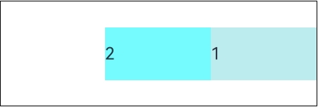

# Row

<!--Kit: ArkUI-->
<!--Subsystem: ArkUI-->
<!--Owner: @camlostshi-->
<!--Designer: @fenglinbailu-->
<!--Tester: @liuli0427-->
<!--Adviser: @Brilliantry_Rui-->
<!-- md-trans-meta sourceCommit=502e92239007f618b3ae29831890f9b7e0bdd85e translatedAt=2026-08-19T07:10:16.443Z pushedAt=2026-08-20T10:45:03.045Z -->

Defines a container that lays out child components horizontally. It supports setting the spacing between child components and the alignment mode, and is suitable for scenarios where multiple child components need to be arranged horizontally, such as toolbars, tab bars, and button groups.

>  **NOTE**
>
>  This component is supported since API version 7. Updates will be marked with a superscript to indicate their earliest API version.
>
>  If no width or height is set for the **Row** component, it adapts to the size of child components in the main axis or cross axis direction.

## Child Components

Supported

## APIs

### Row

Row(options?: RowOptions)

Creates a horizontal linear layout container. You can set the spacing between child components.

>  **NOTE**
>
>  When using multi-component nesting in complex UIs, if layout components are nested too deeply or too many components are nested, additional overhead will be incurred. It is recommended to optimize performance by removing redundant nodes, using layout boundaries to reduce layout calculations, and properly adopting rendering control syntax and layout component methods.

**Widget capability**: This API can be used in ArkTS widgets since API version 9.

**Atomic service API**: This API can be used in atomic services since API version 11.

**System capability**: SystemCapability.ArkUI.ArkUI.Full

**Parameters**

| Name| Type| Mandatory| Description|
| -------- | -------- | -------- | -------- |
| options<sup>18+</sup> | [RowOptions](#rowoptions18) | No | Configuration object of the horizontal layout, used to set the spacing between child components (unit: vp). The **space** attribute supports values of the number or string type. Pass this parameter when you need to customize the spacing between child components. If this parameter is not passed, the default spacing is 0.<br>**Model restriction:** This API can be used only in the stage model.<br>**Note:** Since API version 9, the **space** attribute does not take effect when it is set to a negative value or when **justifyContent** is set to **FlexAlign.SpaceBetween**, **FlexAlign.SpaceAround**, or **FlexAlign.SpaceEvenly**. |

### Row<sup>18+</sup>

Row(options?: RowOptions | RowOptionsV2)

Creates a horizontal linear layout container. You can set the spacing between child components.

>  **NOTE**
>
>  When using multi-component nesting in complex UIs, if layout components are nested too deeply or too many components are nested, additional overhead will be incurred. It is recommended to optimize performance by removing redundant nodes, using layout boundaries to reduce layout calculations, and properly adopting rendering control syntax and layout component methods.

**Widget capability**: This API can be used in ArkTS widgets since API version 18.

**Atomic service API**: This API can be used in atomic services since API version 18.

**Model restriction**: This API can be used only in the stage model.

**System capability**: SystemCapability.ArkUI.ArkUI.Full

**Parameters**

| Name| Type| Mandatory| Description|
| -------- | -------- | -------- | -------- |
| options | [RowOptions](#rowoptions18) \| [RowOptionsV2](#rowoptionsv218) | No | Configuration object of the horizontal layout, used to set the spacing between child components (in vp). The space property supports values of the number, string, or Resource type. If not set, the default spacing is 0.<br>**Note:** Since API version 9, this property does not take effect when space is a negative number or **justifyContent** is set to **FlexAlign.SpaceBetween**, **FlexAlign.SpaceAround**, or **FlexAlign.SpaceEvenly**. |

## RowOptions<sup>18+</sup>

Sets the spacing between child components of the **Row** component.

> **NOTE**
>
> To standardize anonymous object definitions, the element definitions here have been revised in API version 18. While starting version information is preserved for historical anonymous objects, there may be cases where the outer element's @since version number is higher than inner element's. This does not affect interface usability.

**Widget capability**: This API can be used in ArkTS widgets since API version 18.

**Atomic service API**: This API can be used in atomic services since API version 18.

**Model restriction**: This API can be used only in the stage model.

**System capability**: SystemCapability.ArkUI.ArkUI.Full

| Name| Type| Read-Only| Optional| Description|
| -------- | -------- | -------- | -------- | -------- |
| space<sup>7+</sup> | string \| number | No | Yes | Spacing between child components in the horizontal layout.<br>Since API version 9, this attribute does not take effect when **space** is a negative number or **justifyContent** is set to **FlexAlign.SpaceBetween**, **FlexAlign.SpaceAround**, or **FlexAlign.SpaceEvenly**.<br>Default value: **0**<br>Unit: vp<br>Invalid value: the default value is used.<br>**NOTE**<br>The value of **space** is a number greater than or equal to 0, or a string that can be converted to a number.<br>**Widget capability:** This API can be used in ArkTS widgets since API version 9.<br>**Atomic service API:** This API can be used in atomic services since API version 11. |

## RowOptionsV2<sup>18+</sup>

Sets the spacing between child components of the **Row** component. The spacing type **SpaceType** can be of the number, string, or Resource type.

**Widget capability**: This API can be used in ArkTS widgets since API version 18.

**Atomic service API**: This API can be used in atomic services since API version 18.

**Model restriction**: This API can be used only in the stage model.

**System capability**: SystemCapability.ArkUI.ArkUI.Full

| Name| Type| Read-Only| Optional| Description|
| -------- | -------- | -------- | -------- | -------- |
| space | [SpaceType](ts-container-column.md#spacetype18) | No | Yes | Spacing between child components in the horizontal layout.<br>Value range: greater than or equal to 0.<br>Since API version 9, this parameter does not take effect when **justifyContent** is set to **FlexAlign.SpaceBetween**, **FlexAlign.SpaceAround**, or **FlexAlign.SpaceEvenly**.<br>Default value: **0**<br>Unit: vp<br>Invalid value: the default value is used.<br>**NOTE**<br>The value of **space** is a number greater than or equal to 0, a string that can be converted to a non-negative number, or a Resource type data that can be converted to a number. A negative number is treated as an invalid value and the default value 0 is used.|

## Attributes

In addition to the [universal attributes](ts-component-general-attributes.md), the following attributes are supported.

### alignItems

alignItems(value: VerticalAlign)

Sets the alignment format of child components in the vertical direction. After this attribute is set, child components are aligned in the specified manner in the vertical direction. By default, child components are vertically centered.

**Widget capability**: This API can be used in ArkTS widgets since API version 9.

**Atomic service API**: This API can be used in atomic services since API version 11.

**System capability**: SystemCapability.ArkUI.ArkUI.Full

**Parameters**

| Name| Type                                               | Mandatory| Description                                                        |
| ------ | --------------------------------------------------- | ---- | ------------------------------------------------------------ |
| value  | [VerticalAlign](ts-appendix-enums.md#verticalalign) | Yes   | Alignment format of child components in the vertical direction.<br>Default value: **VerticalAlign.Center** |

### justifyContent<sup>8+</sup>

justifyContent(value: FlexAlign)

Sets the alignment format of child components in the horizontal direction. After this attribute is set, child components are aligned in the specified manner in the horizontal direction. By default, child components are aligned at the start.

**Widget capability**: This API can be used in ArkTS widgets since API version 9.

**Atomic service API**: This API can be used in atomic services since API version 11.

**System capability**: SystemCapability.ArkUI.ArkUI.Full

**Parameters**

| Name| Type                                       | Mandatory| Description                                                      |
| ------ | ------------------------------------------- | ---- | ---------------------------------------------------------- |
| value  | [FlexAlign](ts-appendix-enums.md#flexalign) | Yes   | Alignment format of child components in the horizontal direction.<br>Default value: **FlexAlign.Start**<br>**Note:** Since API version 9, the **space** parameter does not take effect when **space** is a negative number or **justifyContent** is set to **FlexAlign.SpaceBetween**, **FlexAlign.SpaceAround**, or **FlexAlign.SpaceEvenly**. |

>  **NOTE**
>
>  In a Row layout, if child components do not have [flexShrink](ts-universal-attributes-flex-layout.md#flexshrink) set, they are not shrunk by default. That is, the sum of the main axis sizes of all child components may exceed the main axis of the container. In this case, the alignment behavior of **FlexAlign.Center** and **FlexAlign.End** changes, and the start position of child components is the same as that of **FlexAlign.Start**.

### reverse<sup>12+</sup>

reverse(isReversed: Optional<boolean\>)

Sets whether to reverse the arrangement order of child components in the horizontal direction. When set to **true**, child components are arranged from right to left; when set to **false**, child components are arranged from left to right. This is applicable to scenarios where the display order of child components needs to be dynamically adjusted, such as internationalization layout adaptation.

**Widget capability**: This API can be used in ArkTS widgets since API version 12.

**Atomic service API**: This API can be used in atomic services since API version 12.

**Model restriction**: This API can be used only in the stage model.

**System capability**: SystemCapability.ArkUI.ArkUI.Full

**Parameters**

| Name| Type                                       | Mandatory| Description                                                      |
| ------ | ------------------------------------------- | ---- | ---------------------------------------------------------- |
| isReversed  | [Optional](ts-universal-attributes-custom-property.md#optionalt)\<boolean\> | Yes   | Whether the arrangement order of child components in the horizontal direction is reversed.<br>The value **true** means that the child components are arranged in reverse order in the horizontal direction (from right to left), and the value **false** means that the child components are arranged in normal order in the horizontal direction (from left to right). If the parameter value is **undefined**, it is treated as **true**, and the main axis direction is reversed. |

>  **NOTE**
>
>  If the **reverse** attribute is not set, the main axis direction is not reversed. If the **reverse** attribute is set and the parameter value is **undefined**, the default value **true** is used, and the main axis direction is reversed. If the parameter value is **false**, the main axis direction is not reversed.<br>Since the main axis arrangement direction is affected by the universal attribute **direction**, if the **direction** attribute is set, when the **reverse** attribute is set to **true**, an additional reversal is always performed on the result of the direction attribute. If the **reverse** attribute is set to **false** or not set, the main axis direction is determined by the **direction** attribute without additional reversal.

## Events

The [universal events](ts-component-general-events.md) are supported.

## Examples

### Example 1: Setting the Layout Attributes of the Row Component

This example demonstrates the effect of setting the layout attributes (such as the spacing and alignment mode) of the **Row** component.

```json
// resources/base/element/string.json
{
  "string": [
    {
      "name": "stringSpace",
      "value": "5"
    }
  ]
}
```

```ts
// xxx.ets
@Entry
@Component
struct RowExample {
  build() {
    Column({ space: 5 }) {
      // Set the horizontal spacing between two adjacent child components to 5.
      Text('space').width('90%')
      Row({ space: 5 }) {
        Row().width('30%').height(50).backgroundColor(0xAFEEEE)
        Row().width('30%').height(50).backgroundColor(0x00FFFF)
      }.width('90%').height(107).border({ width: 1 })

      // Set the spacing between child components using the Resource type.
      Text('Resource space').width('90%')
      // Set the space attribute by using a resource reference (supported since API 18+).
      Row({ space: $r('app.string.stringSpace') }) {
        Row().width('30%').height(50).backgroundColor(0xAFEEEE)
        Row().width('30%').height(50).backgroundColor(0x00FFFF)
      }.width('90%').height(107).border({ width: 1 })

      // Set the vertical alignment of child components.
      Text('alignItems(Bottom)').width('90%')
      // Align child components to the bottom.
      Row() {
        Row().width('30%').height(50).backgroundColor(0xAFEEEE)
        Row().width('30%').height(50).backgroundColor(0x00FFFF)
      }.width('90%').alignItems(VerticalAlign.Bottom).height('15%').border({ width: 1 })

      Text('alignItems(Center)').width('90%')
      // Align child components vertically to the center.
      Row() {
        Row().width('30%').height(50).backgroundColor(0xAFEEEE)
        Row().width('30%').height(50).backgroundColor(0x00FFFF)
      }.width('90%').alignItems(VerticalAlign.Center).height('15%').border({ width: 1 })

      // Set the horizontal alignment of child components.
      Text('justifyContent(End)').width('90%')
      // Align child components to the right.
      Row() {
        Row().width('30%').height(50).backgroundColor(0xAFEEEE)
        Row().width('30%').height(50).backgroundColor(0x00FFFF)
      }.width('90%').border({ width: 1 }).justifyContent(FlexAlign.End)

      Text('justifyContent(Center)').width('90%')
      // Align child components horizontally to the center.
      Row() {
        Row().width('30%').height(50).backgroundColor(0xAFEEEE)
        Row().width('30%').height(50).backgroundColor(0x00FFFF)
      }.width('90%').border({ width: 1 }).justifyContent(FlexAlign.Center)
    }.width('100%')
  }
}
```


### Example 2: Configuring the Reverse Attribute

This example shows the effect after setting the **reverse** attribute of the **Row** component, demonstrating how to reverse the arrangement order of child components.

```ts
@Entry
@Component
struct RowReverseSample {
  build() {
    Row() {
      Text('1')
        .width(100)
        .height(50)
        .backgroundColor(0xAFEEEE)

      Text('2')
        .width(100)
        .height(50)
        .backgroundColor(0x00FFFF)
    }
    .height(100)
    .width(300)
    .border({ width: 1 })
    .reverse(true)
  }
}
```

