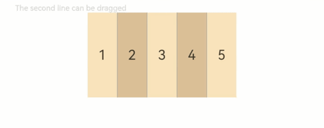

# RowSplit

<!--Kit: ArkUI-->
<!--Subsystem: ArkUI-->
<!--Owner: @zju_ljz-->
<!--Designer: @fenglinbailu-->
<!--Tester: @liuli0427-->
<!--Adviser: @Brilliantry_Rui-->
<!-- md-trans-meta sourceCommit=75a7d62c0702c21a06ca0119552a942305a023cc translatedAt=2026-08-19T07:09:49.139Z pushedAt=2026-08-20T10:45:03.043Z -->

The **RowSplit** component lays out child components horizontally and inserts a vertical divider between every two child components. It is suitable for scenarios that require horizontal multi-area layout and support dynamic adjustment of child component widths, such as the left and right panes of a file manager and the two-column layout of a settings page. Through draggable dividers, users can flexibly adjust the width of each area.

>  **NOTE**
>
> This component is supported since API version 7. Updates will be marked with a superscript to indicate their earliest API version.

## Child Components

Supported

The **RowSplit** component limits the width of its child components through dividers. During initialization, the divider positions are calculated based on the width of its child components. After initialization, dynamically modifying the width of a child component does not change the divider positions, which remain unchanged. You can drag a divider to change the width of the child components.

>  **NOTE**
>
> After initialization, dynamically modifying the [margin](ts-universal-attributes-size.md#margin), [border](ts-universal-attributes-border.md#border), or [padding](ts-universal-attributes-size.md#padding) universal attributes may cause the width of a child component to be greater than the spacing between adjacent dividers. In this exceptional case, dragging a divider to change the width of the child components is not supported. This is because the divider positions are determined during initialization, and dynamically modifying attributes such as margin, border, and padding breaks the original layout calculation, preventing the dividers from correctly responding to drag operations. You are advised to set the size and margin attributes of the child components properly during initialization.

## APIs

RowSplit()

Creates a horizontal split layout container with dividers between child components.

**Atomic service API**: This API can be used in atomic services since API version 11.

**System capability**: SystemCapability.ArkUI.ArkUI.Full

## Attributes

In addition to the [universal attributes](ts-component-general-attributes.md), the following attributes are supported.

> **NOTE**
>
> The default value of [shape clipping](ts-universal-attributes-sharp-clipping.md) of the **RowSplit** component is **true**.

### resizeable

resizeable(value: boolean)

Sets whether the divider is draggable. When set to **true**, the user can drag the divider to change the width of the child components; when set to **false**, the divider position is fixed.

> **NOTE**
>
> After initialization, if the child component width is greater than the spacing between adjacent dividers due to an exception caused by dynamically modifying the universal attributes **margin**, **border**, and **padding**, dragging the divider to change the child component width is not supported.

**Atomic service API**: This API can be used in atomic services since API version 11.

**System capability**: SystemCapability.ArkUI.ArkUI.Full

**Parameters**

| Name| Type| Mandatory| Description|
| -------- | -------- | -------- | -------- |
| value | boolean | Yes | Whether the divider can be dragged. When set to **true**, the divider can be dragged; when set to **false**, the divider cannot be dragged.<br>Default value: **false**<br>Invalid value: handled as the default value. |

> **NOTE**
>
> The divider of **RowSplit** can change the width of the left and right child components, but only to the extent that the resultant width falls within the maximum and minimum widths of the child components. When the divider is dragged, the child component width is calculated in real time. When the minimum or maximum width set for the child component is reached, the divider stops moving.

## Events

The [universal events](ts-component-general-events.md) are supported.

## Example

This example shows the basic usage of **RowSplit**, which implements a horizontally laid-out layout with a draggable divider.

```ts
// xxx.ets
@Entry
@Component
struct RowSplitExample {
  build() {
    Column() {
      Text('The second line can be dragged').fontSize(9).fontColor(0xCCCCCC).width('90%')
      // Create a RowSplit component to implement horizontal layout.
      RowSplit() {
        Text('1').width('10%').height(100).backgroundColor(0xF5DEB3).textAlign(TextAlign.Center)
        Text('2').width('10%').height(100).backgroundColor(0xD2B48C).textAlign(TextAlign.Center)
        Text('3').width('10%').height(100).backgroundColor(0xF5DEB3).textAlign(TextAlign.Center)
        Text('4').width('10%').height(100).backgroundColor(0xD2B48C).textAlign(TextAlign.Center)
        Text('5').width('10%').height(100).backgroundColor(0xF5DEB3).textAlign(TextAlign.Center)
      }
      .resizeable(true) // Draggable.
      .width('90%').height(100)
    }.width('100%').margin({ top: 5 })
  }
}
```

