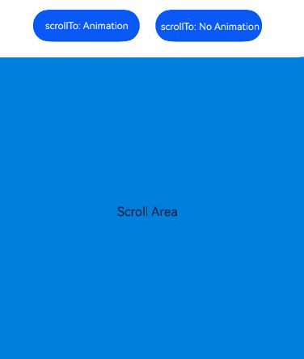
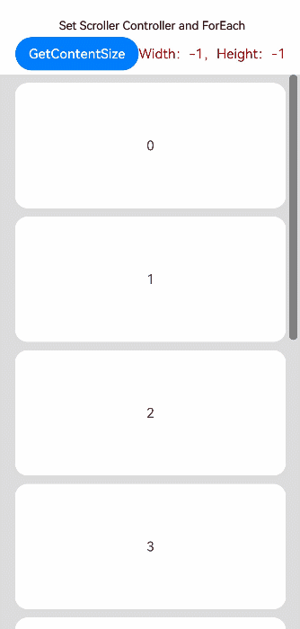

# Scroll

<!--Kit: ArkUI-->
<!--Subsystem: ArkUI-->
<!--Owner: @shengu_lancer; @yylong-->
<!--Designer: @yylong-->
<!--Tester: @liuzhenshuo-->
<!--Adviser: @Brilliantry_Rui-->

The **Scroll** component scrolls the content when the layout size of a component exceeds the size of its parent component.

>  **NOTE**
>  - This component is supported since API version 7. Updates will be marked with a superscript to indicate their earliest API version.
>  - When nesting a **List** within this component, specify the width and height for the **List** under scenarios where consistently high performance is required. If the width and height are not specified, this component will load all content of the **List**. For details, see [On-Demand Loading Failure Due to the Scroll-Nested List](https://developer.huawei.com/consumer/en/doc/best-practices/bpta-lazyforeach-optimization#section6296154115367).
>  - This component can scroll only when the size on the main axis is less than the content size.
>  - The default value of the universal attribute [clip](ts-universal-attributes-sharp-clipping.md#clip12) is **true** for the **Scroll** component.
>  - If the **Scroll** component's height exceeds the screen height, use the [layoutWeight](ts-universal-attributes-size.md#layoutweight) attribute to make it fill the remaining main-axis space.
>  - A touch on the screen stops all ongoing scroll animations within the touch area (except those triggered by [scrollTo](#scrollto) or [scrollToIndex](#scrolltoindex)), including edge bounce effects.
>  - The component includes built-in gesture recognition for finger‑following and other interactive features. For details about how to add custom gestures, see [Gesture Blocking Enhancement](ts-gesture-blocking-enhancement.md).

## Child Components

This component supports only one child component.
> Starting from API version 21, the maximum width or height for a single child component inside a **Scroll** container is 16,777,216 px. In API version 20 and earlier versions, the limit was 1,000,000 px. If a child component exceeds the applicable size limit, scrolling or display behavior may become abnormal.


## APIs

Scroll(scroller?: Scroller)

Creates a **Scroll** component.

**Atomic service API**: This API can be used in atomic services since API version 11.

**System capability**: SystemCapability.ArkUI.ArkUI.Full

**Parameters**

| Name| Type| Mandatory| Description|
| -------- | -------- | -------- | -------- |
| scroller | [Scroller](#scroller) | No| Scroller, which can be bound to scrollable components.<br>**NOTE**<br>The scroller cannot be bound to other scrollable components, such as [ArcList](ts-container-arclist.md), [List](ts-container-list.md), [Grid](ts-container-grid.md), [Scroll](ts-container-scroll.md), or [WaterFlow](ts-container-waterflow.md).|

## Attributes

In addition to [universal attributes](ts-component-general-attributes.md) and [scrollable component common attributes](ts-container-scrollable-common.md#attributes), the following attributes are also supported.

### scrollable

scrollable(value: ScrollDirection)

Sets the scrolling direction. The scroll offset is reset when this value is changed.

**Atomic service API**: This API can be used in atomic services since API version 11.

**System capability**: SystemCapability.ArkUI.ArkUI.Full

**Parameters**

| Name| Type                                       | Mandatory| Description                                           |
| ------ | ------------------------------------------- | ---- | ----------------------------------------------- |
| value  | [ScrollDirection](#scrolldirection) | Yes  | Scrolling direction.<br>Default value: **ScrollDirection.Vertical**|

When the scrolling direction is set to [ScrollDirection.FREE](#scrolldirection), the **Scroll** component supports only a subset of its capabilities. For details, see [Capabilities Supported in Free Scrolling Mode](#scrolldirection).

### scrollBar

scrollBar(barState: BarState)

Sets the scrollbar state. If the container component cannot be scrolled, the scrollbar is not displayed. If the size of a child component of a container component is infinite, the scrollbar cannot be dragged or scrolled with the child component.

Since API version 10, when the scrollable component has rounded corners, to prevent the scrollbar from being cut off by the corners, the scrollbar will automatically calculate the clearance distance from the top and bottom.

**Atomic service API**: This API can be used in atomic services since API version 11.

**System capability**: SystemCapability.ArkUI.ArkUI.Full

**Parameters**

| Name  | Type                                     | Mandatory| Description                                  |
| -------- | ----------------------------------------- | ---- | -------------------------------------- |
| barState | [BarState](ts-appendix-enums.md#barstate) | Yes  | Scrollbar state.<br>Default value: **BarState.Auto**|

### scrollBarColor

scrollBarColor(color: Color | number | string)

Sets the scrollbar color.

**Atomic service API**: This API can be used in atomic services since API version 11.

**System capability**: SystemCapability.ArkUI.ArkUI.Full

**Parameters**

| Name| Type                                                        | Mandatory| Description          |
| ------ | ------------------------------------------------------------ | ---- | -------------- |
| color  | [Color](ts-appendix-enums.md#color)&nbsp;\|&nbsp;number&nbsp;\|&nbsp;string | Yes  | Scrollbar color.<br>Default value: **'\#66182431'**.<br>A number value indicates a HEX color in RGB or ARGB format, for example, **0xffffff**.<br>A string value indicates a color in RGB or ARGB format, for example, **'#ffffff'**.  |

### scrollBarColor<sup>22+</sup>

scrollBarColor(color: Color | number | string | Resource)

Sets the scrollbar color. Compared with [scrollBarColor](#scrollbarcolor), this API supports the Resource type for the **color** parameter.

**Atomic service API**: This API can be used in atomic services since API version 22.

**System capability**: SystemCapability.ArkUI.ArkUI.Full

**Parameters**

| Name| Type                                                        | Mandatory| Description          |
| ------ | ------------------------------------------------------------ | ---- | -------------- |
| color  | [Color](ts-appendix-enums.md#color)&nbsp;\|&nbsp;number&nbsp;\|&nbsp;string&nbsp;\|&nbsp;[Resource](ts-types.md#resource) | Yes  | Scrollbar color.<br>Default value: **'\#66182431'**.<br>A number value indicates a HEX color in RGB or ARGB format, for example, **0xffffff**. A string value indicates a color in RGB or ARGB format, for example, **'#ffffff'**.  |

### scrollBarWidth

scrollBarWidth(value: number | string)

Sets the scrollbar width. This attribute cannot be set in percentage. After the width is set, the scrollbar is displayed with the set width in normal state and pressed state. If the set width exceeds the height of the **Scroll** component on the main axis, the scrollbar reverts to the default width.

**Atomic service API**: This API can be used in atomic services since API version 11.

**System capability**: SystemCapability.ArkUI.ArkUI.Full

**Parameters**

| Name| Type                      | Mandatory| Description                                     |
| ------ | -------------------------- | ---- | ----------------------------------------- |
| value  | number&nbsp;\|&nbsp;string | Yes  | Scrollbar width.<br>Default value: **4**<br>Unit: vp<br>Values less than 0 are treated as the default value. The value **0** means not to show the scrollbar.|

### scrollSnap<sup>10+</sup>

scrollSnap(value: ScrollSnapOptions)

Sets the scroll snapping mode.

During the snap animation, the scroll operation source type reported by the [onWillScroll](#onwillscroll12) event is **ScrollSource.FLING**.

**Atomic service API**: This API can be used in atomic services since API version 11.

**System capability**: SystemCapability.ArkUI.ArkUI.Full

**Parameters**

| Name| Type                                     | Mandatory| Description                      |
| ------ | ----------------------------------------- | ---- | -------------------------- |
| value  | [ScrollSnapOptions](#scrollsnapoptions10) | Yes  | Scroll snapping mode.|

### edgeEffect

edgeEffect(edgeEffect: EdgeEffect, options?: EdgeEffectOptions)

Sets the effect used when the scroll boundary is reached.

**Atomic service API**: This API can be used in atomic services since API version 11.

**System capability**: SystemCapability.ArkUI.ArkUI.Full

**Parameters**

| Name               | Type                                             | Mandatory| Description                                                        |
| --------------------- | ------------------------------------------------- | ---- | ------------------------------------------------------------ |
| edgeEffect            | [EdgeEffect](ts-appendix-enums.md#edgeeffect)     | Yes  | Effect used when the scroll boundary is reached. The spring and shadow effects are supported.<br>Default value: **EdgeEffect.None**|
| options<sup>11+</sup> | [EdgeEffectOptions](ts-container-scrollable-common.md#edgeeffectoptions11) | No  | Whether to enable the scroll effect when the component content is smaller than the component itself. The value **{ alwaysEnabled: true }** means to enable the scroll effect, and **{ alwaysEnabled: false }** means the opposite.<br>Default value: **{ alwaysEnabled: true }**|

### enableScrollInteraction<sup>10+</sup>

enableScrollInteraction(value: boolean)

Sets whether to enable scroll gestures.

**Atomic service API**: This API can be used in atomic services since API version 11.

**System capability**: SystemCapability.ArkUI.ArkUI.Full

**Parameters**

| Name| Type   | Mandatory| Description                               |
| ------ | ------- | ---- | ----------------------------------- |
| value  | boolean | Yes  | Whether to enable scroll gestures. With the value **true**, scrolling via finger or mouse is enabled. With the value **false**, scrolling via finger or mouse is disabled, but this does not affect the scrolling APIs of the [Scroller](ts-container-scroll.md#scroller).<br>Default value: **true**|

> **NOTE**
>
> The component cannot be scrolled by dragging the mouse.

### nestedScroll<sup>10+</sup>

nestedScroll(value: NestedScrollOptions)

Sets the nested scrolling mode in the forward and backward directions to implement scrolling linkage with the parent component.

**Atomic service API**: This API can be used in atomic services since API version 11.

**System capability**: SystemCapability.ArkUI.ArkUI.Full

**Parameters**

| Name| Type                                                 | Mandatory| Description          |
| ------ | ----------------------------------------------------- | ---- | -------------- |
| value  | [NestedScrollOptions](ts-container-scrollable-common.md#nestedscrolloptions10) | Yes  | Nested scrolling options.<br>Default value: **{ scrollForward: NestedScrollMode.SELF_ONLY, scrollBackward: NestedScrollMode.SELF_ONLY }**<br>Nested scrolling will not take effect when both of the following conditions are met: (1) The child **Scroll** component has [enablePaging](#enablepaging11) or [scrollSnap](#scrollsnap10) enabled. (2) The parent component is configured to have scrolling priority.|

### friction<sup>10+</sup>

friction(value: number | Resource)

Sets the friction coefficient. It applies only to gestures in the scrolling area, and it affects only indirectly the scroll chaining during the inertial scrolling process.

**Atomic service API**: This API can be used in atomic services since API version 11.

**System capability**: SystemCapability.ArkUI.ArkUI.Full

**Parameters**

| Name| Type                                                | Mandatory| Description                                                     |
| ------ | ---------------------------------------------------- | ---- | --------------------------------------------------------- |
| value  | number&nbsp;\|&nbsp;[Resource](ts-types.md#resource) | Yes  | Friction coefficient.<br>Default value: **0.9** for wearable devices and **0.6** for non-wearable devices<br>Since API version 11, the default value for non-wearable devices is **0.7**.<br>Since API version 12, the default value for non-wearable devices is **0.75**.<br>Value range: (0, +∞). If the value is less than or equal to 0, the default value is used.|

### enablePaging<sup>11+</sup>

enablePaging(value: boolean)

Sets whether to enable the swipe-to-turn-pages feature. If both **enablePaging** and **scrollSnap** are set, **scrollSnap** takes effect, but **enablePaging** does not.

**Atomic service API**: This API can be used in atomic services since API version 12.

**System capability**: SystemCapability.ArkUI.ArkUI.Full

**Parameters**

| Name| Type   | Mandatory| Description                                 |
| ------ | ------- | ---- | ------------------------------------- |
| value  | boolean | Yes  | Whether to enable the swipe-to-turn-pages feature. The value **true** means to enable the swipe-to-turn-pages feature, and **false** means the opposite.<br>Default value: **false**|

### initialOffset<sup>12+</sup>

initialOffset(value: OffsetOptions)

Sets the initial scrolling offset. This attribute takes effect only during the initial layout of the component. After the initial layout, dynamically changing the value of this attribute does not have any effect.

**Atomic service API**: This API can be used in atomic services since API version 12.

**System capability**: SystemCapability.ArkUI.ArkUI.Full

**Parameters**

| Name| Type   | Mandatory| Description                                 |
| ------ | ------- | ---- | ------------------------------------- |
| value  | [OffsetOptions](#offsetoptions12)  | Yes  |Initial scrolling offset. When the value specified is a percentage, the initial scrolling offset is calculated as the product of the **Scroll** component's size in the main axis direction and the percentage value.|

### maxZoomScale<sup>20+</sup>

maxZoomScale(scale: number)

Sets the maximum gesture‑based zoom scale for the **Scroll** component's content.

**Atomic service API**: This API can be used in atomic services since API version 20.

**System capability**: SystemCapability.ArkUI.ArkUI.Full

**Parameters**

| Name| Type   | Mandatory| Description                                 |
| ------ | ------- | ---- | ------------------------------------- |
| scale  | number  | Yes  |Maximum gesture‑based zoom scale for the **Scroll** component's content.<br>Default value: **1**.<br>Value range: (0, +∞). If the value is less than or equal to 0, the default value 1 is used.|

### minZoomScale<sup>20+</sup>

minZoomScale(scale: number)

Sets the minimum gesture-based zoom scale for the **Scroll** component's content.

**Atomic service API**: This API can be used in atomic services since API version 20.

**System capability**: SystemCapability.ArkUI.ArkUI.Full

**Parameters**

| Name| Type   | Mandatory| Description                                 |
| ------ | ------- | ---- | ------------------------------------- |
| scale  | number  | Yes  |Minimum gesture-based zoom scale for the **Scroll** component's content.<br>Default value: **1**.<br>Value range: (0, maxZoomScale]. If the value is less than or equal to 0, the default value **1** is used. If the value is greater than **maxZoomScale**, **maxZoomScale** is used.|

>  **NOTE**
>
>  Setting either **maxZoomScale** and **minZoomScale** to a value other than 1 automatically enables the zoom gesture.

### zoomScale<sup>20+</sup>

zoomScale(scale: number)

Sets the zoom scale of the **Scroll** component's content.

**Atomic service API**: This API can be used in atomic services since API version 20.

**System capability**: SystemCapability.ArkUI.ArkUI.Full

**Parameters**

| Name| Type   | Mandatory| Description                                 |
| ------ | ------- | ---- | ------------------------------------- |
| scale  | number  | Yes  |Zoom scale of the **Scroll** component's content. This parameter supports two-way binding through [!!](../../../ui/state-management/arkts-new-binding.md).<br>Default value: **1**.<br>Value range: (0, +∞). If the value is less than or equal to 0, the default value 1 is used.|

### enableBouncesZoom<sup>20+</sup>

enableBouncesZoom(enable: boolean)

Sets whether to enable the zoom bounce effect.

**Atomic service API**: This API can be used in atomic services since API version 20.

**System capability**: SystemCapability.ArkUI.ArkUI.Full

**Parameters**

| Name| Type   | Mandatory| Description                                 |
| ------ | ------- | ---- | ------------------------------------- |
| enable  | boolean  | Yes  |Whether to enable the zoom bounce effect. **true** to enable, **false** otherwise.<br>Default value: **true**|

## ScrollDirection

Enumerates the scrolling directions.

**System capability**: SystemCapability.ArkUI.ArkUI.Full

| Name      | Value| Description                  |
| ---------- | -- | ------------------------ |
| Vertical   | 0  | Vertical scrolling only.<br>**Atomic service API**: This API can be used in atomic services since API version 11.|
| Horizontal | 1  | Horizontal scrolling only.<br>**Atomic service API**: This API can be used in atomic services since API version 11.|
| Free<sup>(deprecated) </sup> | 2 | Both vertical and horizontal scrolling.<br> Note: This API is supported since API version 7 and deprecated since API version 9. You are advised to use **FREE** instead. The enum value **FREE** is supported since API version 20.|
| None       | 3 | Scrolling disabled.<br>**Atomic service API**: This API can be used in atomic services since API version 11.|
| FREE<sup>20+</sup>   | 4 | Free scrolling in both directions.<br>**Atomic service API**: This API can be used in atomic services since API version 20.|

**Capabilities Supported in Free Scrolling Mode**

| Supported Attribute| Supported Event| Supported [Scroller](#scroller) API|
| :--- | :--- | :--- |
| [scrollBar](#scrollbar) | [onWillScroll](#onwillscroll12) | [scrollTo](#scrollto) |
| [scrollBarColor](#scrollbarcolor) | [onDidScroll](#ondidscroll12) | [scrollEdge](#scrolledge) |
| [scrollBarWidth](#scrollbarwidth) | [onScrollEdge](#onscrolledge) | [scrollPage](#scrollpage9) |
| [scrollBarMargin](./ts-container-scrollable-common.md#scrollbarmargin20) | [onScrollStart](#onscrollstart9) | [currentOffset](#currentoffset) |
| [edgeEffect](#edgeeffect) | [onScrollStop](#onscrollstop9) | [offset](#offset23) |
| [enableScrollInteraction](#enablescrollinteraction10) | - | [scrollBy](#scrollby9) |
| [friction](#friction10) | - | [getItemRect](#getitemrect11) |
| [clipContent](./ts-container-scrollable-common.md#clipcontent14) | - | - |
| [initialOffset](#initialoffset12) | - | - |
| [scrollable](#scrollable) | - | - |

>  **NOTE**
>  - The **edgeEffect** attribute supports only **Spring** and **None**. Other edge effects are not available.
>  - The **onWillScroll** callback can only modify the offset during the follow‑up (inertial) scrolling phase, not during direct dragging.
>  - The **onScrollEdge** callback is triggered once when the content reaches the edge, but not again during the subsequent bounce animation.
>  - Changing the edge effect mode during a flick animation does not interrupt that animation.

## ScrollSnapOptions<sup>10+</sup>

Defines a scroll snapping mode object.

**Atomic service API**: This API can be used in atomic services since API version 11.

**System capability**: SystemCapability.ArkUI.ArkUI.Full

| Name      | Type   | Read-Only  | Optional| Description      |
| ---------- | --------------------|-------------------- | -- | -------- |
| snapAlign  | [ScrollSnapAlign](ts-container-list.md#scrollsnapalign10)   | No| No| Alignment mode for the scroll snap position.<br>**NOTE**<br>1. Default value: **ScrollSnapAlign.NONE**|
| snapPagination | [Dimension](ts-types.md#dimension10)&nbsp;\|&nbsp;Array\<Dimension\> | No| Yes| Pagination points for scroll snapping.<br>**NOTE**<br>1. If the value is of the Dimension type, it indicates the size of each page, and the system will paginate based on this size.<br>2. If the value is of the Array\<Dimension\> type, each **Dimension** represents a pagination point, and the system will paginate accordingly. Each **Dimension** value must be within the [0, scrollable distance] range.<br>3. If this parameter is not set or **Dimension** is set to a value less than or equal to 0, the value is regarded as an invalid value. In this case, there is no scroll snapping. When the value is of the Array\<Dimension\> type, the items in the array must be monotonically increasing.<br>4. When the value is a percentage, the actual size is the product of the viewport of the **Scroll** component and the percentage value.|
| enableSnapToStart | boolean   | No| Yes| Whether to enable free scrolling between the start position and the first snap point. **true**: Free scrolling between the start position and the first snap point is disabled. **false**: Free scrolling between the start position and the first snap point is allowed.<br>**NOTE**<br>1. Default value: **true**<br>2. This attribute takes effect only when **snapPagination** is set to a value of the **Array\<Dimension\>** type; it does not work with values of the **Dimension** type.|
| enableSnapToEnd | boolean   | No| Yes| Whether to enable free scrolling between the end position and the last snap point. **true**: Free scrolling between the end position and the last snap point is disabled. **false**: Free scrolling between the end position and the last snap point is allowed.<br>**NOTE**<br>1. Default value: **true**<br>2. This attribute takes effect only when **snapPagination** is set to a value of the **Array\<Dimension\>** type; it does not work with values of the **Dimension** type.|

## Events

In addition to [universal events](ts-component-general-events.md) and [scrollable component common events](ts-container-scrollable-common.md#events), the following events are also supported.
>  **NOTE**
>
>  The [onWillScroll](ts-container-scrollable-common.md#onwillscroll12) and [onDidScroll](ts-container-scrollable-common.md#ondidscroll12) events are not supported.

### onScrollFrameBegin<sup>9+</sup>

onScrollFrameBegin(event: OnScrollFrameBeginCallback)

Triggered at the beginning of each scroll frame. The event parameter provides the pending scroll offset. The event handler can calculate the actual scroll amount based on the use case and return this value as its result. The **Scroll** component then scrolls according to the returned actual scroll amount.

The value of [offsetRemain](#onscrollframebeginhandlerresult18) can be negative.

If the **onScrollFrameBegin** event and [scrollBy](#scrollby9) method are used to implement nested scrolling, set the [EdgeEffect](#edgeeffect) attribute of the scrollable child component to **None**. For example, if a **List** component is nested in the **Scroll** container, [edgeEffect](ts-container-list.md#edgeeffect) of the **List** component must be set to **EdgeEffect.None**. Otherwise, swiping the **List** triggers its edge bounce animation, which results in failed nested scrolling.

This event is triggered when any of the following conditions is met:

1. Scrolling is initiated by user interaction (for example, finger swipe, keyboard, or mouse operation).
2. The **Scroll** component scrolls by inertia.
3. Scrolling is triggered by calling the [fling](#fling12) API.

This event is not triggered when any of the following conditions is met:

1. A scroll control API other than [fling](#fling12) is called.
2. The out-of-bounds bounce effect is active.
3. The scrollbar is dragged.

**Atomic service API**: This API can be used in atomic services since API version 11.

**System capability**: SystemCapability.ArkUI.ArkUI.Full

**Parameters**

| Name| Type                             | Mandatory| Description              |
| ------ | --------------------------------- | ---- | ------------------ |
| event   | [OnScrollFrameBeginCallback](#onscrollframebegincallback18) | Yes  | Callback triggered when each frame scrolling starts.|

### onScroll<sup>(deprecated)</sup>

onScroll(event: (xOffset: number, yOffset: number) => void)

Triggered to return the horizontal and vertical offsets, in vp, during scrolling when the specified scroll event occurs.

Trigger conditions:

1. Scrolling is started by the scrollable component (supports keyboard, mouse, and other input methods that trigger scrolling).

2. The scroll controller API is called.

3. The out-of-bounds bounce effect is active.

> **NOTE**
>
> This API is supported since API version 7 and deprecated since API version 12. You are advised to use [onWillScroll](#onwillscroll12) instead.

**Atomic service API**: This API can be used in atomic services since API version 11.

**System capability**: SystemCapability.ArkUI.ArkUI.Full

**Parameters**

| Name | Type                                                     | Mandatory| Description                  |
| ------- | --------------------------------------------------------- | ---- | ---------------------- |
| xOffset     | number                                                  | Yes  | Horizontal offset relative to the previous frame. A positive offset indicates scrolling to the left, and a negative offset indicates scrolling to the right.<br>Unit: vp|
| yOffset     | number                                                  | Yes  | Vertical offset relative to the previous frame. A positive offset indicates scrolling upward, and a negative offset indicates scrolling downward.<br>Unit: vp|

### onWillScroll<sup>12+</sup>

onWillScroll(handler: ScrollOnWillScrollCallback)

Triggered before scrolling.

The callback provides the amount of offset that is about to be scrolled in the current frame, along with the current scroll status and the source of the scrolling operation. The offset provided in the callback is the calculated intended scrolling offset, not the final actual scrolling offset. You can specify the intended scrolling offset for the **Scroll** through the return value of this callback.

Trigger conditions:

1. Scrolling is started by the scrollable component (supports keyboard, mouse, and other input methods that trigger scrolling).

2. The scroll controller API is called.

3. The out-of-bounds bounce effect is active.

>  **NOTE**
>
>  The scrolling event callback is triggered frequently during scrolling. To avoid frame freezing or dropped frames, do not perform time-consuming operations in this callback. For best practices, see [High-Frequency Callback Scenarios](https://developer.huawei.com/consumer/en/doc/best-practices/bpta-time-optimization-of-the-main-thread#section10112623611).

**Atomic service API**: This API can be used in atomic services since API version 12.

**System capability**: SystemCapability.ArkUI.ArkUI.Full

**Parameters**

| Name | Type                                                     | Mandatory| Description                  |
| ------- | --------------------------------------------------------- | ---- | ---------------------- |
| handler | [ScrollOnWillScrollCallback](#scrollonwillscrollcallback12) | Yes  | Callback triggered before scrolling.|

### onDidScroll<sup>12+</sup>

onDidScroll(handler: ScrollOnScrollCallback)

Triggered when the **Scroll** component scrolls.

The return value is the scrolling offset amount in the current frame, along with the current scroll state.

Trigger conditions:

1. Scrolling is started by the scrollable component (supports keyboard, mouse, and other input methods that trigger scrolling).

2. The scroll controller API is called.

3. This event supports the out-of-bounds bounce effect.

**Atomic service API**: This API can be used in atomic services since API version 12.

**System capability**: SystemCapability.ArkUI.ArkUI.Full

**Parameters**

| Name | Type                                                     | Mandatory| Description                  |
| ------- | --------------------------------------------------------- | ---- | ---------------------- |
| handler | [ScrollOnScrollCallback](#scrollonscrollcallback12) | Yes  | Represents the callback triggered when the **Scroll** component scrolls.|

### onScrollEdge

onScrollEdge(event: OnScrollEdgeCallback)

Triggered when scrolling reaches the edge.

Trigger conditions:

1. Scrolling reaches the edge after being started by the scrollable component (supports keyboard, mouse, and other input methods that trigger scrolling).<br>2. The scroll controller API is called.<br>3. The out-of-bounds bounce effect is active.

**Atomic service API**: This API can be used in atomic services since API version 11.

**System capability**: SystemCapability.ArkUI.ArkUI.Full

**Parameters**

| Name| Type                             | Mandatory| Description              |
| ------ | --------------------------------- | ---- | ------------------ |
| event   | [OnScrollEdgeCallback](#onscrolledgecallback18) | Yes  | Edge position reached by scrolling.<br>For horizontal scrolling, [Edge.Center](ts-appendix-enums.md#edge) represents the start position, and [Edge.Baseline](ts-appendix-enums.md#edge) represents the end position. Note: The enum values [Edge.Center](ts-appendix-enums.md#edge) and [Edge.Baseline](ts-appendix-enums.md#edge) are deprecated. You are advised to use the [onReachStart](ts-container-scrollable-common.md#onreachstart11) and [onReachEnd](ts-container-scrollable-common.md#onreachend11) to detect when the component reaches its boundary.|

### onScrollEnd<sup>(deprecated)</sup>

onScrollEnd(event: () => void)

Triggered when scrolling stops.

Trigger conditions:

1. Scrolling is stopped by the scrollable component (supports keyboard, mouse, and other input methods that trigger scrolling).<br>2. The controller API is called to stop the scrolling, accompanied by a transition animation.

> **NOTE**
>
> This API is supported since API version 7 and deprecated since API version 9. You are advised to use [onScrollStop](#onscrollstop9) instead.

**System capability**: SystemCapability.ArkUI.ArkUI.Full

**Parameters**

| Name| Type                             | Mandatory| Description              |
| ------ | --------------------------------- | ---- | ------------------ |
| event   | () => void | Yes  | Callback triggered when scrolling stops.|

### onScrollStart<sup>9+</sup>

onScrollStart(event: VoidCallback)

Triggered when scrolling starts and is initiated by the user's finger dragging the **Scroll** component or its scrollbar. This event is also triggered when the animation contained in the scrolling triggered by [Scroller](#scroller) starts.

Trigger conditions:

1. Scrolling is started by the **Scroll** component (supports keyboard, mouse, and other input methods that trigger scrolling).<br>2. The controller API is called to start the scrolling, accompanied by a transition animation.

**Atomic service API**: This API can be used in atomic services since API version 11.

**System capability**: SystemCapability.ArkUI.ArkUI.Full

**Parameters**

| Name| Type                             | Mandatory| Description              |
| ------ | --------------------------------- | ---- | ------------------ |
| event   | [VoidCallback](ts-types.md#voidcallback12) | Yes  | Callback triggered when scrolling starts.|

### onScrollStop<sup>9+</sup>

onScrollStop(event: VoidCallback)

Triggered when scrolling stops after the user's finger leaves the screen. This event is also triggered when the animation contained in the scrolling triggered by [Scroller](#scroller) stops.

Trigger conditions:

1. Scrolling is stopped by the scrollable component (supports keyboard, mouse, and other input methods that trigger scrolling).<br>2. The controller API is called to start the scrolling, accompanied by a transition animation.

**Atomic service API**: This API can be used in atomic services since API version 11.

**System capability**: SystemCapability.ArkUI.ArkUI.Full

**Parameters**

| Name| Type                             | Mandatory| Description              |
| ------ | --------------------------------- | ---- | ------------------ |
| event   | [VoidCallback](ts-types.md#voidcallback12) | Yes  | Callback triggered when scrolling stops.|

### onDidZoom<sup>20+</sup>

onDidZoom(event: ScrollOnDidZoomCallback)

Triggered when the zoom operation of each frame is completed.

**Atomic service API**: This API can be used in atomic services since API version 20.

**System capability**: SystemCapability.ArkUI.ArkUI.Full

**Parameters**

| Name| Type                             | Mandatory| Description              |
| ------ | --------------------------------- | ---- | ------------------ |
| event   | [ScrollOnDidZoomCallback](#scrollondidzoomcallback20) | Yes  | Callback triggered when the zoom operation of each frame is completed.|

### onZoomStart<sup>20+</sup>

onZoomStart(event: VoidCallback)

Triggered when a zoom gesture starts.

**Atomic service API**: This API can be used in atomic services since API version 20.

**System capability**: SystemCapability.ArkUI.ArkUI.Full

**Parameters**

| Name| Type                             | Mandatory| Description              |
| ------ | --------------------------------- | ---- | ------------------ |
| event   | [VoidCallback](ts-types.md#voidcallback12) | Yes  | Callback triggered when the zoom gesture starts.|

### onZoomStop<sup>20+</sup>

onZoomStop(event: VoidCallback)

Triggered when a zoom gesture stops.

**Atomic service API**: This API can be used in atomic services since API version 20.

**System capability**: SystemCapability.ArkUI.ArkUI.Full

**Parameters**

| Name| Type                             | Mandatory| Description              |
| ------ | --------------------------------- | ---- | ------------------ |
| event   | [VoidCallback](ts-types.md#voidcallback12) | Yes  | Callback triggered when the zoom gesture stops.|

## ScrollOnScrollCallback<sup>12+</sup>

type ScrollOnScrollCallback = (xOffset: number, yOffset: number, scrollState: ScrollState) => void

Represents the callback triggered when the **Scroll** component scrolls.

**Atomic service API**: This API can be used in atomic services since API version 12.

**System capability**: SystemCapability.ArkUI.ArkUI.Full

**Parameters**

| Name     | Type                                                   | Mandatory| Description                                                        |
| ----------- | ------------------------------------------------------- | ---- | ------------------------------------------------------------ |
| xOffset     | number                                                  | Yes  | Horizontal offset relative to the previous frame. A positive offset indicates scrolling to the left, and a negative offset indicates scrolling to the right.<br>Unit: vp|
| yOffset     | number                                                  | Yes  | Vertical offset relative to the previous frame. A positive offset indicates scrolling upward, and a negative offset indicates scrolling downward.<br>Unit: vp|
| scrollState | [ScrollState](ts-container-list.md#scrollstate)| Yes | Current scrolling state.                                              |

>  **NOTE**
>
>  If the [onScrollFrameBegin](#onscrollframebegin9) event and [scrollBy](#scrollby9) method are used to implement nested scrolling, set the **EdgeEffect** attribute of the scrollable child component to **None**. For example, if a **List** component is nested in the **Scroll** container, [edgeEffect](ts-container-list.md#edgeeffect) of the **List** component must be set to **EdgeEffect.None**.

## ScrollOnWillScrollCallback<sup>12+</sup>

type ScrollOnWillScrollCallback = (xOffset: number, yOffset: number, scrollState: ScrollState, scrollSource: ScrollSource) => void | OffsetResult

Callback triggered before scrolling.

**Atomic service API**: This API can be used in atomic services since API version 12.

**System capability**: SystemCapability.ArkUI.ArkUI.Full

**Parameters**

| Name     | Type                                                   | Mandatory| Description                                                        |
| ----------- | ------------------------------------------------------- | ---- | ------------------------------------------------------------ |
| xOffset     | number                                                  | Yes  | Horizontal offset relative to the previous frame. A positive offset indicates scrolling to the left, and a negative offset indicates scrolling to the right.<br>Unit: vp|
| yOffset     | number                                                  | Yes  | Vertical offset relative to the previous frame. A positive offset indicates scrolling upward, and a negative offset indicates scrolling downward.<br>Unit: vp|
| scrollState | [ScrollState](ts-container-list.md#scrollstate)| Yes | Current scrolling state.                                              |
| scrollSource | [ScrollSource](ts-appendix-enums.md#scrollsource12) | Yes| Source of the current scrolling operation.|

**Return value**

| Type                                                        | Description                                                        |
| ------------------------------------------------------------ | ------------------------------------------------------------ |
| void \| [OffsetResult](#offsetresult11) |  If **OffsetResult** is returned, the scrolling will be performed with the offsets specified. Otherwise, the scrolling will be performed with the offsets determined by **(xOffset, yOffset)**.|

## OnScrollEdgeCallback<sup>18+</sup>

type OnScrollEdgeCallback = (side: Edge) => void

Represents the callback triggered when scrolling reaches an edge.

**Atomic service API**: This API can be used in atomic services since API version 18.

**System capability**: SystemCapability.ArkUI.ArkUI.Full

**Parameters**

| Name | Type  | Mandatory| Description   |
| ------- | ----- | ---- | ------ |
| side    | [Edge](ts-appendix-enums.md#edge)  | Yes  | Edge position to scroll to.|

## OnScrollFrameBeginCallback<sup>18+</sup>

type OnScrollFrameBeginCallback = (offset: number, state: ScrollState) => OnScrollFrameBeginHandlerResult;

Represents the callback triggered before each frame scrolling starts.

**Atomic service API**: This API can be used in atomic services since API version 18.

**System capability**: SystemCapability.ArkUI.ArkUI.Full

**Parameters**

| Name| Type                                                   | Mandatory| Description                      |
| ------ | ------------------------------------------------------- | ---- | -------------------------- |
| offset | number                                                  | Yes  | Amount to scroll by, in vp.|
| state  | [ScrollState](ts-container-list.md#scrollstate)| Yes  | Current scroll state.            |

**Return value**

| Type                    | Description                |
| ------------------------ | -------------------- |
| [OnScrollFrameBeginHandlerResult](#onscrollframebeginhandlerresult18) | Actual scroll offset.|

## OnScrollFrameBeginHandlerResult<sup>18+</sup>

Represents the actual scroll offset relative to the previous frame returned by [OnScrollFrameBeginCallback](#onscrollframebegincallback18).

> **NOTE**
>
> To standardize anonymous object definitions, the element definitions here have been revised in API version 18. While historical version information is preserved for anonymous objects, there may be cases where the outer element's @since version number is higher than inner elements'. This does not affect interface usability.

**Atomic service API**: This API can be used in atomic services since API version 18.

**System capability**: SystemCapability.ArkUI.ArkUI.Full

| Name | Type | Read-Only| Optional| Description |
| ----- | ------ | ---- | -- | ----- |
| offsetRemain<sup>9+</sup>     | number | No  | No| Actual scroll offset relative to the previous frame.<br>Unit: vp<br>**Atomic service API**: This API can be used in atomic services since API version 11.|

## ScrollOnDidZoomCallback<sup>20+</sup>

type ScrollOnDidZoomCallback = (scale: number) => void

Defines the callback triggered when the scroll scaling of each frame is complete.

**Atomic service API**: This API can be used in atomic services since API version 20.

**System capability**: SystemCapability.ArkUI.ArkUI.Full

**Parameters**

| Name     | Type                                                   | Mandatory| Description                                                        |
| ----------- | ------------------------------------------------------- | ---- | ------------------------------------------------------------ |
| scale     | number                                                  | Yes  | Current scale factor.|


## Scroller

Defines a controller for scrollable container components. It can be bound to a container component to control its scrolling behavior. A single **Scroller** instance cannot control multiple container components simultaneously. Currently, it can be bound to the following components: **ArcList**, **ArcScrollBar**, **List**, **Scroll**, **ScrollBar**, **Grid**, and **WaterFlow**.

>**NOTE**
>
>1. The binding of a **Scroller** instance to a scrollable container component occurs during the component creation phase.<br>
>2. **Scroller** APIs can only be effectively called after the **Scroller** instance is bound to a scrollable container component. Otherwise, depending on the API called, it may have no effect or throw an exception.<br>
>3. For example, with [aboutToAppear](ts-custom-component-lifecycle.md#abouttoappear), this callback is executed after a new instance of a custom component is created and before its **build()** method is called. Therefore, if a scrollable component is defined within the **build** method of a custom component, the internal scrollable component has not yet been created during the **aboutToAppear** callback of that custom component, and therefore the **Scroller** APIs cannot be called effectively.<br>
>4. For example, with [onAppear](ts-universal-events-show-hide.md#onappear), this callback is triggered after the component is mounted and displayed. Therefore, when the **onAppear** callback of a scrollable component is executed, the scrollable component has already been created and successfully bound to the **Scroller** instance, allowing the **Scroller** APIs to be called effectively.

### Objects to Import

```ts
scroller: Scroller = new Scroller();
```

### constructor

constructor()

A constructor used to create a **Scroller** object.

**Atomic service API**: This API can be used in atomic services since API version 11.

**System capability**: SystemCapability.ArkUI.ArkUI.Full

### scrollTo

scrollTo(options: ScrollOptions)


Scrolls to the specified position.

**Atomic service API**: This API can be used in atomic services since API version 11.

**System capability**: SystemCapability.ArkUI.ArkUI.Full

**Parameters**

| Name  | Type| Mandatory  | Description     |
| ----- | ---- | ---- | --------- |
| options | [ScrollOptions](#scrolloptions18) | Yes   | Parameters for scrolling to the specified position.|

>  **NOTE**
>
> If the scrolling speed of the **scrollTo** animation exceeds 200 vp/s, the components within the scrollable area will not respond to click events.
>

### scrollEdge

scrollEdge(value: Edge, options?: ScrollEdgeOptions)

Scrolls to the edge of the container, regardless of the scroll axis direction. **Edge.Top** and **Edge.Start** produce the same effect, and **Edge.Bottom** and **Edge.End** produce the same effect.
By default, the **Scroll** component comes with an animation, while the **Grid**, **List**, and **WaterFlow** components do not.

**Atomic service API**: This API can be used in atomic services since API version 11.

**System capability**: SystemCapability.ArkUI.ArkUI.Full

**Parameters**

| Name  | Type| Mandatory  | Description     |
| ----- | ---- | ---- | --------- |
| value | [Edge](ts-appendix-enums.md#edge) | Yes   | Edge position to scroll to.|
| options<sup>12+</sup>&nbsp; | [ScrollEdgeOptions](#scrolledgeoptions12)| No   | Mode of scrolling to the edge position.|

### fling<sup>12+</sup>

fling(velocity: number): void


Performs inertial scrolling based on the initial velocity passed in.

**Atomic service API**: This API can be used in atomic services since API version 12.

**System capability**: SystemCapability.ArkUI.ArkUI.Full

**Parameters**

| Name  | Type| Mandatory| Description                                                    |
| -------- | -------- | ---- | ------------------------------------------------------------ |
| velocity | number   | Yes  | Initial velocity of inertial scrolling. Unit: vp/s<br>**NOTE**<br>If the value specified is 0, it is considered as invalid, and the scrolling for this instance will not take effect. A positive value indicates scrolling towards the top, while a negative value indicates scrolling towards the bottom.|

**Error codes**

For details about the error codes, see [Universal Error Codes](../../errorcode-universal.md) and [Scrollable Component Error Codes](../errorcode-scroll.md).

| ID| Error Message|
| ------- | -------- |
| 401      | Parameter error. Possible causes: 1. Mandatory parameters are left unspecified; 2.Incorrect parameters types; 3. Parameter verification failed.   |
| 100004   | Controller not bound to component.                               |

### scrollPage<sup>9+</sup>

scrollPage(value:   ScrollPageOptions)

Scrolls to the next or previous page.

**Atomic service API**: This API can be used in atomic services since API version 11.

**System capability**: SystemCapability.ArkUI.ArkUI.Full

**Parameters**

| Name| Type                                          | Mandatory| Description      |
| ------ | -------------------------------------------------- | ---- | -------------- |
| value  | [ScrollPageOptions](#scrollpageoptions14) | Yes  | Page turning mode.|

### scrollPage<sup>(deprecated)</sup>

scrollPage(value: { next: boolean, direction?: Axis })

Scrolls to the next or previous page.

> **NOTE**
>
> This API is supported since API version 7 and deprecated since API version 9. You are advised to use [scrollPage<sup>9+</sup>](#scrollpage9) instead.

**System capability**: SystemCapability.ArkUI.ArkUI.Full

**Parameters**

| Name      | Type   | Mandatory  | Description                          |
| --------- | ------- | ---- | ------------------------------ |
| next      | boolean | Yes   | Whether to turn to the next page. The value **true** means to scroll to the next page, and **false** means to scroll to the previous page.|
| direction | [Axis](ts-appendix-enums.md#axis)    | No   | Scrolling direction: horizontal or vertical.              |

### currentOffset

currentOffset(): OffsetResult

Obtains the current scroll offset.

> **NOTE**
> 
> 1. If **Scroller** is not bound to a component, this API returns **undefined**, which is not declared in the API. You are advised to use the [offset](#offset23) function.
>
> 2. The **Grid**, **List**, and **WaterFlow** components use a lazy loading mechanism. Before all content is fully loaded and laid out, the total content offset is estimated, and this estimation may be inaccurate. For the **List** component, the [childrenMainSize](./ts-container-list.md#childrenmainsize12) attribute can be used to mitigate such inaccuracies. Currently, there is no solution to inaccurate estimation of the **Grid** and **WaterFlow** components.

**Atomic service API**: This API can be used in atomic services since API version 11.

**System capability**: SystemCapability.ArkUI.ArkUI.Full

**Return value**

| Type | Description|
| -------- | -------- |
|  [OffsetResult<sup>11+</sup>](#offsetresult11) | Current scroll offset.|

### offset<sup>23+<sup>

offset(): OffsetResult | undefined

Obtains the current scroll offset. Except for **undefined** in the API declaration, other information is the same as that of the [currentOffset](#currentoffset) API.

**Atomic service API**: This API can be used in atomic services since API version 23.

**System capability**: SystemCapability.ArkUI.ArkUI.Full

**Return value**

| Type | Description|
| -------- | -------- |
|  [OffsetResult](#offsetresult11) \| undefined | Current scroll offset. If the scroller is not bound to a component, this API returns **undefined**.|

### scrollToIndex

scrollToIndex(value: number, smooth?: boolean, align?: ScrollAlign, options?: ScrollToIndexOptions)

Scrolls to a specified index, with support for setting an extra offset for the scroll.

When smooth scrolling is enabled, all items encountered during the scroll are loaded and their layout is calculated. Loading a large number of items may cause performance issues. It is recommended that you first call **scrollToIndex** without animation to jump to a position near the target, then call it again with animation to smoothly scroll to the final target position.


>  **NOTE**
>
> 1. This API applies only to the **ArcList**, **Grid**, **List**, and **WaterFlow** components.
>
> 2. When refreshing the data source using [LazyForEach](ts-rendering-control-lazyforeach.md), [ForEach](ts-rendering-control-foreach.md), or [Repeat](ts-rendering-control-repeat.md), ensure this API is called after the data refresh is complete.
>
> 3. Starting from API version 11, the **List** component supports [contentStartOffset](ts-container-list.md#contentstartoffset11) and [contentEndOffset](ts-container-list.md#contentendoffset11). Starting from API version 22, the **Grid** and **WaterFlow** components also support setting [contentStartOffset](ts-container-scrollable-common.md#contentstartoffset22) and [contentEndOffset](ts-container-scrollable-common.md#contentendoffset22).
>
> - If the scrollable container has **contentStartOffset** set and **ScrollAlign** is **START**, after scrolling, the start of the specified item will align with the **contentStartOffset** of the container.
> 
> - If the scrollable container has **contentEndOffset** set and **ScrollAlign** is **END**, after scrolling, the end of the specified item will align with the **contentEndOffset** of the container.
> 
> - If the scrollable container has **contentStartOffset** or **contentEndOffset** set and **ScrollAlign** is **AUTO**: When the specified item is completely within the visible area, no adjustment is made. Otherwise, following the shortest-scroll-distance principle, the start of the item will align with the container's **contentStartOffset**, or the end will align with the container's **contentEndOffset**, ensuring the item is fully displayed.
> 

**Atomic service API**: This API can be used in atomic services since API version 11.

**System capability**: SystemCapability.ArkUI.ArkUI.Full

**Parameters**

| Name               | Type| Mandatory| Description                                                    |
| --------------------- | -------- | ---- | ------------------------------------------------------------ |
| value | number   | Yes  | Index of the item to be scrolled to in the container.<br>**NOTE**<br>If the value set is a negative value or greater than the maximum index of the items in the container, the value is deemed abnormal, and no scrolling will be performed.                    |
| smooth | boolean  | No  | Whether to enable the smooth animation for scrolling to the item with the specified index. The value **true** means to enable that the smooth animation, and **false** means the opposite.<br>Default value: **false**|
| align | [ScrollAlign](#scrollalign10)  | No  | How the list item to scroll to is aligned with the container.<br>Default value when the container is **List**: **ScrollAlign.START**<br> Default value when the container is **Grid**: **ScrollAlign.AUTO**<br> Default value when the container is **WaterFlow**: **ScrollAlign.START**<br>**NOTE**<br>This parameter is only available for the **List**, **Grid**, and **WaterFlow** components.|
| options<sup>12+</sup> | [ScrollToIndexOptions](#scrolltoindexoptions12)  | No  | Options for scrolling to a specified index, for example, an extra offset for the scroll.<br>Default value: **0**, in vp|

### scrollBy<sup>9+</sup>

scrollBy(dx: Length, dy: Length)


Scrolls by the specified amount.


>  **NOTE**
>
>  This API is available for the **ArcList**, **Scroll**, **List**, **Grid**, and **WaterFlow** components.

**Atomic service API**: This API can be used in atomic services since API version 11.

**System capability**: SystemCapability.ArkUI.ArkUI.Full

**Parameters**

| Name  | Type  | Mandatory  | Description             |
| ----- | ------ | ---- | ----------------- |
| dx |  [Length](ts-types.md#length) | Yes   | Amount to scroll by in the horizontal direction. The percentage format is not supported.<br>Value range: (-∞, +∞).|
| dy |  [Length](ts-types.md#length) | Yes   | Amount to scroll by in the vertical direction. The percentage format is not supported.<br>Value range: (-∞, +∞).|

### isAtEnd<sup>10+</sup>

isAtEnd(): boolean

Checks whether the component has scrolled to the bottom.

>  **NOTE**
>
>  This API is available for the **ArcList**, **Scroll**, **List**, **Grid**, and **WaterFlow** components.

**Atomic service API**: This API can be used in atomic services since API version 11.

**System capability**: SystemCapability.ArkUI.ArkUI.Full

**Return value**

| Type        | Description         |
| ------- | -------- |
| boolean | The value **true** means that the component has scrolled to the bottom, and **false** means the opposite.|

### getItemRect<sup>11+</sup>

getItemRect(index: number): RectResult

Obtains the size and position of a child component relative to its container.

>  **NOTE**
>
>  This API is available for the **ArcList**, **Scroll**, **List**, **Grid**, and **WaterFlow** components.

**Atomic service API**: This API can be used in atomic services since API version 12.

**System capability**: SystemCapability.ArkUI.ArkUI.Full

**Parameters**

| Name  | Type  | Mandatory  | Description             |
| ----- | ------ | ---- | ----------------- |
| index | number | Yes   | Index of the target child component.|

> **NOTE**
>
> - The value of **index** must be the index of a child component visible in the display area. Otherwise, the value is considered invalid.
> - The size and position returned for an invalid value are both **0**.

**Return value**

| Type      | Description      |
| -------------------  | -------- |
| [RectResult](ts-universal-attributes-on-child-touch-test.md#rectresult) | Size and position of the child component relative to the component.<br>Unit: vp|

**Error codes**

For details about the error codes, see [Universal Error Codes](../../errorcode-universal.md) and [Scrollable Component Error Codes](../errorcode-scroll.md).

| ID| Error Message|
| ------- | -------- |
| 401      | Parameter error. Possible causes: 1. Mandatory parameters are left unspecified; 2.Incorrect parameters types; 3. Parameter verification failed.   |
| 100004   | Controller not bound to component.                               |
### getItemIndex<sup>14+</sup>

getItemIndex(x: number, y: number): number

Obtains the index of a child component based on coordinates.

>  **NOTE**
>
>  This API is available for the **List**, **Grid**, and **WaterFlow** components.

**Atomic service API**: This API can be used in atomic services since API version 14.

**System capability**: SystemCapability.ArkUI.ArkUI.Full

**Parameters**

| Name  | Type  | Mandatory  | Description             |
| ----- | ------ | ---- | ----------------- |
| x | number | Yes   | X-coordinate, in vp.|
| y | number | Yes| Y-coordinate, in vp.|

> **NOTE**
>
> The returned index is **-1** for invalid coordinates.

**Return value**

| Type      | Description      |
| -------------------  | -------- |
| number | Index of the child component.|

**Error codes**

For details about the error codes, see [Universal Error Codes](../../errorcode-universal.md) and [Scrollable Component Error Codes](../errorcode-scroll.md).

| ID| Error Message|
| ------- | -------- |
| 401      | Parameter error. Possible causes: 1. Mandatory parameters are left unspecified; 2.Incorrect parameters types; 3. Parameter verification failed.   |
| 100004   |The controller not bound to component.                              |

### contentSize<sup>22+</sup>

contentSize(): SizeResult

Obtains the total size of the scrollable component's content.

> **NOTE**
>
> - For **Grid**, **List**, **WaterFlow**, and **Scroll** components, the content size along the main axis is the total size after layout of all child components. The content size along the cross axis is the component's own cross-axis size minus paddings and borders.
>
> - **Grid**, **List**, and **WaterFlow** components employ lazy-loading mechanisms. This API relies on laid-out child nodes for estimation. If component content is not fully laid out and child component heights vary, the estimation may be inaccurate and require your adaptation. For the **List** component, you can use the **childrenMainSize** attribute to address estimation inaccuracies.
>
> - If an application dynamically adds or removes child nodes, it should dynamically obtain the total content size to ensure the API returns up-to-date results.
>
> - When the **Scroll** component has **scrollable** set to **ScrollDirection.FREE**, the obtained total content size is the total size of the child components after scaling.
>
> - When the **Scroll** component has **scrollable** set to **ScrollDirection.NONE**, the obtained total content size is 0.
>
> - If the **Grid** component has both **columnsTemplate** and **rowsTemplate** set, or neither of them set (under a non-scrollable scenario), the obtained total content size has a height of 0 and a width equal to the **Grid** component's content area width.

**Atomic service API**: This API can be used in atomic services since API version 22.

**System capability**: SystemCapability.ArkUI.ArkUI.Full

**Return value**

| Type                                                    | Description                                              |
| -------------------------------------------------------- | -------------------------------------------------- |
| [SizeResult](ts-custom-component-layout.md#sizeresult10) | Total size of the scrollable component's content, including the content width and height.<br>Unit: vp|

**Error codes**

For details about the error codes, see [Scrollable Component Error Codes](../errorcode-scroll.md).

| ID| Error Message|
| ------- | -------- |
| 100004   | Controller not bound to a component. |

## OffsetResult<sup>11+</sup>

Represents the offset values resulting from a scroll operation.

**Atomic service API**: This API can be used in atomic services since API version 11.

**System capability**: SystemCapability.ArkUI.ArkUI.Full

| Name    | Type  | Read-Only| Optional| Description                            |
| ------- |------- | ---- | ---- | -------------------------------- |
| xOffset | number |  No |  No | Horizontal scrolling offset.<br>The unit of the return value is vp.|
| yOffset | number |  No |  No | Vertical scrolling offset.<br>The unit of the return value is vp.|

## ScrollAnimationOptions<sup>12+</sup>

Provides parameters for customizing scroll animations.

**Atomic service API**: This API can be used in atomic services since API version 12.

**System capability**: SystemCapability.ArkUI.ArkUI.Full

| Name  | Type  | Read-Only  | Optional| Description             |
| ----- | ------ | ------ | -- | ----------------- |
| duration | number | No| Yes| Scrolling duration.<br>Default value: **1000**<br>**NOTE**<br>A value less than 0 evaluates to the default value.|
| curve | [Curve](ts-appendix-enums.md#curve) \| [ICurve](../js-apis-curve.md#icurve9) | No| Yes| Scrolling curve.<br>Default value: **Curve.Ease**|
| canOverScroll | boolean | No| Yes| Whether the scroll animation is converted to an out-of-bounds bounce animation after reaching the boundary.<br>Default value: **false**<br>**NOTE**<br> This conversion occurs only when **canOverScroll** is **true** and the component's **edgeEffect** attribute is set to [EdgeEffect.Spring](ts-appendix-enums.md#edgeeffect). When **canOverScroll** is **false**, the animation stops directly at the boundary without converting to a bounce animation.<br>Since API version 20, if **canOverScroll** in [ScrollOptions](#scrolloptions18) is **true**, the scroll animation can remain at the boundary. After exceeding the boundary, it will not be converted to a bounce animation.|

## ScrollAlign<sup>10+</sup>

Enumerates alignment modes.

**Atomic service API**: This API can be used in atomic services since API version 11.

**System capability**: SystemCapability.ArkUI.ArkUI.Full

| Name    | Value| Description                          |
| ------ | --- | ------------------------------ |
| START   | 0 | Start alignment. Aligns the start of the specified item with the start of the scrollable container. |
| CENTER | 1 | Center alignment. Centers the specified item along the main axis within the scrollable container.       |
| END  | 2 | End alignment. Aligns the end of the specified item with the end of the scrollable container.|
| AUTO  | 3 | Automatic alignment.<br>If the specified item is entirely within the visible area, no adjustment is made. Otherwise, following the shortest-scroll-distance principle, either the start or the end of the item is aligned with the scrollable container to make the item fully visible.|

## ScrollToIndexOptions<sup>12+</sup>

Provides parameters for scrolling to a specific index.

**Atomic service API**: This API can be used in atomic services since API version 12.

**System capability**: SystemCapability.ArkUI.ArkUI.Full

| Name  | Type | Read-Only| Optional| Description             |
| ----- | ------ | ------ | -- | ----------------- |
| extraOffset | [LengthMetrics](../js-apis-arkui-graphics.md#lengthmetrics12) | No| Yes| Extra offset for scrolling to a specified index. A positive value offsets the scroll position downward (or toward the end); a negative value offsets it upward (or toward the start).|

## ScrollPageOptions<sup>14+</sup>

Provides parameters for page scrolling behavior.

**Atomic service API**: This API can be used in atomic services since API version 14.

**System capability**: SystemCapability.ArkUI.ArkUI.Full

| Name   | Type| Read-Only| Optional| Description                                                    |
| --------- | -------- | ---- | -- | ------------------------------------------------------------ |
| next      | boolean  | No  | No| Whether to turn to the next page. The value **true** means to scroll to the next page, and **false** means to scroll to the previous page.         |
| animation | boolean  | No  | Yes| Whether to enable the page-turning animation. The value **true** means to enable the page-turning animation, and **false** means the opposite.<br>Default value: **false**|

## OffsetOptions<sup>12+</sup>

Provides parameters for setting the initial scrolling offset.

**Atomic service API**: This API can be used in atomic services since API version 12.

**System capability**: SystemCapability.ArkUI.ArkUI.Full

| Name  | Type | Read-Only| Optional| Description             |
| ----- | ------| ------- | -- | ----------------- |
| xOffset | [Dimension](ts-types.md#dimension10) | No| Yes|Horizontal scrolling offset.<br>Default value: **0**|
| yOffset | [Dimension](ts-types.md#dimension10) | No| Yes|Vertical scrolling offset.<br>Default value: **0**|

## ScrollEdgeOptions<sup>12+</sup>

Provides parameters for scrolling to the edge of a scrollable container.

**Atomic service API**: This API can be used in atomic services since API version 12.

**System capability**: SystemCapability.ArkUI.ArkUI.Full

| Name   | Type| Read-Only| Optional| Description                                                  |
| --------- | -------- | ---- | -- | ------------------------------------------------------------ |
| velocity      | number  | No  | Yes| Fixed velocity for scrolling to the edge of the container. If the value specified is less than or equal to 0, the parameter will not take effect.<br>Default value: **0**<br>  Unit: vp/s         |

## ScrollOptions<sup>18+</sup>

Provides parameters for scrolling to a specific position in a scrollable container.

> **NOTE**
>
> To standardize anonymous object definitions, the element definitions here have been revised in API version 18. While historical version information is preserved for anonymous objects, there may be cases where the outer element's @since version number is higher than inner elements'. This does not affect interface usability.

**Atomic service API**: This API can be used in atomic services since API version 18.

**System capability**: SystemCapability.ArkUI.ArkUI.Full

| Name   | Type                                                    | Read-Only| Optional| Description                                                    |
| --------- | ------------------------------------------------------------ | ---- | -- | ------------------------------------------------------------ |
| xOffset<sup>10+</sup>   | number&nbsp;\|&nbsp;string                                   | No  | No| Horizontal scroll offset.<br>**NOTE**<br>This parameter cannot be set in percentage.<br>This parameter takes effect only when the scroll axis is the x-axis.<br>Value range: Values less than 0 are treated as 0, and scrolling occurs without animation. Animated scrolling stops at the starting position by default. By setting the **animation** parameter, you can enable a bounce effect when the scrolling goes beyond the boundary.<br>**Atomic service API**: This API can be used in atomic services since API version 11.|
| yOffset<sup>10+</sup>   | number&nbsp;\|&nbsp;string                                   | No  | No| Vertical scroll offset.<br>**NOTE**<br>This parameter cannot be set in percentage.<br>This parameter takes effect only when the scroll axis is the y-axis.<br>Value range: Values less than 0 are treated as 0, and scrolling occurs without animation. Animated scrolling stops at the starting position by default. By setting the **animation** parameter, you can enable a bounce effect when the scrolling goes beyond the boundary.<br>**Atomic service API**: This API can be used in atomic services since API version 11.|
| animation<sup>10+</sup> | [ScrollAnimationOptions](#scrollanimationoptions12)&nbsp;\|&nbsp;boolean | No  | Yes| Animation configuration, which includes the following:<br>- **ScrollAnimationOptions**: custom animation settings.<br>- **boolean**: whether to enable the default spring animation.<br>Default value:<br>ScrollAnimationOptions: { duration: 1000, curve: Curve.Ease, canOverScroll: false } <br>boolean:&nbsp;false<br>**NOTE**<br>Currently, the **List**, **Scroll**, **Grid**, and **WaterFlow** support the **Boolean** type and **ICurve**.<br>**Atomic service API**: This API can be used in atomic services since API version 11.|
| canOverScroll<sup>20+</sup>   | boolean                                   | No  | Yes| Whether the scroll target position is allowed to stay beyond the boundary. This setting only takes effect when the component's **edgeEffect** is set to **EdgeEffect.Spring**.<br>**true**: The scroll position can stay beyond the boundary. **false**: The scroll position cannot stay beyond the boundary.<br>Default value: **false**<br>**Atomic service API**: This API can be used in atomic services since API version 20.|

## UIScrollEvent<sup>19+</sup>
Represents the return value of the [getEvent('Scroll')](../js-apis-arkui-frameNode.md#geteventscroll19) method in **frameNode**, which can be used to set scroll events for a **Scroll** node.

**UIScrollEvent** inherits from [UIScrollableCommonEvent](./ts-container-scrollable-common.md#uiscrollablecommonevent19).

### setOnWillScroll<sup>19+</sup>

setOnWillScroll(callback:  ScrollOnWillScrollCallback | undefined): void

Sets the callback for the [onWillScroll](#onwillscroll12) event.

Passing **undefined** as the input parameter resets the event callback.

**Atomic service API**: This API can be used in atomic services since API version 19.

**System capability**: SystemCapability.ArkUI.ArkUI.Full

**Parameters**

| Name| Type  | Mandatory| Description                      |
| ------ | ------ | ---- | -------------------------- |
| callback  | [ScrollOnWillScrollCallback](./ts-container-scroll.md#scrollonwillscrollcallback12)&nbsp;\|&nbsp;undefined | Yes  | Callback for the **onWillScroll** event.|

### setOnDidScroll<sup>19+</sup>

setOnDidScroll(callback: ScrollOnScrollCallback | undefined): void

Sets the callback for the [onDidScroll](#ondidscroll12) event.

Passing **undefined** as the input parameter resets the event callback.

**Atomic service API**: This API can be used in atomic services since API version 19.

**System capability**: SystemCapability.ArkUI.ArkUI.Full

**Parameters**

| Name| Type  | Mandatory| Description                      |
| ------ | ------ | ---- | -------------------------- |
| callback  | [ScrollOnScrollCallback](./ts-container-scroll.md#scrollonscrollcallback12)&nbsp;\|&nbsp;undefined | Yes  | Callback for the **onDidScroll** event.|

## Example
### Example 1: Setting the Scroller
This example demonstrates the use of some attributes of the **Scroll** component and the **Scroller**.

```ts
// xxx.ets
import { curves } from '@kit.ArkUI';

@Entry
@Component
struct ScrollExample {
  scroller: Scroller = new Scroller();
  private arr: number[] = [0, 1, 2, 3, 4, 5, 6, 7, 8, 9];

  build() {
    Stack({ alignContent: Alignment.TopStart }) {
      Scroll(this.scroller) {
        Column() {
          ForEach(this.arr, (item: number) => {
            Text(item.toString())
              .width('90%')
              .height(150)
              .backgroundColor(0xFFFFFF)
              .borderRadius(15)
              .fontSize(16)
              .textAlign(TextAlign.Center)
              .margin({ top: 10 })
          }, (item: number) => item.toString())
        }.width('100%')
      }
      .scrollable(ScrollDirection.Vertical) // The scrollbar scrolls in the vertical direction.
      .scrollBar(BarState.On) // The scrollbar is always displayed.
      .scrollBarColor(Color.Gray) // The scrollbar color is gray.
      .scrollBarWidth(10) // The scrollbar width is 10.
      .friction(0.6)
      .edgeEffect(EdgeEffect.None)
      .onWillScroll((xOffset: number, yOffset: number, scrollState: ScrollState) => {
        console.info(xOffset + ' ' + yOffset);
      })
      .onScrollEdge((side: Edge) => {
        console.info('To the edge');
      })
      .onScrollStop(() => {
        console.info('Scroll Stop');
      })

      Button('scroll 150')
        .height('5%')
        .onClick(() => { // Click to scroll down by 150.0 vp.
          this.scroller.scrollBy(0, 150);
        })
        .margin({ top: 10, left: 20 })
      Button('scroll 100')
        .height('5%')
        .onClick(() => { // Click to scroll down by 100.0 vp.
          const yOffset: number = this.scroller.currentOffset().yOffset;
          this.scroller.scrollTo({ xOffset: 0, yOffset: yOffset + 100 });
        })
        .margin({ top: 60, left: 20 })
      Button('scroll 100')
        .height('5%')
        .onClick(() => {// Click to scroll down by 100.0 vp. An animation is applied to the scrolling.
          let curve = curves.interpolatingSpring(10, 1, 228, 30); // Create a spring curve.
          const yOffset: number = this.scroller.currentOffset().yOffset;
          this.scroller.scrollTo({ xOffset: 0, yOffset: yOffset + 100, animation: { duration: 1000, curve: curve } });
        })
        .margin({ top: 110, left: 20 })
      Button('back top')
        .height('5%')
        .onClick(() => { // Click to go back to the top.
          this.scroller.scrollEdge(Edge.Top);
        })
        .margin({ top: 160, left: 20 })
      Button('next page')
        .height('5%')
        .onClick(() => { // Click to go to the next page.
          this.scroller.scrollPage({ next: true ,animation: true });
        })
        .margin({ top: 210, left: 20 })
      Button('fling -3000')
        .height('5%')
        .onClick(() => { // Trigger a fling with an initial velocity of -3000 vp/s.
          this.scroller.fling(-3000);
        })
        .margin({ top: 260, left: 20 })
      Button('scroll to bottom 700')
        .height('5%')
        .onClick(() => {// After the button is clicked, the component scrolls to the bottom edge at a velocity of 700 vp/s.
          this.scroller.scrollEdge(Edge.Bottom, { velocity: 700 });
        })
        .margin({ top: 310, left: 20 })
    }.width('100%').height('100%').backgroundColor(0xDCDCDC)
  }
}
```


### Example 2: Implementing Nested Scrolling (Method 1)
This example uses the **onScrollFrameBegin** event to achieve nested scrolling between an inner **List** component and an outer **Scroll** component.
```ts
import { LengthMetrics } from '@kit.ArkUI';

@Entry
@Component
struct NestedScroll {
  @State listPosition: number = 0; // 0 indicates scrolling to the top of the list, 1 indicates scrolling to the middle of the list, and 2 indicates scrolling to the bottom of the list.
  private arr: number[] = [1, 2, 3, 4, 5, 6, 7, 8, 9, 10];
  private scrollerForScroll: Scroller = new Scroller();
  private scrollerForList: Scroller = new Scroller();

  build() {
    Flex() {
      Scroll(this.scrollerForScroll) {
        Column() {
          Text('Scroll Area')
            .width('100%')
            .height('40%')
            .backgroundColor(0X330000FF)
            .fontSize(16)
            .textAlign(TextAlign.Center)
            .onClick(() => {
              this.scrollerForList.scrollToIndex(5, false, ScrollAlign.START, { extraOffset: LengthMetrics.vp(5) });
            })

          List({ space: 20, scroller: this.scrollerForList }) {
            ForEach(this.arr, (item: number) => {
              ListItem() {
                Text('ListItem' + item)
                  .width('100%')
                  .height('100%')
                  .borderRadius(15)
                  .fontSize(16)
                  .textAlign(TextAlign.Center)
                  .backgroundColor(Color.White)
              }.width('100%').height(100)
            }, (item: string) => item)
          }
          .width('100%')
          .height('50%')
          .edgeEffect(EdgeEffect.None)
          .friction(0.6)
          .onReachStart(() => {
            this.listPosition = 0;
          })
          .onReachEnd(() => {
            this.listPosition = 2;
          })
          .onScrollFrameBegin((offset: number) => {
            if ((this.listPosition == 0 && offset <= 0) || (this.listPosition == 2 && offset >= 0)) {
              this.scrollerForScroll.scrollBy(0, offset);
              return { offsetRemain: 0 };
            }
            this.listPosition = 1;
            return { offsetRemain: offset };
          })

          Text('Scroll Area')
            .width('100%')
            .height('40%')
            .backgroundColor(0X330000FF)
            .fontSize(16)
            .textAlign(TextAlign.Center)
        }
      }
      .width('100%').height('100%')
    }.width('100%').height('100%').backgroundColor(0xDCDCDC).padding(20)
  }
}
```


### Example 3: Implementing Nested Scrolling (Method 2)
This example uses the [nestedScroll](#nestedscroll10) attribute to achieve nested scrolling between an inner **List** component and an outer **Scroll** component.
```ts
@Entry
@Component
struct StickyNestedScroll {
  @State arr: number[] = [];

  @Styles
  listCard() {
    .backgroundColor(Color.White)
    .height(72)
    .width('100%')
    .borderRadius(12)
  }

  build() {
    Scroll() {
      Column() {
        Text('Scroll Area')
          .width('100%')
          .height('40%')
          .backgroundColor('#0080DC')
          .textAlign(TextAlign.Center)
        Tabs({ barPosition: BarPosition.Start }) {
          TabContent() {
            List({ space: 10 }) {
              ForEach(this.arr, (item: number) => {
                ListItem() {
                  Text('item' + item)
                    .fontSize(16)
                }.listCard()
              }, (item: number) => item.toString())
            }.width('100%')
            .edgeEffect(EdgeEffect.Spring)
            .nestedScroll({
              scrollForward: NestedScrollMode.PARENT_FIRST,
              scrollBackward: NestedScrollMode.SELF_FIRST
            })
          }.tabBar('Tab1')

          TabContent() {
          }.tabBar('Tab2')
        }
        .vertical(false)
        .height('100%')
      }.width('100%')
    }
    .edgeEffect(EdgeEffect.Spring)
    .friction(0.6)
    .backgroundColor('#DCDCDC')
    .scrollBar(BarState.Off)
    .width('100%')
    .height('100%')
  }

  aboutToAppear() {
    for (let i = 0; i < 30; i++) {
      this.arr.push(i);
    }
  }
}
```

### Example 4: Implementing Nested Scrolling with Parent-to-Child Scrolling Propagation
This example demonstrates how to propagate scrolling from a parent component to a child component using the [enableScrollInteraction](#enablescrollinteraction10) attribute and the [onScrollFrameBegin](#onscrollframebegin9) event.
```ts
@Entry
@Component
struct NestedScroll {
  private headerHeight: number = 0;
  private arr: number[] = [];
  private scrollerForParent: Scroller = new Scroller();
  private scrollerForChild: Scroller = new Scroller();

  aboutToAppear(): void {
    for (let i = 0; i < 10; i++) {
      this.arr.push(i);
    }
  }

  build() {
    Scroll(this.scrollerForParent) {
      Column() {
        Text('Scroll Area')
          .width('100%')
          .height('40%')
          .backgroundColor(0X330000FF)
          .fontSize(16)
          .textAlign(TextAlign.Center)
          .onClick(() => {
            this.scrollerForChild.scrollToIndex(5);
          })
          .onSizeChange((oldValue: SizeOptions, newValue: SizeOptions) => {
            this.headerHeight = newValue.height! as number;
          })
        List({ space: 20, scroller: this.scrollerForChild }) {
          ForEach(this.arr, (item: number) => {
            ListItem() {
              Text('ListItem' + item)
                .width('100%')
                .height('100%')
                .borderRadius(15)
                .fontSize(16)
                .textAlign(TextAlign.Center)
                .backgroundColor(Color.White)
            }.width('100%').height(100)
          }, (item: number) => item.toString())
        }
        .width('100%')
        .height('100%')
        .edgeEffect(EdgeEffect.None)
        .scrollBar(BarState.Off)
        .enableScrollInteraction(false)

        Text('Scroll Area')
          .width('100%')
          .height('40%')
          .backgroundColor(0X330000FF)
          .fontSize(16)
          .textAlign(TextAlign.Center)
      }
    }
    .scrollBar(BarState.Off)
    .edgeEffect(EdgeEffect.Spring)
    .onScrollFrameBegin((offset: number, state: ScrollState) => {
      let retOffset = offset;
      let currOffset = this.scrollerForParent.currentOffset().yOffset;
      let newOffset = currOffset + offset;
      if (offset > 0) {
        if (this.scrollerForChild.isAtEnd()) {
          return { offsetRemain: offset };
        }
        if (newOffset > this.headerHeight) {
          retOffset = this.headerHeight - currOffset;
        }
        this.scrollerForChild.scrollBy(0, offset - retOffset);
      } else {
        if (this.scrollerForChild.currentOffset().yOffset <= 0) {
          return { offsetRemain: offset };
        }
        if (newOffset < this.headerHeight) {
          retOffset = this.headerHeight - currOffset;
        }
        this.scrollerForChild.scrollBy(0, offset - retOffset);
      }
      return { offsetRemain: retOffset };
    })
    .width('100%')
    .height('100%')
    .backgroundColor(0xDCDCDC)
  }
}
```

### Example 5: Setting Scroll Snapping
This example shows how to set scroll snapping for a **Scroll** component.
```ts
@Entry
@Component
struct Index {
  scroller: Scroller = new Scroller();
  private arr: number[] = [0, 1, 2, 3, 4, 5, 6, 7, 8, 9, 10, 11, 12, 13, 14, 15];
  build() {
    Scroll(this.scroller) {
      Column() {
        ForEach(this.arr, (item: number) => {
          Text(item.toString())
            .width('90%')
            .height(200)
            .backgroundColor(0xFFFFFF)
            .borderWidth(1)
            .borderColor(Color.Black)
            .borderRadius(15)
            .fontSize(16)
            .textAlign(TextAlign.Center)
        }, (item: number) => item.toString())
      }.width('100%').backgroundColor(0xDCDCDC)
    }
    .backgroundColor(Color.Yellow)
    .height('100%')
    .edgeEffect(EdgeEffect.Spring)
    .scrollSnap({snapAlign:ScrollSnapAlign.START, snapPagination:400, enableSnapToStart:true, enableSnapToEnd:true})
  }
}
```


### Example 6: Obtaining the Index of a Child Component
This example demonstrates how to obtain the index of a child component in a **List** component.

```ts
// xxx.ets
@Entry
@Component
struct ListExample {
  private arr: number[] = [];
  private scroller: ListScroller = new ListScroller();
  @State listSpace: number = 10;
  @State listChildrenSize: ChildrenMainSize = new ChildrenMainSize(100);
  @State listIndex: number = -1;
  @State itemBackgroundColorArr: boolean[] = [false];
  aboutToAppear(){
    // Initialize the data source.
    for (let i = 0; i < 10; i++) {
      this.arr.push(i);
    }
    this.listChildrenSize.splice(0, 5, [100, 100, 100, 100, 100]);
  }
  build() {
    Column() {
      List({ space: this.listSpace, initialIndex: 4, scroller: this.scroller }) {
        ForEach(this.arr, (item: number) => {
          ListItem() {
            Text('item-' + item)
              .height( item < 5 ? 100 : this.listChildrenSize.childDefaultSize)
              .width('90%')
              .fontSize(16)
              .textAlign(TextAlign.Center)
              .borderRadius(10)
              .backgroundColor( this.itemBackgroundColorArr[item] ? 0x68B4FF: 0xFFFFFF)
          }
        }, (item: number) => item.toString())
      }
      .backgroundColor(Color.Gray)
      .layoutWeight(1)
      .scrollBar(BarState.On)
      .childrenMainSize(this.listChildrenSize)
      .alignListItem(ListItemAlign.Center)
      .gesture(
        PanGesture()
          .onActionUpdate((event: GestureEvent) => {
            if (event.fingerList[0] != undefined && event.fingerList[0].localX != undefined && event.fingerList[0].localY != undefined) {
              this.listIndex = this.scroller.getItemIndex(event.fingerList[0].localX, event.fingerList[0].localY);
              this.itemBackgroundColorArr[this.listIndex] = true;
            }
          })
      )
      .gesture(
        TapGesture({ count: 1 })
          .onAction((event: GestureEvent) => {
            if (event) {
              this.itemBackgroundColorArr.splice(0,this.itemBackgroundColorArr.length);
            }
          })
      )

      Text('You are currently at index '+ this.listIndex)
        .fontColor(Color.Red)
        .height(50)
    }
  }
}
```


### Example 7: Setting Edge Fading
This example demonstrates how to implement a **Scroll** component with an edge fading effect and set the length of the fading edge.

```ts
// xxx.ets
import { LengthMetrics } from '@kit.ArkUI';
@Entry
@Component
struct ScrollExample {
  scroller: Scroller = new Scroller();
  private arr: number[] = [0, 1, 2, 3, 4, 5, 6, 7, 8, 9, 10, 11, 12];

  build() {
    Stack({ alignContent: Alignment.TopStart }) {
      Scroll(this.scroller) {
        Column() {
          ForEach(this.arr, (item: number) => {
            Text(item.toString())
              .width('90%')
              .height(150)
              .backgroundColor(0xFFFFFF)
              .borderRadius(15)
              .fontSize(16)
              .textAlign(TextAlign.Center)
              .margin({ top: 10 })
          }, (item: string) => item)
        }.width('100%')
      }
      .fadingEdge(true,{fadingEdgeLength:LengthMetrics.vp(80)})


    }.width('100%').height('100%').backgroundColor(0xDCDCDC)
  }
}
```


### Example 8: Setting the Single-Side Edge Effect

This example demonstrates how to set a single-side edge effect for the **Scroll** component using the [edgeEffect](#edgeeffect) API.

```ts
// xxx.ets
@Entry
@Component
struct ScrollExample {
  scroller: Scroller = new Scroller();
  private arr: number[] = [0, 1, 2, 3, 4, 5, 6, 7, 8, 9, 10, 11, 12];

  build() {
    Stack({ alignContent: Alignment.TopStart }) {
      Scroll(this.scroller) {
        Column() {
          ForEach(this.arr, (item: number) => {
            Text(item.toString())
              .width('90%')
              .height(150)
              .backgroundColor(0xFFFFFF)
              .borderRadius(15)
              .fontSize(16)
              .textAlign(TextAlign.Center)
              .margin({ top: 10 })
          }, (item: string) => item)
        }.width('100%')
      }
      .edgeEffect(EdgeEffect.Spring,{alwaysEnabled:true,effectEdge:EffectEdge.START})
    }.width('100%').height('100%').backgroundColor(0xDCDCDC)
  }
}
```


### Example 9: Implementing the Swipe-to-Turn-Pages Feature

This example demonstrates how to implement the swipe-to-turn-pages feature for a **Scroll** component using the [enablePaging](#enablepaging11) API.

```ts
// xxx.ets
@Entry
@Component
struct EnablePagingExample {
  private arr: number[] = [0, 1, 2, 3, 4, 5, 6, 7, 8, 9]

  build() {
    Stack({ alignContent: Alignment.Center }) {
      Scroll() {
        Column() {
          ForEach(this.arr, (item: number) => {
            Text(item.toString())
              .width('100%')
              .height('100%')
              .borderRadius(15)
              .fontSize(16)
              .textAlign(TextAlign.Center)
              .backgroundColor(0xFFFFFF)
          }, (item: number) => item.toString())
        }
      }.width('90%').height('90%')
      .enablePaging(true)
    }.width('100%').height('100%').backgroundColor(0xDCDCDC)
  }
}
```


### Example 10: Implementing the Overscroll Stay Effect

This example demonstrates how to implement the overscroll stay effect for a **Scroll** component using the [scrollTo](#scrollto) API.

```ts
// xxx.ets
import { curves } from '@kit.ArkUI';

@Entry
@Component
struct StickyNestedScroll {
  scroller: Scroller = new Scroller;

  build() {
    Column() {
      Row() {
        Button('scrollTo: Animation').onClick(() => {
          let curve = curves.interpolatingSpring(0.5, 5, 10, 15) // Create a spring curve.
          const yOffset: number = this.scroller.currentOffset().yOffset;
          this.scroller.scrollTo({
            xOffset: 0,
            yOffset: yOffset - 100,
            animation: { duration: 1000, curve: curve, canOverScroll: true },
            canOverScroll: true
          })
        }).margin({ top: 10 })
        Button('scrollTo: No Animation').onClick(() => {
          const yOffset: number = this.scroller.currentOffset().yOffset;
          this.scroller.scrollTo({
            xOffset: 0,
            yOffset: yOffset - 100,
            animation: false,
            canOverScroll: true
          })
        }).margin({ top: 10, left: 20 })
      }.margin({ bottom: 20 })

      Scroll(this.scroller) {
        Column() {
          Text('Scroll Area')
            .width('100%')
            .height('100%')
            .backgroundColor('#0080DC')
            .textAlign(TextAlign.Center)
        }
        .width('100%')
        .height('100%')
      }
      .scrollable(ScrollDirection.Vertical)
      .edgeEffect(EdgeEffect.Spring) // Set the edge effect.
      .fadingEdge(false) // Disable the edge fading effect.
      .scrollBar(BarState.Auto)
      .friction(undefined)
      .backgroundColor('#DCDCDC')
      .width('100%')
      .height('50%')
    }
  }
}
```




### Example 11: Implementing Free Scrolling and Scaling

This example demonstrates how to implement free scrolling and scaling of the **Scroll** component. This functionality is supported since API version 20.
```ts
@Entry
@Component
struct ScrollZoomExample {
  @State currScale:number = 1;
  build() {
    Column() {
      Scroll() {
        Image($r('app.media.image1')) // 'app.media.image1' is only as an example. Replace it with the actual image.
      }
      .height(400)
      .scrollable(ScrollDirection.FREE)
      .minZoomScale(1)
      .maxZoomScale(2)
      .zoomScale(this.currScale!!)
      .enableBouncesZoom(true)
      .onDidZoom((scale: number) => {
        console.info(`onDidZoom:${scale}`);
      })
      .onZoomStart(() => {
        console.info('onZoomStart');
      })
      .onZoomStop(() => {
        console.info('onZoomStop');
      })
    }.width('100%').height('100%')
  }
}
```


### Example 12: Obtaining the Total Content Size

This example demonstrates how to obtain the total content size. This functionality is supported since API version 22.
```ts
import { BusinessError } from '@kit.BasicServicesKit';

@Entry
@Component
struct ScrollExample1 {
  scroller: Scroller = new Scroller();
  private arr: number[] = []

  aboutToAppear() {
    for (let j = 0; j < 10; j++) {
      this.arr.push(j);
    }
  }

  @State contentWidth: number = -1;
  @State contentHeight: number = -1;

  build() {
    Column() {
      Text('Set Scroller Controller and ForEach')
      Row() {
        // Button to obtain the content size.
        Button('GetContentSize')
          .onClick(() => {
            // Scroller throws an exception when not bound to a component; wrap with try-catch for safety.
            try {
              // Obtain the content width using contentSize.
              this.contentWidth = this.scroller.contentSize().width;
              // Obtain the content height using contentSize.
              this.contentHeight = this.scroller.contentSize().height;
            } catch (error) {
              let err: BusinessError = error as BusinessError;
      		  console.error(`Failed to get contentSize of the grid, code=${err.code}, message=${err.message}`);
            }
          })
        // Display the obtained content size.
        Text('Width: ' + this.contentWidth + ', Height: ' + this.contentHeight)
          .fontColor(Color.Red)
          .height(50)
      }

      Stack({ alignContent: Alignment.TopStart }) {
        Scroll(this.scroller) {
          Column() {
            ForEach(this.arr, (item: number) => {
              Text(item.toString())
                .width('90%')
                .height(150)
                .backgroundColor(0xFFFFFF)
                .borderRadius(15)
                .fontSize(16)
                .textAlign(TextAlign.Center)
                .margin({ top: 10 })
            }, (item: number) => item.toString())
          }.width('100%')
        }
        .scrollable(ScrollDirection.Vertical) // The scrollbar scrolls in the vertical direction.
        .scrollBar(BarState.On) // The scrollbar is always displayed.
        .scrollBarColor(Color.Gray) // The scrollbar color is gray.
        .scrollBarWidth(10) // The scrollbar width is 10.
        .friction(0.6)
        .edgeEffect(EdgeEffect.None)
      }.width('100%').height('100%').backgroundColor(0xDCDCDC)
    }
  }
}
```


### Example 13: Setting Scrolling Events

This example obtains a [UIScrollEvent](#uiscrollevent19) instance via [getEvent('Scroll')](../js-apis-arkui-frameNode.md#geteventscroll19) on a FrameNode and sets scroll event callbacks for a **Scroll** component. This approach is intended for scenarios where the page code cannot be directly modified to use declarative callbacks.

The **UIScrollEvent** API is supported since API version 19.

```ts
import { NodeController, FrameNode, typeNode } from '@kit.ArkUI';

class MyNodeController extends NodeController {
  public rootNode: FrameNode | null = null;

  makeNode(uiContext: UIContext): FrameNode | null {
    this.rootNode = new FrameNode(uiContext);
    this.rootNode.commonAttribute.width(100);
    return this.rootNode;
  }

  addCommonEvent(frameNode: FrameNode) {
    // Obtain the Scroll event object.
    let scrollEvent: UIScrollEvent | undefined = typeNode.getEvent(frameNode, 'Scroll');

    // Set the OnWillScroll callback.
    scrollEvent?.setOnWillScroll((xOffset: number, yOffset: number, scrollState: ScrollState,
      scrollSource: ScrollSource) => {
      console.info('onWillScroll xOffset = ${xOffset}, yOffset = ${yOffset}, scrollState = ${scrollState}, scrollSource = ${scrollSource}');
    });

    // Set the OnDidScroll callback.
    scrollEvent?.setOnDidScroll((scrollOffset: number, scrollState: ScrollState) => {
      console.info('onDidScroll scrollOffset = ${scrollOffset}, scrollState = ${scrollState}');
    });

    // Set the OnReachStart callback.
    scrollEvent?.setOnReachStart(() => {
      console.info('onReachStart');
    });

    // Set the OnReachEnd callback.
    scrollEvent?.setOnReachEnd(() => {
      console.info('onReachEnd');
    });

    // Set the OnScrollStart callback.
    scrollEvent?.setOnScrollStart(() => {
      console.info('onScrollStart');
    });

    // Set the OnScrollStop callback.
    scrollEvent?.setOnScrollStop(() => {
      console.info('onScrollStop');
    });

    // Set the OnScrollFrameBegin callback.
    scrollEvent?.setOnScrollFrameBegin((offset: number, state: ScrollState) => {
      console.info('onScrollFrameBegin offset = ${offset}, state = ${state}');
      return undefined;
    });
  }
}

@Entry
@Component
struct Index {
  @State index: number = 0;
  private myNodeController: MyNodeController = new MyNodeController();
  @State numbers: string[] = [];

  aboutToAppear() {
    for (let i = 0; i < 30; i++) {
      this.numbers.push('${i+1}');
    }
  }

  build() {
    Column() {
      Button('add CommonEvent to Scroll')
        .onClick(() => {
          this.myNodeController!.addCommonEvent(this.myNodeController!.rootNode!.getParent()!.getPreviousSibling()!)
        })
      Scroll() {
        Column() {
          ForEach(this.numbers, (day: string, index: number) => {
            Column() {
              Text(day)
                .fontSize(16)
                .backgroundColor(0xF9CF93)
                .width('90%')
                .height(80)
                .textAlign(TextAlign.Center)
                .margin({ top: 10 })
            }
            .width('100%')
            .justifyContent(FlexAlign.Center)
            .alignItems(HorizontalAlign.Center)
          }, (day: string, index: number) => index.toString() + day)
        }
      }
      .scrollable(ScrollDirection.Vertical)
      .edgeEffect(EdgeEffect.Spring)
      .width('90%')
      .backgroundColor(0xFAEEE0)
      .height(300)
      NodeContainer(this.myNodeController)
    }
  }
}
```
