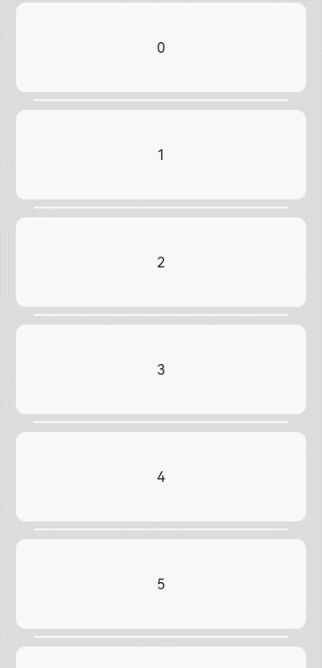

# Scrollable Component Common APIs

<!--Kit: ArkUI-->
<!--Subsystem: ArkUI-->
<!--Owner: @rongShao-Z; @yangcan18-->
<!--Designer: @yangcan18-->
<!--Tester: @leiyuqian-->
<!--Adviser: @Brilliantry_Rui-->
<!-- md-trans-meta sourceCommit=937aa556d9f58747c9a612a2370c25cbc5101587 translatedAt=2026-08-19T07:16:58.108Z pushedAt=2026-08-20T10:45:03.062Z -->

The common scrollable component APIs currently support only the [List](ts-container-list.md), [Grid](ts-container-grid.md), [Scroll](ts-container-scroll.md), and [WaterFlow](ts-container-waterflow.md) components. They provide common attributes such as scrollbar style, edge effect, nested scrolling, friction coefficient control, and content clipping, as well as event callbacks such as scroll start, scroll stop, and reaching the boundary. You can use these APIs to uniformly manage the behavior of various scrollable components, which are applicable to scenarios such as list display, grid layout, waterfall flow arrangement, and page scrolling.

>  **NOTE**
>
>  The initial APIs of this module are supported since API version 8. Updates will be marked with a superscript to indicate their earliest API version.

## Attributes

### scrollBar<sup>11+</sup>

scrollBar(barState: BarState): T

Sets the scrollbar state.

**Atomic service API**: This API can be used in atomic services since API version 11.

**Model restriction**: This API can be used only in the stage model.

**System capability**: SystemCapability.ArkUI.ArkUI.Full

**Parameters**

| Name  | Type                                     | Mandatory| Description                                  |
| -------- | ----------------------------------------- | ---- | -------------------------------------- |
| barState | [BarState](ts-appendix-enums.md#barstate) | Yes  | Scrollbar state. **BarState.Off** indicates that the scrollbar is not displayed; **BarState.Auto** indicates that the scrollbar is displayed as needed; **BarState.On** indicates that the scrollbar is always displayed.<br/>Default value: **BarState.Auto** for the **List**, **Grid**, and **Scroll** components, and **BarState.Off** for the **WaterFlow** component. |

**Return value**

| Type| Description          |
| --- | -------------- |
| T | Current scrollable component.|

### scrollBarColor<sup>11+</sup>

scrollBarColor(color: Color | number | string): T

Sets the scrollbar color.

**Atomic service API**: This API can be used in atomic services since API version 11.

**Model restriction**: This API can be used only in the stage model.

**System capability**: SystemCapability.ArkUI.ArkUI.Full

**Parameters**

| Name| Type                                                        | Mandatory| Description          |
| ------ | ------------------------------------------------------------ | ---- | -------------- |
| color  | [Color](ts-appendix-enums.md#color)&nbsp;\|&nbsp;number&nbsp;\|&nbsp;string | Yes   | Scrollbar color.<br>The default value on children's smartwatches is **'\#ffffff'**, which indicates white (100% opacity). The default value on other devices is **'\#182431'**, which indicates dark blue-gray (40% opacity).<br>A number value indicates a HEX color in RGB or ARGB format, for example, **0xffffff**. A string value indicates a color in RGB or ARGB format, for example, **'#ffffff'**. |

**Return value**

| Type| Description          |
| --- | -------------- |
| T | Current scrollable component.|

### scrollBarColor<sup>22+</sup>

scrollBarColor(color: Color | number | string | Resource): T

Sets the scrollbar color. Compared with [scrollBarColor<sup>11+</sup>](#scrollbarcolor11), this API supports the Resource type for the **color** parameter.

**Atomic service API**: This API can be used in atomic services since API version 22.

**Model restriction**: This API can be used only in the stage model.

**System capability**: SystemCapability.ArkUI.ArkUI.Full

**Parameters**

| Name| Type                                                        | Mandatory| Description          |
| ------ | ------------------------------------------------------------ | ---- | -------------- |
| color  | [Color](ts-appendix-enums.md#color)&nbsp;\|&nbsp;number&nbsp;\|&nbsp;string&nbsp;\|&nbsp;[Resource](ts-types.md#resource) | Yes   | Scrollbar color.<br>The default value on children's smartwatches is **'\#ffffff'**, which indicates white (100% opacity). The default value on other devices is **'\#182431'**, which indicates dark blue-gray (40% opacity).<br>A number value indicates a HEX color in RGB or ARGB format, for example, **0xffffff**. A string value indicates a color in RGB or ARGB format, for example, **'#ffffff'**. |

**Return value**

| Type| Description          |
| --- | -------------- |
| T | Current scrollable component.|

### scrollBarWidth<sup>11+</sup>

scrollBarWidth(value: number | string): T

Sets the width of the scrollbar. Percentage values are not supported. After the width is set, the scrollbar width in both the normal state and the pressed state is the set value. If the scrollbar width exceeds the visible size of the scrollable component along the main axis, the scrollbar width changes to the default value of 4 vp.

**Atomic service API**: This API can be used in atomic services since API version 11.

**Model restriction**: This API can be used only in the stage model.

**System capability**: SystemCapability.ArkUI.ArkUI.Full

**Parameters**

| Name| Type                      | Mandatory| Description                                     |
| ------ | -------------------------- | ---- | ----------------------------------------- |
| value  | number&nbsp;\|&nbsp;string | Yes   | Width of the scrollbar.<br/>Default value: **4**<br/>Unit: vp <br/>Value range: [0, +∞). If the value is less than 0, the default value is used, and on a children's smartwatch, the default value 5 vp is restored. If the value is 0, the scrollbar is not displayed. |

**Return value**

| Type| Description          |
| --- | -------------- |
| T | Current scrollable component.|

### scrollBarWidth

scrollBarWidth(value: number | string | Resource): T

Sets the width of the scrollbar. Percentage values are not supported. After the width is set, the scrollbar width in both the normal state and the pressed state is the set value. If the scrollbar width exceeds the visible size of the scrollable component along the main axis, the scrollbar width changes to the default value of 4 vp. Resource type is supported.

If this API is not used, the scrollbar width is 4 vp.

**Since**: 26.0.0

**Model restriction**: This API can be used only in the stage model.

**Atomic service API**: This API can be used in atomic services since API version 26.0.0.

**System capability**: SystemCapability.ArkUI.ArkUI.Full

**Parameters**

| Name| Type                                                        | Mandatory| Description                                                        |
| ------ | ------------------------------------------------------------ | ---- | ------------------------------------------------------------ |
| value  | number&nbsp;\|&nbsp;string \|&nbsp;[Resource](ts-types.md#resource) | Yes   | Scrollbar width.<br>Unit: vp<br>The value range is [0, +∞). If this parameter is set to a value less than 0, **4vp** is used, and **5vp** is used for children's smartwatches. The value **0** means not to show the scrollbar. |

**Return value**

| Type| Description          |
| --- | -------------- |
| T | Current scrollable component.|

### scrollBarHeight

scrollBarHeight(height: LengthMetrics | undefined): T

Sets the height of the scrollbar track.

If this API is not called, the height of the scrollbar track adapts to the height of the scrollable component by default. The default height on a wearable is 37 vp.

>  **NOTE**
>
>  Ensure that the sum of the values set for **scrollBarHeight** and [scrollBarMargin](#scrollbarmargin20) does not exceed the height of the scrollable component. Otherwise, the scrollbar may fail to display properly.

**Since**: 26.0.0

**Model restriction**: This API can be used only in the stage model.

**Atomic service API:** This API can be used in atomic services since API version 26.0.0.

**System capability**: SystemCapability.ArkUI.ArkUI.Full

**Parameters** 

| Name | Type | Mandatory | Description |
| ------ | ---- | ---- | ---- |
| height | [LengthMetrics](../js-apis-arkui-graphics.md#lengthmetrics12) \| undefined | Yes | Height of the scrollbar track.<br/>The value must be greater than or equal to 0. If it is set to **undefined** or a value less than 0, the height adapts to the scrollable component, and on a wearable it is restored to the default value 37 vp. If it is set to 0, the scrollbar is not displayed. |

**Return value**

| Type | Description |
| --- | -------------- |
| T | Current scrollable component. |

### edgeEffect<sup>11+</sup>

edgeEffect(edgeEffect: EdgeEffect, options?: EdgeEffectOptions): T

Sets the effect used when the scroll boundary is reached.

**Atomic service API**: This API can be used in atomic services since API version 11.

**Model restriction**: This API can be used only in the stage model.

**System capability**: SystemCapability.ArkUI.ArkUI.Full

**Parameters**

| Name               | Type                                             | Mandatory| Description                                                        |
| --------------------- | ------------------------------------------------- | ---- | ------------------------------------------------------------ |
| edgeEffect            | [EdgeEffect](ts-appendix-enums.md#edgeeffect)     | Yes  | Effect used when the scroll boundary is reached. The spring and shadow effects are supported.<br>Default value: **EdgeEffect.None** for the **Grid**, **Scroll**, and **WaterFlow** components and **EdgeEffect.Spring** for the **List** component|
| options | [EdgeEffectOptions](#edgeeffectoptions11) | No | Whether to enable the sliding effect when the component content size is smaller than the component itself. Since API version 18, the edge where the edge effect takes effect can be set. Setting it to **{ alwaysEnabled: true }** enables the sliding effect, and **{ alwaysEnabled: false }** disables it.<br/>Default value:<br/>For the **List**, **Grid**, and **WaterFlow** components, the default value is **{ alwaysEnabled: false }**; for the **Scroll** component, the default value is **{ alwaysEnabled: true }**. Since API version 18, the **effectEdge** field is added by default, with the value **EffectEdge.START \| EffectEdge.END**.|

**Return value**

| Type| Description          |
| --- | -------------- |
| T | Current scrollable component.|

### nestedScroll<sup>11+</sup>

nestedScroll(value: NestedScrollOptions): T

Sets the nested scrolling mode in the forward and backward directions to implement scrolling linkage with the parent component.

**Atomic service API**: This API can be used in atomic services since API version 11.

**Model restriction**: This API can be used only in the stage model.

**System capability**: SystemCapability.ArkUI.ArkUI.Full

**Parameters**

| Name| Type                                                 | Mandatory| Description          |
| ------ | ----------------------------------------------------- | ---- | -------------- |
| value  | [NestedScrollOptions](#nestedscrolloptions10) | Yes  | Nested scrolling options.<br>Default value: **{ scrollForward: NestedScrollMode.SELF_ONLY, scrollBackward: NestedScrollMode.SELF_ONLY }**|

**Return value**

| Type| Description          |
| --- | -------------- |
| T | Current scrollable component.|

### enableScrollInteraction<sup>11+</sup>

enableScrollInteraction(value: boolean): T

Sets whether to support scroll gestures.

**Atomic service API**: This API can be used in atomic services since API version 11.

**Model restriction**: This API can be used only in the stage model.

**System capability**: SystemCapability.ArkUI.ArkUI.Full

**Parameters**

| Name| Type   | Mandatory| Description                               |
| ------ | ------- | ---- | ----------------------------------- |
| value  | boolean | Yes   | Whether to support finger or mouse wheel gestures. The value **true** means supported, and **false** means not supported. However, this does not affect the scrolling APIs of the controller [Scroller](ts-container-scroll.md#scroller) or the [backToTop](#backtotop15) attribute.<br/>Default value: **true** |

**Return value**

| Type| Description          |
| --- | -------------- |
| T | Current scrollable component.|

### friction<sup>11+</sup>

friction(value: number | Resource): T

Sets the friction coefficient. It takes effect when the scroll area is swiped manually, and affects only the inertial scrolling process. It indirectly affects the linkage effect between nested scrollable components during inertial scrolling (for example, the chain animation [chainAnimation](ts-container-list.md#chainanimation) of the List component). It applies to scenarios where the deceleration speed of inertial scrolling needs to be adjusted. If the value is set to less than or equal to 0, the default value is used.

**Atomic service API**: This API can be used in atomic services since API version 11.

**Model restriction**: This API can be used only in the stage model.

**System capability**: SystemCapability.ArkUI.ArkUI.Full

**Parameters**

| Name| Type                                                | Mandatory| Description                                                     |
| ------ | ---------------------------------------------------- | ---- | --------------------------------------------------------- |
| value  | number&nbsp;\|&nbsp;[Resource](ts-types.md#resource) | Yes  | Friction coefficient.<br>Default value: **0.6** for non-wearable devices and **0.9** for wearable devices.<br>Since API version 11, the default value for non-wearable devices is **0.7**.<br>Since API version 12, the default value for non-wearable devices is **0.75**.<br>Value range: (0, +∞). If this parameter is set to a value less than or equal to 0, the default value is used.|

**Return value**

| Type| Description          |
| --- | -------------- |
| T | Current scrollable component.|

### flingSpeedLimit<sup>11+</sup>

flingSpeedLimit(speedLimit: number): T

Sets the maximum initial speed for inertial animation after a fling gesture.

> **NOTE**
>
> - Inertial animation is the effect that the scrolling content continues to scroll and gradually decelerates and stops after the finger quickly flings and leaves the screen. It is also called inertial scrolling.
>
> - Inertial animation is triggered when the finger quickly flings and leaves the screen, or when the [fling](ts-container-scroll.md#fling12) method is called.
>
> - Inertial animation is not generated when the mouse wheel or keyboard arrow keys are used to scroll, or when the [scrollTo](ts-container-scroll.md#scrollto) method is used to scroll to a specified position.
>
> - If the inertial animation is triggered by the [fling](ts-container-scroll.md#fling12) method, the **flingSpeedLimit** setting does not take effect.

**Atomic service API**: This API can be used in atomic services since API version 11.

**Model restriction**: This API can be used only in the stage model.

**System capability**: SystemCapability.ArkUI.ArkUI.Full

**Parameters**

| Name    | Type  | Mandatory| Description                           |
| ---------- | ------ | ---- | ------------------------------- |
| speedLimit | number | Yes  | Maximum initial speed for inertial animation.<br>Default value: **9000**<br>Unit: vp/s<br>Value range: (0, +∞). If this parameter is set to a value less than or equal to 0, the default value is used.|

**Return value**

| Type| Description          |
| --- | -------------- |
| T | Current scrollable component.|

### fadingEdge<sup>14+</sup>

fadingEdge(enabled: Optional&lt;boolean&gt;, options?: FadingEdgeOptions): T

Sets whether to enable the edge fading effect and the length of the fading edge.

> **NOTE**
>
> **fadingEdge** is implemented by setting the [overlay](ts-universal-attributes-overlay.md#overlay) attribute and the [blendMode](ts-universal-attributes-image-effect.md#blendmode11) attribute (with the parameter values **BlendMode.SRC_OVER** and **BlendApplyType.OFFSCREEN**). When **fadingEdge** takes effect, it overrides the **.overlay()** and **.blendMode()** attributes of the original component, and causes the APIs that require screen capture of the current component and its child components to fail to capture the correct image. The APIs that require screen capture include [blur](ts-universal-attributes-image-effect.md#blur), [linearGradientBlur](ts-universal-attributes-image-effect.md#lineargradientblur12), [brightness](ts-universal-attributes-image-effect.md#brightness), [visualEffect](ts-universal-attributes-filter-effect.md#visualeffect), [grayscale](ts-universal-attributes-image-effect.md#grayscale), [saturate](ts-universal-attributes-image-effect.md#saturate), [contrast](ts-universal-attributes-image-effect.md#contrast), [invert](ts-universal-attributes-image-effect.md#invert), [sepia](ts-universal-attributes-image-effect.md#sepia), [hueRotate](ts-universal-attributes-image-effect.md#huerotate), [colorBlend](ts-universal-attributes-image-effect.md#colorblend), [lightUpEffect](ts-universal-attributes-image-effect.md#lightupeffect12), [pixelStretchEffect](ts-universal-attributes-image-effect.md#pixelstretcheffect12), [blendMode](ts-universal-attributes-image-effect.md#blendmode11), and [backgroundBrightness](ts-universal-attributes-background.md#backgroundbrightness12).
>
> When **fadingEdge** takes effect, it is recommended not to set the [background](ts-universal-attributes-background.md#background10) related attributes on the component on which the **fadingEdge** attribute is set, because doing so affects the fading display effect.
>
> When **fadingEdge** takes effect, it is recommended not to set the [systemMaterial](ts-universal-attributes-image-effect.md#systemmaterial) related attributes on the component on which the **fadingEdge** attribute is set or on its child components, because doing so affects the display effect of the system material and causes the material effect to be inconsistent with the expected effect.
>
> When **fadingEdge** takes effect, the component on which the **fadingEdge** attribute is set is clipped to the boundary. Setting the [clip](ts-universal-attributes-sharp-clipping.md#clip12) attribute to **false** on this component does not take effect.

**Atomic service API**: This API can be used in atomic services since API version 14.

**Model restriction**: This API can be used only in the stage model.

**System capability**: SystemCapability.ArkUI.ArkUI.Full

**Parameters**

| Name | Type                                             | Mandatory| Description                                                        |
| ------- | ------------------------------------------------- | ---- | ------------------------------------------------------------ |
| enabled | [Optional](ts-universal-attributes-custom-property.md#optionalt)&lt;boolean&gt;                           | Yes  | Whether to enable the edge fading effect. **true** to enable, **false** otherwise.<br>Default value: **false**.|
| options | [FadingEdgeOptions](#fadingedgeoptions14)  | No  | Object defining edge fading effect properties, such as the fading edge length.<br>If the value is less than 0, undefined, or not set, the default value is used. The default length is 32 vp.<br>If the value exceeds half the height of the container, it is adjusted to exactly half the height of the container.|

**Return value**

| Type| Description          |
| --- | -------------- |
| T | Current scrollable component.|

### clipContent<sup>14+</sup>

clipContent(clip: ContentClipMode | RectShape): T

Sets the content clipping area for this scrollable component.

Since API version 26.0.0, child components within the content-layer clipping area can be displayed normally. In versions earlier than API version 26.0.0, when the content-layer clipping area of the [List](ts-container-list.md) component is larger than the component itself, child components that are completely outside the component area but within the clipping area are not displayed by default. To display them, set the **show** parameter of the **cachedCount** attribute of the component to **true**. However, because the preloaded child components set by the **cachedCount** attribute are executed only in idle time slots, flickering may occur due to untimely updates in scenarios such as component size changes and data updates.

**Atomic service API**: This API can be used in atomic services since API version 14.

**Model restriction**: This API can be used only in the stage model.

**System capability**: SystemCapability.ArkUI.ArkUI.Full

**Parameters**

| Name | Type                                             | Mandatory| Description                                                        |
| ------- | ------------------------------------------------- | ---- | ------------------------------------------------------------ |
| clip | [ContentClipMode](#contentclipmode14)&nbsp;\|&nbsp;[RectShape](../js-apis-arkui-shape.md#rectshape)   | Yes   | Clipping applies only to the content of the scroll container, that is, its child nodes, and the background is not affected. When a custom rectangular area is passed in through **RectShape**, only the width, height, and [offset](../js-apis-arkui-shape.md#offset) relative to the upper left corner of the component are supported, and rounded corners are not supported.<br>Default value: the default value for **Grid** and **Scroll** is **ContentClipMode.BOUNDARY**, and the default value for **List** and **WaterFlow** is **ContentClipMode.CONTENT_ONLY**. |

**Return value**

| Type| Description          |
| --- | -------------- |
| T | Current scrollable component.|

### backToTop<sup>15+</sup>

backToTop(backToTop: boolean): T

Sets whether to enable the back-to-top feature for the scrollable component when the status bar is touched.

When a status bar touch event is received, the scrollable component on the current page can scroll to the top with an animation. This behavior does not affect scrollable components in background applications, which will not scroll to the top. This attribute is independent of the [enableScrollInteraction](#enablescrollinteraction11) setting.

**Atomic service API**: This API can be used in atomic services since API version 15.

**Model restriction**: This API can be used only in the stage model.

**System capability**: SystemCapability.ArkUI.ArkUI.Full

**Parameters**

| Name| Type   | Mandatory| Description                                          |
| ------ | ------- | ---- | ---------------------------------------------- |
| backToTop  | boolean | Yes  | Whether to enable the back-to-top feature for the scrollable component when the status bar is touched. **true** to enable, **false** otherwise.<br>Default value:<br>Versions earlier than API version 18: **false**<br>API version 18 and later: **false** for horizontal scrolling and **true** for vertical scrolling|

**Return value**

| Type| Description          |
| --- | -------------- |
| T | Current scrollable component.|

### scrollBarMargin<sup>20+</sup>

scrollBarMargin(margin: ScrollBarMargin): T

Sets the margin of the scrollbar. The margin is calculated based on the distance by which the scrollbar avoids the rounded corner area of the scrollable component. If the scrollbar area is smaller than the minimum length of the scrollbar, the scrollbar is not displayed. If this attribute is set, the automatic margin adjustment of [autoAdjustScrollBarMargin](#autoadjustscrollbarmargin) does not take effect. Ensure that the sum of [scrollBarHeight](#scrollbarheight) and the value of this attribute does not exceed the height of the scrollable component; otherwise, the scrollbar may not be displayed properly.

**Atomic service API**: This API can be used in atomic services since API version 20.

**Model restriction**: This API can be used only in the stage model.

**System capability**: SystemCapability.ArkUI.ArkUI.Full

**Parameters**

| Name| Type   | Mandatory| Description                                 |
| ------ | ------- | ---- | ------------------------------------- |
| margin  | [ScrollBarMargin](ts-types.md#scrollbarmargin20)  | Yes   |Start and end margins of the scrollbar.<br/>Default value for children's smartwatches: **{start: LengthMetrics.vp(42), end: LengthMetrics.vp(0)}**<br/>Default value for other devices: **{start: LengthMetrics.vp(0), end: LengthMetrics.vp(0)}** |

**Return value**

| Type| Description          |
| --- | -------------- |
| T | Current scrollable component.|

### autoAdjustScrollBarMargin

autoAdjustScrollBarMargin(enable: boolean | undefined): T

Sets whether to automatically adjust the margin of the scrollbar. By default, the margin is not automatically adjusted.

When the automatic margin adjustment feature is enabled, the scrolling direction of the scrollbar avoids the [padding](ts-universal-attributes-size.md#padding), [safeAreaPadding](ts-universal-attributes-size.md#safeareapadding14) and [contentStartOffset](#contentstartoffset22)/[contentEndOffset](#contentendoffset22) areas of the component. If the [scrollBarMargin](#scrollbarmargin20) attribute is set, this feature does not take effect. If the sum of the horizontal [padding](ts-universal-attributes-size.md#padding), [safeAreaPadding](ts-universal-attributes-size.md#safeareapadding14), [contentStartOffset](#contentstartoffset22) and [contentEndOffset](#contentendoffset22) values is greater than the width of the component, or the sum of the vertical values is greater than the height of the component, the scrollbar is not displayed.

**Since**: 26.0.0

**Model restriction**: This API can be used only in the stage model.

**Atomic service API:** This API can be used in atomic services since API version 26.0.0.

**System capability**: SystemCapability.ArkUI.ArkUI.Full

**Parameters**

| Name| Type   | Mandatory| Description                                 |
| ------ | ------- | ---- | ------------------------------------- |
| enable  | boolean&nbsp;\|&nbsp;undefined  | Yes  | Whether to automatically adjust the margin.<br>**true**: yes.<br>**false**: no.<br>**undefined**: no.|

**Return value**

| Type| Description          |
| --- | -------------- |
| T | Current scrollable component. |

### digitalCrownSensitivity<sup>18+</sup>

digitalCrownSensitivity(sensitivity: Optional\<CrownSensitivity>): T

Sets the sensitivity of the digital crown's response to events.

A component must have focus to receive [crown events](ts-universal-events-crown.md). Focus control can be managed using [focusable](ts-universal-attributes-focus.md#focusable), [defaultFocus](ts-universal-attributes-focus.md#defaultfocus9), and [focusOnTouch](ts-universal-attributes-focus.md#focusontouch9).

**Atomic service API**: This API can be used in atomic services since API version 18.

**Model restriction**: This API can be used only in the stage model.

**System capability**: SystemCapability.ArkUI.ArkUI.Full

**Parameters**

| Name     | Type                                                        | Mandatory| Description                                                        |
| ----------- | ------------------------------------------------------------ | ---- | ------------------------------------------------------------ |
| sensitivity | [Optional](ts-universal-attributes-custom-property.md#optionalt)&lt;[CrownSensitivity](ts-appendix-enums.md#crownsensitivity18)&gt; | Yes | Crown response sensitivity. **CrownSensitivity.LOW** indicates low sensitivity, with a slower scrolling response; **CrownSensitivity.MEDIUM** indicates medium sensitivity, with a moderate scrolling response; **CrownSensitivity.HIGH** indicates high sensitivity, with a faster scrolling response.<br/>Default value: **CrownSensitivity.MEDIUM**, with a moderate response speed. |

**Return value**

| Type| Description          |
| --- | -------------- |
| T | Current scrollable component.|

### contentStartOffset<sup>22+</sup>

contentStartOffset(offset: number | Resource): T

Sets the offset from the start of the content area. When the component scrolls to the start position, the content area maintains a specified distance from the component's display boundary.

If the combined value of contentStartOffset and contentEndOffset exceeds the scrollable content area length, both offsets are reset to 0.

**Atomic service API**: This API can be used in atomic services since API version 22.

**Model restriction**: This API can be used only in the stage model.

**System capability**: SystemCapability.ArkUI.ArkUI.Full

**Parameters**

| Name| Type  | Mandatory| Description                                           |
| ------ | ------ | ---- | ----------------------------------------------- |
| offset  | number \| [Resource](ts-types.md#resource) | Yes   | Offset of the start position of the content area.<br/>Default value: **0**<br/>Unit: vp<br/>Value range: [0, +∞)<br/>If an invalid value such as a negative number or a non-numeric Resource is set, the default value is used.|

**Return value**

| Type| Description          |
| --- | -------------- |
| T | Current scrollable component.|

### contentEndOffset<sup>22+</sup>

contentEndOffset(offset: number | Resource): T

Sets the offset from the end of the content area. When the component scrolls to the end position, the content area maintains a specified distance from the component's display boundary.

If the combined value of contentStartOffset and contentEndOffset exceeds the scrollable content area length, both offsets are reset to 0.

**Atomic service API**: This API can be used in atomic services since API version 22.

**Model restriction**: This API can be used only in the stage model.

**System capability**: SystemCapability.ArkUI.ArkUI.Full

**Parameters**

| Name| Type  | Mandatory| Description                                         |
| ------ | ------ | ---- | --------------------------------------------- |
| offset  | number \| [Resource](ts-types.md#resource) | Yes   | Offset of the end of the content area.<br/>Default value: **0**<br/>Unit: vp <br/>Value range: [0, +∞)<br/>If an invalid value such as a negative number or a non-numeric Resource is set, the default value is used.|

**Return value**

| Type| Description          |
| --- | -------------- |
| T | Current scrollable component.|

### enableScrollWithMouse

enableScrollWithMouse(enabled: boolean | undefined): T

Sets whether to support scrolling by dragging with the left mouse button pressed. If this API is not called, scrolling by dragging with the left mouse button pressed is not supported by default.

**Since**: 26.0.0

**Model restriction**: This API can be used only in the stage model.

**Atomic service API:** This API can be used in atomic services since API version 26.0.0.

**System capability**: SystemCapability.ArkUI.ArkUI.Full

**Parameters**

| Name| Type  | Mandatory| Description                                         |
| ------ | ------ | ---- | --------------------------------------------- |
| enabled  | boolean \| undefined | Yes  | Whether to support scrolling by dragging with the left mouse button pressed.<br>**true**: yes.<br>**false**: no.<br>**undefined**: no.|

**Return value**

| Type| Description          |
| --- | -------------- |
| T | Current scrollable component. |

## Events

### onReachStart<sup>11+</sup>

onReachStart(event: () => void): T

Triggered when the scrollable component reaches the start position.

This event is triggered once when the component is initialized and once when the component scrolls to the start position. If the edge effect is set to a spring effect, this event is triggered once when the swipe passes the start position, and triggered again when the swipe rebounds back to the start position.

**Atomic service API**: This API can be used in atomic services since API version 11.

**Model restriction**: This API can be used only in the stage model.

**System capability**: SystemCapability.ArkUI.ArkUI.Full

**Parameters**

| Name| Type  | Mandatory| Description                |
| ------ | ------ | ---- | -------------------- |
| event  | () => void | Yes  | Callback invoked when the scrollable component reaches the start position. |

**Return value**

| Type| Description          |
| --- | -------------- |
| T | Current scrollable component.|

### onReachEnd<sup>11+</sup>

onReachEnd(event: () => void): T

Triggered when the scrollable component reaches the end position.

Triggered once when the scrollable component is initialized and is already at the end position. When the edge effect is a spring effect, this event is triggered once when the component is swiped past the end position, and once again when it bounces back to the end position.

**Atomic service API**: This API can be used in atomic services since API version 11.

**Model restriction**: This API can be used only in the stage model.

**System capability**: SystemCapability.ArkUI.ArkUI.Full

**Parameters**

| Name| Type  | Mandatory| Description                |
| ------ | ------ | ---- | -------------------- |
| event  | () => void | Yes  | Callback invoked when the scrollable component reaches the end position.|

**Return value**

| Type| Description          |
| --- | -------------- |
| T | Current scrollable component.|

### onScrollStart<sup>11+</sup>

onScrollStart(event: () => void): T

Triggered when the scrollable component starts scrolling initiated by the user's finger dragging the component or its scrollbar. This event is also triggered when the animation contained in the scrolling triggered by [Scroller](ts-container-scroll.md#scroller) starts.

Trigger conditions:

1. The scrollable component starts scrolling, supporting various input settings including keyboard and mouse operations.

2. Scrolling is initiated through scroller controller API calls with transition animation effects.

**Atomic service API**: This API can be used in atomic services since API version 11.

**Model restriction**: This API can be used only in the stage model.

**System capability**: SystemCapability.ArkUI.ArkUI.Full

**Parameters**

| Name| Type  | Mandatory| Description                |
| ------ | ------ | ---- | -------------------- |
| event  | () => void | Yes  | Callback invoked when scrolling starts.|

**Return value**

| Type| Description          |
| --- | -------------- |
| T | Current scrollable component.|

### onScrollStop<sup>11+</sup>

onScrollStop(event: () => void): T

Triggered when the scrollable component stops scrolling after the user's finger leaves the screen. This event is also triggered when the animation contained in the scrolling triggered by [Scroller](ts-container-scroll.md#scroller) stops.

Trigger conditions:

1. The scrollable component stops scrolling, supporting various input settings including keyboard and mouse operations.

2. The animation stops after scroller controller API calls with transition effects.

**Atomic service API**: This API can be used in atomic services since API version 11.

**Model restriction**: This API can be used only in the stage model.

**System capability**: SystemCapability.ArkUI.ArkUI.Full

**Parameters**

| Name| Type  | Mandatory| Description                |
| ------ | ------ | ---- | -------------------- |
| event  | () => void | Yes  | Callback invoked when scrolling stops.|

**Return value**

| Type| Description          |
| --- | -------------- |
| T | Current scrollable component.|

### onWillScroll<sup>12+</sup>

onWillScroll(handler: Optional&lt;OnWillScrollCallback&gt;): T

Triggered before the scrollable component scrolls. Comparison with [onDidScroll](#ondidscroll12): **onWillScroll** is triggered before scrolling occurs and can specify the offset to be scrolled through its return value, making it suitable for scenarios where scrolling needs to be intercepted or customized; **onDidScroll **is triggered when scrolling occurs and returns the actual scroll offset and scrolling state of the current frame, making it suitable for scenarios where only the scrolling process needs to be monitored. The two can be used together.

Called to return the offset to be scrolled in the current frame, the current scroll state, and the source of the scroll operation. The offset returned in the callback is the calculated offset to be scrolled, not the final actual scroll offset. You can specify the offset to be scrolled by the scrollable component through the return value of this callback. The parameter type of the [onWillScroll](./ts-container-scroll.md#onwillscroll12) API of the [Scroll](./ts-container-scroll.md) component is [ScrollOnWillScrollCallback](./ts-container-scroll.md#scrollonwillscrollcallback12).

>**NOTE**
>
> - This API can be called within [attributeModifier](ts-universal-attributes-attribute-modifier.md#attributemodifier) since API version 14.
>
> - When [ScrollEdge](ts-container-scroll.md#scrolledge) and [ScrollToIndex](ts-container-scroll.md#scrolltoindex) without animation are called, **onWillScroll** is not triggered.

**Atomic service API**: This API can be used in atomic services since API version 12.

**Model restriction**: This API can be used only in the stage model.

**System capability**: SystemCapability.ArkUI.ArkUI.Full

**Parameters**

| Name| Type| Mandatory| Description|
| ------ | ------ | ------ | ------|
| handler | [Optional](ts-universal-attributes-custom-property.md#optionalt)&lt;[OnWillScrollCallback](#onwillscrollcallback12)&gt; | Yes| Callback triggered when the scrollable component is about to scroll.|

**Return value**

| Type| Description          |
| --- | -------------- |
| T | Current scrollable component.|

### onDidScroll<sup>12+</sup>

onDidScroll(handler: OnScrollCallback): T

Triggered when the scrollable component scrolls. The return value is the offset amount by which the list has scrolled and the current scroll state.

>**NOTE**
>
> This API can be called within [attributeModifier](ts-universal-attributes-attribute-modifier.md#attributemodifier) since API version 14.

**Widget capability**: This API can be used in ArkTS widgets since API version 12.

**Atomic service API**: This API can be used in atomic services since API version 12.

**Model restriction**: This API can be used only in the stage model.

**System capability**: SystemCapability.ArkUI.ArkUI.Full

**Parameters**

| Name| Type| Mandatory| Description|
| ------ | ------ | ------ | ------|
| handler | [OnScrollCallback](#onscrollcallback12) | Yes| Callback triggered when the scrollable component scrolls.|

**Return value**

| Type| Description          |
| --- | -------------- |
| T | Current scrollable component.|

### onScroll<sup>(deprecated)</sup>

onScroll(event: (scrollOffset: number, scrollState: ScrollState) => void): T

Triggered when the scrollable component scrolls.

> **NOTE**
>
> This API is supported since API version 11 and deprecated since API version 12. The **onScroll** event of the [List](ts-container-list.md), [Grid](ts-container-grid.md), and [WaterFlow](ts-container-waterflow.md) components is triggered after layout. You are advised to use [onDidScroll](#ondidscroll12) instead. The **onScroll** event of the [Scroll](ts-container-scroll.md) component is triggered before layout. You are advised to use [onWillScroll](#onwillscroll12) instead.

**Atomic service API**: This API can be used in atomic services since API version 11.

**Model restriction**: This API can be used only in the stage model.

**System capability**: SystemCapability.ArkUI.ArkUI.Full

**Parameters**

| Name| Type| Mandatory| Description|
| ------ | ------ | ------ | ------|
| event  | (scrollOffset: number, scrollState: [ScrollState](ts-container-list.md#scrollstate)) => void | Yes| Callback triggered when the scrollable component scrolls.<br>**scrollOffset**: offset relative to the previous frame. The offset is positive when the scrollable component is scrolled up and negative when it is scrolled down. Unit: vp<br>**scrollState**: current scroll state.|

**Return value**

| Type| Description          |
| --- | -------------- |
| T | Current scrollable component.|

### onWillStartDragging<sup>21+</sup>

onWillStartDragging(handler: VoidCallback): T

Triggered when the scrollable component starts to be dragged.

**Widget capability**: This API can be used in ArkTS widgets since API version 21.

**Atomic service API**: This API can be used in atomic services since API version 21.

**Model restriction**: This API can be used only in the stage model.

**System capability**: SystemCapability.ArkUI.ArkUI.Full

**Parameters**

| Name | Type                                       | Mandatory| Description                        |
| ------- | ------------------------------------------ | ---- | ---------------------------- |
| handler | [VoidCallback](ts-types.md#voidcallback12) | Yes  | Callback invoked when the scrollable component starts to be dragged.|

**Return value**

| Type| Description              |
| ---- | ------------------ |
| T    | Current scrollable component.|

### onWillStopDragging<sup>20+</sup>

onWillStopDragging(handler: OnWillStopDraggingCallback): T

Triggered when the scrollable component is released. It is not triggered for scrolling via mouse wheel.

**Widget capability**: This API can be used in ArkTS widgets since API version 20.

**Atomic service API**: This API can be used in atomic services since API version 20.

**Model restriction**: This API can be used only in the stage model.

**System capability**: SystemCapability.ArkUI.ArkUI.Full

**Parameters**

| Name | Type                                                       | Mandatory| Description                        |
| ------- | ----------------------------------------------------------- | ---- | ---------------------------- |
| handler | [OnWillStopDraggingCallback](#onwillstopdraggingcallback20) | Yes  | Callback invoked when the scrollable component is released.|

**Return value**

| Type| Description              |
| ---- | ------------------ |
| T    | Current scrollable component.|

### onDidStopDragging<sup>21+</sup>

onDidStopDragging(handler: OnDidStopDraggingCallback): T

Called when the scrollable component stops being dragged.

**Widget capability**: This API can be used in ArkTS widgets since API version 21.

**Atomic service API**: This API can be used in atomic services since API version 21.

**Model restriction**: This API can be used only in the stage model.

**System capability**: SystemCapability.ArkUI.ArkUI.Full

**Parameters**

| Name | Type                                                      | Mandatory| Description                        |
| ------- | --------------------------------------------------------- | ---- | --------------------------- |
| handler | [OnDidStopDraggingCallback](#ondidstopdraggingcallback21) | Yes  | Callback invoked when the scrollable component stops being dragged.|

**Return value**

| Type| Description              |
| ---- | ------------------ |
| T    | Current scrollable component.|

### onWillStartFling<sup>21+</sup>

onWillStartFling(handler: VoidCallback): T

Triggered when the scrollable component is about to initiate an inertial animation.

> **NOTE**
>
> - If the inertial animation is triggered by the [fling](ts-container-scroll.md#fling12) method, **onWillStartFling** is not triggered.
>
> - For details about the triggering scenarios of the inertial animation, see the description of [flingSpeedLimit](#flingspeedlimit11).

**Widget capability**: This API can be used in ArkTS widgets since API version 21.

**Atomic service API**: This API can be used in atomic services since API version 21.

**Model restriction**: This API can be used only in the stage model.

**System capability**: SystemCapability.ArkUI.ArkUI.Full

**Parameters**

| Name | Type                                       | Mandatory| Description                        |
| ------- | ------------------------------------------ | ---- | ---------------------------- |
| handler | [VoidCallback](ts-types.md#voidcallback12) | Yes  | Callback invoked when the scrollable component is about to initiate an inertial animation.|

**Return value**

| Type| Description              |
| ---- | ------------------ |
| T    | Current scrollable component.|

### onDidStopFling<sup>21+</sup>

onDidStopFling(handler: VoidCallback): T

Triggered when the inertial animation of the scrollable component ends. It is not triggered if the animation is interrupted by a new swipe gesture.

**Widget capability**: This API can be used in ArkTS widgets since API version 21.

**Atomic service API**: This API can be used in atomic services since API version 21.

**Model restriction**: This API can be used only in the stage model.

**System capability**: SystemCapability.ArkUI.ArkUI.Full

**Parameters**

| Name | Type                                       | Mandatory| Description                        |
| ------- | ------------------------------------------ | ---- | ---------------------------- |
| handler | [VoidCallback](ts-types.md#voidcallback12) | Yes  | Callback invoked when the inertial animation of the scrollable component ends.|

**Return value**

| Type| Description              |
| ---- | ------------------ |
| T    | Current scrollable component.|

## ItemDragInfo

Provides information about the drag point.

**Atomic service API**: This API can be used in atomic services since API version 11.

**System capability**: SystemCapability.ArkUI.ArkUI.Full

| Name        | Type        | Read-Only| Optional|   Description        |
| ---------- | ---------- | -- | -- | ---------- |
| x | number | No| No|  X-coordinate of the dragged item, in vp.   |
| y | number | No| No|  Y-coordinate of the dragged item, in vp.   |

## NestedScrollOptions<sup>10+</sup>

Implements an object used to configure the [nestedScroll](#nestedscroll11) attribute.

**Atomic service API**: This API can be used in atomic services since API version 11.

**Model restriction**: This API can be used only in the stage model.

**System capability**: SystemCapability.ArkUI.ArkUI.Full

| Name  | Type | Read-Only| Optional| Description             |
| ----- | ------ | ------ | -- | ----------------- |
| scrollForward | [NestedScrollMode](ts-appendix-enums.md#nestedscrollmode10) | No | No | Nested scrolling options when the scrollable component scrolls toward the end. **NestedScrollMode.SELF_ONLY** means the component scrolls by itself only and does not scroll with the parent component; **NestedScrollMode.SELF_FIRST** means the component scrolls first, and the parent component scrolls after the component reaches the edge; **NestedScrollMode.PARENT_FIRST** means the parent component scrolls first, and the component scrolls after the parent component reaches the edge. |
| scrollBackward | [NestedScrollMode](ts-appendix-enums.md#nestedscrollmode10) | No | No | Nested scrolling options when the scrollable component scrolls toward the start. **NestedScrollMode.SELF_ONLY** means the component scrolls by itself only and does not scroll with the parent component; **NestedScrollMode.SELF_FIRST** means the component scrolls first, and the parent component scrolls after the component reaches the edge; **NestedScrollMode.PARENT_FIRST** means the parent component scrolls first, and the component scrolls after the parent component reaches the edge. |

## EdgeEffectOptions<sup>11+</sup>

Implements an object used to configure the [edgeEffect](#edgeeffect11) attribute.

**Model restriction**: This API can be used only in the stage model.

**System capability**: SystemCapability.ArkUI.ArkUI.Full

| Name  | Type | Read-Only| Optional| Description             |
| ----- | ------| ------- | -- | ----------------- |
| alwaysEnabled | boolean | No| No| Whether to enable the scroll effect when the component content is smaller than the component itself. **true** to enable, **false** otherwise. The default value is **false** for the [List](ts-container-list.md), [Grid](ts-container-grid.md), and [WaterFlow](ts-container-waterflow.md) components, and **true** for the [Scroll](ts-container-scroll.md) component.<br>**Atomic service API**: This API can be used in atomic services since API version 12.|
| effectEdge<sup>18+</sup> | number | No| Yes| Edge where the edge effect is applied.<br>With **[EffectEdge](#effectedge18).START**, the edge effect is applied to the start edge only. With **[EffectEdge](#effectedge18).END**, the edge effect is applied to the end edge only.<br>The default value is [EffectEdge](#effectedge18).START \| [EffectEdge](#effectedge18).END, which means that the edge effect is applied to both the start and end edges. If an invalid value is set, the edge effect is applied to both the start and end edges.<br>To disable the effect on both edges, set **edgeEffect** to **EdgeEffect.None**.<br>**Atomic service API**: This API can be used in atomic services since API version 18.|

## FadingEdgeOptions<sup>14+</sup>

Implements an object used to configure the [fadingEdge](#fadingedge14) attribute.

**Atomic service API**: This API can be used in atomic services since API version 14.

**Model restriction**: This API can be used only in the stage model.

**System capability**: SystemCapability.ArkUI.ArkUI.Full

| Name          | Type                                                        | Read-Only| Optional| Description                                                        |
| ---------------- | ------------------------------------------------------------ | ---- | -- | ------------------------------------------------------------ |
| fadingEdgeLength | [LengthMetrics](../js-apis-arkui-graphics.md#lengthmetrics12) | No  | Yes | Fading edge length. The default value is 32 vp. If the value is less than 0, **undefined**, or not set, the default value is used. If the set length exceeds half of the container height, the fading edge length is half of the container height. |

## EditModeOptions<sup>23+</sup>

Sets attributes of the **List** or **Grid** component in edit mode.

**Model restriction**: This API can be used only in the stage model.

**System capability**: SystemCapability.ArkUI.ArkUI.Full

| Name          | Type                                                        | Read-Only| Optional| Description                                                        |
| ---------------- | ------------------------------------------------------------ | ---- | -- | ------------------------------------------------------------ |
| enableGatherSelectedItemsAnimation | boolean | No  | Yes| Whether to enable the multi-selection gather animation. If this parameter is set to **true**, the gather animation is enabled. If this parameter is set to **false**, the gather animation is disabled.<br>The multi-selection gather animation is displayed only when [bindContextMenu](ts-universal-attributes-menu.md#bindcontextmenu8) is set on **GridItem** or **ListItem**, **responseType** is set to [ResponseType](ts-appendix-enums.md#responsetype8).LongPress, and [preview](ts-universal-attributes-menu.md#contextmenuoptions10) is set to **MenuPreviewMode.IMAGE** or **CustomBuilder**.<br>If [drag events](ts-universal-events-drag-drop.md) are set on **GridItem** or **ListItem**, whether to enable the gather animation is subject to the [dragPreviewOptions](ts-universal-attributes-drag-drop.md#dragpreviewoptions11) setting.<br>Default value: **false**.<br>**Atomic service API**: This API can be used in atomic services since API version 23.|
| onGetPreviewBadge | [OnGetPreviewBadgeCallback](#ongetpreviewbadgecallback23) | No  | Yes| Callback triggered to obtain the number of selected items when the animation for gathering selected items upon long press is about to start.<br>If this parameter is omitted, the number of selected items within the display range of the **Grid** or **List** component is used as the badge for the menu preview image shown after the animation for gathering selected items upon long press.<br>**Atomic service API**: This API can be used in atomic services since API version 23.|
| useDefaultMultiSelectStyle | boolean | No  | Yes| Whether to use the default multi-selection style.<br>The value **true** indicates that the check box is displayed after the **GridItem** or **ListItem** enters the multi-selection state. The value **false** indicates that no default style is available after the GridItem or ListItem enters the multi-selection state.<br>Default value: **true**<br>**Since**: 26.0.0<br>**Atomic service API**: This API can be used in atomic services since API version 26.0.0.|
| enableTwoFingerMultiSelect | boolean | No   | Yes | Whether to enable two-finger swipe multi-select.<br>The value **true** indicates that a two-finger swipe can enter edit mode and perform multi-select, which takes effect only when **List**/**Grid** uses [enableEditMode](ts-container-grid.md#enableeditmode) two-way binding or sets the [onEditModeChange](ts-container-grid.md#oneditmodechange) event callback; the value **false** indicates that a two-finger swipe cannot perform multi-select.<br>Default value: **true**<br>**Since:** 26.0.0<br>**Atomic service API:** This API can be used in atomic services since API version 26.0.0. |

## EffectEdge<sup>18+</sup>

Enumerates the edges where the edge effect is applied.

**Atomic service API**: This API can be used in atomic services since API version 18.

**Model restriction**: This API can be used only in the stage model.

**System capability**: SystemCapability.ArkUI.ArkUI.Full

| Name | Value  | Description        |
| ----- | ---- | ------------ |
| START | 1    | Start edge.|
| END   | 2    | End edge.|

## ContentClipMode<sup>14+</sup>

Enumerates the content clipping modes for the scrollable container.

**Atomic service API**: This API can be used in atomic services since API version 14.

**Model restriction**: This API can be used only in the stage model.

**System capability**: SystemCapability.ArkUI.ArkUI.Full

The figure below illustrates the clipping areas corresponding to each enumeration value after the component has been configured with margin and padding attributes.


| Name    |  Value | Description                                      |
| ------ | ------ | ---------------------------------------- |
| CONTENT_ONLY   |  0  | Clip to the content area, corresponding to the green area in the figure.|
| BOUNDARY |  1  | Clip to the component area, corresponding to the entire blue area in the figure.|
| SAFE_AREA  |  2  | Clip to the safe area configured for the component, corresponding to the entire yellow area in the figure.|

## OnWillScrollCallback<sup>12+</sup>

type OnWillScrollCallback = (scrollOffset: number, scrollState: ScrollState, scrollSource: ScrollSource) => void | ScrollResult

Triggered when the scrollable component is about to scroll.

**Atomic service API**: This API can be used in atomic services since API version 12.

**Model restriction**: This API can be used only in the stage model.

**System capability**: SystemCapability.ArkUI.ArkUI.Full

**Parameters**

| Name| Type| Mandatory| Description|
| ------ | ------ | ------ | ------|
| scrollOffset | number | Yes| Offset relative to the previous frame. The offset is positive when the scrollable component is scrolled up and negative when it is scrolled down.<br>Unit: vp|
| scrollState | [ScrollState](ts-container-list.md#scrollstate)| Yes| Current scroll state.|
| scrollSource | [ScrollSource](ts-appendix-enums.md#scrollsource12) | Yes| Source of the current scrolling operation.|

**Return value**

| Type                         | Description                                 |
| ----------------------------- | ------------------------------------ |
| void \| [ScrollResult](#scrollresult12)|  Returns a **ScrollResult** object if the scrollable component scrolls by the developer-specified offset relative to the previous frame; returns no **ScrollResult** object if the component scrolls by the offset specified by **scrollOffset** in the callback.<br>Value range: (-∞, +∞)|

## OnScrollCallback<sup>12+</sup>

type OnScrollCallback = (scrollOffset: number, scrollState: ScrollState) => void

Triggered when the scrollable component scrolls.

**Widget capability**: This API can be used in ArkTS widgets since API version 12.

**Atomic service API**: This API can be used in atomic services since API version 12.

**Model restriction**: This API can be used only in the stage model.

**System capability**: SystemCapability.ArkUI.ArkUI.Full

**Parameters**

| Name| Type| Mandatory| Description|
| ------ | ------ | ------ | ------|
| scrollOffset | number | Yes| Offset relative to the previous frame. The offset is positive when the scrollable component is scrolled up and negative when it is scrolled down.<br>Unit: vp|
| scrollState | [ScrollState](ts-container-list.md#scrollstate)| Yes| Current scroll state.|

## OnItemDragStartCallback<sup>23+</sup>

type OnItemDragStartCallback = (event: ItemDragInfo, itemIndex: number) => CustomBuilder

Called when a list or grid element starts to be dragged.

**Atomic service API**: This API can be used in atomic services since API version 23.

**System capability**: SystemCapability.ArkUI.ArkUI.Full

**Parameters**

| Name   | Type                                                     | Mandatory| Description                  |
| --------- | --------------------------------------------------------- | ---- | ---------------------- |
| event     | [ItemDragInfo](#itemdraginfo) | Yes   | Information about the drag point.         |
| itemIndex | number                                                    | Yes  | Index of the dragged element.|

**Return value**

| Type                         | Description                                 |
| ----------------------------- | ------------------------------------ |
| [CustomBuilder](ts-types.md#custombuilder8) |  Returns a **CustomBuilder** object for constructing the drag preview of the dragged element. If **void** is returned, the drag operation cannot be performed.|

## OnGetPreviewBadgeCallback<sup>23+</sup>

type OnGetPreviewBadgeCallback = () => boolean | number

Called to obtain the number of selected items when the animation for gathering selected items upon long press is about to start.

**Model restriction**: This API can be used only in the stage model.

**Atomic service API**: This API can be used in atomic services since API version 23.

**System capability**: SystemCapability.ArkUI.ArkUI.Full

**Return value**

| Type                         | Description                                 |
| ----------------------------- | ------------------------------------  |
| boolean \| number |  Whether to display a badge showing the count of selected items on the menu preview image after the animation for gathering selected items upon long press is played, or the specific number to display.<br>**true**: The number of selected items in a **Grid** or **List** component will be displayed as the badge. **false**: The badge is not displayed.<br>If a number is returned, it will be displayed as the badge by default. Value range: [0, 2<sup>31</sup>-1]. If the value is out of the range, it is treated as **true**.<br>If a floating-point number is returned, it is rounded down.|

## ScrollResult<sup>12+</sup>

Implements a return value object of the [OnWillScrollCallback](#onwillscrollcallback12) callback.

**Atomic service API**: This API can be used in atomic services since API version 12.

**Model restriction**: This API can be used only in the stage model.

**System capability**: SystemCapability.ArkUI.ArkUI.Full

| Name| Type| Read-Only| Optional| Description|
| ------ | ------ | ------ | -- | ------|
| offsetRemain | number | No| No| Amount by which the component is about to be scrolled, in vp.|

## ChildrenMainSize<sup>12+</sup>

Provides the size information of the child components of the **List** or **ListItemGroup** component along the main axis. This object only supports one-to-one binding to the **List** or **ListItemGroup** component.

> **NOTE**
>
> - The main axis size information must match the actual main axis size of the child components. When child components' main axis sizes change or components are added or removed, the **ChildrenMainSize** object methods must be invoked to notify the **List** or **ListItemGroup** component.

**Atomic service API**: This API can be used in atomic services since API version 12.

**Model restriction**: This API can be used only in the stage model.

**System capability**: SystemCapability.ArkUI.ArkUI.Full

### constructor<sup>12+</sup>

constructor(childDefaultSize: number)

A constructor used to create a **ChildrenMainSize** object.

**Atomic service API**: This API can be used in atomic services since API version 12.

**Model restriction**: This API can be used only in the stage model.

**System capability**: SystemCapability.ArkUI.ArkUI.Full

**Parameters**

| Name  | Type                           | Mandatory  | Description                  |
| ---- | ----------------------------- | ---- | -------------------- |
| childDefaultSize | number | Yes   | Default size of the child component along the main axis.<br>Unit: vp<br>**NOTE**<br>The value must be a finite non-negative number; otherwise, an exception will be thrown.|

**Error codes**

For details about the error codes, see [Universal Error Codes](../../errorcode-universal.md).

| ID| Error Message|
| ------- | -------- |
| 401      | Parameter error. Possible causes: 1. Mandatory parameters are left unspecified; 2. Incorrect parameters types; 3. Parameter verification failed.   |

### childDefaultSize<sup>12+</sup>

set childDefaultSize(value: number)

Sets the default size of the child component along the main axis.

**Atomic service API**: This API can be used in atomic services since API version 12.

**Model restriction**: This API can be used only in the stage model.

**System capability**: SystemCapability.ArkUI.ArkUI.Full

**Parameters**

| Name  | Type                           | Mandatory  | Description                  |
| ---- | ----------------------------- | ---- | -------------------- |
| value | number | Yes   | Default size of the child component along the main axis.<br>Unit: vp<br>**NOTE**<br>The value must be a finite non-negative number; otherwise, an exception will be thrown.|

**Error codes**

For details about the error codes, see [Universal Error Codes](../../errorcode-universal.md).

| ID| Error Message|
| ------- | -------- |
| 401      | Parameter error. Possible causes: 1. Mandatory parameters are left unspecified; 2. Incorrect parameters types; 3. Parameter verification failed.   |

get childDefaultSize(): number

Obtains the default size of the child component along the main axis.

**Atomic service API**: This API can be used in atomic services since API version 12.

**System capability**: SystemCapability.ArkUI.ArkUI.Full

**Return value**

| Type                                                        | Description                                                        |
| ------------------------------------------------------------ | ------------------------------------------------------------ |
| number | Default size of the child component along the main axis.<br>Unit: vp<br>Value range: [0, +∞)|

### splice<sup>12+</sup>

splice(start: number, deleteCount?: number, childrenSize?: Array\<number>): void

Performs batch operations to add, delete, or modify the size information of child components along the main axis.

**Atomic service API**: This API can be used in atomic services since API version 12.

**Model restriction**: This API can be used only in the stage model.

**System capability**: SystemCapability.ArkUI.ArkUI.Full

**Parameters**

| Name  | Type                           | Mandatory  | Description                  |
| ---- | ----------------------------- | ---- | -------------------- |
| start | number | Yes   | Index starting from 0, which indicates the position at which to begin modifying the size information of child components along the main axis.<br>**NOTE**<br>1. The value must be a finite non-negative number; otherwise, an exception will be thrown.<br>2. Non-integer values are truncated to the nearest integer.<br>3. Values exceeding the maximum index do not take effect.<br>Value range: [0, +∞)|
| deleteCount | number | No   | Number of size information entries to be deleted starting from the **start** position.<br>**NOTE**<br>1.  The value must be a finite non-negative number; otherwise, it will be treated as **0**.<br>2. Non-integer values are truncated to the nearest integer.<br>3. The result of (start + deleteCount - 1) can exceed the maximum index, which will delete all size information of child components starting from the **start** position.<br>Default value: **+∞**<br>Value range: [0, +∞)|
| childrenSize | Array\<number > | No   | Size information of all child components to be inserted, starting from the **start** position.<br>Unit for each value in the array: vp<br>**NOTE**<br>1. If the values in the array are finite non-negative number, they are considered specified sizes and will not change with the default size.<br>2. If the values in the array are not finite non-negative number, they will be treated as the default size and will change with the default size.<br>The default value is an empty array.<br>Value range: [0, +∞)|

**Error codes**

For details about the error codes, see [Universal Error Codes](../../errorcode-universal.md).

| ID| Error Message|
| ------- | -------- |
| 401      | Parameter error. Possible causes: 1. Mandatory parameters are left unspecified; 2. Incorrect parameters types; 3. Parameter verification failed.   |

> **NOTE**
>
> - If only the **start** parameter is used, the size information of the child components starting from the index **start** is deleted.
> - If only the **start** and **deleteCount** parameters are used, the size information of **deleteCount** child components starting from the index **start** is deleted. This is generally used when child components are deleted.
> - If all three parameters are used, the size information of **deleteCount** child components starting from the index **start** is deleted, and then all size information in **childrenSize** is inserted at the **start** position. This is generally used when child components are added or the sizes of child components in the main axis direction are updated in batches. If child components are only added, **deleteCount** should be 0, and the number of elements in **childrenSize** should be equal to the number of added child components. If only the sizes of child components in the main axis direction are updated in batches, the number of elements in **childrenSize** should be equal to **deleteCount**.
> - To notify that the size of a child component is the default size, the corresponding value in **childrenSize** should not be a finite non-negative value. Instead, it should be a value that can be processed as the default size, such as NaN or any negative value.

### update<sup>12+</sup>

update(index: number, childSize: number): void

Updates the main axis size information of the child component corresponding to the specified index.

**Atomic service API**: This API can be used in atomic services since API version 12.

**Model restriction**: This API can be used only in the stage model.

**System capability**: SystemCapability.ArkUI.ArkUI.Full

**Parameters**

| Name  | Type                           | Mandatory  | Description                  |
| ---- | ----------------------------- | ---- | -------------------- |
| index | number | Yes   | Index starting from 0, which indicates the position at which to begin modifying the size information of child components along the main axis.<br>**NOTE**<br>1. The value must be a finite non-negative number; otherwise, an exception will be thrown.<br>2. Non-integer values are truncated to the nearest integer.<br>3. Values exceeding the maximum index do not take effect.<br>Value range: [0, +∞)|
| childSize | number | Yes   | Size to be updated to.<br>Unit: vp<br>**NOTE**<br>1. If the value is a finite non-negative number, it is considered a specified size and will not change with the default size.<br>2. If the value is not a finite non-negative number, it will be processed as the default size and will change with the default size.<br>Value range: [0, +∞)|

**Error codes**

For details about the error codes, see [Universal Error Codes](../../errorcode-universal.md).

| ID| Error Message|
| ------- | -------- |
| 401      | Parameter error. Possible causes: 1. Mandatory parameters are left unspecified; 2. Incorrect parameters types; 3. Parameter verification failed.   |

## UIScrollableCommonEvent<sup>19+</sup>

Configures scroll event callbacks.

### setOnReachStart<sup>19+</sup>

setOnReachStart(callback: Callback\<void> | undefined): void

Sets the callback for the [onReachStart](#onreachstart11) event.

If the input parameter is **undefined**, the event callback is reset.

**Atomic service API**: This API can be used in atomic services since API version 19.

**Model restriction**: This API can be used only in the stage model.

**System capability**: SystemCapability.ArkUI.ArkUI.Full

**Parameters**

| Name| Type  | Mandatory| Description                      |
| ------ | ------ | ---- | -------------------------- |
| callback  | [Callback](./ts-types.md#callback12)\<void> &nbsp;\|&nbsp;undefined | Yes  | Callback for the **onReachStart** event.|

### setOnReachEnd<sup>19+</sup>

setOnReachEnd(callback: Callback\<void> | undefined): void

Sets the callback for the [onReachEnd](#onreachend11) event.

If the input parameter is **undefined**, the event callback is reset.

**Atomic service API**: This API can be used in atomic services since API version 19.

**Model restriction**: This API can be used only in the stage model.

**System capability**: SystemCapability.ArkUI.ArkUI.Full

**Parameters**

| Name| Type  | Mandatory| Description                      |
| ------ | ------ | ---- | -------------------------- |
| callback  | [Callback](./ts-types.md#callback12)\<void> &nbsp;\|&nbsp;undefined | Yes  | Callback for the **onReachEnd** event.|

### setOnScrollStart<sup>19+</sup>

setOnScrollStart(callback: Callback\<void> | undefined): void

Sets the callback for the [onScrollStart](#onscrollstart11) event.

If the input parameter is **undefined**, the event callback is reset.

**Atomic service API**: This API can be used in atomic services since API version 19.

**Model restriction**: This API can be used only in the stage model.

**System capability**: SystemCapability.ArkUI.ArkUI.Full

**Parameters**

| Name| Type  | Mandatory| Description                      |
| ------ | ------ | ---- | -------------------------- |
| callback  | [Callback](./ts-types.md#callback12)\<void> &nbsp;\|&nbsp; undefined | Yes  | Callback for the **onScrollStart** event.|

### setOnScrollStop<sup>19+</sup>

setOnScrollStop(callback: Callback\<void> | undefined): void

Sets the callback for the [onScrollStop](#onscrollstop11) event.

If the input parameter is **undefined**, the event callback is reset.

**Atomic service API**: This API can be used in atomic services since API version 19.

**Model restriction**: This API can be used only in the stage model.

**System capability**: SystemCapability.ArkUI.ArkUI.Full

**Parameters**

| Name| Type  | Mandatory| Description                      |
| ------ | ------ | ---- | -------------------------- |
| callback  | [Callback](./ts-types.md#callback12)\<void> &nbsp;\|&nbsp;undefined | Yes  | Callback for the **onScrollStop** event.|

### setOnScrollFrameBegin<sup>19+</sup>

setOnScrollFrameBegin(callback: OnScrollFrameBeginCallback | undefined): void

Sets the callback for the [onScrollFrameBegin](./ts-container-scroll.md#onscrollframebegin9) event.

If the input parameter is **undefined**, the event callback is reset.

**Atomic service API**: This API can be used in atomic services since API version 19.

**Model restriction**: This API can be used only in the stage model.

**System capability**: SystemCapability.ArkUI.ArkUI.Full

**Parameters**

| Name| Type  | Mandatory| Description                      |
| ------ | ------ | ---- | -------------------------- |
| callback  | [OnScrollFrameBeginCallback](./ts-container-scroll.md#onscrollframebegincallback18)&nbsp;\|&nbsp;undefined | Yes  | Callback for the **onScrollFrameBegin** event.|

## OnWillStopDraggingCallback<sup>20+</sup>

type OnWillStopDraggingCallback = (velocity: number) => void

Defines the callback invoked when the scrollable component is released.

**Widget capability**: This API can be used in ArkTS widgets since API version 20.

**Atomic service API**: This API can be used in atomic services since API version 20.

**Model restriction**: This API can be used only in the stage model.

**System capability**: SystemCapability.ArkUI.ArkUI.Full

**Parameters**

| Name  | Type  | Mandatory| Description                                                        |
| -------- | ------ | ---- | ------------------------------------------------------------ |
| velocity | number | Yes  | Scroll velocity. Positive for scrolling upward, negative for scrolling downward.<br>Unit: vp/s.|

## OnDidStopDraggingCallback<sup>21+</sup>

type OnDidStopDraggingCallback = (willFling: boolean) => void

Defines the callback invoked when the scrollable component stops being dragged.

**Widget capability**: This API can be used in ArkTS widgets since API version 21.

**Atomic service API**: This API can be used in atomic services since API version 21.

**Model restriction**: This API can be used only in the stage model.

**System capability**: SystemCapability.ArkUI.ArkUI.Full

**Parameters**

| Name    | Type   | Mandatory| Description                                                                             |
| --------  | ------- | ---- | -------------------------------------------------------------------------------- |
| willFling | boolean | Yes  | Whether an inertial animation will follow. **true**: An inertial animation will follow. **false**: No inertial animation will follow.|

## OnVisibleIndexesChangeCallback

type OnVisibleIndexesChangeCallback = (start: number, end: number) => void

Defines the callback type invoked when the indexes of the child components displayed by the lazy loading layout containers [LazyColumnLayout](ts-container-lazycolumnlayout.md), [LazyVGridLayout](ts-container-lazyvgridlayout.md), and [LazyVWaterFlowLayout](ts-container-lazyvwaterflowlayout.md) change.

> **NOTE**
>
> - When the lazy loading layout container has no child components, both **start** and **end** return -1.
> - When the lazy loading layout container has no child components in the visible area, both **start** and **end** return -1.

**Since**: 26.0.0

**Atomic service API**: This API can be used in atomic services since API version 26.0.0.

**Model restriction**: This API can be used only in the stage model.

**System capability**: SystemCapability.ArkUI.ArkUI.Full

**Parameters**

| Name| Type  | Mandatory| Description                                 |
| ------ | ------ | ---- | ------------------------------------- |
| start  | number | Yes   | Index of the start position of the visible area.<br/>Value range: [0, total number of child nodes - 1]. The value **-1** is returned when there is no child node or all child nodes are outside the visible area. |
| end    | number | Yes   | Index of the end position of the visible area.<br/>Value range: [0, total number of child nodes - 1]. The value **-1** is returned when there is no child node or all child nodes are outside the visible area. |

## Example

### Example 1: Implementing Gesture-based Scrolling

This example sets the [enableScrollInteraction](#enablescrollinteraction11) attribute to scroll a vertical list with gestures and call back the index when the currently displayed interface changes.

For details about ListDataSource and the complete code, see [Example 1: Adding a Scroll Event](./ts-container-list.md#example-1-adding-a-scroll-event).

<!--code_no_check-->

```ts
// xxx.ets
import { ListDataSource } from './ListDataSource';

@Entry
@Component
struct ListExample {
  private arr: ListDataSource = new ListDataSource([0, 1, 2, 3, 4, 5, 6, 7, 8, 9]);

  build() {
    Column() {
      List({ space: 20, initialIndex: 0 }) {
        LazyForEach(this.arr, (item: number) => {
          ListItem() {
            Text('' + item)
              .width('100%')
              .height(100)
              .fontSize(16)
              .textAlign(TextAlign.Center)
              .borderRadius(10)
              .backgroundColor(0xFFFFFF)
          }
        }, (item: number) => item.toString())
      }
      .enableScrollInteraction(true)
      .listDirection(Axis.Vertical) // Arrangement direction
      .scrollBar(BarState.Off)
      .friction(0.6)
      .divider({
        strokeWidth: 2,
        color: 0xFFFFFF,
        startMargin: 20,
        endMargin: 20
      }) // Divider between rows
      .edgeEffect(EdgeEffect.Spring) // Set the edge scrolling effect to Spring.
      .onScrollIndex((firstIndex: number, lastIndex: number, centerIndex: number) => {
        console.info('first' + firstIndex);
        console.info('last' + lastIndex);
        console.info('center' + centerIndex);
      })
      .onScrollVisibleContentChange((start: VisibleListContentInfo, end: VisibleListContentInfo) => {
        console.info(' start index: ' + start.index +
          ' start item group area: ' + start.itemGroupArea +
          ' start index in group: ' + start.itemIndexInGroup);
        console.info(' end index: ' + end.index +
          ' end item group area: ' + end.itemGroupArea +
          ' end index in group: ' + end.itemIndexInGroup);
      })
      .onDidScroll((scrollOffset: number, scrollState: ScrollState) => {
        console.info(`onDidScroll scrollState = ` + scrollState + `, scrollOffset = ` + scrollOffset);
      })
      .width('90%')
    }
    .width('100%')
    .height('100%')
    .backgroundColor(0xDCDCDC)
    .padding({ top: 5 })
  }
}
```



### Example 2: Setting Edge Fading

This example sets the [fadingEdge](#fadingedge14) attribute to enable the edge fading effect for the [List](ts-container-list.md) component and set the edge fading length.

For details about ListDataSource and the complete code, see [Example 1: Adding a Scroll Event](./ts-container-list.md#example-1-adding-a-scroll-event).

<!--code_no_check-->

```ts
// xxx.ets
import { LengthMetrics } from '@kit.ArkUI';
import { ListDataSource } from './ListDataSource';

@Entry
@Component
struct ListExample {
  private arr: ListDataSource = new ListDataSource([0, 1, 2, 3, 4, 5, 6, 7, 8, 9, 10, 11]);
  scrollerForList: Scroller = new Scroller();

  build() {
    Column() {

      List({ space: 20, initialIndex: 0, scroller: this.scrollerForList }) {
        LazyForEach(this.arr, (item: number) => {
          ListItem() {
            Text('' + item)
              .width('100%')
              .height(100)
              .fontSize(16)
              .textAlign(TextAlign.Center)
              .borderRadius(10)
              .backgroundColor(0xFFFFFF)
          }
        }, (item: number) => item.toString())
      }
      .fadingEdge(true, { fadingEdgeLength: LengthMetrics.vp(80) })
    }
    .width('100%')
    .height('100%')
    .backgroundColor(0xDCDCDC)
    .padding({ top: 5 })
  }
}
```


### Example 3: Setting the Clipping Region

This example sets the [clipContent](#clipcontent14) attribute to change the clipping area of the component's content layer.

```ts
// xxx.ets
import { LengthMetrics } from '@kit.ArkUI';

@Entry
@Component
struct ScrollExample {
  scroller: Scroller = new Scroller();
  private arr: number[] = [0, 1, 2, 3, 4, 5, 6, 7, 8, 9, 10, 11, 12];
  @State clipContent: ContentClipMode | RectShape | undefined = undefined;

  build() {
    Column() {
      Scroll(this.scroller) {
        Column() {
          ForEach(this.arr, (item: number) => {
            Text(item.toString())
              .width(300)
              .height(80)
              .fontSize(20)
              .textAlign(TextAlign.Center)
              .backgroundColor(Color.Grey)
          }, (item: number) => item.toString())
        }
      }
      .backgroundColor(Color.Blue)
      .clipContent(this.clipContent)
      .scrollBar(BarState.Off)
      .friction(0.6)
      .width(300)
      .height('50%')
      .padding(10)
      .safeAreaPadding(LengthMetrics.vp(10))
      .initialOffset({ yOffset: 80 })
      .margin({ top: 20 })

      Button('clipContent SAFE_AREA')
        .onClick(() => {
          this.clipContent = ContentClipMode.SAFE_AREA;
        }).margin({ top: 30 })

      Button('clipContent BOUNDARY')
        .onClick(() => {
          this.clipContent = ContentClipMode.BOUNDARY;
        }).margin({ top: 35 })

      Button('clipContent CONTENT_ONLY')
        .onClick(() => {
          this.clipContent = ContentClipMode.CONTENT_ONLY;
        }).margin({ top: 40 })
    }.width('100%').height('100%').backgroundColor(0xDCDCDC)
  }
}
```


### Example 4: Setting the Scrollbar Margin

This example demonstrates how to use the [scrollBarMargin](#scrollbarmargin20) attribute to adjust the scrollbar margins of a scrollable component, available since API version 20.

For details about ListDataSource and the complete code, see [Example 1: Adding a Scroll Event](./ts-container-list.md#example-1-adding-a-scroll-event).

<!--code_no_check-->

```ts
// xxx.ets
import { ListDataSource } from './ListDataSource';
import { LengthMetrics } from '@kit.ArkUI';

@Entry
@Component
struct ListExample {
  arr: ListDataSource = new ListDataSource([0, 1, 2, 3, 4, 5, 6, 7, 8, 9]);
  @State scrollBarMargin: ScrollBarMargin = { start: LengthMetrics.vp(0), end: LengthMetrics.vp(0) };

  build() {
    Stack({ alignContent: Alignment.TopStart }) {
      Column() {
        List({ space: 20, initialIndex: 0 }) {
          LazyForEach(this.arr, (item: number) => {
            ListItem() {
              Flex({ direction: FlexDirection.Row, alignItems: ItemAlign.Center }) {
                Text('' + item)
                  .width('100%')
                  .height(80)
                  .fontSize(20)
                  .textAlign(TextAlign.Center)
                  .borderRadius(10)
                  .backgroundColor(Color.White)
                  .flexShrink(1)
              }
            }
          }, (item: number) => item.toString())
        }.width('90%')
        .friction(0.6)
        .scrollBar(BarState.On)
        .scrollBarMargin(this.scrollBarMargin)
      }.width('100%')

      Button('scrollBarMargin')
        .onClick(() => {
          this.scrollBarMargin = { start: LengthMetrics.vp(45), end: LengthMetrics.vp(70) };
        }).margin({ top: 5, left: 20 })

      Button('scrollBarMargin2')
        .onClick(() => {
          this.scrollBarMargin = { start: LengthMetrics.vp(15), end: LengthMetrics.vp(100) };
        }).margin({ top: 200, left: 20 })
    }.width('100%').height('100%').backgroundColor(0xDCDCDC).padding({ top: 5 })
  }
}
```


<!--no_check-->