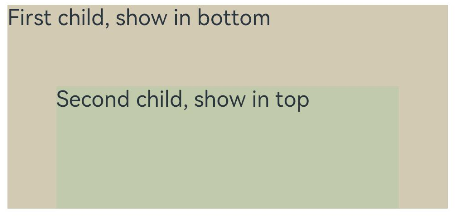

# Stack
<!--Kit: ArkUI-->
<!--Subsystem: ArkUI-->
<!--Owner: @fenglinbailu-->
<!--Designer: @lanshouren-->
<!--Tester: @liuli0427-->
<!--Adviser: @Brilliantry_Rui-->

The **Stack** component provides a stack container where child components are successively stacked and the latter one overwrites the previous one.

> **NOTE**
>
> - This component is supported since API version 7. Updates will be marked with a superscript to indicate their earliest API version.
> 
> - The general attribute [align](./ts-universal-attributes-location.md#align) supports the mirroring capability on this component.


## Child Components

Supported.

## APIs

Stack(options?: StackOptions)

The **Stack** component provides a stack container where child components are successively stacked and the latter one overwrites the previous one.

> **NOTE**
>
> Excessive component nesting can lead to performance degradation. In some scenarios, using component attributes directly or leveraging system APIs can achieve the same effect as the stack container, reducing the number of nested components and optimizing performance. For best practices, see [Preferentially Using Component Properties Instead of Nested Components](https://developer.huawei.com/consumer/en/doc/best-practices/bpta-component-nesting-optimization#section78181114123811).

**Widget capability**: This API can be used in ArkTS widgets since API version 9.

**Atomic service API**: This API can be used in atomic services since API version 11.

**System capability**: SystemCapability.ArkUI.ArkUI.Full

**Parameters**

| Name      | Type                                   | Mandatory| Description                                                   |
| ------------ | ------------------------------------------- | ---- | ----------------------------------------------------------- |
| options | [StackOptions](#stackoptions18)| No  | Alignment of child components in the container.|

## StackOptions<sup>18+</sup>

Sets the alignment method of the child component in the stack container.

> **NOTE**
>
> To standardize anonymous object definitions, the element definitions here have been revised in API version 18. The initial version information of the historical anonymous objects has been retained, which may result in the outer element's @since version number being later than the inner element's version number. However, this does not affect the use of the API.

**Widget capability**: This API can be used in ArkTS widgets since API version 18.

**Atomic service API**: This API can be used in atomic services since API version 18.

**System capability**: SystemCapability.ArkUI.ArkUI.Full

| Name| Type| Read-Only| Optional| Description|
| -------- | -------- | -------- | -------- | -------- |
| alignContent<sup>7+</sup> | [Alignment](ts-appendix-enums.md#alignment) | No| Yes  | Alignment of child components in the container.<br>Default value: **Alignment.Center**<br>Invalid values are treated as the default value.<br>**Widget capability**: This API can be used in ArkTS widgets since API version 9.<br>**Atomic service API**: This API can be used in atomic services since API version 11.|

## Attributes

In addition to the [universal attributes](ts-component-general-attributes.md), the following attributes are supported.

### alignContent

alignContent(value: Alignment)

Sets the alignment of child components in the container. When both this attribute and the [align](ts-universal-attributes-location.md#align) attribute are set, whichever is set last takes effect. When this attribute and the constructor input parameters are set simultaneously, the attribute setting prevails.

**Atomic service API**: This API can be used in atomic services since API version 11.

**Widget capability**: This API can be used in ArkTS widgets since API version 9.

**System capability**: SystemCapability.ArkUI.ArkUI.Full

**Parameters**

| Name| Type                                       | Mandatory| Description                                                       |
| ------ | ------------------------------------------- | ---- | ----------------------------------------------------------- |
| value  | [Alignment](ts-appendix-enums.md#alignment) | Yes  | Alignment of child components in the container.<br>Default value: **Alignment.Center**<br>Invalid values are treated as the default value.|

### syncLoad

syncLoad(enable: boolean)

Sets whether to synchronously load all child components in the stack container.

**Since:** 26.0.0

**Atomic service API:** This API can be used in atomic services since API version 26.0.0.

**System capability**: SystemCapability.ArkUI.ArkUI.Full

**Model restriction:** This API can be used only in the stage model.

**Parameters**

| Name| Type                                       | Mandatory| Description                                |
| ------ | ------------------------------------------- | ---- | ----------------------------------- |
| enable   | boolean | Yes  | Whether to synchronously load all child components in the stack container.<br>**true**: yes; **false**: no.<br>Default value: **true**<br>**NOTE**<br>If this parameter is set to **false**, during the initial display, if the current frame layout exceeds 50 ms, the child components that have not been laid out in the stack container will be delayed to the next frame for layout.|

## Events

The [universal events](ts-component-general-events.md) are supported.

## Example

When the [alignContent](#aligncontent) attribute of the **Stack** component is set to **Alignment.Bottom** and [syncLoad](#syncload) is set to **true**, the child components are displayed horizontally centered at the bottom of the **Stack** component, and all child components are loaded within the same frame.

The **syncLoad** attribute is added since API version 26.0.0.

```ts
// xxx.ets
@Entry
@Component
struct StackExample {
  build() {
    Stack({ alignContent: Alignment.Bottom }) {
      Text('First child, show in bottom').width('90%').height('100%').backgroundColor(0xd2cab3).align(Alignment.Top)
      Text('Second child, show in top').width('70%').height('60%').backgroundColor(0xc1cbac).align(Alignment.Top)
    }.width('100%').height(150).margin({ top: 5 })
    // The syncLoad attribute is added since API version 26.0.0.
    .syncLoad(true)
  }
}
```


