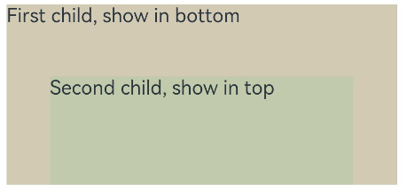

# Stack

<!--Kit: ArkUI-->
<!--Subsystem: ArkUI-->
<!--Owner: @fenglinbailu-->
<!--Designer: @fenglinbailu-->
<!--Tester: @liuli0427-->
<!--Adviser: @Brilliantry_Rui-->
<!-- md-trans-meta sourceCommit=75a7d62c0702c21a06ca0119552a942305a023cc translatedAt=2026-08-19T07:24:44.640Z pushedAt=2026-08-20T10:45:03.056Z -->

Defines a stack container where child components are successively stacked and the latter one overwrites the previous one. The stacking order is based on the declaration order of child components in the parent container. A child component declared later has a higher rendering level and visually covers the preceding child components. It is suitable for scenarios that require layered layout, such as floating buttons or prompt messages on a page, text labels overlaid on images or videos, and multi-layer pop-up windows or dialog boxes. Compared with nesting multiple containers to achieve the layered effect, **Stack** provides a simpler and more efficient solution.

> **NOTE**
>
> - This component is supported since API version 7. Updates will be marked with a superscript to indicate their earliest API version.
> 
> - The general attribute [align](./ts-universal-attributes-location.md#align) supports the mirroring capability on this component.

## Child Components

Supported.

## APIs

Stack(options?: StackOptions)

Defines a stack container where child components are successively stacked and the latter one overwrites the previous one. The stacking order is based on the declaration order of child components in the parent container. A child component declared later has a higher rendering level and visually covers the preceding child components.

> **NOTE**
>
> Excessive component nesting can lead to performance degradation. In scenarios where the same layout effect can be achieved through component attributes or system APIs, using these alternatives can reduce the nesting depth and thereby optimize performance. For best practices, see [Optimizing Component Nesting - Preferentially Using Component Properties Instead of Nested Components](https://developer.huawei.com/consumer/en/doc/best-practices/bpta-component-nesting-optimization#section78181114123811).
>
> When both the **alignContent** parameter of this API and [align](./ts-universal-attributes-location.md#align) are set, whichever is set last takes effect. When both the **alignContent** parameter of this API and the **alignContent** attribute are set, the value set by the attribute takes effect.

**Widget capability**: This API can be used in ArkTS widgets since API version 9.

**Atomic service API**: This API can be used in atomic services since API version 11.

**System capability**: SystemCapability.ArkUI.ArkUI.Full

**Parameters**

| Name      | Type                                   | Mandatory| Description                                                   |
| ------------ | ------------------------------------------- | ---- | ----------------------------------------------------------- |
| options | [StackOptions](#stackoptions18) | No | Alignment of child components in the container. Pass this parameter when child components need to be aligned to a specific position (such as top, bottom, or top-left corner) instead of being centered by default. If this parameter is not passed, the default configuration of **StackOptions** is used, in which **alignContent** defaults to **Alignment.Center**. |

## StackOptions<sup>18+</sup>

Sets the alignment method of the child component in the stack container.

> **NOTE**
>
> To standardize anonymous object definitions, the element definitions here have been revised in API version 18. The initial version information of the historical anonymous objects has been retained, which may result in the outer element's @since version number being later than the inner element's version number. However, this does not affect the use of the API.

**Widget capability**: This API can be used in ArkTS widgets since API version 18.

**Atomic service API**: This API can be used in atomic services since API version 18.

**Model restriction**: This API can be used only in the stage model.

**System capability**: SystemCapability.ArkUI.ArkUI.Full

| Name| Type| Read-Only| Optional| Description|
| -------- | -------- | -------- | -------- | -------- |
| alignContent<sup>7+</sup> | [Alignment](ts-appendix-enums.md#alignment) | No | Yes | Alignment of child components in the container. When this attribute and the constructor input parameter are set at the same time, the value set by this attribute takes effect.<br>Default value: **Alignment.Center**<br>Invalid value: The default value is used.<br>**Note:** When this parameter and [align](./ts-universal-attributes-location.md#align) are set at the same time, the attribute value set later overrides the one set earlier.<br>**Widget capability:** This API can be used in ArkTS widgets since API version 9.<br>**Atomic service API:** This API can be used in atomic services since API version 11. |

## Attributes

In addition to the [universal attributes](ts-component-general-attributes.md), the following attributes are supported.

### alignContent

alignContent(value: Alignment)

Sets the alignment of child components in the container. When both this attribute and [align](ts-universal-attributes-location.md#align) are set, whichever is set last takes effect. When both this attribute and the constructor input parameter are set, the value set by the attribute takes effect, regardless of the setting order.

**Atomic service API**: This API can be used in atomic services since API version 11.

**Widget capability**: This API can be used in ArkTS widgets since API version 9.

**System capability**: SystemCapability.ArkUI.ArkUI.Full

**Parameters**

| Name| Type                                       | Mandatory| Description                                                       |
| ------ | ------------------------------------------- | ---- | ----------------------------------------------------------- |
| value  | [Alignment](ts-appendix-enums.md#alignment) | Yes   | Alignment of all child components in the container.<br>Default value: **Alignment.Center**<br>Invalid value: the default value is used. |

### syncLoad

syncLoad(enable: boolean)

Sets whether to synchronously load all child components in the stack container. During synchronous loading, all child components complete layout calculation and rendering within the current frame. During asynchronous loading, the system dynamically adjusts the layout timing of child components based on the layout duration of the current frame to avoid blocking the main thread.

**Since:** 26.0.0

**Atomic service API:** This API can be used in atomic services since API version 26.0.0.

**System capability**: SystemCapability.ArkUI.ArkUI.Full

**Model restriction:** This API can be used only in the stage model.

**Parameters**

| Name| Type                                       | Mandatory| Description                                |
| ------ | ------------------------------------------- | ---- | ----------------------------------- |
| enable   | boolean | Yes   | Whether to synchronously load all child components in the Stack area.<br>The value **true** means synchronous loading, and **false** means asynchronous loading.<br>Default value: **true**<br>**NOTE**<br>When this parameter is set to **false**, in the first display scenario, if the layout of the current frame takes more than 50 ms, the child components in the Stack area that have not been laid out are deferred to the next frame for layout. |

## Events

The [universal events](ts-component-general-events.md) are supported.

## Example

When the [alignContent](#aligncontent) attribute of the **Stack** component is set to **Alignment.Bottom** and [syncLoad](#syncload) is set to **true**, the child components are displayed horizontally centered at the bottom of the **Stack** component, and all child components are loaded within the same frame.

The **syncLoad** attribute is added since API version 26.0.0.

```ts
// xxx.ets
@Entry
@Component
struct StackExample {
  build() {
    // Set the child component to align at the bottom of the Stack container.
    Stack({ alignContent: Alignment.Bottom }) {
      // The first child component, displayed at the bottom.
      Text('First child, show in bottom').width('90%').height('100%').backgroundColor(0xd2cab3).align(Alignment.Top)
      // The second child component, displayed on the upper layer.
      Text('Second child, show in top').width('70%').height('60%').backgroundColor(0xc1cbac).align(Alignment.Top)
    }.width('100%').height(150).margin({ top: 5 })
    // Since API version 26.0.0, the syncLoad attribute is added. Setting it to true means synchronously loading all child components in the Stack area.
    .syncLoad(true)
  }
}
```

