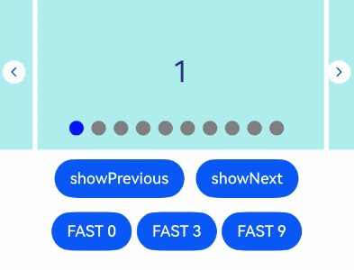
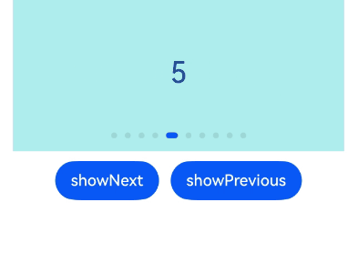
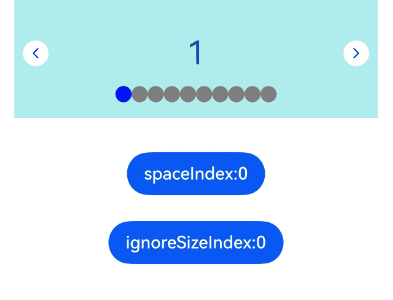
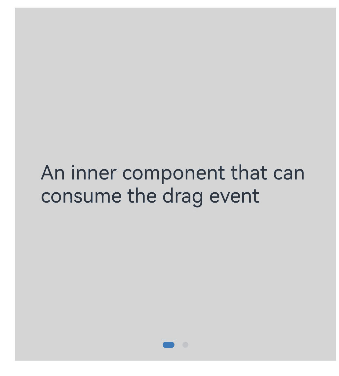
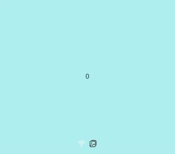

# Swiper

<!--Kit: ArkUI-->
<!--Subsystem: ArkUI-->
<!--Owner: @Hu_ZeQi-->
<!--Designer: @Hu_ZeQi-->
<!--Tester: @gouyuanyuan-->
<!--Adviser: @Brilliantry_Rui-->
<!-- md-trans-meta sourceCommit=6e65e5ab1f4f5d9b7a30f0ce59276e478113d638 translatedAt=2026-08-19T07:37:18.720Z pushedAt=2026-08-20T10:45:03.065Z -->

Defines a container that provides the capability to swipe and display child components in a carousel. It is suitable for scenarios such as carousel image display, image browsing, guide pages, and card carousels.

> **NOTE**
>
> - This component is supported since API version 7. Updates will be marked with a superscript to indicate their earliest API version.
>
> - The **Swiper** component implements the scrolling carousel effect through the built-in [PanGesture](ts-basic-gestures-pangesture.md) gesture. When the [disableSwipe](#disableswipe8) attribute is set to **true**, the gesture listening is disabled, thereby preventing the scrolling operation.
>
> - When [NodeContainer](./ts-basic-components-nodecontainer.md) is reused in the **Swiper** component, recursive updates of parent component state variables by child nodes are prohibited.

## Child Components

Supported

>  **NOTE**
>
>  - Allowed child component types: built-in and custom components, including rendering control types ([if/else](../../../ui/rendering-control/arkts-rendering-control-ifelse.md), [ForEach](../../../ui/rendering-control/arkts-rendering-control-foreach.md), [LazyForEach](../../../ui/rendering-control/arkts-rendering-control-lazyforeach.md), and [Repeat](../../../ui/rendering-control/arkts-new-rendering-control-repeat.md)). To maximize the benefits of lazy loading, avoid mixing lazy loading components (including **LazyForEach** and **Repeat**) and non-lazy loading components, and exercise caution when using multiple lazy loading components. Avoid modifying the data source while an animation is in progress, as doing so can lead to layout issues.
>
>  - If a child component has its [visibility](ts-universal-attributes-visibility.md#visibility) attribute set to **Visibility.None** and the **Swiper** component has its **displayCount** attribute set to **'auto'**, the child component does not take up space in the viewport, but does not affect the number of navigation points. If a child component has its **visibility** attribute set to **Visibility.None** or **Visibility.Hidden**, it takes up space in the viewport, but is not displayed.
>
>  - Child components of the **Swiper** component are drawn based on their level if they have the [offset](ts-universal-attributes-location.md#offset) attribute set. A child component with a higher level overwrites one with a lower level. For example, if the **Swiper** contains three child components and **offset({ x: 100 })** is set for the third child component, the third child component overwrites the first child component during horizontal loop playback. To prevent the first child component from being overwritten, set its [zIndex](ts-universal-attributes-z-order.md#zindex) attribute to a value greater than that of the third child component.
>
>  - When focus is moved to a custom child node, navigation indicators and arrows may be obscured by [focus styles](../../../ui/arkts-common-events-focus-event.md#focus-style) modifications that change **zIndex**.
>
>  - For a **Swiper** component with many child components, you can optimize the performance and reduce memory consumption by using lazy loading, data caching, preloading, and component reuse techniques. For best practices, see [Optimizing Frame Loss During Swiper Component Loading](https://developer.huawei.com/consumer/en/doc/best-practices/bpta-swiper_high_performance_development_guide).

## APIs

Swiper(controller?: SwiperController)

Creates a **Swiper** component.

**Widget capability**: This API can be used in ArkTS widgets since API version 10.

**Atomic service API**: This API can be used in atomic services since API version 11.

**System capability**: SystemCapability.ArkUI.ArkUI.Full

**Parameters**

| Name       | Type                                 | Mandatory  | Description                |
| ---------- | ------------------------------------- | ---- | -------------------- |
| controller | [SwiperController](#swipercontroller) | No   | Controller to bind to the component to manage page switching and preload specific child components.|

## Attributes

In addition to the [universal attributes](ts-component-general-attributes.md), the following attributes are supported.

> **NOTE**
>
> The default value of the universal attribute [clip](ts-universal-attributes-sharp-clipping.md#clip12) is **true** for the **Swiper** component.

### index

index(value: number)

Sets the index of the child component currently displayed in the container.

Since API version 10, this attribute supports two-way binding through [$$](../../../ui/state-management/arkts-two-way-sync.md).

**Widget capability**: This API can be used in ArkTS widgets since API version 10.

**Atomic service API**: This API can be used in atomic services since API version 11.

**System capability**: SystemCapability.ArkUI.ArkUI.Full

**Parameters**

| Name| Type  | Mandatory| Description                                            |
| ------ | ------ | ---- | ------------------------------------------------ |
| value  | number | Yes  | Index of the child component currently displayed in the container.<br>Default value: **0**<br>**NOTE**<br>If the value specified is less than 0 or greater than the maximum page index, the value **0** is used.|

### autoPlay

autoPlay(value: boolean)

Sets whether to enable automatic playback for child components, with the direction from the smallest to largest index.

When [loop](#loop) is set to **false**, auto play stops when the last page is reached. After a gesture switch is completed, if the current page is not the last page, auto play continues. Auto play also stops when the **Swiper** is invisible.

**Widget capability**: This API can be used in ArkTS widgets since API version 10.

**Atomic service API**: This API can be used in atomic services since API version 11.

**System capability**: SystemCapability.ArkUI.ArkUI.Full

**Parameters**

| Name| Type   | Mandatory| Description                                  |
| ------ | ------- | ---- | -------------------------------------- |
| value  | boolean | Yes  | Whether to enable automatic playback for child components.<br>**true**: yes; **false**: no<br>If an invalid value is passed, the value **false** is used.|

### autoPlay<sup>18+</sup>

autoPlay(autoPlay: boolean, options: AutoPlayOptions)

Sets whether to enable automatic playback for child components. The **options** input parameter controls whether automatic playback stops when a finger or mouse presses the screen.

If [loop](#loop) is set to **false**, automatic playback stops at the last page and resumes after navigated away from the last page using gestures. Automatic playback also stops when the **Swiper** component is not visible.

**Widget capability**: This API can be used in ArkTS widgets since API version 18.

**Atomic service API**: This API can be used in atomic services since API version 18.

**Model restriction**: This API can be used only in the stage model.

**System capability**: SystemCapability.ArkUI.ArkUI.Full

**Parameters**

| Name| Type   | Mandatory| Description                                  |
| ------ | ------- | ---- | -------------------------------------- |
| autoPlay  | boolean | Yes  | Whether to enable automatic playback for child components.<br>**true**: yes; **false**: no<br>If an invalid value is passed, the value **false** is used.|
| options  | [AutoPlayOptions](#autoplayoptions18)&nbsp; | Yes  | Whether child components stop automatic playback when the screen is pressed by fingers, a mouse device, or other input devices. If **stopWhenTouched** is set to **true**, automatic playback resumes after any finger lifts in multi-touch scenarios.<br>Default value: **{ stopWhenTouched: true }**.|

### indicator

indicator(value: DotIndicator | DigitIndicator | boolean)

Sets the style of the navigation indicator.

**Widget capability**: This API can be used in ArkTS widgets since API version 10.

**Atomic service API**: This API can be used in atomic services since API version 11.

**System capability**: SystemCapability.ArkUI.ArkUI.Full

**Parameters**

| Name| Type                                                        | Mandatory| Description                                                        |
| ------ | ------------------------------------------------------------ | ---- | ------------------------------------------------------------ |
| value  | [DotIndicator](#dotindicator10)<sup>10+</sup>&nbsp;\|&nbsp;[DigitIndicator](#digitindicator10)<sup>10+</sup>&nbsp;\|&nbsp;boolean | Yes  | Style of the navigation indicator.<br> \- **DotIndicator**: dot-style indicator.<br> \- **DigitIndicator**: digit-style indicator.<br> \- **boolean**: whether to enable the navigation indicator. **true** to enable, **false** otherwise.<br>Default value: **true**.<br>Default type: **DotIndicator**|

### indicator<sup>15+</sup>

indicator(indicator: IndicatorComponentController | DotIndicator | DigitIndicator | boolean)

Sets the navigation indicator for the component.

>  **NOTE**
>
> An externally bound navigation indicator component can be used together if it is set. The display position and size can be customized for the external navigation indicator. For details, see [Indicator](ts-swiper-components-indicator.md).

**Widget capability**: This API can be used in ArkTS widgets since API version 15.

**Atomic service API**: This API can be used in atomic services since API version 15.

**Model restriction**: This API can be used only in the stage model.

**System capability**: SystemCapability.ArkUI.ArkUI.Full

**Parameters**

| Name| Type                                                        | Mandatory| Description                                                        |
| ------ | ------------------------------------------------------------ | ---- | ------------------------------------------------------------ |
| indicator  | [IndicatorComponentController](ts-swiper-components-indicator.md#indicatorcomponentcontroller)<sup>15+</sup>&nbsp;\| [DotIndicator](#dotindicator10)&nbsp;\|&nbsp;[DigitIndicator](#digitindicator10)&nbsp;\|&nbsp;boolean| Yes  | Style of the navigation indicator.<br>\- **IndicatorComponentController**: separate navigation indicator controller. This controller can be bound to an external navigation indicator, but the external and internal indicators cannot coexist.<br> \- **DotIndicator**: dot-style indicator.<br> \- **DigitIndicator**: digit-style indicator.<br> \- **boolean**: whether to enable the navigation indicator. **true** to enable, **false** otherwise.<br>Default value: **true**.<br>Default type: **DotIndicator**|

### nestedScroll<sup>11+</sup>

nestedScroll(value: SwiperNestedScrollMode)

Sets the nested scroll mode between the **Swiper** component and its parent component. When the **Swiper** is nested in a scrollable container (such as **List** or **Scroll**), select an appropriate nested scroll mode based on business requirements. When [loop](#loop) is set to **true**, the **Swiper** component has no edge and does not trigger nested scrolling of the parent component.

> **NOTE**
>
> The **Swiper** component's flick animation logic differs from other scrollable components, as **Swiper** can only slide one page at a time and performs a page-flip animation during a flick. When a **Swiper** component is nested with other scrollable components, it will not accept the scroll offset values transmitted by its child nodes after its page-turning animation has already started. At this point, the page-turning animation of the **Swiper** and the edge effect animation of the child node will be executed simultaneously.

**Atomic service API**: This API can be used in atomic services since API version 11.

**Model restriction**: This API can be used only in the stage model.

**System capability**: SystemCapability.ArkUI.ArkUI.Full

**Parameters**

| Name| Type                                                       | Mandatory| Description                                                        |
| ------ | ----------------------------------------------------------- | ---- | ------------------------------------------------------------ |
| value  | [SwiperNestedScrollMode](#swipernestedscrollmode11) | Yes  | Nested scrolling mode of the **Swiper** component and its parent container.<br>If an invalid value is passed, the value **SwiperNestedScrollMode.SELF_ONLY** is used.|

### loop

loop(value: boolean)

Sets whether to enable looping. In the **LazyForEach** lazy loop loading mode, it is recommended that the number of loaded components be greater than 5. When the number of preloaded components is insufficient, blank areas or lag may occur during rapid switching.

>  **NOTE**
>
> In a loop scenario, when the **prevMargin**/**nextMargin** attributes are set, linear traversal of child components by the screen reader triggers an infinite loop of "focus-scroll-expose new child node". In this scenario, you are advised to set **loop** to **false** or use [accessibilityGroup](ts-universal-attributes-accessibility.md#accessibilitygroup14) to disable accessibility services for child components.

**Widget capability**: This API can be used in ArkTS widgets since API version 10.

**Atomic service API**: This API can be used in atomic services since API version 11.

**System capability**: SystemCapability.ArkUI.ArkUI.Full

**Parameters**

| Name| Type   | Mandatory| Description                           |
| ------ | ------- | ---- | ------------------------------- |
| value  | boolean | Yes  | Whether to enable loop playback.<br>**true**: yes; **false**: no<br>If the input parameter is invalid, the value **true** is used.|

### effectMode<sup>8+</sup>

effectMode(value: EdgeEffect)

Edge sliding effect. This parameter takes effect only when [loop](#loop) is set to **false** or all child nodes are displayed on one screen in the **Swiper** viewport. When the [SwiperController.changeIndex()](#changeindex12), [SwiperController.showNext()](#shownext), or [SwiperController.showPrevious()](#showprevious) API is called to go to the first or last page, the rebound effect does not take effect.

**Widget capability**: This API can be used in ArkTS widgets since API version 10.

**Atomic service API**: This API can be used in atomic services since API version 11.

**System capability**: SystemCapability.ArkUI.ArkUI.Full

**Parameters**

| Name| Type                                         | Mandatory| Description                                        |
| ------ | --------------------------------------------- | ---- | -------------------------------------------- |
| value  | [EdgeEffect](ts-appendix-enums.md#edgeeffect) | Yes  | Effect used when the component is at one of the edges.<br>Default value: **EdgeEffect.Spring**|

### interval

interval(value: number)

Sets the interval for automatic playback.

**Widget capability**: This API can be used in ArkTS widgets since API version 10.

**Atomic service API**: This API can be used in atomic services since API version 11.

**System capability**: SystemCapability.ArkUI.ArkUI.Full

**Parameters**

| Name| Type  | Mandatory| Description                                                      |
| ------ | ------ | ---- | ---------------------------------------------------------- |
| value  | number | Yes   | Time interval for auto play. When this value is less than the [duration](#duration) attribute value, the next auto play starts immediately after the page turn is complete.<br/>Default value: **3000**<br/>Unit: ms<br/>Value range: [0, +∞). If a value less than 0 is set, the default value is used. |

### duration

duration(value: number)

Sets the duration of the animation for child component switching.

**duration** must be used in conjunction with [curve](#curve8).

The default curve for the animation is [interpolatingSpring](../js-apis-curve.md#curvesinterpolatingspring10). When this curve is applied, the duration of the animation is determined solely by the parameters of the curve itself and is no longer governed by the **duration** setting. For curves that are not governed by the **duration** setting, see [Interpolation Calculation](../js-apis-curve.md). Among others, [springMotion](../js-apis-curve.md#curvesspringmotion9), [responsiveSpringMotion](../js-apis-curve.md#curvesresponsivespringmotion9), and interpolatingSpring do not respect the **duration** setting. To have the animation duration managed by **duration**, you should select a different curve for the **curve** attribute.

**Atomic service API**: This API can be used in atomic services since API version 11.

**System capability**: SystemCapability.ArkUI.ArkUI.Full

**Parameters**

| Name| Type  | Mandatory| Description                                                 |
| ------ | ------ | ---- | ----------------------------------------------------- |
| value  | number | Yes   | Animation duration for switching between child components.<br/>Default value: **400**<br/>Unit: ms<br/>Value range: [0, +∞). If a value less than 0 is set, the default value is used. |

### curve<sup>8+</sup>

curve(value: Curve | string | ICurve)

Sets the animation curve. The interpolating spring curve is used by default. For details about common curves, see [Curve](ts-appendix-enums.md#curve). You can also create custom curves (interpolation curve objects) by using the API provided by the [interpolation calculation](../js-apis-curve.md) module.

**Widget capability**: This API can be used in ArkTS widgets since API version 10.

**Atomic service API**: This API can be used in atomic services since API version 11.

**System capability**: SystemCapability.ArkUI.ArkUI.Full

**Parameters**

| Name| Type                                                        | Mandatory| Description                                       |
| ------ | ------------------------------------------------------------ | ---- | ------------------------------------------- |
| value  | [Curve](ts-appendix-enums.md#curve)&nbsp;\|&nbsp;string&nbsp;\|&nbsp;[ICurve](../js-apis-curve.md#icurve9) | Yes  | Animation curve.<br>The **string** type is deprecated since API version 9 (see [curves.init](../js-apis-curve.md#curvesinitdeprecated), [curves.steps](../js-apis-curve.md#curvesstepsdeprecated), [curves.cubicBezier](../js-apis-curve.md#curvescubicbezierdeprecated), and [curves.spring](../js-apis-curve.md#curvesspringdeprecated)). Use **Curve** or **ICurve** instead.<br>Default value: **[interpolatingSpring](../js-apis-curve.md#curvesinterpolatingspring10)(-1, 1, 328, 34)**.|

### vertical

vertical(value: boolean)

Sets whether vertical swiping is used.

**Widget capability**: This API can be used in ArkTS widgets since API version 10.

**Atomic service API**: This API can be used in atomic services since API version 11.

**System capability**: SystemCapability.ArkUI.ArkUI.Full

**Parameters**

| Name| Type   | Mandatory| Description                              |
| ------ | ------- | ---- | ---------------------------------- |
| value  | boolean | Yes  | Whether vertical swiping is used. The value **true** means vertical swiping, and **false** means horizontal swiping.<br>Default value: **false**.|

### itemSpace

itemSpace(value: number | string)

Sets the space between child components. Percentage values are not supported.

If the type is number, the default unit is vp. If the type is string, the pixel unit must be explicitly specified, for example, **'10px'**; if the unit is not specified, for example, **'10'**, the default unit vp is used.

**Widget capability**: This API can be used in ArkTS widgets since API version 10.

**Atomic service API**: This API can be used in atomic services since API version 11.

**System capability**: SystemCapability.ArkUI.ArkUI.Full

**Parameters**

| Name| Type                      | Mandatory| Description                                  |
| ------ | -------------------------- | ---- | -------------------------------------- |
| value  | number&nbsp;\|&nbsp;string | Yes  | Space between child components.<br>Default value: **0**<br>Value range: [0, +∞). Values less than 0 or exceeding the **Swiper** component width are treated as the default value.|

### cachedCount<sup>8+</sup>

cachedCount(value: number)

Sets the number of child components to be preloaded. Based on the current page, the child components before and after the current displayed page are loaded. When an item before the current page is deleted, the items after it shift forward to fill the gap. For example, when **cachedCount** is set to **1**, the child components of the previous page and the next page adjacent to the current displayed page in index order are preloaded. If group-based page turning is set, that is, the **swipeByGroup** parameter of **displayCount** is set to true, preloading is performed in groups. For example, when **cachedCount** is set to **1** and **swipeByGroup** is set to **true**, the child components of the group before and the group after the current group are preloaded.

>  **NOTE**
>
>  - In continuous scrolling scenarios where one **Swiper** child component is displayed per screen, setting **cachedCount** to **1** or **2** is typically sufficient. For best practices, see [Optimizing Frame Loss During Swiper Component Loading – Caching Data Items](https://developer.huawei.com/consumer/en/doc/best-practices/bpta-swiper_high_performance_development_guide#section143504547145).
>
>  - This parameter takes effect only when used with [LazyForEach](../../../ui/rendering-control/arkts-rendering-control-lazyforeach.md) or the [Repeat](../../../ui/rendering-control/arkts-new-rendering-control-repeat.md) component that has virtualScroll enabled. Child components outside the visible area and cache range will be released after this parameter takes effect.

**Widget capability**: This API can be used in ArkTS widgets since API version 10.

**Atomic service API**: This API can be used in atomic services since API version 11.

**System capability**: SystemCapability.ArkUI.ArkUI.Full

**Parameters**

| Name| Type  | Mandatory| Description                            |
| ------ | ------ | ---- | -------------------------------- |
| value  | number | Yes  | Number of child components to be preloaded (cached).<br>Default value: **1**<br>Value range: [0, +∞). If a value less than 0 is set, the default value is used.|

### cachedCount<sup>15+</sup>

cachedCount(count: number, isShown: boolean)

Sets the number of child components to be cached.

>  **NOTE**
>
>  - This attribute takes effect only in [LazyForEach](../../../ui/rendering-control/arkts-rendering-control-lazyforeach.md) and [Repeat](../../../ui/rendering-control/arkts-new-rendering-control-repeat.md) with the **virtualScroll** switch enabled. After it takes effect, child nodes beyond the cache range are released.
>
>  - When **isShown** is set to **true** and **count** is set to a large value, if the nodes that can be loaded within the preloading range before and after are insufficient, the same loadable node is laid out on only one side in a loop scenario.

**Widget capability**: This API can be used in ArkTS widgets since API version 15.

**Atomic service API**: This API can be used in atomic services since API version 15.

**Model restriction**: This API can be used only in the stage model.

**System capability**: SystemCapability.ArkUI.ArkUI.Full

**Parameters**

| Name| Type  | Mandatory| Description                            |
| ------ | ------ | ---- | -------------------------------- |
| count  | number | Yes  | Number of child components to be preloaded (cached).<br>Default value: **1**<br>Value range: [0, +∞). If a value less than 0 is set, the default value is used.|
| isShown  | boolean | Yes  | Whether the cached nodes within the range are rendered without being added to the render tree.<br>**true**: yes; **false**: no<br>If an invalid value is passed, the value **false** is used.|

### cachedCount<sup>24+</sup>

cachedCount(count: number, options: CachedCountOptions)

Sets the number of child components to be preloaded and configuration options.

> **NOTE**
>
> - When **independent** in options is set to **true**, the number of preloaded child components is calculated based on the value of **count**, which is decoupled from the **swipeByGroup** calculation of [displayCount](#displaycount22). For example, if the value of **count** in **cachedCount** is **1**, the previous and next child components of the current child node are preloaded.
> - If **swipeByGroup** of **displayCount** is set to **true** and **independent** of **options** is set to **false** (default value), the number of child components to be preloaded is calculated by group. For example, if **count** of **cachedCount** is **1**, **value** of **displayCount** is **2**, and **swipeByGroup** of **displayCount** is **true**, two child components of the previous group and two child components of the next group of the current group are preloaded.
> - This parameter takes effect only when used with [LazyForEach](../../../ui/rendering-control/arkts-rendering-control-lazyforeach.md) or the [Repeat](../../../ui/rendering-control/arkts-new-rendering-control-repeat.md) component that has virtualScroll enabled. Child components outside the cache range will be released after this parameter takes effect.

**Widget capability**: This API can be used in ArkTS widgets since API version 24.

**Atomic service API**: This API can be used in atomic services since API version 24.

**System capability**: SystemCapability.ArkUI.ArkUI.Full

**Model restriction**: This API can be used only in the stage model.

**Parameters**

| Name| Type| Mandatory| Description|
| ------ | ------ | ---- | ---- |
| count | number | Yes | Number of child components to preload.<br/>Default value: **1**<br/>Value range: [0, +∞). If a value less than 0 is set, 1 is used. |
| options | [CachedCountOptions](#cachedcountoptions24) | Yes | Configuration options for preloading child components. The object properties include **isShown** (whether to draw nodes within the preload range) and **independent** (whether to calculate based on the actual number of child components). |

### disableSwipe<sup>8+</sup>

disableSwipe(value: boolean)

Sets whether to disable the component swipe switching feature. This is applicable to scenarios where page turning is controlled only by buttons or navigation dots, or where user swipe operations need to be restricted.

**Widget capability**: This API can be used in ArkTS widgets since API version 10.

**Atomic service API**: This API can be used in atomic services since API version 11.

**System capability**: SystemCapability.ArkUI.ArkUI.Full

**Parameters**

| Name| Type   | Mandatory| Description                                    |
| ------ | ------- | ---- | ---------------------------------------- |
| value  | boolean | Yes  | Whether to disable the swipe feature. The value **true** means to disable the feature, and **false** means the opposite.<br>Default value: **false**.|

### displayCount<sup>8+</sup>

displayCount(value: number | string | SwiperAutoFill, swipeByGroup?: boolean)

Sets the number of elements to display per page.

**number** type: Child elements' main-axis width adapts to the **Swiper** component's main-axis width. The child elements are stretched or shrunk to equally divide the **Swiper** component's width (minus **displayCount-1** times **itemSpace**). Values less than or equal to 0 are treated as the default value **1**.

**string** type: Only **'auto'** is supported. Child elements are laid out linearly based on their main-axis width without adapting to the **Swiper** component's width. [customContentTransition](#customcontenttransition12) and [onContentDidScroll](#oncontentdidscroll12) events are disabled.

**SwiperAutoFill** type: Child elements' main-axis width adapts to the **Swiper** component's main-axis width. The system automatically works out the number of elements per page based on the width and **minSize** settings of the **Swiper** component. If **minSize** is left empty or set to a value less than or equal to 0, the **Swiper** component displays one column.

> **NOTE**
>
> - When turning pages by group is used, the drag distance threshold for turning pages is half of the width of the **Swiper** component (50% of the child elements width if turning pages by child element is used). If the number of child elements in the last group is less than the value of **displayCount**, placeholders are used, but they show the **Swiper** background style directly and do not display any content.
>
> - When **displayCount** is set to **'auto'** and **loop** is set to **false**, the position of the selected navigation indicator aligns with the first page in the viewport. If the first page is only partially displayed in the viewport after switching, the selected navigation indicator remains aligned with the page's position, between two unselected indicators. In this case, you are advised to hide the navigation indicators.
>
> - If the navigation indicator is in dot style, the number of displayed navigation dots equals the number of child elements when the number of child elements displayed in the viewport is 1 (single-page scenario) or **displayCount** is set to **'auto'**.
>
> - If **displayCount** is set to **'auto'** and **swipeByGroup** is set to **true**, each child element will be treated as a group for page switching, allowing only one page to be switched at a time. In this case, you are advised not to set **swipeByGroup** or set **swipeByGroup** to **false**.
>
> - This API can be called within [attributeModifier](ts-universal-attributes-attribute-modifier.md#attributemodifier) since API version 18.

When the navigation indicator is set to dot style and the number of child elements displayed in the viewport is greater than 1 (multi-page scenario)<!--RP1--><!--RP1End-->, the number of displayed navigation dots follows the rules below.

| Total Children Count > Visible Children Count| Swiping by Group Enabled| Loop Status       | Number of Navigation Dots Displayed                                          | Description                                    |
| ------------------------------------------ | ------------ | --------------- | ------------------------------------------------------------ | ---------------------------------------- |
| Yes                                        | Yes          | **loop** set to **true** | Equals the number of groups (calculated by dividing the total number of child elements by the number of visible child elements, with rounding up if there is a remainder).| Not effective when **displayCount** is set to **'auto'**.|
| Yes                                        | Yes          | **loop** set to **false**| Equals the number of groups (calculated by dividing the total number of child elements by the number of visible child elements, with rounding up if there is a remainder).| Not effective when **displayCount** is set to **'auto'**.|
| Yes                                        | No          | **loop** set to **true** | Equals the actual number of page turns available (that is, the total number of child elements).| —— |
| Yes                                        | No          | **loop** set to **false**| Equals the actual number of page turns available (calculated as total number of child elements minus the number of visible child elements, plus 1).| Not effective when **displayCount** is set to **'auto'**.|
| No (while the total number of child elements is greater than 0)                      | —— | —— | 1                                           | Not effective when **displayCount** is set to **'auto'**.|
| No (while the total number of child elements is 0)| —— | —— | 0| —— |

**Widget capability**: This API can be used in ArkTS widgets since API version 10.

**Atomic service API**: This API can be used in atomic services since API version 11.

**System capability**: SystemCapability.ArkUI.ArkUI.Full

**Parameters**

| Name                    | Type                                                        | Mandatory| Description                                                        |
| -------------------------- | ------------------------------------------------------------ | ---- | ------------------------------------------------------------ |
| value                      | number&nbsp;\|&nbsp;string&nbsp;\|&nbsp;[SwiperAutoFill](#swiperautofill10)<sup>10+</sup> | Yes  | Number of elements to display per page.<br> Default value: **1**<br>Value range: (0, +∞). If this parameter is set to a value less than or equal to 0, the default value is used.|
| swipeByGroup<sup>11+</sup> | boolean | No | Whether to turn pages by group. If set to **true**, pages are turned by group, and the number of child elements in each group is the value of **displayCount**. If set to **false**, the default page turning behavior is used, that is, pages are turned by child element.<br/>Default value: **false**<br/>**Model restriction:** This API can be used only in the stage model. |

### displayCount<sup>22+</sup>

displayCount(value: number | string | SwiperAutoFill | ItemFillPolicy, swipeByGroup?: boolean)

Sets the number of elements to display per page.

**number** type: Child elements' main-axis width adapts to the **Swiper** component's main-axis width. The child elements are stretched or shrunk to equally divide the **Swiper** component's width (minus **displayCount-1** times **itemSpace**). Values less than or equal to 0 are treated as the default value **1**.<br>
**string** type: Only **'auto'** is supported. Child elements are laid out linearly based on their main-axis width without adapting to the **Swiper** component's width. [customContentTransition](#customcontenttransition12) and [onContentDidScroll](#oncontentdidscroll12) events are disabled.<br>
**SwiperAutoFill** type: Child elements' main-axis width adapts to the **Swiper** component's main-axis width. The system automatically works out the number of elements per page based on the width and **minSize** settings of the **Swiper** component. If **minSize** is left empty or set to a value less than or equal to 0, the **Swiper** component displays one column.

**ItemFillPolicy** type: Child elements' main-axis width adapts to the **Swiper** component's main-axis width. The number of displayed elements is determined based on the breakpoint type corresponding to the **Swiper** component's width. For example, if the breakpoint type is set to **ItemFillPolicy.BREAKPOINT_DEFAULT**, one column is displayed when the component width falls within the sm or smaller breakpoint range, two columns are displayed for the md breakpoint range, and three columns are displayed for the lg or a larger breakpoint range.

For details about the parameter, see [displayCount](#displaycount8).

**Widget capability**: This API can be used in ArkTS widgets since API version 22.

**Atomic service API**: This API can be used in atomic services since API version 22.

**Model restriction**: This API can be used only in the stage model.

**System capability**: SystemCapability.ArkUI.ArkUI.Full

**Parameters**

| Name                    | Type                                                        | Mandatory| Description                                                        |
| -------------------------- | ------------------------------------------------------------ | ---- | ------------------------------------------------------------ |
| value                      | number&nbsp;\|&nbsp;string&nbsp;\|&nbsp;[SwiperAutoFill](#swiperautofill10)&nbsp;\|&nbsp;[ItemFillPolicy](./ts-types.md#itemfillpolicy22) | Yes   | Number of child components displayed in the viewport.<br/>Default value: **1**<br/>Value range: (0, +∞). If the value is set to less than or equal to 0, it is processed as 1.|
| swipeByGroup | boolean                                                      | No  | Whether to turn pages by group. The value **true** means to turn pages by group, and **false** means to turn pages by child element. When turning pages by group is used, the number of child elements per group is the value of **displayCount**.<br> Default value: **false**.|

> **NOTE**
>
>  When the number of **Swiper**'s child components is less than or equal to the total number of nodes displayed in the content area of the **Swiper** component (totalDisplayCount = DisplayCount + prevMargin?(1 : 0) + nextMargin? (1 : 0)), the **Swiper** component generally uses the non-looping mode for layout. In this case, the child components specified by **nextMargin** and **prevMargin** take up space in the viewport, but are not displayed. The specifications of the **Swiper** component are calculated based on the value of **totalDisplayCount**. The exceptions are as follows:
>
>  - When the number of child components is equal to the total number of allowed nodes in the content area and both **prevMargin** and **nextMargin** take effect, set **loop** to **true** to enable loop playback.
>
>  - When the number of child components is equal to the value of **displayCount** plus 1 and at least one of **prevMargin** and **nextMargin** takes effect, set **loop** to **true** to enable loop playback in non-group paging mode. When loop playback is enabled, a snapshot is generated as the placeholder image. (The snapshot may not be correctly generated for those components that take a long time to display, such as those that use asynchronous image loading. Avoid enabling loop playback under this scenario.)
>

### displayArrow<sup>10+</sup>

displayArrow(value: ArrowStyle | boolean, isHoverShow?: boolean)

Sets the arrow style of the navigation indicator.

> **NOTE**
>
> When all child nodes fit within the viewport, resulting in only one screen's worth of content being visible, the **Swiper** component displays only that screen without any left or right page-turning arrows.

**Atomic service API**: This API can be used in atomic services since API version 11.

**Model restriction**: This API can be used only in the stage model.

**System capability**: SystemCapability.ArkUI.ArkUI.Full

**Parameters**

| Name                    | Type                                            | Mandatory| Description                                                        |
| -------------------------- | ------------------------------------------------ | ---- | ------------------------------------------------------------ |
| value                      | [ArrowStyle](#arrowstyle10)&nbsp;\|&nbsp;boolean| Yes  | Arrow and background to set. In cases of exceptions, the default values in the **ArrowStyle** object are used. The value **true** means to show the arrow and background in the default styles, and **false** means to hide the arrow and background.<br>Default value: **false**.|
| isHoverShow                | boolean                                          | No  | Whether to show the arrow on mouse hover.<br>Default value: **false**.<br>**NOTE**<br>1. **false**: The arrow is always displayed.<br>2. **true**: The arrow is displayed.<br>With navigation indicators, the arrow is displayed when the mouse pointer hovers over the indicators or arrow areas.<br>Without navigation indicators, the arrow is displayed when the mouse pointer hovers over the **Swiper** display area.<br>3. When the arrow is displayed, clicking the arrow turns pages.|

### displayMode

displayMode(value: SwiperDisplayMode)

Sets the mode in which elements are displayed along the main axis. This API takes effect only when [displayCount](#displaycount8) is not set.

**Widget capability**: This API can be used in ArkTS widgets since API version 10.

**Atomic service API**: This API can be used in atomic services since API version 11.

**System capability**: SystemCapability.ArkUI.ArkUI.Full

**Parameters**

| Name| Type                                           | Mandatory| Description                                                        |
| ------ | ----------------------------------------------- | ---- | ------------------------------------------------------------ |
| value  | [SwiperDisplayMode](#swiperdisplaymode) | Yes  | Mode in which elements are displayed along the main axis.<br>Default value: **SwiperDisplayMode.STRETCH**|

### nextMargin<sup>10+</sup>

nextMargin(value: Length, ignoreBlank?:boolean)

Sets the trailing margin to expose a small part of the next item. For the usage effect, see [Example 1](#example-1-setting-the-navigation-indicator-interaction-and-page-turning-effect). This attribute takes effect only when the layout mode of the Swiper child components is stretch, which mainly includes two scenarios: 1. The **displayMode** attribute is set to **SwiperDisplayMode.STRETCH**; 2. The **displayCount** attribute is set to the number type.

When the main axis runs horizontally and either **nextMargin** or **prevMargin** is greater than the measured width of the child component, both margins are hidden.

When the main axis runs vertically and either **nextMargin** or **prevMargin** is greater than the measured height of the child component, both margins are hidden.

When using the **nextMargin**/**prevMargin** API, do not set the [constraintSize](ts-universal-attributes-size.md#constraintsize) attribute for child components. Otherwise, the child node will not be stretched to the expected length along the main axis, and the margin will lose its effect.

> **NOTE**
>
> This API cannot be called within [attributeModifier](ts-universal-attributes-attribute-modifier.md#attributemodifier).

**Atomic service API**: This API can be used in atomic services since API version 11.

**Model restriction**: This API can be used only in the stage model.

**System capability**: SystemCapability.ArkUI.ArkUI.Full

**Parameters**

| Name | Type | Mandatory | Description |
| ------ | ---------------------------- | ---- | ---------------------- |
| value | [Length](ts-types.md#length) | Yes | Trailing margin. Percentage values are not supported.<br/>Default value: **0**<br/>The unit is described in [Length](ts-types.md#length). |
| ignoreBlank<sup>12+</sup> | boolean | No | Whether to hide the **nextMargin** on the last page in non-loop scenarios.<br/>**true**: The last page does not display the blank **nextMargin**, and the right edge of the last page is aligned with the right edge of the **Swiper** viewport.<br/>**false**: The last page displays the blank **nextMargin**, and the distance between the right edge of the last page and the right edge of the **Swiper** viewport is **nextMargin**.<br/>Default value: **false**.<br/>**NOTE**<br/>On the last page, the values of **prevMargin** and **nextMargin** are added together and used as the left margin to display the previous page. |

### prevMargin<sup>10+</sup>

prevMargin(value: Length, ignoreBlank?:boolean)

Sets the leading margin to reveal a small portion of the previous item. For the implementation example, see [Example 1: Setting the Navigation Dot Interaction and Page Turn Effect](#example-1-setting-the-navigation-indicator-interaction-and-page-turning-effect). This attribute takes effect only when the layout mode of the Swiper child components is stretch, which mainly includes two scenarios: 1. The **displayMode** attribute is set to **SwiperDisplayMode.STRETCH**; 2. The **displayCount** attribute is set to the number type.

When the main axis runs horizontally and either **nextMargin** or **prevMargin** is greater than the measured width of the child component, both margins are hidden.

When the main axis runs vertically and either **nextMargin** or **prevMargin** is greater than the measured height of the child component, both margins are hidden.

When using the **nextMargin**/**prevMargin** API, do not set the [constraintSize](ts-universal-attributes-size.md#constraintsize) attribute for child components. Otherwise, the child node will not be stretched to the expected length along the main axis, and the margin will lose its effect.

> **NOTE**
>
> This API cannot be called within [attributeModifier](ts-universal-attributes-attribute-modifier.md#attributemodifier).

**Atomic service API**: This API can be used in atomic services since API version 11.

**Model restriction**: This API can be used only in the stage model.

**System capability**: SystemCapability.ArkUI.ArkUI.Full

**Parameters**

| Name| Type                        | Mandatory| Description                  |
| ------ | ---------------------------- | ---- | ---------------------- |
| value  | [Length](ts-types.md#length) | Yes   | Front margin. Percentage is not supported.<br/>Default value: 0<br/>For details about the unit, see [Length](ts-types.md#length).  |
| ignoreBlank<sup>12+</sup>  | boolean | No  | Whether to hide the leading margin for the first page in non-loop scenarios.<br> **true**: Hide the leading margin, in which case, the left edge of the first page is aligned with that of the **Swiper** component's viewable area.<br>**false**: Show the leading margin, in which case, the first page has a **prevMargin**-specified gap from the **Swiper** component's left edge.<br>Default value: **false**.<br>**NOTE**<br>On the first page, the values of **prevMargin** and **nextMargin** are added to create a right margin that allows the next page to be displayed partially.|

### indicatorInteractive<sup>12+</sup>

indicatorInteractive(value: boolean)

Sets whether the navigation dot is interactive. This is applicable to scenarios where page turning needs to be controlled through other means (such as a button), or where users need to be prevented from turning pages by tapping the navigation dot.

**Atomic service API**: This API can be used in atomic services since API version 12.

**Model restriction**: This API can be used only in the stage model.

**System capability**: SystemCapability.ArkUI.ArkUI.Full

**Parameters**

| Name| Type                                                       | Mandatory| Description                                                        |
| ------ | ----------------------------------------------------------- | ---- | ------------------------------------------------------------ |
| value  | boolean | Yes  | Whether the navigation indicator is interactive.<br>The value **true** means that the navigation indicator is interactive, and **false** means the opposite.<br>If the input parameter is invalid, the value **true** is used.|

### pageFlipMode<sup>15+</sup>

pageFlipMode(mode: Optional\<PageFlipMode>)

Sets the mode for flipping pages using the mouse wheel. If this API is not used, the continuous page flipping mode (specified by value **PageFlipMode.CONTINUOUS**) is used by default.

**Widget capability**: This API can be used in ArkTS widgets since API version 15.

**Atomic service API**: This API can be used in atomic services since API version 15.

**Model restriction**: This API can be used only in the stage model.

**System capability**: SystemCapability.ArkUI.ArkUI.Full

**Parameters**

| Name| Type                                                       | Mandatory| Description                                                        |
| ------ | ----------------------------------------------------------- | ---- | ------------------------------------------------------------ |
| mode  | [Optional](ts-universal-attributes-custom-property.md#optionalt)\<[PageFlipMode](ts-appendix-enums.md#pageflipmode15)> | Yes  | Mode for flipping pages using the mouse wheel.<br>If the value is **undefined**, the value **PageFlipMode.CONTINUOUS** is used.|

### maintainVisibleContentPosition<sup>20+</sup>

maintainVisibleContentPosition(enabled: boolean)

Sets whether to maintain the visible content position when data is inserted or deleted above or ahead of the viewport. This applies to **Swiper** components using a single [LazyForEach](../../../ui/rendering-control/arkts-rendering-control-lazyforeach.md) as the child node, where the data source is modified using **LazyForEach** API such as [onDataAdd](ts-rendering-control-lazyforeach.md#ondataadd8) or [onDataDelete](ts-rendering-control-lazyforeach.md#ondatadelete8). In other scenarios, the position of the visible content changes when data is inserted or deleted above or before the display area.

When **swipeByGroup** in [displayCount](#displaycount8) is set to **true**, the visible content position remains unchanged only if the amount of data inserted or deleted above or before the display area is a multiple of the group size. Otherwise, the visible content position may change during group recalculation.

**Widget capability**: This API can be used in ArkTS widgets since API version 20.

**Atomic service API**: This API can be used in atomic services since API version 20.

**Model restriction**: This API can be used only in the stage model.

**System capability**: SystemCapability.ArkUI.ArkUI.Full

**Parameters**

| Name| Type                                                       | Mandatory| Description                                                        |
| ------ | ----------------------------------------------------------- | ---- | ------------------------------------------------------------ |
| enabled  | boolean | Yes  | Whether to maintain the visible content position when data is inserted or deleted above or ahead of the viewport.<br>Default value: **false**.<br>**false**: The visible content position will change when data is inserted or deleted. **true**: The visible content position remains unchanged when data is inserted or deleted. Animations stop if the data source is modified during an animation due to target index changes.|

### indicatorStyle<sup>(deprecated)</sup>

indicatorStyle(value?: IndicatorStyle)

Sets the style of the navigation indicator.

> **NOTE**
>
> Supported from API version 8 and deprecated since API version 10. You are advised to use [indicator(value: DotIndicator | DigitIndicator | boolean)](#indicator) instead.

**System capability**: SystemCapability.ArkUI.ArkUI.Full

**Parameters**

| Name| Type                                               | Mandatory| Description        |
| ------ | --------------------------------------------------- | ---- | ------------ |
| value  | [IndicatorStyle](#indicatorstyledeprecated) | No  | Style of the navigation indicator.|

## SwiperDisplayMode

Enumerates the modes in which elements are displayed along the main axis.

**System capability**: SystemCapability.ArkUI.ArkUI.Full

<!--Table: 30%; 10%; 60%-->

| Name                              |  Value|Description                                                        |
| ---------------------------------- | -- |------------------------------------------------------------ |
| Stretch<sup>(deprecated)</sup>     | 0 |The width of one page swiped by Swiper is the width of the Swiper component itself.<br/>**Note:** This is supported since API version 7 and deprecated since API version 10. You are advised to use STRETCH instead.<br/>**Widget capability:** This API can be used in ArkTS widgets since API version 7. |
| AutoLinear<sup>(deprecated)</sup>  | 1 |The width of one page swiped by Swiper is the maximum width among the child components. This enum value behaves the same as setting the value to auto using the string type in [displayCount](#displaycount8). For details, see [displayCount](#displaycount8).<br/>**Note:** This is supported since API version 7 and deprecated since API version 10. You are advised to use AUTO_LINEAR instead.<br/>**Widget capability:** This API can be used in ArkTS widgets since API version 7. |
| STRETCH<sup>10+</sup>              | 0 |The width of one page swiped by Swiper is the width of the Swiper component itself.<br/>**Widget capability:** This API can be used in ArkTS widgets since API version 10.<br/>**Atomic service API:** This API can be used in atomic services since API version 11.<br/>**Model restriction:** This API can be used only in the stage model. |
| AUTO_LINEAR<sup>(deprecated)</sup> | 1 |The width of one page swiped by Swiper is the width of the leftmost child component in the viewport. This enum value behaves the same as setting the value to auto using the string type in [displayCount](#displaycount8). For details, see [displayCount](#displaycount8).<br/>**Note:** This is supported since API version 10 and deprecated since API version 12. You are advised to use [Scroller.scrollTo](ts-container-scroll.md#scrollto) instead.<br/>**Widget capability:** This API can be used in ArkTS widgets since API version 10.<br/>**Atomic service API:** This API can be used in atomic services since API version 11.<br/>**Model restriction:** This API can be used only in the stage model. |

## SwiperNestedScrollMode<sup>11+</sup>

Enumerates the nested scrolling modes of the **Swiper** component and its parent container.

**Atomic service API**: This API can be used in atomic services since API version 11.

**Model restriction**: This API can be used only in the stage model.

**System capability**: SystemCapability.ArkUI.ArkUI.Full

| Name         | Value| Description                                    |
| ------------ | -- | ---------------------------------------- |
| SELF_ONLY    | 0  | The scrolling is contained within the **Swiper** component, and no scroll chaining occurs, that is, the parent container does not scroll when the component scrolling reaches the boundary.|
| SELF_FIRST   | 1  | The **Swiper** component scrolls first, and when it hits the boundary, the parent container scrolls. When the parent container hits the boundary, its edge effect is displayed. If no edge effect is specified for the parent container, the edge effect of the **Swiper** component is displayed instead.|

## SwiperController

Implements the controller for the **Swiper** component. Bind this object to a **Swiper** component to control page turning and other functionalities.

**Widget capability**: This API can be used in ArkTS widgets since API version 10.

**Atomic service API**: This API can be used in atomic services since API version 11.

**System capability**: SystemCapability.ArkUI.ArkUI.Full

### constructor

constructor()

A constructor used to create a **SwiperController** object.

**Widget capability**: This API can be used in ArkTS widgets since API version 10.

**Atomic service API**: This API can be used in atomic services since API version 11.

**System capability**: SystemCapability.ArkUI.ArkUI.Full

### showNext

showNext()

Turns to the next page. The page turning includes a transition animation, with the duration set by the [duration](#duration) attribute of the **Swiper** component.

**Widget capability**: This API can be used in ArkTS widgets since API version 10.

**Atomic service API**: This API can be used in atomic services since API version 11.

**System capability**: SystemCapability.ArkUI.ArkUI.Full

### showPrevious

showPrevious()

Turns to the previous page. The page turning includes a transition animation, with the duration set by the [duration](#duration) attribute of the **Swiper** component.

**Widget capability**: This API can be used in ArkTS widgets since API version 10.

**Atomic service API**: This API can be used in atomic services since API version 11.

**System capability**: SystemCapability.ArkUI.ArkUI.Full

### changeIndex<sup>12+</sup>

changeIndex(index: number, useAnimation?: boolean)

Switches to the specified page. The page switching process is animated, and the duration is set by the [duration](#duration) attribute of **Swiper**.

> **NOTE**
>
> This API itself provides the capability of switching pages without animation (by setting **useAnimation** to **false**). It is not recommended to start an animation with the **changeIndex** API and then directly interrupt it with the **finishAnimation** API to switch pages without animation.

**Widget capability**: This API can be used in ArkTS widgets since API version 12.

**Atomic service API**: This API can be used in atomic services since API version 12.

**Model restriction**: This API can be used only in the stage model.

**System capability**: SystemCapability.ArkUI.ArkUI.Full

**Parameters**

| Name     | Type      | Mandatory | Description    |
| -------- | ---------- | ---- | -------- |
| index| number | Yes   | Index of the target page in the **Swiper** component.<br>**NOTE**<br>If the value specified is less than 0 or greater than the maximum page index, the value **0** is used.|
| useAnimation| boolean | No   | Whether to use an animation for when the target page is reached. The value **true** means to use an animation, and **false** means the opposite.<br>Default value: **false**|

### changeIndex<sup>15+</sup>

changeIndex(index: number, animationMode?: SwiperAnimationMode | boolean)

Switches to the specified page. The page switching process is animated, and the duration is set by the [duration](#duration) attribute of **Swiper**.
> **NOTE**
>
> This API itself provides the capability of switching pages without animation (by setting **animationMode** to **false** or **SwiperAnimationMode.NO_ANIMATION**). It is not recommended to start an animation with the **changeIndex** API and then directly interrupt it with the **finishAnimation** API to switch pages without animation.

**Widget capability**: This API can be used in ArkTS widgets since API version 15.

**Atomic service API**: This API can be used in atomic services since API version 15.

**Model restriction**: This API can be used only in the stage model.

**System capability**: SystemCapability.ArkUI.ArkUI.Full

**Parameters**

| Name     | Type      | Mandatory | Description    |
| -------- | ---------- | ---- | -------- |
| index| number | Yes   | Index of the target page in the **Swiper** component.<br>**NOTE**<br>If the value specified is less than 0 or greater than the maximum page index, the value **0** is used.|
| animationMode| [SwiperAnimationMode](#swiperanimationmode15)&nbsp;\|&nbsp;boolean | No    | Sets the animation mode for turning to a specified page.<br/>Default value: **SwiperAnimationMode.NO_ANIMATION**<br/> **Note:** <br/>When **true** is passed in, the animation is enabled, which is equivalent to **SwiperAnimationMode.DEFAULT_ANIMATION**; when **false** is passed in, the animation is disabled, which is equivalent to **SwiperAnimationMode.NO_ANIMATION**. |

### finishAnimation

finishAnimation(callback?: VoidCallback)

Stops an animation.

**Widget capability**: This API can be used in ArkTS widgets since API version 10.

**Atomic service API**: This API can be used in atomic services since API version 11.

**System capability**: SystemCapability.ArkUI.ArkUI.Full

**Parameters**

| Name     | Type      | Mandatory | Description    |
| -------- | ---------- | ---- | -------- |
| callback | [VoidCallback](./ts-types.md#voidcallback12) | No   | Callback invoked when the animation stops.|

### preloadItems<sup>18+</sup>

preloadItems(indices: Optional\<Array\<number>>): Promise\<void>

Preloads child nodes for **Swiper**. After this API is called, all specified child nodes will be loaded at once. Therefore, for performance considerations, it is recommended that you load child nodes in batches. This API uses a promise to return the result.

If the **SwiperController** object is not bound to any **Swiper** component, any attempt to call APIs on it will result in a JavaScript exception, together with the error code 100004. Therefore, you are advised to use **try-catch** to handle potential exceptions when calling APIs on **SwiperController**.

When combining with [LazyForEach](../../../ui/rendering-control/arkts-rendering-control-lazyforeach.md) and custom components, be aware that [LazyForEach](../../../ui/rendering-control/arkts-rendering-control-lazyforeach.md) only retains custom components within the cache range. Components outside this range are removed. Therefore, make sure the indexes of nodes to be preloaded via this API are within the cache range to avoid issues.

> **NOTE**
>
> **preloadItems** of **Swiper** needs to be called after **Swiper** is created. You are advised to control the first preloading in the [onAppear](./ts-universal-events-show-hide.md#onappear) lifecycle of **Swiper**.

**Widget capability**: This API can be used in ArkTS widgets since API version 18.

**Atomic service API**: This API can be used in atomic services since API version 18.

**Model restriction**: This API can be used only in the stage model.

**System capability**: SystemCapability.ArkUI.ArkUI.Full

**Parameters**

| Name  | Type  | Mandatory  | Description                                    |
| ----- | ------ | ---- | ---------------------------------------- |
| indices | [Optional](ts-universal-attributes-custom-property.md#optionalt)\<Array\<number>> | Yes| Array of indexes of the child nodes to preload.|

**Return value**

| Type                                                        | Description                    |
| ------------------------------------------------------------ | ------------------------ |
| Promise\<void> | Promise that returns no value.|

**Error codes**

For details about the error codes, see [Universal Error Codes](../../errorcode-universal.md) and [Scrollable Component Error Codes](../../apis-arkui/errorcode-scroll.md).

| ID  | Error Message                                     |
| --------   | -------------------------------------------- |
| 401 | Parameter invalid. Possible causes: 1. The parameter type is not Array\<number>; 2. The parameter is an empty array; 3. The parameter contains an invalid index. |
| 100004 | Controller not bound to component. |

### startFakeDrag<sup>23+</sup>

startFakeDrag(): boolean

Enables drag simulation.

> **NOTE**
>
> - If the **Swiper** component is dragged using real gestures or the drag simulation is enabled, the API returns **false**, indicating that the operation fails.
>
> - Simulated drag cannot trigger nested scrolling.

**Widget capability**: This API can be used in ArkTS widgets since API version 23.

**Atomic service API**: This API can be used in atomic services since API version 23.

**System capability**: SystemCapability.ArkUI.ArkUI.Full

**Model restriction**: This API can be used only in the stage model.

**Return value**

| Type   | Description                                         |
| ------- | --------------------------------------------  |
| boolean | Whether to enable drag simulation.<br>**true** if enabled; **false** the opposite|

### fakeDragBy<sup>23+</sup>

fakeDragBy(offset: number): boolean

Sets the drag distance of drag simulation.

> **NOTE**
>
> - The drag distance of drag simulation depends on the layout. You are advised to call this API before the layout, so that the drag effect can be displayed after the current frame layout. If this API is called multiple times before the layout, only the drag distance passed in the last call takes effect during the current frame layout.
>
> - In the loop scenario where [loop](#loop) is set to **true**, if the drag distance of drag simulation is greater than the total layout length, the drag distance will be adjusted to the distance required to drag just far enough to display the first child node (when dragging toward the start of the layout) or the last child node (when dragging toward the end of the layout).
>
> - The [onGestureSwipe](#ongestureswipe10) and [onContentWillScroll](#oncontentwillscroll15) events are not triggered during the drag. The [customContentTransition](#customcontenttransition12) event is triggered before the layout. Since the actual drag distance may be adjusted during the layout, if the passed drag distance is too large, the returned node display information may be inconsistent with the layout result when the event is triggered.

**Widget capability**: This API can be used in ArkTS widgets since API version 23.

**Atomic service API**: This API can be used in atomic services since API version 23.

**System capability**: SystemCapability.ArkUI.ArkUI.Full

**Model restriction**: This API can be used only in the stage model.

**Parameters**

| Name  | Type  | Mandatory  | Description                                                 |
| -----  | ------ | ---- | -------------------------------------------------------- |
| offset | number | Yes | Drag distance to be simulated.<br/>A positive value indicates dragging toward the start of the main axis (leftward in horizontal layout and upward in vertical layout); a negative value indicates dragging toward the end of the main axis (rightward in horizontal layout and downward in vertical layout).<br/>Unit: vp<br/>Value range: (-∞, +∞) |

**Return value**

| Type   | Description                                         |
| ------- | --------------------------------------------  |
| boolean | Whether to consume the passed drag distance.<br>**true** means to consume any passed drag distance; **false** means not to consume the passed drag distance because it is not in the drag simulation or has been dragged to the boundary.<br>If the drag distance is set to **0**, it cannot be consumed.|

### stopFakeDrag<sup>23+</sup>

stopFakeDrag(): boolean

Disables drag simulation.

> **NOTE**
>
> After drag simulation is enabled, it will end if a real drag gesture is received.

**Widget capability**: This API can be used in ArkTS widgets since API version 23.

**Atomic service API**: This API can be used in atomic services since API version 23.

**System capability**: SystemCapability.ArkUI.ArkUI.Full

**Model restriction**: This API can be used only in the stage model.

**Return value**

| Type   | Description                                         |
| ------- | --------------------------------------------  |
| boolean | Whether drag simulation is disabled.<br>**true** indicates that drag simulation is disabled successfully; **false** indicates the opposite.|

### isFakeDragging<sup>23+</sup>

isFakeDragging(): boolean

Obtains whether drag simulation is enabled.

**Widget capability**: This API can be used in ArkTS widgets since API version 23.

**Atomic service API**: This API can be used in atomic services since API version 23.

**System capability**: SystemCapability.ArkUI.ArkUI.Full

**Model restriction**: This API can be used only in the stage model.

**Return value**

| Type   | Description                                         |
| ------- | --------------------------------------------  |
| boolean | Whether the drag simulation is enabled.<br>**true** indicates that drag simulation is enabled; **false** indicates the opposite.|

## SwiperAnimationMode<sup>15+</sup>

Enumerates the animation mode for moving to a specific page in the **Swiper** component.

**Widget capability**: This API can be used in ArkTS widgets since API version 15.

**Atomic service API**: This API can be used in atomic services since API version 15.

**Model restriction**: This API can be used only in the stage model.

**System capability**: SystemCapability.ArkUI.ArkUI.Full

| Name         | Value  | Description                                                        |
| ------------- | ---- | ------------------------------------------------------------ |
| NO_ANIMATION  | 0    | Move to the specified page without any animation.                                                |
| DEFAULT_ANIMATION | 1    | Move to the specified page with the default animation.                            |
| FAST_ANIMATION  | 2    | Move to a page near the specified page without animation, and then navigate to the specified page with the default animation.|

## Indicator<sup>10+</sup>

Sets the distance between the indicator and the **Swiper** component. Because the indicator has a default interaction area with a height of 32 vp, the displayed part cannot be completely stuck to the bottom. To achieve a completely bottom-aligned effect, use the [IndicatorComponent](ts-swiper-components-indicator.md#indicatorcomponent) component to adjust the position more flexibly.

**Widget capability**: This API can be used in ArkTS widgets since API version 10.

**Atomic service API**: This API can be used in atomic services since API version 11.

**Model restriction**: This API can be used only in the stage model.

**System capability**: SystemCapability.ArkUI.ArkUI.Full

### left

left(value: Length): T

Sets the position of the navigation indicator relative to the left edge of the **Swiper** component.

**Widget capability**: This API can be used in ArkTS widgets since API version 10.

**Atomic service API**: This API can be used in atomic services since API version 11.

**Model restriction**: This API can be used only in the stage model.

**System capability**: SystemCapability.ArkUI.ArkUI.Full

**Parameters**

| Name| Type                        | Mandatory| Description                                                        |
| ------ | ---------------------------- | ---- | ------------------------------------------------------------ |
| value  | [Length](ts-types.md#length) | Yes   | Position of the left side of the navigation dot relative to **Swiper**.<br/>When **left** and **right** are not set, adaptive layout is performed, and the indicator is centered on the main axis based on its own size and the size of **Swiper**.<br/>When set to **0**, the layout is calculated based on position 0.<br/>Priority: higher than the **right** attribute.<br/>Value range: [0, Swiper width - navigation dot area width]. When the value is out of this range, the nearest boundary value is used.<br/>For details about the unit, see [Length](ts-types.md#length).  |

**Return value**

| Type| Description              |
| --- | ------------------ |
| T | Current navigation dot indicator, which supports chained calls to configure other navigation dot attributes. |

### top

top(value: Length): T

Sets the position of the navigation indicator relative to the top edge of the **Swiper** component.

**Widget capability**: This API can be used in ArkTS widgets since API version 10.

**Atomic service API**: This API can be used in atomic services since API version 11.

**Model restriction**: This API can be used only in the stage model.

**System capability**: SystemCapability.ArkUI.ArkUI.Full

**Parameters**

| Name| Type                        | Mandatory| Description                                                        |
| ------ | ---------------------------- | ---- | ------------------------------------------------------------ |
| value  | [Length](ts-types.md#length) | Yes   | Position of the top of the navigation dot relative to the **Swiper**.<br/>If **top** and **bottom** are not set, adaptive layout is performed. Based on the size of the indicator and the **Swiper**, the indicator is placed at the bottom in the cross-axis direction, which is the same as setting bottom to **0**.<br/>When set to **0**, the layout is calculated based on position 0.<br/>Priority: higher than the **bottom** attribute.<br/>Value range: [0, Swiper height - navigation dot area height]. If the value is out of this range, the nearest boundary value is used.<br/>For details about the unit, see [Length](ts-types.md#length).  |

**Return value**

| Type| Description              |
| --- | ------------------ |
| T | Current navigation dot indicator, used to support chained calls to configure other navigation dot attributes. |

### right

right(value: Length): T

Sets the position of the navigation indicator relative to the right edge of the **Swiper** component.

**Widget capability**: This API can be used in ArkTS widgets since API version 10.

**Atomic service API**: This API can be used in atomic services since API version 11.

**Model restriction**: This API can be used only in the stage model.

**System capability**: SystemCapability.ArkUI.ArkUI.Full

**Parameters**

| Name| Type                        | Mandatory| Description                                                        |
| ------ | ---------------------------- | ---- | ------------------------------------------------------------ |
| value  | [Length](ts-types.md#length) | Yes  | Position of the right side of the indicator relative to the **Swiper**.<br/>If **left** and **right** are not set, adaptive layout is performed, and the indicator is centered on the main axis based on its own size and the **Swiper** size.<br/>When set to **0**, the layout is calculated based on position **0**.<br/>Priority: lower than the **left** attribute.<br/>Value range: [0, Swiper width - indicator area width]. If the value is out of this range, the nearest boundary value is used.<br/>For details about the unit, see [Length](ts-types.md#length).  |

**Return value**

| Type| Description              |
| --- | ------------------ |
| T | Current navigation dot indicator, used to support chained calls for configuring other navigation dot attributes. |

### bottom

bottom(value: Length): T

Sets the position of the navigation indicator relative to the bottom edge of the **Swiper** component.

**Widget capability**: This API can be used in ArkTS widgets since API version 10.

**Atomic service API**: This API can be used in atomic services since API version 11.

**Model restriction**: This API can be used only in the stage model.

**System capability**: SystemCapability.ArkUI.ArkUI.Full

**Parameters**

| Name| Type                        | Mandatory| Description                                                        |
| ------ | ---------------------------- | ---- | ------------------------------------------------------------ |
| value  | [Length](ts-types.md#length) | Yes  | Position of the bottom of the navigation dot relative to the **Swiper**.<br/>When **top** and **bottom** are not set, adaptive layout is performed. Based on the size of the indicator itself and the size of the **Swiper**, the indicator is placed at the bottom in the cross-axis direction, with the same effect as setting **bottom** to **0**.<br/>When set to **0**: the layout is calculated based on position 0.<br/>Priority: lower than the **top** attribute.<br/>Value range: [0, Swiper height - navigation dot area height]. If the value exceeds this range, the nearest boundary value is used.<br/>For details about the unit, see [Length](ts-types.md#length). |

**Return value**

| Type| Description              |
| --- | ------------------ |
| T | Current navigation dot indicator, which supports chained calls to configure other indicator attributes. |

### bottom<sup>19+</sup>

bottom(bottom: LengthMetrics | Length, ignoreSize: boolean): T

Sets the position of the navigation indicator relative to the bottom edge of the **Swiper** component. You can also choose to ignore the size of the navigation indicator using the **ignoreSize** property.

**Widget capability**: This API can be used in ArkTS widgets since API version 19.

**Atomic service API**: This API can be used in atomic services since API version 19.

**Model restriction**: This API can be used only in the stage model.

**System capability**: SystemCapability.ArkUI.ArkUI.Full

**Parameters**

<!--Table: 15%; 25%; 10%; 50%-->

| Name| Type                        | Mandatory| Description                                                        |
| ------ | ---------------------------- | ---- | ------------------------------------------------------------ |
| bottom  | [LengthMetrics](../js-apis-arkui-graphics.md#lengthmetrics12)&nbsp;\|&nbsp;[Length](ts-types.md#length)| Yes   | Sets the position of the bottom of the navigation dot relative to Swiper.<br/>When top and bottom are not set, adaptive size layout is performed. Based on the size of the indicator itself and the size of Swiper, the indicator is placed at the bottom in the cross-axis direction, with the same effect as setting bottom to 0.<br/>When set to 0: the layout is calculated based on position 0.<br/>Priority: lower than the top attribute.<br/>Value range: [0, Swiper height - navigation dot area height]. If the value exceeds this range, the nearest boundary value is used.<br/>For the unit, see the description of the [Length](ts-types.md#length) type.  |
| ignoreSize  | boolean | Yes   | Sets whether to ignore the size of the navigation dot itself. The default value is **false**.<br/>When set to **true**, the size of the navigation dot is ignored, so that the navigation dot can be placed closer to the bottom of Swiper. When set to **false**, the size of the navigation dot is not ignored, and the navigation dot is laid out at its default size. For usage, see [Example 9](#example-9-using-the-space-and-bottom-apis-on-the-navigation-indicator).<br/> Note: When the navigation dot is of the [DigitIndicator](#digitindicator10) type, the scenarios where it does not take effect are as follows:<br/> &bull;  When [vertical](#vertical) is set to **false** and **bottom** > 0.<br/>  &bull;  When [vertical](#vertical) is set to **true**:<br/>1. When **bottom** > 0.<br/> 2. When bottom is set to undefined. <br/> 3. When **isSidebarMiddle** is set to **false**.|

**Return value**

| Type| Description              |
| --- | ------------------ |
| T | Current navigation dot indicator, which supports chained calls to configure other navigation dot attributes. |

### start<sup>12+</sup>

start(value: LengthMetrics): T

Sets the distance between the navigation indicator and the right edge (in [RTL](../arkui-ts/ts-state-management-environment-variables.md#layoutdirection) scripts) or the left edge (in [LTR](../arkui-ts/ts-state-management-environment-variables.md#layoutdirection) scripts) of the **Swiper** component.

**Widget capability**: This API can be used in ArkTS widgets since API version 12.

**Atomic service API**: This API can be used in atomic services since API version 12.

**Model restriction**: This API can be used only in the stage model.

**System capability**: SystemCapability.ArkUI.ArkUI.Full

**Parameters**

| Name| Type                                                        | Mandatory| Description                                                        |
| ------ | ------------------------------------------------------------ | ---- | ------------------------------------------------------------ |
| value  | [LengthMetrics](../js-apis-arkui-graphics.md#lengthmetrics12) | Yes  | Right-to-left scripts: Distance between the navigation indicator and the right edge of the **Swiper** component.<br>Left-to-right scripts: Distance between the navigation indicator and the left edge of the **Swiper** component.<br>Default value: **0**<br>Unit: vp<br>Value range: [0, Swiper width - Navigation indicator area width]. Values outside this range are adjusted to the nearest boundary.|

**Return value**

| Type| Description              |
| --- | ------------------ |
| T | Current navigation dot indicator, used to support chained calls for configuring other navigation dot attributes. |

### end<sup>12+</sup>

end(value: LengthMetrics): T

Sets the distance between the navigation point indicator and the left edge (in right-to-left scripts) or the right edge (in left-to-right scripts) of the **Swiper** component.

**Widget capability**: This API can be used in ArkTS widgets since API version 12.

**Atomic service API**: This API can be used in atomic services since API version 12.

**Model restriction**: This API can be used only in the stage model.

**System capability**: SystemCapability.ArkUI.ArkUI.Full

**Parameters**

| Name| Type                        | Mandatory | Description                                    |
| ------ | ---------------------------- | ---- | ---------------------------------------- |
| value | [LengthMetrics](../js-apis-arkui-graphics.md#lengthmetrics12) | Yes   | Right-to-left scripts: Distance between the navigation indicator and the left edge of the **Swiper** component.<br>Left-to-right scripts: Distance between the navigation indicator and the right edge of the **Swiper** component.<br>Default value: **0**<br>Unit: vp<br>Value range: [0, Swiper width - Navigation indicator area width]. Values outside this range are adjusted to the nearest boundary. |

**Return value**

| Type| Description              |
| --- | ------------------ |
| T | Current navigation dot indicator, used to support chained calls for configuring other navigation dot attributes. |

### dot

static dot(): DotIndicator

Returns a **DotIndicator** object.

**Widget capability**: This API can be used in ArkTS widgets since API version 10.

**Atomic service API**: This API can be used in atomic services since API version 11.

**Model restriction**: This API can be used only in the stage model.

**System capability**: SystemCapability.ArkUI.ArkUI.Full

**Return value**

| Type                           | Description        |
| ------------------------------- | ------------ |
| [DotIndicator](#dotindicator10) | Dot indicator object used to set the dot navigation style of the Swiper component. |

### digit

static digit(): DigitIndicator

Returns a **DigitIndicator** object.

**Widget capability**: This API can be used in ArkTS widgets since API version 10.

**Atomic service API**: This API can be used in atomic services since API version 11.

**Model restriction**: This API can be used only in the stage model.

**System capability**: SystemCapability.ArkUI.ArkUI.Full

**Return value**

| Type                               | Description        |
| ----------------------------------- | ------------ |
| [DigitIndicator](#digitindicator10) | Numeric indicator object, used to set the numeric navigation style of the Swiper component. |

## DotIndicator<sup>10+</sup>

A constructor used to create a **DotIndicator** object. It inherits from [Indicator](#indicator10).

**Widget capability**: This API can be used in ArkTS widgets since API version 10.

**Atomic service API**: This API can be used in atomic services since API version 11.

**Model restriction**: This API can be used only in the stage model.

**System capability**: SystemCapability.ArkUI.ArkUI.Full

### constructor

constructor()

A constructor used to create a **DotIndicator** object.

> **NOTE**
>
> - When pressed, the navigation indicator is zoomed in to 1.33 times. To account for this, there is a certain distance between the navigation indicator's visible boundary and its actual boundary in the non-pressed state. The distance increases with the value of **itemWidth**, **itemHeight**, **selectedItemWidth**, and **selectedItemHeight**.
>
> - If there are too many pages and dot-style indicators exceed the page, you are advised to use the **maxDisplayCount** parameter to set the number of dots to be displayed.

**Widget capability**: This API can be used in ArkTS widgets since API version 10.

**Atomic service API**: This API can be used in atomic services since API version 11.

**Model restriction**: This API can be used only in the stage model.

**System capability**: SystemCapability.ArkUI.ArkUI.Full

### itemWidth

itemWidth(value: Length): DotIndicator

Sets the width of a dot-style navigation indicator of the **Swiper** component.

**Widget capability**: This API can be used in ArkTS widgets since API version 10.

**Atomic service API**: This API can be used in atomic services since API version 11.

**Model restriction**: This API can be used only in the stage model.

**System capability**: SystemCapability.ArkUI.ArkUI.Full

**Parameters**

| Name| Type                        | Mandatory| Description                                                        |
| ------ | ---------------------------- | ---- | ------------------------------------------------------------ |
| value  | [Length](ts-types.md#length) | Yes   | Width of the dot indicator of the **Swiper** component. Percentage is not supported.<br/>Default value: **6**<br/>Unit: vp<br/>Value range: (0, +∞). If the value is out of range, the default value is used. |

**Return value**

| Type                           | Description        |
| ------------------------------- | ------------ |
| [DotIndicator](#dotindicator10) | Returns the current dot indicator, which supports chained calls to configure other dot style attributes. |

### itemHeight

itemHeight(value: Length): DotIndicator

Sets the height of a dot-style navigation indicator of the **Swiper** component.

**Widget capability**: This API can be used in ArkTS widgets since API version 10.

**Atomic service API**: This API can be used in atomic services since API version 11.

**Model restriction**: This API can be used only in the stage model.

**System capability**: SystemCapability.ArkUI.ArkUI.Full

**Parameters**

| Name| Type                        | Mandatory| Description                                                        |
| ------ | ---------------------------- | ---- | ------------------------------------------------------------ |
| value  | [Length](ts-types.md#length) | Yes   | Height of the dot indicator of the **Swiper** component. Percentages are not supported.<br/>Default value: **6**<br/>Unit: vp<br/>Value range: (0, +∞). If the value is out of range, the default value is used. |

**Return value**

| Type                           | Description        |
| ------------------------------- | ------------ |
| [DotIndicator](#dotindicator10) | Returns the current dot indicator, which supports chained calls to configure other dot style attributes. |

### selectedItemWidth

selectedItemWidth(value: Length): DotIndicator

Sets the width of the selected dot-style navigation indicator.

**Widget capability**: This API can be used in ArkTS widgets since API version 10.

**Atomic service API**: This API can be used in atomic services since API version 11.

**Model restriction**: This API can be used only in the stage model.

**System capability**: SystemCapability.ArkUI.ArkUI.Full

**Parameters**

| Name| Type                        | Mandatory| Description                                                        |
| ------ | ---------------------------- | ---- | ------------------------------------------------------------ |
| value  | [Length](ts-types.md#length) | Yes   | Width of the dot indicator of the selected **Swiper** component. Percentages are not supported.<br/>Default value: **6**<br/>Unit: vp<br/>Value range: (0, +∞). If the value is out of range, the default value is used. |

**Return value**

| Type                           | Description        |
| ------------------------------- | ------------ |
| [DotIndicator](#dotindicator10) | Returns the current dot indicator, which supports chained calls to configure other dot style attributes. |

### selectedItemHeight

selectedItemHeight(value: Length): DotIndicator

Sets the height of the selected dot-style navigation indicator.

**Widget capability**: This API can be used in ArkTS widgets since API version 10.

**Atomic service API**: This API can be used in atomic services since API version 11.

**Model restriction**: This API can be used only in the stage model.

**System capability**: SystemCapability.ArkUI.ArkUI.Full

**Parameters**

| Name| Type                        | Mandatory| Description                                                        |
| ------ | ---------------------------- | ---- | ------------------------------------------------------------ |
| value  | [Length](ts-types.md#length) | Yes   | Height of the selected dot indicator of the **Swiper** component. Percentages are not supported.<br/>Default value: **6**<br/>Unit: vp<br/>Value range: (0, +∞). If the value is out of range, the default value is used. |

**Return value**

| Type                           | Description        |
| ------------------------------- | ------------ |
| [DotIndicator](#dotindicator10) | Returns the current dot indicator, which supports chained calls to configure other dot style attributes. |

### mask

mask(value: boolean): DotIndicator

Sets whether to enable the mask for the dot-style navigation indicator.

**Widget capability**: This API can be used in ArkTS widgets since API version 10.

**Atomic service API**: This API can be used in atomic services since API version 11.

**Model restriction**: This API can be used only in the stage model.

**System capability**: SystemCapability.ArkUI.ArkUI.Full

**Parameters**

| Name| Type   | Mandatory| Description                                                        |
| ------ | ------- | ---- | ------------------------------------------------------------ |
| value  | boolean | Yes   | Whether to display the mask style of the dot navigation indicator of the Swiper component. The value **true** means to display the mask style of the dot navigation indicator of the Swiper component, and **false** means the opposite.<br/>Default value: **false** |

**Return value**

| Type                           | Description        |
| ------------------------------- | ------------ |
| [DotIndicator](#dotindicator10) | Returns the current dot indicator, which supports chained calls to configure other dot style attributes. |

### color

color(value: ResourceColor): DotIndicator

Sets the color of the dot-style navigation indicator.

**Widget capability**: This API can be used in ArkTS widgets since API version 10.

**Atomic service API**: This API can be used in atomic services since API version 11.

**Model restriction**: This API can be used only in the stage model.

**System capability**: SystemCapability.ArkUI.ArkUI.Full

**Parameters**

| Name| Type                                      | Mandatory| Description                                                        |
| ------ | ------------------------------------------ | ---- | ------------------------------------------------------------ |
| value  | [ResourceColor](ts-types.md#resourcecolor) | Yes  | Color of the dot-style navigation indicator.<br>Default value: **'#1A182431'** (light gray)|

**Return value**

| Type                           | Description        |
| ------------------------------- | ------------ |
| [DotIndicator](#dotindicator10) | Returns the current dot indicator, which is used to support chained calls for configuring other dot style attributes. |

### selectedColor

selectedColor(value: ResourceColor): DotIndicator

Sets the color of the selected dot-style navigation indicator.

**Widget capability**: This API can be used in ArkTS widgets since API version 10.

**Atomic service API**: This API can be used in atomic services since API version 11.

**Model restriction**: This API can be used only in the stage model.

**System capability**: SystemCapability.ArkUI.ArkUI.Full

**Parameters**

| Name| Type                                      | Mandatory| Description                                                        |
| ------ | ------------------------------------------ | ---- | ------------------------------------------------------------ |
| value  | [ResourceColor](ts-types.md#resourcecolor) | Yes  | Color of the selected dot-style navigation indicator.<br>Default value: **'\#007DFF'** (blue)|

**Return value**

| Type                           | Description        |
| ------------------------------- | ------------ |
| [DotIndicator](#dotindicator10) | Returns the current dot indicator, which supports chained calls to configure other dot style attributes. |

### maxDisplayCount<sup>12+</sup>

maxDisplayCount(maxDisplayCount: number): DotIndicator

Sets the maximum number of navigation dots in the dot-style navigation indicator.

**Atomic service API**: This API can be used in atomic services since API version 12.

**Model restriction**: This API can be used only in the stage model.

**System capability**: SystemCapability.ArkUI.ArkUI.Full

**Parameters**

| Name         | Type  | Mandatory| Description                                                        |
| --------------- | ------ | ---- | ------------------------------------------------------------ |
| maxDisplayCount | number | Yes | Maximum number of navigation dots displayed in the dot indicator style. When the actual number of navigation dots is greater than the maximum number, the overlong display style takes effect, as shown in [Example 5](#example-5-configuring-overflow-for-the-dot-style-indicator).<br/>Value range: [6, 9]. When the value is out of range, it is equivalent to no overlong display effect.<br/>**NOTE**<br/>1. In the overlong display scenario, interaction (including finger tap and drag and mouse operation) is not supported before API version 26.0.0. Since API version 26.0.0, finger tap and drag interaction is supported, but mouse operation interaction is not supported.<br/>2. In the overlong display scenario, the position of the selected navigation dot corresponding to the middle page is not completely fixed, and depends on the previous page turn operation sequence.<br/>3. Currently, only the scenario where **displayCount** is 1 is supported. |

**Return value**

| Type                           | Description        |
| ------------------------------- | ------------ |
| [DotIndicator](#dotindicator10) | Returns the current dot indicator, which supports chained calls to configure other dot style attributes. |

### space<sup>19+</sup>

space(space: LengthMetrics): DotIndicator

Sets the spacing between dot-style navigation indicators of the **Swiper** component.

**Widget capability**: This API can be used in ArkTS widgets since API version 19.

**Atomic service API**: This API can be used in atomic services since API version 19.

**Model restriction**: This API can be used only in the stage model.

**System capability**: SystemCapability.ArkUI.ArkUI.Full

**Parameters**

| Name| Type                        | Mandatory| Description                                                        |
| ------ | ---------------------------- | ---- | ------------------------------------------------------------ |
| space  | [LengthMetrics](../js-apis-arkui-graphics.md#lengthmetrics12)  | Yes   | Spacing between dot indicators. Percentages are not supported.<br/>Default value: **10** on PC/2-in-1 devices and **8** on other devices.<br/>Unit: vp<br/>Value range: [0, +∞). If a value less than 0 is set, the default value is used. |

**Return value**

| Type                            | Description         |
| ------------------------------- | ------------ |
| [DotIndicator](#dotindicator10) | Returns the current dot indicator, which supports chained calls to configure other dot style attributes. |

### indicatorIcon

indicatorIcon(iconList: Array&lt;IndicatorIconInfo&gt;): DotIndicator

Sets the icon of the **Swiper** dot navigation indicator.

**Since**: 26.0.0

**Widget capability:** This API can be used in ArkTS widgets since API version 26.0.0.

**Atomic service API:** This API can be used in atomic services since API version 26.0.0.

**System capability**: SystemCapability.ArkUI.ArkUI.Full

**Model restriction**: This API can be used only in the stage model.

**Parameters**

| Name | Type                         | Mandatory | Description                                                         |
| ------ | ---------------------------- | ---- | ------------------------------------------------------------ |
| iconList  | Array<[IndicatorIconInfo](#indicatoriconinfo)>  | Yes   | Icons of the dot navigation indicator. Each element in the array contains two attributes: **index** (indicator index) and **icon** (icon content). |

**Return value**

| Type                           | Description        |
| ------------------------------- | ------------ |
| [DotIndicator](#dotindicator10) | Returns the current dot indicator, which supports chained calls to configure other dot style attributes. |

## DigitIndicator<sup>10+</sup>

A constructor used to create a **DigitIndicator** object. It inherits from [Indicator](#indicator10).

**Widget capability**: This API can be used in ArkTS widgets since API version 10.

**Atomic service API**: This API can be used in atomic services since API version 11.

**Model restriction**: This API can be used only in the stage model.

**System capability**: SystemCapability.ArkUI.ArkUI.Full

>**NOTE**
>
>When pages are turned by group, the child nodes displayed in the digit-style navigation indicator do not count placeholder nodes.
>
>The maximum value of [maxFontScale](ts-basic-components-text.md#maxfontscale12) for the digit-style navigation indicator is **2**.
>
>The mirror display of the page number depends on the RTL status of the system.

### fontColor

fontColor(value: ResourceColor): DigitIndicator

Sets the font color of the digit-style navigation indicator.

**Widget capability**: This API can be used in ArkTS widgets since API version 10.

**Atomic service API**: This API can be used in atomic services since API version 11.

**Model restriction**: This API can be used only in the stage model.

**System capability**: SystemCapability.ArkUI.ArkUI.Full

**Parameters**

| Name| Type                                      | Mandatory| Description                                                        |
| ------ | ------------------------------------------ | ---- | ------------------------------------------------------------ |
| value  | [ResourceColor](ts-types.md#resourcecolor) | Yes  | Font color of the digit-style navigation indicator.<br>Default value: **'\#ff182431'**|

**Return value**

| Type                               | Description        |
| ----------------------------------- | ------------ |
| [DigitIndicator](#digitindicator10) | Returns the current numeric indicator, which supports chained calls to configure other numeric style attributes. |

### selectedFontColor

selectedFontColor(value: ResourceColor): DigitIndicator

Sets the font color of the selected digit-style navigation indicator.

**Widget capability**: This API can be used in ArkTS widgets since API version 10.

**Atomic service API**: This API can be used in atomic services since API version 11.

**Model restriction**: This API can be used only in the stage model.

**System capability**: SystemCapability.ArkUI.ArkUI.Full

**Parameters**

| Name| Type                                      | Mandatory| Description                                                        |
| ------ | ------------------------------------------ | ---- | ------------------------------------------------------------ |
| value  | [ResourceColor](ts-types.md#resourcecolor) | Yes  | Font color of the selected digit-style navigation indicator.<br>Default value: **'\#ff182431'**|

**Return value**

| Type                               | Description        |
| ----------------------------------- | ------------ |
| [DigitIndicator](#digitindicator10) | Returns the current numeric indicator, which supports chained calls to configure other numeric style attributes. |

### digitFont

digitFont(value: Font): DigitIndicator

Sets the font style of the numeric navigation indicator of the **Swiper** component. When pages are turned by group, the number of child nodes displayed by the numeric navigation indicator does not include placeholder nodes.

**Widget capability**: This API can be used in ArkTS widgets since API version 10.

**Atomic service API**: This API can be used in atomic services since API version 11.

**Model restriction**: This API can be used only in the stage model.

**System capability**: SystemCapability.ArkUI.ArkUI.Full

**Parameters**

| Name| Type                    | Mandatory| Description                                                        |
| ------ | ------------------------ | ---- | ------------------------------------------------------------ |
| value  | [Font](ts-types.md#font) | Yes  | Font style of the digit-style navigation indicator.<br>Only the **size** and **weight** parameters in **Font** are adjustable. Setting **family** and **style** has no effect.<br>Default value:<br>{&nbsp;size:&nbsp;14,&nbsp;weight:&nbsp;FontWeight.Normal&nbsp;} |

**Return value**

| Type                               | Description        |
| ----------------------------------- | ------------ |
| [DigitIndicator](#digitindicator10) | Returns the current numeric indicator, which supports chained calls to configure other numeric style attributes. |

### selectedDigitFont

selectedDigitFont(value: Font): DigitIndicator

Sets the font style of the selected digit-style navigation indicator.

**Widget capability**: This API can be used in ArkTS widgets since API version 10.

**Atomic service API**: This API can be used in atomic services since API version 11.

**Model restriction**: This API can be used only in the stage model.

**System capability**: SystemCapability.ArkUI.ArkUI.Full

**Parameters**

| Name| Type                    | Mandatory| Description                                                        |
| ------ | ------------------------ | ---- | ------------------------------------------------------------ |
| value  | [Font](ts-types.md#font) | Yes  | Font style of the selected digit-style navigation indicator.<br>Default value:<br>{&nbsp;size:&nbsp;14,&nbsp;weight:&nbsp;FontWeight.Normal&nbsp;} |

>**NOTE**
>
> When pages are turned by group, the child nodes displayed in the digit-style navigation indicator do not count placeholder nodes.

**Return value**

| Type                               | Description        |
| ----------------------------------- | ------------ |
| [DigitIndicator](#digitindicator10) | Returns the current numeric indicator, which supports chained calls to configure other numeric style attributes. |

### constructor

constructor()

A constructor used to create a **DigitIndicator** object.

**Widget capability**: This API can be used in ArkTS widgets since API version 10.

**Atomic service API**: This API can be used in atomic services since API version 11.

**Model restriction**: This API can be used only in the stage model.

**System capability**: SystemCapability.ArkUI.ArkUI.Full

## ArrowStyle<sup>10+</sup>

Describes the left and right arrow attributes.

**Atomic service API**: This API can be used in atomic services since API version 11.

**Model restriction**: This API can be used only in the stage model.

**System capability**: SystemCapability.ArkUI.ArkUI.Full

| Name             | Type                                    | Read Only | Optional | Description                                    |
| ---------------- | ---------------------------------------- | ---- | ---- | ---------------------------------------- |
| showBackground   | boolean                                  | No   | Yes  | Whether to show the background for the arrow. The value **true** means to show the background for the arrow, and **false** means the opposite.<br>Default value: **false**.               |
| isSidebarMiddle  | boolean                                  | No   | Yes  | Whether the arrow is centered on both sides of the **Swiper** component. The value **true** means that the arrow is centered on both sides of the **Swiper** component, and **false** means that the arrow is shown on either side of the navigation indicator.<br>Default value: **false**.<br> |
| backgroundSize   | [Length](ts-types.md#length)             | No   | Yes  | Size of the background.<br>On both sides of the navigation indicator:<br>Default value: **24vp**.<br>On both sides of the component:<br>Default value: **32vp**.<br>Percentage values are not supported.|
| backgroundColor  | [ResourceColor](ts-types.md#resourcecolor) | No   | Yes  | Color of the background.<br>On both sides of the navigation indicator:<br>Default value: **'\#00000000'**.<br>On both sides of the component:<br>Default value: **'\#19182431'**.|
| arrowSize        | [Length](ts-types.md#length)             | No   | Yes  | Size of the arrow.<br>On both sides of the navigation indicator:<br>Default value: **18vp**.<br>On both sides of the component:<br>Default value: **24vp**.<br>**NOTE**<br>If **showBackground** is set to **true**, the value of **arrowSize** is 3/4 of the value of **backgroundSize**.<br>Percentage values are not supported.|
| arrowColor       | [ResourceColor](ts-types.md#resourcecolor) | No   | Yes  | Color of the arrow.<br>Default value: **'\#182431'**                |

## SwiperAutoFill<sup>10+</sup>

Describes the auto-fill attribute.

**Widget capability**: This API can be used in ArkTS widgets since API version 10.

**Atomic service API**: This API can be used in atomic services since API version 11.

**Model restriction**: This API can be used only in the stage model.

**System capability**: SystemCapability.ArkUI.ArkUI.Full

| Name | Type            | Read Only| Optional| Description                            |
| ------- | -------------------- | ------ | ------ | ------------------------------------ |
| minSize | [VP](ts-types.md#vp10) | No  | No     | Minimum width for displaying elements, which is used to automatically calculate and change the display count of elements on one page based on the current width of **Swiper** and the **minSize** value. When the display count of elements on one page needs to be adaptively adjusted based on the width of the **Swiper** component, you are advised to set this parameter to achieve a better responsive layout effect.<br/>Default value: **0**<br/>Value range: (0, +∞). When the value is set to less than or equal to 0, **Swiper** displays one column. |

## AutoPlayOptions<sup>18+</sup>

Defines the properties for controlling the automatic playback behavior.

**Widget capability**: This API can be used in ArkTS widgets since API version 18.

**Atomic service API**: This API can be used in atomic services since API version 18.

**Model restriction**: This API can be used only in the stage model.

**System capability**: SystemCapability.ArkUI.ArkUI.Full

| Name             | Type                                | Read Only  | Optional | Description                                    |
| ---------------- | ---------------------------------------- | ---- | ---- | ---------------------------------------- |
| stopWhenTouched   | boolean                              | No  | No   | Whether the automatic playback stops immediately when the component is touched.<br>The value **true** means that the automatic playback stops immediately when the component is touched, and **false** means the opposite.<br>Default value: **true**.|

## CachedCountOptions<sup>24+</sup>

Describes the configuration options for child components to be preloaded.

**Widget capability**: This API can be used in ArkTS widgets since API version 24.

**Atomic service API**: This API can be used in atomic services since API version 24.

**System capability**: SystemCapability.ArkUI.ArkUI.Full

**Model restriction**: This API can be used only in the stage model.

| Name        | Type   | Read Only | Optional | Description                                    |
| ------------ | ------- | ---- | ---- | ---------------------------------------- |
| isShown      | boolean | No   | Yes   | Whether to draw nodes within the preloading range.<br>**true**: yes.<br>**false**: no.<br>Default value: **false**.|
| independent  | boolean  | No    | Yes    | Whether [cachedCount](#cachedcount24) is calculated based on the actual number of child components.<br/>When set to **true**, **cachedCount** is calculated based on the actual number of child components instead of by group.<br/>When set to **false**, if **displayCount.swipeByGroup** is **true**, **cachedCount** is calculated by group; otherwise, it is calculated based on the actual number of child components.<br/>Default value: **false** |

## IndicatorIconInfo

Sets the configuration of the dot navigation indicator icon.

> **NOTE**
>
> Only the icon color can be modified through the [fontColor](ts-basic-components-symbolGlyph.md#fontcolor) attribute of the SymbolGlyphModifier object.

**Since**: 26.0.0

**Widget capability:** This API can be used in ArkTS widgets since API version 26.0.0.

**Atomic service API:** This API can be used in atomic services since API version 26.0.0.

**System capability**: SystemCapability.ArkUI.ArkUI.Full

**Model restriction**: This API can be used only in the stage model.

| Name              | Type                                 | Read-Only   | Optional  | Description                                     |
| ---------------- | ---------------------------------------- | ---- | ---- | ---------------------------------------- |
| index            | number                              | No   | No    | Index of the navigation dot for which the icon is configured.<br/>Value range: [0, number of child components of Swiper - 1] <br/>**NOTE** <br/>If the set value is greater than the maximum page index, the icon is not displayed. |
| icon            | [ResourceStr](ts-types.md#resourcestr) \| [SymbolGlyphModifier](ts-universal-attributes-attribute-symbolglyphmodifier.md#symbolglyphmodifier)     | No   | No    | Icon content to configure.<br/>**NOTE** <br/>If no valid icon is set, the dot navigation indicator is displayed. |

## Events

In addition to the [universal events](ts-component-general-events.md), the following events are supported.

### onChange

onChange(event: Callback\<number>)

Triggered when the index of the currently displayed element changes. The return value is the index of the currently displayed element.

When the **Swiper** component is used together with **LazyForEach**, the subpage UI update cannot be triggered in the **onChange** event.

> **NOTE**
>
> - If the index change is caused by an animation, the callback is triggered when the animation ends.
> - Difference from onSelected: onSelected is triggered immediately when the selected state changes, while onChange is triggered after the animation ends.

**Widget capability**: This API can be used in ArkTS widgets since API version 10.

**Atomic service API**: This API can be used in atomic services since API version 11.

**System capability**: SystemCapability.ArkUI.ArkUI.Full

**Parameters**

| Name| Type  | Mandatory| Description                |
| ------ | ------ | ---- | -------------------- |
| event  | [Callback](./ts-types.md#callback12)\<number> | Yes  | Index of the currently displayed element.|

### onAnimationStart<sup>9+</sup>

onAnimationStart(event: OnSwiperAnimationStartCallback)

Triggered when the page transition animation starts.

> **NOTE**
>
> - When this callback is invoked, the page transition animation logic is executed in the rendering thread, allowing the idle main thread to load resources required by child components. This reduces preloading time for nodes within the **cachedCount** range. For best practices, see [Optimizing Frame Loss During Swiper Component Loading – Preloading Data](https://developer.huawei.com/consumer/en/doc/best-practices/bpta-swiper_high_performance_development_guide#section8783121513246).
>
> - When the duration of the page transition animation is set to **0**, this callback is triggered only in the following scenarios: swiping to turn pages, automatic playback, calling **SwiperController.showNext()** or **SwiperController.showPrevious()**, and touching navigation indicators to navigate.

**Widget capability**: This API can be used in ArkTS widgets since API version 10.

**Atomic service API**: This API can be used in atomic services since API version 11.

**System capability**: SystemCapability.ArkUI.ArkUI.Full

**Parameters**

| Name| Type  | Mandatory| Description                |
| ------ | ------ | ---- | -------------------- |
| event  | [OnSwiperAnimationStartCallback](#onswiperanimationstartcallback18) | Yes  | Callback triggered when the page transition animation starts.|

### onAnimationEnd<sup>9+</sup>

onAnimationEnd(event: OnSwiperAnimationEndCallback)

Triggered when the page transition animation ends.

This event is triggered when the switching animation of the **Swiper** component ends, whether it is caused by gesture interruption or by calling **finishAnimation** through **SwiperController**.

**Widget capability**: This API can be used in ArkTS widgets since API version 10.

**Atomic service API**: This API can be used in atomic services since API version 11.

**System capability**: SystemCapability.ArkUI.ArkUI.Full

**Parameters**

| Name| Type  | Mandatory| Description                |
| ------ | ------ | ---- | -------------------- |
| event  | [OnSwiperAnimationEndCallback](#onswiperanimationendcallback18) | Yes  | Callback triggered when the page transition animation ends.|

>**NOTE**
>
>- When the duration of the page transition animation is set to **0**, this callback is triggered only in the following scenarios: swiping to turn pages, automatic playback, calling **SwiperController.showNext()** or **SwiperController.showPrevious()**, and touching navigation indicators to navigate.

### onGestureSwipe<sup>10+</sup>

onGestureSwipe(event: OnSwiperGestureSwipeCallback)

Triggered on a frame-by-frame basis when the page is turned by a swipe.

**Atomic service API**: This API can be used in atomic services since API version 11.

**Model restriction**: This API can be used only in the stage model.

**System capability**: SystemCapability.ArkUI.ArkUI.Full

**Parameters**

| Name| Type  | Mandatory| Description                |
| ------ | ------ | ---- | -------------------- |
| event  | [OnSwiperGestureSwipeCallback](#onswipergestureswipecallback18) | Yes   | Callback triggered frame by frame during the finger-following swipe of the page. The onGestureSwipe callback is triggered after onTouch. If you need to perform an operation when the animation starts after the finger leaves the screen, use [onAnimationStart](#onanimationstart9). |

### customContentTransition<sup>12+</sup>

customContentTransition(transition: SwiperContentAnimatedTransition)

Defines a custom page transition animation. During finger-following swipes and post-release transition animations, this triggers a frame-by-frame callback for all pages in the viewport, allowing you to customize animations by modifying properties like opacity, scale, and translation.

Instructions:

1) In a loop scenario, when the **prevMargin** and **nextMargin** attributes are set so that the front and rear areas of the **Swiper** viewport display the same page, this API does not take effect.<br>2) During finger-following swiping and the switch animation after the finger is released, the [SwiperContentTransitionProxy](#swipercontenttransitionproxy12) callback is triggered frame by frame for all pages in the viewport. For example, when there are two pages with indexes **0** and **1** in the viewport, the callback is triggered twice per frame, with the index values **0** and **1** respectively.<br>3) When the **swipeByGroup** parameter of the **displayCount** attribute is set to **true**, if at least one page in the same group is in the viewport, the callback is triggered for all pages in the group; if no page in the group is in the viewport, all pages in the group are removed from the render tree together.<br>4) During finger-following swiping and the switch animation after the finger is released, the default animation (page sliding) still occurs. If you want the page not to slide, you can set a negative displacement (translate attribute) along the main axis to offset the page sliding. For example, when the **displayCount** attribute value is 2 and there are two pages with indexes 0 and 1 in the viewport, during horizontal page sliding, you can set the translate attribute of page 0 on the x-axis to -position * mainAxisLength frame by frame to offset the displacement of page 0, and set the **translate** attribute of page 1 on the x-axis to -(position - 1) * mainAxisLength to offset the displacement of page 1.

**Widget capability:** This API can be used in ArkTS widgets since API version 26.0.0.

**Atomic service API**: This API can be used in atomic services since API version 12.

**Model restriction**: This API can be used only in the stage model.

**System capability**: SystemCapability.ArkUI.ArkUI.Full

**Parameters**

| Name| Type| Mandatory| Description|
| ------ | ---- | ---- | ---- |
| transition | [SwiperContentAnimatedTransition](#swipercontentanimatedtransition12) | Yes | Information about the custom transition animation of **Swiper**. The object attributes include **timeout** (timeout duration) and **transition** (callback for the specific content of the custom transition animation). |

### onContentDidScroll<sup>12+</sup>

onContentDidScroll(handler: ContentDidScrollCallback)

Triggered when content in the **Swiper** component scrolls.

Instructions:

1) In a loop scenario, when the **prevMargin** and **nextMargin** attributes are set so that the front and rear areas of the Swiper viewport display the same page, this API does not take effect.<br>2) During page sliding, the [ContentDidScrollCallback](#contentdidscrollcallback12) callback is triggered frame by frame for all pages in the viewport. For example, when there are two pages with indexes 0 and 1 in the viewport, the callback is triggered twice per frame, with the index values **0** and **1** respectively.<br>3) When the **swipeByGroup** parameter of the **displayCount** attribute is set to **true**, if at least one page in the same group is in the viewport, the callback is triggered for all pages in the group.

**Atomic service API**: This API can be used in atomic services since API version 12.

**Model restriction**: This API can be used only in the stage model.

**System capability**: SystemCapability.ArkUI.ArkUI.Full

**Parameters**

| Name| Type| Mandatory| Description|
| ------ | ---- | ---- | ---- |
| handler | [ContentDidScrollCallback](#contentdidscrollcallback12) | Yes| Callback triggered when content in the **Swiper** component scrolls.|

### onSelected<sup>18+</sup>

onSelected(event: Callback\<number>)

Triggered when the selected element changes. The index of the currently selected element is returned.

> **NOTE**
> 
> - In the **onSelected** callback, you cannot modify the index attribute of the swiper, and cannot call the **SwiperController.changeIndex()**, **SwiperController.showNext()**, and **SwiperController.showPrevious()** methods.
> - Difference from **onChange**: **onSelected** is triggered immediately when the selected state changes, while **onChange** is triggered after the animation ends.

**Widget capability**: This API can be used in ArkTS widgets since API version 18.

**Atomic service API**: This API can be used in atomic services since API version 18.

**Model restriction**: This API can be used only in the stage model.

**System capability**: SystemCapability.ArkUI.ArkUI.Full

**Parameters**

| Name| Type  | Mandatory| Description                |
| ------ | ------ | ---- | -------------------- |
| event  | [Callback](./ts-types.md#callback12)\<number> | Yes  | Index of the currently selected element.|

> **NOTE**
>
> In the **onSelected** callback, do not modify the **index** attribute of the **Swiper** component, or call the **SwiperController.changeIndex()**, **SwiperController.showNext()**, or **SwiperController.showPrevious()** APIs.

### onUnselected<sup>18+</sup>

onUnselected(event: Callback\<number>)

Triggered when the selected element changes. The index of the element that is about to be hidden is returned.

**Widget capability**: This API can be used in ArkTS widgets since API version 18.

**Atomic service API**: This API can be used in atomic services since API version 18.

**Model restriction**: This API can be used only in the stage model.

**System capability**: SystemCapability.ArkUI.ArkUI.Full

**Parameters**

| Name| Type  | Mandatory| Description                |
| ------ | ------ | ---- | -------------------- |
| event  | [Callback](./ts-types.md#callback12)\<number> | Yes  | Index of the element that is about to be hidden.|

> **NOTE**
>
> In the **onUnselected** callback, do not modify the **index** attribute of the **Swiper** component, nor call the **SwiperController.changeIndex()**, **SwiperController.showNext()**, or **SwiperController.showPrevious()** APIs.

### onContentWillScroll<sup>15+</sup>

onContentWillScroll(handler: ContentWillScrollCallback)

Triggered when the **Swiper** component is about to scroll. This event allows you to intercept and control the scrolling behavior of the component. The component determines whether to allow the scroll action based on the return value. If **true** is returned, the scroll action is allowed, and the pages in the **Swiper** component will follow the scrolling. If **false** is returned, the scroll action is disallowed, and the pages will remain stationary.

1. This event is only triggered by gesture operations, including finger swipes, scrolling the mouse wheel, and moving focus using keyboard arrow keys.

2. During finger swipes, the event is triggered for each frame. The system uses the return value of the event to determine whether to respond to the swipe for each frame.

3. For scrolling the mouse wheel and moving focus using keyboard arrow keys, the event is triggered once per page turning. The system uses the return value to decide whether to allow the page turning.

**Widget capability**: This API can be used in ArkTS widgets since API version 15.

**Atomic service API**: This API can be used in atomic services since API version 15.

**Model restriction**: This API can be used only in the stage model.

**System capability**: SystemCapability.ArkUI.ArkUI.Full

**Parameters**

| Name| Type| Mandatory| Description|
| ------ | ---- | ---- | ---- |
| handler | [ContentWillScrollCallback](#contentwillscrollcallback15) | Yes | Callback invoked when the **Swiper** is swiped. The value **true** indicates that swiping is allowed, and **false** indicates that swiping is not allowed. |

### onScrollStateChanged<sup>20+</sup>

onScrollStateChanged(event: Callback\<ScrollState>)

Defines the callback of the swipe state change event for the **Swiper** component. This callback is triggered when the swipe state changes across the followings: scrolling with the touch, animating after release, and stopped.

**Widget capability**: This API can be used in ArkTS widgets since API version 20.

**Atomic service API**: This API can be used in atomic services since API version 20.

**Model restriction**: This API can be used only in the stage model.

**System capability**: SystemCapability.ArkUI.ArkUI.Full

**Parameters**

| Name| Type| Mandatory| Description|
| ------ | ---- | ---- | ---- |
| event  | [Callback](./ts-types.md#callback12)\<[ScrollState](ts-container-list.md#scrollstate)> | Yes  | Callback triggered when the sliding status changes.|

## OnSwiperAnimationStartCallback<sup>18+</sup>

type OnSwiperAnimationStartCallback = (index: number, targetIndex: number, extraInfo: SwiperAnimationEvent) => void

Defines the callback triggered when the page transition animation starts.

**Widget capability**: This API can be used in ArkTS widgets since API version 18.

**Atomic service API**: This API can be used in atomic services since API version 18.

**Model restriction**: This API can be used only in the stage model.

**System capability**: SystemCapability.ArkUI.ArkUI.Full

**Parameters**

| Name                   | Type                                                      | Mandatory| Description                                                        |
| ------------------------- | ---------------------------------------------------------- | ---- | ------------------------------------------------------------ |
| index                     | number                                                     | Yes  | Index of the currently displayed element. If there are multiple columns, **index** indicates the index of the leftmost component.                                        |
| targetIndex<sup>10+</sup> | number                                                     | Yes  | Index of the target element to switch to.                                    |
| extraInfo<sup>10+</sup>   | [SwiperAnimationEvent](#swiperanimationevent10) | Yes  | Extra information of the animation, including the offset of the currently displayed element and target element relative to the start position of the **Swiper** along the main axis, and the hands-off velocity.|

## OnSwiperAnimationEndCallback<sup>18+</sup>

type OnSwiperAnimationEndCallback = (index: number, extraInfo: SwiperAnimationEvent) => void

Defines the callback triggered when the page transition animation ends.

**Widget capability**: This API can be used in ArkTS widgets since API version 18.

**Atomic service API**: This API can be used in atomic services since API version 18.

**Model restriction**: This API can be used only in the stage model.

**System capability**: SystemCapability.ArkUI.ArkUI.Full

**Parameters**

| Name                 | Type                                                      | Mandatory| Description                                                        |
| ----------------------- | ---------------------------------------------------------- | ---- | ------------------------------------------------------------ |
| index                   | number                                                     | Yes  | Index of the currently displayed element. If there are multiple columns, **index** indicates the index of the leftmost component.                                        |
| extraInfo<sup>10+</sup> | [SwiperAnimationEvent](#swiperanimationevent10) | Yes  | Extra information of the animation, which is the offset of the currently displayed element relative to the start position of the **Swiper** along the main axis.|

## OnSwiperGestureSwipeCallback<sup>18+</sup>

type OnSwiperGestureSwipeCallback = (index: number, extraInfo: SwiperAnimationEvent) => void

Defines the callback triggered on a frame-by-frame basis when the page is turned by a swipe.

**Atomic service API**: This API can be used in atomic services since API version 18.

**Model restriction**: This API can be used only in the stage model.

**System capability**: SystemCapability.ArkUI.ArkUI.Full

**Parameters**

| Name   | Type                                                      | Mandatory| Description                                                        |
| --------- | ---------------------------------------------------------- | ---- | ------------------------------------------------------------ |
| index     | number                                                     | Yes  | Index of the currently displayed element. If there are multiple columns, **index** indicates the index of the leftmost component.                                        |
| extraInfo | [SwiperAnimationEvent](#swiperanimationevent10) | Yes  | Extra information of the animation, which is the offset of the currently displayed element relative to the start position of the **Swiper** along the main axis.|

## ContentDidScrollCallback<sup>12+</sup>

type ContentDidScrollCallback = (selectedIndex: number, index: number, position: number, mainAxisLength: number) => void

Triggered during the swipe action of the **Swiper** component. For details about the parameters, see [SwiperContentTransitionProxy](#swipercontenttransitionproxy12).

**Atomic service API**: This API can be used in atomic services since API version 12.

**Model restriction**: This API can be used only in the stage model.

**System capability**: SystemCapability.ArkUI.ArkUI.Full

**Parameters**

| Name| Type| Mandatory| Description|
| ------ | ---- | ---- | ---- |
| selectedIndex | number | Yes| Index of the currently selected page.|
| index | number | Yes| Index of a page in the viewport.|
| position | number | Yes| Position of the page specified by **index** relative to the start position of the **Swiper** main axis (start position of the page corresponding to **selectedIndex**).|
| mainAxisLength | number | Yes| Length of the page specified by **index** along the main axis, in vp.|

## ContentWillScrollCallback<sup>15+</sup>

type ContentWillScrollCallback = (result: SwiperContentWillScrollResult) => boolean

Defines the callback triggered when the **Swiper** component is about to scroll. The return value indicates whether the scroll action is allowed.

**Widget capability**: This API can be used in ArkTS widgets since API version 15.

**Atomic service API**: This API can be used in atomic services since API version 15.

**Model restriction**: This API can be used only in the stage model.

**System capability**: SystemCapability.ArkUI.ArkUI.Full

**Parameters**

| Name| Type| Mandatory| Description|
| ------ | ---- | ---- | ---- |
| result | [SwiperContentWillScrollResult](#swipercontentwillscrollresult15) | Yes| Information related to the upcoming scroll action, including the index of the current page, the index of the page that will be displayed in the scroll direction, and the displacement of the scroll action.|

**Return value**

| Type| Description|
| ------ | ---- |
| boolean | Whether the scroll action is allowed. The value **true** means the scroll action is allowed, and **false** means the opposite.|

## SwiperContentWillScrollResult<sup>15+</sup>

Provides information related to the upcoming scroll action, including the index of the current page, the index of the page that will be displayed in the scroll direction, and the displacement of the scroll action.

**Widget capability**: This API can be used in ArkTS widgets since API version 15.

**Atomic service API**: This API can be used in atomic services since API version 15.

**Model restriction**: This API can be used only in the stage model.

**System capability**: SystemCapability.ArkUI.ArkUI.Full

| Name| Type| Read Only| Optional| Description|
| ------ | ---- | ---- | ---- | ---- |
| currentIndex | number | No| No| Index of the current page. During a finger swipe, this value remains constant as long as the finger is on the screen, even if the page has completely moved out of view.|
| comingIndex | number | No| No| Index of the page that will be displayed in the scroll direction.|
| offset | number | No | No | Offset of this swipe, with a sign. The positive and negative signs indicate different page turn directions. Unit: vp<br>A positive value indicates turning from index=1 to index=0, and a negative value indicates turning from index=0 to index=1.<br>In the finger swipe scenario, this value is the offset passed down in each frame of the swipe event. In the scenarios of scrolling the mouse wheel and using keyboard arrow keys for navigation, this value represents the distance of the upcoming page turn. |

## SwiperAnimationEvent<sup>10+</sup>

Describes the animation information of the **Swiper** component.

**Atomic service API**: This API can be used in atomic services since API version 11.

**Model restriction**: This API can be used only in the stage model.

**System capability**: SystemCapability.ArkUI.ArkUI.Full

| Name           | Type      | Read Only| Optional| Description                                      |
| ------------- | ----------- | ---- | ---- |------------------------------- |
| currentOffset | number | No | No | Offset of the currently displayed element of the **Swiper** relative to the start position of the Swiper in the main axis direction. The unit is vp, and the default value is **0**.|
| targetOffset | number | No | No | Offset of the animation target element of the **Swiper** relative to the start position of the Swiper in the main axis direction. The unit is vp, and the default value is **0**.|
| velocity | number | No | No | Release velocity of the **Swiper** when the release animation starts. The unit is vp/s, and the default value is **0**.|

## SwiperContentAnimatedTransition<sup>12+</sup>

Provides the information about the custom page transition animation.

**Widget capability:** This API can be used in ArkTS widgets since API version 26.0.0.

**Atomic service API**: This API can be used in atomic services since API version 12.

**Model restriction**: This API can be used only in the stage model.

**System capability**: SystemCapability.ArkUI.ArkUI.Full

| Name| Type| Read Only| Optional| Description|
| ------ | ---- | ---- | ---- | ---- |
| timeout | number | No | Yes | Timeout for the custom transition animation of the **Swiper**. The timing starts from the first frame when the page executes the default animation (page sliding) and moves out of the viewport. If the developer still has not called the **finishTransition** API of [SwiperContentTransitionProxy](#swipercontenttransitionproxy12) to notify the **Swiper** component that the custom animation of this page has ended after this time is reached, the component considers that the custom animation of this page has ended and immediately removes the page node from the render tree. Unit: ms<br/>Default value: **0**<br/>Value range: [0, +∞). If a value less than 0 is set, the default value is used. |
| transition | Callback<[SwiperContentTransitionProxy](#swipercontenttransitionproxy12)> | No| No| Content of the custom page transition animation.|

## SwiperContentTransitionProxy<sup>12+</sup>

Implements the proxy object returned during the execution of the custom page transition animation of the **Swiper** component. You can use this object to obtain the page information in the custom animation viewport. You can also call the **finishTransition** API of this object to notify the **Swiper** component that the custom animation has finished playing.

**Widget capability:** This API can be used in ArkTS widgets since API version 26.0.0.

**Atomic service API**: This API can be used in atomic services since API version 12.

**Model restriction**: This API can be used only in the stage model.

**System capability**: SystemCapability.ArkUI.ArkUI.Full

### Attributes

**Widget capability:** This API can be used in ArkTS widgets since API version 26.0.0.

**Atomic service API**: This API can be used in atomic services since API version 12.

**Model restriction**: This API can be used only in the stage model.

**System capability**: SystemCapability.ArkUI.ArkUI.Full

| Name| Type| Read Only| Optional| Description|
| ---- | ---- | --- | ---- | --- |
| selectedIndex | number | No| No| Index of the currently selected page.|
| index | number | No| No| Index of a page in the viewport.|
| position | number | No| No| Position of the page specified by **index** relative to the start position of the **Swiper** main axis (start position of the page corresponding to **selectedIndex**).|
| mainAxisLength | number | No| No| Length of the page specified by **index** along the main axis, in vp.|

>**NOTE**
>
>- For example, when the index of the currently selected child component is 0, during a transition animation from page 0 to page 1, the callback is triggered for all pages within the viewport on every frame. When pages 0 and 1 are both in the viewport, the callback is triggered twice per frame. The first callback has **selectedIndex** as **0**, **index** as **0**, **position** as the ratio of how much page 0 has moved relative to its position before the animation started on the current frame, and **mainAxisLength** as the length of page 0 on the main axis. The second callback has **selectedIndex** as **0**, **index** as **1**, **position** as the ratio of how much page 1 has moved relative to page 0 before the animation started on the current frame, and **mainAxisLength** as the length of page 1 on the main axis.
>
>- If the animation curve is a spring interpolation curve, during the transition animation from page 0 to page 1, due to the position and velocity when the user lifts their finger off the screen, animation may overshoot and slide past to page 2, then bounce back to page 1. Throughout this process, a callback is triggered for pages 1 and 2 within the viewport on every frame.

### finishTransition<sup>12+</sup>

finishTransition(): void

Notifies the **Swiper** component that the custom animation has finished playing.

**Widget capability:** This API can be used in ArkTS widgets since API version 26.0.0.

**Atomic service API**: This API can be used in atomic services since API version 12.

**Model restriction**: This API can be used only in the stage model.

**System capability**: SystemCapability.ArkUI.ArkUI.Full

## IndicatorStyle<sup>(deprecated)</sup>

Defines the style of the navigation indicator.

> **NOTE**
>
> This API is supported since API version 8 and deprecated since API version 10. You are advised to use [indicator](#indicator10) instead.

**System capability**: SystemCapability.ArkUI.ArkUI.Full

| Name         | Type                                      | Read Only| Optional| Description                                                |
| ------------- | ------------------------------------------ | ---- | ---- | ---------------------------------------------------- |
| left          | [Length](ts-types.md#length)               | No  | Yes  | Position of the navigation indicator relative to the left edge of the **Swiper** component.<br>If neither **left** nor **right** is set, the navigation indicator is centered along the main axis based on its own size and the size of the **Swiper** component.<br>If the value specified is **0**, the navigation indicator is placed at the position 0.<br>Priority: higher than the **right** property<br>Value range: [0, Swiper width - Navigation indicator area width]. Values outside this range are adjusted to the nearest boundary.                |
| top           | [Length](ts-types.md#length)               | No  | Yes  | Position of the navigation indicator relative to the top edge of the **Swiper** component.<br>If neither **top** nor **bottom** is set, the navigation indicator is aligned at the bottom along the cross axis based on its own size and the size of the **Swiper** component, which is the same effect as setting **bottom=0**.<br>If the value specified is **0**, the navigation indicator is placed at the position 0.<br>Priority: higher than the **bottom** property<br>Value range: [0, Swiper height - Navigation indicator area height]. Values outside this range are adjusted to the nearest boundary.                |
| right         | [Length](ts-types.md#length)               | No  | Yes  | Position of the navigation indicator relative to the right edge of the **Swiper** component.<br>If neither **left** nor **right** is set, the navigation indicator is centered along the main axis based on its own size and the size of the **Swiper** component.<br>If the value specified is **0**, the navigation indicator is placed at the position 0.<br>Priority: lower than the **left** property.<br>Value range: [0, Swiper width - Navigation indicator area width]. Values outside this range are adjusted to the nearest boundary.                |
| bottom        | [Length](ts-types.md#length)               | No  | Yes  | Position of the navigation indicator relative to the bottom edge of the **Swiper** component.<br>If neither **top** nor **bottom** is set, the navigation indicator is aligned at the bottom along the cross axis based on its own size and the size of the **Swiper** component, which is the same effect as setting **bottom=0**.<br>If the value specified is **0**, the navigation indicator is placed at the position 0.<br>Priority: lower than the **top** property<br>Value range: [0, Swiper height - Navigation indicator area height]. Values outside this range are adjusted to the nearest boundary.                |
| size          | [Length](ts-types.md#length)               | No  | Yes  | Diameter of the navigation indicator. Percentage values are not supported.<br>Default value: **6vp**|
| mask          | boolean                                    | No  | Yes  | Whether to enable the mask for the navigation indicator.<br>**true**: yes; **false**: no<br>Default value: **false**.                        |
| color         | [ResourceColor](ts-types.md#resourcecolor) | No  | Yes  | Color of the navigation indicator.<br>Default value: **'#1A182431'** (light gray)                                  |
| selectedColor | [ResourceColor](ts-types.md#resourcecolor) | No  | Yes  | Color of the selected navigation indicator.<br>Default value: **'\#007DFF'** (blue)                           |

## Example

### Example 1: Setting the Navigation Indicator Interaction and Page Turning Effect

In this example, the [changeIndex](#changeindex15) API is used to set the [SwiperAnimationMode](#swiperanimationmode15) animation effect to jump to a specified page, and the [onScrollStateChanged](#onscrollstatechanged20) callback is used to listen for the scrolling state changes.

The **onScrollStateChanged** event is supported since API version 20.

```ts
// xxx.ets
class MyDataSource implements IDataSource {
  private list: number[] = [];

  constructor(list: number[]) {
    this.list = list;
  }

  totalCount(): number {
    return this.list.length;
  }

  getData(index: number): number {
    return this.list[index];
  }

  registerDataChangeListener(listener: DataChangeListener): void {
  }

  unregisterDataChangeListener() {
  }
}

@Entry
@Component
struct SwiperExample {
  private swiperController: SwiperController = new SwiperController();
  private data: MyDataSource = new MyDataSource([]);

  aboutToAppear(): void {
    let list: number[] = [];
    for (let i = 1; i <= 10; i++) {
      list.push(i);
    }
    this.data = new MyDataSource(list);
  }

  build() {
    Column({ space: 5 }) {
      Swiper(this.swiperController) {
        LazyForEach(this.data, (item: number) => {
          Text(item.toString())
            .width('90%')
            .height(160)
            .backgroundColor(0xAFEEEE)
            .textAlign(TextAlign.Center)
            .fontSize(30)
        }, (item: number) => item.toString())
      }
      .cachedCount(2)
      .index(1)
      .autoPlay(true)
      .interval(4000)
      .loop(true)
      .indicatorInteractive(true)
      .duration(1000)
      .itemSpace(5)
      .prevMargin(35)
      .nextMargin(35)
      .indicator ( // Set the dot-style navigation indicator.
        new DotIndicator()
          .itemWidth(15)
          .itemHeight(15)
          .selectedItemWidth(15)
          .selectedItemHeight(15)
          .color(Color.Gray)
          .selectedColor(Color.Blue))
      .displayArrow({ // Set the arrow-style navigation indicator.
        showBackground: true,
        isSidebarMiddle: true,
        backgroundSize: 24,
        backgroundColor: Color.White,
        arrowSize: 18,
        arrowColor: Color.Blue
      }, false)
      .curve(Curve.Linear)
      .onChange((index: number) => {
        console.info(index.toString());
      })
      .onScrollStateChanged((event: ScrollState) => {
        console.info('event: ' + event);
      })
      .onGestureSwipe((index: number, extraInfo: SwiperAnimationEvent) => {
        console.info('index: ' + index);
        console.info('current offset: ' + extraInfo.currentOffset);
      })
      .onAnimationStart((index: number, targetIndex: number, extraInfo: SwiperAnimationEvent) => {
        console.info('index: ' + index);
        console.info('targetIndex: ' + targetIndex);
        console.info('current offset: ' + extraInfo.currentOffset);
        console.info('target offset: ' + extraInfo.targetOffset);
        console.info('velocity: ' + extraInfo.velocity);
      })
      .onAnimationEnd((index: number, extraInfo: SwiperAnimationEvent) => {
        console.info('index: ' + index);
        console.info('current offset: ' + extraInfo.currentOffset);
      })

      Row({ space: 12 }) {
        Button('showPrevious')
          .onClick(() => {
            this.swiperController.showPrevious();
          })
        Button('showNext')
          .onClick(() => {
            this.swiperController.showNext();
          })
      }.margin(5)
      Row({ space: 5 }) {
        Button('FAST 0')
          .onClick(() => {
            // Controller: Jump to index 0 and use the fast animation mode.
            this.swiperController.changeIndex(0, SwiperAnimationMode.FAST_ANIMATION);
          })
        Button('FAST 3')
          .onClick(() => {
            // Controller: Jump to index 3 and use the fast animation mode.
            this.swiperController.changeIndex(3, SwiperAnimationMode.FAST_ANIMATION);
          })
        Button('FAST ' + 9)
          .onClick(() => {
            // Controller: Jump to index 9 and use the fast animation mode.
            this.swiperController.changeIndex(9, SwiperAnimationMode.FAST_ANIMATION);
          })
      }.margin(5)
    }.width('100%')
    .margin({ top: 5 })
  }
}
```



### Example 2: Implementing a Digit Indicator

This example uses the [DigitIndicator](#digitindicator10) API to implement a digit-style indicator.

```ts
// xxx.ets
class MyDataSource implements IDataSource {
  private list: number[] = [];

  constructor(list: number[]) {
    this.list = list;
  }

  totalCount(): number {
    return this.list.length;
  }

  getData(index: number): number {
    return this.list[index];
  }

  registerDataChangeListener(listener: DataChangeListener): void {
  }

  unregisterDataChangeListener() {
  }
}

@Entry
@Component
struct SwiperExample {
  private swiperController: SwiperController = new SwiperController();
  private data: MyDataSource = new MyDataSource([]);

  aboutToAppear(): void {
    let list: number[] = [];
    for (let i = 1; i <= 10; i++) {
      list.push(i);
    }
    this.data = new MyDataSource(list);
  }

  build() {
    Column({ space: 5 }) {
      Swiper(this.swiperController) {
        LazyForEach(this.data, (item: number) => {
          Text(item.toString())
            .width('90%')
            .height(160)
            .backgroundColor(0xAFEEEE)
            .textAlign(TextAlign.Center)
            .fontSize(30)
        }, (item: number) => item.toString())
      }
      .cachedCount(2)
      .index(1)
      .autoPlay(true)
      .interval(4000)
      .indicator(Indicator.digit() // Set the digit-style navigation indicator.
        .top(200)
        .fontColor(Color.Gray)
        .selectedFontColor(Color.Gray)
        .digitFont({ size: 20, weight: FontWeight.Bold })
        .selectedDigitFont({ size: 20, weight: FontWeight.Normal }))
      .loop(true)
      .duration(1000)
      .itemSpace(0)
      .displayArrow(true, false)

      Row({ space: 12 }) {
        Button('showNext')
          .onClick(() => {
            this.swiperController.showNext();
          })
        Button('showPrevious')
          .onClick(() => {
            this.swiperController.showPrevious();
          })
      }.margin(5)
    }.width('100%')
    .margin({ top: 5 })
  }
}
```


### Example 3: Setting the Page Turning by Group

This example demonstrates how to implement the group-based page turning effect using the [displayCount](#displaycount8) attribute.

Since API version 24, the [CachedCountOptions](#cachedcountoptions24) parameter is added to decouple the number of cached nodes from the number of nodes displayed by group in the **displayCount** attribute.

```ts
// xxx.ets
class MyDataSource implements IDataSource {
  private list: number[] = [];

  constructor(list: number[]) {
    this.list = list;
  }

  totalCount(): number {
    return this.list.length;
  }

  getData(index: number): number {
    return this.list[index];
  }

  registerDataChangeListener(listener: DataChangeListener): void {
  }

  unregisterDataChangeListener() {
  }
}

@Entry
@Component
struct SwiperExample {
  private swiperController: SwiperController = new SwiperController();
  private data: MyDataSource = new MyDataSource([]);

  aboutToAppear(): void {
    let list: number[] = [];
    for (let i = 1; i <= 10; i++) {
      list.push(i);
    }
    this.data = new MyDataSource(list);
  }

  build() {
    Column({ space: 5 }) {
      Swiper(this.swiperController) {
        LazyForEach(this.data, (item: number) => {
          Text(item.toString())
            .width('90%')
            .height(160)
            .backgroundColor(0xAFEEEE)
            .textAlign(TextAlign.Center)
            .fontSize(30)
        }, (item: number) => item.toString())
      }
      .displayCount (3, true) // Enable the function of turning pages by group. Three carousel items are displayed on each page, and the entire group is switched during page turning.
      .cachedCount(1, { independent: true }) // Since API version 24, the CachedCountOptions.independent parameter is added for caching a child node outside the visible content position, which is decoupled from displayCount.
      .autoPlay(true)
      .interval(4000)
      .loop(true)
      .duration(1000)
      .itemSpace(10)
      .indicator ( // Set the dot-style navigation indicator.
        new DotIndicator()
          .itemWidth(15)
          .itemHeight(15)
          .selectedItemWidth(15)
          .selectedItemHeight(15)
          .color(Color.Gray)
          .selectedColor(Color.Blue))

      Row({ space: 12 }) {
        Button('showNext')
          .onClick(() => {
            this.swiperController.showNext();
          })
        Button('showPrevious')
          .onClick(() => {
            this.swiperController.showPrevious();
          })
      }.margin(5)
    }.width('100%')
    .margin({ top: 5 })
  }
}
```


### Example 4: Customizing the Page Transition Animation

This example presents how to implement a custom page transition animation for the **Swiper** component through the [customContentTransition](#customcontenttransition12) API.

<!--code_no_check-->

```ts
// EntryAbility.ets
import { Configuration, UIAbility } from '@kit.AbilityKit';
import { i18n } from '@kit.LocalizationKit';
import { CommonUtil } from '../common/CommonUtil';

export default class EntryAbility extends UIAbility {
  onConfigurationUpdate(newConfig: Configuration): void {
    // Listen for system configuration changes.
    if (newConfig.language) {
      CommonUtil.setIsRTL(i18n.isRTL(newConfig.language));
    }
  }
}
```

<!--code_no_check-->

```ts
// CommonUtil.ets
export class CommonUtil {
  private static isRTL: boolean = false;

  public static setIsRTL(isRTL: boolean): void {
    CommonUtil.isRTL = isRTL;
  }

  public static getIsRTL(): boolean {
    return CommonUtil.isRTL;
  }
}
```

<!--code_no_check-->

```ts
// xxx.ets
import { CommonUtil } from '../common/CommonUtil';

@Entry
@Component
struct SwiperCustomAnimationExample {
  private DISPLAY_COUNT: number = 2;
  private MIN_SCALE: number = 0.75;

  @State backgroundColors: Color[] = [Color.Green, Color.Blue, Color.Yellow, Color.Pink, Color.Gray, Color.Orange];
  @State opacityList: number[] = [];
  @State scaleList: number[] = [];
  @State translateList: number[] = [];
  @State zIndexList: number[] = [];

  aboutToAppear(): void {
    for (let i = 0; i < this.backgroundColors.length; i++) {
      this.opacityList.push(1.0);
      this.scaleList.push(1.0);
      this.translateList.push(0.0);
      this.zIndexList.push(0);
    }
  }

  build() {
    Column() {
      Swiper() {
        ForEach(this.backgroundColors, (backgroundColor: Color, index: number) => {
          Text(index.toString()).width('100%').height('100%').fontSize(50).textAlign(TextAlign.Center)
            .backgroundColor(backgroundColor)
            // Customize how the opacity, scale, translate, and other properties change during the custom page transition animation.
            .opacity(this.opacityList[index])
            .scale({ x: this.scaleList[index], y: this.scaleList[index] })
            .translate({ x: this.translateList[index] })
            .zIndex(this.zIndexList[index])
        })
      }
      .height(300)
      .indicator(false)
      .displayCount(this.DISPLAY_COUNT, true)
      .customContentTransition({
        // The page is removed from the render tree when 1000 ms (timeout time) has elapsed.
        timeout: 1000,
        // Called on a frame-by-frame basis for all pages in the viewport. You can change the values of attributes such as opacity, scale, translate, and zIndex in the callback to implement a custom animation.
        transition: (proxy: SwiperContentTransitionProxy) => {
          if (!CommonUtil.getIsRTL()) {
            if (proxy.position <= proxy.index % this.DISPLAY_COUNT || proxy.position >= this.DISPLAY_COUNT + proxy.index % this.DISPLAY_COUNT) {
              // Reset the attribute values when a page in the same group is swiped left or is swiped right to be completely out of the viewport.
              this.opacityList[proxy.index] = 1.0;
              this.scaleList[proxy.index] = 1.0;
              this.translateList[proxy.index] = 0.0;
              this.zIndexList[proxy.index] = 0;
            } else {
              // When a page in the same group is swiped right but is still within the viewport, the attribute values of the left and right pages in the same group are changed frame by frame based on the position. The changes implement the custom page transition animation in which the two pages move close to the middle of the <Swiper> and are transparently scaled in or out.
              if (proxy.index % this.DISPLAY_COUNT === 0) {
                this.opacityList[proxy.index] = 1 - proxy.position / this.DISPLAY_COUNT;
                this.scaleList[proxy.index] = this.MIN_SCALE + (1 - this.MIN_SCALE) * (1 - proxy.position / this.DISPLAY_COUNT);
                this.translateList[proxy.index] = -proxy.position * proxy.mainAxisLength + (1 - this.scaleList[proxy.index]) * proxy.mainAxisLength / 2.0;
              } else {
                this.opacityList[proxy.index] = 1 - (proxy.position - 1) / this.DISPLAY_COUNT;
                this.scaleList[proxy.index] = this.MIN_SCALE + (1 - this.MIN_SCALE) * (1 - (proxy.position - 1) / this.DISPLAY_COUNT);
                this.translateList[proxy.index] = -(proxy.position - 1) * proxy.mainAxisLength - (1 - this.scaleList[proxy.index]) * proxy.mainAxisLength / 2.0;
              }
              this.zIndexList[proxy.index] = -1;
            }
          } else {
            // Layout adaptation for right-to-left scripts
            if (proxy.position >= -proxy.index % this.DISPLAY_COUNT || proxy.position <= -this.DISPLAY_COUNT - proxy.index % this.DISPLAY_COUNT) {
              // Reset the properties when a page in the same group is swiped out of the viewport.
              this.opacityList[proxy.index] = 1.0;
              this.scaleList[proxy.index] = 1.0;
              this.translateList[proxy.index] = 0.0;
              this.zIndexList[proxy.index] = 0;
            } else {
              // When a page in the same group is swiped left but is still within the viewport, modify property values frame by frame based on the position for the left and right pages in the group to achieve a custom transition animation where the two pages move toward the center of the Swiper with opacity and scaling effects.
              if (proxy.index % this.DISPLAY_COUNT === 0) {
                this.opacityList[proxy.index] = 1 + proxy.position / this.DISPLAY_COUNT;
                this.scaleList[proxy.index] = this.MIN_SCALE + (1 - this.MIN_SCALE) * (1 + proxy.position / this.DISPLAY_COUNT);
                this.translateList[proxy.index] = -proxy.position * proxy.mainAxisLength - (1 - this.scaleList[proxy.index]) * proxy.mainAxisLength / 2.0;
              } else {
                this.opacityList[proxy.index] = 1 + (proxy.position + 1) / this.DISPLAY_COUNT;
                this.scaleList[proxy.index] = this.MIN_SCALE + (1 - this.MIN_SCALE) * (1 + (proxy.position + 1) / this.DISPLAY_COUNT);
                this.translateList[proxy.index] = -(proxy.position + 1) * proxy.mainAxisLength + (1 - this.scaleList[proxy.index]) * proxy.mainAxisLength / 2.0;
              }
              this.zIndexList[proxy.index] = -1;
            }
          }
        }
      })
      .onContentDidScroll((selectedIndex: number, index: number, position: number, mainAxisLength: number) => {
        // Listen for Swiper page scroll events. In this callback, you can customize the navigation indicator animation.
        console.info('onContentDidScroll selectedIndex: ' + selectedIndex + ', index: ' + index + ', position: ' + position + ', mainAxisLength: ' + mainAxisLength);
      })
    }.width('100%')
  }
}
```


### Example 5: Configuring Overflow for the Dot-Style Indicator

This example demonstrates how to implement an animation for the overflow effect when the number of navigation dots exceeds the limit set through the [maxDisplayCount](#maxdisplaycount12) property of the **DotIndicator** API.

```ts
class MyDataSource implements IDataSource {
  private list: number[] = [];

  constructor(list: number[]) {
    this.list = list;
  }

  totalCount(): number {
    return this.list.length;
  }

  getData(index: number): number {
    return this.list[index];
  }

  registerDataChangeListener(listener: DataChangeListener): void {
  }

  unregisterDataChangeListener() {
  }
}

@Entry
@Component
struct Index {
  private swiperController: SwiperController = new SwiperController();
  private data: MyDataSource = new MyDataSource([]);

  aboutToAppear(): void {
    let list: number[] = [];
    for (let i = 1; i <= 15; i++) {
      list.push(i);
    }
    this.data = new MyDataSource(list);
  }

  build() {
    Column({ space: 5 }) {
      Swiper(this.swiperController) {
        LazyForEach(this.data, (item: number) => {
          Text(item.toString())
            .width('90%')
            .height(160)
            .backgroundColor(0xAFEEEE)
            .textAlign(TextAlign.Center)
            .fontSize(30)
        }, (item: number) => item.toString())
      }
      .cachedCount(2)
      .index(5)
      .autoPlay(true)
      .interval(4000)
      .loop(true)
      .duration(1000)
      .itemSpace(0)
      .indicator ( // Set the dot-style navigation indicator.
        new DotIndicator()
          .itemWidth(8)
          .itemHeight(8)
          .selectedItemWidth(16)
          .selectedItemHeight(8)
          .color(Color.Gray)
          .selectedColor(Color.Blue)
          .maxDisplayCount(9)) // Set the maximum number of navigation indicators to 9.
      .displayArrow({ // Set the arrow-style navigation indicator.
        showBackground: true,
        isSidebarMiddle: true,
        backgroundSize: 24,
        backgroundColor: Color.White,
        arrowSize: 18,
        arrowColor: Color.Blue
      }, false)
      .curve(Curve.Linear)
      Row({ space: 12 }) {
        Button('showNext')
          .onClick(() => {
            this.swiperController.showNext();
          })
        Button('showPrevious')
          .onClick(() => {
            this.swiperController.showPrevious();
          })
      }.margin(5)
    }.width('100%')
    .margin({ top: 5 })
  }
}
```


### Example 6: Preloading Child Nodes

This example demonstrates how to use the [preloadItems](#preloaditems18) API to preload specified child nodes.

```ts
// xxx.ets
import { BusinessError } from '@kit.BasicServicesKit';

@Entry
@Component
struct SwiperPreloadItems {
  @State currentIndex: number = 1;
  private swiperController: SwiperController = new SwiperController();
  @State arr: string[] = ["0", "1", "2", "3", "4", "5"];

  build() {
    Column() {
      Swiper(this.swiperController) {
        ForEach(this.arr, (item: string) => {
          MyComponent({ txt: item })
        })
      }
      .cachedCount(1, true)
      .width("70%")
      .height("50%")


      Button('preload items: [2, 3]')
        .margin(5)
        .onClick(() => {
          // Preload child nodes with index=2 and index=3.
          try {
            this.swiperController.preloadItems([2, 3])
              .then(() => {
                console.info('preloadItems [2, 3] success.');
              })
              .catch((error: BusinessError) => {
                console.error(`Failed to preload items [2, 3]. Code: ${error.code}, message: ${error.message}`);
              })
          } catch (error) {
            console.error(`Failed to preload items [2, 3]. Code: ${error.code}, message: ${error.message}`);
          }

        })
    }
    .width("100%")
    .margin(5)
  }
}

@Component
struct MyComponent {
  private txt: string = "";

  aboutToAppear(): void {
    console.info('aboutToAppear txt:' + this.txt);
  }

  aboutToDisappear(): void {
    console.info('aboutToDisappear txt:' + this.txt);
  }

  build() {
    Text(this.txt)
      .textAlign(TextAlign.Center)
      .width('100%')
      .height('100%')
      .backgroundColor(0xAFEEEE)
  }
}
```

### Example 7: Implementing Synchronized Switching Between the Tabs and Swiper Components

This example associates [Tabs](ts-container-tabs.md) with the **Swiper** component through the [onSelected](#onselected18) API.

```ts
// xxx.ets
class MyDataSource implements IDataSource {
  private list: number[] = [];

  constructor(list: number[]) {
    this.list = list;
  }

  totalCount(): number {
    return this.list.length;
  }

  getData(index: number): number {
    return this.list[index];
  }

  registerDataChangeListener(listener: DataChangeListener): void {
  }

  unregisterDataChangeListener() {
  }
}

@Entry
@Component
struct TabsSwiperExample {
  @State fontColor: string = '#182431';
  @State selectedFontColor: string = '#007DFF';
  @State currentIndex: number = 0;
  private list: number[] = [];
  private tabsController: TabsController = new TabsController();
  private swiperController: SwiperController = new SwiperController();
  private swiperData: MyDataSource = new MyDataSource([]);

  aboutToAppear(): void {
    for (let i = 0; i <= 9; i++) {
      this.list.push(i);
    }
    this.swiperData = new MyDataSource(this.list);
  }

  @Builder tabBuilder(index: number, name: string) {
    Column() {
      Text(name)
        .fontColor(this.currentIndex === index ? this.selectedFontColor : this.fontColor)
        .fontSize(16)
        .fontWeight(this.currentIndex === index ? 500 : 400)
        .lineHeight(22)
        .margin({ top: 17, bottom: 7 })
      Divider()
        .strokeWidth(2)
        .color('#007DFF')
        .opacity(this.currentIndex === index ? 1 : 0)
    }.width('20%')
  }

  build() {
    Column() {
      Tabs({ barPosition: BarPosition.Start, controller: this.tabsController }) {
        ForEach(this.list, (index: number) => {
          TabContent().tabBar(this.tabBuilder(index, 'Tab ' + this.list[index]))
        })
      }
      // Tap the tab to update the selected index synchronously and switch the Swiper to the corresponding page.
      .onTabBarClick((index: number) => {
        this.currentIndex = index;
        this.swiperController.changeIndex(index, true);
      })
      .barMode(BarMode.Scrollable)
      .backgroundColor('#F1F3F5')
      .height(56)
      .width('100%')

      Swiper(this.swiperController) {
        LazyForEach(this.swiperData, (item: number) => {
          Text(item.toString())
            .onAppear(()=>{
              console.info('onAppear ' + item.toString());
            })
            .onDisAppear(()=>{
              console.info('onDisAppear ' + item.toString());
            })
            .width('100%')
            .height('40%')
            .backgroundColor(0xAFEEEE)
            .textAlign(TextAlign.Center)
            .fontSize(30)
        }, (item: number) => item.toString())
      }
      .loop(false)
      // Triggered when a tab is selected or switched.
      .onSelected((index: number) => {
        console.info('onSelected:' + index);
        // Synchronize the selected index to currentIndex (update the selected tab).
        this.currentIndex = index;
        // Control the Tabs component to switch to the tab with the specified index.
        this.tabsController.changeIndex(index);
      })
    }
  }
}
```


### Example 8: Intercepting the Scrolling Behavior

This example demonstrates how to use the [onContentWillScroll](#oncontentwillscroll15) event to allow only forward scrolling and intercept backward scrolling.

```ts
// xxx.ets
class MyDataSource implements IDataSource {
  private list: number[] = [];

  constructor(list: number[]) {
    this.list = list;
  }

  totalCount(): number {
    return this.list.length;
  }

  getData(index: number): number {
    return this.list[index];
  }

  registerDataChangeListener(listener: DataChangeListener): void {
  }

  unregisterDataChangeListener() {
  }
}

@Entry
@Component
struct SwiperExample {
  private swiperController: SwiperController = new SwiperController();
  private data: MyDataSource = new MyDataSource([]);
  private currentIndex: number = 4;

  aboutToAppear(): void {
    let list: number[] = [];
    for (let i = 1; i <= 10; i++) {
      list.push(i);
    }
    this.data = new MyDataSource(list);
  }

  build() {
    Column({ space: 5 }) {
      Swiper(this.swiperController) {
        LazyForEach(this.data, (item: number) => {
          Text(item.toString())
            .width('90%')
            .height(160)
            .backgroundColor(0xAFEEEE)
            .textAlign(TextAlign.Center)
            .fontSize(30)
        }, (item: number) => item.toString())
      }
      .index(this.currentIndex)
      .loop(false)
      .onChange((index: number) => {
        this.currentIndex = index;
      })
      .onContentWillScroll((result: SwiperContentWillScrollResult) => {
        // result.comingIndex: target index that is about to be swiped to.
        // Interception logic:
        // 1. If the target index is greater than the current index, return false to intercept the scrolling behavior.
        // 2. If the target index is less than the current index, return true to allow the scrolling behavior.
        if (result.comingIndex > this.currentIndex) {
          return false;
        }
        return true;
      })

      Row({ space: 12 }) {
        Button('showNext')
          .onClick(() => {
            this.swiperController.showNext();
          })
        Button('showPrevious')
          .onClick(() => {
            this.swiperController.showPrevious();
          })
      }.margin(5)
    }.width('100%')
    .margin({ top: 5 })
  }
}
```



### Example 9: Using the space and bottom APIs on the Navigation Indicator

This example uses the [bottom](#bottom19) and [space](#space19) APIs to achieve zero spacing control between the dot-style navigation indicators and the bottom, as well as spacing control between navigation indicators.

```ts
import { LengthMetrics } from '@kit.ArkUI';

// MyDataSource.ets
class MyDataSource implements IDataSource {
  private list: number[] = [];

  constructor(list: number[]) {
    this.list = list;
  }

  totalCount(): number {
    return this.list.length;
  }

  getData(index: number): number {
    return this.list[index];
  }

  registerDataChangeListener(listener: DataChangeListener): void {
  }

  unregisterDataChangeListener() {
  }
}

// SwiperExample.ets
@Entry
@Component
struct SwiperExample {

  @State space: LengthMetrics = LengthMetrics.vp(0);
  @State spacePool: LengthMetrics[] = [LengthMetrics.vp(0), LengthMetrics.px(3), LengthMetrics.vp(10)];
  @State spaceIndex: number = 0;

  @State ignoreSize: boolean = false;
  @State ignoreSizePool: boolean[] = [false, true];
  @State ignoreSizeIndex: number = 0;

  private swiperController1: SwiperController = new SwiperController();
  private data1: MyDataSource = new MyDataSource([]);

  aboutToAppear(): void {
    let list1: number[] = [];
    for (let i = 1; i <= 10; i++) {
      list1.push(i);
    }
    this.data1 = new MyDataSource(list1);
  }

  build() {
    Scroll() {
      Column({ space: 20 }) {
        Swiper(this.swiperController1) {
        LazyForEach(this.data1, (item: number) => {
            Text(item.toString())
              .width('90%')
              .height(120)
              .backgroundColor(0xAFEEEE)
              .textAlign(TextAlign.Center)
              .fontSize(30)
        }, (item: number) => item.toString())
        }
        .indicator(new DotIndicator()
          .space (this.space) // Control the spacing between navigation indicators.
          .bottom(LengthMetrics.vp(0), this.ignoreSize) // Control the spacing between the navigation indicators and the bottom of the Swiper component.
          .itemWidth(15)
          .itemHeight(15)
          .selectedItemWidth(15)
          .selectedItemHeight(15)
          .color(Color.Gray)
          .selectedColor(Color.Blue))
        .displayArrow({
          showBackground: true,
          isSidebarMiddle: true,
          backgroundSize: 24,
          backgroundColor: Color.White,
          arrowSize: 18,
          arrowColor: Color.Blue
        }, false)
        
        Column({ space: 4 }) {
          Button('spaceIndex:' + this.spaceIndex).onClick(() => {
            this.spaceIndex = (this.spaceIndex + 1) % this.spacePool.length;
            this.space = this.spacePool[this.spaceIndex];
          }).margin(10)

          Button('ignoreSizeIndex:' + this.ignoreSizeIndex).onClick(() => {
            this.ignoreSizeIndex = (this.ignoreSizeIndex + 1) % this.ignoreSizePool.length;
            this.ignoreSize = this.ignoreSizePool[this.ignoreSizeIndex];
          }).margin(10)
        }.margin(2)
      }.width('100%')
    }
  }
}
```



### Example 10: Displaying the Number of Elements Displayed in the Swiper Component Based on Breakpoints

This example demonstrates how to set the number of elements displayed in the **Swiper** viewport based on breakpoints.

Since API version 22, the [displaycount](#displaycount22) API is added to set the number of elements displayed in the **Swiper** viewport.

```ts
class MyDataSource implements IDataSource {
  private list: number[] = [];

  constructor(list: number[]) {
    this.list = list;
  }

  totalCount(): number {
    return this.list.length;
  }

  getData(index: number): number {
    return this.list[index];
  }

  registerDataChangeListener(listener: DataChangeListener): void {
  }

  unregisterDataChangeListener() {
  }
}

@Entry
@Component
struct SwiperExample {
  private data: MyDataSource = new MyDataSource([]);

  aboutToAppear(): void {
    let list: number[] = [];
    for (let i = 1; i <= 10; i++) {
      list.push(i);
    }
    this.data = new MyDataSource(list);
  }

  build() {
    Column() {
      Swiper() {
        LazyForEach(this.data, (item: number) => {
          Text(item.toString())
            .height(160)
            .backgroundColor(0xAFEEEE)
            .textAlign(TextAlign.Center)
            .fontSize(30)
        }, (item: number) => item.toString())
      }
      .width('100%')
      .displayCount({fillType:PresetFillType.BREAKPOINT_SM1MD2LG3}) // Set the number of elements to be displayed in a viewport based on breakpoints.
    }
  }
}
```

When the **Swiper** width falls within the [sm](../../../ui/arkts-layout-development-grid-layout.md#breakpoints) and smaller breakpoint range, one column is displayed.


When the **Swiper** width falls within the [md](../../../ui/arkts-layout-development-grid-layout.md#breakpoints), two columns are displayed.


### Example 11: Implementing Drag Simulation Using the Swiper Component

This example shows how to implement drag simulation using the **Swiper** component. If the component itself does not respond to the drag event, the child component **Column** invokes the **Swiper** API based on the touch event information to implement a similar effect to that of dragging.

Since API version 23, the [startFakeDrag](#startfakedrag23), [fakeDragBy](#fakedragby23), [stopFakeDrag](#stopfakedrag23), and [isFakeDragging](#isfakedragging23) APIs are added to implement drag simulation.

```ts
// SwiperFakeDragExample.ets
@Entry
@Component
struct SwiperFakeDragExample {
  private swiperController: SwiperController = new SwiperController();
  private baseDisplayX: number = 0;
  private panOption: PanGestureOptions = new PanGestureOptions({ direction: PanDirection.Left | PanDirection.Right });

  build() {
    Scroll() {
      Column({ space: 20 }) {
        Swiper(this.swiperController) {
          Column() {
            Text('Inner component that can consume the drag event')
              .fontSize(20)
          }
          .justifyContent(FlexAlign.Center)
          .backgroundColor('#D5D5D5')
          .gesture(
            // The inner component consumes the drag event and triggers the outer Swiper scrolling based on the event information.
            PanGesture(this.panOption)
              .onActionStart((event: GestureEvent) => {
                let ret = this.swiperController.isFakeDragging();
                if (ret) {
                  return;
                }
                ret = this.swiperController.startFakeDrag();
                console.info('startFakeDrag ret = ', ret);
                this.baseDisplayX = event.offsetX;
              })
              .onActionUpdate((event: GestureEvent) => {
                if (event) {
                  let ret = this.swiperController.fakeDragBy(event.offsetX - this.baseDisplayX);
                  console.info('fakeDragBy ret = ', ret);
                  this.baseDisplayX = event.offsetX;
                }
              })
              .onActionEnd((event: GestureEvent) => {
                let ret = this.swiperController.stopFakeDrag();
                console.info('stopFakeDrag ret = ', ret);
              })
          )

          Column()
            .backgroundColor('#E3F8F9')
        }
        .width('90%')
        .height('50%')
      }
      .width('100%')
    }
  }
}
```



### Example 12: Configuring the Navigation Dot Icon of the Swiper Component

This example shows how to configure the navigation dot icon of the **Swiper** component by setting the **indicatorIcon** API.

Since API version 26.0.0, the [indicatorIcon](#indicatoricon) API is added.

```ts
// swiperIndicatorIcon.ets
import { SymbolGlyphModifier } from '@kit.ArkUI';

@Entry
@Component
struct SwiperIndicatorIconExample {
  private symbolModifier1: SymbolGlyphModifier = new SymbolGlyphModifier($r('sys.symbol.ohos_wifi'));
  @State arr: string[] = ['0', '1'];

  build() {
    Scroll() {
      Column({ space: 20 }) {
        Swiper() {
          ForEach(this.arr, (item: string) => {
            Text(item)
              .textAlign(TextAlign.Center)
              .width('100%')
              .height('100%')
              .backgroundColor(0xAFEEEE)
          })
        }
        .width('90%')
        .height('50%')
        .indicator( // Set the dot indicator style.
          new DotIndicator()
            .itemWidth(20)
            .itemHeight(20)
            .selectedItemWidth(20)
            .selectedItemHeight(20)
            .indicatorIcon([{ index: 0, icon: this.symbolModifier1 },
              { index: 1, icon: $r('sys.media.ohos_ic_public_albums') }])) // Set the indicator icon.
      }
      .width('100%')
    }
  }
}
```

