# Tabs

<!--Kit: ArkUI-->
<!--Subsystem: ArkUI-->
<!--Owner: @Hu_ZeQi-->
<!--Designer: @Hu_ZeQi-->
<!--Tester: @gouyuanyuan-->
<!--Adviser: @Brilliantry_Rui-->
<!-- md-trans-meta sourceCommit=5a4264c9dc0635cb9b4fb88fb3431f8701ad9d40 translatedAt=2026-08-21T02:28:32.886Z pushedAt=2026-08-22T02:55:03.994Z -->

A container component that switches between content views via tabs, with each tab corresponding to a content view. It is suitable for scenarios that require quick switching between different content views, such as the bottom navigation bar of an app, top tab switching, and sidebar navigation. Using the **Tabs** component simplifies the implementation of multi-view navigation and improves user switching efficiency.

>  **NOTE**
>
>  - This component is supported since API version 7. Updates will be marked with a superscript to indicate their earliest API version.
>
>  - Since API version 11, this component supports the safe area avoidance feature. The default value of its [expandSafeArea](ts-universal-attributes-expand-safe-area.md#expandsafearea) attribute is expandSafeArea([SafeAreaType.SYSTEM], [SafeAreaEdge.BOTTOM]). Developers can override this attribute to change the default behavior. For versions earlier than API version 11, the **expandSafeArea** attribute must be used to manually implement safe area avoidance.

## Child Components

Only the child component [TabContent](ts-container-tabcontent.md) and the rendering control types [if/else](../../../ui/rendering-control/arkts-rendering-control-ifelse.md) and [ForEach](../../../ui/rendering-control/arkts-rendering-control-foreach.md) are supported. Custom components are not recommended as child components. In addition, under **if/else** and **ForEach**, only **TabContent** is supported as the child component, and custom components are not recommended as child components.

>  **NOTE**
>
>  When the universal attribute [visibility](ts-universal-attributes-visibility.md#visibility) of a **Tabs** child component is set to None or Hidden, the corresponding child component is not displayed but still occupies space in the viewport.
>
>  A displayed **Tabs** child component **TabContent** is not destroyed when it is subsequently hidden. If page lazy loading and release are required, see [Example 13](#example-13-implementing-lazy-loading-and-resource-release-of-pages).
>
>  When [height](ts-universal-attributes-size.md#height) of **Tabs** is set to auto, the height adapts to the child component height. When [width](ts-universal-attributes-size.md#width) is set to auto, the width adapts to the child component width.

## APIs

Tabs(options?: TabsOptions)

Creates a **Tabs** container.

**Atomic service API**: This API can be used in atomic services since API version 11.

**System capability**: SystemCapability.ArkUI.ArkUI.Full

**Parameters**

| Name | Type | Mandatory | Description |
| -------- | -------- | -------- | -------- |
| options | [TabsOptions](#tabsoptions15) | No | Component parameter of **Tabs**. Default value: **undefined**, which means the default configuration is used when no parameter is set. |

## TabsOptions<sup>15+</sup>

Provides parameters for configuring the **Tabs** component, including tab positions, the current index of the displayed tab, the **Tabs** controller, and [universal attributes](ts-component-general-attributes.md) for the **TabBar**.

**Model restriction**: This API can be used only in the stage model.

**System capability**: SystemCapability.ArkUI.ArkUI.Full

<!--Table: 15%; 15%; 8%; 8%; 54%-->

| Name         | Type                              | Read Only | Optional   | Description                                     |
| ----------- | --------------------------------- | ---- | --------- | ------------------------------- |
| barPosition<sup>7+</sup> | [BarPosition](#barposition)| No | Yes    | Position of **Tabs**. The specific position of the tab is affected by the **vertical** attribute: when **vertical** is **true**, **Start** is on the left and **End** is on the right; when **vertical** is **false**, **Start** is at the top and **End** is at the bottom.<br/>Default value: **BarPosition.Start**.<br/>**Atomic service API:** This API can be used in atomic services since API version 11.   |
| index<sup>7+</sup>       | number                            | No | Yes   | Index of the currently displayed tab.<br/>Default value: **0**<br/>**NOTE**<br/>When set to a value less than 0, the default value is used.<br/>The value range is [0, number of child nodes of **TabContent** - 1].<br/>When **index** is directly modified to switch pages, the switching animation does not take effect. When [changeIndex](#changeindex) of **TabsController** is used, the switching animation takes effect by default. You can set [animationDuration](#animationduration) to **0** to disable the animation.<br />Since API version 10, this parameter supports two-way binding with [$](../../../ui/state-management/arkts-two-way-sync.md) variables.<br/>When **Tabs** is rebuilt, system resources are switched (such as system font switching or system light/dark mode switching), or component attributes change, the page corresponding to index is jumped to. If you do not want to jump in the preceding cases, use two-way binding.<br/>**Atomic service API:** This API can be used in atomic services since API version 11. |
| controller<sup>7+</sup>  | [TabsController](#tabscontroller) | No | Yes    | **Tabs** controller.<br/>**Atomic service API:** This API can be used in atomic services since API version 11.         |
| barModifier  | [CommonModifier](#commonmodifier15) | No | Yes    | Used to set the [universal attributes](ts-component-general-attributes.md) of tab bar, used to uniformly manage the style, layout, and other universal attributes of tab bar through **CommonModifier**. Pass this parameter when you need to dynamically modify the universal attributes of **TabBar** or implement state management of attributes. When it is not passed, tab bar uses the default style and layout without additional universal attribute settings.<br/>**NOTE**<br/>When dynamically set to undefined, the current state remains unchanged and the universal attributes are not reset. <br/>When switching from one **CommonModifier** to another, duplicate attributes are overwritten, and non-duplicate attributes take effect at the same time without resetting the universal attributes of the previous **CommonModifier**.<br/>The [barWidth](#barwidth), [barHeight](#barheight), [barBackgroundColor](#barbackgroundcolor10), [barBackgroundBlurStyle](#barbackgroundblurstyle18), and [barBackgroundEffect](#barbackgroundeffect18) attributes of **Tabs** override the [width](ts-universal-attributes-size.md#width), [height](ts-universal-attributes-size.md#height), [backgroundColor](ts-universal-attributes-background.md#backgroundcolor18), [backgroundBlurStyle](ts-universal-attributes-background.md#backgroundblurstyle18), and [backgroundEffect](ts-universal-attributes-background.md#backgroundeffect18) attributes of CommonModifier.<br/>The [align](ts-universal-attributes-location.md#align) attribute takes effect only in [BarMode.Scrollable](#barmode10-1) mode, and when **Tabs** is horizontal, it takes effect only when [nonScrollableLayoutStyle](#scrollablebarmodeoptions10) is not set or is set to an abnormal value.<br/>The [tabBar](ts-container-tabcontent.md#tabbar18) attribute of the [TabContent](ts-container-tabcontent.md) component does not support the drag function when it is in the bottom tab style.<br/>**Atomic service API:** This API can be used in atomic services since API version 15.|

## BarPosition

Enumerates the positions of the **Tabs** component.

**Atomic service API**: This API can be used in atomic services since API version 11.

**System capability**: SystemCapability.ArkUI.ArkUI.Full

| Name  | Value | Description                                                         |
| ----- | ----- | ------------------------------------------------------------ |
| Start | 0 | When **vertical** is set to **true**, the tab is on the left of the container; when **vertical** is set to **false**, the tab is at the top of the container. |
| End   | 1 | When **vertical** is set to **true**, the tab is on the right of the container; when **vertical** is set to **false**, the tab is at the bottom of the container. |

## Attributes

In addition to the [universal attributes](ts-component-general-attributes.md), the following attributes are supported.

### vertical

vertical(value: boolean)

Sets whether the **Tabs** is vertical. A horizontal **Tabs** (default) is suitable for scenarios such as bottom navigation bars and top tab switching; a vertical **Tabs** is suitable for scenarios such as sidebar navigation and settings page categories.

**Atomic service API**: This API can be used in atomic services since API version 11.

**System capability**: SystemCapability.ArkUI.ArkUI.Full

**Parameters** 

<!--Table: 10%; 10%; 10%; 70%-->

| Name | Type    | Mandatory | Description                                                         |
| ------ | ------- | ---- | ------------------------------------------------------------ |
| value  | boolean | Yes   | Whether the **Tabs** is vertical.<br/>Default value: **false**, indicating a horizontal **Tabs**; **true** indicates a vertical **Tabs**.<br/>When **height** of a horizontal **Tabs** is set to **auto**, the component height of the **Tabs** adapts to the height of its child components, that is, the height of [tabBar](ts-container-tabcontent.md#tabbar) + the width of the **divider** + the height of **TabContent** + the top and bottom **padding** values of the **Tabs** component + the top and bottom border widths of the **Tabs** component.<br/>When **width** of a vertical **Tabs** is set to **auto**, the component width of the **Tabs** adapts to the width of its child components, that is, the width of **tabBar** + the width of the **divider** + the width of **TabContent** + the left and right **padding** values + the left and right **border** widths.<br/>Keep the sizes of child components on each page as consistent as possible to avoid the page switching animation jumping when swiping pages. |

### scrollable

scrollable(value: boolean)

Sets whether the page can be switched by swiping the page. When used with custom navigation buttons or tab bar tabs to control switching, it is recommended to set this parameter to false to avoid conflicts between swipe gestures and custom navigation logic.

**Atomic service API**: This API can be used in atomic services since API version 11.

**System capability**: SystemCapability.ArkUI.ArkUI.Full

**Parameters** 

| Name | Type    | Mandatory | Description                                                         |
| ------ | ------- | ---- | ------------------------------------------------------------ |
| value  | boolean | Yes   | Whether the page can be switched by swiping the page.<br/>Default value: **true**, the page can be switched by swiping the page. When set to **false**, the page cannot be switched by swiping. |

### barMode

barMode(value: BarMode, options?: ScrollableBarModeOptions)

Sets the layout mode of the tab bar. The Fixed mode is suitable for scenarios with a fixed and small number of tabs; the Scrollable mode is suitable for scenarios with a large number of tabs or unfixed text length.

**Atomic service API**: This API can be used in atomic services since API version 11.

**System capability**: SystemCapability.ArkUI.ArkUI.Full

**Parameters** 

| Name                  | Type                                                         | Mandatory | Description                                                         |
| --------------------- | ------------------------------------------------------------ | --------- | ------------------------------------------------------------ |
| value                 | [BarMode](#barmode)                         | Yes       | Layout mode.<br/>Default value: **BarMode.Fixed**                                                 |
| options<sup>10+</sup> | [ScrollableBarModeOptions](#scrollablebarmodeoptions10) | No        | Layout style of the tab bar in Scrollable mode.<br/>**Note:** <br/>This parameter is valid only when **value** is **Scrollable** and the mode is horizontal.<br/>**Model restriction:** This API can be used only in the stage model. |

### barMode<sup>10+</sup>

barMode(value: BarMode.Fixed)

Sets the tab bar layout mode to BarMode.Fixed.

**Atomic service API**: This API can be used in atomic services since API version 11.

**Model restriction**: This API can be used only in the stage model.

**System capability**: SystemCapability.ArkUI.ArkUI.Full

**Parameters** 

| Name    | Type                             | Mandatory | Description                                    |
| -------- | -------------------------------- | ---- | ------------------------------------ |
| value    | [BarMode.Fixed](#barmode) | Yes   | All tab bars evenly share the bar width (evenly share the bar height in vertical mode).   |

### barMode<sup>10+</sup>

barMode(value: BarMode.Scrollable, options: ScrollableBarModeOptions)

Sets the tab bar layout mode to **BarMode.Scrollable**.

**Atomic service API**: This API can be used in atomic services since API version 11.

**Model restriction**: This API can be used only in the stage model.

**System capability**: SystemCapability.ArkUI.ArkUI.Full

**Parameters** 

| Name    | Type                              | Mandatory | Description                                    |
| -------- | --------------------------------- | ---- | ------------------------------------- |
| value    | [BarMode.Scrollable](#barmode) | Yes   | All tab bars use the actual layout width and can be scrolled when the total width (**barWidth** of horizontal **Tabs**, **barHeight** of vertical **Tabs**) is exceeded.        |
| options | [ScrollableBarModeOptions](#scrollablebarmodeoptions10) | Yes   | Layout style of the tab bar in Scrollable mode.<br/>**Note:** <br/>Valid only in Scrollable and horizontal mode.  |

### barWidth

barWidth(value: Length)

Sets the width of the tab bar. If the set value is less than 0 or greater than the width of the **Tabs** component, the default value is used.

**Atomic service API**: This API can be used in atomic services since API version 11.

**System capability**: SystemCapability.ArkUI.ArkUI.Full

**Parameters** 

<!--Table: 10%; 10%; 10%; 70%-->

| Name | Type                                      | Mandatory | Description                                                         |
| ------ | ----------------------------------------- | ---- | ------------------------------------------------------------ |
| value  | [Length](ts-types.md#length)<sup>8+</sup> | Yes   | Width of the tab bar.<br/>Default value:<br/>If [SubTabBarStyle](ts-container-tabcontent.md#subtabbarstyle9) and [BottomTabBarStyle](ts-container-tabcontent.md#bottomtabbarstyle9) are not set for the tab bar and the **vertical** attribute is **false**, the default value is the width of the **Tabs**.<br/>If **SubTabBarStyle** and **BottomTabBarStyle** are not set for the tab bar and the **vertical** attribute is **true**, the default value is 56 vp.<br/>If **SubTabBarStyle** is set and the **vertical** attribute is **false**, the default value is the width of the **Tabs**.<br/>If **SubTabBarStyle** is set and the **vertical** attribute is **true**, the default value is 56 vp.<br/>If **BottomTabBarStyle** is set and the **vertical** attribute is **true**, the default value is 96 vp.<br/>If **BottomTabBarStyle** is set and the **vertical** attribute is **false**, the default value is the width of the **Tabs**. |

### barHeight

barHeight(value: Length)

Sets the height value of the tab bar. For a horizontal **Tabs**, height can be set to 'auto' so that the tab bar adaptively fits the child component height. If height is set to a value less than 0 or greater than the **Tabs** height, it is displayed by default value.

In versions earlier than API version 14, if **barHeight** is set to a fixed value, the tab bar cannot extend the bottom safe area. Starting from API version 14, it can be used together with the [safeAreaPadding](./ts-universal-attributes-size.md#safeareapadding14) attribute. When **safeAreaPadding** does not set bottom or bottom is set to 0, the safe area can be extended.

**Atomic service API**: This API can be used in atomic services since API version 11.

**System capability**: SystemCapability.ArkUI.ArkUI.Full

**Parameters** 

<!--Table: 10%; 10%; 10%; 70%-->

| Name  | Type                                      | Mandatory | Description                                                         |
| ------ | ----------------------------------------- | ---- | ------------------------------------------------------------ |
| value  | [Length](ts-types.md#length)<sup>8+</sup> | Yes   | Height value of the tab bar.<br/>Default value:<br/>When the style is not set or a custom style is set through **CustomBuilder** and the **vertical** attribute is **false**, the default value is 56vp.<br/>When the style is not set or a custom style is set through **CustomBuilder** and the **vertical** attribute is **true**, the default value is the height of the **Tabs**.<br/>When the [SubTabBarStyle](ts-container-tabcontent.md#subtabbarstyle9) style is set and the **vertical** attribute is **false**, the default value is 56vp.<br/>When the **SubTabBarStyle** style is set and the **vertical** attribute is **true**, the default value is the height of the **Tabs**.<br/>When the [BottomTabBarStyle](ts-container-tabcontent.md#bottomtabbarstyle9) style is set and the **vertical** attribute is **true**, the default value is the height of the **Tabs**.<br/>When the BottomTabBarStyle style is set and the **vertical** attribute is **false**, the default value is 56vp. Starting from API version 12, the default value changes to 48vp. |

### barHeight<sup>20+</sup>

barHeight(height: Length, noMinHeightLimit: boolean)

Sets the height value of the tab bar. For horizontal **Tabs**, you can set height to 'auto' so that the tab bar adapts to the height of its child components, and set **noMinHeightLimit** to true so that the adaptive height can be smaller than the default height of the **TabBar**. If height is set to a value smaller than 0 or greater than the height of **Tabs**, it is displayed by default value.

**Atomic service API**: This API can be used in atomic services since API version 20.

**Model restriction**: This API can be used only in the stage model.

**System capability**: SystemCapability.ArkUI.ArkUI.Full

**Parameters** 

<!--Table: 20%; 10%; 10%; 60%-->

| Name             | Type                         | Mandatory | Description                                                  |
| ---------------- | ---------------------------- | --------- | ------------------------------------------------------------ |
| height           | [Length](ts-types.md#length) | Yes       | Height value of the tab bar.<br/>Default value:<br/>If no style is set or a custom style is set through **CustomBuilder** and **vertical** is **false**, the default value is 56vp.<br/>If no style is set or a custom style is set through **CustomBuilder** and **vertical** is **true**, the default value is the height of **Tabs**.<br/>If the [SubTabBarStyle](ts-container-tabcontent.md#subtabbarstyle9) style is set and **vertical** is **false**, the default value is 56vp.<br/>If the **SubTabBarStyle** style is set and **vertical** is **true**, the default value is the height of **Tabs**.<br/>If the [BottomTabBarStyle](ts-container-tabcontent.md#bottomtabbarstyle9) style is set and **vertical** is **true**, the default value is the height of **Tabs**.<br/>If the BottomTabBarStyle style is set and **vertical** is **false**, the default value is 48vp. |
| noMinHeightLimit | boolean                      | Yes       | Whether to cancel the minimum height limit of the tab bar when height is set to 'auto'. The default value is **false**.<br/>**Note:** <br/>The value true means to cancel the minimum height limit of the tab bar, that is, the height value of the tab bar can be smaller than the default value.<br/>The value false means to limit the minimum height of the tab bar, that is, the minimum height value of the tab bar is equal to the default value. |

### animationCurve<sup>20+</sup>

animationCurve(curve: Curve | ICurve)

Sets the animation curve for page turning of the **Tabs**. For common curves, see [Curve](ts-appendix-enums.md#curve). You can also create a custom interpolation curve object through the APIs provided by the [interpolation calculation](../js-apis-curve.md) module.

**Atomic service API**: This API can be used in atomic services since API version 20.

**Model restriction**: This API can be used only in the stage model.

**System capability**: SystemCapability.ArkUI.ArkUI.Full

**Parameters** 

<!--Table: 10%; 20%; 10%; 60%-->

| Name | Type                                                         | Mandatory | Description                                        |
| ------ | ------------------------------------------------------------ | ---- | ------------------------------------------- |
| curve  | [Curve](ts-appendix-enums.md#curve)&nbsp;\|&nbsp;[ICurve](../js-apis-curve.md#icurve9) | Yes   | Animation curve for page turning of the **Tabs**.<br/>Default value:<br/>When a **TabContent** is swiped to turn pages, the default value is **interpolatingSpring(-1, 1, 228, 30)**.<br/>When a tab bar tab is tapped or the **changeIndex** API of **TabsController** is called to turn pages, the default value is **cubicBezierCurve(0.2, 0.0, 0.1, 1.0)**.<br/>When a custom animation curve is set, the set animation curve is used for both swiping to turn pages and tapping a tab or calling **changeIndex** to turn pages. |

### animationDuration

animationDuration(value: number)

Sets the duration of the page switching animation for **Tabs**.

When animationCurve is not set, the duration of the page switching animation curve interpolatingSpring(-1, 1, 228, 30) for swiping **TabContent** is affected only by the curve's own parameters. Therefore, animationDuration can only control the animation duration for switching **TabContent** by tapping the tab bar tab or calling the **changeIndex** API of **TabsController**.

For curves not controlled by animationDuration, see the [Interpolation calculation](../js-apis-curve.md) module, such as [springMotion](../js-apis-curve.md#curvesspringmotion9), [responsiveSpringMotion](../js-apis-curve.md#curvesresponsivespringmotion9), and [interpolatingSpring](../js-apis-curve.md#curvesinterpolatingspring10).

**Atomic service API**: This API can be used in atomic services since API version 11.

**System capability**: SystemCapability.ArkUI.ArkUI.Full

**Parameters** 

<!--Table: 10%; 10%; 10%; 70%-->

| Name | Type | Mandatory | Description |
| ------ | ------ | ---- | ------------------------------------------------------------ |
| value | number | Yes | Animation duration for page switching of **Tabs**.<br/>Default value:<br/>Since API version 10, when this attribute is not set or is set to null, the default value is 0, that is, no animation is applied to page switching of **Tabs**. When it is set to a value less than 0 or undefined, the default value is 300.<br/>Since API version 11, when this attribute is not set or is set to an abnormal value, and tab bar is set to the BottomTabBarStyle style, the default value is 0. When tab bar is set to another style, the default value is 300.<br/>Unit: ms<br/>Value range: [0, +∞) |

### animationMode<sup>12+</sup>

animationMode(mode: Optional\<AnimationMode\>)

Sets the animation form for switching **TabContent** when a tab bar tab is tapped or the **changeIndex** API of **TabsController** is called.

>  **NOTE**
>
> This attribute cannot be called within [attributeModifier](./ts-universal-attributes-attribute-modifier.md#attributemodifier).

**Atomic service API**: This API can be used in atomic services since API version 12.

**Model restriction**: This API can be used only in the stage model.

**System capability**: SystemCapability.ArkUI.ArkUI.Full

**Parameters**

<!--Table: 10%; 25%; 10%; 55%-->

| Name | Type   | Mandatory | Description                                                         |
| ------ | ------ | ---- | ------------------------------------------------------------ |
| mode  | [Optional](ts-universal-attributes-custom-property.md#optionalt)\<[AnimationMode](#animationmode12)\> | Yes   | Animation form for switching **TabContent** when a tab bar tab is tapped or the **changeIndex** API of **TabsController** is called.<br/>Default value: **AnimationMode.CONTENT_FIRST**, which means that when a tab bar tab is tapped or the **changeIndex** API of **TabsController** is called to switch TabContent, the content of the target page is loaded first, and then the switching animation starts.|

### barPosition<sup>9+</sup>

barPosition(value: BarPosition)

Sets the tab position of **Tabs**.

**Atomic service API**: This API can be used in atomic services since API version 11.

**System capability**: SystemCapability.ArkUI.ArkUI.Full

**Parameters** 

| Name | Type                               | Mandatory | Description                  |
| ----- | ---------------------------------- | ---- | -------------------- |
| value | [BarPosition](#barposition)| Yes  | Sets the tab position of **Tabs**. The specific position of the tab is affected by the **vertical** attribute: when **vertical** is **true**, **Start** is on the left and **End** is on the right; when **vertical** is **false**, **Start** is at the top and **End** is at the bottom.<br/>Default value: **BarPosition.Start**   |

### divider<sup>10+</sup>

divider(value: DividerStyle | null)

Sets the style of the divider that separates the tab bar from the **TabContent**. If a visual separation is required between the tab bar and the **TabContent**, a divider can be added through this attribute.

**Atomic service API**: This API can be used in atomic services since API version 11.

**Model restriction**: This API can be used only in the stage model.

**System capability**: SystemCapability.ArkUI.ArkUI.Full

**Parameters** 

| Name | Type                                                      | Mandatory | Description                                                         |
| ------ | --------------------------------------------------------- | ---- | ------------------------------------------------------------ |
| value  | [DividerStyle](#dividerstyle10)&nbsp;\|&nbsp;null | Yes   | Style of the divider. By default, no divider is displayed.<br/>DividerStyle: style of the divider;<br/>null: no divider is displayed. |

### fadingEdge<sup>10+</sup>

fadingEdge(value: boolean)

Sets whether tabs fade out when they exceed the container width. It is recommended to use this attribute together with [barBackgroundColor](#barbackgroundcolor10). When the **barBackgroundColor** attribute is not defined, a white fading effect is displayed at the end of the tab by default.

**Atomic service API**: This API can be used in atomic services since API version 11.

**Model restriction**: This API can be used only in the stage model.

**System capability**: SystemCapability.ArkUI.ArkUI.Full

**Parameters** 

| Name | Type    | Mandatory | Description                                               |
| ------ | ------- | ---- | -------------------------------------------------- |
| value  | boolean | Yes   | Whether tabs fade out when they exceed the container width.<br />Default value: **true**, tabs fade out when they exceed the container width. When set to **false**, tabs are directly truncated when they exceed the container width. If the [barBackgroundColor](#barbackgroundcolor10) attribute is not set, the default white fading effect is still displayed at the end of the tab. |

### barOverlap<sup>10+</sup>

barOverlap(value: boolean)

Sets whether the tab bar is blurred behind and overlaid on the **TabContent**. This is suitable for scenarios that require an immersive UI effect.

**Atomic service API**: This API can be used in atomic services since API version 11.

**Model restriction**: This API can be used only in the stage model.

**System capability**: SystemCapability.ArkUI.ArkUI.Full

**Parameters** 

| Name | Type | Mandatory | Description |
| ------ | ------- | ---- | ------------------------------------------------------------ |
| value | boolean | Yes | Whether the tab bar is blurred behind and overlaid on the TabContent. When barOverlap is set to true, the tab bar is blurred behind and overlaid on the TabContent, and the default blur material [BlurStyle](ts-universal-attributes-background.md#blurstyle9) value of the tab bar is changed to 'BlurStyle.COMPONENT_THICK'. When barOverlap is set to false, there is no blur or overlay effect.<br />Default value: false |

### barBackgroundColor<sup>10+</sup>

barBackgroundColor(value: ResourceColor)

Sets the background color of the tab bar.

**Atomic service API**: This API can be used in atomic services since API version 11.

**Model restriction**: This API can be used only in the stage model.

**System capability**: SystemCapability.ArkUI.ArkUI.Full

**Parameters** 

| Name | Type                                       | Mandatory | Description                                 |
| ------ | ------------------------------------------ | ---- | ------------------------------------ |
| value  | [ResourceColor](ts-types.md#resourcecolor) | Yes   | Background color of the tab bar.<br/>**Note:**<br/>It is recommended to use this attribute together with [fadingEdge](#fadingedge10) to avoid the white fade effect at the end of the tab.<br/>Default value: **Color.Transparent**, transparent |

### barBackgroundBlurStyle<sup>11+</sup>

barBackgroundBlurStyle(value: BlurStyle)

Sets the background blur material of the tab bar. This is applicable to scenarios where a blur background effect needs to be added to the tab bar.

> **NOTE**
>
> This API can be called within [attributeModifier](ts-universal-attributes-attribute-modifier.md#attributemodifier) since API version 12.

**Atomic service API**: This API can be used in atomic services since API version 11.

**Model restriction**: This API can be used only in the stage model.

**System capability**: SystemCapability.ArkUI.ArkUI.Full

**Parameters** 

| Name | Type                                         | Mandatory | Description                                     |
| ------ | -------------------------------------------- | ---- | ---------------------------------------- |
| value  | [BlurStyle](ts-universal-attributes-background.md#blurstyle9) | Yes   | Background blur material of the tab bar.<br />Default value: **BlurStyle.NONE** |

### barBackgroundBlurStyle<sup>18+</sup>

barBackgroundBlurStyle(style: BlurStyle, options: BackgroundBlurStyleOptions)

Sets the background blur capability of the tab bar, encapsulating different blur radii, mask colors, mask opacity, saturation, and brightness through enum values.

**Atomic service API**: This API can be used in atomic services since API version 18.

**Model restriction**: This API can be used only in the stage model.

**System capability**: SystemCapability.ArkUI.ArkUI.Full

**Parameters** 

| Name                | Type                                                         | Mandatory | Description                                                         |
| --------------------- | ------------------------------------------------------------ | ---- | ------------------------------------------------------------ |
| style                 | [BlurStyle](ts-universal-attributes-background.md#blurstyle9)                 | Yes   | Background blur style. The blur style encapsulates five parameters: blur radius, mask color, mask opacity, saturation, and brightness. |
| options | [BackgroundBlurStyleOptions](ts-universal-attributes-background.md#backgroundblurstyleoptions10) | Yes   | Background blur options, used to customize the blur effect.|

### barGridAlign<sup>10+</sup>

barGridAlign(value: BarGridColumnOptions)

Sets the visible area of the tab bar in a grid-based manner. For details, see BarGridColumnOptions. This attribute is valid only in horizontal mode and is not applicable to XS, XL, and XXL devices (see [Grid Container Breakpoints](../../../ui/arkts-layout-development-grid-layout.md#breakpoints)).

**Atomic service API**: This API can be used in atomic services since API version 11.

**Model restriction**: This API can be used only in the stage model.

**System capability**: SystemCapability.ArkUI.ArkUI.Full

**Parameters** 

| Name | Type                                                    | Mandatory | Description                               |
| ---- | ------------------------------------------------------- | --------- | ----------------------------------------- |
| value | [BarGridColumnOptions](#bargridcolumnoptions10) | Yes       | Sets the visible area of the tab bar in a grid-based manner. |

### edgeEffect<sup>12+</sup>

edgeEffect(edgeEffect: Optional&lt;EdgeEffect&gt;)

Sets the edge swipe effect. When the content is swiped to the edge, a rebound action is performed based on the specified edge effect type: the Spring mode uses a spring curve to implement an elastic rebound effect, the Fade mode uses gradient opacity to provide visual feedback, and the None mode does not perform any edge effect. The edge effect is triggered when the swiped content exceeds the container boundary.

> **NOTE**
>
> This API can be called within [attributeModifier](ts-universal-attributes-attribute-modifier.md#attributemodifier) since API version 17.

**Atomic service API**: This API can be used in atomic services since API version 12.

**Model restriction**: This API can be used only in the stage model.

**System capability**: SystemCapability.ArkUI.ArkUI.Full

**Parameters** 

| Name | Type                                          | Mandatory | Description                                         |
| ------ | --------------------------------------------- | ---- | -------------------------------------------- |
| edgeEffect  | [Optional](ts-universal-attributes-custom-property.md#optionalt)&lt;[EdgeEffect](ts-appendix-enums.md#edgeeffect)&gt; | Yes   | Edge swipe effect.<br/>Default value: EdgeEffect.Spring |

### barBackgroundEffect<sup>18+</sup>

barBackgroundEffect(options: BackgroundEffectOptions)

Sets the background attributes of the tab bar, including the background blur radius, brightness, saturation, and color. This is applicable to scenarios where fine-grained control over the tab bar background visual effect is required.

**Atomic service API**: This API can be used in atomic services since API version 18.

**Model restriction**: This API can be used only in the stage model.

**System capability**: SystemCapability.ArkUI.ArkUI.Full

**Parameters** 

| Name  | Type                                                         | Mandatory | Description                                       |
| ------- | ------------------------------------------------------------ | ---- | ------------------------------------------ |
| options | [BackgroundEffectOptions](ts-universal-attributes-background.md#backgroundeffectoptions11) | Yes   | Sets the background attributes of the tab bar, including the blur radius, brightness, saturation, and color. |

### pageFlipMode<sup>15+</sup>

pageFlipMode(mode: Optional\<PageFlipMode>)

Sets the mode for flipping pages using the mouse wheel.

**Atomic service API**: This API can be used in atomic services since API version 15.

**Model restriction**: This API can be used only in the stage model.

**System capability**: SystemCapability.ArkUI.ArkUI.Full

**Parameters**

| Name | Type                                                        | Mandatory | Description                                                         |
| ------ | ----------------------------------------------------------- | ---- | ------------------------------------------------------------ |
| mode  | [Optional](ts-universal-attributes-custom-property.md#optionalt)\<[PageFlipMode](ts-appendix-enums.md#pageflipmode15)> | Yes   | Mode for flipping pages using the mouse wheel.<br/>Default value: **PageFlipMode.CONTINUOUS** |

### cachedMaxCount<sup>19+</sup>

cachedMaxCount(count: number, mode: TabsCacheMode)

Sets the maximum number of cached child components and the cache mode. If this attribute is not set, all child components are cached by default and are not released after caching. You are advised to set the value of **count** based on the number of tabs and the complexity of the child component content.

**Atomic service API**: This API can be used in atomic services since API version 19.

**Model restriction**: This API can be used only in the stage model.

**System capability**: SystemCapability.ArkUI.ArkUI.Full

**Parameters**

| Name | Type                                                        | Mandatory | Description                                                  |
| ------ | ----------------------------------------------------------- | ---- | ------------------------------------------------------------ |
| count  | number                                                      | Yes  | Maximum number of cached child components.<br/>Value range: [0, +∞). If the value is set to a number less than 0, the child components are not subject to cache management. When the number of cached child components exceeds this value, the child components that are no longer needed are automatically released.|
| mode   | [TabsCacheMode](#tabscachemode19)          | Yes  | Cache mode of the child components.<br/>Default value: **TabsCacheMode.CACHE_BOTH_SIDE**   |

### nestedScroll<sup>24+</sup>

nestedScroll(value: TabsNestedScrollMode | undefined)

Sets the nested scrolling mode between the **Tabs** component and its parent component. If not set, the default nested scrolling mode is [SELF_ONLY](#tabsnestedscrollmode24).

**Model restriction**: This API can be used only in the stage model.

**Atomic service API**: This API can be used in atomic services since API version 24.

**System capability**: SystemCapability.ArkUI.ArkUI.Full

**Parameters**

| Name | Type                                                        | Mandatory | Description                                                         |
| ------ | ----------------------------------------------------------- | ---- | ------------------------------------------------------------ |
| value   | [TabsNestedScrollMode](#tabsnestedscrollmode24) \| undefined                | Yes   | Nested scrolling mode between the **Tabs** component and its parent component.<br/>When set to undefined, the **Tabs** component scrolls on its own and does not interact with the parent component.   |

### barFloatingStyle

barFloatingStyle(style: Optional\<FloatingTabBarStyle>)

Sets the floating style of the tab bar.

> **NOTE**
>
> The floating style allows the tab bar to be displayed in a floating manner at the bottom of the **Tabs**. This API takes effect only when [barOverlap](#baroverlap10) is **true**, [vertical](#vertical) is **false**, and [barPosition](#barposition9) is **BarPosition.End**.

**Since**: 26.0.0

**Model restriction**: This API can be used only in the stage model.

**Atomic service API:** This API can be used in atomic services since API version 26.0.0.

**System capability**: SystemCapability.ArkUI.ArkUI.Full

**Parameters**

| Name | Type                                                        | Mandatory | Description                                                         |
| ------ | ----------------------------------------------------------- | ---- | ------------------------------------------------------------ |
| style   | Optional<[FloatingTabBarStyle](#floatingtabbarstyle)>           | Yes   | Floating style configuration of the tab bar.<br/>When set to **undefined**, the floating style is canceled and the default style is restored.   |

## DividerStyle<sup>10+</sup>

Defines a divider style object.

**Atomic service API**: This API can be used in atomic services since API version 11.

**Model restriction**: This API can be used only in the stage model.

**System capability**: SystemCapability.ArkUI.ArkUI.Full

| Name          | Type                                     | Read Only | Optional   | Description                                       |
| ----------- | ---------------------------------------- | ---- | ------ | ---------------------------------- |
| strokeWidth | [Length](ts-types.md#length)             | No | No    | Line width of the divider (percentage setting is not supported).<br/>Default value: **0.0**<br/>Unit: vp<br/>Value range: [0, +∞). When the value is set to less than 0, the default value is used.           |
| color       | [ResourceColor](ts-types.md#resourcecolor) | No | Yes    | Color of the divider.<br/>Default value: **#33182431**                |
| startMargin | [Length](ts-types.md#length)             | No | Yes    | Distance between the divider and the top of the sidebar (percentage setting is not supported).<br/>Default value: **0.0**<br/>Unit: vp<br/>Value range: [0, +∞). When the value is set to less than 0, the default value is used. |
| endMargin   | [Length](ts-types.md#length)             | No | Yes    | Distance between the divider and the bottom of the sidebar (percentage setting is not supported).<br/>Default value: **0.0**<br/>Unit: vp<br/>Value range: [0, +∞). When the value is set to less than 0, the default value is used. |

## BarGridColumnOptions<sup>10+</sup>

Defines an object for setting the grid layout of the tab bar, including the column margin and gutter in grid mode, and the number of columns occupied by tabs on small, medium, and large screens.

**Atomic service API**: This API can be used in atomic services since API version 11.

**Model restriction**: This API can be used only in the stage model.

**System capability**: SystemCapability.ArkUI.ArkUI.Full

| Name          | Type                                     | Read Only | Optional   | Description                                       |
| ----------- | ---------------------------------------- | ---- | ---- | ------------------------------------ |
| margin | [Dimension](ts-types.md#dimension10)             | No | Yes    | Column margin in grid mode. Percentage setting is not supported. Value range: [0, +∞). Default value: **24.0**<br/>Unit: vp<br/>                        |
| gutter      | [Dimension](ts-types.md#dimension10) | No | Yes    | Column gutter in grid mode. Percentage setting is not supported. Value range: [0, +∞). Default value: **24.0**<br/>Unit: vp<br/>                     |
| sm | number            | No | Yes    | Number of columns occupied by tabs on a small screen. A non-negative even number or -1 (-1 indicates that the tabs occupy the full width of the tab bar). A small screen is greater than or equal to 320 vp but less than 600 vp.<br/>Default value: **-1**<br/> |
| md   | number          | No | Yes    | Number of columns occupied by tabs on a medium screen. A non-negative even number or -1 (-1 indicates that the tabs occupy the full width of the tab bar). A medium screen is greater than or equal to 600 vp but less than 800 vp.<br/>Default value: **-1**<br/> |
| lg   | number           | No | Yes    | Number of columns occupied by tabs on a large screen. A non-negative even number or -1 (-1 indicates that the tabs occupy the full width of the tab bar). A large screen is greater than or equal to 840 vp but less than 1024 vp.<br/>Default value: **-1**<br/> |

## ScrollableBarModeOptions<sup>10+</sup>

Defines a layout style object of the tab bar in Scrollable mode.

**Atomic service API**: This API can be used in atomic services since API version 11.

**Model restriction**: This API can be used only in the stage model.

**System capability**: SystemCapability.ArkUI.ArkUI.Full

| Name          | Type                                     | Read Only | Optional   | Description                                       |
| ----------- | ---------------------------------------- | ---- | ------- | --------------------------------- |
| margin | [Dimension](ts-types.md#dimension10)          | No | Yes    | Left and right margins of the tab bar in Scrollable mode (percentage setting is not supported).<br/>Default value: **0.0**<br/>Unit: vp<br/>Value range: [0, +∞). When the value is set to less than 0, the default value is used.|
| nonScrollableLayoutStyle      | [LayoutStyle](#layoutstyle10) | No | Yes   | Arrangement of tabs when not scrolling in Scrollable mode. This attribute is valid only in horizontal mode.<br/>Default value: **LayoutStyle.ALWAYS_CENTER**           |

## FloatingTabBarWidth

Defines the width of the tab bar under different **Tabs** widths.

> **NOTE**
>
> - [barWidth](#barwidth) takes precedence over this API. When neither **barWidth** nor this API takes effect, the tab bar width uses the default calculation rule.
>
> - The default calculation rule of the tab bar width is as follows. When the number of child nodes is 4, the maximum tab bar width is 328 vp. When the number of child nodes is greater than or equal to 5, the maximum tab bar width is 360 vp. When the **Tabs** width is greater than or equal to 1140 vp, the tab bar width and height are scaled up by 1.15 times.

| Number of child nodes | Tabs width | Calculation rule        |
| --------- | -------- | -------------- |
| Less than or equal to 2 | Less than 600 vp | Fixed value 168 vp.   |
| Less than or equal to 2 | Greater than or equal to 600 vp | Fixed value 184 vp.   |
| 3 | Less than 600 vp | Fixed value 248 vp.   |
| 3 | Greater than or equal to 600 vp | Fixed value 272 vp.   |
| Greater than or equal to 4 | Less than 600 vp | **Tabs** width - 2 × [barSideMargin](#floatingtabbarstyle).   |
| Greater than or equal to 4 | Greater than or equal to 600 vp and less than 840 vp | **Tabs** width - 2 × (barSideMargin + 12 vp + tab bar height).   |
| Greater than or equal to 4 | Greater than 840 vp | (Tabs width/2 - 2 × barSideMargin) × 2.   |

**Since**: 26.0.0

**Model restriction**: This API can be used only in the stage model.

**Atomic service API:** This API can be used in atomic services since API version 26.0.0.

**System capability**: SystemCapability.ArkUI.ArkUI.Full

| Name          | Type                                     | Read Only | Optional   | Description                                       |
| ----------- | ---------------------------------------- | ---- | ---- | ------------------------------------ |
| smallBarWidth | [Length](ts-types.md#length) | No | Yes    | Width of the tab bar when the **Tabs** width is less than 440 vp.|
| mediumBarWidth | [Length](ts-types.md#length) | No | Yes   | Width of the tab bar when the **Tabs** width is between 440 vp and 600 vp, or when the width is between 600 vp and 840 vp and the height-to-width ratio is less than 0.8. |
| largeBarWidth | [Length](ts-types.md#length) | No | Yes    | Width of the tab bar when the **Tabs** width is greater than 840 vp, or when the width is between 600 vp and 840 vp and the height-to-width ratio is greater than 0.8. |

## UIMaterial

type UIMaterial = import('../api/@ohos.arkui.uiMaterial').uiMaterial

Defines the system material module. Use the **ImmersiveMaterial** type in it when setting the system material attribute of the tab bar floating style.

**Since**: 26.0.0

**Atomic service API:** This API can be used in atomic services since API version 26.0.0.

**Model restriction**: This API can be used only in the stage model.

**System capability**: SystemCapability.ArkUI.ArkUI.Full

| Type     | Description               |
| -------- | ------------------ |
| import('../api/@ohos.arkui.uiMaterial').uiMaterial   | System material module.|

## FloatingTabBarStyle

Defines the floating style of the tab bar.

**Since**: 26.0.0

**Model restriction**: This API can be used only in the stage model.

**Atomic service API:** This API can be used in atomic services since API version 26.0.0.

**System capability**: SystemCapability.ArkUI.ArkUI.Full

| Name          | Type                                     | Read Only | Optional   | Description                                       |
| ----------- | ---------------------------------------- | ---- | ---- | ------------------------------------ |
| barWidth | [FloatingTabBarWidth](#floatingtabbarwidth)             | No | Yes    | Width of the tab bar at different **Tabs** widths. For the default width calculation rule, see [FloatingTabBarWidth](#floatingtabbarwidth). |
| barSideMargin      | [Length](ts-types.md#length) | No | Yes   | Left and right margins in the default width calculation rule of the tab bar.<br/>Value range: [0, +∞)<br/>When the **Tabs** width is less than 600 vp, the default value is 16 vp. When the **Tabs** width is between 600 vp and 840 vp, the default value is 24 vp. When the **Tabs** width is greater than 840 vp, the default value is 32 vp. |
| barBottomMargin   | [Length](ts-types.md#length)           | No | Yes    | Distance from the tab bar to the bottom of the **Tabs**.<br/>Value range: [0, +∞)<br/>Default value: 28 vp. |
| maskColor   | [ResourceColor](ts-types.md#resourcecolor)           | No | Yes    | Color of the mask. The mask display area is rendered with a transparency gradient based on the mask color, with the opacity decreasing from bottom to top. In light mode, the default value is **#CCF1F3F5**, displayed as white. In dark mode, the default value is **#99000000**, displayed as black. |
| maskHeight   | [Length](ts-types.md#length)           | No | Yes    | Height of the mask. The upper edge of the mask display is 16 vp higher than the upper edge of the tab bar by default. |
| adaptToHandedness   | boolean           | No | Yes    | Whether to follow the left-right layout of the operating hand.<br/>The value **true** means to follow the left-right layout of the operating hand; the value **false** means not to follow the left-right layout of the operating hand.<br/>Default value: **false** |
| systemMaterial | [UIMaterial](#uimaterial).[ImmersiveMaterial](../arkts-apis-uimaterial.md#immersivematerial) | No | Yes | Immersive material style of the tab bar backplate. |

## BarMode

Enumerates the layout modes of the tab bar.

**Atomic service API**: This API can be used in atomic services since API version 11.

**System capability**: SystemCapability.ArkUI.ArkUI.Full

| Name       | Value | Description                                    |
| ---------- | ----- | ---------------------------------------------- |
| Scrollable | 0     | Each tab bar uses its actual layout width. When the total length exceeds the [barWidth](#barwidth) of a horizontal **Tabs** or the [barHeight](#barheight) of a vertical **Tabs**, the tab bar can be scrolled. |
| Fixed      | 1     | All **TabBars** evenly share the **barWidth** (or the **barHeight** for a vertical **Tabs**). |

## AnimationMode<sup>12+</sup>

Enumerates the animation forms for switching **TabContent** when a [TabBar](./ts-container-tabcontent.md#tabbar) tab is tapped.

**Model restriction**: This API can be used only in the stage model.

**System capability**: SystemCapability.ArkUI.ArkUI.Full

| Name          | Value | Description                                                         |
| ------------- | ---- | ------------------------------------------------------------ |
| CONTENT_FIRST | 0    | Loads the content of the target page first, and then starts the switching animation. This is suitable for scenarios where the content must be loaded before the animation is displayed, avoiding blank content during the animation. It is recommended for scenarios where content loads quickly and a smooth transition is required.<br/>**Atomic service API:** This API can be used in atomic services since API version 12.|
| ACTION_FIRST  | 1    | Starts the switching animation first, and then loads the content of the target page. For this to take effect, both the height and width of **Tabs** must not be set to **auto**. This is suitable for scenarios where the user operation must be responded to immediately and the animation starts quickly. It is recommended for scenarios where content loads slowly but quick visual feedback is desired.<br/>**Atomic service API:** This API can be used in atomic services since API version 12. |
| NO_ANIMATION  | 2    | Disables the default animation. This enum value does not take effect when the [changeIndex](#changeindex) API of **TabsController** is called to switch **TabContent**.<br>You can set [animationDuration](#animationduration) to **0** to switch without animation when calling the **changeIndex** API of **TabsController**.<br/>**Atomic service API:** This API can be used in atomic services since API version 12.|
| CONTENT_FIRST_WITH_JUMP<sup>15+</sup> | 3    | Loads the content of the target page first, then jumps to the vicinity of the target page without animation, and finally jumps to the target page with animation.<br/>**Atomic service API:** This API can be used in atomic services since API version 15.|
| ACTION_FIRST_WITH_JUMP<sup>15+</sup>  | 4    | Jumps to the vicinity of the target page without animation first, then jumps to the target page with animation, and finally loads the content of the target page. For this to take effect, both the **height** and **width** of **Tabs** must not be set to **auto**.<br/>**Atomic service API:** This API can be used in atomic services since API version 15. |

## LayoutStyle<sup>10+</sup>

Enumerates the tab layout modes when the tab bar is not scrolled in [Scrollable](#barmode) mode.

**Atomic service API**: This API can be used in atomic services since API version 11.

**Model restriction**: This API can be used only in the stage model.

**System capability**: SystemCapability.ArkUI.ArkUI.Full

<!--Table: 30%; 10%; 60%-->

| Name         | Value | Description                                     |
| ---------- | -- | ---------------------------------------- |
| ALWAYS_CENTER | 0 | When the tab content exceeds the tab bar width, the tab bar is scrollable.<br/>When the tab content does not exceed the tab bar width, the tab bar is not scrollable and the tabs are compactly centered.|
| ALWAYS_AVERAGE_SPLIT | 1 | When the tab content exceeds the tab bar width, the tab bar is scrollable.<br/>When the tab content does not exceed the tab bar width, the tab bar is not scrollable and all tabs evenly share the tab bar width.|
| SPACE_BETWEEN_OR_CENTER      | 2 | When the tab content exceeds the tab bar width, the tab bar is scrollable.<br/>When the tab content does not exceed the tab bar width but exceeds half of the tab bar width, the tab bar is not scrollable and the tabs are compactly centered.<br/>When the tab content does not exceed half of the tab bar width, the tab bar is not scrollable, the tabs are centered, the spacing between tabs is equal, and the total width of all tabs occupies half of the tab bar width.|

## CommonModifier<sup>15+</sup>

type CommonModifier = import('../api/arkui/CommonModifier').CommonModifier

Sets the parameters of the **Tabs** component.

**Atomic service API**: This API can be used in atomic services since API version 15.

**Model restriction**: This API can be used only in the stage model.

**System capability**: SystemCapability.ArkUI.ArkUI.Full

| Type         | Description                                     |
| ---------- | ---------------------------------------- |
| import('../api/arkui/CommonModifier').[CommonModifier](ts-universal-attributes-attribute-modifier.md#custom-modifier) | Universal attributes of the tab bar.<br/>Default value: **undefined** |

## TabsCacheMode<sup>19+</sup>

Enumerates the cache modes of child components.

**Atomic service API**: This API can be used in atomic services since API version 19.

**Model restriction**: This API can be used only in the stage model.

**System capability**: SystemCapability.ArkUI.ArkUI.Full

| Name                  | Value | Description                                     |
| --------------------- | ----- | ---------------------------------------- |
| CACHE_BOTH_SIDE       | 0  | Caches the currently displayed child component and the child components on both sides of it. That is, when the count value of the **cachedMaxCount** attribute is set to **n**, a maximum of  2n + 1 child components are cached. |
| CACHE_LATEST_SWITCHED | 1  | Caches the currently displayed child component and the most recently switched child component. That is, when the **count** value of the **cachedMaxCount** attribute is set to **n**, a maximum of n + 1 child components are cached. |

## TabsNestedScrollMode<sup>24+</sup>

Enumerates the nested scrolling modes of the **Tabs** component and its parent component.

**Model restriction**: This API can be used only in the stage model.

**Atomic service API**: This API can be used in atomic services since API version 24.

**System capability**: SystemCapability.ArkUI.ArkUI.Full

| Name                  | Value | Description                                     |
| --------------------- | -- | ---------------------------------------- |
| SELF_ONLY       | 0  | The **Tabs** component scrolls by itself without interacting with the parent component. This mode applies to scenarios where the **Tabs** component has complete scrolling functionality and requires independent control of the scrolling behavior. |
| SELF_FIRST | 1  | The **Tabs** component scrolls first, and the parent component scrolls after the **Tabs** component reaches its edge. After the parent component reaches its edge, if the parent component has an edge effect, the parent component triggers the edge effect; otherwise, the **Tabs** component triggers the edge effect. This mode applies to nested scrolling scenarios where the **Tabs** component serves as the primary scrolling area and needs to interact with the parent component after reaching its edge. |

## Events

In addition to the [universal events](ts-component-general-events.md), the following events are supported.

### onChange

onChange(event: Callback\<number>)

Triggered after the tab is switched.

This event is triggered when any of the following conditions is met:

1. Triggered after the component sliding animation ends when the page is switched by swiping.

2. Triggered after the tab is switched by calling [changeIndex](#changeindex) through the [controller](#tabscontroller).

3. Triggered after the tab is switched when the **index** attribute value constructed by the [state variable](../../../ui/state-management/arkts-state.md) is dynamically changed.

4. Triggered after the tab is switched when a tab bar tab is tapped.

>  **NOTE**
>
>  When a custom tab is used, linking in the **onChange** event may cause the tab linkage to be executed only after the swipe page is switched, resulting in a delayed custom tab switching effect. It is recommended that you listen for and refresh the current index in [onAnimationStart](#onanimationstart11) to ensure that the animation is triggered in a timely manner. For details, see [Example 3](#example-3-implementing-custom-tab-switching-synchronization).

**Atomic service API**: This API can be used in atomic services since API version 11.

**System capability**: SystemCapability.ArkUI.ArkUI.Full

**Parameters** 

| Name | Type   | Mandatory | Description                                   |
| ------ | ------ | ---- | -------------------------------------- |
| event  | [Callback](./ts-types.md#callback12)\<number> | Yes   | Index of the currently displayed tab, starting from 0. |

### onTabBarClick<sup>10+</sup>

onTabBarClick(event: Callback\<number>)

Triggered when a tab is tapped.

**Atomic service API**: This API can be used in atomic services since API version 11.

**Model restriction**: This API can be used only in the stage model.

**System capability**: SystemCapability.ArkUI.ArkUI.Full

**Parameters** 

| Name | Type | Mandatory | Description |
| ------ | ------ | ---- | ------------------------------------ |
| event | [Callback](./ts-types.md#callback12)\<number> | Yes | Index of the tapped tab, starting from 0. |

### onAnimationStart<sup>11+</sup>

onAnimationStart(handler: OnTabsAnimationStartCallback)

Triggered when the switching animation starts. When [animationDuration](#animationduration) is **0**, the animation is disabled, and when [scrollable](#scrollable) is **false**, this callback is not triggered.

**Atomic service API**: This API can be used in atomic services since API version 12.

**Model restriction**: This API can be used only in the stage model.

**System capability**: SystemCapability.ArkUI.ArkUI.Full

**Parameters** 

| Name | Type   | Mandatory | Description                 |
| ------ | ------ | ---- | -------------------- |
| handler  | [OnTabsAnimationStartCallback](#ontabsanimationstartcallback18) | Yes   | Callback triggered when the switching animation starts. |

### onAnimationEnd<sup>11+</sup>

onAnimationEnd(handler: OnTabsAnimationEndCallback)

Triggered when the switching animation ends, including when the gesture is interrupted during the animation. When [animationDuration](#animationduration) is **0** (animation disabled), this callback is not triggered.

**Atomic service API**: This API can be used in atomic services since API version 12.

**Model restriction**: This API can be used only in the stage model.

**System capability**: SystemCapability.ArkUI.ArkUI.Full

**Parameters** 

| Name | Type | Mandatory | Description |
| ------ | ------ | ---- | -------------------- |
| handler | [OnTabsAnimationEndCallback](#ontabsanimationendcallback18) | Yes | Callback invoked when the switching animation ends. |

### onGestureSwipe<sup>11+</sup>

onGestureSwipe(handler: OnTabsGestureSwipeCallback)

Triggered frame by frame during the swipe of the page, used to listen for the real-time swipe state of the currently displayed page.

> **NOTE**
>
> When [customContentTransition](#customcontenttransition11) is used to customize the switching animation, this event is not triggered.

**Atomic service API**: This API can be used in atomic services since API version 12.

**Model restriction**: This API can be used only in the stage model.

**System capability**: SystemCapability.ArkUI.ArkUI.Full

**Parameters** 

| Name | Type | Mandatory | Description |
| ------ | ------ | ---- | -------------------- |
| handler | [OnTabsGestureSwipeCallback](#ontabsgestureswipecallback18) | Yes | Callback triggered frame by frame during the swipe of the page. |

### customContentTransition<sup>11+</sup>

customContentTransition(delegate: TabsCustomContentTransitionCallback)

Customizes the page switching animation of **Tabs**. This is applicable when you need personalized tab switching effects, such as flipping, fade in and fade out, and scaling.

Instructions:

1. When a custom switching animation is used, the default switching animation of the **Tabs** component is disabled, and the page cannot be swiped along with the finger.

2. When this attribute is set to **undefined**, the custom switching animation is not used, and the default switching animation of the component is used instead.

3. The custom switching animation does not support interruption.

4. Currently, the custom switching animation can be triggered only in two scenarios: tapping a tab and calling the **TabsController.changeIndex()** API.

5. When the custom switching animation is used, all events supported by the **Tabs** component are available except **onGestureSwipe**.

6. The triggering timing of the [onChange](#onchange) and [onAnimationEnd](#onanimationend11) events requires special explanation: if a second custom animation is triggered while the first custom animation is still in progress, the **onChange** and **onAnimationEnd** events of the first custom animation are triggered when the second custom animation starts.

7. When the custom animation is used, the layout mode of the pages participating in the animation is changed to [Stack](ts-container-stack.md) layout. If the developer does not proactively set the [zIndex](ts-universal-attributes-z-order.md#zindex) attribute of the related pages, all pages have the same **zIndex** value, and the rendering hierarchy of the pages is determined by their order in the component tree (that is, the order of the page index values). Therefore, the developer needs to proactively modify the **zIndex** attribute of the pages to control the rendering hierarchy.

8. This attribute cannot be called within [attributeModifier](./ts-universal-attributes-attribute-modifier.md#attributemodifier).

>**NOTE**
>
> This API can be called within [attributeModifier](ts-universal-attributes-attribute-modifier.md#attributemodifier) since API version 20.

**Atomic service API**: This API can be used in atomic services since API version 12.

**Model restriction**: This API can be used only in the stage model.

**System capability**: SystemCapability.ArkUI.ArkUI.Full

**Parameters** 

| Name | Type   | Mandatory | Description                 |
| ------ | ------ | ---- | -------------------- |
| delegate  | [TabsCustomContentTransitionCallback](#tabscustomcontenttransitioncallback18) | Yes   | Callback invoked when the custom **Tabs** page switching animation starts. |

### onContentWillChange<sup>12+</sup>

onContentWillChange(handler: OnTabsContentWillChangeCallback)

Customizes the capability of intercepting **Tabs** page switching. This callback is triggered when a new page is about to be displayed.

This event is triggered when any of the following conditions is met:

1. A new page is switched to by swiping the **TabContent**.

2. Triggered when a new page is switched to through the **TabsController**.[changeIndex](#changeindex) API.

3. Triggered when a new page is switched to by dynamically changing the **index** attribute value.

4. Triggered when a new page is switched to by tapping a tab bar tab.

5. Triggered when a new page is switched to through the left and right arrow keys on the keyboard after a tab bar tab gains focus.

> **NOTE**
>
> This API can be called within [attributeModifier](ts-universal-attributes-attribute-modifier.md#attributemodifier) since API version 20.

**Atomic service API**: This API can be used in atomic services since API version 12.

**Model restriction**: This API can be used only in the stage model.

**System capability**: SystemCapability.ArkUI.ArkUI.Full

**Parameters** 

| Name | Type | Mandatory | Description |
| ------ | ------ | ---- | -------------------- |
| handler | [OnTabsContentWillChangeCallback](#ontabscontentwillchangecallback18) | Yes | Callback for customizing the **Tabs** page switching interception capability, triggered when a new page is about to be displayed. |

### onSelected<sup>18+</sup>

onSelected(event: Callback\<number>)

Triggered when the selected element changes. The index of the currently selected element is returned.

This event is triggered when any of the following conditions is met:

1. The page switching threshold is reached when the finger is released after swiping, and the switching animation starts.

2. The [changeIndex](#changeindex) API is called through the [TabsController](#tabscontroller) controller, and the switching animation starts.

3. Triggered after the [state variable](../../../ui/state-management/arkts-state.md) that constructs the index attribute is dynamically modified.

4. Triggered by tapping a tab.

> **NOTE**
>
> In the onSelected callback, you cannot set the index of the currently displayed page through [TabsOptions](#tabsoptions15), nor call the **TabsController.changeIndex()** method.

**Atomic service API**: This API can be used in atomic services since API version 18.

**Model restriction**: This API can be used only in the stage model.

**System capability**: SystemCapability.ArkUI.ArkUI.Full

**Parameters** 

| Name | Type   | Mandatory | Description                                   |
| ------ | ------ | ---- | -------------------------------------- |
| event  | [Callback](./ts-types.md#callback12)\<number> | Yes   | Index of the currently selected element, starting from 0. |

### onUnselected<sup>18+</sup>

onUnselected(event: Callback\<number>)

Triggered when the selected element changes. The index of the element that is about to be hidden is returned.

This event is triggered when any of the following conditions is met:

1. When the swipe is released and the page-turning threshold is met, the event is triggered when the switching animation starts.

2. When the [changeIndex](#changeindex) API is called through the [TabsController](#tabscontroller) controller, the event is triggered when the switching animation starts.

3. Triggered after the **index** attribute constructed by dynamically modifying the [state variable](../../../ui/state-management/arkts-state.md).

4. Triggered by tapping a tab.

> **NOTE**
>
> In the **onUnselected** callback, you cannot set the index of the currently displayed page through the **index** of **TabsOptions**, nor call the **TabsController.changeIndex()** method.

**Atomic service API**: This API can be used in atomic services since API version 18.

**Model restriction**: This API can be used only in the stage model.

**System capability**: SystemCapability.ArkUI.ArkUI.Full

**Parameters** 

| Name | Type   | Mandatory | Description                                   |
| ------ | ------ | ---- | -------------------------------------- |
| event  | [Callback](./ts-types.md#callback12)\<number> | Yes   | Index of the element to be hidden, starting from 0. |

### onContentDidScroll<sup>23+</sup>

onContentDidScroll(handler: OnTabsContentDidScrollCallback | undefined)

Listens for the page swipe event of **Tabs**.

During page swiping, the [OnTabsContentDidScrollCallback](#ontabscontentdidscrollcallback23) callback is triggered frame by frame for all pages in the viewport. For example, when there are two pages with indexes 0 and 1 in the viewport, the callback is triggered twice per frame, with the index values 0 and 1 respectively.

**Atomic service API**: This API can be used in atomic services since API version 23.

**Model restriction**: This API can be used only in the stage model.

**System capability**: SystemCapability.ArkUI.ArkUI.Full

**Parameters**

| Name | Type | Mandatory | Description |
| ------ | ---- | ---- | ---- |
| handler | [OnTabsContentDidScrollCallback](#ontabscontentdidscrollcallback23) \| undefined | Yes | Callback triggered when **Tabs** is swiped. The value **undefined** unbinds the original callback. |

## OnTabsAnimationStartCallback<sup>18+</sup>

type OnTabsAnimationStartCallback = (index: number, targetIndex: number, extraInfo: TabsAnimationEvent) => void

Defines the callback triggered when the page transition animation starts.

**Atomic service API**: This API can be used in atomic services since API version 18.

**Model restriction**: This API can be used only in the stage model.

**System capability**: SystemCapability.ArkUI.ArkUI.Full

**Parameters** 

| Name | Type | Mandatory | Description |
| ----------- | ------------------------------------------------------ | ---- | ------------------------------------------------------------ |
| index | number | Yes | Index of the currently displayed element. The index starts from 0. |
| targetIndex | number | Yes | Index of the target element of the switching animation. The index starts from 0. |
| extraInfo | [TabsAnimationEvent](#tabsanimationevent11) | Yes | Animation-related information, including the displacement of the currently displayed element and the target element relative to the start position of **Tabs** along the main axis, and the release velocity. |

## OnTabsAnimationEndCallback<sup>18+</sup>

type OnTabsAnimationEndCallback = (index: number, extraInfo: TabsAnimationEvent) => void

Defines the callback triggered when the page transition animation ends.

**Atomic service API**: This API can be used in atomic services since API version 18.

**Model restriction**: This API can be used only in the stage model.

**System capability**: SystemCapability.ArkUI.ArkUI.Full

**Parameters** 

| Name | Type                                                   | Mandatory | Description                                                         |
| ------ | ------------------------------------------------------ | ---- | ------------------------------------------------------------ |
| index  | number                                                 | Yes   | Index of the currently displayed element, starting from 0.                                    |
| extraInfo  | [TabsAnimationEvent](#tabsanimationevent11) | Yes   | Animation information, which returns only the offset of the currently displayed element relative to the start position of **Tabs** along the main axis. |

## OnTabsGestureSwipeCallback<sup>18+</sup>

type OnTabsGestureSwipeCallback = (index: number, extraInfo: TabsAnimationEvent) => void

Defines the callback triggered on a frame-by-frame basis when the page is turned by a swipe.

**Atomic service API**: This API can be used in atomic services since API version 18.

**Model restriction**: This API can be used only in the stage model.

**System capability**: SystemCapability.ArkUI.ArkUI.Full

**Parameters** 

| Name | Type                                                   | Mandatory | Description                                                         |
| ------ | ------------------------------------------------------ | ---- | ------------------------------------------------------------ |
| index  | number                                                 | Yes   | Index of the currently displayed element, starting from 0. <br/>Value range: [0, total number of tabs - 1]                                   |
| extraInfo  | [TabsAnimationEvent](#tabsanimationevent11) | Yes   | Animation-related information, which returns only the offset of the currently displayed element relative to the start position of **Tabs** along the main axis. |

## TabsCustomContentTransitionCallback<sup>18+</sup>

type TabsCustomContentTransitionCallback = (from: number, to: number) => TabContentAnimatedTransition | undefined

Callback invoked when the custom page switching animation of **Tabs** starts.

**Atomic service API**: This API can be used in atomic services since API version 18.

**Model restriction**: This API can be used only in the stage model.

**System capability**: SystemCapability.ArkUI.ArkUI.Full

**Parameters** 

| Name | Type   | Mandatory | Description                            |
| ---- | ------ | --------- | -------------------------------------- |
| from | number | Yes       | Index of the currently displayed page when the animation starts. The index starts from 0.<br/>Value range: [0, total number of tabs - 1]. If the value exceeds the maximum index or is less than 0, no transition animation is applied. |
| to   | number | Yes       | Index of the target page when the animation starts. The index starts from 0.<br/>Value range: [0, total number of tabs - 1]. If the value exceeds the maximum index or is less than 0, no transition animation is applied. |

**Return value** 

| Type                                                         | Description                     |
| ------------------------------------------------------------ | ------------------------------- |
| [TabContentAnimatedTransition](#tabcontentanimatedtransition11)&nbsp;\|&nbsp;undefined | Information about the custom switching animation. |

## OnTabsContentWillChangeCallback<sup>18+</sup>

type OnTabsContentWillChangeCallback = (currentIndex: number, comingIndex: number) => boolean

Custom callback for intercepting **Tabs** page switching, triggered when a new page is about to be displayed.

**Atomic service API**: This API can be used in atomic services since API version 18.

**Model restriction**: This API can be used only in the stage model.

**System capability**: SystemCapability.ArkUI.ArkUI.Full

**Parameters** 

| Name         | Type   | Mandatory | Description                                       |
| ------------ | ------ | --------- | ------------------------------------------------- |
| currentIndex | number | Yes       | Index of the currently displayed page. The index starts from 0. |
| comingIndex  | number | Yes       | Index of the new page to be displayed. The index starts from 0.              |

**Return value** 

| Type    | Description                                                         |
| ------- | ------------------------------------------------------------ |
| boolean | When the return value of the callback handler is **true**, **Tabs** can switch to the new page.<br/>When the return value of the callback handler is **false**, **Tabs** cannot switch to the new page and still displays the original page content. |

## TabsAnimationEvent<sup>11+</sup>

Defines a collection of animation-related information of the **Tabs** component.

**Atomic service API**: This API can be used in atomic services since API version 12.

**Model restriction**: This API can be used only in the stage model.

**System capability**: SystemCapability.ArkUI.ArkUI.Full

| Name            | Type      | Read Only | Optional | Description                                       |
| ------------- | ---------- | ---- | ---- | ------------------------ |
| currentOffset | number | No | No | Offset of the currently displayed element of **Tabs** relative to the start position of **Tabs** along the main axis. Unit: vp. Default value: **0**. A positive value indicates an offset to the right (horizontal) or downward (vertical), and a negative value indicates an offset to the left (horizontal) or upward (vertical).|
| targetOffset | number | No | No | Offset of the animation target element of **Tabs** relative to the start position of **Tabs** along the main axis. Unit: vp. Default value: **0**. A positive value indicates an offset to the right (horizontal) or downward (vertical), and a negative value indicates an offset to the left (horizontal) or upward (vertical).|
| velocity | number | No | No | Release velocity of **Tabs** when the release animation starts. Unit: vp/s. Default value: **0**. A positive value indicates sliding to the right (horizontal) or downward (vertical), and a negative value indicates sliding to the left (horizontal) or upward (vertical). A larger velocity value indicates faster sliding. This parameter can be used to implement the inertial scrolling effect.|

## TabContentAnimatedTransition<sup>11+</sup>

Defines the information about the custom switching animation of **Tabs**.

**Widget capability**: This API can be used in ArkTS widgets since API version 11.

**Atomic service API**: This API can be used in atomic services since API version 12.

**Model restriction**: This API can be used only in the stage model.

**System capability**: SystemCapability.ArkUI.ArkUI.Full

| Name            | Type         | Read Only | Optional   | Description                                       |
| ------------- | ---------------- | ------ | ---- |---------------------- |
| timeout | number | No | Yes | Timeout duration of the custom switching animation. If the developer has not called the **finishTransition** API of [TabContentTransitionProxy](#tabcontenttransitionproxy11) to notify the **Tabs** component that the custom animation has ended after this duration elapses, the component considers the custom animation ended and directly performs subsequent operations.<br/>Default value: **1000**<br/>Unit: ms<br/>Value range: [0, +∞). If a value less than 0 is set, the default value is used.|
| transition | [Callback](./ts-types.md#callback12)\<[TabContentTransitionProxy](#tabcontenttransitionproxy11)> | No | No | Specific content of the custom switching animation.|

## TabContentTransitionProxy<sup>11+</sup>

Implements the proxy object returned during the execution of the custom switching animation of the **Tabs** component. You can use this object to obtain the information about the start and target pages of the custom animation. You can also call the **finishTransition** API of this object to notify the **Tabs** component that the custom animation has finished playing.

**Widget capability**: This API can be used in ArkTS widgets since API version 11.

**Atomic service API**: This API can be used in atomic services since API version 12.

**Model restriction**: This API can be used only in the stage model.

**System capability**: SystemCapability.ArkUI.ArkUI.Full

### Attributes

| Name | Type | Read Only | Optional | Description |
| ----- | ------- | ---- | ---- | --------------------------- |
| from | number | No | No | Index of the start page of the custom animation. The index starts from 0. |
| to | number | No | No | Index of the target page of the custom animation. The index starts from 0. |

### finishTransition<sup>11+</sup>

finishTransition(): void

Notifies the **Tabs** component that the custom animation of this page has ended.

**Widget capability**: This API can be used in ArkTS widgets since API version 11.

**Atomic service API**: This API can be used in atomic services since API version 12.

**Model restriction**: This API can be used only in the stage model.

**System capability**: SystemCapability.ArkUI.ArkUI.Full

## OnTabsContentDidScrollCallback<sup>23+</sup>

type OnTabsContentDidScrollCallback = (selectedIndex: number, index: number, position: number, mainAxisLength: number) => void

Triggered when the **Tabs** is swiped.

>**NOTE**
>
>- For example, when the index of the currently selected tab is 0, during a transition animation from page 0 to page 1, the callback is triggered for all pages within the viewport on every frame. When pages 0 and 1 are both in the viewport, the callback is triggered twice per frame. The first callback has **selectedIndex** as **0**, **index** as **0**, **position** as the ratio of how much page 0 has moved relative to its position before the animation started on the current frame, and **mainAxisLength** as the length of page 0 on the main axis. The second callback has **selectedIndex** as **0**, **index** as **1**, **position** as the ratio of how much page 1 has moved relative to page 0 before the animation started on the current frame, and **mainAxisLength** as the length of page 1 on the main axis.
>
>- If the animation curve is a spring interpolation curve, during the transition animation from page 0 to page 1, due to the position and velocity when the user lifts their finger off the screen, animation may overshoot and slide past to page 2, then bounce back to page 1. Throughout this process, a callback is triggered for pages 1 and 2 within the viewport on every frame.

**Atomic service API**: This API can be used in atomic services since API version 23.

**Model restriction**: This API can be used only in the stage model.

**System capability**: SystemCapability.ArkUI.ArkUI.Full

**Parameters**

| Name | Type | Mandatory | Description |
| ------ | ---- | ---- | ---- |
| selectedIndex | number | Yes | Index of the currently selected page. For example, when the index of the currently selected tab is 0, during a transition animation from page 0 to page 1, **selectedIndex** is **0** in every callback. |
| index | number | Yes | Index of the page within the viewport. For example, during page swiping, when pages 0 and 1 are both in the viewport, the callback is triggered twice per frame. The first callback has **index** as **0**, and the second callback has **index** as **1**. |
| position | number | Yes | Ratio of how much the page indicated by **index** has moved relative to the start position of the **Tabs** main axis (the start position of the page corresponding to **selectedIndex**). For example, in a horizontal **Tabs**, when the index of the currently selected tab is 0, during a transition animation from page 0 to page 1 by swiping left, if on a certain frame pages 0 and 1 occupy 30% and 70% of the viewport respectively, the callback is triggered twice on the current frame. The first callback has **position** as **-0.7**, indicating that page 0 is on the left of the start position of the **Tabs** main axis on the current frame, and the left edge of page 0 is 70% of the viewport away from the start position of the **Tabs** main axis, that is, page 0 has moved left by 70% of the viewport. The second callback has **position** as **0.3**, indicating that page 1 is on the right of the start position of the **Tabs** main axis on the current frame, and the left edge of page 1 is 30% of the viewport away from the start position of the **Tabs** main axis. In fact, page 1 has also moved left by 70% of the viewport. |
| mainAxisLength | number | Yes | Length of the page corresponding to **index** on the main axis, in vp. For example, if **index** is **0** in a callback and **mainAxisLength** is **360** in that callback, the length of page 0 on the main axis on the current frame is 360 vp. For a horizontal **Tabs**, this represents the page width; for a vertical **Tabs**, this represents the page height. |

## TabsController

Defines the controller of the **Tabs** component, used to control the **Tabs** component to perform tab switching. A single **TabsController** cannot control multiple **Tabs** components.

**Atomic service API**: This API can be used in atomic services since API version 11.

**System capability**: SystemCapability.ArkUI.ArkUI.Full

### constructor

constructor()

Constructor of **TabsController**.

**Atomic service API**: This API can be used in atomic services since API version 11.

**System capability**: SystemCapability.ArkUI.ArkUI.Full

### changeIndex

changeIndex(value: number): void

Controls **Tabs** to switch to a specified tab. Use this API when you need to implement tab switching through buttons, drop-down menus, or other controls, for example, tapping the "Previous"/"Next" button to switch tabs.

> **NOTE**
>
> When **animationMode** is set to [AnimationMode.NO_ANIMATION](#animationmode12), the default animation does not take effect when this API is called to switch **TabContent**. You can set [animationDuration](#animationduration) to **0** to switch without animation.

**Atomic service API**: This API can be used in atomic services since API version 11.

**System capability**: SystemCapability.ArkUI.ArkUI.Full

**Parameters**

| Name  | Type   | Mandatory | Description                                     |
| ----- | ------ | ---- | ---------------------------------------- |
| value | number | Yes  | Index of the tab, starting from 0. Value range: [0, total number of tabs - 1]. If the value is out of range, it is processed as 0. |

### preloadItems<sup>12+</sup>

preloadItems(indices: Optional\<Array\<number>>): Promise\<void>

Controls the preloading of specified child nodes in **Tabs**. After this API is called, all specified child nodes are loaded at once. Therefore, for performance considerations, it is recommended to load child nodes in batches. This API is applicable to scenarios where certain tabs need to be loaded in advance to improve switching performance, for example, when the content of some tabs is complex or resource-intensive, preloading can be used to optimize user experience.

> **NOTE**
>
> - The **preloadItems** API of **Tabs** must be called after **Tabs** is created. For the first preloading, it is recommended to control it in the [onAppear](./ts-universal-events-show-hide.md#onappear) lifecycle of **Tabs**.
>
> - If the **TabsController** object is not bound to any **Tabs** component, calling this API directly throws a JS exception. Therefore, when using this API, it is recommended to catch the exception through try-catch.
>
> - When using **preloadItems** to preload tab pages, if you need to customize the content displayed on the tab bar, it is recommended to use **ComponentContent**. For a usage example, see [Example 10](./ts-container-tabcontent.md#example-10-preloading-child-nodes-using-componentcontent).

**Atomic service API**: This API can be used in atomic services since API version 12.

**Model restriction**: This API can be used only in the stage model.

**System capability**: SystemCapability.ArkUI.ArkUI.Full

**Parameters**

| Name   | Type   | Mandatory   | Description                                     |
| ----- | ------ | ---- | ---------------------------------------- |
| indices | [Optional](ts-universal-attributes-custom-property.md#optionalt)\<Array\<number>> | Yes | Array of indices of the child nodes to be preloaded.<br/>Default value: empty array. |

**Return value** 

| Type                                                         | Description                     |
| ------------------------------------------------------------ | ------------------------ |
| Promise\<void> | Promise that returns no value. |

**Error codes**

For details about the following error codes, see [Universal Error Codes](../../errorcode-universal.md).

| ID   | Error Message                                      |
| --------   | -------------------------------------------- |
| 401 | Parameter invalid. Possible causes: 1. The parameter type is not Array\<number>; 2. The parameter is an empty array; 3. The parameter contains an invalid index. |

### setTabBarTranslate<sup>13+</sup>

setTabBarTranslate(translate: TranslateOptions): void

Sets the translation distance of the tab bar. This API is applicable to scenarios where the tab bar position needs to be adjusted dynamically, such as the slide-to-hide/show effect of the tab bar and immersive experience achieved by scrolling the page together with the tab bar.

> **NOTE**
>
> After the **Tabs** component is bound to a scrollable container component through APIs such as [bindTabsToScrollable](../arkts-apis-uicontext-uicontext.md#bindtabstoscrollable13) or [bindTabsToNestedScrollable](../arkts-apis-uicontext-uicontext.md#bindtabstonestedscrollable13), scrolling the scrollable container component triggers the show/hide animation of the tab bar of all **Tabs** components bound to it. In this case, the tab bar translation distance set by calling **setTabBarTranslate** becomes invalid. Therefore, it is not recommended to use **bindTabsToScrollable**, **bindTabsToNestedScrollable**, and **setTabBarTranslate** at the same time.
>

**Atomic service API**: This API can be used in atomic services since API version 13.

**Model restriction**: This API can be used only in the stage model.

**System capability**: SystemCapability.ArkUI.ArkUI.Full

**Parameters**

| Name   | Type   | Mandatory   | Description                                     |
| ----- | ------ | ---- | ---------------------------------------- |
| translate | [TranslateOptions](ts-universal-attributes-transformation.md#translateoptions) | Yes | Translation distance of the tab bar. |

### setTabBarOpacity<sup>13+</sup>

setTabBarOpacity(opacity: number): void

Sets the opacity of the tab bar. This API is suitable for scenarios where the tab bar display transparency needs to be adjusted, such as the fade-in and fade-out effect of the tab bar and reducing the visual interference of the tab bar to highlight content.

> **NOTE**
>
> After the **Tabs** component is bound to a scrollable container component using APIs such as [bindTabsToScrollable](../arkts-apis-uicontext-uicontext.md#bindtabstoscrollable13) or [bindTabsToNestedScrollable](../arkts-apis-uicontext-uicontext.md#bindtabstonestedscrollable13), when the scrollable container component is swiped, the show and hide animations of the tab bar of all **Tabs** components bound to it are triggered, and the tab bar opacity set by calling **setTabBarOpacity** becomes invalid. Therefore, it is not recommended to use **bindTabsToScrollable**, **bindTabsToNestedScrollable**, and **setTabBarOpacity** at the same time.
>

**Atomic service API**: This API can be used in atomic services since API version 13.

**Model restriction**: This API can be used only in the stage model.

**System capability**: SystemCapability.ArkUI.ArkUI.Full

**Parameters**

| Name   | Type   | Mandatory   | Description                                     |
| ----- | ------ | ---- | ---------------------------------------- |
| opacity | number | Yes | Opacity of the tab bar. The value **1.0** indicates fully opaque, and the value 0.0 indicates fully transparent. The value range is [0.0, 1.0]. If the set value is less than 0.0, it is processed as 0.0. If the set value is greater than 1.0, it is processed as 1.0.<br> Default value: **1.0**. |

## Examples

### Example 1: Setting the Layout Mode of Tab Bar

This example uses [barMode](#barmode) to implement the evenly distributed layout of tabs and the layout by actual length, and demonstrates the scrollable effect when the total length of the tab layout exceeds the total length of the tab bar.

```ts
// xxx.ets
@Entry
@Component
struct TabsExample {
  @State text: string = 'Text';
  @State barMode: BarMode = BarMode.Fixed;

  build() {
    Column() {
      Row() {
        Button('Add Text')
          .width('47%')
          .height(50)
          .onClick((event?: ClickEvent) => {
            this.text += 'Add Text';
          })
          .margin({ right: '6%', bottom: '12vp' })

        Button('Reset text')
          .width('47%')
          .height(50)
          .onClick((event?: ClickEvent) => {
            this.text = 'Text';
          })
          .margin({ bottom: '12vp' })
      }

      Row() {
        Button('BarMode.Fixed')
          .width('47%')
          .height(50)
          .onClick((event?: ClickEvent) => {
            this.barMode = BarMode.Fixed;
          })
          .margin({ right: '6%', bottom: '12vp' })

        Button('BarMode.Scrollable')
          .width('47%')
          .height(50)
          .onClick((event?: ClickEvent) => {
            this.barMode = BarMode.Scrollable;
          })
          .margin({ bottom: '12vp' })
      }

      Tabs() {
        TabContent() {
          Column().width('100%').height('100%').backgroundColor(Color.Pink)
        }.tabBar(SubTabBarStyle.of(this.text))

        TabContent() {
          Column().width('100%').height('100%').backgroundColor(Color.Green)
        }.tabBar(SubTabBarStyle.of(this.text))

        TabContent() {
          Column().width('100%').height('100%').backgroundColor(Color.Blue)
        }.tabBar(SubTabBarStyle.of(this.text))
      }
      .height('60%')
      .backgroundColor(0xf1f3f5)
      .barMode(this.barMode) // Set the layout mode of the tab bar.
    }
    .width('100%')
    .height(500)
    .padding('24vp')
  }
}
```

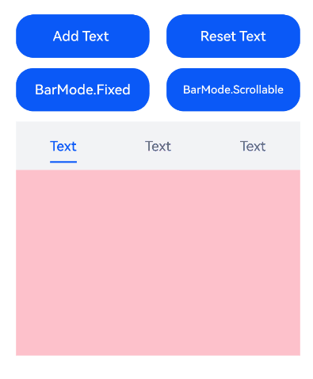

### Example 2: Setting the Layout Style for a Scrollable TabBar

This example implements the **ScrollableBarModeOptions** parameter of [barMode](#barmode10-1), which is valid only in **Scrollable** mode.

```ts
// xxx.ets
@Entry
@Component
struct TabsExample6 {
  private controller: TabsController = new TabsController();
  @State scrollMargin: number = 0;
  @State layoutStyle: LayoutStyle = LayoutStyle.ALWAYS_CENTER;
  @State text: string = 'Text';

  build() {
    Column() {
      Row() {
        Button('scrollMargin+10 ' + this.scrollMargin)
          .width('47%')
          .height(50)
          .margin({ top: 5 })
          .onClick((event?: ClickEvent) => {
            this.scrollMargin += 10;
          })
          .margin({ right: '6%', bottom: '12vp' })
        Button('scrollMargin-10 ' + this.scrollMargin)
          .width('47%')
          .height(50)
          .margin({ top: 5 })
          .onClick((event?: ClickEvent) => {
            this.scrollMargin -= 10;
          })
          .margin({ bottom: '12vp' })
      }

      Row() {
        Button('Add Text')
          .width('47%')
          .height(50)
          .margin({ top: 5 })
          .onClick((event?: ClickEvent) => {
            this.text += 'Add Text';
          })
          .margin({ right: '6%', bottom: '12vp' })
        Button('Reset text')
          .width('47%')
          .height(50)
          .margin({ top: 5 })
          .onClick((event?: ClickEvent) => {
            this.text = 'Text';
          })
          .margin({ bottom: '12vp' })
      }

      Row() {
        Button('layoutStyle.ALWAYS_CENTER')
          .width('100%')
          .height(50)
          .margin({ top: 5 })
          .fontSize(15)
          .onClick((event?: ClickEvent) => {
            this.layoutStyle = LayoutStyle.ALWAYS_CENTER;
          })
          .margin({ bottom: '12vp' })
      }

      Row() {
        Button('layoutStyle.ALWAYS_AVERAGE_SPLIT')
          .width('100%')
          .height(50)
          .margin({ top: 5 })
          .fontSize(15)
          .onClick((event?: ClickEvent) => {
            this.layoutStyle = LayoutStyle.ALWAYS_AVERAGE_SPLIT;
          })
          .margin({ bottom: '12vp' })
      }

      Row() {
        Button('layoutStyle.SPACE_BETWEEN_OR_CENTER')
          .width('100%')
          .height(50)
          .margin({ top: 5 })
          .fontSize(15)
          .onClick((event?: ClickEvent) => {
            this.layoutStyle = LayoutStyle.SPACE_BETWEEN_OR_CENTER;
          })
          .margin({ bottom: '12vp' })
      }

      Tabs({ barPosition: BarPosition.End, controller: this.controller }) {
        TabContent() {
          Column().width('100%').height('100%').backgroundColor(Color.Pink)
        }.tabBar(SubTabBarStyle.of(this.text))

        TabContent() {
          Column().width('100%').height('100%').backgroundColor(Color.Green)
        }.tabBar(SubTabBarStyle.of(this.text))

        TabContent() {
          Column().width('100%').height('100%').backgroundColor(Color.Blue)
        }.tabBar(SubTabBarStyle.of(this.text))
      }
      .animationDuration(300)
      .height('60%')
      .backgroundColor(0xf1f3f5)
      .barMode(BarMode.Scrollable, { margin: this.scrollMargin, nonScrollableLayoutStyle: this.layoutStyle }) // Set the layout style of tab bar in Scrollable mode.
    }
    .width('100%')
    .height(500)
    .margin({ top: 5 })
    .padding('24vp')
  }
}
```

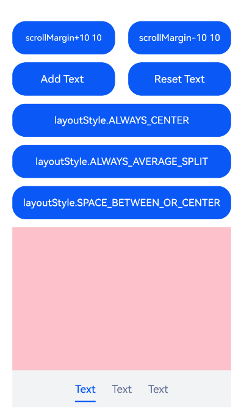

### Example 3: Implementing Custom Tab Switching Synchronization

This example uses [onAnimationStart](#onanimationstart11) and [onChange](#onchange) to implement the linkage between the custom tab bar and tab content during switching.

```ts
// xxx.ets
@Entry
@Component
struct TabsExample {
  @State fontColor: string = '#182431';
  @State selectedFontColor: string = '#007DFF';
  @State currentIndex: number = 0;
  @State selectedIndex: number = 0;
  private controller: TabsController = new TabsController();

  @Builder tabBuilder(index: number, name: string) {
    Column() {
      Text(name)
        .fontColor(this.selectedIndex === index ? this.selectedFontColor : this.fontColor)
        .fontSize(16)
        .fontWeight(this.selectedIndex === index ? 500 : 400)
        .lineHeight(22)
        .margin({ top: 17, bottom: 7 })
      Divider()
        .strokeWidth(2)
        .color('#007DFF')
        .opacity(this.selectedIndex === index ? 1 : 0)
    }.width('100%')
  }

  build() {
    Column() {
      Tabs({ barPosition: BarPosition.Start, index: this.currentIndex, controller: this.controller }) {
        TabContent() {
          Column().width('100%').height('100%').backgroundColor('#00CB87')
        }.tabBar(this.tabBuilder(0, 'green'))

        TabContent() {
          Column().width('100%').height('100%').backgroundColor('#007DFF')
        }.tabBar(this.tabBuilder(1, 'blue'))

        TabContent() {
          Column().width('100%').height('100%').backgroundColor('#FFBF00')
        }.tabBar(this.tabBuilder(2, 'yellow'))

        TabContent() {
          Column().width('100%').height('100%').backgroundColor('#E67C92')
        }.tabBar(this.tabBuilder(3, 'pink'))
      }
      .vertical(false)
      .barMode(BarMode.Fixed)
      .barWidth(360)
      .barHeight(56)
      .animationDuration(400) // Set the Tabs page switching animation duration to 400 ms.
      .onChange((index: number) => {
        // currentIndex controls the tab displayed by TabContent.
        this.currentIndex = index;
        this.selectedIndex = index;
      })
      .onAnimationStart((index: number, targetIndex: number, event: TabsAnimationEvent) => {
        if (index === targetIndex) {
          return;
        }
        // selectedIndex controls the text color switching in the custom tab bar.
        this.selectedIndex = targetIndex;
      })
      .width(360)
      .height(296)
      .margin({ top: 52 })
      .backgroundColor('#F1F3F5')
    }.width('100%')
  }
}
```

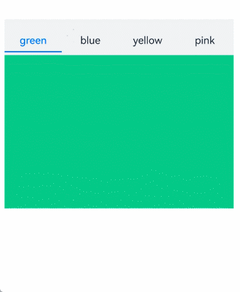

### Example 4: Setting the Basic Attributes of the Divider

This example uses [divider](#divider10) to demonstrate various attributes of the divider.

```ts
// xxx.ets
@Entry
@Component
struct TabsDivider1 {
  private controller1: TabsController = new TabsController();
  @State dividerColor: string = 'red';
  @State strokeWidth: number = 2;
  @State startMargin: number = 0;
  @State endMargin: number = 0;
  @State nullFlag: boolean = false;

  build() {
    Column() {
      Tabs({ controller: this.controller1 }) {
        TabContent() {
          Column().width('100%').height('100%').backgroundColor(Color.Pink)
        }.tabBar('pink')

        TabContent() {
          Column().width('100%').height('100%').backgroundColor(Color.Yellow)
        }.tabBar('yellow')

        TabContent() {
          Column().width('100%').height('100%').backgroundColor(Color.Blue)
        }.tabBar('blue')

        TabContent() {
          Column().width('100%').height('100%').backgroundColor(Color.Green)
        }.tabBar('green')

        TabContent() {
          Column().width('100%').height('100%').backgroundColor(Color.Red)
        }.tabBar('red')
      }
      .vertical(true)
      .scrollable(true)
      .barMode(BarMode.Fixed)
      .barWidth(70)
      .barHeight(200)
      .animationDuration(400)
      .onChange((index: number) => {
        console.info(index.toString());
      })
      .height('200vp')
      .margin({ bottom: '12vp' })
      .divider(this.nullFlag ? null : {
        strokeWidth: this.strokeWidth,
        color: this.dividerColor,
        startMargin: this.startMargin,
        endMargin: this.endMargin
      }) // Set the divider style.

      Button('Regular Divider').width('100%').margin({ bottom: '12vp' })
        .onClick(() => {
          this.nullFlag = false;
          this.strokeWidth = 2;
          this.dividerColor = 'red';
          this.startMargin = 0;
          this.endMargin = 0;
        })
      Button('Empty Divider').width('100%').margin({ bottom: '12vp' })
        .onClick(() => {
          this.nullFlag = true;
        })
      Button('Change to Blue').width('100%').margin({ bottom: '12vp' })
        .onClick(() => {
          this.dividerColor = 'blue';
        })
      Button('Increase Width').width('100%').margin({ bottom: '12vp' })
        .onClick(() => {
          this.strokeWidth += 2;
        })
      Button('Decrease Width').width('100%').margin({ bottom: '12vp' })
        .onClick(() => {
          if (this.strokeWidth > 2) {
            this.strokeWidth -= 2;
          }
        })
      Button('Increase Top Margin').width('100%').margin({ bottom: '12vp' })
        .onClick(() => {
          this.startMargin += 2;
        })
      Button('Decrease Top Margin').width('100%').margin({ bottom: '12vp' })
        .onClick(() => {
          if (this.startMargin > 2) {
            this.startMargin -= 2;
          }
        })
      Button('Increase Bottom Margin').width('100%').margin({ bottom: '12vp' })
        .onClick(() => {
          this.endMargin += 2;
        })
      Button('Decrease Bottom Margin').width('100%').margin({ bottom: '12vp' })
        .onClick(() => {
          if (this.endMargin > 2) {
            this.endMargin -= 2;
          }
        })
    }.padding({ top: '24vp', left: '24vp', right: '24vp' })
  }
}
```

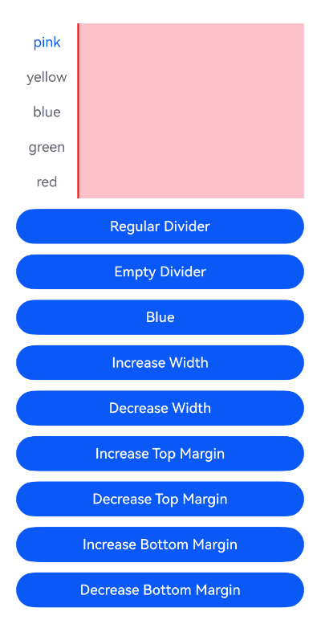

### Example 5: Setting Tab Bar Fading

This example uses [fadingEdge](#fadingedge10) to implement fading and non-fading when switching child tabs.

```ts
// xxx.ets
@Entry
@Component
struct TabsOpaque {
  private controller: TabsController = new TabsController();
  private controller1: TabsController = new TabsController();
  @State selfFadingFade: boolean = true;

  build() {
    Column() {
      Button('Set Tab to Fade').width('100%').margin({ bottom: '12vp' })
        .onClick((event?: ClickEvent) => {
          this.selfFadingFade = true;
        })
      Button('Set Tab Not to Fade').width('100%').margin({ bottom: '12vp' })
        .onClick((event?: ClickEvent) => {
          this.selfFadingFade = false;
        })
      Tabs({ barPosition: BarPosition.End, controller: this.controller }) {
        TabContent() {
          Column().width('100%').height('100%').backgroundColor(Color.Pink)
        }.tabBar('pink')

        TabContent() {
          Column().width('100%').height('100%').backgroundColor(Color.Yellow)
        }.tabBar('yellow')

        TabContent() {
          Column().width('100%').height('100%').backgroundColor(Color.Blue)
        }.tabBar('blue')

        TabContent() {
          Column().width('100%').height('100%').backgroundColor(Color.Green)
        }.tabBar('green')

        TabContent() {
          Column().width('100%').height('100%').backgroundColor(Color.Green)
        }.tabBar('green')

        TabContent() {
          Column().width('100%').height('100%').backgroundColor(Color.Green)
        }.tabBar('green')

        TabContent() {
          Column().width('100%').height('100%').backgroundColor(Color.Green)
        }.tabBar('green')

        TabContent() {
          Column().width('100%').height('100%').backgroundColor(Color.Green)
        }.tabBar('green')
      }
      .vertical(false)
      .scrollable(true)
      .barMode(BarMode.Scrollable)
      .barHeight(80)
      .animationDuration(400)
      .onChange((index: number) => {
        console.info(index.toString());
      })
      .fadingEdge(this.selfFadingFade) // Set whether tabs fade out when they exceed the container width
      .height('30%')
      .width('100%')

      Tabs({ barPosition: BarPosition.Start, controller: this.controller1 }) {
        TabContent() {
          Column().width('100%').height('100%').backgroundColor(Color.Pink)
        }.tabBar('pink')

        TabContent() {
          Column().width('100%').height('100%').backgroundColor(Color.Yellow)
        }.tabBar('yellow')

        TabContent() {
          Column().width('100%').height('100%').backgroundColor(Color.Blue)
        }.tabBar('blue')

        TabContent() {
          Column().width('100%').height('100%').backgroundColor(Color.Green)
        }.tabBar('green')

        TabContent() {
          Column().width('100%').height('100%').backgroundColor(Color.Green)
        }.tabBar('green')

        TabContent() {
          Column().width('100%').height('100%').backgroundColor(Color.Green)
        }.tabBar('green')
      }
      .vertical(true)
      .scrollable(true)
      .barMode(BarMode.Scrollable)
      .barHeight(200)
      .barWidth(80)
      .animationDuration(400)
      .onChange((index: number) => {
        console.info(index.toString());
      })
      .fadingEdge(this.selfFadingFade)
      .height('30%')
      .width('100%')
    }
    .padding({ top: '24vp', left: '24vp', right: '24vp' })
  }
}
```

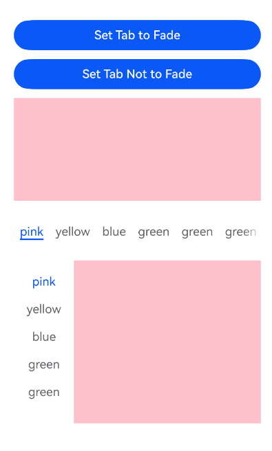

### Example 6: Implementing TabBar Overlay on TabContent

This example uses [barOverlap](#baroverlap10) to set whether the tab bar is blurred behind and overlays the **TabContent**.

```ts
// xxx.ets
@Entry
@Component
struct barHeightTest {
  @State arr: number[] = [0, 1, 2, 3];
  @State barOverlap: boolean = true;

  build() {
    Column() {
      Text(`barOverlap ${this.barOverlap}`).fontSize(16)
      Button('Change barOverlap').width('100%').margin({ bottom: '12vp' })
        .onClick((event?: ClickEvent) => {
          if (this.barOverlap) {
            this.barOverlap = false;
          } else {
            this.barOverlap = true;
          }
        })

      Tabs({ barPosition: BarPosition.End }) {
        TabContent() {
          Column() {
            List({ space: 10 }) {
              ForEach(this.arr, (item: number) => {
                ListItem() {
                  Text('item' + item).width('80%').height(200).fontSize(16).textAlign(TextAlign.Center).backgroundColor('#fff8b81e')
                }
              }, (item: string) => item)
            }.width('100%').height('100%')
            .lanes(2).alignListItem(ListItemAlign.Center)
          }.width('100%').height('100%')
          .backgroundColor(Color.Pink)
        }
        .tabBar(new BottomTabBarStyle($r('sys.media.ohos_icon_mask_svg'), 'Test 0'))
      }
      .scrollable(false)
      .height('60%')
      .barOverlap(this.barOverlap) // Set whether the tab bar is blurred behind and overlays the TabContent.
    }
    .height(500)
    .padding({ top: '24vp', left: '24vp', right: '24vp' })
  }
}
```

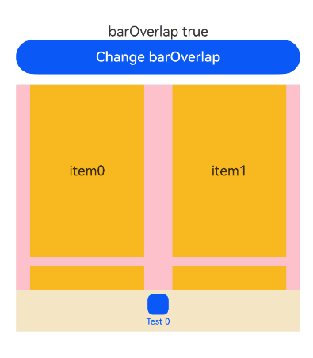

### Example 7: Setting the Visible Area for the Tab Bar in Responsive Grid Mode

This example uses [barGridAlign](#bargridalign10) to set the visible area of the tab bar in a grid-based manner.

```ts
// xxx.ets
@Entry
@Component
struct TabsExample5 {
  private controller: TabsController = new TabsController();
  @State gridMargin: number = 10;
  @State gridGutter: number = 10;
  @State sm: number = -2;
  @State clickedContent: string = '';

  build() {
    Column() {
      Row() {
        Button('gridMargin+10 ' + this.gridMargin)
          .width('47%')
          .height(50)
          .margin({ top: 5 })
          .onClick((event?: ClickEvent) => {
            this.gridMargin += 10;
          })
          .margin({ right: '6%', bottom: '12vp' })
        Button('gridMargin-10 ' + this.gridMargin)
          .width('47%')
          .height(50)
          .margin({ top: 5 })
          .onClick((event?: ClickEvent) => {
            this.gridMargin -= 10;
          })
          .margin({ bottom: '12vp' })
      }

      Row() {
        Button('gridGutter+10 ' + this.gridGutter)
          .width('47%')
          .height(50)
          .margin({ top: 5 })
          .onClick((event?: ClickEvent) => {
            this.gridGutter += 10;
          })
          .margin({ right: '6%', bottom: '12vp' })
        Button('gridGutter-10 ' + this.gridGutter)
          .width('47%')
          .height(50)
          .margin({ top: 5 })
          .onClick((event?: ClickEvent) => {
            this.gridGutter -= 10;
          })
          .margin({ bottom: '12vp' })
      }

      Row() {
        Button('sm+2 ' + this.sm)
          .width('47%')
          .height(50)
          .margin({ top: 5 })
          .onClick((event?: ClickEvent) => {
            this.sm += 2;
          })
          .margin({ right: '6%' })
        Button('sm-2 ' + this.sm).width('47%').height(50).margin({ top: 5 })
          .onClick((event?: ClickEvent) => {
            this.sm -= 2;
          })
      }

      Text('Tapped content:' + this.clickedContent).width('100%').height(200).margin({ top: 5 })


      Tabs({ barPosition: BarPosition.End, controller: this.controller }) {
        TabContent() {
          Column().width('100%').height('100%').backgroundColor(Color.Pink)
        }.tabBar(BottomTabBarStyle.of($r('sys.media.ohos_app_icon'), '1'))

        TabContent() {
          Column().width('100%').height('100%').backgroundColor(Color.Green)
        }.tabBar(BottomTabBarStyle.of($r('sys.media.ohos_app_icon'), '2'))

        TabContent() {
          Column().width('100%').height('100%').backgroundColor(Color.Blue)
        }.tabBar(BottomTabBarStyle.of($r('sys.media.ohos_app_icon'), '3'))
      }
      .width('350vp')
      .animationDuration(300)
      .height('60%')
      .barGridAlign({ sm: this.sm, margin: this.gridMargin, gutter: this.gridGutter }) // Set the visible area of the tab bar in a grid-based manner.
      .backgroundColor(0xf1f3f5)
      .onTabBarClick((index: number) => {
        this.clickedContent += 'now index ' + index + ' is clicked\n';
      })
    }
    .width('100%')
    .height(500)
    .margin({ top: 5 })
    .padding('10vp')
  }
}
```

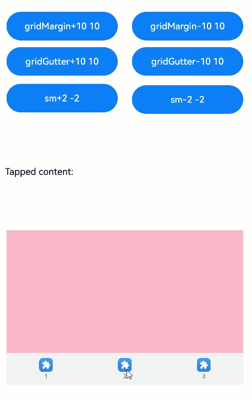

### Example 8: Implementing a Custom Tab Switching Animation

In this example, the [customContentTransition](#customcontenttransition11) API is used to define a custom switching animation for the **Tabs** page.

```ts
// xxx.ets
interface itemType {
  text: string,
  backgroundColor: Color
}

@Entry
@Component
struct TabsCustomAnimationExample {
  @State data: itemType[] = [
    {
      text: 'Red',
      backgroundColor: Color.Red
    },
    {
      text: 'Yellow',
      backgroundColor: Color.Yellow
    },
    {
      text: 'Blue',
      backgroundColor: Color.Blue
    }];
  @State opacityList: number[] = [];
  @State scaleList: number[] = [];

  private durationList: number[] = [];
  private timeoutList: number[] = [];
  private customContentTransition: (from: number, to: number) => TabContentAnimatedTransition = (from: number, to: number) => {
    let tabContentAnimatedTransition = {
      timeout: this.timeoutList[from],
      transition: (proxy: TabContentTransitionProxy) => {
        this.scaleList[from] = 1.0;
        this.scaleList[to] = 0.5;
        this.opacityList[from] = 1.0;
        this.opacityList[to] = 0.5;
        this.getUIContext()?.animateTo({
          duration: this.durationList[from],
          onFinish: () => {
            proxy.finishTransition();
          }
        }, () => {
          this.scaleList[from] = 0.5;
          this.scaleList[to] = 1.0;
          this.opacityList[from] = 0.5;
          this.opacityList[to] = 1.0;
        });
      }
    } as TabContentAnimatedTransition;
    return tabContentAnimatedTransition;
  };

  aboutToAppear(): void {
    let duration = 1000;
    let timeout = 1000;
    for (let i = 1; i <= this.data.length; i++) {
      this.opacityList.push(1.0);
      this.scaleList.push(1.0);
      this.durationList.push(duration * i);
      this.timeoutList.push(timeout * i);
    }
  }

  build() {
    Column() {
      Tabs() {
        ForEach(this.data, (item: itemType, index: number) => {
          TabContent() {}
          .tabBar(item.text)
          .backgroundColor(item.backgroundColor)
          // Customize the animation to change opacity, scale pages, and so on.
          .opacity(this.opacityList[index])
          .scale({ x: this.scaleList[index], y: this.scaleList[index] })
        })
      }
      .backgroundColor(0xf1f3f5)
      .width('100%')
      .height(500)
      .customContentTransition(this.customContentTransition) // Set the custom Tabs page switching animation.
    }
  }
}
```


### Example 9: Implementing Tab Switching Interception

This example implements custom interception of page switching via gesture swiping through [onContentWillChange](#oncontentwillchange12).

```ts
// xxx.ets
@Entry
@Component
struct TabsExample {
  @State selectedIndex: number = 2;
  @State currentIndex: number = 2;
  private controller: TabsController = new TabsController();

  @Builder tabBuilder(title: string,targetIndex: number) {
    Column(){
      // Replace $r('app.media.star_fill') with the image resource file required.
      // Replace $r('app.media.star') with the image resource file required.
      Image(this.selectedIndex === targetIndex ? $r('app.media.star_fill') : $r('app.media.star'))
        .width(24)
        .height(24)
        .margin({ bottom: 4 })
        .objectFit(ImageFit.Contain)
      Text(title).fontColor(this.selectedIndex === targetIndex ? '#1698CE' : '#6B6B6B')
    }.width('100%')
    .height(50)
    .justifyContent(FlexAlign.Center)
  }
  
  build() {
    Column() {
      Tabs({ barPosition: BarPosition.End, index: this.currentIndex, controller: this.controller }) {
        TabContent() {
          Column(){
            Text('Content of the Home tab')
          }.width('100%').height('100%').backgroundColor('#00CB87').justifyContent(FlexAlign.Center)
        }.tabBar(this.tabBuilder('Home',0))

        TabContent() {
          Column(){
            Text('Discovered content')
          }.width('100%').height('100%').backgroundColor('#007DFF').justifyContent(FlexAlign.Center)
        }.tabBar(this.tabBuilder('Discover',1))

        TabContent() {
          Column(){
            Text('Content of the Recommended tab')
          }.width('100%').height('100%').backgroundColor('#FFBF00').justifyContent(FlexAlign.Center)
        }.tabBar(this.tabBuilder('Recommended',2))

        TabContent() {
          Column(){
            Text('Content of the Me tab')
          }.width('100%').height('100%').backgroundColor('#E67C92').justifyContent(FlexAlign.Center)
        }.tabBar(this.tabBuilder('Me',3))
      }
      .vertical(false)
      .barMode(BarMode.Fixed)
      .barWidth(360)
      .barHeight(60)
      .animationDuration(0)
      .onChange((index: number) => {
        this.currentIndex = index;
        this.selectedIndex = index;
      })
      .width(360)
      .height(600)
      .backgroundColor('#F1F3F5')
      .scrollable(true)
      .onContentWillChange((currentIndex, comingIndex) => {
        // Intercept page switching: return false to block the switch when the target page index is 2, otherwise return true to allow the switch.
        if (comingIndex == 2) {
          return false;
        }
        return true;
      })

      Button('Change Index').width('50%').margin({ top: 20 })
        .onClick(()=>{
          this.currentIndex = (this.currentIndex + 1) % 4;
        })

      Button('changeIndex').width('50%').margin({ top: 20 })
        .onClick(()=>{
          this.currentIndex = (this.currentIndex + 1) % 4;
          this.controller.changeIndex(this.currentIndex);
        })
    }.width('100%')
  }
}
```

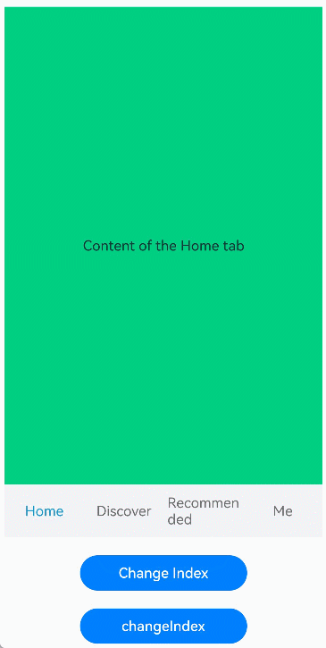

### Example 10: Customizing the Tab Bar Switching Animation

This example implements the switching animation of a custom tab bar through APIs such as [onChange](#onchange), [onAnimationStart](#onanimationstart11), [onAnimationEnd](#onanimationend11), and [onGestureSwipe](#ongestureswipe11).

<!--code_no_check-->

```ts
// EntryAbility.ets
import { Configuration, UIAbility } from '@kit.AbilityKit';
import { i18n } from '@kit.LocalizationKit';
import { CommonUtil } from '../common/CommonUtil';

export default class EntryAbility extends UIAbility {
  onConfigurationUpdate(newConfig: Configuration): void {
    // Listen for system configuration changes.
    if (newConfig.language) {
      CommonUtil.setIsRTL(i18n.isRTL(newConfig.language));
    }
  }
}
```

<!--code_no_check-->

```ts
// CommonUtil.ets
export class CommonUtil {
  private static isRTL: boolean = false;

  public static setIsRTL(isRTL: boolean): void {
    CommonUtil.isRTL = isRTL;
  }

  public static getIsRTL(): boolean {
    return CommonUtil.isRTL;
  }
}
```

<!--code_no_check-->

```ts
// xxx.ets
import { LengthMetrics } from '@kit.ArkUI';
import { CommonUtil } from '../common/CommonUtil';

@Entry
@Component
struct TabsExample {
  @State colorArray: [string, string][] =
    [['green', '#00CB87'], ['blue', '#007DFF'], ['yellow', '#FFBF00'], ['pink', '#E67C92']];
  @State currentIndex: number = 0;
  @State animationDuration: number = 300;
  @State indicatorLeftMargin: number = 0;
  @State indicatorWidth: number = 0;
  private tabsWidth: number = 0;
  private textInfos: [number, number][] = [];
  private isStartAnimateTo: boolean = false;

  aboutToAppear():void {
    for (let i = 0; i < this.colorArray.length; i++) {
      this.textInfos.push([0, 0]);
    }
  }

  @Builder
  tabBuilder(index: number, name: string) {
    Column() {
      Text(name)
        .fontSize(16)
        .fontColor(this.currentIndex === index ? '#007DFF' : '#182431')
        .fontWeight(this.currentIndex === index ? 500 : 400)
        .id(index.toString())
        .onAreaChange((oldValue: Area, newValue: Area) => {
          this.textInfos[index] = [newValue.globalPosition.x as number, newValue.width as number];
          if (!this.isStartAnimateTo && this.currentIndex === index && this.tabsWidth > 0) {
            this.setIndicatorAttr(this.textInfos[this.currentIndex][0], this.textInfos[this.currentIndex][1]);
          }
        })
    }.width('100%')
  }

  build() {
    Stack({ alignContent: Alignment.TopStart }) {
      Tabs({ barPosition: BarPosition.Start }) {
        ForEach(this.colorArray, (item: [string, string], index:number) => {
          TabContent() {
            Column().width('100%').height('100%').backgroundColor(item[1])
          }.tabBar(this.tabBuilder(index, item[0]))
        })
      }
      .onAreaChange((oldValue: Area, newValue: Area)=> {
        this.tabsWidth = newValue.width as number;
        if (!this.isStartAnimateTo) {
          this.setIndicatorAttr(this.textInfos[this.currentIndex][0], this.textInfos[this.currentIndex][1]);
        }
      })
      .barWidth('100%')
      .barHeight(56)
      .width('100%')
      .height(296)
      .backgroundColor('#F1F3F5')
      .animationDuration(this.animationDuration)
      .onChange((index: number) => {
        // currentIndex controls the tab content displayed by TabContent.
        this.currentIndex = index;
      })
      .onAnimationStart((index: number, targetIndex: number, event: TabsAnimationEvent) => {
        // Triggered when the switching animation starts: update currentIndex to the target index and start the underline animation to follow the page swipe.
        this.currentIndex = targetIndex;
        this.startAnimateTo(this.animationDuration, this.textInfos[targetIndex][0], this.textInfos[targetIndex][1]);
      })
      .onAnimationEnd((index: number, event: TabsAnimationEvent) => {
        // This callback is triggered when the switching animation ends. The underline animation stops.
        let currentIndicatorInfo = this.getCurrentIndicatorInfo(index, event);
        this.startAnimateTo(0, currentIndicatorInfo.left, currentIndicatorInfo.width);
      })
      .onGestureSwipe((index: number, event: TabsAnimationEvent) => {
        // This callback is triggered frame by frame while the page follows the swipe gesture.
        let currentIndicatorInfo = this.getCurrentIndicatorInfo(index, event);
        this.currentIndex = currentIndicatorInfo.index;
        this.setIndicatorAttr(currentIndicatorInfo.left, currentIndicatorInfo.width);
      })

      Column()
        .height(2)
        .width(this.indicatorWidth)
        .margin({ start: LengthMetrics.vp(this.indicatorLeftMargin), top: LengthMetrics.vp(48) })
        .backgroundColor('#007DFF')
    }.width('100%')
  }

  private getCurrentIndicatorInfo(index: number, event: TabsAnimationEvent): Record<string, number> {
    let nextIndex = index;
    if (index > 0 && (CommonUtil.getIsRTL() ? event.currentOffset < 0 : event.currentOffset > 0)) {
      nextIndex--;
    } else if (index < this.textInfos.length - 1 &&
        (CommonUtil.getIsRTL() ? event.currentOffset > 0 : event.currentOffset < 0)) {
      nextIndex++;
    }
    let indexInfo = this.textInfos[index];
    let nextIndexInfo = this.textInfos[nextIndex];
    let swipeRatio = Math.abs(event.currentOffset / this.tabsWidth);
    let currentIndex = swipeRatio > 0.5 ? nextIndex : index; // When the page is swiped more than halfway, the tabBar switches to the next page.
    let currentLeft = indexInfo[0] + (nextIndexInfo[0] - indexInfo[0]) * swipeRatio;
    let currentWidth = indexInfo[1] + (nextIndexInfo[1] - indexInfo[1]) * swipeRatio;
    return { 'index': currentIndex, 'left': currentLeft, 'width': currentWidth };
  }

  private startAnimateTo(duration: number, leftMargin: number, width: number) {
    this.isStartAnimateTo = true;
    this.getUIContext()?.animateTo({
      duration: duration, // Animation duration
      curve: Curve.Linear, // Animation curve
      iterations: 1, // Number of playbacks.
      playMode: PlayMode.Normal, // Animation mode.
      onFinish: () => {
        this.isStartAnimateTo = false;
        console.info('play end');
      }
    }, () => {
      this.setIndicatorAttr(leftMargin, width);
    });
  }

  private setIndicatorAttr(leftMargin: number, width: number) {
    this.indicatorWidth = width;
    if (CommonUtil.getIsRTL()) {
      this.indicatorLeftMargin = this.tabsWidth - leftMargin - width;
    } else {
      this.indicatorLeftMargin = leftMargin;
    }
  }
}
```


### Example 11: Preloading Child Nodes

This example demonstrates how to use the [preloadItems](#preloaditems12) API to preload specified child nodes.

```ts
// xxx.ets
import { BusinessError } from '@kit.BasicServicesKit';

@Entry
@Component
struct TabsPreloadItems {
  @State currentIndex: number = 1;
  private tabsController: TabsController = new TabsController();

  build() {
    Column() {
      Tabs({ index: this.currentIndex, controller: this.tabsController }) {
        TabContent() {
          MyComponent({ color: '#00CB87' })
        }.tabBar(SubTabBarStyle.of('green'))

        TabContent() {
          MyComponent({ color: '#007DFF' })
        }.tabBar(SubTabBarStyle.of('blue'))

        TabContent() {
          MyComponent({ color: '#FFBF00' })
        }.tabBar(SubTabBarStyle.of('yellow'))

        TabContent() {
          MyComponent({ color: '#E67C92' })
        }.tabBar(SubTabBarStyle.of('pink'))
      }
      .width(360)
      .height(296)
      .backgroundColor('#F1F3F5')
      .onChange((index: number) => {
        this.currentIndex = index;
      })

      Button('preload items: [0, 2, 3]')
        .margin(5)
        .onClick(() => {
          // Preload child nodes 0, 2, and 3 to improve the performance when switching to these nodes by swiping or tapping.
          this.tabsController.preloadItems([0, 2, 3])
            .then(() => {
              console.info('preloadItems success.');
            })
            .catch((error: BusinessError) => {
              console.error('preloadItems failed, error code: ' + error.code + ', error message: ' + error.message);
            })
        })
    }
  }
}

@Component
struct MyComponent {
  private color: string = '';

  aboutToAppear(): void {
    console.info('aboutToAppear backgroundColor:' + this.color);
  }

  aboutToDisappear(): void {
    console.info('aboutToDisappear backgroundColor:' + this.color);
  }

  build() {
    Column()
      .width('100%')
      .height('100%')
      .backgroundColor(this.color)
  }
}
```

### Example 12: Setting Tab Bar Translation and Opacity

This example sets the translation distance and opacity of the tab bar through APIs such as [setTabBarTranslate](#settabbartranslate13) and [setTabBarOpacity](#settabbaropacity13).

```ts
// xxx.ets
@Entry
@Component
struct TabsExample {
  private controller: TabsController = new TabsController();

  build() {
    Column() {
      Button('Set TabBar Translation Distance').margin({ top: 20 })
        .onClick(() => {
          this.controller.setTabBarTranslate({ x: -20, y: -20 }); // Set the tab bar to translate 20 vp left and up
        })

      Button('Set TabBar Opacity').margin({ top: 20 })
        .onClick(() => {
          this.controller.setTabBarOpacity(0.5); // Set the tab bar opacity to 0.5 (semi-transparent).
        })

      Tabs({ barPosition: BarPosition.End, controller: this.controller }) {
        TabContent() {
          Column().width('100%').height('100%').backgroundColor('#00CB87')
        }.tabBar(BottomTabBarStyle.of($r('app.media.startIcon'), 'green'))

        TabContent() {
          Column().width('100%').height('100%').backgroundColor('#007DFF')
        }.tabBar(BottomTabBarStyle.of($r('app.media.startIcon'), 'blue'))

        TabContent() {
          Column().width('100%').height('100%').backgroundColor('#FFBF00')
        }.tabBar(BottomTabBarStyle.of($r('app.media.startIcon'), 'yellow'))

        TabContent() {
          Column().width('100%').height('100%').backgroundColor('#E67C92')
        }.tabBar(BottomTabBarStyle.of($r('app.media.startIcon'), 'pink'))
      }
      .width(360)
      .height(296)
      .margin({ top: 20 })
      .barBackgroundColor('#F1F3F5')
    }
    .width('100%')
  }
}
```

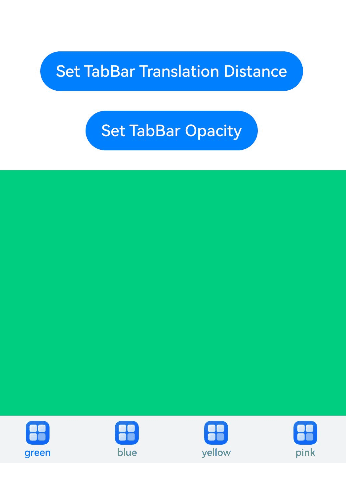

### Example 13: Implementing Lazy Loading and Resource Release of Pages

This example uses a custom [TabBar](ts-container-tabcontent.md#tabbar) and [Swiper](ts-container-swiper.md) together with [LazyForEach](ts-rendering-control-lazyforeach.md) to implement page lazy loading and release.

```ts
// xxx.ets
class MyDataSource implements IDataSource {
  private list: number[] = [];

  constructor(list: number[]) {
    this.list = list;
  }

  totalCount(): number {
    return this.list.length;
  }

  getData(index: number): number {
    return this.list[index];
  }

  registerDataChangeListener(listener: DataChangeListener): void {
  }

  unregisterDataChangeListener() {
  }
}

@Entry
@Component
struct TabsSwiperExample {
  @State fontColor: string = '#182431';
  @State selectedFontColor: string = '#007DFF';
  @State currentIndex: number = 0;
  private list: number[] = [];
  private tabsController: TabsController = new TabsController();
  private swiperController: SwiperController = new SwiperController();
  private swiperData: MyDataSource = new MyDataSource([]);

  aboutToAppear(): void {
    for (let i = 0; i <= 9; i++) {
      this.list.push(i);
    }
    this.swiperData = new MyDataSource(this.list);
  }

  @Builder tabBuilder(index: number, name: string) {
    Column() {
      Text(name)
        .fontColor(this.currentIndex === index ? this.selectedFontColor : this.fontColor)
        .fontSize(16)
        .fontWeight(this.currentIndex === index ? 500 : 400)
        .lineHeight(22)
        .margin({ top: 17, bottom: 7 })
      Divider()
        .strokeWidth(2)
        .color('#007DFF')
        .opacity(this.currentIndex === index ? 1 : 0)
    }.width('20%')
  }

  build() {
    Column() {
      Tabs({ barPosition: BarPosition.Start, controller: this.tabsController }) {
        ForEach(this.list, (item: number) => {
          TabContent().tabBar(this.tabBuilder(item, 'Tab ' + this.list[item]))
        })
      }
      .onTabBarClick((index: number) => {
        this.currentIndex = index;
        this.swiperController.changeIndex(index, true);
      })
      .barMode(BarMode.Scrollable)
      .backgroundColor('#F1F3F5')
      .height(56)
      .width('100%')

      Swiper(this.swiperController) {
        LazyForEach(this.swiperData, (item: string) => {
          Text(item.toString())
            .onAppear(()=>{
              console.info('onAppear ' + item.toString());
            })
            .onDisAppear(()=>{
              console.info('onDisAppear ' + item.toString());
            })
            .width('100%')
            .height('100%')
            .backgroundColor(0xAFEEEE)
            .textAlign(TextAlign.Center)
            .fontSize(30)
        }, (item: string) => item)
      }
      .loop(false)
      .onChange((index: number) => {
        this.currentIndex = index;
      })
      .onAnimationStart((index: number, targetIndex: number, extraInfo: SwiperAnimationEvent) => {
        this.currentIndex = targetIndex;
        this.tabsController.changeIndex(targetIndex);
      })
    }
  }
}
```

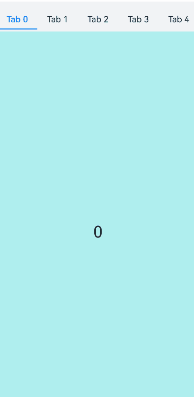

### Example 14: Implementing the Tab Switching Animation

This example sets the [animationMode](#animationmode12) attribute to implement the page-turning animation.

```ts
// xxx.ets
@Entry
@Component
struct TabsExample {
  @State currentIndex: number = 0;
  @State currentAnimationMode: AnimationMode = AnimationMode.CONTENT_FIRST;
  private controller: TabsController = new TabsController();
  private data: number[] = [];

  aboutToAppear(): void {
    for (let i = 0; i < 10; i++) {
      this.data.push(i);
    }
  }

  @Builder
  tabBuilder(title: string, targetIndex: number) {
    Column() {
      Text(title).fontColor(this.currentIndex === targetIndex ? '#FF0000' : '#6B6B6B')
    }.width('100%')
    .height(50)
    .justifyContent(FlexAlign.Center)
  }

  build() {
    Column() {
      Tabs({ barPosition: BarPosition.End, controller: this.controller, index: this.currentIndex }) {
        ForEach(this.data, (item: number) => {
          TabContent() {
            Column() {
              Text('' + item)
            }.width('100%').height('100%').backgroundColor('#00CB87').justifyContent(FlexAlign.Center)
          }.tabBar(this.tabBuilder('P' + item, item))
        }, (item: number) => item.toString())
      }
      .barWidth(360)
      .barHeight(60)
      .animationMode(this.currentAnimationMode)
      .animationDuration(4000)
      .onChange((index: number) => {
        this.currentIndex = index;
      })
      .width(360)
      .height(120)
      .backgroundColor('#F1F3F5')

      Text('AnimationMode:' + AnimationMode[this.currentAnimationMode])

      Button('AnimationMode').width('50%').margin({ top: 1 }).height(25)
        .onClick(() => {
          if (this.currentAnimationMode === AnimationMode.CONTENT_FIRST) {
            this.currentAnimationMode = AnimationMode.ACTION_FIRST;
          } else if (this.currentAnimationMode === AnimationMode.ACTION_FIRST) {
            this.currentAnimationMode = AnimationMode.NO_ANIMATION;
          } else if (this.currentAnimationMode === AnimationMode.NO_ANIMATION) {
            this.currentAnimationMode = AnimationMode.CONTENT_FIRST_WITH_JUMP;
          } else if (this.currentAnimationMode === AnimationMode.CONTENT_FIRST_WITH_JUMP) {
            this.currentAnimationMode = AnimationMode.ACTION_FIRST_WITH_JUMP;
          } else if (this.currentAnimationMode === AnimationMode.ACTION_FIRST_WITH_JUMP) {
            this.currentAnimationMode = AnimationMode.CONTENT_FIRST;
          }
        })
    }.width('100%')
  }
}
```


### Example 15: Enabling Tabs to Exceed the Tab Bar Area

This example uses the **barModifier** in [TabsOptions](#tabsoptions15) to set the **clip** attribute of the **TabBar** to display tabs beyond the tab bar area.

Since API version 15, the **barModifier** API has been added to **TabsOptions**.

```ts
// xxx.ets
import { CommonModifier } from '@kit.ArkUI';

@Entry
@Component
struct TabsBarModifierExample {
  @State selectedIndex: number = 2;
  @State currentIndex: number = 2;
  @State isClip: boolean = false;
  @State tabBarModifier: CommonModifier = new CommonModifier();
  private controller: TabsController = new TabsController();

  aboutToAppear(): void {
    this.tabBarModifier.clip(this.isClip);
  }

  @Builder
  tabBuilder(title: string, targetIndex: number) {
    Column() {
      Image($r('app.media.startIcon')).width(30).height(30)
      Text(title).fontColor(this.selectedIndex === targetIndex ? '#1698CE' : '#6B6B6B')
    }.width('100%')
    .height(50)
    .justifyContent(FlexAlign.Center)
    .offset({ y: this.selectedIndex === targetIndex ? -15 : 0 })
  }

  build() {
    Column() {
      Tabs({
        barPosition: BarPosition.End,
        index: this.currentIndex,
        controller: this.controller,
        barModifier: this.tabBarModifier
      }) {
        TabContent() {
          Column() {
            Text('Content of the Home tab')
          }.width('100%').height('100%').backgroundColor('#00CB87').justifyContent(FlexAlign.Center)
        }.tabBar(this.tabBuilder('Home', 0))

        TabContent() {
          Column() {
            Text('Content of the Discover tab')
          }.width('100%').height('100%').backgroundColor('#007DFF').justifyContent(FlexAlign.Center)
        }.tabBar(this.tabBuilder('Discover', 1))

        TabContent() {
          Column() {
            Text('Content of the Recommended tab')
          }.width('100%').height('100%').backgroundColor('#FFBF00').justifyContent(FlexAlign.Center)
        }.tabBar(this.tabBuilder('Recommended', 2))

        TabContent() {
          Column() {
            Text('Content of the Me tab')
          }.width('100%').height('100%').backgroundColor('#E67C92').justifyContent(FlexAlign.Center)
        }.tabBar(this.tabBuilder('Me', 3))
      }
      .vertical(false)
      .barMode(BarMode.Fixed)
      .barWidth(340)
      .barHeight(60)
      .onChange((index: number) => {
        this.currentIndex = index;
        this.selectedIndex = index;
      })
      .width(340)
      .height(400)
      .backgroundColor('#F1F3F5')
      .scrollable(true)

      Button('isClip: ' + this.isClip)
        .margin({ top: 30 })
        .onClick(() => {
          this.isClip = !this.isClip;
          this.tabBarModifier.clip(this.isClip);
        })
    }.width('100%')
  }
}
```

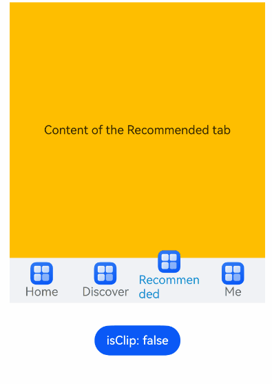

### Example 16: Aligning Tabs

This example uses the **barModifier** in [TabsOptions](#tabsoptions15) to set the **align** attribute of the **TabBar** to implement the tab alignment layout effect.

Since API version 15, the **barModifier** API is added to **TabsOptions**.

```ts
// xxx.ets
import { CommonModifier } from '@kit.ArkUI';

@Entry
@Component
struct TabsBarModifierExample {
  private controller: TabsController = new TabsController();
  @State text: string = 'Text';
  @State isVertical: boolean = false;
  @State tabBarModifier: CommonModifier = new CommonModifier();

  build() {
    Column() {
      Row() {
        Button('Alignment.Start ')
          .width('47%')
          .height(50)
          .margin({ top: 5 })
          .onClick((event?: ClickEvent) => {
            this.tabBarModifier.align(Alignment.Start);
          })
          .margin({ right: '6%', bottom: '12vp' })
        Button('Alignment.End')
          .width('47%')
          .height(50)
          .margin({ top: 5 })
          .onClick((event?: ClickEvent) => {
            this.tabBarModifier.align(Alignment.End);
          })
          .margin({ bottom: '12vp' })
      }

      Row() {
        Button('Alignment.Center')
          .width('47%')
          .height(50)
          .margin({ top: 5 })
          .onClick((event?: ClickEvent) => {
            this.tabBarModifier.align(Alignment.Center);
          })
          .margin({ right: '6%', bottom: '12vp' })
        Button('isVertical: ' + this.isVertical)
          .width('47%')
          .height(50)
          .margin({ top: 5 })
          .onClick((event?: ClickEvent) => {
            this.isVertical = !this.isVertical;
          })
          .margin({ bottom: '12vp' })
      }

      Row() {
        Button('Alignment.Top')
          .width('47%')
          .height(50)
          .margin({ top: 5 })
          .onClick((event?: ClickEvent) => {
            this.tabBarModifier.align(Alignment.Top);
          })
          .margin({ right: '6%', bottom: '12vp' })
        Button('Alignment.Bottom')
          .width('47%')
          .height(50)
          .margin({ top: 5 })
          .onClick((event?: ClickEvent) => {
            this.tabBarModifier.align(Alignment.Bottom);
          })
          .margin({ bottom: '12vp' })
      }

      Tabs({ barPosition: BarPosition.End, controller: this.controller, barModifier: this.tabBarModifier }) {
        TabContent() {
          Column().width('100%').height('100%').backgroundColor(Color.Pink)
        }.tabBar(SubTabBarStyle.of(this.text))

        TabContent() {
          Column().width('100%').height('100%').backgroundColor(Color.Green)
        }.tabBar(SubTabBarStyle.of(this.text))

        TabContent() {
          Column().width('100%').height('100%').backgroundColor(Color.Blue)
        }.tabBar(SubTabBarStyle.of(this.text))
      }
      .vertical(this.isVertical)
      .height('60%')
      .backgroundColor(0xf1f3f5)
      .barMode(BarMode.Scrollable)
    }
    .width('100%')
    .height(500)
    .margin({ top: 5 })
    .padding('24vp')
  }
}
```

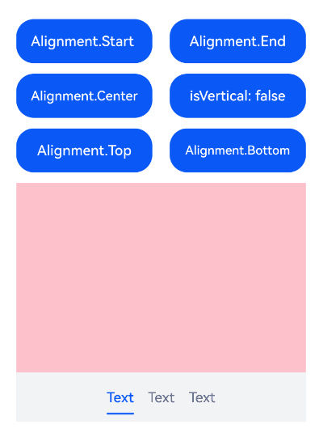

### Example 17: Synchronizing Tabs and TabBar Synchronously

This example uses the [onSelected](#onselected18) API to implement synchronized switching between **Tabs** and **TabBar**.

Since API version 18, the **onSelected** API is added.

```ts
// xxx.ets
@Entry
@Component
struct TabsExample {
  @State fontColor: string = '#182431';
  @State selectedFontColor: string = '#007DFF';
  @State currentIndex: number = 0;
  @State selectedIndex: number = 0;
  private controller: TabsController = new TabsController();

  @Builder tabBuilder(index: number, name: string) {
    Column() {
      Text(name)
        .fontColor(this.selectedIndex === index ? this.selectedFontColor : this.fontColor)
        .fontSize(16)
        .fontWeight(this.selectedIndex === index ? 500 : 400)
        .lineHeight(22)
        .margin({ top: 17, bottom: 7 })
      Divider()
        .strokeWidth(2)
        .color('#007DFF')
        .opacity(this.selectedIndex === index ? 1 : 0)
    }.width('100%')
  }

  build() {
    Column() {
      Tabs({ barPosition: BarPosition.Start, index: this.currentIndex, controller: this.controller }) {
        TabContent() {
          Column().width('100%').height('100%').backgroundColor('#00CB87')
        }.tabBar(this.tabBuilder(0, 'green'))

        TabContent() {
          Column().width('100%').height('100%').backgroundColor('#007DFF')
        }.tabBar(this.tabBuilder(1, 'blue'))

        TabContent() {
          Column().width('100%').height('100%').backgroundColor('#FFBF00')
        }.tabBar(this.tabBuilder(2, 'yellow'))

        TabContent() {
          Column().width('100%').height('100%').backgroundColor('#E67C92')
        }.tabBar(this.tabBuilder(3, 'pink'))
      }
      .vertical(false)
      .barMode(BarMode.Fixed)
      .barWidth(360)
      .barHeight(56)
      .animationDuration(400)
      .animationMode(AnimationMode.CONTENT_FIRST)
      .onChange((index: number) => {
        console.info('onChange index:' + index);
        this.currentIndex = index;
      })
      .onSelected((index: number) => {
        console.info('onSelected index:' + index);
        this.selectedIndex = index;
      })
      .onUnselected((index: number) => {
        console.info('onUnselected index:' + index);
      })
      .width('100%')
      .height('100%')
      .backgroundColor('#F1F3F5')
    }.width('100%')
  }
}
```


### Example 18: Releasing the Tabs Child Components

This example releases the child components of **Tabs** by setting the [cachedMaxCount](#cachedmaxcount19) attribute.

Since API version 19, the **cachedMaxCount** API is added.

```ts
@Entry
@Component
struct TabsExample {
  build() {
    Tabs() {
      TabContent() {
        MyComponent({ color: '#00CB87' })
      }.tabBar(SubTabBarStyle.of('green'))

      TabContent() {
        MyComponent({ color: '#007DFF' })
      }.tabBar(SubTabBarStyle.of('blue'))

      TabContent() {
        MyComponent({ color: '#FFBF00' })
      }.tabBar(SubTabBarStyle.of('yellow'))

      TabContent() {
        MyComponent({ color: '#E67C92' })
      }.tabBar(SubTabBarStyle.of('pink'))
    }
    .width(360)
    .height(296)
    .backgroundColor('#F1F3F5')
    .cachedMaxCount(1, TabsCacheMode.CACHE_BOTH_SIDE) // Set a maximum of 3 cached child components (the current page and one on each side).
  }
}

@Component
struct MyComponent {
  private color: string = '';

  aboutToAppear(): void {
    console.info('aboutToAppear backgroundColor:' + this.color);
  }

  aboutToDisappear(): void {
    console.info('aboutToDisappear backgroundColor:' + this.color);
  }

  build() {
    Column()
      .width('100%')
      .height('100%')
      .backgroundColor(this.color)
  }
}
```

### Example 19: Setting the Tab Bar Background Blur Effect

This example sets the background blur style and effect of the tab bar through [barBackgroundBlurStyle](#barbackgroundblurstyle18) and [barBackgroundEffect](#barbackgroundeffect18), respectively.

Since API version 18, the **barBackgroundBlurStyle** and **barBackgroundEffect** APIs are added.

```ts
// xxx.ets
@Entry
@Component
struct TabsExample {
  build() {
    Column() {
      // barBackgroundBlurStyle can set blur parameters through enum values.
      Stack() {
        Image($r('app.media.startIcon'))
        Tabs() {
          TabContent() {
            Column().width('100%').height('100%').backgroundColor('#00CB87')
          }.tabBar('green')

          TabContent() {
            Column().width('100%').height('100%').backgroundColor('#007DFF')
          }.tabBar('blue')

          TabContent() {
            Column().width('100%').height('100%').backgroundColor('#FFBF00')
          }.tabBar('yellow')

          TabContent() {
            Column().width('100%').height('100%').backgroundColor('#E67C92')
          }.tabBar('pink')
        }
        .barBackgroundBlurStyle(BlurStyle.COMPONENT_THICK,
          { colorMode: ThemeColorMode.LIGHT, adaptiveColor: AdaptiveColor.DEFAULT, scale: 1.0 }) // Set the component thick blur style, light theme, default adaptive color, and scale 1.0.
      }
      .width(300)
      .height(300)
      .margin(10)

      // barBackgroundEffect can be used to customize the blur radius, brightness, saturation, and other parameters of the tabBar.
      Stack() {
        Image($r('app.media.startIcon'))
        Tabs() {
          TabContent() {
            Column().width('100%').height('100%').backgroundColor('#00CB87')
          }.tabBar('green')

          TabContent() {
            Column().width('100%').height('100%').backgroundColor('#007DFF')
          }.tabBar('blue')

          TabContent() {
            Column().width('100%').height('100%').backgroundColor('#FFBF00')
          }.tabBar('yellow')

          TabContent() {
            Column().width('100%').height('100%').backgroundColor('#E67C92')
          }.tabBar('pink')
        }
        .barBackgroundEffect({ radius: 20, brightness: 0.6, saturation: 15 }) // Set the blur radius to 20, brightness to 0.6, and saturation to 15.
      }
      .width(300)
      .height(300)
      .margin(10)
    }
  }
}
```

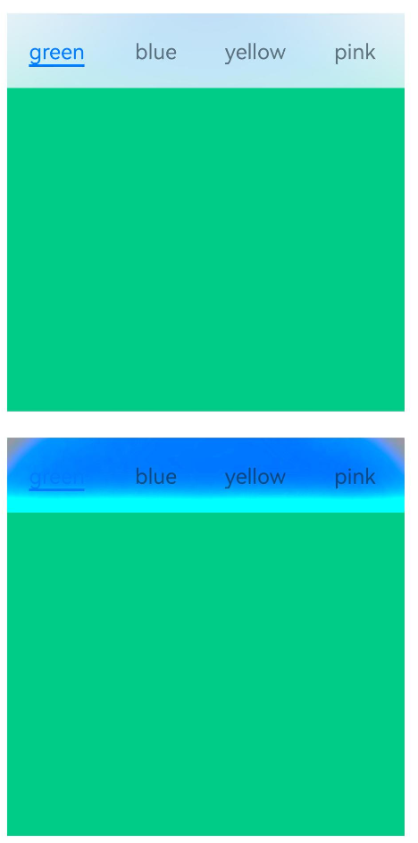

### Example 20: Setting the Edge Sliding Effect

This example uses [edgeEffect](#edgeeffect12) to implement different edge rebound effects.

```ts
// xxx.ets
@Entry
@Component
struct TabsExample {
  @State edgeEffect: EdgeEffect = EdgeEffect.Spring;

  build() {
    Column() {
      Tabs() {
        TabContent() {
          Column().width('100%').height('100%').backgroundColor('#00CB87')
        }.tabBar('green')

        TabContent() {
          Column().width('100%').height('100%').backgroundColor('#007DFF')
        }.tabBar('blue')

        TabContent() {
          Column().width('100%').height('100%').backgroundColor('#FFBF00')
        }.tabBar('yellow')

        TabContent() {
          Column().width('100%').height('100%').backgroundColor('#E67C92')
        }.tabBar('pink')
      }
      .width(360)
      .height(296)
      .margin({ top: 52 })
      .backgroundColor('#F1F3F5')
      .edgeEffect(this.edgeEffect) // Set the edge sliding effect.

      Button('EdgeEffect.Spring').width('50%').margin({ top: 20 })
        .onClick(() => {
          this.edgeEffect = EdgeEffect.Spring; // Set the spring rebound effect.
        })

      Button('EdgeEffect.Fade').width('50%').margin({ top: 20 })
        .onClick(() => {
          this.edgeEffect = EdgeEffect.Fade; // Set the fade effect.
        })

      Button('EdgeEffect.None').width('50%').margin({ top: 20 })
        .onClick(() => {
          this.edgeEffect = EdgeEffect.None; // Set to no edge effect.
        })
    }.width('100%')
  }
}
```


### Example 21: Setting the Tab Switching Animation Curve

This example shows how to set the page switching animation curve of Tabs through the [animationCurve](#animationcurve20) API, and set the duration of the page switching animation in combination with **animationDuration**.

Since API version 20, the **animationCurve** API is added.

```ts
import { curves } from '@kit.ArkUI';

interface TabsItemType {
  text: string,
  backgroundColor: ResourceColor
}

@Entry
@Component
struct TabsExample {
  private tabsController: TabsController = new TabsController();
  private curves: (Curve | ICurve) [] = [
    curves.interpolatingSpring(-1, 1, 328, 34),
    curves.springCurve(10, 1, 228, 30),
    curves.cubicBezierCurve(0.25, 0.1, 0.25, 1.0),
  ];
  private curveNames: string[] = [
    'interpolatingSpring(-1, 1, 328, 34)',
    'springCurve(10, 1, 228, 30)',
    'cubicBezierCurve(0.25, 0.1, 0.25, 1.0)'
  ];
  @State curveIndex: number = 0;
  private data: TabsItemType[] = [
    { text: '1', backgroundColor: '#004AAF' },
    { text: '2', backgroundColor: '#2787D9' },
    { text: '3', backgroundColor: '#D5D5D5' },
    { text: '4', backgroundColor: '#707070' },
    { text: '5', backgroundColor: '#F7F7F7' },
  ];
  @State duration: number = 0;

  build() {
    Column({ space: 2 }) {
      Tabs({ controller: this.tabsController }) {
        ForEach(this.data, (item: TabsItemType, index: number) => {
          TabContent() {
          }
          .tabBar(item.text)
          .backgroundColor(item.backgroundColor)
        })
      }
      .backgroundColor(0xf1f3f5)
      .width('100%')
      .height(500)
      .animationCurve(this.curves[this.curveIndex]) // Set the page switching animation curve.
      .animationDuration(this.duration) // Set the page switching animation duration.

      Column({ space: 2 }) {
        Text('Curve:' + this.curveNames[this.curveIndex])
        Row({ space: 2 }) {
          // Switching animation curve.
          Button('++').onClick(() => {
            this.curveIndex = (this.curveIndex + 1) % this.curves.length;
          })
          Button('reset').onClick(() => {
            this.curveIndex = 0;
          })
        }
      }
      .margin({ left: '10vp' })
      .width('100%')

      Row({ space: 2 }) {
        Text('Duration:' + this.duration)
        // Increase the animation duration.
        Button('+100').onClick(() => {
          this.duration = (this.duration + 100) % 10000;
        })
        Button('+1000').onClick(() => {
          this.duration = (this.duration + 1000) % 10000;
        })
        Button('reset').onClick(() => {
          this.duration = 0;
        })
      }
      .margin({ left: '10vp' })
      .width('100%')
    }
    .margin('10vp')
  }
}
```

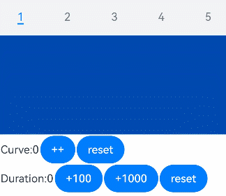

### Example 22: Listening for Swipe Events on the Tabs Page

This example shows how to set a callback for Tabs swiping through the [onContentDidScroll](#oncontentdidscroll23) API.

Since API version 23, the **onContentDidScroll** API is added.

```ts
// xxx.ets
@Entry
@Component
struct TabsDidScrollExample {
  @State fontColor: string = '#182431';
  @State selectedFontColor: string = '#007DFF';
  @State currentIndex: number = 0;
  @State selectedIndex: number = 0;
  @State didScrollStr: string = '';
  private controller: TabsController = new TabsController();

  @Builder
  tabBuilder(index: number, name: string) {
    Column() {
      Text(name)
        .fontColor(this.selectedIndex === index ? this.selectedFontColor : this.fontColor)
        .fontSize(16)
        .fontWeight(this.selectedIndex === index ? 500 : 400)
        .lineHeight(22)
        .margin({ top: 17, bottom: 7 })
      Divider()
        .strokeWidth(2)
        .color('#007DFF')
        .opacity(this.selectedIndex === index ? 1 : 0)
    }.width('100%')
  }

  build() {
    Column() {
      Text('Swipe page to trigger callback')
        .width("80%")
        .fontSize(20)
        .margin(5)
        .textAlign(TextAlign.Center)

      Text(this.didScrollStr)
        .width("80%")
        .fontSize(20)
        .margin(5)
        .textAlign(TextAlign.Center)

      Tabs({ barPosition: BarPosition.Start, index: this.currentIndex, controller: this.controller }) {
        TabContent() {
          Column().width('100%').height('100%').backgroundColor('#00CB87')
        }.tabBar(this.tabBuilder(0, 'green'))

        TabContent() {
          Column().width('100%').height('100%').backgroundColor('#007DFF')
        }.tabBar(this.tabBuilder(1, 'blue'))

        TabContent() {
          Column().width('100%').height('100%').backgroundColor('#FFBF00')
        }.tabBar(this.tabBuilder(2, 'yellow'))

        TabContent() {
          Column().width('100%').height('100%').backgroundColor('#E67C92')
        }.tabBar(this.tabBuilder(3, 'pink'))
      }
      .vertical(false)
      .barMode(BarMode.Fixed)
      .barWidth(360)
      .barHeight(56)
      .animationDuration(400)
      .onChange((index: number) => {
        // Control the tab displayed in TabContent through currentIndex.
        this.currentIndex = index;
        this.selectedIndex = index;
      })
      .onAnimationStart((index: number, targetIndex: number, event: TabsAnimationEvent) => {
        if (index === targetIndex) {
          return;
        }
        // Control the Text color switching in the custom tab bar through selectedIndex.
        this.selectedIndex = targetIndex;
      })
      .width(360)
      .height(296)
      .margin({ top: 15 })
      .backgroundColor('#F1F3F5')
      .onContentDidScroll((selectedIndex: number, index: number, position: number, mainAxisLength: number) => {
        // Listen for the Tabs page sliding event. In this callback, you can implement custom navigation dot switching animations and more.
        console.info("onContentDidScroll selectedIndex: " + selectedIndex + ", index: " + index + ", position: " +
          position + ", mainAxisLength: " + mainAxisLength);
        this.didScrollStr =
          "onContentDidScroll selectedIndex: " + selectedIndex + ", index: " + index + ", position: " +
            position + ", mainAxisLength: " + mainAxisLength
      })
    }.width('100%')
  }
}
```

<!--Del--> <!--DelEnd-->

### Example 23: Implementing Nested Scrolling of Tabs

This example shows how to set the nested scrolling effect of **Tabs** through the [nestedScroll](#nestedscroll24) API.

Since API version 24, the **nestedScroll** API is added.

```ts
// xxx.ets
@Entry
@Component
struct TabsExample {
  @State text: string = 'Text';
  @State barMode: BarMode = BarMode.Fixed;
  build() {
    Column() {
      Row() {

        Tabs() {
          TabContent() {
            Tabs() {
              TabContent() {
                Column().width('100%').height('100%').backgroundColor(Color.Blue)
              }.tabBar(SubTabBarStyle.of('Subpage a'))

              TabContent() {
                Column().width('100%').height('100%').backgroundColor(Color.Green)
              }.tabBar(SubTabBarStyle.of('Subpage b'))

              TabContent() {
                Column().width('100%').height('100%').backgroundColor(Color.Pink)
              }.tabBar(SubTabBarStyle.of('Subpage c'))
            }
            .nestedScroll(TabsNestedScrollMode.SELF_FIRST) // Set Tabs to scroll first, and the parent component scrolls after Tabs reaches the edge.
          }.tabBar(SubTabBarStyle.of('Homepage 1'))


          TabContent() {
            Tabs() {
              TabContent() {
                Column().width('100%').height('100%').backgroundColor(Color.Blue)
              }.tabBar(SubTabBarStyle.of('Subpage d'))

              TabContent() {
                Column().width('100%').height('100%').backgroundColor(Color.Green)
              }.tabBar(SubTabBarStyle.of('Subpage e'))

              TabContent() {
                Column().width('100%').height('100%').backgroundColor(Color.Pink)
              }.tabBar(SubTabBarStyle.of('Subpage f'))
            }
            .nestedScroll(TabsNestedScrollMode.SELF_FIRST)
          }.tabBar(SubTabBarStyle.of('Homepage 2'))

        }
        .height('100%')
        .backgroundColor(0xf1f3f5)
        .barMode(this.barMode)
      }
      .width('100%')
      .height('100%')
      .padding('24vp')
    }
  }
}
```

<!--Del--> <!--DelEnd-->

### Example 24 Setting the TabBar Floating Style

This example shows how to set the floating style and immersive material of the back panel for the tab bar through the [barFloatingStyle](#barfloatingstyle) API.

Since API version 26.0.0, the **barFloatingStyle** API is added.

```ts
// xxx.ets
import { uiMaterial } from '@kit.ArkUI';
@Entry
@Component
struct TabsFloatingStyleExample {
  build() {
    Column() {
      Tabs({ barPosition: BarPosition.End }) {
        TabContent() {
          Column().width('100%').height('100%').backgroundColor(Color.Blue)
        }.tabBar('Blue')

        TabContent() {
          Column().width('100%').height('100%').backgroundColor(Color.Green)
        }.tabBar('Green')

        TabContent() {
          Column().width('100%').height('100%').backgroundColor(Color.Orange)
        }.tabBar('Orange')

        TabContent() {
          Column().width('100%').height('100%').backgroundColor(Color.Pink)
        }.tabBar('Pink')
      }
      .barFloatingStyle({
        adaptToHandedness: true, systemMaterial: new uiMaterial.ImmersiveMaterial(
          {
            style: uiMaterial.ImmersiveStyle.ULTRA_THIN,
            applyShadow: true,
            interactive: true,
            lightEffect: { color: Color.White }
          }
        )
      })
      .barOverlap(true)
      .height('100%')
    }
    .width('100%')
    .height('100%')
  }
}
```

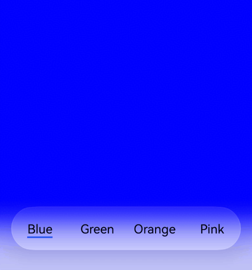