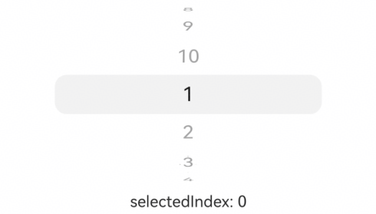

# UIPickerComponent
<!--Kit: ArkUI-->
<!--Subsystem: ArkUI-->
<!--Owner: @luoying_ace_admin-->
<!--Designer: @weixin_52725220-->
<!--Tester: @xiong0104-->
<!--Adviser: @Brilliantry_Rui-->

The **UIPickerComponent** container is a component used to implement user selection operations. It supports single selection from a limited set of options and can be applied to various scenarios such as time selection, date selection, region selection, and status selection. The UIPickerComponent container is displayed in a 3D scroll wheel style. The options can be customized as required, including text, image, and image-text combination.

>  **NOTE**
>
> - This component is supported since API version 22. Updates will be marked with a superscript to indicate their earliest API version.
>
> - The height of each option row in the UIPickerComponent container is fixed at 40 vp, and a maximum of seven options can be displayed. Due to the three-dimensional wheel display effect, options other than the selected one will be rotated at different angles, so the actual visible height will be less than 40 vp.
>
> - You are advised to set the [height](./ts-universal-attributes-size.md#height) of the UIPickerComponent container to 200 vp. When the set height is greater than or equal to this recommended value, all 7 options can be fully displayed. Otherwise, the display area will be cropped from the top and bottom edges towards the center, and the number of displayed options will be reduced accordingly, always keeping the selected item vertically centered.
>
> - If the [width](./ts-universal-attributes-size.md#width) is not set for the UIPickerComponent container, the maximum width of visible child components in the current view is used as the container width. You are advised to set the width of the UIPickerComponent container or set the same width for each child component to prevent the container width from dynamically changing during sliding, which affects the display effect.
>
> - The alignment mode of child components in the UIPickerComponent container is fixed to center alignment. The alignment mode of child components cannot be changed using the [align](ts-universal-attributes-location.md#align) attribute.
>
> - The UIPickerComponent container is not supported on smart watches.

## Child Components

- Multiple child components are supported.

- Supported child component types: [Text](./ts-basic-components-text.md), [Image](./ts-basic-components-image.md), [Row](./ts-container-row.md), and [SymbolGlyph](./ts-basic-components-symbolGlyph.md)

- Supported rendering control types: [if/else](../../../ui/rendering-control/arkts-rendering-control-ifelse.md) and [ForEach](../../../ui/rendering-control/arkts-rendering-control-foreach.md)

>  **NOTE**
>
> - When the Row **container** is used as a child component, the **Row** container can contain only the **Text**, **Image**, and **SymbolGlyph** basic components. Including other container components may affect the display effect or cause sliding functionality abnormalities.
>
> - When counting the number of child components, the **Row** container and its child components are counted as one child component.
>
> - When the child component is **Text**, **Image**, or **SymbolGlyph**, the [height](./ts-universal-attributes-size.md#height) attribute does not take effect and is fixed at 40 vp.
>
> - When the child component is a **Row** container, its [height](./ts-universal-attributes-size.md#height) attribute does not take effect and is fixed at 40 vp. The [height](./ts-universal-attributes-size.md#height) attribute of the child components in the **Row** container takes effect. The final display effect is determined by the **Row** container.
>
> - The text-image combination option requires that the **Row** container contain the **Text** and **Image** components. When using the text-image combination option, you are advised to set the image's [height](./ts-universal-attributes-size.md#height) to 40 vp or below to avoid cropping when images are large.
>
> - The default value of the fontSize attribute of all text components (including the text components in the Row container) in the UIPickerComponent container is 20 fp. User settings will override the default value, and abnormal values will be processed according to the result of handling the text component's [fontSize](./ts-basic-components-text.md#fontsize). You are advised to set the **fontSize** attribute to a unified value or not to set it to ensure a good display effect.


## APIs

UIPickerComponent(options?: UIPickerComponentOptions)

Creates a UIPickerComponent container. The selected item is determined by the value of the selectedIndex attribute in the options parameter.

**Atomic service API**: This API can be used in atomic services since API version 22.

**System capability**: SystemCapability.ArkUI.ArkUI.Full

**Parameters**

| Name| Type| Mandatory| Description|
| -------- | -------- | -------- | -------- |
| options |  [UIPickerComponentOptions](#uipickercomponentoptions)| No| Parameters for configuring the UIPickerComponent container.|

<<<<<<< HEAD
## UIPickerComponentOptions
=======
## UIPickerComponentOptions
>>>>>>> 6e07bcad5bb04fc29f35fc19750850cb8c1611b3

Parameters of the UIPickerComponent container.

**Atomic service API**: This API can be used in atomic services since API version 22.

**System capability**: SystemCapability.ArkUI.ArkUI.Full

| Name| Type| Read-Only| Optional| Description|
| -------- | -------- | -------- | -------- | -------- |
| selectedIndex | number | No| Yes| Index of the selected item.<br>Value range: an integer in the range of [0, Number of child components – 1]. If the value is not within the value range, the default value is used. If a decimal number is set, the integer part after rounding down is used.<br>Default value: **0**<br>**NOTE**<br>When counting the number of child components, the **Row** container and its child components are counted as one child component.|

## Attributes

In addition to the [universal attributes](ts-component-general-attributes.md), the following attributes are supported.

### canLoop

canLoop(isLoop: Optional\<boolean>)

Sets whether the option list can loop scrolling.

**Atomic service API**: This API can be used in atomic services since API version 22.

**System capability**: SystemCapability.ArkUI.ArkUI.Full

**Parameters**

| Name| Type   | Mandatory| Description                                                        |
| ------ | ------- | ---- | ------------------------------------------------------------ |
| isLoop  | [Optional](ts-universal-attributes-custom-property.md#optionalt12)\<boolean> | Yes  | Whether loop scrolling is enabled.<br>- **true**: Loop scrolling is enabled.<br>- **false**: Loop scrolling is disabled.<br>Default value: **true**<br>If the value of **isLoop** is **undefined**, the default value is used.<br>If the number of child components is less than 8, loop scrolling will not occur regardless of whether isLoop is set to **true** or **false**.|

### enableHapticFeedback

enableHapticFeedback(enable: Optional\<boolean>)

Sets whether to enable haptic feedback.

To enable haptic feedback, you must declare the following permission under **requestPermissions** in **module** in **src/main/module.json5** of the project.
``` json
"requestPermissions": [
   {
      "name": "ohos.permission.VIBRATE",
   }
]
```

**Atomic service API**: This API can be used in atomic services since API version 22.

**System capability**: SystemCapability.ArkUI.ArkUI.Full

**Parameters**

| Name| Type                                         | Mandatory | Description                                                                                 |
| ------ | --------------------------------------------- |-----|-------------------------------------------------------------------------------------|
| enable  | [Optional](ts-universal-attributes-custom-property.md#optionalt12)\<boolean> | Yes  | Whether to enable haptic feedback.<br>- **true**: Enable haptic feedback.<br>- **false**: Disable haptic feedback.<br>Default value: **true**<br>If the value of **enable** is **undefined**, the default value is used.<br>After this function is enabled, whether haptic feedback is available depends on the hardware support of the system.|

### selectionIndicator

selectionIndicator(style: Optional\<PickerIndicatorStyle>)

Sets the style of the selected item indicator.

**Atomic service API**: This API can be used in atomic services since API version 22.

**System capability**: SystemCapability.ArkUI.ArkUI.Full

**Parameters**

| Name| Type                                                        | Mandatory| Description                                                        |
| ------ | ------------------------------------------------------------ | ---- | ------------------------------------------------------------ |
| style  | [Optional](ts-universal-attributes-custom-property.md#optionalt12)\<[PickerIndicatorStyle](ts-container-ui-picker-component.md#pickerindicatorstyle)> | Yes  | Style of the selected item indicator.<br>Default value:<br>{<br>type: PickerIndicatorType.BACKGROUND,<br>borderRadius: {<br>value:12,<br>unit:LengthUnit.vp<br>},<br>backgroundColor: 'sys.color.comp_background_tertiary'<br>}<br>If the value of **style** is **undefined**, the default value is used.|

## Events

In addition to the [universal events](ts-component-general-events.md), the following events are supported.

### onChange

onChange(callback: Optional\<OnUIPickerComponentCallback>)

Triggered when the selected item changes.

>  **NOTE**
> 
> If more than half of an option's area enters the selected item area, the option becomes the selected item.
> 
> The selected item area can be identified by setting [selectionIndicator](#selectionindicator). If the selected item indicator is set to the background, the background area is the selected item area. If the selected item indicator is set to the divider, the area between the center lines of the upper and lower dividers is the selected item area.

**Atomic service API**: This API can be used in atomic services since API version 22.

**System capability**: SystemCapability.ArkUI.ArkUI.Full

**Parameters**

| Name| Type                                      | Mandatory| Description                                             |
| ------ | ------------------------------------------ | ---- | ------------------------------------------------- |
| callback  | [Optional](ts-universal-attributes-custom-property.md#optionalt12)\<[OnUIPickerComponentCallback](#onuipickercomponentcallback)> | Yes  | Callback triggered when the selected item changes.<br>If **callback** is set to **undefined**, the callback is not used.|

### onScrollStop

onScrollStop(callback: Optional\<OnUIPickerComponentCallback>)

Triggered when the picker scrolling stops. The picker scrolling stops when the sliding animation triggered by an action is complete. If a new sliding animation is triggered before the previous one finishes, it does not count as scrolling stop.

**Atomic service API**: This API can be used in atomic services since API version 22.

**System capability**: SystemCapability.ArkUI.ArkUI.Full

**Parameters**

| Name| Type                                      | Mandatory| Description                                             |
| ------ | ------------------------------------------ | ---- | ------------------------------------------------- |
| callback | [Optional](ts-universal-attributes-custom-property.md#optionalt12)\<[OnUIPickerComponentCallback](#onuipickercomponentcallback)> | Yes  | Callback triggered when the picker scrolling stops.<br>If **callback** is set to **undefined**, the callback is not used.|

## PickerIndicatorStyle

Sets parameters of the selected item indicator style.

**Atomic service API**: This API can be used in atomic services since API version 22.

**System capability**: SystemCapability.ArkUI.ArkUI.Full

| Name | Type  | Read-Only| Optional| Description                                      |
| ----- | ------ | ---- | ---- | ------------------------------------------ |
| type  | [PickerIndicatorType](#pickerindicatortype)| No  | No  | Type of the selected item indicator.<br>Default value: **PickerIndicatorType.BACKGROUND**<br>If the value of **type** is a decimal number, the integer after rounding down is used. If the value of **type** is not within the value range of **PickerIndicatorType**, the default value is used.|
| strokeWidth |  [LengthMetrics](../js-apis-arkui-graphics.md#lengthmetrics12)      | No  | Yes  | Stroke width of the divider.<br>Default value: **2.0px**.<br>Unit: same as that of **LengthMetrics**<br>Value range: [0, half the height of the selected item (that is, 20 vp)]. If the value of **strokeWidth** is less than 0 or greater than half the height of the selected item, the default value is used. Percentages are not supported.<br>**NOTE**<br>1. This parameter takes effect only when **type** is set to **PickerIndicatorType.DIVIDER**.<br>2. If this parameter is set in **LengthMetrics.resource** mode, the value of a non-length attribute will be treated as 0 vp. |
| dividerColor       | [ResourceColor](ts-types.md#resourcecolor) | No  | Yes  | Color of the divider.<br>Default value: 'sys.color.comp_divider'<br>**NOTE**<br>This parameter takes effect only when **type** is set to **PickerIndicatorType.DIVIDER**.|
| startMargin |  [LengthMetrics](../js-apis-arkui-graphics.md#lengthmetrics12)       | No  | Yes  | Distance between the divider and the start end of the UIPickerComponent container.<br>Default value: **0**<br>Unit: same as that of **LengthMetrics**<br>Value range: The sum of startMargin and endMargin cannot exceed the width of the UIPickerComponent container. If the value is less than 0 or the sum of startMargin and endMargin exceeds the width of the UIPickerComponent container, the default value is used. Percentages are not supported.<br>**NOTE**<br>This parameter takes effect only when **type** is set to **PickerIndicatorType.DIVIDER**.|
| endMargin   |  [LengthMetrics](../js-apis-arkui-graphics.md#lengthmetrics12)        | No  | Yes  | Distance between the divider and the end of the UIPickerComponent container.<br>Default value: **0**<br>Unit: same as that of **LengthMetrics**<br>Value range: The sum of startMargin and endMargin cannot exceed the width of the UIPickerComponent container. If the value is less than 0 or the sum of startMargin and endMargin exceeds the width of the UIPickerComponent container, the default value is used. Percentages are not supported.<br>**NOTE**<br>This parameter takes effect only when **type** is set to **PickerIndicatorType.DIVIDER**.|
| backgroundColor  | [ResourceColor](ts-types.md#resourcecolor) | No | Yes | Background color of the selected item.<br>Default value: **'sys.color.comp_background_tertiary'**<br>**NOTE**<br>This parameter takes effect only when **type** is set to **PickerIndicatorType.BACKGROUND**.  |
| borderRadius  | [LengthMetrics](../js-apis-arkui-graphics.md#lengthmetrics12) &nbsp;\|&nbsp; [BorderRadiuses](ts-types.md#borderradiuses9) &nbsp;\|&nbsp; [LocalizedBorderRadiuses](ts-types.md#localizedborderradiuses12) | No | Yes | Background border radius of the selected item.<br>Default value: **{ value:12, unit:LengthUnit.vp }**, meaning 12 vp for all corners<br>Value range: no more than half of the smaller value between the width and height of the selected item. If the value is less than 0, the default value is used. If the value is greater than the maximum value, the maximum value is used.<br>**NOTE**<br>1. This parameter takes effect only when **type** is set to **PickerIndicatorType.BACKGROUND**.<br>2. [LengthMetrics](../js-apis-arkui-graphics.md#lengthmetrics12): Sets the size and unit of the four corner radii in a unified manner.<br>3. [BorderRadiuses](ts-types.md#borderradiuses9): Sets the size (unit: vp) of the four corner radii individually.<br>4. [LocalizedBorderRadiuses](ts-types.md#localizedborderradiuses12): Sets the size and unit of the four corner radii individually.|

## PickerIndicatorType

Enumerates the types of the selected item indicator.

**Atomic service API**: This API can be used in atomic services since API version 22.

**System capability**: SystemCapability.ArkUI.ArkUI.Full

| Name| Value| Description|
| -------- | - |-------- |
| BACKGROUND | 0 | Identifies the selected item by adding a background to it.|
| DIVIDER | 1 | Identifies the selected item by adding dividers above and below its edges.|

## OnUIPickerComponentCallback

type OnUIPickerComponentCallback = (selectedIndex: number) => void

Defines the callback types for the [onChange](#onchange) and [onScrollStop](#onscrollstop) events.

**Atomic service API**: This API can be used in atomic services since API version 22.

**System capability**: SystemCapability.ArkUI.ArkUI.Full

**Parameters**

| Name    | Type                                      | Mandatory| Description                                                        |
| ---------- | ------------------------------------------ | ---- | ------------------------------------------------------------ |
| selectedIndex | number | Yes  | Index of the selected item.<br>Value range: an integer in the range of [0, Number of child components – 1].|

## Example

### Example 1: Switching Loop Scrolling and Enabling/Disabling Haptic Feedback

Since API version 22, this example shows how to switch between cyclic scrolling and enabling/disabling touch feedback of the UIPickerComponent container by tapping a button.

```ts
// xxx.ets
@Entry
@Component
struct UIPickerComponentAttrsExample {
  private dataArray: string[] = [];
  @State loop: boolean = true;
  @State hapticFeedback: boolean = true;

  aboutToAppear(): void {
    // Construct options.
    for (let i = 1; i <= 10; i++) {
      this.dataArray.push(i.toString())
    }
  }

  build() {
    Column() {
      Row() {
        UIPickerComponent() {
          ForEach(this.dataArray, (item: string) => {
            Text(item)
          })
        }
        // Loop the option list looping.
        .canLoop(this.loop)
        // Configure haptic feedback.
        .enableHapticFeedback(this.hapticFeedback)
        .width('70%')
      }

      Column() {
        Row() {
          Toggle({ type: ToggleType.Switch, isOn: true })
            .onChange((isOn: boolean) => {
              this.loop = isOn;
            })
          Text('canLoop').fontSize(20)
        }
        .width('70%')

        Row() {
          Toggle({ type: ToggleType.Switch, isOn: true })
            .onChange((isOn: boolean) => {
              this.hapticFeedback = isOn;
            })
          Text('enableHapticFeedback').fontSize(20)
        }
        .width('70%')
      }

    }
    .width('100%')
  }
}
```


### Example 2: Setting Event Callbacks

In API version 22 and later versions, this example implements the onChange and onScrollStop event callbacks of the UIPickerComponent container based on the status selection.

```ts
// xxx.ets
@Entry
@Component
struct UIPickerComponentEventsExample {
  // Construct status options.
  private dataArray: string[] = ['To-do', 'In progress', 'Completed'];
  @State onChangeDesc: string = '';
  @State onScrollStopDesc: string = '';

  build() {
    Column() {
      Row() {
        UIPickerComponent() {
          ForEach(this.dataArray, (item: string) => {
            Text(item)
          })
        }
        // Configure the onChange callback.
        .onChange((selectedIndex: number) => {
          this.onChangeDesc = 'on change: ' + selectedIndex
        })
        // Configure the onScrollStop callback.
        .onScrollStop((selectedIndex: number) => {
          this.onScrollStopDesc = 'on scroll stop: ' + selectedIndex
        })
        .width('70%')
      }

      Column() {
        Text(this.onChangeDesc)
        Text(this.onScrollStopDesc)
      }

    }
    .width('100%')
  }
}
```


### Example 3: Setting the Selected Item Index

From API version 22, this example shows how to set the index of the selected item in the UIPickerComponent container.

```ts
// xxx.ets
@Entry
@Component
struct UIPickerComponentSelectedIndexExample {
  private dataArray: string[] = [];
  @State selectedIndex: number = 0;

  aboutToAppear(): void {
    // Construct options.
    for (let i = 1; i <= 10; i++) {
      this.dataArray.push(i.toString())
    }
  }

  build() {
    Column() {
      Row() {
        UIPickerComponent({
          // Configure the index of the selected item.
          selectedIndex: this.selectedIndex
        }) {
          ForEach(this.dataArray, (item: string) => {
            Text(item)
          })
        }
        .onChange((selectedIndex: number) => {
          this.selectedIndex = selectedIndex
        })
        .onScrollStop((selectedIndex: number) => {
          this.selectedIndex = selectedIndex
        })
        .width('70%')
      }

      Column() {
        Text('selectedIndex: ' + this.selectedIndex)
      }

    }
    .width('100%')
  }
}
```



### Example 4: Setting the Selected Item Indicator

From API version 22, this example shows how to set the indicator of the selected item in the UIPickerComponent container. Scenarios include the following: When using a background indicator, set the background color and background corner radius. When using a divider indicator, set the divider color, divider width, start side margin, end side margin.

```ts
// xxx.ets
import { LengthMetrics } from '@kit.ArkUI';

@Entry
@Component
struct UIPickerComponentIndicatorExample {
  private dataArray: string[] = [];
  @State indicatorType: PickerIndicatorType | undefined = undefined;
  @State bgColor: Color | undefined = undefined;
  @State dividerColor: Color | undefined = undefined;
  @State strokeWidth: LengthMetrics = LengthMetrics.px(2);
  @State startMargin: LengthMetrics = LengthMetrics.px(2);
  @State endMargin: LengthMetrics = LengthMetrics.px(2);
  @State selectIndicator: PickerIndicatorStyle | undefined = undefined;
  @State bgBorderRadius: LengthMetrics | BorderRadiuses | LocalizedBorderRadiuses | undefined = undefined
  bgBorderRadiuses1: LengthMetrics = LengthMetrics.vp(10)
  bgBorderRadiuses2: BorderRadiuses = {
    topLeft: 10,
    bottomLeft: 0,
    topRight: 10,
    bottomRight: 0,
  }
  bgBorderRadiuses3: LocalizedBorderRadiuses = {
    topStart: LengthMetrics.vp(0),
    bottomStart: LengthMetrics.vp(10),
    topEnd: LengthMetrics.vp(0),
    bottomEnd: LengthMetrics.vp(10)
  }
  private controller: TabsController = new TabsController();
  @State curTabIndex: number = 0;

  @Builder
  dividerBuilder() {
    Column() {
      Row() {
        Text ('Divider Stroke Width')
      }.margin(2)

      Row() {
        Button('0')
          .onClick(() => {
            this.strokeWidth = LengthMetrics.px(0)
          })
          .fontSize(12)
          .height(30)
          .width(100)
          .margin(2)
        Button('10px')
          .onClick(() => {
            this.strokeWidth = LengthMetrics.px(10)
          })
          .fontSize(12)
          .height(30)
          .width(100)
          .margin(2)
        Button('10vp')
          .onClick(() => {
            this.strokeWidth = LengthMetrics.vp(10)
          })
          .fontSize(12)
          .height(30)
          .width(100)
          .margin(2)
      }

      Row() {
        Text ('Start Side Margin')
      }.margin(2)

      Row() {
        Button('0')
          .onClick(() => {
            this.startMargin = LengthMetrics.px(0)
          })
          .fontSize(12)
          .height(30)
          .width(100)
          .margin(2)
        Button('10px')
          .onClick(() => {
            this.startMargin = LengthMetrics.px(10)
          })
          .fontSize(12)
          .height(30)
          .width(100)
          .margin(2)
        Button('10vp')
          .onClick(() => {
            this.startMargin = LengthMetrics.vp(10)
          })
          .fontSize(12)
          .height(30)
          .width(100)
          .margin(2)
      }

      Row() {
        Text ('End Side Margin')
      }.margin(2)

      Row() {
        Button('0')
          .onClick(() => {
            this.endMargin = LengthMetrics.px(0)
          })
          .fontSize(12)
          .height(30)
          .width(100)
          .margin(2)
        Button('10px')
          .onClick(() => {
            this.endMargin = LengthMetrics.px(10)
          })
          .fontSize(12)
          .height(30)
          .width(100)
          .margin(2)
        Button('10vp')
          .onClick(() => {
            this.endMargin = LengthMetrics.vp(10)
          })
          .fontSize(12)
          .height(30)
          .width(100)
          .margin(2)
      }

      Row() {
        Text ('Divider Color')
      }

      Row() {
        Button ('Blue')
          .onClick(() => {
            this.dividerColor = Color.Blue
          })
          .fontSize(12)
          .height(30)
          .width(73)
          .margin(2)
        Button ('Black')
          .onClick(() => {
            this.dividerColor = Color.Black
          })
          .fontSize(12)
          .height(30)
          .width(73)
          .margin(2)
      }

      Row() {
        Button ('Ignore Custom Settings')
          .onClick(() => {
            this.dividerColor = undefined
          })
          .fontSize(12)
          .height(30)
          .width(150)
          .margin(2)
      }
    }
  }

  @Builder
  backgroundBuilder() {
    Column() {
      Row() {
        Text ('Corner Radius Settings')
      }.margin(2)

      Column() {
        Button ('Use LengthMetrics to Implement Unified Corner Radius')
          .onClick(() => {
            this.bgBorderRadius = this.bgBorderRadiuses1
          })
          .fontSize(12)
          .height(30)
          .width(300)
          .margin(2)
        Button ('Use BorderRadiuses to Achieve Top Rounded, Bottom Square')
          .onClick(() => {
            this.bgBorderRadius = this.bgBorderRadiuses2
          })
          .fontSize(12)
          .height(30)
          .width(300)
          .margin(2)
        Button ('Use LocalizedBorderRadiuses to Achieve Top Square, Bottom Rounded')
          .onClick(() => {
            this.bgBorderRadius = this.bgBorderRadiuses3
          })
          .fontSize(12)
          .height(30)
          .width(300)
          .margin(2)
      }.margin(2)

      Row() {
        Text ('Background Color Settings')
      }.margin(2)

      Row() {
        Button ('Blue')
          .onClick(() => {
            this.bgColor = Color.Blue
          })
          .fontSize(12)
          .height(30)
          .width(73)
          .margin(2)
        Button ('Green')
          .onClick(() => {
            this.bgColor = Color.Green
          })
          .fontSize(12)
          .height(30)
          .width(73)
          .margin(2)
      }

      Row() {
        Button ('Ignore Custom Settings')
          .onClick(() => {
            this.bgColor = undefined
          })
          .fontSize(12)
          .height(30)
          .width(150)
          .margin(2)
      }
    }
  }

  aboutToAppear(): void {
    // Construct options.
    for (let i = 1; i <= 10; i++) {
      this.dataArray.push(i.toString())
    }
  }

  build() {
    Column() {
      Row() {
        UIPickerComponent() {
          ForEach(this.dataArray, (item: string) => {
            Text(item)
          })
        }
        // Configure the selected item indicator.
        .selectionIndicator({
          type: this.indicatorType,
          strokeWidth: this.strokeWidth,
          dividerColor: this.dividerColor,
          startMargin: this.startMargin,
          endMargin: this.endMargin,
          backgroundColor: this.bgColor,
          borderRadius: this.bgBorderRadius
        })
        .width('70%')
      }
      Tabs({ barPosition: BarPosition.Start, index: this.curTabIndex, controller: this.controller }) {
        TabContent() {
          this.backgroundBuilder()
        }.tabBar ('Background Indicator')

        TabContent() {
          this.dividerBuilder()
        }.tabBar ('Divider Indicator')
      }
      .vertical(false)
      .barMode(BarMode.Fixed)
      .barWidth(360)
      .barHeight(56)
      .animationDuration(400)
      .onChange((index: number) => {
        this.curTabIndex = index
        if (this.curTabIndex == 1) {
          this.indicatorType = PickerIndicatorType.DIVIDER
        } else {
          this.indicatorType = PickerIndicatorType.BACKGROUND
        }
      })
      .height(LayoutPolicy.wrapContent)
      .divider({ strokeWidth: 2 })
      .margin({ top: 20 })
      .backgroundColor('#F1F3F5')
    }
    .width('100%')
  }
}
```


### Example 5: Customizing the Month Picker

In API version 22 and later versions, this example uses the UIPickerComponent container to nest the text child component to implement a month selector.

```ts
// xxx.ets
@Entry
@Component
struct MonthUIPickerComponentExample {
  private fontSize: number | string | Resource = '20vp';
  private monthArray: string[] = [];

  aboutToAppear(): void {
    // Construct options.
    for (let i = 1; i <= 12; i++) {
      this.monthArray.push (i + 'Month')
    }
  }

  build() {
    Column() {
      UIPickerComponent() {
        ForEach(this.monthArray, (item: string) => {
          Text(item)
            .fontSize(this.fontSize)
            .textAlign(TextAlign.Center)
            .fontColor(Color.Black)
        })
      }
      .width('70%')
      // Loop the option list looping.
      .canLoop(true)
      // Disable haptic feedback.
      .enableHapticFeedback(false)
      // Set the indicator of the selected item to a divider.
      .selectionIndicator({ type: PickerIndicatorType.DIVIDER })
      // Subscribe to the selected item change event.
      .onChange((idx: number) => {
        console.info('UIPickerComponent item changed: ' + this.monthArray[idx])
      })
      // Subscribe to the sliding stop event.
      .onScrollStop((idx: number) => {
        console.info('UIPickerComponent scroll stopped: ' + this.monthArray[idx])
      })
    }
    .width('100%')
  }
}
```


### Example 6: Customizing the Area Picker

Starting with API version 22, this example uses a combination of multiple columns of UIPickerComponent containers to implement a locale selector.

```ts
// xxx.ets

type RegionDict = Record<string, Record<string, Array<string>>>;
// Define a region dictionary.
let regionData: RegionDict = {
  'Liaoning': {
    'Shenyang': ['Shenhe District', 'Heping District', 'Hunnan District'],
    'Dalian': ['Zhongshan District', 'Jinzhou District', 'Changhai County'],
  },
  'Jilin': {
    'Changchun': ['Nanguan District', 'Kuancheng District', 'Chaoyang District'],
    'Siping': ['Tiexi District', 'Tiedong District', 'Lishu County']
  },
  'Heilongjiang': {
    'Harbin': ['Daoli District', 'Daowai District', 'Nangang District'],
    'Daqing': ['Honggang District', Longfeng District', Datong District']
  },
};

@Entry
@Component
struct RegionUIPickerComponentExample {
  @State provinceIndex: number = 0;
  @State cityIndex: number = 0;
  @State countyIndex: number = 0;
  @State provinces: Array<string> = [];
  @State cities: Array<string> = [];
  @State counties: Array<string> = [];

  aboutToAppear(): void {
    this.provinces = Object.keys(regionData);
    this.flushCityColumn()
  }

  flushCityColumn() {
    let currentProvince = this.provinces[this.provinceIndex]
    this.cities = Object.keys(regionData[currentProvince])
    this.cityIndex = 0
    this.flushCountyColumn()
  }

  flushCountyColumn() {
    let currentProvince = this.provinces[this.provinceIndex]
    let currentCity = this.cities[this.cityIndex]
    this.counties = regionData[currentProvince][currentCity]
    this.countyIndex = 0
  }

  build() {
    Column() {
      Row() {
        // Province
        UIPickerComponent({
          selectedIndex: this.provinceIndex
        }) {
          ForEach(this.provinces, (province: string) => {
            Text(province)
          })
        }
        .onChange((selectedIndex: number) => {
          this.provinceIndex = selectedIndex
          this.flushCityColumn()

        })
        .onScrollStop((selectedIndex: number) => {
          this.provinceIndex = selectedIndex
        })
        .selectionIndicator({ type: PickerIndicatorType.DIVIDER })
        .width('25%')

        // City
        UIPickerComponent({
          selectedIndex: this.cityIndex
        }) {
          ForEach(this.cities, (city: string) => {
            Text(city)
          })
        }
        .onChange((selectedIndex: number) => {
          this.cityIndex = selectedIndex
          this.flushCountyColumn()
        })
        .onScrollStop((selectedIndex: number) => {
          this.cityIndex = selectedIndex
        })
        .selectionIndicator({ type: PickerIndicatorType.DIVIDER })
        .width('25%')

        // County
        UIPickerComponent({
          selectedIndex: this.countyIndex
        }) {
          ForEach(this.counties, (county: string) => {
            Text(county)
          })
        }
        .onChange((selectedIndex: number) => {
          this.countyIndex = selectedIndex
        })
        .onScrollStop((selectedIndex: number) => {
          this.countyIndex = selectedIndex
        })
        .selectionIndicator({ type: PickerIndicatorType.DIVIDER })
        .width('25%')
      }
    }
    .width('100%')
  }
}
```


### Example 7: Customizing Option Types

In API version 22 and later versions, the UIPickerComponent container is used to implement the selector of different option types, including the text selector, image selector, and image-text combined selector.

```ts
// xxx.ets
@Entry
@Component
struct UIPickerComponentExample {
  @State textList: string[] =
    ['text1', 'text2', 'text3', 'text4', 'text5', 'text6', 'text7', 'text8'];
  // Replace $r('sys.media.*') with the image resource file you use.
  @State imageList: Resource[] =
    [$r('sys.media.ohos_ic_normal_white_grid_audio'), $r('sys.media.ohos_ic_normal_white_grid_calendar'),
      $r('sys.media.ohos_ic_normal_white_grid_compress'), $r('sys.media.ohos_ic_normal_white_grid_doc'),
      $r('sys.media.ohos_ic_normal_white_grid_flac'), $r('sys.media.ohos_ic_normal_white_grid_folder'),
      $r('sys.media.ohos_ic_normal_white_grid_html'), $r('sys.media.ohos_ic_normal_white_grid_image')];
  // Replace the $r('sys.symbol.*') file with the image resource file you use.
  @State symbolList: Resource[] =
    [$r('sys.symbol.calendar_01'), $r('sys.symbol.calendar_02'), $r('sys.symbol.calendar_03'),
      $r('sys.symbol.calendar_04'), $r('sys.symbol.calendar_05'), $r('sys.symbol.calendar_06'),
      $r('sys.symbol.calendar_07'), $r('sys.symbol.calendar_08')];
  private controller: TabsController = new TabsController();
  @State curTabIndex: number = 0;

  @Builder
  ImagePicker() {
    Column() {
      UIPickerComponent() {
        ForEach(this.imageList, (item: Resource) => {
          Image(item)
        })
      }
      .margin(20)
      .width(200)
    }
  }

  @Builder
  TextPicker() {
    Column() {
      UIPickerComponent() {
        ForEach(this.textList, (item: string) => {
          Text(item)
        })
      }
      .margin(20)
      .width(200)
    }
  }

  @Builder
  HybridPicker() {
    Column() {
      UIPickerComponent() {
        ForEach(this.symbolList, (item: Resource, index: number) => {
          Row() {
            SymbolGlyph(item)
              .height('20vp')
            Text(this.textList[index])
          }
        })
      }
      .margin(20)
      .width(200)
    }
  }

  build() {
    Column() {
      Tabs({ barPosition: BarPosition.Start, index: this.curTabIndex, controller: this.controller }) {
        TabContent() {
          this.TextPicker()
        }.tabBar ('Text Picker')

        TabContent() {
          this.ImagePicker()
        }.tabBar ('Image Picker')

        TabContent() {
          this.HybridPicker()
        }.tabBar ('Text-Image Picker')
      }
      .vertical(true)
      .divider({ strokeWidth: 1 })
      .barMode(BarMode.Fixed)
      .barWidth(140)
      .barHeight(230)
      .height(230)
      .animationDuration(400)
    }
  }
}
```


### Example 8: Customizing the Time Picker

In API version 22 and later, this example implements a time picker with the following functions: enabling/disabling loop scrolling, showing/hiding seconds, toggling 24-hour format, displaying/hiding leading zeros, adapting to the current system language for content rendering, and adjusting the column display order based on language habits.

> **NOTE**
> - In this example, the content of each column of the time picker is displayed in the corresponding language based on the system language. For example, AM/PM is displayed in the English system.
> - In this example, the columns of the time picker are adjusted according to the system language, for example: English system displays hour/minute/second/AMPM.

To achieve text switching with system language, you need to add the text for the corresponding languages in the project's resource directory, for example:
- Chinese (default): Create the base directory in the resource directory, create the element directory in the base directory, and add the string.json file to the element directory. If the file already exists, add the following key-value pairs to the file. Do not overwrite the original file. The following shows the file content:
    ```json
    {
      "string": [
        {
          "name": "app_name",
          "value": "timePicker"
        },
        {
          "name": "am",
          "value": "AM"
        },
        {
          "name": "pm",
          "value": "PM"
        }
      ]
    }
    ```
- English: Create the **en** directory in the **resource** directory, create the **element** directory in the **en** directory, and add the **string.json** file to the **element** directory. If the file already exists, add the key-value pair in the name-value format to the file. Do not overwrite the original file. The following shows the file content:
    ```json
    {
      "string": [
        {
          "name": "app_name",
          "value": "timePicker"
        },
        {
          "name": "am",
          "value": "AM"
        },
        {
          "name": "pm",
          "value": "PM"
        }
      ]
    }
    ```
- Arabic: Create the **ar** directory in the **resource** directory, create the **element** directory in the **ar** directory, and add the **string.json** file to the **element** directory. If the file already exists, add the key-value pair in the name-value format to the file. Do not overwrite the original file. The following shows the file content:
    ```json
    {
      "string": [
        {
          "name": "app_name",
          "value": "timePicker"
        },
        {
          "name": "am",
          "value": "ص"
        },
        {
          "name": "pm",
          "value": "م"
        }
      ]
    }
    ```
- Other languages are similar.

Sample code:
```ts
// xxx.ets
import { LengthMetrics } from '@kit.ArkUI';
import { i18n, intl } from '@kit.LocalizationKit';
import { commonEventManager } from '@kit.BasicServicesKit';

@Entry
@Component
struct TimeUIPickerComponentExample {
  @State showSecond: boolean = false;
  @State useMilitary: boolean = false;
  @State zeroPrefix: boolean = true;
  @State loop: boolean = true;
  @State amPmAtLast: boolean = false
  @State isRtl: boolean = false;

  startBorderStyle: LocalizedBorderRadiuses = {
    topStart: LengthMetrics.px(40),
    bottomStart: LengthMetrics.px(40),
    topEnd: LengthMetrics.px(0),
    bottomEnd: LengthMetrics.px(0)
  }
  centerBorderStyle: LengthMetrics = LengthMetrics.px(0)
  endBorderStyle: LocalizedBorderRadiuses = {
    topStart: LengthMetrics.px(0),
    bottomStart: LengthMetrics.px(0),
    topEnd: LengthMetrics.px(40),
    bottomEnd: LengthMetrics.px(40)
  }
  @State amPmBorder: LengthMetrics | LocalizedBorderRadiuses = this.startBorderStyle;
  @State hourBorder: LengthMetrics | LocalizedBorderRadiuses = this.startBorderStyle;
  @State minBorder: LengthMetrics | LocalizedBorderRadiuses = this.endBorderStyle;
  @State secBorder: LengthMetrics | LocalizedBorderRadiuses = this.endBorderStyle;

  @State amPmIndex: number = 0;
  @State hourIndex: number = 0;
  @State minIndex: number = 0;
  @State secIndex: number = 0;

  @State amPmArr: Array<string| undefined> = []
  @State hourArr: Array<string> = []
  @State minSecArr: Array<string> = []

  @State currentTime: string = '';

  sysLanguageChanged: boolean = false
  zero: string = '0'
  systemLanguage: string = i18n.System.getSystemLanguage();
  // Create a NumberFormat object using the current system locale ID.
  formatter: intl.NumberFormat = new intl.NumberFormat();

  aboutToAppear(): void {
    this.zero = this.formatter.format(0)
    this.flushAmPmColumn()
    this.flushHourColumn()
    this.flushMinSecColumn()
    this.flushCurrentTime()
    this.flushBorderStyle()
    let subscriber: commonEventManager.CommonEventSubscriber;
    let subscribeInfo: commonEventManager.CommonEventSubscribeInfo = {
      events: [commonEventManager.Support.COMMON_EVENT_LOCALE_CHANGED]
    };
    // Create a subscriber to listen for the system language changes.
    commonEventManager.createSubscriber(subscribeInfo)
      .then((commonEventSubscriber: commonEventManager.CommonEventSubscriber) => {
        console.info("CreateSubscriber");
        subscriber = commonEventSubscriber;
        commonEventManager.subscribe(subscriber, (err, data) => {
          if (err) {
            console.error(`Failed to subscribe common event. error code: ${err.code}, message: ${err.message}.`);
            return;
          }
          this.formatter = new intl.NumberFormat();
          this.zero = this.formatter.format(0)
          this.sysLanguageChanged = true
          this.systemLanguage = i18n.System.getSystemLanguage();
          this.flushAmPmColumn()
          this.flushHourColumn()
          this.flushMinSecColumn()
          this.flushCurrentTime()
          this.flushBorderStyle()
        })
      })
      .catch((err: BusinessError) => {
        console.error(`CreateSubscriber failed, code is ${err.code}, message is ${err.message}`);
      });
  }

  onPageShow(): void {
    if (this.sysLanguageChanged) {
      this.flushAmPmColumn()
      this.flushCurrentTime()
      this.flushBorderStyle()
      this.sysLanguageChanged = false
    }
  }

  buildColumnOptions(start: number, end: number, isHour: boolean = false) : string[] {
    let newOptions: string[] = []
    for (let i = start; i <= end; i++) {
      if (isHour && i == 0 && !this.useMilitary) {
        newOptions.push(this.formatter.format(12))
        continue
      }
      if (this.zeroPrefix) {
        newOptions.push(this.formatTime(i))
      } else {
        newOptions.push(this.formatter.format(i))
      }
    }
    return newOptions
  }

  flushAmPmColumn() {
    // Set whether to display the amPm column at the end based on linguistic habits.
    if (this.systemLanguage.startsWith('en') || this.systemLanguage == 'ug') {
      this.amPmAtLast = true
    } else {
      this.amPmAtLast = false
    }
    this.amPmArr[0] = this.getUIContext().getHostContext()?.resourceManager.getStringSync($r('app.string.am').id)
    this.amPmArr[1] = this.getUIContext().getHostContext()?.resourceManager.getStringSync($r('app.string.pm').id)
  }

  flushHourColumn() {
    if (this.useMilitary) {
      this.hourArr = this.buildColumnOptions(0, 23)
    } else {
      this.hourArr = this.buildColumnOptions(0, 11, true)
    }
  }

  flushMinSecColumn() {
    this.minSecArr = this.buildColumnOptions(0, 59)
  }

  flushBorderStyle() {
    let realStartBorder = this.startBorderStyle
    let realEndBorder = this.endBorderStyle
    // Set the time sequence of the RTL language based on linguistic habits.
    if (this.systemLanguage == 'ar' || this.systemLanguage == 'ug') {
      this.isRtl = true
      realStartBorder = this.endBorderStyle
      realEndBorder = this.startBorderStyle
    } else {
      this.isRtl = false
    }
    if (!this.useMilitary) {
      if (this.amPmAtLast) {
        this.amPmBorder = realEndBorder
        this.hourBorder = realStartBorder
        this.minBorder = this.centerBorderStyle
        this.secBorder = this.centerBorderStyle
      } else {
        this.amPmBorder = realStartBorder
        this.hourBorder = this.centerBorderStyle
        if (this.showSecond) {
          this.minBorder = this.centerBorderStyle
        } else {
          this.minBorder = realEndBorder
        }
        this.secBorder = realEndBorder
      }
    } else {
      this.hourBorder = realStartBorder
      if (this.showSecond) {
        this.minBorder = this.centerBorderStyle
      } else {
        this.minBorder = realEndBorder
      }
      this.secBorder = realEndBorder
    }
  }

  formatTime(time: number): string {
    if (time < 10) {
      return this.zero + this.formatter.format(time)
    }
    return this.formatter.format(time)
  }

  @Builder
  buildAmPmColumn() {
    UIPickerComponent({ selectedIndex: this.amPmIndex }) {
      ForEach(this.amPmArr, (amPm: string) => {
        Text(amPm)
      })
    }
    .width('200px')
    .canLoop(this.loop)
    .selectionIndicator({
      type: PickerIndicatorType.BACKGROUND,
      borderRadius: this.amPmBorder
    })
    .onChange((selectedIndex: number) => {
      this.amPmIndex = selectedIndex
      this.flushCurrentTime()
    })
    .onScrollStop((selectedIndex: number) => {
      this.amPmIndex = selectedIndex
      this.flushCurrentTime()
    })
  }

  @Builder
  buildHourColumn() {
    UIPickerComponent({ selectedIndex: this.hourIndex }) {
      ForEach(this.hourArr, (hour: string) => {
        Text(hour)
      })
    }
    .width('200px')
    .canLoop(this.loop)
    .selectionIndicator({
      type: PickerIndicatorType.BACKGROUND,
      borderRadius: this.hourBorder
    })
    .onChange((selectedIndex: number) => {
      this.hourIndex = selectedIndex
      this.flushCurrentTime()
    })
    .onScrollStop((selectedIndex: number) => {
      this.hourIndex = selectedIndex
      this.flushCurrentTime()
    })
  }

  @Builder
  buildMinColumn() {
    UIPickerComponent({ selectedIndex: this.minIndex }) {
      ForEach(this.minSecArr, (min: string) => {
        Text(min)
      })
    }
    .width('200px')
    .canLoop(this.loop)
    .selectionIndicator({
      type: PickerIndicatorType.BACKGROUND,
      borderRadius: this.minBorder
    })
    .onChange((selectedIndex: number) => {
      this.minIndex = selectedIndex
      this.flushCurrentTime()
    })
    .onScrollStop((selectedIndex: number) => {
      this.minIndex = selectedIndex
      this.flushCurrentTime()
    })
  }

  @Builder
  buildSecColumn() {
    UIPickerComponent({ selectedIndex: this.secIndex }) {
      ForEach(this.minSecArr, (sec: string) => {
        Text(sec)
      })
    }
    .width('200px')
    .canLoop(this.loop)
    .selectionIndicator({
      type: PickerIndicatorType.BACKGROUND,
      borderRadius: this.secBorder
    })
    .onChange((selectedIndex: number) => {
      this.secIndex = selectedIndex
      this.flushCurrentTime()
    })
    .onScrollStop((selectedIndex: number) => {
      this.secIndex = selectedIndex
      this.flushCurrentTime()
    })
  }

  flushCurrentTime() {
    this.currentTime = ''
    if (!this.useMilitary) {
      this.currentTime += this.amPmArr[this.amPmIndex] + ' '
    }
    this.currentTime += this.hourArr[this.hourIndex] + ':' + this.minSecArr[this.minIndex]
    if (this.showSecond) {
      this.currentTime += ':' + this.minSecArr[this.secIndex]
    }
  }

  build() {
    Column() {
      Row() {
        // Create columns according to the display sequence of the RTL language.
        if (!this.isRtl) {
          if (!this.useMilitary && !this.amPmAtLast) {
            this.buildAmPmColumn()
            this.buildHourColumn()
          } else {
            this.buildHourColumn()
          }
          this.buildMinColumn()
          if (this.showSecond) {
            this.buildSecColumn()
          }
          if (!this.useMilitary && this.amPmAtLast) {
            this.buildAmPmColumn()
          }
        } else {
          if (!this.useMilitary && this.amPmAtLast) {
            this.buildAmPmColumn()
          }
          if (this.showSecond) {
            this.buildSecColumn()
          }
          this.buildMinColumn()
          if (!this.useMilitary && !this.amPmAtLast) {
            this.buildHourColumn()
            this.buildAmPmColumn()
          } else {
            this.buildHourColumn()
          }
        }
      }

      Row() {
        Text('selected time: ' + this.currentTime)
          .margin(5)
          .width("80%")
          .textAlign(TextAlign.Center)
      }
      .border({ width: 1 })
      .margin(5)

      Column() {
        Row() {
          Toggle({ type: ToggleType.Switch, isOn: true })
            .onChange((isOn: boolean) => {
              this.loop = isOn;
            })
          Text('loop').fontSize(20)
        }.width(200).margin(5)
        Row() {
          Toggle({ type: ToggleType.Switch, isOn: false })
            .onChange((isOn: boolean) => {
              this.showSecond = isOn
              this.flushCurrentTime()
              this.flushBorderStyle()
            })
          Text('show second').fontSize(20)
        }.width(200).margin(5)
        Row() {
          Toggle({ type: ToggleType.Switch, isOn: false })
            .onChange((isOn: boolean) => {
              this.useMilitary = isOn
              if (this.useMilitary) {
                if (this.amPmIndex) {
                  this.hourIndex += 12
                }
              } else {
                if (this.hourIndex >= 12) {
                  this.amPmIndex = 1
                  this.hourIndex -= 12
                } else {
                  this.amPmIndex = 0
                }
              }
              this.flushBorderStyle()
              this.flushHourColumn()
              this.flushCurrentTime()
            })
          Text('use military').fontSize(20)
        }.width(200).margin(5)
        Row() {
          Toggle({ type: ToggleType.Switch, isOn: true })
            .onChange((isOn: boolean) => {
              this.zeroPrefix = isOn
              this.flushHourColumn()
              this.flushMinSecColumn()
              this.flushCurrentTime()
            })
          Text('2-digits').fontSize(20)
        }.width(200).margin(5)
      }
    }
    .width('100%')
  }
}
```


