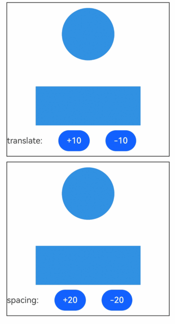
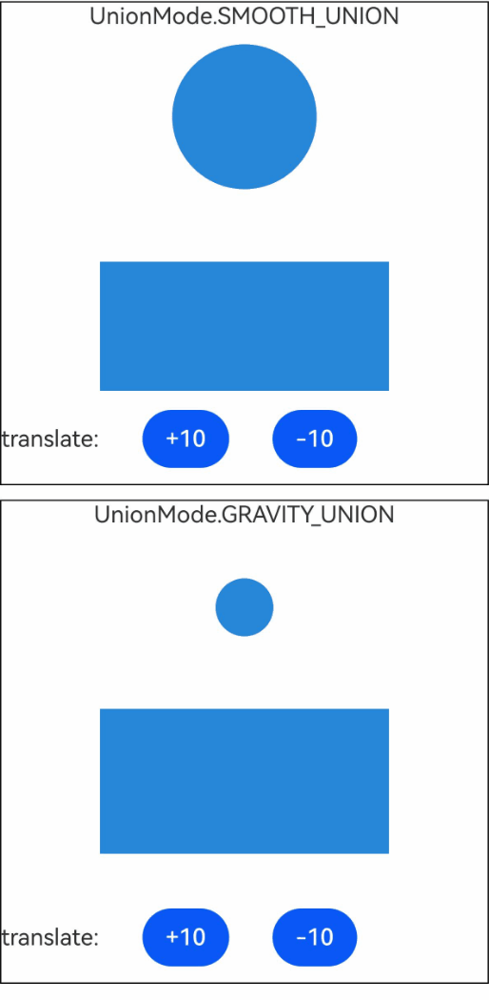

# UnionEffectContainer (System API)

<!--Kit: ArkUI-->
<!--Subsystem: ArkUI-->
<!--Owner: @hehongyang3-->
<!--Designer: @hehongyang3-->
<!--Tester: @lxl007-->
<!--Adviser: @Brilliantry_Rui-->
<!-- md-trans-meta sourceCommit=e10e7def4863f4f964c4d0cb425b7650081cb83e translatedAt=2026-08-21T02:28:49.128Z pushedAt=2026-08-22T06:32:17.440Z -->

A shape union container used together with the [useUnionEffect](ts-universal-attributes-use-union-effect-sys.md#useunioneffect) attribute of descendant components. This container collects the shapes of all descendant components for which [useUnionEffect](ts-universal-attributes-use-union-effect-sys.md#useunioneffect) is set, fuses the collected shapes, and uses the fused shape as the drawing shape of the container. If no descendant component has the [useUnionEffect](ts-universal-attributes-use-union-effect-sys.md#useunioneffect) attribute set, the container does not produce a union effect.

>  **NOTE**
>
> - This component is supported since API version 23. Updates will be marked with a superscript to indicate their earliest API version.
>
> - The APIs provided by this module can be used only in the stage model.
>
> - The APIs provided by this module are system APIs.
>
> - During shape union, developers can use animation APIs to add transition animation effects to the union deformation.

## Child Components

Child components are supported.

## APIs

### UnionEffectContainer

UnionEffectContainer(options?: UnionEffectContainerOptions)

Creates a **UnionEffectContainer** component.

**System API**: This is a system API.

**Model restriction**: This API can be used only in the stage model.

**System capability**: SystemCapability.ArkUI.ArkUI.Full

**Parameters**

| Name           | Type       | Mandatory  | Description                                    |
| -------------- | ---------------------------------------- | ---- |  ---------------------------------------- |
| options      | [UnionEffectContainerOptions](#unioneffectcontaineroptions) | No    |  Construction parameter of **UnionEffectContainer**, used to determine the union deformation degree of the collected descendant component shapes.<br>Default value: **{spacing:0}**               |

## UnionEffectContainerOptions

Sets the construction options of **UnionEffectContainer**.

**System API**: This is a system API.

**Model restriction**: This API can be used only in the stage model.

**System capability**: SystemCapability.ArkUI.ArkUI.Full

| Name       | Type                                   | Read-Only| Optional| Description                                                    |
| ----------- | --------------------------------------- | ---- | ---------- | ---------------------------------------------- |
| spacing | number | No | Yes | Degree of union deformation that occurs between descendant components. It does not represent the actual spacing. Union occurs only when descendant components that use the union effect of the ancestor **UnionEffectContainer** component are set and come close to a certain degree.<br>**NOTE**<br>If **spacing** is set to a value greater than 0 and descendant components that use the union effect of the ancestor **UnionEffectContainer** component come close to a certain degree, these descendant components start to fuse and deform with each other, and the union deformation effect becomes stronger as the distance decreases. A larger value causes the union to start earlier and makes union deformation more likely to occur when descendant components come close to each other.<br>Default value: **0**, in which case the shapes of descendant components fuse together without any deformation effect.<br>Value range: [0, +∞). Values less than 0 are treated as 0. |

## Events

Universal events are supported.

## Attributes

Universal attributes are supported. The width and height can be set.

> **NOTE**
>
> - During union, the container produces a sticky, nonlinear deformation effect, and the border becomes a fused sticky effect. Therefore, border-related capabilities change during the union deformation, and border attributes that do not support the union deformation effect may not take effect properly. The border-related attributes that currently support the union deformation effect are as follows: shadow [shadow](ts-universal-attributes-image-effect.md#shadow), background color [backgroundColor](ts-universal-attributes-background.md#backgroundcolor), and point light [pointLight](#pointlight). These effects are drawn on the fused shape and belong to the drawing part of **UnionEffectContainer**.
>
> - When the border-related attributes that support the union deformation effect are set on this component, the drawing is reflected on this component. If a descendant component sets the same attribute, the two attribute settings are actually independent of each other and are drawn twice: once in the drawing of the **UnionEffectContainer** component and once in the drawing of the descendant component's own attribute. Unless there is a special design requirement, do not set the same union-deformation-supporting attribute on descendant components that use the union effect of the ancestor **UnionEffectContainer** component, to avoid visual anomalies in the union effect caused by double drawing.

### pointLight

pointLight(light: PointLightStyle)

Sets the point light style. A point light is a light source emitted from a specified position, producing a lighting highlight effect on the fused shape. This attribute effect is drawn on the fused shape and takes effect only when descendant components use [useUnionEffect](ts-universal-attributes-use-union-effect-sys.md#useunioneffect). Generally, do not set the **pointLight** attribute on descendant components that use the union effect, to avoid degrading the union effect.

**System API**: This is a system API.

**Model restriction**: This API can be used only in the stage model.

**System capability**: SystemCapability.ArkUI.ArkUI.Full

**Parameters**

| Name| Type                                                        | Mandatory| Description        |
| ------ | ------------------------------------------------------------ | ---- | ------------ |
| light  | [PointLightStyle](ts-universal-attributes-point-light-style-sys.md#pointlightstyle) | Yes   | Point light style, used to set the point light effect on the fused shape of **UnionEffectContainer**. **pointLight** is a border-related attribute that supports the union deformation effect, and the effect is drawn on the fused shape. It is not recommended to set **pointLight** in descendant components that use the union effect, to avoid union effect degradation. |

### unionMode

unionMode(mode: UnionMode)

Sets the union effect mode. The union effect takes effect only when descendant components set the [useUnionEffect](ts-universal-attributes-use-union-effect-sys.md#useunioneffect) attribute. When the union effect mode is [UnionMode.GRAVITY_UNION](#unionmode), it takes effect only when used together with [useUnionEffect](ts-universal-attributes-use-union-effect-sys.md#useunioneffect-1) and when **gravityCenter** of [GravityCenterOptions](ts-universal-attributes-use-union-effect-sys.md#gravitycenteroptions) is set to **true**.

**Since**: 26.0.0

**System API**: This is a system API.

**Model restriction**: This API can be used only in the stage model.

**System capability**: SystemCapability.ArkUI.ArkUI.Full

**Parameters**

| Name | Type                                                         | Mandatory | Description         |
| ------ | ------------------------------------------------------------ | ---- | ------------ |
| mode  | [UnionMode](#unionmode) | Yes   | Union effect mode. It takes effect only when used together with the [useUnionEffect](ts-universal-attributes-use-union-effect-sys.md#useunioneffect) attribute of descendant components. When [UnionMode.GRAVITY_UNION](#unionmode) is set, it takes effect only when used together with the [useUnionEffect](ts-universal-attributes-use-union-effect-sys.md#useunioneffect-1) attribute and when gravityCenter of [GravityCenterOptions](ts-universal-attributes-use-union-effect-sys.md#gravitycenteroptions) is set to true. |

## UnionMode

Enumerates the union effect modes.

**Since**: 26.0.0

**Model restriction**: This API can be used only in the stage model.

**System capability**: SystemCapability.ArkUI.ArkUI.Full

**System API**: This is a system API.

| Name           | Value  | Description                         |
| -------------- | --- |---------------------------- |
| SMOOTH_UNION       | 0   | Smooth union deformation effect, suitable for union scenarios that require smooth transitions and natural connections.<br>**NOTE**<br>When this type is set, the union effect is produced only when descendant components set the [useUnionEffect](ts-universal-attributes-use-union-effect-sys.md#useunioneffect) attribute.            |
| GRAVITY_UNION      | 1   | Union deformation effect under gravity, suitable for union scenarios that require simulating a gravitational attraction effect, such as the visual representation of attraction and approaching trends between elements.<br>**NOTE**<br>When this type is set, it takes effect only when used together with [useUnionEffect](ts-universal-attributes-use-union-effect-sys.md#useunioneffect-1) and when **gravityCenter** of [GravityCenterOptions](ts-universal-attributes-use-union-effect-sys.md#gravitycenteroptions) is set to **true**. If the preceding conditions are not met, **GRAVITY_UNION** does not take effect.            |

## Examples

### Example 1: Setting the Union Deformation Effect

This example demonstrates how to use the [UnionEffectContainer](#unioneffectcontainer) component to generate a union deformation effect by changing the **spacing** value or the spacing between descendant components.

```ts
// UnionEffectContainerPage.ets
@Entry
@Component
struct UnionEffectContainerPage {
  @State spacing: number = 0;
  @State translateY: number = 0;

  build() {
    Column() {
      Column() {
        UnionEffectContainer({ spacing: 10 }) {
          Column({ space: 50 }) {
            Column()
              .width(100)
              .height(100)
              .margin({ top: 10 })
              .borderRadius(50)
              .useUnionEffect(true) // Set the useUnionEffect attribute to use the union effect.
              .translate({ y: this.translateY })

            Column()
              .width(200)
              .height(100)
              .useUnionEffect(true)
          }
          .width('100%')
        }
        .width('100%')
        .height('80%')
        .backgroundColor('#2787d9') // Set the attributes supported by the union effect, such as the background color.

        Row({ space: 30 }) {
          Text('translate:')
          Button('+10')
            .onClick(() => {
              this.getUIContext().animateTo({ duration: 200 }, () => {
                this.translateY += 10; // Change the spacing between the descendant components.
              });
            })
          Button('-10')
            .onClick(() => {
              this.getUIContext().animateTo({ duration: 200 }, () => {
                this.translateY -= 10; // Change the spacing between the descendant components.
              });
            })
        }
        .width('100%')
        .height('20%')
      }.width('90%')
      .height('40%')
      .borderWidth(1)
      .margin({ top: 10 })

      Column() {
        UnionEffectContainer({ spacing: this.spacing }) {
          Column({ space: 50 }) {
            Column()
              .width(100)
              .height(100)
              .margin({ top: 10 })
              .borderRadius(50)
              .useUnionEffect(true) // Set the useUnionEffect attribute to use the union effect.

            Column()
              .width(200)
              .height(100)
              .useUnionEffect(true)
          }
          .width('100%')
        }
        .width('100%')
        .height('80%')
        .backgroundColor('#2787d9') // Set the attributes supported by the union effect, such as the background color.

        Row({ space: 30 }) {
          Text('spacing:')
          Button('+20')
            .onClick(() => {
              this.getUIContext().animateTo({ duration: 200 }, () => {
                this.spacing += 20; // Change the degree of union deformation.
              });
            })
          Button('-20')
            .onClick(() => {
              if (this.spacing <= 0) {
                return;
              }
              this.getUIContext().animateTo({ duration: 200 }, () => {
                this.spacing -= 20; // Change the degree of union deformation.
                if (this.spacing < 0) {
                  this.spacing = 0;
                }
              });
            })
        }
        .width('100%')
        .height('20%')
      }.width('90%')
      .height('40%')
      .borderWidth(1)
      .margin({ top: 10 })
    }.width('100%')
    .height('100%')
  }
}
```



### Example 2: Setting Different Types of Union Deformation Effects

This example demonstrates how to use the [unionMode](#unionmode) API to produce different union deformation effects by setting different union types.

The unionMode API is added since API version 26.0.0.

```ts
// UnionEffectContainerPage.ets
@Entry
@Component
struct UnionEffectContainerPage {
  @State translateY1: number = 0;
  @State translateY2: number = 0;

  build() {
    Column() {
      Column() {
        Text('UnionMode.SMOOTH_UNION')
        UnionEffectContainer({ spacing: 10 }) {
          Column({ space: 50 }) {
            Column()
              .width(100)
              .height(100)
              .margin({ top: 10 })
              .borderRadius(50)
              .useUnionEffect(true) // Set the useUnionEffect attribute to use the union effect.
              .translate({ y: this.translateY1 })

            Column()
              .width(200)
              .height(100)
              .useUnionEffect(true)
          }
          .width('100%')
        }
        .width('100%')
        .height('75%')
        .backgroundColor('#2787d9') // Set the attributes supported by the union effect, such as the background color.
        .unionMode(UnionMode.SMOOTH_UNION)

        Row({ space: 30 }) {
          Text('translate:')
          Button('+10')
            .onClick(() => {
              this.getUIContext().animateTo({ duration: 200 }, () => {
                this.translateY1 += 10; // Change the distance between adjacent components.
              });
            })
          Button('-10')
            .onClick(() => {
              this.getUIContext().animateTo({ duration: 200 }, () => {
                this.translateY1 -= 10; // Change the distance between adjacent components.
              });
            })
        }
        .width('100%')
        .height('20%')
      }.width('90%')
      .height('45%')
      .borderWidth(1)
      .margin({ top: 10 })

      Column() {
        Text('UnionMode.GRAVITY_UNION')
        UnionEffectContainer({ spacing: 1000 }) {
          Column({ space: 50 }) {
            Column()
              .width(40)
              .height(40)
              .margin({ top: 10 })
              .borderRadius(20)
              .useUnionEffect(true, {gravityCenter: true, gravityIntensity: 60}) // Set the useUnionEffect attribute to use the union effect.
              .translate({ y: this.translateY2 })

            Column()
              .width(200)
              .height(100)
              .useUnionEffect(true)
          }
          .width('100%')
        }
        .width('100%')
        .height('75%')
        .backgroundColor('#2787d9') // Set the attributes supported by the union effect, such as the background color.
        .unionMode(UnionMode.GRAVITY_UNION)

        Row({ space: 30 }) {
          Text('translate:')
          Button('+10')
            .onClick(() => {
              this.getUIContext().animateTo({ duration: 200 }, () => {
                this.translateY2 += 10; // Change the distance between adjacent components.
              });
            })
          Button('-10')
            .onClick(() => {
              this.getUIContext().animateTo({ duration: 200 }, () => {
                this.translateY2 -= 10; // Change the distance between adjacent components.
              });
            })
        }
        .width('100%')
        .height('20%')
      }.width('90%')
      .height('45%')
      .borderWidth(1)
      .margin({ top: 10 })
    }.width('100%')
    .height('100%')
  }
}
```


<!--no_check-->