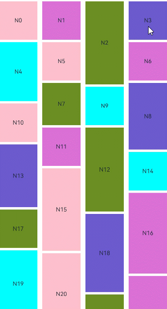

# WaterFlow

<!--Kit: ArkUI-->
<!--Subsystem: ArkUI-->
<!--Owner: @fangyuhao-->
<!--Designer: @zcdqs-->
<!--Tester: @liuzhenshuo-->
<!--Adviser: @HelloCrease-->

The **WaterFlow** component is a water flow container that consists of cells formed by rows and columns and arranges items of different sizes from top to bottom according to the preset rules.


> **NOTE**
>
> This component is supported since API version 9. Updates will be marked with a superscript to indicate their earliest API version.
>
> The WaterFlow component supports the waterfall layout but does not support the editing mode or dragging of subelements.
>
> The component has been bound with gestures to implement functions such as following the finger. If you need to add custom gestures, refer to [Enhanced Gesture Interception](ts-gesture-blocking-enhancement.md).
## Child Components


Only the [FlowItem](ts-container-flowitem.md) child component and custom components are supported. When a custom component is used in WaterFlow, you are advised to use FlowItem as the top-level component of the custom component. You are not advised to set attributes and event methods for the custom component.
Subcomponents can be dynamically generated using rendering control types [if/else](../../../ui/rendering-control/arkts-rendering-control-ifelse.md), [ForEach](../../../ui/rendering-control/arkts-rendering-control-foreach.md), [LazyForEach](../../../ui/rendering-control/arkts-rendering-control-lazyforeach.md), and [Repeat ](../../../ui/rendering-control/arkts-new-rendering-control-repeat.md). LazyForEach or Repeat is recommended to optimize performance.

>  **NOTE**
>
>  When its **visibility** attribute is set to **None**, a **FlowItem** is not displayed in the container, but its **columnsGap**, **rowsGap**, and **margin** settings are still effective.
>  If there are a large number of child components, you are advised to use lazy loading, data caching, component reuse, fixed width and height, and layout optimization to improve performance and reduce memory usage. For details, see [Optimizing the Frame Loss Caused by Slow Waterfall Loading](https://developer.huawei.com/consumer/cn/doc/best-practices/bpta-waterflow-performance-optimization).
>
> In vertical layout mode, WaterFlow calculates the accumulated height of child components in each column and places new child components in the column with the smallest accumulated height to keep the overall layout compact.
>
> If the heights of multiple columns are the same, the subcomponents are placed in the leftmost column. In RTL mode, the subcomponents are placed in the rightmost column.
>
> From API version 21, the maximum width and height of a single child component of WaterFlow are 16777216 px. For API version 20 and earlier versions, the maximum width and height of a single child component of WaterFlow are 1000000px. If the child component exceeds the size, the scrolling or display may be abnormal.


## APIs

WaterFlow(options?:  WaterFlowOptions)

Creates a **WaterFlow** component.

**Atomic service API**: This API can be used in atomic services since API version 11.

**System capability**: SystemCapability.ArkUI.ArkUI.Full

**Parameters**

| Name| Type| Mandatory| Description|
| -------- | -------- | -------- | -------- |
| options |  [WaterFlowOptions](#waterflowoptions)| No| Parameters of the **WaterFlow** component.|


## WaterFlowOptions

Provides parameters of the **WaterFlow** component.

**System capability**: SystemCapability.ArkUI.ArkUI.Full

| Name    | Type                                       | Read-Only| Optional| Description                                    |
| ---------- | ----------------------------------------------- | ------ | -- | -------------------------------------------- |
| footer |  [CustomBuilder](ts-types.md#custombuilder8) | No  | Yes| Footer of the **WaterFlow** component.<br>**NOTE**<br>For details, see [Example 1](#example-1-using-a-basic-waterflow-component).<br>**Atomic service API**: This API can be used in atomic services since API version 11.|
| footerContent<sup>18+</sup> | [ComponentContent](../js-apis-arkui-ComponentContent.md) | No| Yes| Footer of the **WaterFlow** component.<br>This parameter has a higher priority than **footer**. If both **footer** and **footerContent** are set, the component set by **footerContent** will be used.<br>**Atomic service API**: This API can be used in atomic services since API version 18.|
| scroller | [Scroller](ts-container-scroll.md#scroller) | No  | Yes| Controller of the scrollable component, bound to the scrollable component.<br>**NOTE**<br>Do not bind the scrollable component to other scrollable components, such as [ArcList](ts-container-arclist.md), [List](ts-container-list.md), [Grid](ts-container-grid.md), [Scroll](ts-container-scroll.md), and [WaterFlow](ts-container-waterflow.md).<br>**Atomic service API**: This API can be used in atomic services since API version 11.|
| sections<sup>12+</sup> |  [WaterFlowSections](#waterflowsections12) | No  | Yes| Water flow item sections. Different sections can have different numbers of columns.<br>**NOTE**<br>1. When **sections** is used, the **columnsTemplate** and **rowsTemplate** attributes are ignored.<br>2. When **sections** is used, the footer cannot be set separately. The last section can function as the footer.<br>**Atomic service API**: This API can be used in atomic services since API version 12. |
| layoutMode<sup>12+</sup> |[WaterFlowLayoutMode](#waterflowlayoutmode12)| No| Yes| Layout mode of the **WaterFlow** component.<br>**NOTE**<br>Default value: [ALWAYS_TOP_DOWN](#waterflowlayoutmode12)<br>**Atomic service API**: This API can be used in atomic services since API version 12.


## WaterFlowSections<sup>12+</sup>

Describes the water flow item sections.

> **NOTE**
>
> After the section information is modified using **splice**, **push**, and **update**, ensure that the total number of child nodes in all sections matches the actual total number of child nodes in the **WaterFlow** component. Any failure to do so may result in layout issues that prevent the **WaterFlow** component from scrolling properly.

### constructor

constructor()

A constructor used to create a **WaterFlowSections** object.

**Atomic service API**: This API can be used in atomic services since API version 12.

**System capability**: SystemCapability.ArkUI.ArkUI.Full

### splice<sup>12+</sup>

splice(start: number, deleteCount?: number, sections?: Array\<SectionOptions\>): boolean

Changes sections by removing or replacing an existing section and/or adding a section.

**Atomic service API**: This API can be used in atomic services since API version 12.

**System capability**: SystemCapability.ArkUI.ArkUI.Full

**Parameters**

| Name  | Type                           | Mandatory  | Description                  |
| ---- | ----------------------------- | ---- | -------------------- |
| start | number | Yes   | Zero-based index at which the changing starts. The value is converted to an integer.<br>**NOTE**<br>1. A negative index counts back from the end of the section list. **start + WaterFlowSections.length()** is used.<br>2. If **start** < -**WaterFlowSections.length()**, **0** is used.<br>3. If **start** >= **WaterFlowSections.length()**, a new section is added at the end.|
| deleteCount | number | No   | Number of sections to be deleted from the position specified by **start**.<br>**NOTE**<br>1. If **deleteCount** is omitted, or if its value is greater than or equal to the number of sections from the position specified by **start** to the end of the **WaterFlowSections**, then all sections from the position specified by **start** to the end of the **WaterFlowSections** will be deleted.<br>2. If **deleteCount** is **0** or a negative number, no sections are deleted.|
| sections | Array<[SectionOptions](#sectionoptions12)> | No   | Sections to add to the section list, beginning from the position specified by **start**. If no section is specified, **splice()** will only delete sections from the **WaterFlow** component.|

**Return value**

| Type                                                        | Description                                                        |
| ------------------------------------------------------------ | ------------------------------------------------------------ |
| boolean | true if the group is successfully modified; false if the modification fails (itemsCount of any group to be added is not a non-negative number).|


### push<sup>12+</sup>

push(section: SectionOptions): boolean

Adds the specified sections to the end of the **WaterFlow** component.

**Atomic service API**: This API can be used in atomic services since API version 12.

**System capability**: SystemCapability.ArkUI.ArkUI.Full

**Parameters**

| Name  | Type                           | Mandatory  | Description                  |
| ---- | ----------------------------- | ---- | -------------------- |
| section | [SectionOptions](#sectionoptions12) | Yes   | Sections to add to the end of the **WaterFlow** component.|

**Return value**

| Type                                                        | Description                                                        |
| ------------------------------------------------------------ | ------------------------------------------------------------ |
| boolean | true if the group is successfully added; false if the addition fails (itemsCount of the new group is not a non-negative number).|

### update<sup>12+</sup>

update(sectionIndex: number, section: SectionOptions): boolean

Updates the configuration of a specified water flow item section.

**Atomic service API**: This API can be used in atomic services since API version 12.

**System capability**: SystemCapability.ArkUI.ArkUI.Full

**Parameters**

| Name  | Type                           | Mandatory  | Description                  |
| ---- | ----------------------------- | ---- | -------------------- |
| sectionIndex | number | Yes   | Zero-based index of the water flow item section to update. The value is converted to an integer.<br>**NOTE**<br>1. A negative index counts back from the end of the section list. **sectionIndex + WaterFlowSections.length()** is used.<br>2. If **sectionIndex** < -**WaterFlowSections.length()**, **0** is used.<br>3. If **sectionIndex** >= **WaterFlowSections.length()**, a new section is added at the end.|
| section | [SectionOptions](#sectionoptions12) | Yes   | New section configuration.|

**Return value**

| Type                                                        | Description                                                        |
| ------------------------------------------------------------ | ------------------------------------------------------------ |
| boolean | Whether the group is updated successfully. If itemsCount of the new group is not a non-negative number, false is returned.|

### values<sup>12+</sup>

values(): Array\<SectionOptions\>

Obtains the configuration of all sections in the **WaterFlow** component.

**Atomic service API**: This API can be used in atomic services since API version 12.

**System capability**: SystemCapability.ArkUI.ArkUI.Full

**Return value**

| Type                                                        | Description                                                        |
| ------------------------------------------------------------ | ------------------------------------------------------------ |
| Array<[SectionOptions](#sectionoptions12)> | Configuration of all sections in the **WaterFlow** component.|

### length<sup>12+</sup>

length(): number

Obtains the number of sections in the **WaterFlow** component.

**Atomic service API**: This API can be used in atomic services since API version 12.

**System capability**: SystemCapability.ArkUI.ArkUI.Full

**Return value**

| Type                                                        | Description                                                        |
| ------------------------------------------------------------ | ------------------------------------------------------------ |
| number | Number of sections in the **WaterFlow** component.|

## SectionOptions<sup>12+</sup>

Describes the configuration of the water flow item section.

**Atomic service API**: This API can be used in atomic services since API version 12.

**System capability**: SystemCapability.ArkUI.ArkUI.Full

| Name| Type| Read-Only| Optional| Description|
|------|-----|-----|----|-----|
| itemsCount | number | No| No| Number of FlowItems in a group. The value must be a non-negative number. If the **splice**, **push**, or **update** APIs receive a section where the **itemsCount** value is less than 0, these APIs will not be executed. Do not use a group whose itemsCount is 0. Otherwise, the layout calculation may be abnormal.|
| crossCount | number | No| Yes| Number of columns (in vertical layout) or rows (in horizontal layout).<br>Default value: **1**<br> If the value is less than 1, the default value is used.|
| columnsGap | [Dimension](ts-types.md#dimension10) | No| Yes| Gap between columns. If this parameter is not set, the value of **columnsGap** for the water flow is used. If this parameter is set to an invalid value, 0 vp is used.|
| rowsGap | [Dimension](ts-types.md#dimension10) | No| Yes| Gap between rows. If this parameter is not set, the value of **rowsGap** for the water flow is used. If this parameter is set to an invalid value, 0 vp is used.|
| margin | [Margin](ts-types.md#margin) \| [Dimension](ts-types.md#dimension10) | No| Yes| Padding of the section. A value of the Length type specifies the margin for all the four sides.<br>Default value: **0**<br>Unit: vp<br>When **margin** is set to a percentage, the width of the **WaterFlow** component is used as the base value for the top, bottom, left, and right margins.|
| onGetItemMainSizeByIndex | [GetItemMainSizeByIndex](#getitemmainsizebyindex12) | No| Yes| Callback used to obtain the main axis size, in vp, of the water flow item at a specified index during the layout process of the **WaterFlow** component. For a vertical **WaterFlow** component, this size refers to the height, and for a horizontal **WaterFlow** component, it refers to the width.<br>**NOTE**<br>1. When both **onGetItemMainSizeByIndex** and the width or height attribute of the water flow item are used, the main axis size is determined by the return value of **onGetItemMainSizeByIndex**, which will override the main axis length of water flow item.<br>2. Using **onGetItemMainSizeByIndex** can improve the efficiency of jumping to a specific position or index in the **WaterFlow** component. Avoid mixing the use of **onGetItemMainSizeByIndex** with sections that do not have it set, as this can cause layout exceptions.<br>3. If **onGetItemMainSizeByIndex** returns a negative number, the height of the water flow item is 0.|


## GetItemMainSizeByIndex<sup>12+</sup>

type GetItemMainSizeByIndex = (index: number) => number

Obtains the main axis size of a specified water flow item based on its index.

**Atomic service API**: This API can be used in atomic services since API version 12.

**System capability**: SystemCapability.ArkUI.ArkUI.Full

**Parameters**

| Name  | Type                           | Mandatory  | Description                  |
| ---- | ----------------------------- | ---- | -------------------- |
| index | number | Yes   | Index of the target water flow item.<br>Value range: [0, total number of child nodes - 1].|

**Return value**

| Type                                                        | Description                                                        |
| ------------------------------------------------------------ | ------------------------------------------------------------ |
| number | Main axis size, in vp, of the water flow item at the specified index, which is the height for a vertical **WaterFlow** component and the width for a horizontal **WaterFlow** component.|

## WaterFlowLayoutMode<sup>12+</sup>

Enumerates the layout modes of the **WaterFlow** component.

**Atomic service API**: This API can be used in atomic services since API version 12.

**System capability**: SystemCapability.ArkUI.ArkUI.Full

| Name| Value| Description|
| ------ | ------ | -------------------- |
| ALWAYS_TOP_DOWN | 0 | Default layout mode where water flow items are arranged from top to bottom. Items in the viewport depend on the layout of all items above them. As such, in cases of redirection or switching the number of columns, the layout of all items above the viewport must be recalculated.|
| SLIDING_WINDOW | 1 | Sliding window mode. This mode only takes into account the layout in the viewport, without depending on water flow items above the viewport. As such, in cases of redirection backward or switching the number of columns, only the water flow items within the viewport need to be laid out. This mode is recommended, especially when the application needs to support screen rotation or dynamic column switching.<br>**NOTE**<br>1. During a non-animated redirection to a distant location, water flow items are laid out forward or backward based on the target position. If the user then swipes back to the position prior to the redirection, the layout of the content may not be consistent with its previous state. This can lead to misalignment of the top nodes when the user swipes back to the top after the redirection. To counteract this issue, in this layout mode, the layout will be automatically adjusted after reaching the top of the viewport to ensure that the top is aligned. If there are multiple sections, adjustments will be made to the sections within the viewport when scrolling ends.<br> 2. The total offset returned by the [currentOffset](ts-container-scroll.md#currentoffset) API of [scroller](#waterflowoptions) is inaccurate after a redirection or data update. This offset will be recalibrated when the user swipes back to the top.<br> 3. If a jump action (for example, by calling [scrollToIndex](ts-container-scroll.md#scrolltoindex) without animation or [scrollEdge](ts-container-scroll.md#scrolledge)) and an input offset (such as from a swipe gesture or a scrolling animation) are both initiated within the same frame, both will be executed.<br> 4. If the [scrollToIndex](ts-container-scroll.md#scrolltoindex) API is called without animation to jump to a distant position (beyond the range of visible water flow items in the window), the total offset is calculated in the sliding window mode.<br> 5. The scrollbar [scrollBar](ts-container-scrollable-common.md#scrollbar11) display is supported only in API version 18 and later. In earlier versions, the scrollbar will not be displayed.|

| Comparison| ALWAYS_TOP_DOWN (default)| SLIDING_WINDOW |
|---------|------------------------|----------------|
| Scenario| Fixed number of columns and simple waterfall layout| Dynamic number of columns, large data volume, and screen rotation|
| Layout Policy| Complete layout from the top| Scrolling window layout|
| Performance| Depends on all flow items above| Only considers the layout in the view|
| Jump Efficiency| Calculates all layouts above| Quick jump without complete calculation|
| Column Switching| Recalculates all layouts| Re-layouts only the content in the view|
| Screen Rotation| Supported, but poor performance| Supported, good performance|
| Scrollbar Display| Always supported| Supported in API version 18 and later|
| Layout Consistency| Always consistent| May be inconsistent after jump|

## Attributes

In addition to [universal attributes](ts-component-general-attributes.md) and [scrollable component common attributes](ts-container-scrollable-common.md#attributes), the following attributes are also supported.
> **NOTE**
>
> When the WaterFlow component uses the common attributes [clip<sup>12+</sup>](ts-universal-attributes-sharp-clipping.md#clip12) and [clip<sup>18+</sup>](ts-universal-attributes-sharp-clipping.md#clip18), the default value is true.
>
> If [ContentClipMode<sup>14+</sup>](ts-container-scrollable-common.md#contentclipmode14) of the **WaterFlow** component is **ContentClipMode.CONTENT_ONLY**, the padding area is cropped and not displayed.

### columnsTemplate

columnsTemplate(value: string)

Sets the number of columns in the layout. If this attribute is not set, one column is used by default.

For example, **'1fr 1fr 2fr'** indicates three columns, with the first column taking up 1/4 of the parent component's full width, the second column 1/4, and the third column 2/4.

You can use **columnsTemplate('repeat(auto-fill,track-size)')** to automatically calculate the number of columns based on the specified column width **track-size**. **repeat** and **auto-fill** are keywords. The units for **track-size** can be px, vp (default), %, or a valid number. For details, see Example 2.

**Atomic service API**: This API can be used in atomic services since API version 11.

**System capability**: SystemCapability.ArkUI.ArkUI.Full

**Parameters**

| Name| Type  | Mandatory| Description                                          |
| ------ | ------ | ---- | ---------------------------------------------- |
| value  | string | Yes  | Number of columns in the layout.<br>Default value: **'1fr'**|

### rowsTemplate

rowsTemplate(value: string)

Sets the number of rows in the layout. If this attribute is not set, one row is used by default.

For example, **'1fr 1fr 2fr'** indicates three rows, with the first row taking up 1/4 of the parent component's full height, the second row 1/4, and the third row 2/4.

You can use **rowsTemplate('repeat(auto-fill,track-size)')** to automatically calculate the number of rows based on the specified row height **track-size**. **repeat** and **auto-fill** are keywords. The units for **track-size** can be px, vp (default), %, or a valid number.

**Atomic service API**: This API can be used in atomic services since API version 11.

**System capability**: SystemCapability.ArkUI.ArkUI.Full

**Parameters**

| Name| Type  | Mandatory| Description                                          |
| ------ | ------ | ---- | ---------------------------------------------- |
| value  | string | Yes  | Number of rows in the layout.<br>Default value: **'1fr'**|

### itemConstraintSize

itemConstraintSize(value: ConstraintSizeOptions)

Sets the size constraints of the child components during layout.

**Atomic service API**: This API can be used in atomic services since API version 11.

**System capability**: SystemCapability.ArkUI.ArkUI.Full

**Parameters**

| Name| Type                                                      | Mandatory| Description      |
| ------ | ---------------------------------------------------------- | ---- | ---------- |
| value  | [ConstraintSizeOptions](ts-types.md#constraintsizeoptions) | Yes  | Size constraints of the child components during layout. If the value specified is less than 0, this parameter does not take effect.<br>**NOTE**<br>1. If both **itemConstraintSize** and the [constraintSize](ts-universal-attributes-size.md#constraintsize) attribute of the **FlowItem** are set, the **minWidth** (or **minHeight**) will be the larger of the two values, and the **maxWidth** (or **maxHeight**) will be the smaller of the two values. The resulting values will then be used as the **constraintSize** for the **FlowItem**.<br>2. When only **itemConstraintSize** is set, it effectively applies a uniform size constraint to all child components in the **WaterFlow**.<br>3. The **itemConstraintSize** attribute, once converted to the **constraintSize** attribute of the **FlowItem** through the two methods mentioned above, follows the same rules for taking effect as the universal attribute [constraintSize](./ts-universal-attributes-size.md#constraintsize).|

### columnsGap

columnsGap(value: Length)

Sets the gap between columns.

**Atomic service API**: This API can be used in atomic services since API version 11.

**System capability**: SystemCapability.ArkUI.ArkUI.Full

**Parameters**

| Name| Type                        | Mandatory| Description                         |
| ------ | ---------------------------- | ---- | ----------------------------- |
| value  | [Length](ts-types.md#length) | Yes  | Gap between columns.<br>Default value: **0**<br>Value range: [0, +∞).|

### rowsGap

rowsGap(value: Length)

Sets the gap between rows.

**Atomic service API**: This API can be used in atomic services since API version 11.

**System capability**: SystemCapability.ArkUI.ArkUI.Full

**Parameters**

| Name| Type                        | Mandatory| Description                         |
| ------ | ---------------------------- | ---- | ----------------------------- |
| value  | [Length](ts-types.md#length) | Yes  | Gap between rows.<br>Default value: **0**<br>Value range: [0, +∞).|

### layoutDirection

layoutDirection(value: FlexDirection)

Sets the main axis direction of the layout.

**Atomic service API**: This API can be used in atomic services since API version 11.

**System capability**: SystemCapability.ArkUI.ArkUI.Full

**Parameters**

| Name| Type                                               | Mandatory| Description                                             |
| ------ | --------------------------------------------------- | ---- | ------------------------------------------------- |
| value  | [FlexDirection](ts-appendix-enums.md#flexdirection) | Yes  | Main axis direction of the layout.<br>Default value: **FlexDirection.Column**|

The priority of **layoutDirection** is higher than that of **rowsTemplate** and **columnsTemplate**. The following three modes are available based on the setting of layoutDirection:

- **layoutDirection** is set to **FlexDirection.Column** or **FlexDirection.ColumnReverse**

  In this case, **columnsTemplate** is valid. If it is not set, the default value is used. For example, if **columnsTemplate** is set to **"1fr 1fr"** and **rowsTemplate** **"1fr 1fr 1fr"**, child components are arranged in vertical layout, with the cross axis equally divided into two columns.

- **layoutDirection** set to **FlexDirection.Row** or **FlexDirection.RowReverse**

  In this case, **rowsTemplate** is valid. If it is not set, the default value is used. For example, if **columnsTemplate** is set to **"1fr 1fr"** and **rowsTemplate** **"1fr 1fr 1fr"**, child components are arranged in horizontal layout, with the cross axis equally divided into three columns.

- **layoutDirection** is not set

  In this case, the default value of **layoutDirection** is used, which is **FlexDirection.Column**, and **columnsTemplate** is valid. For example, if **columnsTemplate** is set to **"1fr 1fr"** and **rowsTemplate** **"1fr 1fr 1fr"**, child components are arranged in vertical layout, with the cross axis equally divided into two columns.

### enableScrollInteraction<sup>10+</sup>

enableScrollInteraction(value: boolean)

Sets whether to support the scrolling gesture.

**Atomic service API**: This API can be used in atomic services since API version 11.

**System capability**: SystemCapability.ArkUI.ArkUI.Full

**Parameters**

| Name| Type   | Mandatory| Description                               |
| ------ | ------- | ---- | ----------------------------------- |
| value  | boolean | Yes  | Whether to support scroll gestures. Whether to enable scroll gestures. With the value **true**, scrolling via finger or mouse is enabled. With the value **false**, scrolling via finger or mouse is disabled, but this does not affect the scrolling APIs of the [Scroller](ts-container-scroll.md#scroller).<br>Default value: **true**|

> **NOTE**
>
> The component cannot be scrolled by dragging the mouse.

### nestedScroll<sup>10+</sup>

nestedScroll(value: NestedScrollOptions)

Sets the nested scrolling mode in the forward and backward directions to implement scrolling association with the parent component.

**Atomic service API**: This API can be used in atomic services since API version 11.

**System capability**: SystemCapability.ArkUI.ArkUI.Full

**Parameters**

| Name| Type                                                        | Mandatory| Description          |
| ------ | ------------------------------------------------------------ | ---- | -------------- |
| value  | [NestedScrollOptions](ts-container-scrollable-common.md#nestedscrolloptions10) | Yes  | Nested scrolling options.|

### friction<sup>10+</sup>

friction(value: number | Resource)

Sets the friction coefficient, which takes effect when you manually scroll the scrolling area. The friction coefficient affects only the inertial scrolling process and has an indirect impact on the chain effect in the inertial scrolling process.

**Atomic service API**: This API can be used in atomic services since API version 11.

**System capability**: SystemCapability.ArkUI.ArkUI.Full

**Parameters**

| Name| Type                                                | Mandatory| Description                                                     |
| ------ | ---------------------------------------------------- | ---- | --------------------------------------------------------- |
| value  | number \| [Resource](ts-types.md#resource) | Yes  | Friction coefficient.<br>Default value: **0.9** for wearable devices and **0.6** for non-wearable devices.<br>Since API version 11, the default value for non-wearable devices is **0.7**.<br>Since API version 12, the default value for non-wearable devices is **0.75**.<br>Value range: (0, +∞).<br>If the value is less than or equal to 0, the default value is used.|

### cachedCount<sup>11+</sup>

cachedCount(value: number)

Sets the number of FlowItem elements to be preloaded.

This parameter takes effect only when used with [LazyForEach](../../../ui/rendering-control/arkts-rendering-control-lazyforeach.md) or the [Repeat](../../../ui/rendering-control/arkts-new-rendering-control-repeat.md) component that has virtualScroll enabled. **FlowItem** elements outside the visible area and cache range will be released.

**Atomic service API**: This API can be used in atomic services since API version 12.

**System capability**: SystemCapability.ArkUI.ArkUI.Full

**Parameters**

| Name| Type  | Mandatory| Description                                                        |
| ------ | ------ | ---- | ------------------------------------------------------------ |
| value  | number | Yes  | Number of water flow items to be preloaded (cached).<br>Default value: number of nodes visible on the screen, with the maximum value of 16<br>Value range: [0, +∞).<br>Values less than 0 are treated as **1**.|

### cachedCount<sup>14+</sup>

cachedCount(count: number, show: boolean)

Sets the number of water flow items to be cached (preloaded) and specifies whether to display the cached nodes.

When this attribute is used in conjunction with the [clip](ts-universal-attributes-sharp-clipping.md#clip12) or [content clipping](ts-container-scrollable-common.md#clipcontent14) attributes, the cached nodes can be displayed.

This parameter takes effect only when used with [LazyForEach](../../../ui/rendering-control/arkts-rendering-control-lazyforeach.md) or the [Repeat](../../../ui/rendering-control/arkts-new-rendering-control-repeat.md) component that has virtualScroll enabled. **FlowItem** elements outside the visible area and cache range will be released.

**Atomic service API**: This API can be used in atomic services since API version 14.

**System capability**: SystemCapability.ArkUI.ArkUI.Full

**Parameters**

| Name| Type  | Mandatory| Description                                    |
| ------ | ------ | ---- | ---------------------------------------- |
| count | number | Yes  | Number of water flow items to be preloaded (cached).<br>Default value: number of nodes visible on the screen, with the maximum value of 16<br>Value range: [0, +∞).<br>Values less than 0 are treated as **1**.|
| show  | boolean | Yes  | Whether to display the cached water flow items. If this parameter is set to true, the preloaded flow items are displayed. If this parameter is set to false, the preloaded flow items are not displayed.<br> Default value: **false**.|

### syncLoad<sup>20+</sup>

syncLoad(enable: boolean)

Sets whether to synchronously load all child components in the WaterFlow area.

**Atomic service API**: This API can be used in atomic services since API version 20.

**System capability**: SystemCapability.ArkUI.ArkUI.Full

**Parameters**

| Name| Type                                                        | Mandatory| Description                                                        |
| ------ | ------------------------------------------------------------ | ---- | ------------------------------------------------------------ |
| enable   | boolean | Yes  | Whether to synchronously load all child components in the WaterFlow area.<br>true: synchronous loading; false: asynchronous loading. Default value: **true**.<br>**NOTE**<br>If this parameter is set to false, and the first display does not contain an animation, when the scrollToIndex redirection scenario is used, if the time consumed by the frame layout exceeds 50 ms, the child components that have not been laid out in the WaterFlow area are delayed to the next frame for layout.|

## Events

In addition to [universal events](ts-component-general-events.md) and [scrollable component common events](ts-container-scrollable-common.md#events), the following events are also supported.

### onReachStart

onReachStart(event: () => void)

Triggered when the WaterFlow content reaches the start position.

**Atomic service API**: This API can be used in atomic services since API version 11.

**System capability**: SystemCapability.ArkUI.ArkUI.Full

**Parameters**

| Name| Type| Mandatory| Description|
| ------ | ------ | ------ | ------|
| event | () => void | Yes| Callback triggered when the WaterFlow content reaches the start position.|

### onReachEnd

onReachEnd(event: () => void)

Triggered when the WaterFlow content reaches the end position.

**Atomic service API**: This API can be used in atomic services since API version 11.

**System capability**: SystemCapability.ArkUI.ArkUI.Full

**Parameters**

| Name| Type| Mandatory| Description|
| ------ | ------ | ------ | ------|
| event | () => void | Yes| Callback triggered when the WaterFlow content reaches the end position.|

### onScrollFrameBegin<sup>10+</sup>

onScrollFrameBegin(event: OnScrollFrameBeginCallback)

When this API is called back, the event parameter passes the sliding amount to be performed. The event processing function can calculate the actual sliding amount required based on the application scenario and return the sliding amount as the return value of the event processing function. The WaterFlow scrolls according to the actual sliding amount of the return value.

This event is triggered when any of the following conditions is met:

1. Scrolling is triggered by user interaction (such as finger sliding and keyboard and mouse operations).
2. WaterFlow inertial scrolling.
3. Scrolling is triggered by calling the [fling](ts-container-scroll.md#fling12) API.

This event is not triggered when the following conditions are met:

1. Call a scrolling control API other than [fling](ts-container-scroll.md#fling12).
2. The out-of-bounds bounce effect is supported.
3. Drag the scroll bar.

**Atomic service API**: This API can be used in atomic services since API version 11.

**System capability**: SystemCapability.ArkUI.ArkUI.Full

**Parameters**

| Name| Type                                                   | Mandatory| Description                      |
| ------ | ------------------------------------------------------- | ---- | -------------------------- |
| event | [OnScrollFrameBeginCallback](ts-container-scroll.md#onscrollframebegincallback18)   | Yes  | Callback triggered when each frame scrolling starts.|

### onScrollIndex<sup>11+</sup>

onScrollIndex(event: (first: number, last: number) => void)

Triggered when the first or last item displayed in the component changes. It is triggered once when the component is initialized.

This event is triggered when either of the preceding indexes changes.

**Atomic service API**: This API can be used in atomic services since API version 11.

**System capability**: SystemCapability.ArkUI.ArkUI.Full

**Parameters**

| Name| Type  | Mandatory| Description                                 |
| ------ | ------ | ---- | ------------------------------------- |
| first  | number | Yes  | Index of the first item of the component.<br>Value range: [0, total number of child nodes - 1].|
| last   | number | Yes  | Index of the last item of the component.<br>Value range: [0, total number of child nodes - 1].|

You can determine whether to continue to load data based on the last parameter. For details, see the processing logic of adding data in advance when the bottom is about to be touched in [Example 3: Using WaterFlowSections](#example-3-using-waterflowsections).

When the WaterFlow list is empty, the return values of the onScrollIndex event vary according to the WaterFlowOptions parameter. For details, see the following table.

| layoutMode | sections | first | last |
| --- | --- | --- | --- |
| ALWAYS_TOP_DOWN | None| 0 | 0 |
| ALWAYS_TOP_DOWN | Yes| 0 | -1 |
| SLIDING_WINDOW | Optional| 1000000 | -1 |


## UIWaterFlowEvent<sup>19+</sup>
Returns the value of the [getEvent('WaterFlow')](../js-apis-arkui-frameNode.md#geteventwaterflow19) method in frameNode, which can be used to set the scrolling event for the WaterFlow node.

UIWaterFlowEvent is inherited from [UIScrollableCommonEvent](./ts-container-scrollable-common.md#uiscrollablecommonevent19).

### setOnWillScroll<sup>19+</sup>

setOnWillScroll(callback:  OnWillScrollCallback | undefined): void

Sets the callback for the [onWillScroll](./ts-container-scrollable-common.md#onwillscroll12) event.

If the input parameter is undefined, the event callback is reset.

**Atomic service API**: This API can be used in atomic services since API version 19.

**System capability**: SystemCapability.ArkUI.ArkUI.Full

**Parameters**

| Name| Type  | Mandatory| Description                      |
| ------ | ------ | ---- | -------------------------- |
| callback  | [OnWillScrollCallback](./ts-container-scrollable-common.md#onwillscrollcallback12) \| undefined | Yes  | Callback function of the onWillScroll event.|

### setOnDidScroll<sup>19+</sup>

setOnDidScroll(callback: OnScrollCallback | undefined): void

Sets the callback for the [onDidScroll](./ts-container-scrollable-common.md#ondidscroll12) event.

If the input parameter is undefined, the event callback is reset.

**Atomic service API**: This API can be used in atomic services since API version 19.

**System capability**: SystemCapability.ArkUI.ArkUI.Full

**Parameters**

| Name| Type  | Mandatory| Description                      |
| ------ | ------ | ---- | -------------------------- |
| callback  | [OnScrollCallback](./ts-container-scrollable-common.md#onscrollcallback12) \| undefined | Yes  | Callback function of the onDidScroll event.|

### setOnScrollIndex<sup>19+</sup>

setOnScrollIndex(callback: OnWaterFlowScrollIndexCallback | undefined): void

Sets the callback of the [onScrollIndex](#onscrollindex11) event.

If the input parameter is undefined, the event callback is reset.

**Atomic service API**: This API can be used in atomic services since API version 19.

**System capability**: SystemCapability.ArkUI.ArkUI.Full

**Parameters**

| Name| Type  | Mandatory| Description                      |
| ------ | ------ | ---- | -------------------------- |
| callback  | [OnWaterFlowScrollIndexCallback](#onwaterflowscrollindexcallback19) \| undefined | Yes  | Callback function of the onScrollIndex event.|

## OnWaterFlowScrollIndexCallback<sup>19+</sup>
type OnWaterFlowScrollIndexCallback = (first: number, last: number) => void

Callback type of the item change event in the visible area of the WaterFlow component.

**Atomic service API**: This API can be used in atomic services since API version 19.

**System capability**: SystemCapability.ArkUI.ArkUI.Full

**Parameters**

| Name| Type  | Mandatory| Description                                 |
| ------ | ------ | ---- | ------------------------------------- |
| first  | number | Yes  | Index of the first item of the component.|
| last   | number | Yes  | Index of the last item of the component.|

## Example

### Example 1: Using a Basic WaterFlow Component
This example demonstrates the basic usage of the **WaterFlow** component, including data loading, attribute setting, and event callbacks.

WaterFlowDataSource implements the LazyForEach data source interface [IDataSource](ts-rendering-control-lazyforeach.md#idatasource), which is used to provide child components for WaterFlow through LazyForEach.

<!--code_no_check-->
```ts
// WaterFlowDataSource.ets

// Object that implements the IDataSource API, which is used by the WaterFlow component to load data.
export class WaterFlowDataSource implements IDataSource {
  private dataArray: number[] = [];
  private listeners: DataChangeListener[] = [];

  constructor() {
    for (let i = 0; i < 100; i++) {
      this.dataArray.push(i);
    }
  }

  // Obtain the data corresponding to the specified index.
  public getData(index: number): number {
    return this.dataArray[index];
  }

  // Notify the controller of data reloading.
  notifyDataReload(): void {
    this.listeners.forEach(listener => {
      listener.onDataReloaded();
    })
  }

  // Notify the controller of data addition.
  notifyDataAdd(index: number): void {
    this.listeners.forEach(listener => {
      listener.onDataAdd(index);
    })
  }

  // Notify the controller of data changes.
  notifyDataChange(index: number): void {
    this.listeners.forEach(listener => {
      listener.onDataChange(index);
    })
  }

  // Notify the controller of data deletion.
  notifyDataDelete(index: number): void {
    this.listeners.forEach(listener => {
      listener.onDataDelete(index);
    })
  }

  // Notify the controller of the data location change.
  notifyDataMove(from: number, to: number): void {
    this.listeners.forEach(listener => {
      listener.onDataMove(from, to);
    })
  }

  // Notify the controller of batch data modification.
  notifyDatasetChange(operations: DataOperation[]): void {
    this.listeners.forEach(listener => {
      listener.onDatasetChange(operations);
    })
  }

  // Obtain the total number of data records.
  public totalCount(): number {
    return this.dataArray.length;
  }

  // Register the data change listener.
  registerDataChangeListener(listener: DataChangeListener): void {
    if (this.listeners.indexOf(listener) < 0) {
      this.listeners.push(listener);
    }
  }

  // Unregister the data change listener.
  unregisterDataChangeListener(listener: DataChangeListener): void {
    const pos = this.listeners.indexOf(listener);
    if (pos >= 0) {
      this.listeners.splice(pos, 1);
    }
  }

  // Add data.
  public add1stItem(): void {
    this.dataArray.splice(0, 0, this.dataArray.length);
    this.notifyDataAdd(0);
  }

  // Add an item to the end of the data.
  public addLastItem(): void {
    this.dataArray.splice(this.dataArray.length, 0, this.dataArray.length);
    this.notifyDataAdd(this.dataArray.length - 1);
  }

  // Add an item to the position corresponding to the specified index.
  public addItem(index: number): void {
    this.dataArray.splice(index, 0, this.dataArray.length);
    this.notifyDataAdd(index);
  }

  // Delete the first item.
  public delete1stItem(): void {
    this.dataArray.splice(0, 1);
    this.notifyDataDelete(0);
  }

  // Delete the second item.
  public delete2ndItem(): void {
    this.dataArray.splice(1, 1);
    this.notifyDataDelete(1);
  }

  // Delete the last item.
  public deleteLastItem(): void {
    this.dataArray.splice(-1, 1);
    this.notifyDataDelete(this.dataArray.length);
  }

  // Delete an item at the specified index position.
  public deleteItem(index: number): void {
    this.dataArray.splice(index, 1);
    this.notifyDataDelete(index);
  }

  // Reload data.
  public reload(): void {
    this.dataArray.splice(1, 1);
    this.dataArray.splice(3, 2);
    this.notifyDataReload();
  }

  // Add items according to the value of count to the end of the data.
  public addNewItems(count: number): void {
    let len = this.dataArray.length;
    for (let i = 0; i < count; i++) {
      this.dataArray.push(this.dataArray[len - 1] + i + 1);
      this.notifyDataAdd(this.dataArray.length - 1);
    }
  }

  //Refresh all elements.
  public refreshItems(): void {
    let newDataArray: number[] = [];
    for (let i = 0; i < 100; i++) {
      newDataArray.push(this.dataArray[0] + i + 1000);
    }
    this.dataArray = newDataArray;
    this.notifyDataReload();
  }
}
```

<!--code_no_check-->
```ts
// Index.ets
import { WaterFlowDataSource } from './WaterFlowDataSource';

enum FooterState {
  Loading = 0,
  End = 1
}

@Entry
@Component
struct WaterFlowDemo {
  @State minSize: number = 80;
  @State maxSize: number = 180;
  @State colors: number[] = [0xFFC0CB, 0xDA70D6, 0x6B8E23, 0x6A5ACD, 0x00FFFF, 0x00FF7F];
  @State footerState: FooterState = FooterState.Loading;
  scroller: Scroller = new Scroller();
  dataSource: WaterFlowDataSource = new WaterFlowDataSource();
  private itemWidthArray: number[] = [];
  private itemHeightArray: number[] = [];

  // Calculate the width and height of a water flow item.
  getSize() {
    let ret = Math.floor(Math.random() * this.maxSize);
    return (ret > this.minSize ? ret : this.minSize);
  }

  // Set the width and height array of the water flow item.
  setItemSizeArray() {
    for (let i = 0; i < 100; i++) {
      this.itemWidthArray.push(this.getSize());
      this.itemHeightArray.push(this.getSize());
    }
  }

  // Component lifecycle: Initialize the size array when the component is about to appear.
  aboutToAppear() {
    this.setItemSizeArray();
  }

  @Builder
  itemFoot() {
    //Note: Do not use the IfElse node as the root node of the footer.
    //The IfElse node must be wrapped by a container (such as Column, Row, or Stack) to ensure correct layout.
    Column() {
      if (this.footerState == FooterState.Loading) {
        Text('Loading...')
          .fontSize(10)
          .backgroundColor(Color.Red)
          .width(50)
          .height(50)
          .align(Alignment.Center)
          .margin({ top: 2 })
      } else if (this.footerState == FooterState.End) {
        Text('End of the list...')
          .fontSize(10)
          .backgroundColor(Color.Red)
          .width(50)
          .height(50)
          .align(Alignment.Center)
          .margin({ top: 2 })
      } else {
        Text(`Footer`)
          .fontSize(10)
          .backgroundColor(Color.Red)
          .width(50)
          .height(50)
          .align(Alignment.Center)
          .margin({ top: 2 })
      }
    }
  }

  build() {
    Column({ space: 2 }) {
      WaterFlow({ footer: this.itemFoot() }) {
        LazyForEach(this.dataSource, (item: number) => {
          FlowItem() {
            Column() {
              Text("N" + item).fontSize(12).height('16')
              // Note: Ensure that the corresponding JPG file exists.
              Image('res/waterFlowTest(' + item % 5 + ').jpg')
                .objectFit(ImageFit.Fill)
                .width('100%')
                .layoutWeight(1)
            }
          }
          .width('100%')
          .height(this.itemHeightArray[item % 100])
          .backgroundColor(this.colors[item % this.colors.length])
        }, (item: string) => item)
      }
      .columnsTemplate("1fr 1fr") // Set the layout of two columns with the same width.
      .columnsGap(10)
      .rowsGap(5)
      .backgroundColor(0xFAEEE0)
      .width('100%')
      .height('100%')
      // Load data when the scroll reaches the bottom.
      .onReachEnd(() => {
        console.info("onReachEnd")

        // Simulate pagination loading. The loading stops when the number of data records exceeds 200.
        if (this.dataSource.totalCount() > 200) {
          this.footerState = FooterState.End;
          return;
        }
        setTimeout(() => {
          for (let i = 0; i < 100; i++) {
            this.dataSource.addLastItem();
          }
        }, 1000)
      })
      .onReachStart(() => {
        // Triggered when the scroll reaches the top.
        console.info('waterFlow reach start');
      })
      .onScrollStart(() => {
        // Triggered when the scroll starts.
        console.info('waterFlow scroll start');
      })
      .onScrollStop(() => {
        // Triggered when the scroll stops.
        console.info('waterFlow scroll stop');
      })
      .onScrollFrameBegin((offset: number, state: ScrollState) => {
        // Triggered when the scroll frame starts. You can control the scroll behavior.
        // offset: scroll offset; state: scroll state
        console.info('waterFlow scrollFrameBegin offset: ' + offset + ' state: ' + state.toString());
        return { offsetRemain: offset }; // Return the actual scroll offset expected by the developer.
      })
    }
  }
}
```


### Example 2: Implementing Automatic Column Count Calculation
This example showcases how to implement automatic column count calculation using the **auto-fill** feature.

For details about **WaterFlowDataSource** and the complete code, see [Example 1: Using a Basic WaterFlow Component](#example-1-using-a-basic-waterflow-component).

<!--code_no_check-->
```ts
// Index.ets
import { WaterFlowDataSource } from './WaterFlowDataSource';

@Entry
@Component
struct WaterFlowDemo {
  @State minSize: number = 80;
  @State maxSize: number = 180;
  @State colors: number[] = [0xFFC0CB, 0xDA70D6, 0x6B8E23, 0x6A5ACD, 0x00FFFF, 0x00FF7F];
  dataSource: WaterFlowDataSource = new WaterFlowDataSource();
  private itemWidthArray: number[] = [];
  private itemHeightArray: number[] = [];

  // Calculate the width and height of a water flow item.
  getSize() {
    let ret = Math.floor(Math.random() * this.maxSize);
    return (ret > this.minSize ? ret : this.minSize);
  }

  // Set the width and height array of the water flow item.
  setItemSizeArray() {
    for (let i = 0; i < 100; i++) {
      this.itemWidthArray.push(this.getSize());
      this.itemHeightArray.push(this.getSize());
    }
  }

  // Component lifecycle: Initialize the size array when the component is about to appear.
  aboutToAppear() {
    this.setItemSizeArray();
  }

  build() {
    Column({ space: 2 }) {
      WaterFlow() {
        LazyForEach(this.dataSource, (item: number) => {
          FlowItem() {
            Column() {
              Text("N" + item).fontSize(12).height('16')
              // The image is displayed only when there is a corresponding JPG file.
              Image('res/waterFlowTest(' + item % 5 + ').jpg')
            }
          }
          .width('100%')
          .height(this.itemHeightArray[item % 100])
          .backgroundColor(this.colors[item % this.colors.length])
        }, (item: string) => item)
      }
      // auto-fill automatically calculates the number of columns.
      // repeat (auto-fill, 80) indicates that the number of columns that can be placed is automatically calculated based on the container width.
      // For example, if the container width is 400 px, the number of columns is automatically calculated as 5 (400/80 = 5).
      .columnsTemplate('repeat(auto-fill,80)')
      .columnsGap(10)
      .rowsGap(5)
      .padding({left:5})
      .backgroundColor(0xFAEEE0)
      .width('100%')
      .height('100%')
    }
  }
}
```


### Example 3: Using WaterFlowSections
This example illustrates the initialization of **WaterFlowSections** and the different effects of various APIs such as **splice**, **push**, **update**, **values**, and **length**.
For details about how to use this component with state management V2, see [Scrollable Components](../../../ui/state-management/arkts-v1-v2-migration-application-and-others.md#scrollable-components).

For details about **WaterFlowDataSource** and the complete code, see [Example 1: Using a Basic WaterFlow Component](#example-1-using-a-basic-waterflow-component).

<!--code_no_check-->
```ts
// Index.ets
import { WaterFlowDataSource } from './WaterFlowDataSource';

// Reusable component: optimizes performance and reduces the overhead of creating and destroying components.
@Reusable
@Component
struct ReusableFlowItem {
  @State item: number = 0;

  // Component reuse lifecycle: called when data is obtained from the reuse cache.
  // Updates the component status and displays new content.
  aboutToReuse(params: Record<string, number>) {
    this.item = params.item;
    console.info('Reuse item:' + this.item);
  }

  // Component lifecycle: Initialize the size array and group configuration.
  aboutToAppear() {
    console.info('new item:' + this.item);
  }

  build() {
    Column() {
      // Note: Ensure that the corresponding JPG file exists.
      Image('res/waterFlowTest(' + this.item % 5 + ').jpg')
        .overlay('N' + this.item, { align: Alignment.Top })
        .objectFit(ImageFit.Fill)
        .width('100%')
        .layoutWeight(1)
    }
  }
}

@Entry
@Component
struct WaterFlowDemo {
  minSize: number = 80;
  maxSize: number = 180;
  colors: number[] = [0xFFC0CB, 0xDA70D6, 0x6B8E23, 0x6A5ACD, 0x00FFFF, 0x00FF7F];
  scroller: Scroller = new Scroller();
  dataSource: WaterFlowDataSource = new WaterFlowDataSource();
  dataCount: number = this.dataSource.totalCount();
  private itemWidthArray: number[] = [];
  private itemHeightArray: number[] = [];
  // Group management: core feature of WaterFlow. Different numbers of columns can be used in different areas.
  @State sections: WaterFlowSections = new WaterFlowSections();
  // Group margin configuration: unified outer margin setting.
  sectionMargin: Margin = { top: 10, left: 5, bottom: 10, right: 5 };

  oneColumnSection: SectionOptions = {
    itemsCount: 4, // The group contains four FlowItem elements.
    crossCount: 1, // Use the one-column layout.
    columnsGap: '5vp',
    rowsGap: 10,
    margin: this.sectionMargin,
    // Callback function: dynamically set the height of each item.
    onGetItemMainSizeByIndex: (index: number) => {
      return this.itemHeightArray[index % 100];
    }
  };

  // Second group: two-column layout, which is suitable for displaying list content.
  twoColumnSection: SectionOptions = {
    itemsCount: 2, // The group contains two FlowItem elements.
    crossCount: 2, // Use the two-column layout.
    // Callback function: fixed height 100px.
    onGetItemMainSizeByIndex: (index: number) => {
      return 100;
    }
  };

  // Last group: used to process remaining data.
  lastSection: SectionOptions = {
    itemsCount: 20, // The group contains 20 FlowItem elements.
    crossCount: 2, // Use the two-column layout.
    // Callback function: random height.
    onGetItemMainSizeByIndex: (index: number) => {
      return this.itemHeightArray[index % 100];
    }
  };

  // Calculate the FlowItem height.
  getSize() {
    let ret = Math.floor(Math.random() * this.maxSize);
    return (ret > this.minSize ? ret : this.minSize);
  }

  // Set the height array for FlowItems.
  setItemSizeArray() {
    for (let i = 0; i < 100; i++) {
      this.itemHeightArray.push(this.getSize());
    }
  }

  // Component lifecycle: Initialize data and restore the previous column settings.
  aboutToAppear() {
    this.setItemSizeArray();

    // Initialize the waterfall group information: Use the single-column and dual-column layouts alternately.
    let sectionOptions: SectionOptions[] = [];
    let count = 0; // Number of allocated FlowItem
    let oneOrTwo = 0; // Select the group type alternately.

    while (count < this.dataCount) {
      // If the remaining data is less than 20, use the last group for processing.
      if (this.dataCount - count < 20) {
        this.lastSection.itemsCount = this.dataCount - count;
        sectionOptions.push(this.lastSection);
        break;
      }

      // Use the single-column and dual-column layouts alternately.
      if (oneOrTwo++ % 2 == 0) {
        sectionOptions.push(this.oneColumnSection);
        count += this.oneColumnSection.itemsCount;
      } else {
        sectionOptions.push(this.twoColumnSection);
        count += this.twoColumnSection.itemsCount;
      }
    }

    // Add the configured group to WaterFlow.
    this.sections.splice(0, 0, sectionOptions);
  }

  build() {
    Column({ space: 2 }) {
      Row() {
        Button('splice')
          .height('5%')
          .onClick(() => {
            // Important: Ensure that the number of data records in LazyForEach is the same as the total number of items in the new group.
            let totalCount: number = this.dataSource.totalCount();
            let newSection: SectionOptions = {
              itemsCount: totalCount,
              crossCount: 2,
              onGetItemMainSizeByIndex: (index: number) => {
                return this.itemHeightArray[index % 100];
              }
            };
            let oldLength: number = this.sections.length();
            this.sections.splice(0, oldLength, [newSection]); // Replacing All FlowItems in a Group
          })
          .margin({ top: 10, left: 20 })

        Button('update')
          .height('5%')
          .onClick(() => {
            //Add four FlowItems to the first group.
            //Important: Ensure that the data source and itemsCount of the group are updated synchronously.
            const sections: Array<SectionOptions> = this.sections.values();
            let newSection: SectionOptions = sections[0];

            //Add four new data records to the data source.
            this.dataSource.addItem(this.oneColumnSection.itemsCount);
            this.dataSource.addItem(this.oneColumnSection.itemsCount + 1);
            this.dataSource.addItem(this.oneColumnSection.itemsCount + 2);
            this.dataSource.addItem(this.oneColumnSection.itemsCount + 3);

            //Update itemsCount of the group.
            newSection.itemsCount += 4;
            const result: boolean = this.sections.update(0, newSection);
            console.info('update:' + result);
          })
          .margin({ top: 10, left: 20 })

        Button('delete')
          .height('5%')
          .onClick(() => {
            //Delete four FlowItems from the first group.
            //Important: Ensure that the data source and itemsCount of the group are updated synchronously.
            const sections: Array<SectionOptions> = this.sections.values();
            let newSection: SectionOptions = sections[0];

            //Check whether there are sufficient items to be deleted.
            if (newSection.itemsCount < 4) {
              return;
            }

            //Delete four records from the data source.
            this.dataSource.deleteItem(this.oneColumnSection.itemsCount - 1);
            this.dataSource.deleteItem(this.oneColumnSection.itemsCount - 2);
            this.dataSource.deleteItem(this.oneColumnSection.itemsCount - 3);
            this.dataSource.deleteItem(this.oneColumnSection.itemsCount - 4);

            //Update itemsCount of the group.
            newSection.itemsCount -= 4;
            this.sections.update(0, newSection);
          })
          .margin({ top: 10, left: 20 })

        Button('values')
          .height('5%')
          .onClick(() => {
            const sections: Array<SectionOptions> = this.sections.values();
            for (const value of sections) {
              console.info(JSON.stringify(value));
            }
            console.info('count:' + this.sections.length());
          })
          .margin({ top: 10, left: 20 })
      }.margin({ bottom: 20 })

      WaterFlow({ scroller: this.scroller, sections: this.sections }) {
        LazyForEach(this.dataSource, (item: number) => {
          FlowItem() {
            // Use reusable components to improve performance.
            ReusableFlowItem({ item: item })
          }
          .width('100%')
          // Note: If both onGetItemMainSizeByIndex and height are set,
          // the main axis size is subject to the return result of onGetItemMainSizeByIndex.
          .height(this.itemHeightArray[item % 100])
          .backgroundColor(this.colors[item % this.colors.length])
        }, (item: string) => item)
      }
      .columnsTemplate('1fr 1fr')
      .columnsGap(10)
      .rowsGap(5)
      .backgroundColor(0xFAEEE0)
      .width('100%')
      .height('100%')
      .layoutWeight(1)
      .onScrollIndex((first: number, last: number) => {
        // Scroll listener: Load more data when the scroll is about to reach the bottom.
        if (last + 20 >= this.dataSource.totalCount()) {
          // Add 100 new data records to the data source.
          for (let i = 0; i < 100; i++) {
            this.dataSource.addLastItem();
          }

          // Important: After the data source is updated, sections must be updated synchronously.
          // Change the number of FlowItems in the last section.
          const sections: Array<SectionOptions> = this.sections.values();
          let newSection: SectionOptions = sections[this.sections.length() - 1];
          newSection.itemsCount += 100;
          this.sections.update(-1, newSection); // -1 indicates the last group.
        }
      })
    }
  }
}
```


### Example 4: Using the Pinch Gesture to Change the Column Count
This example demonstrates how to use [priorityGesture](ts-gesture-settings.md) and [PinchGesture](ts-basic-gestures-pinchgesture.md) to implement the feature of using a pinch gesture to change the number of columns in a layout.

For details about **WaterFlowDataSource** and the complete code, see [Example 1: Using a Basic WaterFlow Component](#example-1-using-a-basic-waterflow-component).

<!--code_no_check-->
```ts
// Index.ets
import { WaterFlowDataSource } from './WaterFlowDataSource';
import { image } from '@kit.ImageKit';

// Reusable component: optimizes performance and reduces the overhead of creating and destroying components.
@Reusable
@Component
struct ReusableFlowItem {
  @State item: number = 0;

  // Invoked when a reusable custom component is re-added to the component tree from the reuse cache. The component state variable can be updated here to display the correct content.
  aboutToReuse(params: Record<string, number>) {
    this.item = params.item;
  }

  build() {
    Column() {
      Text("N" + this.item).fontSize(12).height('16')
      // Note: Ensure that the corresponding JPG file exists.
      Image('res/waterFlow(' + this.item % 5 + ').jpg')
        .objectFit(ImageFit.Fill)
        .width('100%')
        .layoutWeight(1)
    }
  }
}

@Entry
@Component
struct WaterFlowDemo {
  minSize: number = 80;
  maxSize: number = 180;
  colors: number[] = [0xFFC0CB, 0xDA70D6, 0x6B8E23, 0x6A5ACD, 0x00FFFF, 0x00FF7F];
  dataSource: WaterFlowDataSource = new WaterFlowDataSource();
  private itemWidthArray: number[] = [];
  private itemHeightArray: number[] = [];
  @State columns: number = 2;
  @State waterFlowScale: number = 1;
  @State imageScale: number = 1;
  @State waterFlowOpacity: number = 1;
  @State waterFlowSnapshot: image.PixelMap | undefined = undefined;
  private columnChanged: boolean = false;
  private oldColumn: number = this.columns;
  private pinchTime: number = 0;

  // Calculate the width and height of a water flow item.
  getSize() {
    let ret = Math.floor(Math.random() * this.maxSize);
    return (ret > this.minSize ? ret : this.minSize);
  }

  // Set the width and height array of the water flow item.
  setItemSizeArray() {
    for (let i = 0; i < 100; i++) {
      this.itemWidthArray.push(this.getSize());
      this.itemHeightArray.push(this.getSize());
    }
  }

  //Component lifecycle: Initialize data and restore the previous column settings.
  aboutToAppear() {
    // Read the last switched column count.
    let lastCount = AppStorage.get<number>('columnsCount');
    if (typeof lastCount != 'undefined') {
      this.columns = lastCount;
    }
    this.setItemSizeArray();
  }

  // Change the number of columns based on the scale threshold and trigger the WaterFlow component to re-layout.
  changeColumns(scale: number) {
    if (scale > (this.columns / (this.columns - 0.5)) && this.columns > 1) {
      this.columns--;
      this.columnChanged = true;
    } else if (scale < 1 && this.columns < 4) {
      this.columns++;
      this.columnChanged = true;
    }
  }

  build() {
    Column({ space: 2 }) {
      Row() {
        Text('Pinch to change the number of columns')
          .height('5%')
          .margin({ top: 10, left: 20 })
      }

      Stack() {
        // Display the WaterFlow snapshot before scaling.
        Image(this.waterFlowSnapshot)
          .width('100%')
          .height('100%')
          .scale({
            x: this.imageScale,
            y: this.imageScale,
            centerX: 0,
            centerY: 0
          })
        
        WaterFlow() {
          LazyForEach(this.dataSource, (item: number) => {
            FlowItem() {
              // Use reusable components to improve performance.
              ReusableFlowItem({ item: item })
            }
            .width('100%')
            .aspectRatio(this.itemHeightArray[item % 100] / this.itemWidthArray[item%100])
            .backgroundColor(this.colors[item % this.colors.length])
          }, (item: string) => item)
        }
        .id('waterflow') // Set the ID for capturing snapshots.
        .columnsTemplate('1fr '.repeat(this.columns)) // Dynamically generate a column template. For example, '1fr 1fr 1fr' indicates three columns with the same width.
        .backgroundColor(0xFAEEE0)
        .width('100%')
        .height('100%')
        .layoutWeight(1)
        .opacity(this.waterFlowOpacity)
        .scale({
          x: this.waterFlowScale,
          y: this.waterFlowScale,
          centerX: 0,
          centerY: 0
        })
        .priorityGesture(
          PinchGesture()
            .onActionStart((event: GestureEvent) => {
              // Take a snapshot when the pinch gesture is recognized.
              this.pinchTime = event.timestamp;
              this.columnChanged = false;
              this.oldColumn = this.columns;
              this.getUIContext().getComponentSnapshot().get('waterflow', (error: Error, pixmap: image.PixelMap) => {
                if (error) {
                  console.info('error:' + JSON.stringify(error));
                  return;
                }
                this.waterFlowSnapshot = pixmap;
              })
            })
            .onActionUpdate((event: GestureEvent) => {
              // Gesture update: Process the zoom logic and visual effect.
              // Boundary restriction: Prevents scaling when the column number exceeds the range.
              if ((this.oldColumn === 1 && event.scale > 1) || (this.oldColumn === 4 && event.scale < 1)) {
                return;
              }

              // Throttling: Prevent frequent updates to improve performance.
              if (event.timestamp - this.pinchTime < 10000000) {
                return;
              }
              this.pinchTime = event.timestamp;

              this.waterFlowScale = event.scale;
              this.imageScale = event.scale;
              // Set the WaterFlow opacity based on the scale factor.
              this.waterFlowOpacity = (this.waterFlowScale > 1) ? (this.waterFlowScale - 1) : (1 - this.waterFlowScale);
              this.waterFlowOpacity *= 3;
              if (!this.columnChanged) {
                this.changeColumns(event.scale);
              }

              // Adjust the zoom ratio after the number of columns changes to avoid blank areas.
              if (this.columnChanged) {
                this.waterFlowScale = this.imageScale * this.columns / this.oldColumn;

                // Limit the zoom range to ensure natural visual effects.
                if (event.scale < 1) {
                  this.waterFlowScale = this.waterFlowScale > 1 ? this.waterFlowScale : 1;
                } else {
                  this.waterFlowScale = this.waterFlowScale < 1 ? this.waterFlowScale : 1;
                }
              }
            })
            .onActionEnd((event: GestureEvent) => {
              // End the gesture: Perform the animation of returning to the original position and save the status.
              // Perform the animation of returning to the original position: Smoothly transition to the normal state.
              this.getUIContext()?.animateTo({ duration: 300 }, () => {
                this.waterFlowScale = 1;
                this.waterFlowOpacity = 1;
              })

              // Persistently save the current number of columns: Restore the number of columns when the application is started next time.
              AppStorage.setOrCreate<number>('columnsCount', this.columns);
            })
        )
      }
    }
  }
}
```


### Example 5: Setting the Edge Fading Effect
This example demonstrates how to enable the edge fading effect for the **WaterFlow** component using the [fadingEdge](ts-container-scrollable-common.md#fadingedge14) API and set the length of the fading edge using the **fadingEdgeLength** parameter.

For details about **WaterFlowDataSource** and the complete code, see [Example 1: Using a Basic WaterFlow Component](#example-1-using-a-basic-waterflow-component).

<!--code_no_check-->
```ts
// Index.ets
import { LengthMetrics } from '@kit.ArkUI';
import { WaterFlowDataSource } from './WaterFlowDataSource';

@Entry
@Component
struct WaterFlowDemo {
  @State minSize: number = 80;
  @State maxSize: number = 180;
  @State colors: number[] = [0xFFC0CB, 0xDA70D6, 0x6B8E23, 0x6A5ACD, 0x00FFFF, 0x00FF7F];
  dataSource: WaterFlowDataSource = new WaterFlowDataSource();
  scroller: Scroller = new Scroller();
  private itemWidthArray: number[] = [];
  private itemHeightArray: number[] = [];

  // Calculate the width and height of a water flow item.
  getSize() {
    let ret = Math.floor(Math.random() * this.maxSize);
    return (ret > this.minSize ? ret : this.minSize);
  }

  // Set the width and height array of the water flow item.
  setItemSizeArray() {
    for (let i = 0; i < 100; i++) {
      this.itemWidthArray.push(this.getSize());
      this.itemHeightArray.push(this.getSize());
    }
  }

  // Component lifecycle: Initialize the size array when the component is about to appear.
  aboutToAppear() {
    this.setItemSizeArray();
  }

  build() {
    Column({ space: 2 }) {
      WaterFlow({ scroller: this.scroller }) {
        LazyForEach(this.dataSource, (item: number) => {
          FlowItem() {
            Column() {
              Text("N" + item).fontSize(12).height('16')
            }
          }
          .width('100%')
          .height(this.itemHeightArray[item % 100])
          .backgroundColor(this.colors[item % 5])
        }, (item: string) => item)
      }
      // auto-fill: Calculate the number of columns that can be placed based on the container width.
      .columnsTemplate('repeat(auto-fill,80)')
      .columnsGap(10)
      .rowsGap(5)
      .height('90%')
      .scrollBar(BarState.On)
      // Edge fade effect: Create a fade transition effect at the scrolling edge.
      // true: Enable the fade effect.
      // fadingEdgeLength: LengthMetrics.vp(80): The fade area length is 80 vp.
      // Effect: There is a fade transition area of 80 vp at the top and bottom edges of the waterfall.
      .fadingEdge(true, { fadingEdgeLength: LengthMetrics.vp(80) })
    }
  }
}
```


### Example 6: Setting the Single-Side Edge Effect

This example demonstrates how to set a single-side edge effect for the **WaterFlow** component using the **edgeEffect** API.

For details about **WaterFlowDataSource** and the complete code, see [Example 1: Using a Basic WaterFlow Component](#example-1-using-a-basic-waterflow-component).

<!--code_no_check-->
```ts
// Index.ets
import { WaterFlowDataSource } from './WaterFlowDataSource';

@Entry
@Component
struct WaterFlowDemo {
  @State minSize: number = 80;
  @State maxSize: number = 180;
  @State colors: number[] = [0xFFC0CB, 0xDA70D6, 0x6B8E23, 0x6A5ACD, 0x00FFFF, 0x00FF7F];
  dataSource: WaterFlowDataSource = new WaterFlowDataSource();
  scroller: Scroller = new Scroller();
  private itemWidthArray: number[] = [];
  private itemHeightArray: number[] = [];

  // Calculate the width and height of a water flow item.
  getSize() {
    let ret = Math.floor(Math.random() * this.maxSize);
    return (ret > this.minSize ? ret : this.minSize);
  }

  // Set the width and height array of the water flow item.
  setItemSizeArray() {
    for (let i = 0; i < 100; i++) {
      this.itemWidthArray.push(this.getSize());
      this.itemHeightArray.push(this.getSize());
    }
  }

  // Component lifecycle: Initialize the size array when the component is about to appear.
  aboutToAppear() {
    this.setItemSizeArray();
  }

  build() {
    Column({ space: 2 }) {
      WaterFlow({ scroller: this.scroller }) {
        LazyForEach(this.dataSource, (item: number) => {
          FlowItem() {
            Column() {
              Text("N" + item).fontSize(12).height('16')
            }
          }
          .width('100%')
          .height(this.itemHeightArray[item % 100])
          .backgroundColor(this.colors[item % 5])
        }, (item: number) => item.toString())
      }
      // auto-fill: Calculate the number of columns that can be placed based on the container width.
      .columnsTemplate('repeat(auto-fill,80)')
      .columnsGap(10)
      .rowsGap(5)
      .height('90%')
      // Edge effect: Set the spring effect, which takes effect only at the top.
      // EdgeEffect.Spring: spring rebound effect. When you slide to the boundary, the spring rebound effect is displayed.
      // alwaysEnabled: true: The edge effect is always enabled, even if the content is not enough to scroll.
      // effectEdge: EffectEdge.START: The effect takes effect only at the start edge (top).
      // Effect: The spring rebound effect is displayed only when you slide up to the top. No effect is displayed when you slide down to the bottom.
      .edgeEffect(EdgeEffect.Spring, { alwaysEnabled: true, effectEdge: EffectEdge.START })

    }
  }
}
```


### Example 7: Setting and Changing the Footer Component in the WaterFlow Component

This example demonstrates how to set and dynamically change the footer component in the **WaterFlow** component using **footerContent**. The footer component is updated using the **update** API of **ComponentContent**.

For details about **WaterFlowDataSource** and the complete code, see [Example 1: Using a Basic WaterFlow Component](#example-1-using-a-basic-waterflow-component).

<!--code_no_check-->
```ts
// Index.ets
import { ComponentContent, UIContext } from "@kit.ArkUI";
import { WaterFlowDataSource } from './WaterFlowDataSource';

class Params {
  text: string = "";

  constructor(text: string) {
    this.text = text;
  }
}

// Builder function: builds the UI structure of the footer component.
@Builder
function buildText(params: Params) {
  Column() {
    Text(params.text)
      .fontSize(20)
      .fontWeight(FontWeight.Bold)
      .margin(20)
  }
}

@Entry
@Component
struct Index {
  @State message1: string = "No more content";
  @State message2: string = "Load more";
  @State colors: number[] = [0xD5D5D5, 0x7F7F7F, 0xF7F7F7];
  @State minSize: number = 80;
  @State maxSize: number = 180;

  // UI context: used to create ComponentContent.
  context: UIContext = this.getUIContext();

  // Dynamic footer component: Use ComponentContent to create an updatable footer component.
  // ComponentContent<Params>: generic parameter type
  // wrapBuilder<[Params]>(buildText): builder function
  // new Params(this.message1): initial parameter, displaying "The bottom has been reached."
  footerContent: ComponentContent<Params> = new ComponentContent<Params>(
    this.context,
    wrapBuilder<[Params]>(buildText),
    new Params(this.message1)
  );

  dataSource: WaterFlowDataSource = new WaterFlowDataSource();
  private itemWidthArray: number[] = [];
  private itemHeightArray: number[] = [];

  // Calculate the width and height of a water flow item.
  getSize() {
    let ret = Math.floor(Math.random() * this.maxSize);
    return (ret > this.minSize ? ret : this.minSize);
  }

  // Set the width and height array of the water flow item.
  setItemSizeArray() {
    for (let i = 0; i < 100; i++) {
      this.itemWidthArray.push(this.getSize());
      this.itemHeightArray.push(this.getSize());
    }
  }

  // Component lifecycle: Initialize the size array when the component is about to appear.
  aboutToAppear() {
    this.setItemSizeArray();
  }

  build() {
    Row() {
      Column() {
        Button("Update footer").width('90%').margin(20)
          .onClick((event?: ClickEvent) => {
            // Call the update method of ComponentContent to update the footer component.
            // Pass a new Params object. The text content changes from "The bottom has been reached." to "Load more."
            this.footerContent.update(new Params(this.message2));
          })
        WaterFlow({ footerContent: this.footerContent }) {
          LazyForEach(this.dataSource, (item: number) => {
            FlowItem() {
              Column() {
                Text("N" + item).fontSize(12).height('16')
              }
              .width('100%')
              .height(this.itemHeightArray[item % 100])
              .backgroundColor(this.colors[item % 3])
              .justifyContent(FlexAlign.Center)
              .alignItems(HorizontalAlign.Center)
            }
          }, (item: number) => item.toString())
        }
        .columnsTemplate('1fr')
        .height("90%")
      }
      .width('100%')
      .height('100%')
    }
    .height('100%')
  }
}
```


### Example 8 (WaterFlow Component Implementing Pull-to-Refresh)

This example uses the Refresh and WaterFlow components to implement pull-to-refresh of the data source of the WaterFlow component.

For details about **WaterFlowDataSource** and the complete code, see [Example 1: Using a Basic WaterFlow Component](#example-1-using-a-basic-waterflow-component).

<!--code_no_check-->
```ts
// Index.ets
import { WaterFlowDataSource } from './WaterFlowDataSource';

@Entry
@Component
struct WaterFlowDemo {
  @State minSize: number = 80;
  @State maxSize: number = 180;
  @State colors: number[] = [0xFFC0CB, 0xDA70D6, 0x6B8E23, 0x6A5ACD, 0x00FFFF, 0x00FF7F];
  @State isRefreshing: boolean = false;
  dataSource: WaterFlowDataSource = new WaterFlowDataSource();
  scroller: Scroller = new Scroller();
  private itemWidthArray: number[] = [];
  private itemHeightArray: number[] = [];

  // Calculate the width and height of a water flow item.
  getSize() {
    let ret = Math.floor(Math.random() * this.maxSize);
    return (ret > this.minSize ? ret : this.minSize);
  }

  // Set the width and height array of the water flow item.
  setItemSizeArray() {
    for (let i = 0; i < 100; i++) {
      this.itemWidthArray.push(this.getSize());
      this.itemHeightArray.push(this.getSize());
    }
  }

  // Component lifecycle: Initialize the size array when the component is about to appear.
  aboutToAppear() {
    this.setItemSizeArray();
  }

  build() {
    Column({ space: 2 }) {
      // refreshing: $$this.isRefreshing: bidirectional binding of the refresh status.
      Refresh({ refreshing: $$this.isRefreshing }) {
        WaterFlow({ scroller: this.scroller }) {
          LazyForEach(this.dataSource, (item: number) => {
            FlowItem() {
              Column() {
                Text('N' + item).fontSize(12).height('16')
              }
            }
            .width('100%')
            .height(this.itemHeightArray[item % 100])
            .backgroundColor(this.colors[item % this.colors.length])
          }, (item: number) => item.toString())
        }
        // auto-fill: Calculate the number of columns that can be placed based on the container width.
        .columnsTemplate('repeat(auto-fill,80)')
        .columnsGap(10)
        .rowsGap(5)
        .height('90%')
        // Edge effect: spring rebound effect.
        .edgeEffect(EdgeEffect.Spring, { alwaysEnabled: true })
        .onReachEnd(() => {
          // Load more data when the bottom is reached.
          setTimeout(() => {
            this.dataSource.addNewItems(100);
          }, 1000)
        })
      }
      .onStateChange((refreshStatus: RefreshStatus) => {
        // Refresh status change listener: Process different refresh status.
        if (refreshStatus === RefreshStatus.Done) {
          // When the refresh is complete: Call the refresh method of the data source to update all data.
          this.dataSource.refreshItems();
        }
      })
      .onRefreshing(() => {
        // Callback when the refresh is in progress: Simulate the refresh process.
        setTimeout(() => {
          this.isRefreshing = false;
        }, 1000)
      })
    }
  }
}
```


