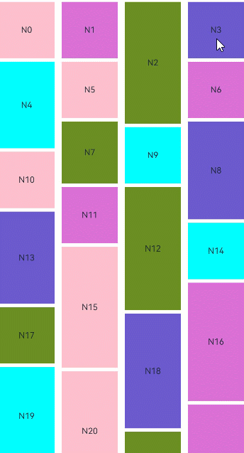
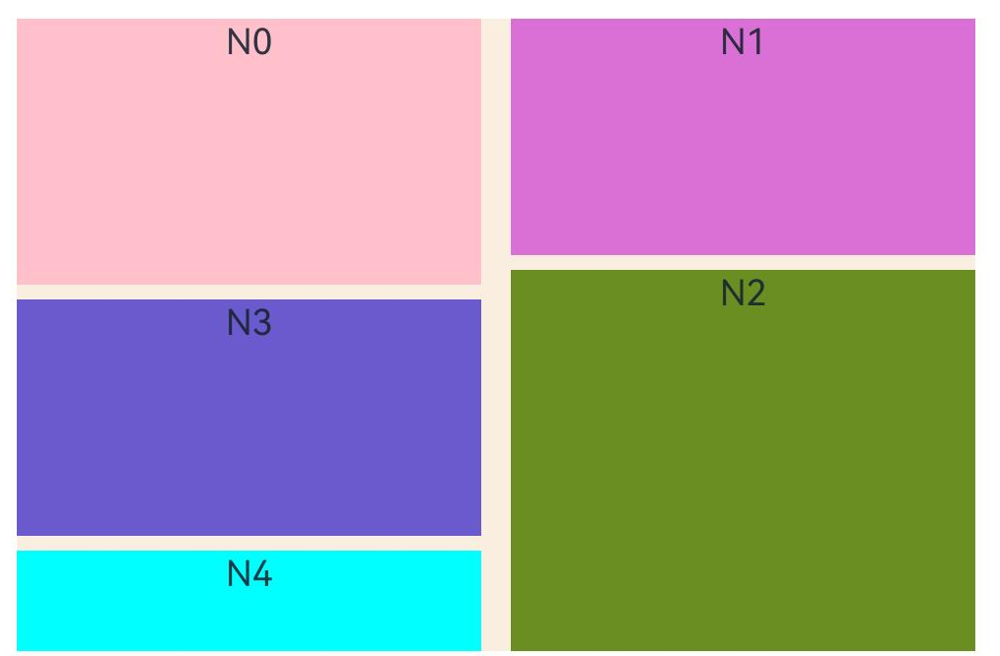
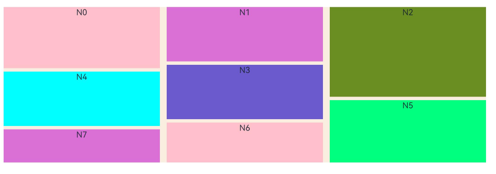
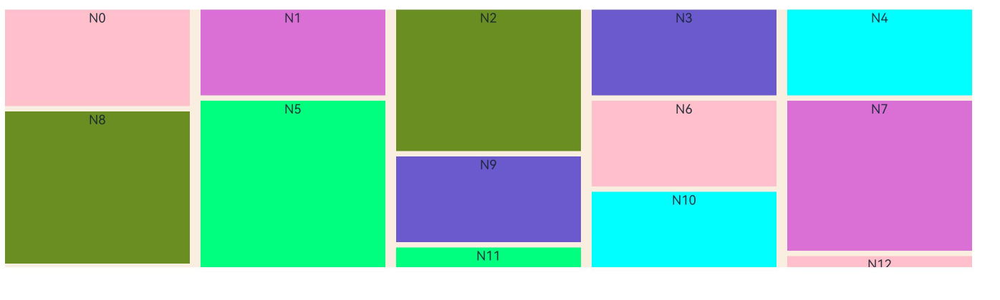
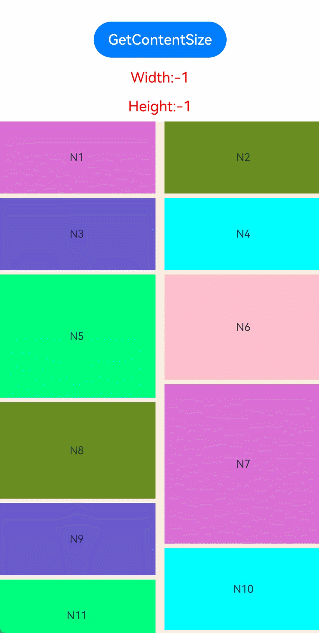

# WaterFlow

<!--Kit: ArkUI-->
<!--Subsystem: ArkUI-->
<!--Owner: @rongShao-Z; @guozejun-->
<!--Designer: @guozejun-->
<!--Tester: @leiyuqian-->
<!--Adviser: @Brilliantry_Rui-->
<!-- md-trans-meta sourceCommit=d78b3fb65ab1cedf6a668b0bed3dbffdd0bd3b5a translatedAt=2026-08-21T02:33:19.591Z pushedAt=2026-08-22T07:28:08.530Z -->

The **WaterFlow** component is a waterfall flow container that consists of cells formed by rows and columns and arranges items of different sizes from top to bottom according to the preset rules. It supports multi-column layout, group mixing layout, lazy loading, auto calculation of the number of columns, and edge fading, and is suitable for scenarios such as image galleries, product displays, and content feeds that need to display content of different sizes.

> **NOTE**
>
> This component is supported since API version 9. Updates will be marked with a superscript to indicate their earliest API version.
>
> The **WaterFlow** component supports displaying the waterfall flow layout, but does not support the editing mode or child element dragging.
>
> The component has built-in gestures for functions such as scroll-following. To add custom gesture operations, refer to [Gesture Blocking Enhancement](ts-gesture-blocking-enhancement.md).
>
> For more development instructions on **WaterFlow**, see [Creating a Waterfall Flow (WaterFlow)](../../../ui/arkts-layout-development-create-waterflow.md). For NDK development, see [Implementing a Waterfall Flow Layout](../../../ui/ndk-waterflow.md). For C APIs, see [ArkUI_NodeAttributeType (Scrollable Container Component Attribute)](../capi-native-node-h-nodeattributetype-scrollablecontainer.md) and [ArkUI_WaterFlowSectionOption](../capi-arkui-nativemodule-arkui-waterflowsectionoption.md).

## Child Components

Only the [FlowItem](ts-container-flowitem.md) child component and custom components are supported. When a custom component is used in **WaterFlow**, you are advised to use **FlowItem** as the top-level component of the custom component. You are not advised to set attributes and event methods for the custom component.

Child components can be dynamically generated using rendering control types [if/else](../../../ui/rendering-control/arkts-rendering-control-ifelse.md), [ForEach](../../../ui/rendering-control/arkts-rendering-control-foreach.md), [LazyForEach](../../../ui/rendering-control/arkts-rendering-control-lazyforeach.md), and [Repeat](../../../ui/rendering-control/arkts-new-rendering-control-repeat.md). **LazyForEach** or **Repeat** is recommended to optimize performance.

> **NOTE**
>
> When the **visibility** attribute of a **WaterFlow** child component is set to **None**, the child component is not displayed, but the **columnsGap**, **rowsGap**, and **margin** around it still take effect.
> When a large number of child components are involved, it is recommended to use methods such as lazy loading, data caching, component reuse, fixed width and height, and layout optimization to improve performance and reduce memory usage. For best practices, see [Optimizing Frame Loss for Waterfall Loading](https://developer.huawei.com/consumer/en/doc/best-practices/bpta-waterflow-performance-optimization).
>
> In vertical layout, **WaterFlow** calculates the accumulated height of the placed child components in each column and places a new child component in the column with the smallest accumulated height to keep the overall layout compact.
>
> When the main axis size of a **FlowItem** changes after it is displayed, **WaterFlow** clears the affected layout information and recalculates the layout positions of the related **FlowItem** components from the changed position or the start position of the current window according to the current [layoutMode](#waterflowlayoutmode12). Because the waterfall flow places the **FlowItem** components that rejoin the layout into the column or row with the smallest current accumulated main axis size, the columns or rows and offsets of these **FlowItem** components may change, which appears as position jumping. To reduce position jumping, it is recommended to keep the main axis size of **FlowItem** stable. For asynchronous content such as images, it is recommended to preset a fixed width and height or a placeholder size. When using group mixing layout, you can also provide a stable main axis size through the [GetItemMainSizeByIndex](#getitemmainsizebyindex12) callback.
>
> When [LazyForEach](../../../ui/rendering-control/arkts-rendering-control-lazyforeach.md) or [Repeat](../../../ui/rendering-control/arkts-new-rendering-control-repeat.md) is used to dynamically generate **FlowItem** components, if the data that affects the main axis size of **FlowItem** changes, the framework should be notified that the data has changed: in the **LazyForEach** scenario, call the corresponding method of [DataChangeListener](ts-rendering-control-lazyforeach.md#datachangelistener) (such as [onDataChange](ts-rendering-control-lazyforeach.md#ondatachange8), [onDataReloaded](ts-rendering-control-lazyforeach.md#ondatareloaded), or [onDatasetChange](ts-rendering-control-lazyforeach.md#ondatasetchange12)); in the **Repeat** scenario, modify the state array according to the data update rules of [Repeat](../../../ui/rendering-control/arkts-new-rendering-control-repeat.md). Otherwise, old nodes or old caches may be reused, causing the displayed content and layout results to be inconsistent with the data.
>
> If multiple columns have the same height, the leftmost column is used first. In RTL mode, the rightmost column is used first.
>
> Since API version 21, the maximum width and height of a single **WaterFlow** child component is 16777216 px. In API version 20 and earlier, the maximum width and height of a single **WaterFlow** child component is 1000000 px. A child component exceeding this size may cause scrolling or display exceptions.

## APIs

WaterFlow(options?: WaterFlowOptions)

Creates a **WaterFlow** component.

**Atomic service API**: This API can be used in atomic services since API version 11.

**System capability**: SystemCapability.ArkUI.ArkUI.Full

**Parameters**

| Name| Type| Mandatory| Description|
| -------- | -------- | -------- | -------- |
| options | [WaterFlowOptions](#waterflowoptions) | No | Parameters of the **WaterFlow** component, used to set the scroll controller, footer component, groups, and layout mode. |

## WaterFlowOptions

Provides parameters of the **WaterFlow** component.

**System capability**: SystemCapability.ArkUI.ArkUI.Full

| Name    | Type                                       | Read-Only| Optional| Description                                    |
| ---------- | ----------------------------------------------- | ------ | -- | -------------------------------------------- |
| footer |  [CustomBuilder](ts-types.md#custombuilder8) | No   | Yes | Footer component of **WaterFlow**, which is used to display custom content (such as loading prompts and bottom identifiers) at the end of the waterfall flow. When not set, the footer component is not displayed.<br/>**NOTE**<br/>1. For details about the usage, see [Example 1](#example-1-using-a-basic-waterflow-component).<br/>2. When both **footer** and **footerContent** are set, the component set by **footerContent** takes precedence.<br/>3. When group mixing layout is used, footer cannot be set separately. You can use the last group as the footer component.<br/>**Atomic service API:** This API can be used in atomic services since API version 11. |
| footerContent<sup>18+</sup> | [ComponentContent](../js-apis-arkui-ComponentContent.md) | No | Yes | Footer component content of **WaterFlow**.<br/>This parameter has a higher priority than **footer**. That is, when both **footer** and **footerContent** are set, the component set by **footerContent** takes precedence. When **footerContent** is not set, footer can still be used to set the footer component. When group mixing layout is used, the footer component cannot be set separately. You can use the last group as the footer component.<br/>**Atomic service API:** This API can be used in atomic services since API version 18.<br/>**Model restriction:** This API can be used only in the stage model. |
| scroller | [Scroller](ts-container-scroll.md#scroller) | No   | Yes | Controller of the scrollable component, bound to the scrollable component. When not set, no external controller is bound, and the component manages scrolling by itself.<br/>**NOTE**<br/>1. It is not allowed to bind the same scroll controller to other scrollable components such as [ArcList](ts-container-arclist.md), [List](ts-container-list.md), [Grid](ts-container-grid.md), [Scroll](ts-container-scroll.md), and [WaterFlow](ts-container-waterflow.md).<br/>2. When the [SLIDING_WINDOW](#waterflowlayoutmode12) layout mode is used, the total offset returned by [currentOffset](ts-container-scroll.md#currentoffset) or [offset](ts-container-scroll.md#offset23) of scroller is inaccurate after a jump or data update is triggered, and is recalibrated when scrolling back to the top.<br/>**Atomic service API:** This API can be used in atomic services since API version 11. |
| sections<sup>12+</sup> |  [WaterFlowSections](#waterflowsections12) | No   | Yes | **FlowItem** groups to implement mixed layout with different numbers of columns for different groups within the same **WaterFlow** component. Suitable for scenarios where different numbers of columns are required in different areas. When not set, a unified number of columns is used for layout.<br/>**NOTE**<br/>1. When group mixing layout is used, the [columnsTemplate](#columnstemplate) and [rowsTemplate](#rowstemplate) attributes are ignored.<br/>2. When group mixing layout is used, **footer** cannot be set separately. You can use the last group as the footer component.<br/>**Atomic service API:** This API can be used in atomic services since API version 12.<br/>**Model restriction:** This API can be used only in the stage model.  |
| layoutMode<sup>12+</sup> |[WaterFlowLayoutMode](#waterflowlayoutmode12) | No | Yes | Layout mode of **WaterFlow**. Select a more suitable mode based on the usage scenario. **ALWAYS_TOP_DOWN** is suitable for scenarios with a fixed number of columns; **SLIDING_WINDOW** is suitable for scenarios such as dynamic number of columns, large data volume, and screen rotation.<br/>**NOTE**<br/>Default value: [ALWAYS_TOP_DOWN](#waterflowlayoutmode12).<br/>**Atomic service API:** This API can be used in atomic services since API version 12.<br/>**Model restriction:** This API can be used only in the stage model. |

## WaterFlowSections<sup>12+</sup>

Describes the water flow item sections.

> **NOTE**
>
> After modifying the group information using **splice**, **push**, or **update**, ensure that the total number of child components in all groups is consistent with the actual total number of child components in the waterfall flow. Otherwise, the waterfall flow may fail to scroll because it cannot be laid out normally.

### constructor

constructor()

A constructor used to create a **WaterFlowSections** object.

**Atomic service API**: This API can be used in atomic services since API version 12.

**Model restriction**: This API can be used only in the stage model.

**System capability**: SystemCapability.ArkUI.ArkUI.Full

### splice<sup>12+</sup>

splice(start: number, deleteCount?: number, sections?: Array\<SectionOptions\>): boolean

Changes sections by removing or replacing an existing section and/or adding a section.

**Atomic service API**: This API can be used in atomic services since API version 12.

**Model restriction**: This API can be used only in the stage model.

**System capability**: SystemCapability.ArkUI.ArkUI.Full

**Parameters**

| Name  | Type                           | Mandatory  | Description                  |
| ---- | ----------------------------- | ---- | -------------------- |
| start | number | Yes   | Zero-based index at which the changing starts. The value is converted to an integer.<br>**NOTE**<br>1. A negative index counts back from the end of the section list. **start + WaterFlowSections.length()** is used.<br>2. If **start** < -**WaterFlowSections.length()**, **0** is used.<br>3. If **start** >= **WaterFlowSections.length()**, a new section is added at the end.|
| deleteCount | number | No   | Number of sections to be deleted from the position specified by **start**.<br>**NOTE**<br>1. If **deleteCount** is omitted, or if its value is greater than or equal to the number of sections from the position specified by **start** to the end of the **WaterFlowSections**, then all sections from the position specified by **start** to the end of the **WaterFlowSections** will be deleted.<br>2. If **deleteCount** is **0** or a negative number, no sections are deleted.|
| sections | Array<[SectionOptions](#sectionoptions12)> | No   | Sections to add to the section list, beginning from the position specified by **start**. If no section is specified, **splice()** will only delete sections from the **WaterFlow** component.|

**Return value**

| Type                                                        | Description                                                        |
| ------------------------------------------------------------ | ------------------------------------------------------------ |
| boolean | Returns **true** if the sections are successfully modified and returns **false** if the modification fails (**itemsCount** of any section to be added is not a non-negative number).|

### push<sup>12+</sup>

push(section: SectionOptions): boolean

Adds the specified sections to the end of the **WaterFlow** component.

**Atomic service API**: This API can be used in atomic services since API version 12.

**Model restriction**: This API can be used only in the stage model.

**System capability**: SystemCapability.ArkUI.ArkUI.Full

**Parameters**

| Name  | Type                           | Mandatory  | Description                  |
| ---- | ----------------------------- | ---- | -------------------- |
| section | [SectionOptions](#sectionoptions12) | Yes    | Group appended to the end of the **WaterFlow**, containing configuration information such as the number of flow items in the group, number of columns/rows, spacing, margin, and main axis size callback. |

**Return value**

| Type                                                        | Description                                                        |
| ------------------------------------------------------------ | ------------------------------------------------------------ |
| boolean | Returns **true** if the section is successfully added; returns **false** if the addition fails (**itemsCount** of the new section is not a non-negative number).|

### update<sup>12+</sup>

update(sectionIndex: number, section: SectionOptions): boolean

Updates the configuration of a specified water flow item section.

**Atomic service API**: This API can be used in atomic services since API version 12.

**Model restriction**: This API can be used only in the stage model.

**System capability**: SystemCapability.ArkUI.ArkUI.Full

**Parameters**

| Name  | Type                           | Mandatory  | Description                  |
| ---- | ----------------------------- | ---- | -------------------- |
| sectionIndex | number | Yes   | Zero-based index of the water flow item section to update. The value is converted to an integer.<br>**NOTE**<br>1. A negative index counts back from the end of the section list. **sectionIndex + WaterFlowSections.length()** is used.<br>2. If **sectionIndex** < -**WaterFlowSections.length()**, **0** is used.<br>3. If **sectionIndex** >= **WaterFlowSections.length()**, a new section is added at the end.|
| section | [SectionOptions](#sectionoptions12) | Yes    | New group information used to replace the **FlowItem** group configuration at the specified index, including the number of flow items, number of columns/rows, spacing, margins, and main axis size callback. |

**Return value**

| Type                                                        | Description                                                        |
| ------------------------------------------------------------ | ------------------------------------------------------------ |
| boolean | Whether the group is updated successfully. The value **true** indicates that the group is updated successfully, and **false** indicates that the update fails (the itemsCount of the new group is not non-negative). |

### values<sup>12+</sup>

values(): Array\<SectionOptions\>

Obtains the configuration of all sections in the **WaterFlow** component.

**Atomic service API**: This API can be used in atomic services since API version 12.

**Model restriction**: This API can be used only in the stage model.

**System capability**: SystemCapability.ArkUI.ArkUI.Full

**Return value**

| Type                                                        | Description                                                        |
| ------------------------------------------------------------ | ------------------------------------------------------------ |
| Array<[SectionOptions](#sectionoptions12)> | Configuration of all sections in the **WaterFlow** component.|

### length<sup>12+</sup>

length(): number

Obtains the number of sections in the **WaterFlow** component.

**Atomic service API**: This API can be used in atomic services since API version 12.

**Model restriction**: This API can be used only in the stage model.

**System capability**: SystemCapability.ArkUI.ArkUI.Full

**Return value**

| Type                                                        | Description                                                        |
| ------------------------------------------------------------ | ------------------------------------------------------------ |
| number | Number of sections in the **WaterFlow** component.|

## SectionOptions<sup>12+</sup>

Describes the configuration of the water flow item section.

**Atomic service API**: This API can be used in atomic services since API version 12.

**Model restriction**: This API can be used only in the stage model.

**System capability**: SystemCapability.ArkUI.ArkUI.Full

| Name| Type| Read-Only| Optional| Description|
|------|-----|-----|----|-----|
| itemsCount | number | No | No | Number of **FlowItem** components in the group, which must be a non-negative number. If the **itemsCount** of any group received by the **splice**, **push**, or **update** method is less than 0, the method does not take effect (returns false). Avoid using a group with **itemsCount** of 0, which may cause layout calculation exceptions.|
| crossCount | number | No| Yes| Number of columns (in vertical layout) or rows (in horizontal layout).<br>Default value: **1**<br> If the value is less than 1, the default value is used.|
| columnsGap | [Dimension](ts-types.md#dimension10) | No| Yes| Column gap of the section. If this parameter is not set, the [columnsGap](#columnsgap) of the **WaterFlow** component is used by default. If an invalid value is set, 0 vp is used.|
| rowsGap | [Dimension](ts-types.md#dimension10) | No| Yes| Row gap of the section. If this parameter is not set, the [rowsGap](#rowsgap) of the **WaterFlow** component is used by default. If an invalid value is set, 0 vp is used.|
| margin | [Margin](ts-types.md#margin) \| [Dimension](ts-types.md#dimension10) | No| Yes| Margins of the section. A value of the **Length** type specifies the margins on all the four sides.<br>Default value: **0**<br>Unit: vp<br>When **margin** is set to a percentage, the width of the **WaterFlow** component is used as the base value for the top, bottom, left, and right margins.|
| onGetItemMainSizeByIndex | [GetItemMainSizeByIndex](#getitemmainsizebyindex12) | No | Yes | Used to obtain the main axis size of the **FlowItem** at the specified index during the layout of the **WaterFlow** component. For a vertical **WaterFlow**, it is the height; for a horizontal **WaterFlow**, it is the width, in vp. When not set, the **WaterFlow** determines the main axis size based on the regular measurement result of the **FlowItem**.<br/>**NOTE**<br/>1. When both **onGetItemMainSizeByIndex** and the width and height attributes of the **FlowItem** are used, the main axis size is subject to the result returned by **onGetItemMainSizeByIndex**, which overrides the main axis length of the **FlowItem**.<br/>2. Using **onGetItemMainSizeByIndex** can improve the efficiency of jumping to a specified position or index in the **WaterFlow**. Avoid mixing groups with and without **onGetItemMainSizeByIndex** set, which may cause layout exceptions.<br/>3. When **onGetItemMainSizeByIndex** returns a negative number, the main axis size of the **FlowItem** is 0.<br/>4. If the main axis size of the **FlowItem** changes dynamically with the data, ensure that the value returned by **onGetItemMainSizeByIndex** is consistent with the data source. When using [LazyForEach](../../../ui/rendering-control/arkts-rendering-control-lazyforeach.md), call [onDataChange](ts-rendering-control-lazyforeach.md#ondatachange8), [onDataReloaded](ts-rendering-control-lazyforeach.md#ondatareloaded), or [onDatasetChange](ts-rendering-control-lazyforeach.md#ondatasetchange12) to notify the framework that the data has changed after the data changes. When using [Repeat](../../../ui/rendering-control/arkts-new-rendering-control-repeat.md), modify the state array according to the data update rules of Repeat. |

## GetItemMainSizeByIndex<sup>12+</sup>

type GetItemMainSizeByIndex = (index: number) => number

Obtains the main axis size of a specified water flow item based on its index.

**Atomic service API**: This API can be used in atomic services since API version 12.

**Model restriction**: This API can be used only in the stage model.

**System capability**: SystemCapability.ArkUI.ArkUI.Full

**Parameters**

| Name  | Type                           | Mandatory  | Description                  |
| ---- | ----------------------------- | ---- | -------------------- |
| index | number | Yes | Index of the **FlowItem** in the **WaterFlow**.<br/>Value range: [0, total number of child components - 1] |

**Return value**

| Type                                                        | Description                                                        |
| ------------------------------------------------------------ | ------------------------------------------------------------ |
| number | Main axis size, in vp, of the water flow item at the specified index, which is the height for a vertical **WaterFlow** component and the width for a horizontal **WaterFlow** component.|

## WaterFlowLayoutMode<sup>12+</sup>

Enumerates the layout modes of the **WaterFlow** component.

**Atomic service API**: This API can be used in atomic services since API version 12.

**Model restriction**: This API can be used only in the stage model.

**System capability**: SystemCapability.ArkUI.ArkUI.Full

| Name| Value| Description|
| ------ | ------ | -------------------- |
| ALWAYS_TOP_DOWN | 0 | Default layout mode where water flow items are arranged from top to bottom. Items in the viewport depend on the layout of all items above them. In cases of jumping to a position or switching column counts, the layout of all items above the viewport must be recalculated.|
| SLIDING_WINDOW | 1 | Moving-window layout mode. Only the layout information within the viewport is considered, and there is no dependency on the flow items above the viewport. Therefore, when jumping backward or switching the number of columns, only the flow items within the viewport need to be laid out. It is recommended to use this mode preferentially, especially in scenarios where the app needs to support screen rotation or dynamically switch the number of columns. <br/>**NOTE**<br/>1. When jumping to a distant position without animation, flow items are laid out forward or backward based on the target position. After that, if you slide back to the position before the jump, the layout effect of the content may be inconsistent with the previous one. This effect may cause the top nodes to be misaligned when sliding back to the top after the jump.<br/> 2. When the **SLIDING_WINDOW** layout mode is used and [WaterFlowSections](#waterflowsections12) groups are set, after the scrolling animation ends, if the viewport contains the start position of a group and it is detected that the column or row start position of the group within the viewport is not aligned, or the start **FlowItem** of the group is inconsistent with the group start index, **WaterFlow** recalculates the layout to correct the group content position.<br/> 3. When the **SLIDING_WINDOW** layout mode is used and [backToTop](ts-container-scrollable-common.md#backtotop15) is called to return to the top, if the top is still not reached after the return-to-top animation ends, **WaterFlow** performs a top correction without animation to realign the content to the start position.<br/> 4. The total offset returned by the [currentOffset](ts-container-scroll.md#currentoffset) or [offset](ts-container-scroll.md#offset23) API of [scroller](#waterflowoptions) is inaccurate after a jump or data update is triggered, and is recalibrated when sliding back to the top. Since API version 23, the offset API is added. <br/> 5. If a jump (such as [scrollToIndex](ts-container-scroll.md#scrolltoindex) or [scrollEdge](ts-container-scroll.md#scrolledge) without animation) and an input offset (such as a sliding gesture or scrolling animation) are called within the same frame, both take effect. <br/> 6. When [scrollToIndex](ts-container-scroll.md#scrolltoindex) without animation is called to jump, if the jump is to a distant position (a position exceeding the number of flow items within the viewport), the moving-window mode estimates the total offset. <br/> 7. The scrollbar [scrollBar](ts-container-scrollable-common.md#scrollbar11) display is supported only in API version 18 and later. In earlier versions, the scrollbar is not displayed even if it is set.|

| Comparison Item| ALWAYS_TOP_DOWN (Default)| SLIDING_WINDOW |
|---------|------------------------|----------------|
| Applicable scenario | Fixed number of columns | Dynamic number of columns, large data volume, and screen rotation |
| Layout policy| Complete layout from the top| Sliding window layout|
| Performance| Depends on all flow items above.| Only considers the layout in the viewport|
| Jump efficiency| Calculates all layouts above| Quick jump without complete calculation|
| Column-count switching| Recalculates all layouts.| Re-lays out only the content in the viewport|
| Screen rotation| Supported, but poor performance| Supported with good performance|
| Scrollbar display| Always supported| Supported in API version 18 and later|
| Layout consistency| Always consistent| May be inconsistent after jump|

## Attributes

In addition to the [universal attributes](ts-component-general-attributes.md) and [universal attributes of scrollable components](ts-container-scrollable-common.md#attributes), the following attributes are supported:
> **NOTE**
>
> When the **WaterFlow** component uses the universal attribute [clip<sup>12+</sup>](ts-universal-attributes-sharp-clipping.md#clip12) and the universal attribute [clip<sup>18+</sup>](ts-universal-attributes-sharp-clipping.md#clip18), the default value is **true**.
>
> The [content clipping mode](ts-container-scrollable-common.md#contentclipmode14) of the **WaterFlow** component is **ContentClipMode.CONTENT_ONLY**, and the padding area is clipped and not displayed.

### columnsTemplate

columnsTemplate(value: string)

Sets the number of columns in the layout of the current **WaterFlow** component. If this attribute is not set, one column is used by default. When [layoutDirection](#layoutdirection) is set to horizontal layout (**FlexDirection.Row** or **FlexDirection.RowReverse**), **columnsTemplate** does not take effect, and the layout is controlled by [rowsTemplate](#rowstemplate). When [sections](#waterflowoptions) is used for group mixing layout, this attribute is ignored.

For example, **'1fr 1fr 2fr'** indicates three columns, with the first column taking up 1/4 of the parent component's full width, the second column 1/4, and the third column 2/4.

You can use **columnsTemplate('repeat(auto-fill,track-size)')** to automatically calculate the number of columns based on the specified column width **track-size**. **repeat** and **auto-fill** are keywords. The units for **track-size** can be px, vp (default), %, or a valid number. For details, see [Example 2](#example-2-implementing-automatic-column-count-calculation).

**Atomic service API**: This API can be used in atomic services since API version 11.

**System capability**: SystemCapability.ArkUI.ArkUI.Full

**Parameters**

| Name| Type  | Mandatory| Description                                          |
| ------ | ------ | ---- | ---------------------------------------------- |
| value  | string | Yes  | Number of columns in the layout.<br>Default value: **'1fr'**|

### columnsTemplate<sup>22+</sup>

columnsTemplate(value: string | ItemFillPolicy)

Sets the number of columns in the layout of the current **WaterFlow** component. If this attribute is not set, one column is used by default. When [layoutDirection](#layoutdirection) is set to horizontal layout (**FlexDirection.Row** or **FlexDirection.RowReverse**), **columnsTemplate** does not take effect, and the layout is controlled by [rowsTemplate](#rowstemplate). When [sections](#waterflowoptions) is used for group mixing layout, this attribute is ignored.

When the value is of the string type, refer to [columnsTemplate(value: string)](#columnstemplate) for the usage.

When the value is of the **ItemFillPolicy** type, the number of columns is determined based on the [breakpoint type](../../../ui/arkts-layout-development-grid-layout.md#breakpoints) corresponding to the width of the **WaterFlow** component.

For example, when the **fillType** attribute of **ItemFillPolicy** is set to **PresetFillType.BREAKPOINT_DEFAULT**, two columns are displayed when the component width falls within the **sm** and smaller breakpoint ranges, three columns are displayed within the **md** breakpoint range, and five columns are displayed within the **lg** and larger breakpoint ranges, with each column being 1fr.

**Atomic service API**: This API can be used in atomic services since API version 22.

**Model restriction**: This API can be used only in the stage model.

**System capability**: SystemCapability.ArkUI.ArkUI.Full

**Parameters**

| Name| Type                                                | Mandatory| Description                                                     |
| ------ | ---------------------------------------------------- | ---- | --------------------------------------------------------- |
| value  | string&nbsp;\|&nbsp;[ItemFillPolicy](ts-types.md#itemfillpolicy22) | Yes   | Number of columns in the current **WaterFlow** component layout. When **value** is of the **ItemFillPolicy** type, the number of columns is automatically determined based on the breakpoint type corresponding to the **WaterFlow** component width. |

### rowsTemplate

rowsTemplate(value: string)

Sets the number of rows in the layout of the current **WaterFlow** component. If this attribute is not set, one row is used by default. When [layoutDirection](#layoutdirection) is set to vertical layout (**FlexDirection.Column** or **FlexDirection.ColumnReverse**) or is not set, **rowsTemplate** does not take effect, and the layout is controlled by [columnsTemplate](#columnstemplate). When [sections](#waterflowoptions) is used for group mixing layout, this attribute is ignored.

For example, **'1fr 1fr 2fr'** indicates three rows, with the first row taking up 1/4 of the parent component's full height, the second row 1/4, and the third row 2/4.

You can use **rowsTemplate('repeat(auto-fill,track-size)')** to automatically calculate the number of rows based on the specified row height **track-size**. **repeat** and **auto-fill** are keywords. The units for **track-size** can be px, vp (default), %, or a valid number.

**Atomic service API**: This API can be used in atomic services since API version 11.

**System capability**: SystemCapability.ArkUI.ArkUI.Full

**Parameters**

| Name| Type  | Mandatory| Description                                          |
| ------ | ------ | ---- | ---------------------------------------------- |
| value  | string | Yes  | Number of rows in the layout.<br>Default value: **'1fr'**|

### itemConstraintSize

itemConstraintSize(value: ConstraintSizeOptions)

Sets the constraint size, which is used to limit the size range of child components during layout. For details about how to use this API, see [Example 1](#example-1-using-a-basic-waterflow-component).

**Atomic service API**: This API can be used in atomic services since API version 11.

**System capability**: SystemCapability.ArkUI.ArkUI.Full

**Parameters**

<!--Table: 10%; auto; 10%; auto-->

| Name| Type                                                      | Mandatory| Description      |
| ------ | ---------------------------------------------------------- | ---- | ---------- |
| value  | [ConstraintSizeOptions](ts-types.md#constraintsizeoptions) | Yes   | Constraint size. If a value less than 0 is set, the parameter does not take effect. <br/>**NOTE**<br/>1. When both **itemConstraintSize** and the [constraintSize](ts-universal-attributes-size.md#constraintsize) attribute of **FlowItem** are set, the maximum value is used for **minWidth**/**minHeight**, and the minimum value is used for **maxWidth**/**maxHeight**. The adjusted values are then processed as the **constraintSize** of **FlowItem**.<br/>2. When only **itemConstraintSize** is set, it is equivalent to setting the same **constraintSize** for all child components of **WaterFlow**.<br/>3. After **itemConstraintSize** is converted to the **constraintSize** of **FlowItem** in either of the two ways above, the effective rules are the same as those of the universal attribute [constraintSize](ts-universal-attributes-size.md#constraintsize).|

### columnsGap

columnsGap(value: Length)

Sets the gap between columns. When group layout is used, each group can set the column gap separately through **SectionOptions.columnsGap** to override this value.

**Atomic service API**: This API can be used in atomic services since API version 11.

**System capability**: SystemCapability.ArkUI.ArkUI.Full

**Parameters**

| Name| Type                        | Mandatory| Description                         |
| ------ | ---------------------------- | ---- | ----------------------------- |
| value  | [Length](ts-types.md#length) | Yes   | Gap between columns. <br/>Default value: **0**<br/>Unit: vp<br/>Value range: [0, +∞). Values less than 0 are treated as 0. |

### rowsGap

rowsGap(value: Length)

Sets the gap between rows. When group layout is used, each group can set the row gap separately through **SectionOptions.rowsGap** to override this value.

**Atomic service API**: This API can be used in atomic services since API version 11.

**System capability**: SystemCapability.ArkUI.ArkUI.Full

**Parameters**

| Name| Type                        | Mandatory| Description                         |
| ------ | ---------------------------- | ---- | ----------------------------- |
| value  | [Length](ts-types.md#length) | Yes   | Gap between rows. <br/>Default value: 0<br/>Unit: vp<br/>Value range: [0, +∞). Values less than 0 are treated as 0. |

### layoutDirection

layoutDirection(value: FlexDirection)

Sets the main axis direction of the layout.

**Atomic service API**: This API can be used in atomic services since API version 11.

**System capability**: SystemCapability.ArkUI.ArkUI.Full

**Parameters**

| Name| Type                                               | Mandatory| Description                                             |
| ------ | --------------------------------------------------- | ---- | ------------------------------------------------- |
| value  | [FlexDirection](ts-appendix-enums.md#flexdirection) | Yes  | Main axis direction of the layout.<br>Default value: **FlexDirection.Column**|

The priority of **layoutDirection** is higher than that of **rowsTemplate** and **columnsTemplate**. The following three modes are available based on the setting of **layoutDirection**:

- **layoutDirection** is set to **FlexDirection.Column** or **FlexDirection.ColumnReverse**

  In this case, **columnsTemplate** is valid. If it is not set, the default value is used. For example, if **columnsTemplate** is set to **'1fr 1fr'** and **rowsTemplate** is set to **'1fr 1fr 1fr'**, the **WaterFlow** component arranges items vertically, dividing the cross axis into two equal columns horizontally.

- **layoutDirection** set to **FlexDirection.Row** or **FlexDirection.RowReverse**

  In this case, **rowsTemplate** is valid. If it is not set, the default value is used. For example, if **columnsTemplate** is set to **'1fr 1fr'** and **rowsTemplate** is set to **'1fr 1fr 1fr'**, the **WaterFlow** component arranges items horizontally, dividing the cross axis into three equal columns vertically.

- **layoutDirection** is not set

  In this case, the default value **FlexDirection.Column** of **layoutDirection** is used, and **columnsTemplate** is valid. For example, if **columnsTemplate** is set to **'1fr 1fr'** and **rowsTemplate** is set to **'1fr 1fr 1fr'**, the **WaterFlow** component arranges items vertically, dividing the cross axis into three equal columns horizontally.

### enableScrollInteraction<sup>10+</sup>

enableScrollInteraction(value: boolean)

Sets whether to support the scrolling gesture.

**Atomic service API**: This API can be used in atomic services since API version 11.

**Model restriction**: This API can be used only in the stage model.

**System capability**: SystemCapability.ArkUI.ArkUI.Full

**Parameters**

| Name| Type   | Mandatory| Description                               |
| ------ | ------- | ---- | ----------------------------------- |
| value  | boolean | Yes  | Whether to support scroll gestures. With the value **true**, scrolling via finger or mouse is enabled. With the value **false**, scrolling via finger or mouse is disabled, but this does not affect the scrolling APIs of the [Scroller](ts-container-scroll.md#scroller).<br>Default value: **true**|

> **NOTE**
>
> The component cannot be scrolled through mouse press-and-drag operations.

### nestedScroll<sup>10+</sup>

nestedScroll(value: NestedScrollOptions)

Sets the nested scrolling mode in the forward and backward directions to implement scrolling linkage with the parent component. For details, see [Example 3: Implementing Nested Scrolling (Method 2)](ts-container-scroll.md#example-3-implementing-nested-scrolling-method-2).

**Atomic service API**: This API can be used in atomic services since API version 11.

**Model restriction**: This API can be used only in the stage model.

**System capability**: SystemCapability.ArkUI.ArkUI.Full

**Parameters**

| Name| Type                                                        | Mandatory| Description          |
| ------ | ------------------------------------------------------------ | ---- | -------------- |
| value  | [NestedScrollOptions](ts-container-scrollable-common.md#nestedscrolloptions10) | Yes   | Nested scroll options, used to set the nested scrolling mode in both forward and backward directions to implement scrolling linkage with the parent component. |

### friction<sup>10+</sup>

friction(value: number | Resource)

Sets the friction coefficient. It takes effect when the scroll area is manually scrolled, affects only the inertial scrolling process, and has an indirect effect on the linkage effect of inertia being transferred to the parent component during nested scrolling. It is suitable for scenarios where the sliding inertia effect of the waterfall flow needs to be adjusted.

**Atomic service API**: This API can be used in atomic services since API version 11.

**Model restriction**: This API can be used only in the stage model.

**System capability**: SystemCapability.ArkUI.ArkUI.Full

**Parameters**

| Name| Type                                                | Mandatory| Description                                                     |
| ------ | ---------------------------------------------------- | ---- | --------------------------------------------------------- |
| value  | number&nbsp;\|&nbsp;[Resource](ts-types.md#resource) | Yes  | Friction coefficient.<br>Default value: **0.9** for wearable devices and **0.6** for non-wearable devices.<br>Since API version 11, the default value for non-wearable devices is **0.7**.<br>Since API version 12, the default value for non-wearable devices is **0.75**.<br>Value range: (0, +∞).<br>If the value is less than or equal to 0, the default value is used.|

### cachedCount<sup>11+</sup>

cachedCount(value: number)

Number of items to be preloaded.

This attribute takes effect only in [LazyForEach](../../../ui/rendering-control/arkts-rendering-control-lazyforeach.md) and [Repeat](../../../ui/rendering-control/arkts-new-rendering-control-repeat.md) with [virtualScroll](ts-rendering-control-repeat.md#virtualscroll) enabled. **FlowItem** components that are outside the display and cache range will be released.

**Atomic service API**: This API can be used in atomic services since API version 12.

**Model restriction**: This API can be used only in the stage model.

**System capability**: SystemCapability.ArkUI.ArkUI.Full

**Parameters**

| Name| Type  | Mandatory| Description                                                        |
| ------ | ------ | ---- | ------------------------------------------------------------ |
| value  | number | Yes  | Number of water flow items to be preloaded (cached).<br>Default value: number of nodes visible on the screen, with the maximum value of 16<br>Value range: [0, +∞).<br>Values less than 0 are treated as **1**.|

### cachedCount<sup>14+</sup>

cachedCount(count: number, show: boolean)

Sets the number of flow items to be cached (preloaded) and specifies whether to display the preloaded nodes.

This attribute can be combined with the [clip](ts-universal-attributes-sharp-clipping.md#clip12) or [clipContent](ts-container-scrollable-common.md#clipcontent14) attributes to display the preloaded nodes.

This parameter takes effect only when used with [LazyForEach](../../../ui/rendering-control/arkts-rendering-control-lazyforeach.md) or the [Repeat](../../../ui/rendering-control/arkts-new-rendering-control-repeat.md) component that has virtualScroll enabled. **FlowItem** elements outside the visible area and cache range will be released.

**Atomic service API**: This API can be used in atomic services since API version 14.

**Model restriction**: This API can be used only in the stage model.

**System capability**: SystemCapability.ArkUI.ArkUI.Full

**Parameters**

| Name| Type  | Mandatory| Description                                    |
| ------ | ------ | ---- | ---------------------------------------- |
| count | number | Yes  | Number of water flow items to be preloaded (cached).<br>Default value: number of nodes visible on the screen, with the maximum value of 16<br>Value range: [0, +∞).<br>Values less than 0 are treated as **1**.|
| show  | boolean | Yes  | Whether to display the cached water flow items. If this parameter is set to **true**, the preloaded flow items are displayed. If this parameter is set to **false**, the preloaded flow items are not displayed.<br> Default value: **false**.|

### syncLoad<sup>20+</sup>

syncLoad(enable: boolean)

Sets whether to synchronously load all child components in the **WaterFlow** component.

**Atomic service API**: This API can be used in atomic services since API version 20.

**Model restriction**: This API can be used only in the stage model.

**System capability**: SystemCapability.ArkUI.ArkUI.Full

**Parameters**

| Name| Type                                                        | Mandatory| Description                                                        |
| ------ | ------------------------------------------------------------ | ---- | ------------------------------------------------------------ |
| enable   | boolean | Yes  | Whether to synchronously load all child components in the **WaterFlow** component.<br>**true**: synchronous loading; false: asynchronous loading<br>Default value: **true**<br>**NOTE**<br>When this parameter is set to **false**, in the first display or [scrollToIndex](ts-container-scroll.md#scrolltoindex) jumps without animation, if the time consumed by the frame layout exceeds 50 ms, the child components that have not been laid out in the **WaterFlow** component are delayed to the next frame for layout.|

### supportEmptyBranchInLazyLoading

supportEmptyBranchInLazyLoading(supported: boolean | undefined)

Defines whether the **WaterFlow** component supports the generation of empty branch nodes that do not contain any child components using the **if/else** rendering control syntax in **LazyForEach** or **Repeat**. If this attribute is not set, empty branch nodes are not supported. This attribute cannot be updated after being set. Therefore, you cannot switch between the behavior of supporting empty branches and the behavior of not supporting empty branches after setting this attribute.

> **NOTE**
>
> When [WaterFlowSections](#waterflowoptions) groups are set through the [sections](#waterflowsections12) parameter, or the [SLIDING_WINDOW](#waterflowoptions) layout mode is set through [layoutMode](#waterflowlayoutmode12), the **FlowItem** components after an empty branch are displayed regardless of the value of **supportEmptyBranchInLazyLoading** or whether it is set.

**Since**: 26.0.0

**Model restriction**: This API can be used only in the stage model.

**Atomic service API:** This API can be used in atomic services since API version 26.0.0.

**System capability**: SystemCapability.ArkUI.ArkUI.Full

**Parameters**

| Name| Type  | Mandatory| Description                                              |
| ------ | ------ | ---- | -------------------------------------------------- |
| supported  | boolean \| undefined | Yes   | Whether the current **WaterFlow** component supports using the [if/else](../../../ui/rendering-control/arkts-rendering-control-ifelse.md) rendering control syntax in [LazyForEach](../../../ui/rendering-control/arkts-rendering-control-lazyforeach.md) or [Repeat](../../../ui/rendering-control/arkts-new-rendering-control-repeat.md) to generate an empty branch node that contains no child components.<br>The value **true** indicates that the FlowItem after the empty branch is displayed, and **false** indicates that it is not displayed.<br>If the value is undefined, it is processed as **false**. |

## Events

In addition to [universal events](ts-component-general-events.md) and [scrollable component common events](ts-container-scrollable-common.md#events), the following events are also supported.

### onReachStart

onReachStart(event: () => void)

Triggered when the **WaterFlow** content reaches the start position.

**Atomic service API**: This API can be used in atomic services since API version 11.

**System capability**: SystemCapability.ArkUI.ArkUI.Full

**Parameters**

| Name| Type| Mandatory| Description|
| ------ | ------ | ------ | ------|
| event | () => void | Yes| Callback triggered when the **WaterFlow** content reaches the start position.|

### onReachEnd

onReachEnd(event: () => void)

Triggered when the **WaterFlow** content reaches the end position.

**Atomic service API**: This API can be used in atomic services since API version 11.

**System capability**: SystemCapability.ArkUI.ArkUI.Full

**Parameters**

| Name| Type| Mandatory| Description|
| ------ | ------ | ------ | ------|
| event | () => void | Yes| Callback triggered when the **WaterFlow** content reaches the end position.|

### onScrollFrameBegin<sup>10+</sup>

onScrollFrameBegin(event: OnScrollFrameBeginCallback)

When this API is called back, the event parameter carries the amount of scrolling that is about to occur. The event handler can calculate the actual amount of scrolling required based on the app scenario and return that value. The waterfall flow scrolls according to the returned actual amount. It is suitable for scenarios where custom scrolling behavior is required, such as adjusting the amount of scrolling per frame proportionally or blocking the scrolling of the current frame under specific conditions.

This event is triggered when either of the following conditions is met:

1. Scrolling is initiated by user interaction (for example, finger swipe, keyboard, or mouse operation).

2. The **WaterFlow** component scrolls by inertia.

3. Scrolling is triggered by calling the [fling](ts-container-scroll.md#fling12) API.

This event is not triggered in the following scenarios:

1. A scroll control API other than [fling](ts-container-scroll.md#fling12) is called.

2. The out-of-bounds bounce effect is active.

3. The scrollbar is dragged.

**Atomic service API**: This API can be used in atomic services since API version 11.

**Model restriction**: This API can be used only in the stage model.

**System capability**: SystemCapability.ArkUI.ArkUI.Full

**Parameters**

| Name| Type                                                   | Mandatory| Description                      |
| ------ | ------------------------------------------------------- | ---- | -------------------------- |
| event | [OnScrollFrameBeginCallback](ts-container-scroll.md#onscrollframebegincallback18)   | Yes  | Callback triggered when each frame scrolling starts.|

### onScrollIndex<sup>11+</sup>

onScrollIndex(event: (first: number, last: number) => void)

Triggered when the first or last item displayed in the component changes. It is triggered once when the component is initialized.

This event is triggered when either of the preceding indexes changes.

>**NOTE**
>
> This API can be called in [attributeModifier](ts-universal-attributes-attribute-modifier.md#attributemodifier) since API version 20.

**Atomic service API**: This API can be used in atomic services since API version 11.

**Model restriction**: This API can be used only in the stage model.

**System capability**: SystemCapability.ArkUI.ArkUI.Full

**Parameters**

| Name| Type  | Mandatory| Description                                 |
| ------ | ------ | ---- | ------------------------------------- |
| first  | number | Mandatory   | Index of the start position of the currently displayed WaterFlow.<br/>Normal value range: [0, total child components - 1]. When the list is empty, special values apply. For details, see the following table. |
| last   | number | Mandatory   | Index of the end position of the currently displayed WaterFlow.<br/>Normal value range: [0, total child components - 1]. When the list is empty, special values apply. For details, see the following table. |

The **last** parameter can be used to determine whether to continue to load data. For details, see the processing logic of adding data in advance when the bottom is about to be touched in [Example 3: Using WaterFlowSections](#example-3-using-waterflowsections).

When the **WaterFlow** component is empty, the return values of the **onScrollIndex** event vary according to the **WaterFlowOptions** parameter. For details, see the following table.

| layoutMode | sections | first | last |
| --- | --- | --- | --- |
| ALWAYS_TOP_DOWN | None| 0 | 0 |
| ALWAYS_TOP_DOWN | Available| 0 | -1 |
| SLIDING_WINDOW | Optional| 1000000 | -1 |

## UIWaterFlowEvent<sup>19+</sup>

Represents the return value of the [getEvent('WaterFlow')](../js-apis-arkui-frameNode.md#geteventwaterflow19) method in **frameNode**, which can be used to set scroll events for a **WaterFlow** node.

**UIWaterFlowEvent** inherits from [UIScrollableCommonEvent](ts-container-scrollable-common.md#uiscrollablecommonevent19).

### setOnWillScroll<sup>19+</sup>

setOnWillScroll(callback:  OnWillScrollCallback | undefined): void

Sets the callback for the [onWillScroll](ts-container-scrollable-common.md#onwillscroll12) event.

If the input parameter is **undefined**, the event callback is reset.

**Atomic service API**: This API can be used in atomic services since API version 19.

**Model restriction**: This API can be used only in the stage model.

**System capability**: SystemCapability.ArkUI.ArkUI.Full

**Parameters**

| Name| Type  | Mandatory| Description                      |
| ------ | ------ | ---- | -------------------------- |
| callback  | [OnWillScrollCallback](ts-container-scrollable-common.md#onwillscrollcallback12)&nbsp;\|&nbsp;undefined | Yes   | Callback for the **onWillScroll** event. |

### setOnDidScroll<sup>19+</sup>

setOnDidScroll(callback: OnScrollCallback | undefined): void

Sets the callback for the [onDidScroll](ts-container-scrollable-common.md#ondidscroll12) event.

> **NOTE**
>
> **setOnWillScroll** is used to set the callback before each frame starts scrolling, and **setOnDidScroll** is used to set the callback after each frame finishes scrolling. The two can be used at the same time, and the callback of **setOnWillScroll** is triggered before that of **setOnDidScroll**.

If the input parameter is **undefined**, the event callback is reset.

**Atomic service API**: This API can be used in atomic services since API version 19.

**Model restriction**: This API can be used only in the stage model.

**System capability**: SystemCapability.ArkUI.ArkUI.Full

**Parameters**

| Name| Type  | Mandatory| Description                      |
| ------ | ------ | ---- | -------------------------- |
| callback  | [OnScrollCallback](ts-container-scrollable-common.md#onscrollcallback12)&nbsp;\|&nbsp;undefined | Yes   | Callback for the **onDidScroll** event. |

### setOnScrollIndex<sup>19+</sup>

setOnScrollIndex(callback: OnWaterFlowScrollIndexCallback | undefined): void

Sets the callback of the [onScrollIndex](#onscrollindex11) event.

If the input parameter is **undefined**, the event callback is reset.

**Atomic service API**: This API can be used in atomic services since API version 19.

**Model restriction**: This API can be used only in the stage model.

**System capability**: SystemCapability.ArkUI.ArkUI.Full

**Parameters**

| Name| Type  | Mandatory| Description                      |
| ------ | ------ | ---- | -------------------------- |
| callback  | [OnWaterFlowScrollIndexCallback](#onwaterflowscrollindexcallback19)&nbsp;\|&nbsp;undefined | Yes  | Callback for the **onScrollIndex** event.|

## OnWaterFlowScrollIndexCallback<sup>19+</sup>

type OnWaterFlowScrollIndexCallback = (first: number, last: number) => void

Represents a callback for item changes in the visible area of the **WaterFlow** component.

**Atomic service API**: This API can be used in atomic services since API version 19.

**Model restriction**: This API can be used only in the stage model.

**System capability**: SystemCapability.ArkUI.ArkUI.Full

**Parameters**

| Name| Type  | Mandatory| Description                                 |
| ------ | ------ | ---- | ------------------------------------- |
| first  | number | Yes   | Index of the start position of the currently displayed WaterFlow.<br/>Normal value range: [0, total child components - 1]. When the list is empty, special values apply. For details, see [onScrollIndex](#onscrollindex11). |
| last   | number | Yes   | Index of the end position of the currently displayed WaterFlow.<br/>Normal value range: [0, total child components - 1]. When the list is empty, special values apply. For details, see [onScrollIndex](#onscrollindex11). |

## Examples

### Example 1: Using a Basic WaterFlow Component

This example demonstrates the basic usage of the **WaterFlow** component, including data loading, attribute setting, and event callbacks.

**WaterFlowDataSource** implements the [IDataSource](ts-rendering-control-lazyforeach.md#idatasource) data source interface of [LazyForEach](../../../ui/rendering-control/arkts-rendering-control-lazyforeach.md), and is used to provide child components to **WaterFlow** through **LazyForEach**.

When a field that affects the width and height of **FlowItem** in the [LazyForEach](../../../ui/rendering-control/arkts-rendering-control-lazyforeach.md) data changes, you need to notify [DataChangeListener](ts-rendering-control-lazyforeach.md#datachangelistener) after modifying the data, for example, by calling [onDataChange](ts-rendering-control-lazyforeach.md#ondatachange8) or [onDataReloaded](ts-rendering-control-lazyforeach.md#ondatareloaded). If only the data content is modified without triggering a data change notification, **LazyForEach** may not refresh the corresponding **FlowItem**.

<!--code_no_check-->

```ts
// WaterFlowDataSource.ets

// An object that implements the IDataSource interface, which is used by the WaterFlow component to load data.
export class WaterFlowDataSource implements IDataSource {
  private dataArray: number[] = [];
  private listeners: DataChangeListener[] = [];

  constructor() {
    for (let i = 0; i < 100; i++) {
      this.dataArray.push(i);
    }
  }

  // Obtain the data corresponding to the specified index.
  public getData(index: number): number {
    return this.dataArray[index];
  }

  // Notify the controller of data reloading.
  notifyDataReload(): void {
    this.listeners.forEach(listener => {
      listener.onDataReloaded();
    });
  }

  // Notify the controller of data addition.
  notifyDataAdd(index: number): void {
    this.listeners.forEach(listener => {
      listener.onDataAdd(index);
    });
  }

  // Notify the controller of data changes.
  notifyDataChange(index: number): void {
    this.listeners.forEach(listener => {
      listener.onDataChange(index);
    });
  }

  // Notify the controller of data deletion.
  notifyDataDelete(index: number): void {
    this.listeners.forEach(listener => {
      listener.onDataDelete(index);
    });
  }

  // Notify the controller of the data location change.
  notifyDataMove(from: number, to: number): void {
    this.listeners.forEach(listener => {
      listener.onDataMove(from, to);
    });
  }

  // Notify the controller of batch data modification.
  notifyDatasetChange(operations: DataOperation[]): void {
    this.listeners.forEach(listener => {
      listener.onDatasetChange(operations);
    });
  }

  // Obtain the total number of data records.
  public totalCount(): number {
    return this.dataArray.length;
  }

  // Register the data change listener.
  registerDataChangeListener(listener: DataChangeListener): void {
    if (this.listeners.indexOf(listener) < 0) {
      this.listeners.push(listener);
    }
  }

  // Unregister the data change listener.
  unregisterDataChangeListener(listener: DataChangeListener): void {
    const pos = this.listeners.indexOf(listener);
    if (pos >= 0) {
      this.listeners.splice(pos, 1);
    }
  }

  // Add data.
  public add1stItem(): void {
    this.dataArray.splice(0, 0, this.dataArray.length);
    this.notifyDataAdd(0);
  }

  // Add an item to the end of the data.
  public addLastItem(): void {
    this.dataArray.splice(this.dataArray.length, 0, this.dataArray.length);
    this.notifyDataAdd(this.dataArray.length - 1);
  }

  // Add an item to the position corresponding to the specified index.
  public addItem(index: number): void {
    this.dataArray.splice(index, 0, this.dataArray.length);
    this.notifyDataAdd(index);
  }

  // Delete the first item.
  public delete1stItem(): void {
    this.dataArray.splice(0, 1);
    this.notifyDataDelete(0);
  }

  // Delete the second item.
  public delete2ndItem(): void {
    this.dataArray.splice(1, 1);
    this.notifyDataDelete(1);
  }

  // Delete the last item.
  public deleteLastItem(): void {
    this.dataArray.splice(-1, 1);
    this.notifyDataDelete(this.dataArray.length);
  }

  // Delete an item at the specified index position.
  public deleteItem(index: number): void {
    this.dataArray.splice(index, 1);
    this.notifyDataDelete(index);
  }

  // Reload data.
  public reload(): void {
    this.dataArray.splice(1, 1);
    this.dataArray.splice(3, 2);
    this.notifyDataReload();
  }

  // Add items according to the value of count to the end of the data.
  public addNewItems(count: number): void {
    let len = this.dataArray.length;
    for (let i = 0; i < count; i++) {
      this.dataArray.push(this.dataArray[len - 1] + i + 1);
      this.notifyDataAdd(this.dataArray.length - 1);
    }
  }

  //Refresh all elements.
  public refreshItems(): void {
    let newDataArray: number[] = [];
    for (let i = 0; i < 100; i++) {
      newDataArray.push(this.dataArray[0] + i + 1000);
    }
    this.dataArray = newDataArray;
    this.notifyDataReload();
  }
}
```

<!--code_no_check-->

```ts
// Index.ets
import { WaterFlowDataSource } from './WaterFlowDataSource';

enum FooterState {
  LOADING = 0,
  END = 1
}

@Entry
@Component
struct WaterFlowDemo {
  @State minSize: number = 80;
  @State maxSize: number = 180;
  @State colors: number[] = [0xFFC0CB, 0xDA70D6, 0x6B8E23, 0x6A5ACD, 0x00FFFF, 0x00FF7F];
  @State footerState: FooterState = FooterState.LOADING;
  dataSource: WaterFlowDataSource = new WaterFlowDataSource();
  private itemHeightArray: number[] = [];

  // Calculate the width and height of a flow item.
  getSize() {
    let ret = Math.floor(Math.random() * this.maxSize);
    return (ret > this.minSize ? ret : this.minSize);
  }

  // Set the width and height array of the water flow item.
  setItemSizeArray() {
    for (let i = 0; i < 100; i++) {
      this.itemHeightArray.push(this.getSize());
    }
  }

  // Component lifecycle: Initialize the size array when the component is about to appear.
  aboutToAppear() {
    this.setItemSizeArray();
  }

  @Builder
  itemFoot() {
    // Note: Do not use the IfElse node as the root node of the footer.
    // The IfElse node must be wrapped by a container (such as Column, Row, or Stack) to ensure correct layout.
    Column() {
      if (this.footerState == FooterState.LOADING) {
        Text('Loading...')
          .fontSize(10)
          .backgroundColor(Color.Red)
          .width(50)
          .height(50)
          .align(Alignment.Center)
          .margin({ top: 2 })
      } else if (this.footerState == FooterState.END) {
        Text('End')
          .fontSize(10)
          .backgroundColor(Color.Red)
          .width(50)
          .height(50)
          .align(Alignment.Center)
          .margin({ top: 2 })
      } else {
        Text(`Footer`)
          .fontSize(10)
          .backgroundColor(Color.Red)
          .width(50)
          .height(50)
          .align(Alignment.Center)
          .margin({ top: 2 })
      }
    }
  }

  build() {
    Column({ space: 2 }) {
      WaterFlow({ footer: this.itemFoot() }) {
        LazyForEach(this.dataSource, (item: number) => {
          FlowItem() {
            Column() {
              Text('N' + item).fontSize(12).height('16')
              // Note: Ensure that the corresponding JPG file exists.
              Image('res/waterFlowTest(' + item % 5 + ').jpg')
                .objectFit(ImageFit.Fill)
                .width('100%')
                .layoutWeight(1)
            }
          }
          .width('100%')
          .height(this.itemHeightArray[item % 100])
          .backgroundColor(this.colors[item % this.colors.length])
        }, (item: number) => item.toString())
      }
      .columnsTemplate('1fr 1fr')    // Set the layout of two columns with equal width.
      .columnsGap(10)
      .rowsGap(5)
      .backgroundColor(0xFAEEE0)
      .width('100%')
      .height('100%')
      .itemConstraintSize({minWidth:80,maxWidth:180,minHeight:80,maxHeight:180})
      // Load data when the scroll reaches the bottom.
      .onReachEnd(() => {
        console.info('onReachEnd');

        // Simulate pagination loading. The loading stops when the number of data records exceeds 200.
        if (this.dataSource.totalCount() > 200) {
          this.footerState = FooterState.END;
          return;
        }
        setTimeout(() => {
          for (let i = 0; i < 100; i++) {
            this.dataSource.addLastItem();
          }
        }, 1000);
      })
      .onReachStart(() => {
        // Triggered when the scroll reaches the top.
        console.info('waterFlow reach start');
      })
      .onScrollStart(() => {
        // Triggered when the scroll starts.
        console.info('waterFlow scroll start');
      })
      .onScrollStop(() => {
        // Triggered when the scroll stops.
        console.info('waterFlow scroll stop');
      })
      .onScrollFrameBegin((offset: number, state: ScrollState) => {
        // Triggered when the scroll frame starts. You can control the scroll behavior.
        // offset: scroll offset; state: scroll state
        console.info('waterFlow scrollFrameBegin offset: ' + offset + ' state: ' + state.toString());
        return { offsetRemain: offset }; // Return the actual scroll offset you expect.
      })
    }
  }
}
```


### Example 2: Implementing Automatic Column Count Calculation

This example showcases how to implement automatic column count calculation using the **auto-fill** feature.

For details about **WaterFlowDataSource** and the complete code, see [Example 1: Using a Basic WaterFlow Component](#example-1-using-a-basic-waterflow-component).

<!--code_no_check-->

```ts
// Index.ets
import { WaterFlowDataSource } from './WaterFlowDataSource';

@Entry
@Component
struct WaterFlowDemo {
  @State minSize: number = 80;
  @State maxSize: number = 180;
  @State colors: number[] = [0xFFC0CB, 0xDA70D6, 0x6B8E23, 0x6A5ACD, 0x00FFFF, 0x00FF7F];
  dataSource: WaterFlowDataSource = new WaterFlowDataSource();
  private itemWidthArray: number[] = [];
  private itemHeightArray: number[] = [];

  // Calculate the width and height of a flow item.
  getSize() {
    let ret = Math.floor(Math.random() * this.maxSize);
    return (ret > this.minSize ? ret : this.minSize);
  }

  // Set the width and height array of the flow item.
  setItemSizeArray() {
    for (let i = 0; i < 100; i++) {
      this.itemWidthArray.push(this.getSize());
      this.itemHeightArray.push(this.getSize());
    }
  }

  // Component lifecycle: Initialize the size array when the component is about to appear.
  aboutToAppear() {
    this.setItemSizeArray();
  }

  build() {
    Column({ space: 2 }) {
      WaterFlow() {
        LazyForEach(this.dataSource, (item: number) => {
          FlowItem() {
            Column() {
              Text('N' + item).fontSize(12).height('16')
              // The image is displayed only when the corresponding JPG file exists.
              Image('res/waterFlowTest(' + item % 5 + ').jpg')
            }
          }
          .width('100%')
          .height(this.itemHeightArray[item % 100])
          .backgroundColor(this.colors[item % this.colors.length])
        }, (item: number) => item.toString())
      }
      // auto-fill: automatically calculates the number of columns.
      // repeat (auto-fill, 80) indicates that the number of columns that can be placed is automatically calculated based on the container width.
      // For example, if the container width is 400 px, the number of columns is automatically calculated as 5 (400/80 = 5).
      .columnsTemplate('repeat(auto-fill,80)')
      .columnsGap(10)
      .rowsGap(5)
      .padding({left:5})
      .backgroundColor(0xFAEEE0)
      .width('100%')
      .height('100%')
    }
  }
}
```


### Example 3: Using WaterFlowSections

This example demonstrates the initialization of groups and the different effects of the **splice**, **update**, **values**, and **length** APIs.

For usage with state management V2, see [WaterFlow and makeObserved](../../../ui/state-management/arkts-v1-v2-migration-inner-object.md#scrollable-component).

For details about **WaterFlowDataSource** and the complete code, see [Example 1: Using a Basic WaterFlow Component](#example-1-using-a-basic-waterflow-component).

<!--code_no_check-->

```ts
// Index.ets
import { WaterFlowDataSource } from './WaterFlowDataSource';

// Reusable component: optimizes performance and reduces the overhead of creating and destroying components.
@Reusable
@Component
struct ReusableFlowItem {
  @State item: number = 0;

  // Component reuse lifecycle: called when data is obtained from the reuse cache.
  // Update the component status and display new content.
  aboutToReuse(params: Record<string, number>) {
    this.item = params.item;
    console.info('Reuse item:' + this.item);
  }

  // Record the component creation log.
  aboutToAppear() {
    console.info('new item:' + this.item);
  }

  build() {
    Column() {
      // Note: Ensure that the corresponding JPG file exists.
      Image('res/waterFlowTest(' + this.item % 5 + ').jpg')
        .overlay('N' + this.item, { align: Alignment.Top })
        .objectFit(ImageFit.Fill)
        .width('100%')
        .layoutWeight(1)
    }
  }
}

@Entry
@Component
struct WaterFlowDemo {
  minSize: number = 80;
  maxSize: number = 180;
  colors: number[] = [0xFFC0CB, 0xDA70D6, 0x6B8E23, 0x6A5ACD, 0x00FFFF, 0x00FF7F];
  scroller: Scroller = new Scroller();
  dataSource: WaterFlowDataSource = new WaterFlowDataSource();
  dataCount: number = this.dataSource.totalCount();
  private itemWidthArray: number[] = [];
  private itemHeightArray: number[] = [];
  // Section management: core feature of WaterFlow. Different numbers of columns can be used in different areas.
  @State sections: WaterFlowSections = new WaterFlowSections();
  // Section margin configuration: unified outer margin setting.
  sectionMargin: Margin = { top: 10, left: 5, bottom: 10, right: 5 };

  oneColumnSection: SectionOptions = {
    itemsCount: 4,                     // The section contains four FlowItem components.
    crossCount: 1,                     // Use the one-column layout.
    columnsGap: 5,
    rowsGap: 10,
    margin: this.sectionMargin,
    // Callback: dynamically set the height of each item.
    onGetItemMainSizeByIndex: (index: number) => {
      return this.itemHeightArray[index % 100];
    }
  };

  // Second type of section: two-column layout, which is suitable for displaying list content.
  twoColumnSection: SectionOptions = {
    itemsCount: 2,                     // The section contains two FlowItem components.
    crossCount: 2,                     // Use the two-column layout.
    // Callback: fixed height of 100px
    onGetItemMainSizeByIndex: (index: number) => {
      return 100;
    }
  };

  // Last section: used to process remaining data.
  lastSection: SectionOptions = {
    itemsCount: 20,                    // The section contains 20 FlowItem components.
    crossCount: 2,                     // Use the two-column layout.
    // Callback: random height.
    onGetItemMainSizeByIndex: (index: number) => {
      return this.itemHeightArray[index % 100];
    }
  };

  // Calculate the height for FlowItem.
  getSize() {
    let ret = Math.floor(Math.random() * this.maxSize);
    return (ret > this.minSize ? ret : this.minSize);
  }

  // Set the height array for FlowItem.
  setItemSizeArray() {
    for (let i = 0; i < 100; i++) {
      this.itemHeightArray.push(this.getSize());
    }
  }

  // Initialize the data and WaterFlow group configuration.
  aboutToAppear() {
    this.setItemSizeArray();

    // Initialize the section information: Use the single-column and dual-column layouts alternately.
    let sectionOptions: SectionOptions[] = [];
    let count = 0;                     // Number of allocated FlowItem components.
    let oneOrTwo = 0;                  // Select the section type alternately.

    while (count < this.dataCount) {
      // If there are less than 20 remaining items, use the last section for processing.
      if (this.dataCount - count < 20) {
        this.lastSection.itemsCount = this.dataCount - count;
        sectionOptions.push(this.lastSection);
        break;
      }

      // Use the single-column and dual-column layouts alternately.
      if (oneOrTwo++ % 2 == 0) {
        sectionOptions.push(this.oneColumnSection);
        count += this.oneColumnSection.itemsCount;
      } else {
        sectionOptions.push(this.twoColumnSection);
        count += this.twoColumnSection.itemsCount;
      }
    }

    // Add the configured section to WaterFlow.
    this.sections.splice(0, 0, sectionOptions);
  }

  build() {
    Column({ space: 2 }) {
      Row() {
        Button('splice')
          .height('5%')
          .onClick(() => {
            // Important: The total number of data items in LazyForEach must be consistent with the cumulative sum of itemsCount in the new section.
            let totalCount: number = this.dataSource.totalCount();
            let newSection: SectionOptions = {
              itemsCount: totalCount,
              crossCount: 2,
              onGetItemMainSizeByIndex: (index: number) => {
                return this.itemHeightArray[index % 100];
              }
            };
            let oldLength: number = this.sections.length();
            this.sections.splice(0, oldLength, [newSection]); // Replace all sections.
          })
          .margin({ top: 10, left: 20 })

        Button('update')
          .height('5%')
          .onClick(() => {
            // Add four FlowItem components to the first section.
            // Important: Ensure that the data source and itemsCount are updated synchronously.
            const sections: Array<SectionOptions> = this.sections.values();
            let newSection: SectionOptions = sections[0];

            // Add four new items to the data source.
            this.dataSource.addItem(this.oneColumnSection.itemsCount);
            this.dataSource.addItem(this.oneColumnSection.itemsCount + 1);
            this.dataSource.addItem(this.oneColumnSection.itemsCount + 2);
            this.dataSource.addItem(this.oneColumnSection.itemsCount + 3);

            // Update itemsCount of the section.
            newSection.itemsCount += 4;
            const result: boolean = this.sections.update(0, newSection);
            console.info('update:' + result);
          })
          .margin({ top: 10, left: 20 })
      }.margin({ bottom: 20 })

      Row() {
        Button('delete')
          .height('5%')
          .onClick(() => {
            // Delete four FlowItem components from the first section.
            // Important: Ensure that the data source and itemsCount are updated synchronously.
            const sections: Array<SectionOptions> = this.sections.values();
            let newSection: SectionOptions = sections[0];

            // Check whether there are sufficient items to be deleted.
            if (newSection.itemsCount < 4) {
              return;
            }

            //Delete four items from the data source.
            this.dataSource.deleteItem(this.oneColumnSection.itemsCount - 1);
            this.dataSource.deleteItem(this.oneColumnSection.itemsCount - 2);
            this.dataSource.deleteItem(this.oneColumnSection.itemsCount - 3);
            this.dataSource.deleteItem(this.oneColumnSection.itemsCount - 4);

            // Update itemsCount of the section.
            newSection.itemsCount -= 4;
            this.sections.update(0, newSection);
          })
          .margin({ top: 10, left: 20 })

        Button('values')
          .height('5%')
          .onClick(() => {
            const sections: Array<SectionOptions> = this.sections.values();
            for (const value of sections) {
              console.info(JSON.stringify(value));
            }
            console.info('count:' + this.sections.length());
          })
          .margin({ top: 10, left: 20 })
      }

      WaterFlow({ scroller: this.scroller, sections: this.sections }) {
        LazyForEach(this.dataSource, (item: number) => {
          FlowItem() {
            // Use reusable components to improve performance.
            ReusableFlowItem({ item: item })
          }
          .width('100%')
          // Note: If both onGetItemMainSizeByIndex and height are set,
          // the main-axis size is subject to the return result of onGetItemMainSizeByIndex.
          .height(this.itemHeightArray[item % 100])
          .backgroundColor(this.colors[item % this.colors.length])
        }, (item: number) => item.toString())
      }
      .columnsTemplate('1fr 1fr')
      .columnsGap(10)
      .rowsGap(5)
      .backgroundColor(0xFAEEE0)
      .width('100%')
      .height('100%')
      .layoutWeight(1)
      .onScrollIndex((first: number, last: number) => {
        // Scroll listener: Load more data when the scroll is about to reach the bottom.
        if (last + 20 >= this.dataSource.totalCount()) {
          // Add 100 new items to the data source.
          for (let i = 0; i < 100; i++) {
            this.dataSource.addLastItem();
          }

          // Important: After the data source is updated, sections must be updated synchronously.
          // Change the number of flow items in the last section.
          const sections: Array<SectionOptions> = this.sections.values();
          let newSection: SectionOptions = sections[this.sections.length() - 1];
          newSection.itemsCount += 100;
          this.sections.update(-1, newSection); // -1 indicates the last section.
        }
      })
    }
  }
}
```


### Example 4: Using the Pinch Gesture to Change the Column Count

This example demonstrates how to use [priorityGesture](ts-gesture-settings.md#prioritygesture) and [PinchGesture](ts-basic-gestures-pinchgesture.md) to implement the feature of using a pinch gesture to change the number of columns in a layout.

For details about **WaterFlowDataSource** and the complete code, see [Example 1: Using a Basic WaterFlow Component](#example-1-using-a-basic-waterflow-component).

<!--code_no_check-->

```ts
// Index.ets
import { WaterFlowDataSource } from './WaterFlowDataSource';
import { image } from '@kit.ImageKit';
import { BusinessError } from '@kit.BasicServicesKit';

// Reusable component: optimizes performance and reduces the overhead of creating and destroying components.
@Reusable
@Component
struct ReusableFlowItem {
  @State item: number = 0;

  // Invoked when a reusable custom component is added to the component tree from the reuse cache. The component's state variable can be updated here to display the correct content.
  aboutToReuse(params: Record<string, number>) {
    this.item = params.item;
  }

  build() {
    Column() {
      Text('N' + this.item).fontSize(12).height('16')
      // Note: Ensure that the corresponding JPG file exists.
      Image('res/waterFlow(' + this.item % 5 + ').jpg')
        .objectFit(ImageFit.Fill)
        .width('100%')
        .layoutWeight(1)
    }
  }
}

@Entry
@Component
struct WaterFlowDemo {
  minSize: number = 80;
  maxSize: number = 180;
  colors: number[] = [0xFFC0CB, 0xDA70D6, 0x6B8E23, 0x6A5ACD, 0x00FFFF, 0x00FF7F];
  dataSource: WaterFlowDataSource = new WaterFlowDataSource();
  private itemWidthArray: number[] = [];
  private itemHeightArray: number[] = [];
  @State columns: number = 2;
  @State waterFlowScale: number = 1;
  @State imageScale: number = 1;
  @State waterFlowOpacity: number = 1;
  @State waterFlowSnapshot: image.PixelMap | undefined = undefined;
  private columnChanged: boolean = false;
  private oldColumn: number = this.columns;
  private pinchTime: number = 0;

  // Calculate the width and height of a flow item.
  getSize() {
    let ret = Math.floor(Math.random() * this.maxSize);
    return (ret > this.minSize ? ret : this.minSize);
  }

  // Set the width and height array of the water flow item.
  setItemSizeArray() {
    for (let i = 0; i < 100; i++) {
      this.itemWidthArray.push(this.getSize());
      this.itemHeightArray.push(this.getSize());
    }
  }

  // Component lifecycle: Initialize data and restore the previous column settings.
  aboutToAppear() {
    // Read the last column count.
    let lastCount = AppStorage.get<number>('columnsCount');
    if (typeof lastCount != 'undefined') {
      this.columns = lastCount;
    }
    this.setItemSizeArray();
  }

  // Change the number of columns based on the scale threshold and trigger re-layout for the WaterFlow component.
  changeColumns(scale: number) {
    if (scale > (this.columns / (this.columns - 0.5)) && this.columns > 1) {
      this.columns--;
      this.columnChanged = true;
    } else if (scale < 1 && this.columns < 4) {
      this.columns++;
      this.columnChanged = true;
    }
  }

  build() {
    Column({ space: 2 }) {
      Row() {
        Text('Pinch to change the number of columns')
          .height('5%')
          .margin({ top: 10, left: 20 })
      }

      Stack() {
        // Display the WaterFlow snapshot before scaling.
        Image(this.waterFlowSnapshot)
          .width('100%')
          .height('100%')
          .scale({
            x: this.imageScale,
            y: this.imageScale,
            centerX: 0,
            centerY: 0
          })
        
        WaterFlow() {
          LazyForEach(this.dataSource, (item: number) => {
            FlowItem() {
              // Use reusable components to improve performance.
              ReusableFlowItem({ item: item })
            }
            .width('100%')
            .aspectRatio(this.itemHeightArray[item % 100] / this.itemWidthArray[item%100])
            .backgroundColor(this.colors[item % this.colors.length])
          }, (item: number) => item.toString())
        }
        .id('waterflow') // Set the ID for capturing snapshots.
        .columnsTemplate('1fr '.repeat(this.columns))  // Dynamically generate a column template. For example, '1fr 1fr 1fr' indicates three columns with the same width.
        .backgroundColor(0xFAEEE0)
        .width('100%')
        .height('100%')
        .layoutWeight(1)
        .opacity(this.waterFlowOpacity)
        .scale({
          x: this.waterFlowScale,
          y: this.waterFlowScale,
          centerX: 0,
          centerY: 0
        })
        .priorityGesture(
          PinchGesture()
            .onActionStart((event: GestureEvent) => {
              // Take a snapshot when the pinch gesture is recognized.
              this.pinchTime = event.timestamp;
              this.columnChanged = false;
              this.oldColumn = this.columns;
              this.getUIContext().getComponentSnapshot().get('waterflow', (error: Error, pixmap: image.PixelMap) => {
                if (error) {
                  const err: BusinessError = error as BusinessError;
                  console.error(`Failed to get component snapshot. Code: ${err.code}, message: ${err.message}`);
                  return;
                }
                this.waterFlowSnapshot = pixmap;
              });
            })
            .onActionUpdate((event: GestureEvent) => {
              // Gesture update: Process the scaling logic and visual effect.
              // Boundary restriction: Prevent scaling when the column number exceeds the range.
              if ((this.oldColumn === 1 && event.scale > 1) || (this.oldColumn === 4 && event.scale < 1)) {
                return;
              }

              // Throttling: Prevent frequent updates to improve performance.
              if (event.timestamp - this.pinchTime < 10000000) {
                return;
              }
              this.pinchTime = event.timestamp;

              this.waterFlowScale = event.scale;
              this.imageScale = event.scale;
              // Set the WaterFlow opacity based on the scale factor.
              this.waterFlowOpacity = (this.waterFlowScale > 1) ? (this.waterFlowScale - 1) : (1 - this.waterFlowScale);
              this.waterFlowOpacity *= 3;
              if (!this.columnChanged) {
                this.changeColumns(event.scale);
              }

              // Adjust the scale factor after the number of columns changes to avoid blank areas.
              if (this.columnChanged) {
                this.waterFlowScale = this.imageScale * this.columns / this.oldColumn;

                // Limit the scale range to ensure natural visual effects.
                if (event.scale < 1) {
                  this.waterFlowScale = this.waterFlowScale > 1 ? this.waterFlowScale : 1;
                } else {
                  this.waterFlowScale = this.waterFlowScale < 1 ? this.waterFlowScale : 1;
                }
              }
            })
            .onActionEnd((event: GestureEvent) => {
              // End the gesture: Perform the animation of returning to the original position and save the status.
              // Perform the animation of returning to the original position: Smoothly transition to the normal state.
              this.getUIContext()?.animateTo({ duration: 300 }, () => {
                this.waterFlowScale = 1;
                this.waterFlowOpacity = 1;
              });

              // Persistently save the current number of columns. Restore the number of columns when the application is started next time.
              AppStorage.setOrCreate<number>('columnsCount', this.columns);
            })
        )
      }
    }
  }
}
```


### Example 5: Setting the Edge Fading Effect

This example demonstrates how to enable the edge fading effect for the **WaterFlow** component using the [fadingEdge](ts-container-scrollable-common.md#fadingedge14) API and set the length of the fading edge using the **fadingEdgeLength** parameter.

For details about **WaterFlowDataSource** and the complete code, see [Example 1: Using a Basic WaterFlow Component](#example-1-using-a-basic-waterflow-component).

<!--code_no_check-->

```ts
// Index.ets
import { LengthMetrics } from '@kit.ArkUI';
import { WaterFlowDataSource } from './WaterFlowDataSource';

@Entry
@Component
struct WaterFlowDemo {
  @State minSize: number = 80;
  @State maxSize: number = 180;
  @State colors: number[] = [0xFFC0CB, 0xDA70D6, 0x6B8E23, 0x6A5ACD, 0x00FFFF, 0x00FF7F];
  dataSource: WaterFlowDataSource = new WaterFlowDataSource();
  scroller: Scroller = new Scroller();
  private itemWidthArray: number[] = [];
  private itemHeightArray: number[] = [];

  // Calculate the width and height of a flow item.
  getSize() {
    let ret = Math.floor(Math.random() * this.maxSize);
    return (ret > this.minSize ? ret : this.minSize);
  }

  // Set the width and height array of the flow item.
  setItemSizeArray() {
    for (let i = 0; i < 100; i++) {
      this.itemWidthArray.push(this.getSize());
      this.itemHeightArray.push(this.getSize());
    }
  }

  // Component lifecycle: Initialize the size array when the component is about to appear.
  aboutToAppear() {
    this.setItemSizeArray();
  }

  build() {
    Column({ space: 2 }) {
      WaterFlow({ scroller: this.scroller }) {
        LazyForEach(this.dataSource, (item: number) => {
          FlowItem() {
            Column() {
              Text('N' + item).fontSize(12).height('16')
            }
          }
          .width('100%')
          .height(this.itemHeightArray[item % 100])
          .backgroundColor(this.colors[item % 5])
        }, (item: number) => item.toString())
      }
      // auto-fill: Calculate the number of columns that can be placed based on the container width.
      .columnsTemplate('repeat(auto-fill,80)')
      .columnsGap(10)
      .rowsGap(5)
      .height('90%')
      .scrollBar(BarState.On)
      // Edge fading effect: Create a fade transition effect at the scrolling edges.
      // true: Enable the fading effect.
      // fadingEdgeLength: LengthMetrics.vp(80): The fading area is 80 vp in length.
      // Effect: There is a fading transition area of 80 vp at the top and bottom edges of the waterflow.
      .fadingEdge(true, { fadingEdgeLength: LengthMetrics.vp(80) })
    }
  }
}
```


### Example 6: Setting the Single-Side Edge Effect

This example uses the [edgeEffect](ts-container-scrollable-common.md#edgeeffect11) API to set the single-side edge effect for the **WaterFlow** component.

For details about **WaterFlowDataSource** and the complete code, see [Example 1: Using a Basic WaterFlow Component](#example-1-using-a-basic-waterflow-component).

<!--code_no_check-->

```ts
// Index.ets
import { WaterFlowDataSource } from './WaterFlowDataSource';

@Entry
@Component
struct WaterFlowDemo {
  @State minSize: number = 80;
  @State maxSize: number = 180;
  @State colors: number[] = [0xFFC0CB, 0xDA70D6, 0x6B8E23, 0x6A5ACD, 0x00FFFF, 0x00FF7F];
  dataSource: WaterFlowDataSource = new WaterFlowDataSource();
  scroller: Scroller = new Scroller();
  private itemWidthArray: number[] = [];
  private itemHeightArray: number[] = [];

  // Calculate the width and height of a flow item.
  getSize() {
    let ret = Math.floor(Math.random() * this.maxSize);
    return (ret > this.minSize ? ret : this.minSize);
  }

  // Set the width and height array of the flow item.
  setItemSizeArray() {
    for (let i = 0; i < 100; i++) {
      this.itemWidthArray.push(this.getSize());
      this.itemHeightArray.push(this.getSize());
    }
  }

  // Component lifecycle: Initialize the size array when the component is about to appear.
  aboutToAppear() {
    this.setItemSizeArray();
  }

  build() {
    Column({ space: 2 }) {
      WaterFlow({ scroller: this.scroller }) {
        LazyForEach(this.dataSource, (item: number) => {
          FlowItem() {
            Column() {
              Text('N' + item).fontSize(12).height('16')
            }
          }
          .width('100%')
          .height(this.itemHeightArray[item % 100])
          .backgroundColor(this.colors[item % 5])
        }, (item: number) => item.toString())
      }
      // auto-fill: Calculate the number of columns that can be placed based on the container width.
      .columnsTemplate('repeat(auto-fill,80)')
      .columnsGap(10)
      .rowsGap(5)
      .height('90%')
      // Single-side edge effect: Set the spring effect, which takes effect only at the top.
      // EdgeEffect.Spring: spring rebound effect that provides an elastic bounce when sliding to the boundary.
      // alwaysEnabled: true: The edge effect is always enabled, even if the content is not enough to scroll.
      // effectEdge: EffectEdge.START: The effect takes effect only at the start edge (top).
      // Effect: The spring rebound effect is displayed only when scrolling up to the top, but not when scrolling down to the bottom.
      .edgeEffect(EdgeEffect.Spring, { alwaysEnabled: true, effectEdge: EffectEdge.START })

    }
  }
}
```


### Example 7: Setting and Changing the Footer Component in the WaterFlow Component

In API version 18 and later versions, this example demonstrates how to set the footer component in the **WaterFlow** component using the **footerContent** API of [WaterFlowOptions](#waterflowoptions). The footer component is updated using the **update** function of [ComponentContent](../js-apis-arkui-ComponentContent.md).

For details about **WaterFlowDataSource** and the complete code, see [Example 1: Using a Basic WaterFlow Component](#example-1-using-a-basic-waterflow-component).

<!--code_no_check-->

```ts
// Index.ets
import { ComponentContent, UIContext } from '@kit.ArkUI';
import { WaterFlowDataSource } from './WaterFlowDataSource';

class Params {
  text: string = '';

  constructor(text: string) {
    this.text = text;
  }
}

// Builder function: builds the UI structure of the footer component.
@Builder
function buildText(params: Params) {
  Column() {
    Text(params.text)
      .fontSize(20)
      .fontWeight(FontWeight.Bold)
      .margin(20)
  }
}

@Entry
@Component
struct Index {
  @State message1: string = 'End';
  @State message2: string = 'Load more';
  @State colors: number[] = [0xD5D5D5, 0x7F7F7F, 0xF7F7F7];
  @State minSize: number = 80;
  @State maxSize: number = 180;

  // UI context: used to create ComponentContent.
  context: UIContext = this.getUIContext();

  // Dynamic footer component: Use ComponentContent to create an updatable footer component.
  // ComponentContent<Params>: generic parameter type
  // wrapBuilder<[Params]>(buildText): builder function
  // new Params(this.message1): initial parameter, which displays "End".
  footerContent: ComponentContent<Params> = new ComponentContent<Params>(
    this.context,
    wrapBuilder<[Params]>(buildText),
    new Params(this.message1)
  );

  dataSource: WaterFlowDataSource = new WaterFlowDataSource();
  private itemWidthArray: number[] = [];
  private itemHeightArray: number[] = [];

  // Calculate the width and height of a flow item.
  getSize() {
    let ret = Math.floor(Math.random() * this.maxSize);
    return (ret > this.minSize ? ret : this.minSize);
  }

  // Set the width and height array of the flow item.
  setItemSizeArray() {
    for (let i = 0; i < 100; i++) {
      this.itemWidthArray.push(this.getSize());
      this.itemHeightArray.push(this.getSize());
    }
  }

  // Component lifecycle: Initialize the size array when the component is about to appear.
  aboutToAppear() {
    this.setItemSizeArray();
  }

  build() {
    Row() {
      Column() {
        Button('Update Footer').width('90%').margin(20)
          .onClick((event?: ClickEvent) => {
            // Call the update method of ComponentContent to update the footer component.
            // Pass a new Params object, and change the text content from "End" to "Load more".
            this.footerContent.update(new Params(this.message2));
          })
        WaterFlow({ footerContent: this.footerContent }) {
          LazyForEach(this.dataSource, (item: number) => {
            FlowItem() {
              Column() {
                Text('N' + item).fontSize(12).height('16')
              }
              .width('100%')
              .height(this.itemHeightArray[item % 100])
              .backgroundColor(this.colors[item % 3])
              .justifyContent(FlexAlign.Center)
              .alignItems(HorizontalAlign.Center)
            }
          }, (item: number) => item.toString())
        }
        .columnsTemplate('1fr')
        .height('90%')
      }
      .width('100%')
      .height('100%')
    }
    .height('100%')
  }
}
```


### Example 8: Implementing Pull-to-Refresh for a WaterFlow Component

This example demonstrates how to implement the pull-to-refresh function for the data source of the **WaterFlow** component via [Refresh](ts-container-refresh.md).

For details about **WaterFlowDataSource** and the complete code, see [Example 1: Using a Basic WaterFlow Component](#example-1-using-a-basic-waterflow-component).

<!--code_no_check-->

```ts
// Index.ets
import { WaterFlowDataSource } from './WaterFlowDataSource';

@Entry
@Component
struct WaterFlowDemo {
  @State minSize: number = 80;
  @State maxSize: number = 180;
  @State colors: number[] = [0xFFC0CB, 0xDA70D6, 0x6B8E23, 0x6A5ACD, 0x00FFFF, 0x00FF7F];
  @State isRefreshing: boolean = false;
  dataSource: WaterFlowDataSource = new WaterFlowDataSource();
  scroller: Scroller = new Scroller();
  private itemWidthArray: number[] = [];
  private itemHeightArray: number[] = [];

  // Calculate the width and height of a flow item.
  getSize() {
    let ret = Math.floor(Math.random() * this.maxSize);
    return (ret > this.minSize ? ret : this.minSize);
  }

  // Set the width and height array of the flow item.
  setItemSizeArray() {
    for (let i = 0; i < 100; i++) {
      this.itemWidthArray.push(this.getSize());
      this.itemHeightArray.push(this.getSize());
    }
  }

  // Component lifecycle: Initialize the size array when the component is about to appear.
  aboutToAppear() {
    this.setItemSizeArray();
  }

  build() {
    Column({ space: 2 }) {
      // refreshing: $$this.isRefreshing: bidirectional binding of the refresh status.
      Refresh({ refreshing: $$this.isRefreshing }) {
        WaterFlow({ scroller: this.scroller }) {
          LazyForEach(this.dataSource, (item: number) => {
            FlowItem() {
              Column() {
                Text('N' + item).fontSize(12).height('16')
              }
            }
            .width('100%')
            .height(this.itemHeightArray[item % 100])
            .backgroundColor(this.colors[item % this.colors.length])
          }, (item: number) => item.toString())
        }
        // auto-fill: Calculate the number of columns that can be placed based on the container width.
        .columnsTemplate('repeat(auto-fill,80)')
        .columnsGap(10)
        .rowsGap(5)
        .height('90%')
        // Edge effect: spring rebound effect.
        .edgeEffect(EdgeEffect.Spring, { alwaysEnabled: true })
        .onReachEnd(() => {
          // Load more data when the bottom is reached.
          setTimeout(() => {
            this.dataSource.addNewItems(100);
          }, 1000);
        })
      }
      .onStateChange((refreshStatus: RefreshStatus) => {
        // Refresh status change listener: Process different refresh status.
        if (refreshStatus === RefreshStatus.Done) {
          // When the refresh is complete: Call the refresh method of the data source to update all data.
          this.dataSource.refreshItems();
        }
      })
      .onRefreshing(() => {
        // Callback when the refresh is in progress: Simulate the refresh process.
        setTimeout(() => {
          this.isRefreshing = false;
        }, 1000);
      })
    }
  }
}
```



### Example 9: Configuring the Number of Columns in the WaterFlow Component Based on Breakpoints

In API version 22 and later versions, this example shows how to configure the number of columns in the **WaterFlow** component based on breakpoints.

<!--code_no_check-->

```ts
// Index.ets
import { WaterFlowDataSource } from './WaterFlowDataSource';

@Entry
@Component
struct WaterFlowDemo {
  minSize: number = 80;
  maxSize: number = 180;
  colors: number[] = [0xFFC0CB, 0xDA70D6, 0x6B8E23, 0x6A5ACD, 0x00FFFF, 0x00FF7F];
  dataSource: WaterFlowDataSource = new WaterFlowDataSource();
  private itemHeightArray: number[] = [];

  // Calculate the width and height of a flow item.
  getSize() {
    let ret = Math.floor(Math.random() * this.maxSize);
    return (ret > this.minSize ? ret : this.minSize);
  }

  // Set the height array of FlowItem.
  setItemSizeArray() {
    for (let i = 0; i < 100; i++) {
      this.itemHeightArray.push(this.getSize());
    }
  }

  // Component lifecycle: Initialize the size array when the component is about to appear.
  aboutToAppear() {
    this.setItemSizeArray();
  }

  build() {
    Column({ space: 2 }) {
      WaterFlow() {
        LazyForEach(this.dataSource, (item: number) => {
          FlowItem() {
            Column() {
              Text('N' + item).fontSize(12).height('16')
              // Note: Ensure that the corresponding JPG file exists.
              Image('res/waterFlowTest(' + item % 5 + ').jpg')
                .objectFit(ImageFit.Fill)
                .width('100%')
                .layoutWeight(1)
            }
          }
          .width('100%')
          .height(this.itemHeightArray[item % 100])
          .backgroundColor(this.colors[item % this.colors.length])
        }, (item: number) => item.toString())
      }
      .key('waterFlow')
      // Set the number of columns for WaterFlow based on breakpoints.
      .columnsTemplate({fillType:PresetFillType.BREAKPOINT_SM2MD3LG5})
      .columnsGap(10)
      .rowsGap(5)
      .backgroundColor(0xFAEEE0)
      .margin('20vp')
      .width('100%')
      .height('30%')
    }
  }
}
```

When the **WaterFlow** width is within the breakpoint range of sm or smaller, two columns are displayed.



When the **WaterFlow** width is within the breakpoint range of md, three columns are displayed.



When the **WaterFlow** width is within the breakpoint range of lg or larger, five columns are displayed.



### Example 10: Obtaining the Content Height for the WaterFlow Component

From API version 22, this example uses the **WaterFlow** component to obtain the content height.

For details about **WaterFlowDataSource** and the complete code, see [Example 1: Using a Basic WaterFlow Component](#example-1-using-a-basic-waterflow-component).

<!--code_no_check-->

```ts
// Index.ets
import { WaterFlowDataSource } from './WaterFlowDataSource';
import { BusinessError } from '@kit.BasicServicesKit';

@Entry
@Component
struct WaterFlowContentSizeDemo {
  @State minSize: number = 80;
  @State maxSize: number = 180;
  @State colors: number[] = [0xFFC0CB, 0xDA70D6, 0x6B8E23, 0x6A5ACD, 0x00FFFF, 0x00FF7F];
  @State contentWidth: number = -1;
  @State contentHeight: number = -1;
  scroller: Scroller = new Scroller();
  dataSource: WaterFlowDataSource = new WaterFlowDataSource();
  private itemWidthArray: number[] = [];
  private itemHeightArray: number[] = [];

  // Calculate the width and height of a flow item.
  getSize() {
    let ret = Math.floor(Math.random() * this.maxSize);
    return (ret > this.minSize ? ret : this.minSize);
  }

  // Set the width and height array of the water flow item.
  setItemSizeArray() {
    for (let i = 0; i < 100; i++) {
      this.itemWidthArray.push(this.getSize());
      this.itemHeightArray.push(this.getSize());
    }
  }

  // Component lifecycle: Initialize the size array when the component is about to appear.
  aboutToAppear() {
    this.setItemSizeArray();
  }

  @Builder
  itemFoot() {
    Column() {
      Text('End')
        .fontSize(10)
        .backgroundColor(Color.Red)
        .width(50)
        .height(50)
        .align(Alignment.Center)
        .margin({ top: 2 })
    }
  }

  build() {
    Column({ space: 2 }) {
      // Button to obtain the content size by calling contentSize.
      Button('GetContentSize')
        .onClick(() => {
          // Scroller throws an exception when not bound to a component; wrap with try-catch for safety.
          try {
            // Obtain the content width using contentSize.
            this.contentWidth = this.scroller.contentSize().width;
            // Obtain the content height using contentSize.
            this.contentHeight = this.scroller.contentSize().height;
          } catch (error) {
            let err: BusinessError = error as BusinessError;
            console.error(`Failed to get contentSize of the WaterFlow. Code: ${err.code}, message: ${err.message}`);
          }
        }).margin(5)
      // Display the obtained content size.
      Text('Width:' + this.contentWidth)
        .fontColor(Color.Red)
        .height(30)
      Text('Height:' + this.contentHeight)
        .fontColor(Color.Red)
        .height(30)

      WaterFlow({ scroller: this.scroller, footer: this.itemFoot() }) {
        LazyForEach(this.dataSource, (item: number) => {
          FlowItem() {
            Column() {
              Text('N' + item).fontSize(12).height('16')
            }
          }
          .width('100%')
          .height(this.itemHeightArray[item % 100])
          .backgroundColor(this.colors[item % this.colors.length])
        }, (item: number) => item.toString())
      }
      .columnsTemplate('1fr 1fr') // Set the layout of two columns with equal width.
      .columnsGap(10)
      .rowsGap(5)
      .backgroundColor(0xFAEEE0)
      .width('100%')
      .height('80%')
    }
  }
}
```



### Example 11: Setting a Scrolling Event

This example obtains a [UIWaterFlowEvent](#uiwaterflowevent19) instance via [getEvent('WaterFlow')](../js-apis-arkui-frameNode.md#geteventwaterflow19) on a **FrameNode** and sets scroll event callbacks for a **WaterFlow** component. This approach is intended for scenarios where the page code cannot be directly modified to use declarative callbacks.

The **UIWaterFlowEvent** API is added since API version 19.

<!--code_no_check-->

```ts
import { NodeController, FrameNode, typeNode } from '@kit.ArkUI';

class MyNodeController extends NodeController {
  public rootNode: FrameNode | null = null;

  makeNode(uiContext: UIContext): FrameNode | null {
    this.rootNode = new FrameNode(uiContext);
    this.rootNode.commonAttribute.width(100);
    return this.rootNode;
  }

  addCommonEvent(frameNode: FrameNode) {
    // Obtain the WaterFlow event.
    let waterFlowEvent: UIWaterFlowEvent | undefined = typeNode.getEvent(frameNode, 'WaterFlow');

    // Set the OnWillScroll callback.
    waterFlowEvent?.setOnWillScroll((scrollOffset: number, scrollState: ScrollState, scrollSource: ScrollSource) => {
      console.info(`onWillScroll scrollOffset = ${scrollOffset}, scrollState = ${scrollState}, scrollSource = ${scrollSource}`);
    });

    // Set the OnDidScroll callback.
    waterFlowEvent?.setOnDidScroll((scrollOffset: number, scrollState: ScrollState) => {
      console.info(`onDidScroll scrollOffset = ${scrollOffset}, scrollState = ${scrollState}`);
    });

    // Set the OnReachStart callback.
    waterFlowEvent?.setOnReachStart(() => {
      console.info('onReachStart');
    });

    // Set the OnReachEnd callback.
    waterFlowEvent?.setOnReachEnd(() => {
      console.info('onReachEnd');
    });

    // Set the OnScrollStart callback.
    waterFlowEvent?.setOnScrollStart(() => {
      console.info('onScrollStart');
    });

    // Set the OnScrollStop callback.
    waterFlowEvent?.setOnScrollStop(() => {
      console.info('onScrollStop');
    });

    // Set the OnScrollFrameBegin callback.
    waterFlowEvent?.setOnScrollFrameBegin((offset: number, state: ScrollState) => {
      console.info(`onScrollFrameBegin offset = ${offset}, state = ${state}`);
      return undefined;
    });

    // Set the OnScrollIndex event.
    waterFlowEvent?.setOnScrollIndex((first: number, last: number) => {
      console.info(`onScrollIndex start = ${first}, end = ${last}`);
    });
  }
}

@Entry
@Component
struct Index {
  private myNodeController: MyNodeController = new MyNodeController();
  @State numbers: string[] = [];
  @State heights: number[] = [];

  aboutToAppear() {
    for (let i = 0; i < 30; i++) {
      this.numbers.push(`${i + 1}`);
      this.heights.push(70 + Math.floor(Math.random() * 60));
    }
  }

  build() {
    Column() {
      Button('add CommonEvent to WaterFlow')
        .onClick(() => {
          this.myNodeController!.addCommonEvent(this.myNodeController!.rootNode!.getParent()!.getPreviousSibling()!)
        })
      WaterFlow() {
        ForEach(this.numbers, (day: string, index: number) => {
          FlowItem() {
            Text(day)
              .fontSize(16)
              .backgroundColor(0xF9CF93)
              .width('100%')
              .height(this.heights[index])
              .textAlign(TextAlign.Center)
          }
          .width('100%')
        }, (day: string, index: number) => index.toString() + day)
      }
      .columnsTemplate('1fr 1fr')
      .columnsGap(10)
      .rowsGap(10)
      .enableScrollInteraction(true)
      .width('90%')
      .backgroundColor(0xFAEEE0)
      .height(300)
      NodeContainer(this.myNodeController)
    }.width('100%')
  }
}
```