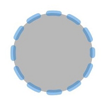

# Circle
<!--Kit: ArkUI-->
<!--Subsystem: ArkUI-->
<!--Owner: @zjsxstar-->
<!--Designer: @sunbees-->
<!--Tester: @liuli0427-->
<!--Adviser: @HelloCrease-->

The **Circle** component is used to draw a circle.

>  **NOTE**
>
>  This component is supported since API version 7. Updates will be marked with a superscript to indicate their earliest API version.


## Child Components

Not supported


## APIs

Circle(value?: CircleOptions)

**Widget capability**: This API can be used in ArkTS widgets since API version 9.

**Atomic service API**: This API can be used in atomic services since API version 11.

**System capability**: SystemCapability.ArkUI.ArkUI.Full

**Parameters**

| Name| Type| Mandatory| Description|
| -------- | -------- | -------- | -------- |
| value | [CircleOptions](#circleoptions) | No| Options of the circle.<br>The values undefined and null are invalid.|

## CircleOptions

This object is used to describe the drawing attributes of the Circle component.

**Widget capability**: This API can be used in ArkTS widgets since API version 9.

**Atomic service API**: This API can be used in atomic services since API version 11.

**System capability**: SystemCapability.ArkUI.ArkUI.Full

| Name| Type| Read-Only| Optional| Description|
| -------- | -------- | -------- | -------- | -------- |
| width | [Length](ts-types.md#length) | No| Yes| Width. The value must be greater than or equal to 0.<br>Default value: **0**<br>Default unit: vp<br>If the value is **undefined**, **null**, **NaN**, or **Infinity**, the default value will be used.|
| height | [Length](ts-types.md#length) | No| Yes| Height. The value must be greater than or equal to 0.<br>Default value: **0**<br>Default unit: vp<br>If the value is **undefined**, **null**, **NaN**, or **Infinity**, the default value will be used.|

## Attributes

In addition to the [universal attributes](ts-component-general-attributes.md), the following attributes are supported.

### fill

fill(value: ResourceColor)

Sets the color of the fill area. The [attributeModifier](ts-universal-attributes-attribute-modifier.md#attributemodifier) can be used to dynamically set attributes. If an exception occurs, the default value is used. If this attribute and the universal attribute **foregroundColor** are both set, whichever is set later takes effect.

**Widget capability**: This API can be used in ArkTS widgets since API version 9.

**Atomic service API**: This API can be used in atomic services since API version 11.

**System capability**: SystemCapability.ArkUI.ArkUI.Full

**Parameters**

| Name| Type                                      | Mandatory| Description                                  |
| ------ | ------------------------------------------ | ---- | -------------------------------------- |
| value  | [ResourceColor](ts-types.md#resourcecolor) | Yes  | Color of the fill area.<br>Default value: **Color.Black**<br>If the value is undefined, null, NaN, or Infinity, the default value is used.|

### fillOpacity

fillOpacity(value: number | string | Resource)

Sets the opacity of the fill area. The [attributeModifier](ts-universal-attributes-attribute-modifier.md#attributemodifier) can be used to dynamically set attributes.

**Widget capability**: This API can be used in ArkTS widgets since API version 9.

**Atomic service API**: This API can be used in atomic services since API version 11.

**System capability**: SystemCapability.ArkUI.ArkUI.Full

**Parameters**

| Name| Type                                                        | Mandatory| Description                          |
| ------ | ------------------------------------------------------------ | ---- | ------------------------------ |
| value  | number \| string \| [Resource](ts-types.md#resource) | Yes  | Opacity of the fill area.<br>**NOTE**<br>The value is in number format and ranges from 0.0 to 1.0. If the given value is less than 0.0, the value 0.0 is used. If the given value is greater than 1.0, the value 1.0 is used. Other abnormal values are processed as 1.0.<br>The value is a string that can be converted to a number. The value range is the same as that of number.<br>The value is a string in the system resource or application resource. The value range is the same as that of number.<br>**NaN** is treated as **0.0**, while **undefined**, **null**, and **Infinity** are treated as **1.0**.<br>Default value: **1.0**|

### stroke

stroke(value: ResourceColor)

Sets the stroke color. You can use the [attributeModifier](ts-universal-attributes-attribute-modifier.md#attributemodifier) to dynamically set this attribute. If this attribute is not set, the default border transparency is 0, indicating that there is no border.

**Widget capability**: This API can be used in ArkTS widgets since API version 9.

**Atomic service API**: This API can be used in atomic services since API version 11.

**System capability**: SystemCapability.ArkUI.ArkUI.Full

**Parameters**

| Name| Type                                      | Mandatory| Description      |
| ------ | ------------------------------------------ | ---- | ---------- |
| value  | [ResourceColor](ts-types.md#resourcecolor) | Yes  | Stroke color.<br>If the value is undefined or null, the default value is used. If the value is NaN or Infinity, the value Color.Black is used.|

### strokeDashArray

strokeDashArray(value: Array&lt;any&gt;)

Sets stroke dashes. You can use the [attributeModifier](ts-universal-attributes-attribute-modifier.md#attributemodifier) to dynamically set this attribute. The value must be greater than or equal to 0. Invalid values are treated as the default value.

**Widget capability**: This API can be used in ArkTS widgets since API version 9.

**Atomic service API**: This API can be used in atomic services since API version 11.

**System capability**: SystemCapability.ArkUI.ArkUI.Full

**Parameters**

| Name| Type            | Mandatory| Description                     |
| ------ | ---------------- | ---- | ------------------------- |
| value  | Array&lt;any&gt; | Yes  | Stroke dashes.<br>Default value: [] (empty array)<br>Default unit: vp<br>The values undefined and null are processed as the default values.|

### strokeDashOffset

strokeDashOffset(value: number | string)

Sets the offset of the start point for drawing the border. You can use the [attributeModifier](ts-universal-attributes-attribute-modifier.md#attributemodifier) to dynamically set this attribute.

**Widget capability**: This API can be used in ArkTS widgets since API version 9.

**Atomic service API**: This API can be used in atomic services since API version 11.

**System capability**: SystemCapability.ArkUI.ArkUI.Full

**Parameters**

| Name| Type                      | Mandatory| Description                                |
| ------ | -------------------------- | ---- | ------------------------------------ |
| value  | number \| string | Yes  | Offset of the start point for drawing the stroke.<br>Default value: **0**<br>Default unit: vp<br>The values undefined and null are processed as the default values. If the value is NaN or Infinity, strokeDashArray becomes invalid.|

### strokeLineCap

strokeLineCap(value: LineCapStyle)

Sets the cap style of the stroke. You can use the [attributeModifier](ts-universal-attributes-attribute-modifier.md#attributemodifier) to dynamically set this attribute.

**Widget capability**: This API can be used in ArkTS widgets since API version 9.

**Atomic service API**: This API can be used in atomic services since API version 11.

**System capability**: SystemCapability.ArkUI.ArkUI.Full

**Parameters**

| Name| Type                                             | Mandatory| Description                                            |
| ------ | ------------------------------------------------- | ---- | ------------------------------------------------ |
| value  | [LineCapStyle](ts-appendix-enums.md#linecapstyle) | Yes  | Cap style of the stroke.<br>Default value: **LineCapStyle.Butt**<br>The values undefined, null, NaN, and Infinity are processed as the default values.|

### strokeLineJoin

strokeLineJoin(value: LineJoinStyle)

Sets the join style of the stroke. The [attributeModifier](ts-universal-attributes-attribute-modifier.md#attributemodifier) can be used to dynamically set attributes. This attribute does not work for the **Circle** component, which does not have corners.

**Widget capability**: This API can be used in ArkTS widgets since API version 9.

**Atomic service API**: This API can be used in atomic services since API version 11.

**System capability**: SystemCapability.ArkUI.ArkUI.Full

**Parameters**

| Name| Type                                               | Mandatory| Description                                              |
| ------ | --------------------------------------------------- | ---- | -------------------------------------------------- |
| value  | [LineJoinStyle](ts-appendix-enums.md#linejoinstyle) | Yes  | Join style of the stroke.<br>Default value: **LineJoinStyle.Miter**<br>If the value is **undefined**, **null**, **NaN**, or **Infinity**, the default value will be used.|

### strokeMiterLimit

strokeMiterLimit(value: number | string)

Sets the maximum ratio of the miter length to the border width. The [attributeModifier](ts-universal-attributes-attribute-modifier.md#attributemodifier) can be used to dynamically set attributes. This attribute does not take effect for the **Circle** component, which does not have a miter join.

**Widget capability**: This API can be used in ArkTS widgets since API version 9.

**Atomic service API**: This API can be used in atomic services since API version 11.

**System capability**: SystemCapability.ArkUI.ArkUI.Full

**Parameters**

| Name| Type                      | Mandatory| Description                                          |
| ------ | -------------------------- | ---- | ---------------------------------------------- |
| value  | number \| string | Yes  | Limit on the ratio of the miter length to the value of **strokeWidth** used to draw a miter join.<br>Default value: **4**<br>If the value is undefined, null, or NaN, the default value is used. If the value is Infinity, stroke becomes invalid.|

### strokeOpacity

strokeOpacity(value: number | string | Resource)

Sets the stroke opacity. This attribute can be dynamically set through the [attributeModifier](ts-universal-attributes-attribute-modifier.md#attributemodifier) method. The value range of this attribute is [0.0, 1.0]. If the given value is less than 0.0, the value is 0.0. If the given value is greater than 1.0, the value is 1.0.

**Widget capability**: This API can be used in ArkTS widgets since API version 9.

**Atomic service API**: This API can be used in atomic services since API version 11.

**System capability**: SystemCapability.ArkUI.ArkUI.Full

**Parameters**

| Name| Type                                                        | Mandatory| Description                      |
| ------ | ------------------------------------------------------------ | ---- | -------------------------- |
| value  | number \| string \| [Resource](ts-types.md#resource) | Yes  | Stroke opacity.<br>The value range of this attribute is [0.0, 1.0]. If the given value is less than 0.0, the value is 0.0. If the given value is greater than 1.0, the value is 1.0.<br>Default value: transparency set by the [stroke](#stroke) API.<br>**NaN** is treated as **0.0**, while **undefined**, **null**, and **Infinity** are treated as **1.0**.|

### strokeWidth

strokeWidth(value: Length)

Sets the stroke width. This attribute can be dynamically set through the [attributeModifier](ts-universal-attributes-attribute-modifier.md#attributemodifier) method. If this attribute is of the string type, the percentage is not supported. The percentage is processed as 1 px.

**Widget capability**: This API can be used in ArkTS widgets since API version 9.

**Atomic service API**: This API can be used in atomic services since API version 11.

**System capability**: SystemCapability.ArkUI.ArkUI.Full

**Parameters**

| Name| Type                        | Mandatory| Description                    |
| ------ | ---------------------------- | ---- | ------------------------ |
| value  | [Length](ts-types.md#length) | Yes  | Stroke width. The value must be greater than or equal to 0.<br>Default value: **1**<br>Default unit: vp<br>The values undefined, null, and NaN are processed as default values, and Infinity is processed as 0.|

### antiAlias

antiAlias(value: boolean)

Sets whether to enable the anti-aliasing effect. The [attributeModifier](ts-universal-attributes-attribute-modifier.md#attributemodifier) can dynamically set attributes.

**Widget capability**: This API can be used in ArkTS widgets since API version 9.

**Atomic service API**: This API can be used in atomic services since API version 11.

**System capability**: SystemCapability.ArkUI.ArkUI.Full

**Parameters**

| Name| Type   | Mandatory| Description                                 |
| ------ | ------- | ---- | ------------------------------------- |
| value  | boolean | Yes  | Whether anti-aliasing is enabled.<br>- **true**: enabled.<br>- **false**: disabled.<br>Default value: **true**<br>The values undefined and null are processed as default values.|

## Example

### Example 1: Drawing Rectangles

This example demonstrates how to use **fillOpacity**, **stroke**, and **strokeDashArray** to set the opacity, stroke color, and stroke dashes of a circle.

```ts
// xxx.ets
@Entry
@Component
struct CircleExample {
  build() {
    Column({ space: 10 }) {
      // Draw a circle whose diameter is 150.
      Circle({ width: 150, height: 150 })
      // Draw a circle whose diameter is 150 and stroke color is red. (If the width and height values are different, the smaller value will be used as the diameter.)
      Circle()
        .width(150)
        .height(200)
        .fillOpacity(0)
        .strokeWidth(3)
        .stroke(Color.Red)
        .strokeDashArray([1, 2])
    }.width('100%')
  }
}
```


### Example 2: Using Different Parameter Types for the Width and Height of a Circle

width and height are used to draw a circle using different length types.

```ts
// xxx.ets
@Entry
@Component
struct CircleTypeExample {
  build() {
    Column({ space: 10 }) {
      // Draw a circle with a diameter of 50.
      Circle({ width: '50', height: '50' }) // Use the string type.
      // Draw a circle with a diameter of 100.
      Circle({ width: 100, height: 100 }) // Use the number type.
      // Draw a circle whose diameter is 150.
      Circle({ width: $r('app.string.CircleWidth'), height: $r('app.string.CircleHeight') }) // Use the Resource type, which should be customized.
    }.width('100%')
  }
}
```


### Example 3: Dynamically Setting Attributes of the Circle Component Using attributeModifier

The following example shows how to use attributeModifier to dynamically set the fill, fillOpacity, stroke, strokeDashArray, strokeDashOffset, strokeLineCap, strokeOpacity, strokeWidth, and antiAlias attributes of the Circle component.

```ts
// xxx.ets
class MyCircleModifier implements AttributeModifier<CircleAttribute> {
  applyNormalAttribute(instance: CircleAttribute): void {
    // Fill color: #707070; fill transparency: 0.5; border color: #2787D9; border gap: [20]; left offset: 15; line end style: semi-circle; border transparency: 0.5; border width: 10; anti-aliasing enabled.
    instance.fill("#707070")
    instance.fillOpacity(0.5)
    instance.stroke("#2787D9")
    instance.strokeDashArray([20])
    instance.strokeDashOffset("15")
    instance.strokeLineCap(LineCapStyle.Round)
    instance.strokeOpacity(0.5)
    instance.strokeWidth(10)
    instance.antiAlias(true)
  }
}

@Entry
@Component
struct CircleModifierDemo {
  @State modifier: MyCircleModifier = new MyCircleModifier()

  build() {
    Column() {
      Circle({ width: 150, height: 150 })
        .attributeModifier(this.modifier)
        .offset({ x: 20, y: 20 })
    }
  }
}
```


