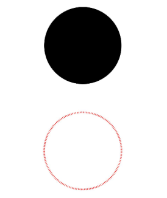
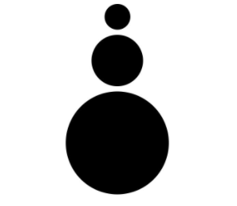

# Circle
<!--Kit: ArkUI-->
<!--Subsystem: ArkUI-->
<!--Owner: @camlostshi-->
<!--Designer: @fenglinbailu-->
<!--Tester: @liuli0427-->
<!--Adviser: @Brilliantry_Rui-->
<!-- md-trans-meta sourceCommit=11c46acbe9df6fc188da088a51a1ed091ee20c28 translatedAt=2026-08-28T01:23:44.907Z pushedAt=2026-08-31T02:42:25.669Z -->

 The **Circle** component is used to draw a circle.

>  **NOTE**
>
>  This component is supported since API version 7. Updates will be marked with a superscript to indicate their earliest API version.


## Child Components

None

## APIs

### Circle

new Circle(value?: CircleOptions)

Creates a circle. After the call, a **Circle** object is created, and its width and height can be set.

**Widget capability**: This API can be used in ArkTS widgets since API version 9.

**Atomic service API**: This API can be used in atomic services since API version 11.

**System capability**: SystemCapability.ArkUI.ArkUI.Full

**Parameters**

| Name| Type| Mandatory| Description|
| -------- | -------- | -------- | -------- |
| value | [CircleOptions](#circleoptions) | No | Circle size. Pass this parameter when you need to customize the circle size. If it is not passed, width and height default to **0**.<br>The abnormal values **undefined** and **null** are processed as invalid values, and this setting does not take effect. |

### Circle

Circle(value?: CircleOptions)

Creates a circle. After the call, a **Circle** object is created, and its width and height can be set.

**Widget capability**: This API can be used in ArkTS widgets since API version 9.

**Atomic service API**: This API can be used in atomic services since API version 11.

**System capability**: SystemCapability.ArkUI.ArkUI.Full

**Parameters**

| Name| Type                                      | Mandatory| Description                                  |
| ------ | ------------------------------------------ | ---- | -------------------------------------- |
| value | [CircleOptions](#circleoptions) | No | Circle size. Pass this parameter when you need to customize the circle size. If it is not passed, width and height default to **0**.<br>The abnormal values **undefined** and **null** are treated as invalid values, and this setting does not take effect. |

## CircleOptions

Describes the drawing attributes of the **Circle** component.

**Widget capability**: This API can be used in ArkTS widgets since API version 9.

**Atomic service API**: This API can be used in atomic services since API version 11.

**System capability**: SystemCapability.ArkUI.ArkUI.Full

| Name | Type | Read-Only | Optional | Description |
| -------- | -------- | -------- | -------- | -------- |
| width | [Length](ts-types.md#length) | No | Yes | Width. The value must be greater than or equal to 0. Set this attribute when you need to customize the circle size. If it is not set, the default value **0** is used.<br>Default unit: vp<br>Abnormal values **undefined**, **null**, **NaN**, and **Infinity** are treated as the default value. |
| height | [Length](ts-types.md#length) | No | Yes | Height. The value must be greater than or equal to 0. Set this attribute when you need to customize the circle size. If it is not set, the default value **0** is used.<br>Default unit: vp<br>Abnormal values **undefined**, **null**, **NaN**, and **Infinity** are treated as the default value. |

## Attributes

In addition to the [universal attributes](ts-component-general-attributes.md) and [universal drawing attributes](ts-drawing-components-common.md), the following attributes are supported:

### stroke

stroke(value: ResourceColor | ColorMetrics)

Sets the stroke color. [ColorMetrics](../js-apis-arkui-graphics.md#colormetrics12) can be used to describe the color for HDR brightening. This attribute can be dynamically set using [attributeModifier](ts-universal-attributes-attribute-modifier.md#attributemodifier). If this attribute is not set, the default stroke color is [Color](ts-appendix-enums.md#color).Transparent, that is, no stroke is drawn. Abnormal values undefined and null are treated as the default value, and NaN and Infinity are treated as [Color](ts-appendix-enums.md#color).Black.

**Since**: 26.0.0

**Widget capability:** This API can be used in ArkTS widgets since API version 26.0.0.

**Atomic service API:** This API can be used in atomic services since API version 26.0.0.

**System capability**: SystemCapability.ArkUI.ArkUI.Full

**Parameters**

| Name| Type            | Mandatory| Description                     |
| ------ | ---------------- | ---- | ------------------------- |
| value  | [ResourceColor](ts-types.md#resourcecolor) \| [ColorMetrics](../js-apis-arkui-graphics.md#colormetrics12) | Yes   | Stroke color.<br>Default value: [Color](ts-appendix-enums.md#color).Transparent<br>The abnormal values **undefined** and **null** are handled as the default value, and **NaN** and **Infinity** are handled as [Color](ts-appendix-enums.md#color).Black. |

### fill

fill(value: ResourceColor | ColorMetrics)

Sets the color of the fill area. [ColorMetrics](../js-apis-arkui-graphics.md#colormetrics12) can be used to describe the color for HDR brightening. This attribute can be dynamically set using [attributeModifier](ts-universal-attributes-attribute-modifier.md#attributemodifier). If this attribute is not set, the default fill color is [Color](ts-appendix-enums.md#color).Black. Abnormal values **undefined**, **null**, **NaN**, and **Infinity** are treated as the default value. When this attribute is set together with the universal attribute **foregroundColor**, the one set later takes effect.

**Since**: 26.0.0

**Widget capability:** This API can be used in ArkTS widgets since API version 26.0.0.

**Atomic service API:** This API can be used in atomic services since API version 26.0.0.

**System capability**: SystemCapability.ArkUI.ArkUI.Full

**Parameters**

| Name| Type                        | Mandatory| Description                    |
| ------ | ---------------------------- | ---- | ------------------------ |
| value  | [ResourceColor](ts-types.md#resourcecolor) \| [ColorMetrics](../js-apis-arkui-graphics.md#colormetrics12) | Yes  | Color of the area to fill.<br>Default value: [Color](ts-appendix-enums.md#color).Black <br>Abnormal values **undefined**, **null**, **NaN**, and **Infinity** are handled as the default value. |

## Examples

### Example 1: Drawing a Circle

This example demonstrates how to set the opacity, stroke color, and stroke dash style of a circle by setting the **fillOpacity**, **stroke**, and **strokeDashArray** attributes, respectively.

```ts
// xxx.ets
@Entry
@Component
struct CircleExample {
  build() {
    Column({ space: 10 }) {
      // Draw a circle with a diameter of 150.
      Circle({ width: 150, height: 150 })
      // Draw a circle with a diameter of 150 and a red-dashed stroke. (If the width and height values are different, the smaller value will be used as the diameter.)
      Circle()
        .width(150)
        .height(200)
        .fillOpacity(0)
        .strokeWidth(3)
        .stroke(Color.Red)
        .strokeDashArray([1, 2])
    }.width('100%')
  }
}
```



### Example 2: Drawing a Circle with Different Parameter Types for Width and Height

This example demonstrates how to draw a circle using different length types of the **width** and **height** attributes.

```ts
// xxx.ets
@Entry
@Component
struct CircleTypeExample {
  build() {
    Column({ space: 10 }) {
      // Draw a circle with a diameter of 50.
      Circle({ width: '50', height: '50' }) // Use the string type.
      // Draw a circle with a diameter of 100.
      Circle({ width: 100, height: 100 }) // Use the number type.
      // Draw a circle with a diameter of 150.
      Circle({ width: $r('app.string.CircleWidth'), height: $r('app.string.CircleHeight') }) // Use the Resource type, which needs to be customized.
    }.width('100%')
  }
}
```



### Example 3: Dynamically Setting Attributes of the Circle Component Using attributeModifier

This example shows how to use **attributeModifier** to dynamically set the **fill**, **fillOpacity**, **stroke**, **strokeDashArray**, **strokeDashOffset**, **strokeLineCap**, **strokeOpacity**, **strokeWidth**, and **antiAlias** attributes of the **Circle** component.

```ts
// xxx.ets
class MyCircleModifier implements AttributeModifier<CircleAttribute> {
  applyNormalAttribute(instance: CircleAttribute): void {
    // Set the fill color to #707070, fill opacity to 0.5, stroke color to #2787D9, dash pattern to [20], dash offset to 15, line cap style to round, stroke opacity to 0.5, stroke width to 10, and enable anti-aliasing.
    instance.fill("#707070")
    instance.fillOpacity(0.5)
    instance.stroke("#2787D9")
    instance.strokeDashArray([20])
    instance.strokeDashOffset("15")
    instance.strokeLineCap(LineCapStyle.Round)
    instance.strokeOpacity(0.5)
    instance.strokeWidth(10)
    instance.antiAlias(true)
  }
}

@Entry
@Component
struct CircleModifierDemo {
  @State modifier: MyCircleModifier = new MyCircleModifier()

  build() {
    Column() {
      Circle({ width: 150, height: 150 })
        .attributeModifier(this.modifier)
        .offset({ x: 20, y: 20 })
    }
  }
}
```


### Example 4: Using ColorMetrics to Set HDR Fill and Stroke Colors

You can use [ColorMetrics](../js-apis-arkui-graphics.md#colormetrics12) to set HDR colors for the **Circle** component, achieving a brightness effect beyond the normal display range. The [fill](#fill) API is used to set the color of the fill area, and the [stroke](#stroke) API is used to set the stroke color. In the following example, the left side uses an HDR warm gold fill and an ice blue stroke (with a brightness multiplier greater than 1.0), while the right side uses ordinary SDR colors as a comparison. On an HDR-capable screen, the left side is noticeably brighter and more vivid than the right side.

Since API version 26.0.0, the **Circle** component-specific [fill](#fill) and [stroke](#stroke) APIs are added, which support passing the [ColorMetrics](../js-apis-arkui-graphics.md#colormetrics12) type to achieve the HDR brightening effect.

```ts
// xxx.ets
import { ColorMetrics } from '@kit.ArkUI';

@Entry
@Component
struct CircleHDRDemo {
  build() {
    Column({ space: 30 }) {
      Row({ space: 60 }) {
        // HDR fill and stroke: Color component values can exceed 1.0, and the portion exceeding 1.0 is used to represent highlights beyond the normal screen brightness range.
        Column({ space: 8 }) {
          Circle()
            .width(120).height(120).strokeWidth(6)
            .fill(ColorMetrics.createHDRColor(ColorSpace.BT2020, 2.5, 1.2, 0.0, 1)) // Highlight warm gold
            .stroke(ColorMetrics.createHDRColor(ColorSpace.BT2020, 0.0, 0.8, 2.5, 1)) // Highlight ice blue
          Text('HDR').fontColor(Color.White).fontSize(14)
        }

        // SDR fill and stroke: Color component values range from 0.0 to 1.0, which is the conventional standard dynamic range color display.
        Column({ space: 8 }) {
          Circle()
            .width(120).height(120).strokeWidth(6)
            .fill('#ffc800') // Normal golden yellow
            .stroke('#0066ff') // Normal dark blue
          Text('SDR').fontColor(Color.White).fontSize(14)
        }
      }
    }
    .width('100%').height('100%')
    .justifyContent(FlexAlign.Center)
  }
}
```

