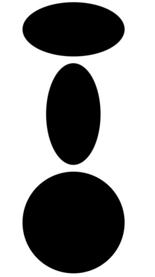
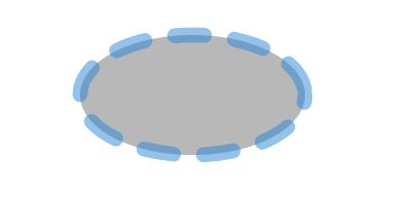

# Ellipse
<!--Kit: ArkUI-->
<!--Subsystem: ArkUI-->
<!--Owner: @zjsxstar-->
<!--Designer: @sunbees-->
<!--Tester: @liuli0427-->
<!--Adviser: @HelloCrease-->

The **Ellipse** component is used to draw an ellipse.

>  **NOTE**
>
>  This component is supported since API version 7. Updates will be marked with a superscript to indicate their earliest API version.

## Child Components

Not supported


## APIs

Ellipse(options?: EllipseOptions)

**Widget capability**: This API can be used in ArkTS widgets since API version 9.

**Atomic service API**: This API can be used in atomic services since API version 11.

**System capability**: SystemCapability.ArkUI.ArkUI.Full

**Parameters**

| Name| Type| Mandatory| Description|
| -------- | -------- | -------- | -------- |
| options | [EllipseOptions](ts-drawing-components-ellipse.md#ellipseoptions18) | No| Dimensions for drawing an ellipse.<br>The values undefined and null are regarded as invalid values.|

## EllipseOptions<sup>18+</sup>
Describes the dimensions for drawing an ellipse.

> **NOTE**
>
> To standardize anonymous object definitions, the element definitions here have been revised in API version 18. While historical version information is preserved for anonymous objects, there may be cases where the outer element's @since version number is higher than inner elements'. This does not affect interface usability.

**Widget capability**: This API can be used in ArkTS widgets since API version 18.

**Atomic service API**: This API can be used in atomic services since API version 18.

**System capability**: SystemCapability.ArkUI.ArkUI.Full

| Name| Type| Read-Only| Optional| Description|
| -------- | -------- | -------- | -------- | -------- |
| width<sup>7+</sup> | [Length](ts-types.md#length) | No| Yes| Width. The value must be greater than or equal to 0.<br>Default value: **0**<br>Default unit: vp<br>If the value is **undefined**, **null**, **NaN**, or **Infinity**, the default value will be used.<br>The Resource type is supported since API version 20.<br>**Widget capability**: This API can be used in ArkTS widgets since API version 9.<br>**Atomic service API**: This API can be used in atomic services since API version 11.|
| height<sup>7+</sup> | [Length](ts-types.md#length) | No| Yes| Height. The value must be greater than or equal to 0.<br>Default value: **0**<br>Default unit: vp<br>If the value is **undefined**, **null**, **NaN**, or **Infinity**, the default value will be used.<br>The Resource type is supported since API version 20.<br>**Widget capability**: This API can be used in ArkTS widgets since API version 9.<br>**Atomic service API**: This API can be used in atomic services since API version 11.|

## Attributes

In addition to the [universal attributes](ts-component-general-attributes.md), the following attributes are supported.

### fill

fill(value: ResourceColor)

Sets the color of the fill area. This attribute can be dynamically set in [attributeModifier](ts-universal-attributes-attribute-modifier.md#attributemodifier). If an abnormal value is used, the default value is used. If this attribute and the universal attribute **foregroundColor** are both set, whichever is set later takes effect.

**Widget capability**: This API can be used in ArkTS widgets since API version 9.

**Atomic service API**: This API can be used in atomic services since API version 11.

**System capability**: SystemCapability.ArkUI.ArkUI.Full

**Parameters**

| Name| Type                                      | Mandatory| Description                                  |
| ------ | ------------------------------------------ | ---- | -------------------------------------- |
| value  | [ResourceColor](ts-types.md#resourcecolor) | Yes  | Color of the fill area.<br>Default value: **Color.Black**<br>If the value is **undefined**, **null**, **NaN**, or **Infinity**, the default value will be used.|

### fillOpacity

fillOpacity(value: number | string | Resource)

Sets the opacity of the fill area. This attribute can be dynamically set using [attributeModifier](ts-universal-attributes-attribute-modifier.md#attributemodifier).

**Widget capability**: This API can be used in ArkTS widgets since API version 9.

**Atomic service API**: This API can be used in atomic services since API version 11.

**System capability**: SystemCapability.ArkUI.ArkUI.Full

**Parameters**

| Name| Type                                                        | Mandatory| Description                          |
| ------ | ------------------------------------------------------------ | ---- | ------------------------------ |
| value  | number \| string \| [Resource](ts-types.md#resource) | Yes  | Opacity of the fill area.<br>**NOTE**<br>The value range is [0.0, 1.0]. A value less than 0.0 is treated as **0.0**. A value greater than 1.0 is treated as **1.0**. Any other value is treated as **1.0**.<br>The value can also be a string of the number format. The value range is the same as that of the number format.<br>The value can also be a string in the system or application resources. The value range is the same as that of the number format.<br>**NaN** is treated as **0.0**, while **undefined**, **null**, and **Infinity** are treated as **1.0**.<br>Default value: **1.0**|

### stroke

stroke(value: ResourceColor)

Sets the stroke color. This attribute can be dynamically set in [attributeModifier](ts-universal-attributes-attribute-modifier.md#attributemodifier). If this attribute is not set, the default border opacity is 0, that is, no border is displayed.

**Widget capability**: This API can be used in ArkTS widgets since API version 9.

**Atomic service API**: This API can be used in atomic services since API version 11.

**System capability**: SystemCapability.ArkUI.ArkUI.Full

**Parameters**

| Name| Type                                      | Mandatory| Description      |
| ------ | ------------------------------------------ | ---- | ---------- |
| value  | [ResourceColor](ts-types.md#resourcecolor) | Yes  | Stroke color.<br>If the value is undefined or null, the default value is used. If the value is NaN or Infinity, the value Color.Black is used.|

### strokeDashArray

strokeDashArray(value: Array&lt;any&gt;)

Sets stroke dashes. This attribute can be dynamically set using [attributeModifier](ts-universal-attributes-attribute-modifier.md#attributemodifier). The value must be greater than or equal to 0. If the value is abnormal, the default value is used.

**Widget capability**: This API can be used in ArkTS widgets since API version 9.

**Atomic service API**: This API can be used in atomic services since API version 11.

**System capability**: SystemCapability.ArkUI.ArkUI.Full

**Parameters**

| Name| Type            | Mandatory| Description                     |
| ------ | ---------------- | ---- | ------------------------- |
| value  | Array&lt;any&gt; | Yes  | Stroke dashes.<br>Default value: [] (empty array)<br>Default unit: vp<br>If the value is undefined or null, the default value is used.|

### strokeDashOffset

strokeDashOffset(value: number | string)

Sets the offset of the border drawing start point. This attribute can be dynamically set using [attributeModifier](ts-universal-attributes-attribute-modifier.md#attributemodifier).

**Widget capability**: This API can be used in ArkTS widgets since API version 9.

**Atomic service API**: This API can be used in atomic services since API version 11.

**System capability**: SystemCapability.ArkUI.ArkUI.Full

**Parameters**

| Name| Type                      | Mandatory| Description                                |
| ------ | -------------------------- | ---- | ------------------------------------ |
| value  | number \| string | Yes  | Offset of the start point for drawing the stroke.<br>Default value: **0**<br>Default unit: vp<br>If the value is undefined or null, the default value will be used. If the value is NaN or Infinity, strokeDashArray will be ineffective.|

### strokeLineCap

strokeLineCap(value: LineCapStyle)

Sets the cap style of the stroke.This attribute can be dynamically set using [attributeModifier](ts-universal-attributes-attribute-modifier.md#attributemodifier).

**Widget capability**: This API can be used in ArkTS widgets since API version 9.

**Atomic service API**: This API can be used in atomic services since API version 11.

**System capability**: SystemCapability.ArkUI.ArkUI.Full

**Parameters**

| Name| Type                                             | Mandatory| Description                                            |
| ------ | ------------------------------------------------- | ---- | ------------------------------------------------ |
| value  | [LineCapStyle](ts-appendix-enums.md#linecapstyle) | Yes  | Cap style of the stroke.<br>Default value: **LineCapStyle.Butt**<br>If the value is **undefined**, **null**, **NaN**, or **Infinity**, the default value will be used.|

### strokeLineJoin

strokeLineJoin(value: LineJoinStyle)

Sets the join style of the stroke. This attribute can be dynamically set using [attributeModifier](ts-universal-attributes-attribute-modifier.md#attributemodifier). This attribute does not work for the **Ellipse** component, which does not have corners.

**Widget capability**: This API can be used in ArkTS widgets since API version 9.

**Atomic service API**: This API can be used in atomic services since API version 11.

**System capability**: SystemCapability.ArkUI.ArkUI.Full

**Parameters**

| Name| Type                                               | Mandatory| Description                                              |
| ------ | --------------------------------------------------- | ---- | -------------------------------------------------- |
| value  | [LineJoinStyle](ts-appendix-enums.md#linejoinstyle) | Yes  | Join style of the stroke.<br>Default value: **LineJoinStyle.Miter**<br>If the value is **undefined**, **null**, **NaN**, or **Infinity**, the default value will be used.|

### strokeMiterLimit

strokeMiterLimit(value: number | string)

Sets the limit on the ratio of the miter length to the value of **strokeWidth** used to draw a miter join. This attribute can be dynamically set using [attributeModifier](ts-universal-attributes-attribute-modifier.md#attributemodifier). The Ellipse component does not support the setting of sharp corners. Therefore, this attribute is invalid.

**Widget capability**: This API can be used in ArkTS widgets since API version 9.

**Atomic service API**: This API can be used in atomic services since API version 11.

**System capability**: SystemCapability.ArkUI.ArkUI.Full

**Parameters**

| Name| Type                      | Mandatory| Description                                          |
| ------ | -------------------------- | ---- | ---------------------------------------------- |
| value  | number \| string | Yes  | Limit on the ratio of the miter length to the value of **strokeWidth** used to draw a miter join.<br>Default value: **4**<br>If the value is undefined, null, or NaN, the default value is used. If the value is Infinity, stroke becomes invalid.|

### strokeOpacity

strokeOpacity(value: number | string | Resource)

Sets the stroke opacity. This attribute can be dynamically set using [attributeModifier](ts-universal-attributes-attribute-modifier.md#attributemodifier). The value range is [0.0, 1.0]. If the set value is less than 0.0, **0.0** will be used. If the set value is greater than 1.0, **1.0** will be used.

**Widget capability**: This API can be used in ArkTS widgets since API version 9.

**Atomic service API**: This API can be used in atomic services since API version 11.

**System capability**: SystemCapability.ArkUI.ArkUI.Full

**Parameters**

| Name| Type                                                        | Mandatory| Description                      |
| ------ | ------------------------------------------------------------ | ---- | -------------------------- |
| value  | number \| string \| [Resource](ts-types.md#resource) | Yes  | Stroke opacity.<br>Default value: transparency set by the [stroke](#stroke) API.<br>**NaN** is treated as **0.0**, while **undefined**, **null**, and **Infinity** are treated as **1.0**.|

### strokeWidth

strokeWidth(value: Length)

Sets the stroke width. This attribute can be dynamically set using the [attributeModifier](ts-universal-attributes-attribute-modifier.md#attributemodifier) method. If of the string type, this attribute cannot be set in percentage. A percentage is processed as 1 px.

**Widget capability**: This API can be used in ArkTS widgets since API version 9.

**Atomic service API**: This API can be used in atomic services since API version 11.

**System capability**: SystemCapability.ArkUI.ArkUI.Full

**Parameters**

| Name| Type                        | Mandatory| Description                    |
| ------ | ---------------------------- | ---- | ------------------------ |
| value  | [Length](ts-types.md#length) | Yes  | Stroke width. The value must be greater than or equal to 0.<br>Default value: **1**<br>Default unit: vp<br>Default unit: vp<br>If the value is undefined, null, or NaN, the default value is used. If the value is Infinity, the value 0 is used.|

### antiAlias

antiAlias(value: boolean)

Sets whether to enable anti-aliasing. This attribute can be dynamically set using [attributeModifier](ts-universal-attributes-attribute-modifier.md#attributemodifier).

**Widget capability**: This API can be used in ArkTS widgets since API version 9.

**Atomic service API**: This API can be used in atomic services since API version 11.

**System capability**: SystemCapability.ArkUI.ArkUI.Full

**Parameters**

| Name| Type   | Mandatory| Description                                 |
| ------ | ------- | ---- | ------------------------------------- |
| value  | boolean | Yes  | Whether anti-aliasing is enabled.<br>**true**: Anti-aliasing is enabled.<br>**false**: Anti-aliasing is disabled.<br>Default value: **true**<br>If the value is undefined or null, the default value is used.|

## Example

### Example 1: Drawing Rectangles

This example demonstrates how to use **fillOpacity** and **stroke** to set the opacity and stroke color of an ellipse.

```ts
// xxx.ets
@Entry
@Component
struct EllipseExample {
  build() {
    Column({ space: 10 }) {
      // Draw a 150 x 80 ellipse.
      Ellipse({ width: 150, height: 80 })
      // Draw a 150 x 100 ellipse with blue strokes.
      Ellipse()
        .width(150)
        .height(100)
        .fillOpacity(0)
        .stroke(Color.Blue)
        .strokeWidth(3)
    }.width('100%')
  }
}
```


### Example 2: Using Different Parameter Types to Draw an Ellipse

The width and height attributes are used to draw an ellipse with different length types.

```ts
// xxx.ets
@Entry
@Component
struct EllipseTypeExample {
  build() {
    Column({ space: 10 }) {
      // Draw a 150 x 80 ellipse.
      Ellipse({ width: '150', height: '80' }) // Use the string type.
      // Draw an ellipse of 80 x 150.
      Ellipse({ width: 80, height: 150 }) // Use the number type.
      // Draw an ellipse of 150 x 150.
      Ellipse({ width: $r('app.string.EllipseWidth'), height: $r('app.string.EllipseHeight') }) // Use the Resource type, which needs to be customized.
    }.width('100%')
  }
}
```



### Example 3: Using attributeModifier to Dynamically Set Attributes of the Ellipse Component

The following example shows how to use attributeModifier to dynamically set the fill, fillOpacity, stroke, strokeDashArray, strokeDashOffset, strokeLineCap, strokeOpacity, strokeWidth, and antiAlias attributes of the Ellipse component.

```ts
// xxx.ets
class MyEllipseModifier implements AttributeModifier<EllipseAttribute> {
  applyNormalAttribute(instance: EllipseAttribute): void {
    //Set the fill color to #707070, fill opacity to 0.5, border color to #2787D9, border gap to [20], left offset to 15, line end style to semi-circle, border opacity to 0.5, border width to 10, and anti-aliasing to enabled.
    instance.fill("#707070")
    instance.fillOpacity(0.5)
    instance.stroke("#2787D9")
    instance.strokeDashArray([20])
    instance.strokeDashOffset("15")
    instance.strokeLineCap(LineCapStyle.Round)
    instance.strokeOpacity(0.5)
    instance.strokeWidth(10)
    instance.antiAlias(true)
  }
}

@Entry
@Component
struct EllipseModifierDemo {
  @State modifier: MyEllipseModifier = new MyEllipseModifier()

  build() {
    Column() {
      Ellipse({ width: 150, height: 80 })
        .attributeModifier(this.modifier)
        .offset({ x: 20, y: 20 })
    }
  }
}
```


