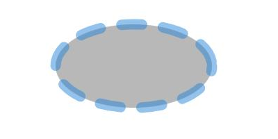

# Ellipse
<!--Kit: ArkUI-->
<!--Subsystem: ArkUI-->
<!--Owner: @zjsxstar-->
<!--Designer: @sunbees-->
<!--Tester: @liuli0427-->
<!--Adviser: @Brilliantry_Rui-->

The **Ellipse** component is used to draw an ellipse.

>  **NOTE**
>
>  This component is supported since API version 7. Updates will be marked with a superscript to indicate their earliest API version.

## Child Components

Not supported


## APIs

Ellipse(options?: EllipseOptions)

**Widget capability**: This API can be used in ArkTS widgets since API version 9.

**Atomic service API**: This API can be used in atomic services since API version 11.

**System capability**: SystemCapability.ArkUI.ArkUI.Full

**Parameters**

| Name| Type| Mandatory| Description|
| -------- | -------- | -------- | -------- |
| options | [EllipseOptions](ts-drawing-components-ellipse.md#ellipseoptions18) | No| Options of the ellipse.<br>The **undefined** and **null** values are treated as invalid and will not take effect.|

## EllipseOptions<sup>18+</sup>

Describes the options of the ellipse.

> **NOTE**
>
> To standardize anonymous object definitions, the element definitions here have been revised in API version 18. While historical version information is preserved for anonymous objects, there may be cases where the outer element's @since version number is higher than inner elements'. This does not affect interface usability.

**Widget capability**: This API can be used in ArkTS widgets since API version 18.

**Atomic service API**: This API can be used in atomic services since API version 18.

**System capability**: SystemCapability.ArkUI.ArkUI.Full

| Name| Type| Read-Only| Optional| Description|
| -------- | -------- | -------- | -------- | -------- |
| width<sup>7+</sup> | [Length](ts-types.md#length) | No| Yes| Width. The value must be greater than or equal to 0.<br>Default value: **0**<br>Default unit: vp<br>The **undefined**, **null**, **NaN**, and **Infinity** values are invalid and treated as the default value.<br>The Resource type is supported since API version 20.<br>**Widget capability**: This API can be used in ArkTS widgets since API version 9.<br>**Atomic service API**: This API can be used in atomic services since API version 11.|
| height<sup>7+</sup> | [Length](ts-types.md#length) | No| Yes| Height. The value must be greater than or equal to 0.<br>Default value: **0**<br>Default unit: vp<br>The **undefined**, **null**, **NaN**, and **Infinity** values are invalid and treated as the default value.<br>The Resource type is supported since API version 20.<br>**Widget capability**: This API can be used in ArkTS widgets since API version 9.<br>**Atomic service API**: This API can be used in atomic services since API version 11.|

## Attributes

In addition to the [universal attributes](ts-component-general-attributes.md), the following attributes are supported.

### fill

fill(value: ResourceColor)

Sets the color of the fill area. This attribute can be dynamically set using [attributeModifier](ts-universal-attributes-attribute-modifier.md#attributemodifier). Invalid values are treated as the default value. If this attribute and the universal attribute **foregroundColor** are both set, whichever is set later takes effect.

**Widget capability**: This API can be used in ArkTS widgets since API version 9.

**Atomic service API**: This API can be used in atomic services since API version 11.

**System capability**: SystemCapability.ArkUI.ArkUI.Full

**Parameters**

| Name| Type                                      | Mandatory| Description                                  |
| ------ | ------------------------------------------ | ---- | -------------------------------------- |
| value  | [ResourceColor](ts-types.md#resourcecolor) | Yes  | Color of the fill area.<br>Default value: [Color](ts-appendix-enums.md#color).Black<br>The **undefined**, **null**, **NaN**, and **Infinity** values are invalid and treated as the default value.|

### fillOpacity

fillOpacity(value: number | string | Resource)

Sets the opacity of the fill area. This attribute can be dynamically set using [attributeModifier](ts-universal-attributes-attribute-modifier.md#attributemodifier).

**Widget capability**: This API can be used in ArkTS widgets since API version 9.

**Atomic service API**: This API can be used in atomic services since API version 11.

**System capability**: SystemCapability.ArkUI.ArkUI.Full

**Parameters**

| Name| Type                                                        | Mandatory| Description                          |
| ------ | ------------------------------------------------------------ | ---- | ------------------------------ |
| value  | number&nbsp;\|&nbsp;string&nbsp;\|&nbsp;[Resource](ts-types.md#resource) | Yes  | Opacity of the fill area.<br>**NOTE**<br>For the number type, the value range is [0.0, 1.0]. A value less than 0.0 is treated as **0.0**. A value greater than 1.0 is treated as **1.0**. Any other invalid value is treated as **1.0**.<br>For the string type, the value is a character string of the number type. The value range is the same as that of the number type.<br>For the Resource type, the value is a character string from the system resource or application resource. The value range is the same as that of the number type.<br>Invalid value **NaN** is treated as **0.0**, while invalid values **undefined**, **null**, and **Infinity** are treated as **1.0**.<br>Default value: **1.0**|

### stroke

stroke(value: ResourceColor)

Sets the stroke color. This attribute can be dynamically set using [attributeModifier](ts-universal-attributes-attribute-modifier.md#attributemodifier). If this attribute is not set, the default stroke opacity is **0**, meaning no stroke is displayed.

**Widget capability**: This API can be used in ArkTS widgets since API version 9.

**Atomic service API**: This API can be used in atomic services since API version 11.

**System capability**: SystemCapability.ArkUI.ArkUI.Full

**Parameters**

| Name| Type                                      | Mandatory| Description      |
| ------ | ------------------------------------------ | ---- | ---------- |
| value  | [ResourceColor](ts-types.md#resourcecolor) | Yes  | Stroke color.<br>Default value: [Color](ts-appendix-enums.md#color).Transparent<br>Invalid values **undefined** and **null** values are treated as the default value, and invalid values **NaN** and **Infinity** are treated as [Color](ts-appendix-enums.md#color).Black.|

### strokeDashArray

strokeDashArray(value: Array&lt;any&gt;)

Sets the stroke dashes. This attribute can be dynamically set using [attributeModifier](ts-universal-attributes-attribute-modifier.md#attributemodifier). The value must be greater than or equal to 0. Invalid values are treated as the default value.

**Widget capability**: This API can be used in ArkTS widgets since API version 9.

**Atomic service API**: This API can be used in atomic services since API version 11.

**System capability**: SystemCapability.ArkUI.ArkUI.Full

**Parameters**

| Name| Type            | Mandatory| Description                     |
| ------ | ---------------- | ---- | ------------------------- |
| value  | Array&lt;any&gt; | Yes  | Array defining the dash pattern for the ellipse outline. Elements alternate between dash length and gap length.<br>Default value: **[]** (empty array)<br>Default unit: vp<br>The **undefined** and **null** values are invalid and treated as the default value.<br>**NOTE**<br>Empty array: solid line<br>Even-numbered array: Elements cycle sequentially, for example, [a, b, c, d] represents: dash a -> gap b -> dash c -> gap d -> dash a -> ...<br>Odd-numbered array: Elements are duplicated to create an even-numbered array, for example, [a, b, c] becomes [a, b, c, a, b, c], representing: dash a -> gap b -> dash c -> gap a -> dash b -> gap c -> dash a -> ...|

### strokeDashOffset

strokeDashOffset(value: number | string)

Sets the offset of the start point for drawing the stroke. This attribute can be dynamically set using [attributeModifier](ts-universal-attributes-attribute-modifier.md#attributemodifier).

**Widget capability**: This API can be used in ArkTS widgets since API version 9.

**Atomic service API**: This API can be used in atomic services since API version 11.

**System capability**: SystemCapability.ArkUI.ArkUI.Full

**Parameters**

| Name| Type                      | Mandatory| Description                                |
| ------ | -------------------------- | ---- | ------------------------------------ |
| value  | number&nbsp;\|&nbsp;string | Yes  | Offset of the start point for drawing the stroke.<br>Default value: **0**<br>Default unit: vp<br>Invalid values **undefined** and **null** are treated as the default value. If set to **NaN** or **Infinity**, **strokeDashArray** has no effect.|

### strokeLineCap

strokeLineCap(value: LineCapStyle)

Sets the cap style of the stroke. This attribute can be dynamically set using [attributeModifier](ts-universal-attributes-attribute-modifier.md#attributemodifier).

**Widget capability**: This API can be used in ArkTS widgets since API version 9.

**Atomic service API**: This API can be used in atomic services since API version 11.

**System capability**: SystemCapability.ArkUI.ArkUI.Full

**Parameters**

| Name| Type                                             | Mandatory| Description                                            |
| ------ | ------------------------------------------------- | ---- | ------------------------------------------------ |
| value  | [LineCapStyle](ts-appendix-enums.md#linecapstyle) | Yes  | Cap style of the stroke.<br>Default value: **LineCapStyle.Butt**<br>The **undefined**, **null**, **NaN**, and **Infinity** values are invalid and treated as the default value.|

### strokeLineJoin

strokeLineJoin(value: LineJoinStyle)

Sets the join style of the stroke. This attribute can be dynamically set using [attributeModifier](ts-universal-attributes-attribute-modifier.md#attributemodifier). This attribute does not work for the **Ellipse** component, which does not have corners.

**Widget capability**: This API can be used in ArkTS widgets since API version 9.

**Atomic service API**: This API can be used in atomic services since API version 11.

**System capability**: SystemCapability.ArkUI.ArkUI.Full

**Parameters**

| Name| Type                                               | Mandatory| Description                                              |
| ------ | --------------------------------------------------- | ---- | -------------------------------------------------- |
| value  | [LineJoinStyle](ts-appendix-enums.md#linejoinstyle) | Yes  | Join style of the stroke.<br>Default value: **LineJoinStyle.Miter**<br>The **undefined**, **null**, **NaN**, and **Infinity** values are invalid and treated as the default value.|

### strokeMiterLimit

strokeMiterLimit(value: number | string)

Sets the limit on the ratio of the miter length to the value of stroke width used to draw a miter join. This attribute can be dynamically set using [attributeModifier](ts-universal-attributes-attribute-modifier.md#attributemodifier). This attribute does not take effect for the **Ellipse** component, because it does not have a miter join.

**Widget capability**: This API can be used in ArkTS widgets since API version 9.

**Atomic service API**: This API can be used in atomic services since API version 11.

**System capability**: SystemCapability.ArkUI.ArkUI.Full

**Parameters**

| Name| Type                      | Mandatory| Description                                          |
| ------ | -------------------------- | ---- | ---------------------------------------------- |
| value  | number&nbsp;\|&nbsp;string | Yes  | Limit on the ratio of the miter length to the value of **strokeWidth** used to draw a miter join.<br>Default value: **4**<br>Invalid values **undefined**, **null**, and **NaN** are treated as the default value. If set to **Infinity**, **stroke** has no effect.|

### strokeOpacity

strokeOpacity(value: number | string | Resource)

Sets the stroke opacity. This attribute can be dynamically set using [attributeModifier](ts-universal-attributes-attribute-modifier.md#attributemodifier). The value range is [0.0, 1.0]. If the set value is less than 0.0, **0.0** will be used. If the set value is greater than 1.0, **1.0** will be used.

**Widget capability**: This API can be used in ArkTS widgets since API version 9.

**Atomic service API**: This API can be used in atomic services since API version 11.

**System capability**: SystemCapability.ArkUI.ArkUI.Full

**Parameters**

| Name| Type                                                        | Mandatory| Description                      |
| ------ | ------------------------------------------------------------ | ---- | -------------------------- |
| value  | number&nbsp;\|&nbsp;string&nbsp;\|&nbsp;[Resource](ts-types.md#resource) | Yes  | Stroke opacity.<br>Default value: opacity set by the [stroke](#stroke) API<br>Invalid value **NaN** is treated as **0.0**, while invalid values **undefined**, **null**, and **Infinity** are treated as **1.0**.|

### strokeWidth

strokeWidth(value: Length)

Sets the stroke width. This attribute can be dynamically set using [attributeModifier](ts-universal-attributes-attribute-modifier.md#attributemodifier). If this attribute is of the string type, percentage values are not supported and will be treated as 1 px.

**Widget capability**: This API can be used in ArkTS widgets since API version 9.

**Atomic service API**: This API can be used in atomic services since API version 11.

**System capability**: SystemCapability.ArkUI.ArkUI.Full

**Parameters**

| Name| Type                        | Mandatory| Description                    |
| ------ | ---------------------------- | ---- | ------------------------ |
| value  | [Length](ts-types.md#length) | Yes  | Stroke width. The value must be greater than or equal to 0.<br>Default value: **1**<br>Default unit: vp<br>Invalid values **undefined**, **null**, and **NaN** are treated as the default value, and invalid value **Infinity** is treated as **0**.|

### antiAlias

antiAlias(value: boolean)

Sets whether to enable anti-aliasing. This attribute can be dynamically set using [attributeModifier](ts-universal-attributes-attribute-modifier.md#attributemodifier).

**Widget capability**: This API can be used in ArkTS widgets since API version 9.

**Atomic service API**: This API can be used in atomic services since API version 11.

**System capability**: SystemCapability.ArkUI.ArkUI.Full

**Parameters**

| Name| Type   | Mandatory| Description                                 |
| ------ | ------- | ---- | ------------------------------------- |
| value  | boolean | Yes  | Whether anti-aliasing is enabled.<br>**true**: enable anti-aliasing; **false**: disable anti-aliasing.<br>Default value: **true**<br>Invalid values **undefined** and **null** are treated as **false**.|

## Examples

### Example 1: Drawing an Ellipse

This example demonstrates how to use **fillOpacity** and **stroke** to set the opacity and stroke color of an ellipse.

```ts
// xxx.ets
@Entry
@Component
struct EllipseExample {
  build() {
    Column({ space: 10 }) {
      // Draw a 150 x 80 ellipse.
      Ellipse({ width: 150, height: 80 })
      // Draw a 150 x 100 ellipse with blue strokes.
      Ellipse()
        .width(150)
        .height(100)
        .fillOpacity(0)
        .stroke(Color.Blue)
        .strokeWidth(3)
    }.width('100%')
  }
}
```


### Example 2: Drawing an Ellipse with Different Parameter Types for Width and Height

This example demonstrates how to draw an ellipse using different length types of the **width** and **height** attributes.

```ts
// xxx.ets
@Entry
@Component
struct EllipseTypeExample {
  build() {
    Column({ space: 10 }) {
      // Draw a 150 x 80 ellipse.
      Ellipse({ width: '150', height: '80' }) // Use the string type.
      // Draw an ellipse of 80 × 150.
      Ellipse({ width: 80, height: 150 }) // Use the number type.
      // Draw an ellipse of 150 × 150.
      Ellipse({ width: $r('app.string.EllipseWidth'), height: $r('app.string.EllipseHeight') }) // Use the Resource type, which needs to be customized.
    }.width('100%')
  }
}
```


### Example 3: Dynamically Setting Attributes of the Ellipse Component Using attributeModifier

This example shows how to use **attributeModifier** to dynamically set the **fill**, **fillOpacity**, **stroke**, **strokeDashArray**, **strokeDashOffset**, **strokeLineCap**, **strokeOpacity**, **strokeWidth**, and **antiAlias** attributes of the **Ellipse** component.

```ts
// xxx.ets
class MyEllipseModifier implements AttributeModifier<EllipseAttribute> {
  applyNormalAttribute(instance: EllipseAttribute): void {
    // Fill color: #707070; fill opacity: 0.5; stroke color: #2787D9; stroke dash array: [20]; offset to left: 15; cap style: semi-circle; stroke opacity: 0.5; stroke width: 10; anti-aliasing enabled.
    instance.fill("#707070")
    instance.fillOpacity(0.5)
    instance.stroke("#2787D9")
    instance.strokeDashArray([20])
    instance.strokeDashOffset("15")
    instance.strokeLineCap(LineCapStyle.Round)
    instance.strokeOpacity(0.5)
    instance.strokeWidth(10)
    instance.antiAlias(true)
  }
}

@Entry
@Component
struct EllipseModifierDemo {
  @State modifier: MyEllipseModifier = new MyEllipseModifier()

  build() {
    Column() {
      Ellipse({ width: 150, height: 80 })
        .attributeModifier(this.modifier)
        .offset({ x: 20, y: 20 })
    }
  }
}
```


