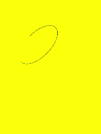

# Ellipse
<!--Kit: ArkUI-->
<!--Subsystem: ArkUI-->
<!--Owner: @camlostshi-->
<!--Designer: @fenglinbailu-->
<!--Tester: @liuli0427-->
<!--Adviser: @Brilliantry_Rui-->
<!-- md-trans-meta sourceCommit=4a069bef211e2909151a4545b04d42a08cabac3f translatedAt=2026-08-28T01:23:15.754Z pushedAt=2026-08-31T02:55:17.162Z -->

The **Ellipse** component is used to draw an ellipse. It draws an ellipse shape by setting the width and height attributes, rendering the ellipse outline and fill area within a given rectangular region.

>  **NOTE**
>
>  This component is supported since API version 7. Updates will be marked with a superscript to indicate their earliest API version.

## Child Components

None

## APIs

### Ellipse

new Ellipse(options?: EllipseOptions)

Constructor used to draw an ellipse. After being called, it creates an **Ellipse** object, for which the width and height attributes can be set.

**Atomic service API**: This API can be used in atomic services since API version 11.

**Widget capability**: This API can be used in ArkTS widgets since API version 9.

**System capability**: SystemCapability.ArkUI.ArkUI.Full

**Parameters**

| Name | Type | Mandatory | Description |
| -------- | -------- | -------- | -------- |
| options | [EllipseOptions](#ellipseoptions18) | No | Ellipse drawing configuration options, including the width and height settings. If not passed, the default size (both width and height are 0) is used.<br>The abnormal values **undefined** and **null** are handled as invalid values, and this setting does not take effect.<br>**Note:** Since API version 18, the **EllipseOptions** parameter must be used in the stage model.|

### Ellipse

Ellipse(options?: EllipseOptions)

Constructor used to draw an ellipse. After being called, it creates an **Ellipse** object, for which the width and height attributes can be set.

**Atomic service API**: This API can be used in atomic services since API version 11.

**Widget capability**: Since API version 9, this feature is supported in ArkTS widgets.

**System capability**: SystemCapability.ArkUI.ArkUI.Full

**Parameters**

| Name| Type| Mandatory| Description|
| -------- | -------- | -------- | -------- |
| options | [EllipseOptions](#ellipseoptions18) | No | Ellipse drawing configuration options, including the width and height settings. If not passed, the default size (both width and height are 0) is used.<br>The abnormal values **undefined** and **null** are handled as invalid values, and the setting does not take effect.<br>**Note:** Since API version 18, the EllipseOptions parameter must be used in the stage model.|

## EllipseOptions<sup>18+</sup>

Describes the options of the ellipse.

> **NOTE**
>
> To standardize anonymous object definitions, the element definitions here have been revised in API version 18. While historical version information is preserved for anonymous objects, there may be cases where the outer element's @since version number is higher than inner elements'. This does not affect interface usability.

**Widget capability**: This API can be used in ArkTS widgets since API version 18.

**Atomic service API**: This API can be used in atomic services since API version 18.

**Model restriction**: This API can be used only in the stage model.

**System capability**: SystemCapability.ArkUI.ArkUI.Full

| Name| Type| Read-Only| Optional| Description|
| -------- | -------- | -------- | -------- | -------- |
| width<sup>7+</sup> | [Length](ts-types.md#length) | No | Yes | Width, with the value range ≥ 0.<br>Default value: **0**<br>Default unit: vp<br>Abnormal values **undefined**, **null**, **NaN**, and **Infinity** are handled as the default value.<br>The Resource type is supported since API version 20.<br>**Widget capability:** This API can be used in ArkTS widgets since API version 9.<br>**Atomic service API:** This API can be used in atomic services since API version 11. |
| height<sup>7+</sup> | [Length](ts-types.md#length) | No | Yes | Height, with the value range ≥ 0.<br>Default value: **0**<br>Default unit: vp<br>Abnormal values **undefined**, **null**, **NaN**, and **Infinity** are handled as the default value.<br>The Resource type is supported since API version 20.<br>**Widget capability:** This API can be used in ArkTS widgets since API version 9.<br>**Atomic service API:** This API can be used in atomic services since API version 11. |

## Attributes

The [universal attributes](ts-component-general-attributes.md) and [universal attributes for drawing components](ts-drawing-components-common.md) are supported.

## Examples

### Example 1: Drawing an Ellipse

This example demonstrates how to use **fillOpacity** and **stroke** to set the opacity and stroke color of an ellipse.

```ts
// xxx.ets
@Entry
@Component
struct EllipseExample {
  build() {
    Column({ space: 10 }) {
      // Draw a 150 x 80 ellipse.
      Ellipse({ width: 150, height: 80 })
      // Draw a 150 x 100 ellipse with blue strokes.
      Ellipse()
        .width(150)
        .height(100)
        .fillOpacity(0)
        .stroke(Color.Blue)
        .strokeWidth(3)
    }.width('100%')
  }
}
```



### Example 2: Drawing an Ellipse with Different Parameter Types for Width and Height

This example demonstrates how to draw an ellipse using different length types of the **width** and **height** attributes.

```ts
// xxx.ets
@Entry
@Component
struct EllipseTypeExample {
  build() {
    Column({ space: 10 }) {
      // Draw a 150 x 80 ellipse.
      Ellipse({ width: '150', height: '80' }) // Use the string type.
      // Draw an ellipse of 80 × 150.
      Ellipse({ width: 80, height: 150 }) // Use the number type.
      // Use the Resource type to reference the ellipse with width and height resource strings.
      Ellipse({ width: $r('app.string.EllipseWidth'), height: $r('app.string.EllipseHeight') }) // Use the Resource type, which needs to be customized.
    }.width('100%')
  }
}
```


### Example 3: Dynamically Setting Attributes of the Ellipse Component Using attributeModifier

This example shows how to use **attributeModifier** to dynamically set the **fill**, **fillOpacity**, **stroke**, **strokeDashArray**, **strokeDashOffset**, **strokeLineCap**, **strokeOpacity**, **strokeWidth**, and **antiAlias** attributes of the **Ellipse** component.

```ts
// xxx.ets
class MyEllipseModifier implements AttributeModifier<EllipseAttribute> {
  applyNormalAttribute(instance: EllipseAttribute): void {
    // Fill color: #707070; fill opacity: 0.5; stroke color: #2787D9; stroke dash array: [20]; offset to left: 15; cap style: semi-circle; stroke opacity: 0.5; stroke width: 10; anti-aliasing enabled.
    instance.fill('#707070')
    instance.fillOpacity(0.5)
    instance.stroke('#2787D9')
    instance.strokeDashArray([20])
    instance.strokeDashOffset('15')
    instance.strokeLineCap(LineCapStyle.Round)
    instance.strokeOpacity(0.5)
    instance.strokeWidth(10)
    instance.antiAlias(true)
  }
}

@Entry
@Component
struct EllipseModifierDemo {
  @State modifier: MyEllipseModifier = new MyEllipseModifier()

  build() {
    Column() {
      Ellipse({ width: 150, height: 80 })
        .attributeModifier(this.modifier)
        .offset({ x: 20, y: 20 })
    }
  }
}
```

