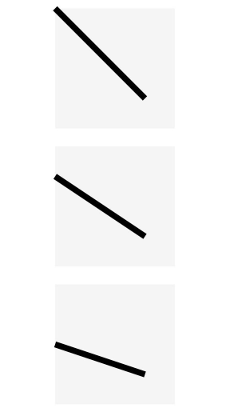
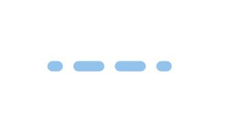

# Line
<!--Kit: ArkUI-->
<!--Subsystem: ArkUI-->
<!--Owner: @zjsxstar-->
<!--Designer: @sunbees-->
<!--Tester: @liuli0427-->
<!--Adviser: @Brilliantry_Rui-->

The **Line** component is used to draw a straight line.

>  **NOTE**
>
> This component is supported since API version 7. Updates will be marked with a superscript to indicate their earliest API version.
>
> This component supports dynamic constructor parameter updates using the [updateConstructorParams](../js-apis-arkui-AttributeUpdater.md#properties) API of the [AttributeUpdater](../js-apis-arkui-AttributeUpdater.md) class since API version 20.

## Child Components

Not supported


## APIs

Line(options?: LineOptions)

**Widget capability**: This API can be used in ArkTS widgets since API version 9.

**Atomic service API**: This API can be used in atomic services since API version 11.

**System capability**: SystemCapability.ArkUI.ArkUI.Full

**Parameters**

| Name| Type| Mandatory| Description
| -------- | -------- | -------- | -------- |
| options | [LineOptions](ts-drawing-components-line.md#lineoptions18) | No| Options for drawing a line.<br>The values undefined and null are invalid.|

## LineOptions<sup>18+</sup>

Describes the options for drawing a line.

> **NOTE**
>
> To standardize anonymous object definitions, the element definitions here have been revised in API version 18. While historical version information is preserved for anonymous objects, there may be cases where the outer element's @since version number is higher than inner elements'. This does not affect interface usability.

**Widget capability**: This API can be used in ArkTS widgets since API version 18.

**Atomic service API**: This API can be used in atomic services since API version 18.

**System capability**: SystemCapability.ArkUI.ArkUI.Full

| Name| Type| Read-Only| Optional| Description|
| -------- | -------- | -------- | -------- | -------- |
| width<sup>7+</sup> | [Length](ts-types.md#length) | No| Yes| Width.<br>If the value is invalid or the default value is used, the width required for the content is used.<br>Default unit: vp<br>**Widget capability**: This API can be used in ArkTS widgets since API version 9.<br>**Atomic service API**: This API can be used in atomic services since API version 11.|
| height<sup>7+</sup> | [Length](ts-types.md#length) | No| Yes| Height.<br>If the value is invalid or not specified, the height required by the content is used.<br>Default unit: vp<br>**Widget capability**: This API can be used in ArkTS widgets since API version 9.<br>**Atomic service API**: This API can be used in atomic services since API version 11.|

## Attributes

In addition to the [universal attributes](ts-component-general-attributes.md), the following attributes are supported.

### startPoint

startPoint(value: Array&lt;any&gt;)

Sets the coordinates (relative coordinates) of the start point of the line. The [attributeModifier](ts-universal-attributes-attribute-modifier.md#attributemodifier) attribute can be dynamically set. If the value is abnormal, the default value is used.

**Widget capability**: This API can be used in ArkTS widgets since API version 9.

**Atomic service API**: This API can be used in atomic services since API version 11.

**System capability**: SystemCapability.ArkUI.ArkUI.Full

**Parameters**

| Name| Type                                     | Mandatory| Description                                                        |
| ------ | ----------------------------------------- | ---- | ------------------------------------------------------------ |
| value  | Array&lt;any&gt; | Yes  | Coordinates (relative coordinates) of the start point of the line, in vp.<br>Default value: **[0, 0]**<br>If the value is undefined or null, the default value is used.|

### endPoint

endPoint(value: Array&lt;any&gt;)

Sets the coordinates (relative coordinates) of the end point of the line. The [attributeModifier](ts-universal-attributes-attribute-modifier.md#attributemodifier) can be used to dynamically set attributes. If an exception occurs, the default value is used.

**Widget capability**: This API can be used in ArkTS widgets since API version 9.

**Atomic service API**: This API can be used in atomic services since API version 11.

**System capability**: SystemCapability.ArkUI.ArkUI.Full

**Parameters**

| Name| Type                                     | Mandatory| Description                                                        |
| ------ | ----------------------------------------- | ---- | ------------------------------------------------------------ |
| value  | Array&lt;any&gt; | Yes  | Coordinates (relative coordinates) of the end point of the line, in vp.<br>Default value: **[0, 0]**<br>If the value is undefined or null, the default value is used.|

### fill

fill(value: ResourceColor)

Sets the color of the fill area. The [attributeModifier](ts-universal-attributes-attribute-modifier.md#attributemodifier) can be used to dynamically set attributes. This attribute has no effect for the **Line** component, which cannot be used to draw a closed shape.

**Widget capability**: This API can be used in ArkTS widgets since API version 9.

**Atomic service API**: This API can be used in atomic services since API version 11.

**System capability**: SystemCapability.ArkUI.ArkUI.Full

**Parameters**

| Name| Type                                      | Mandatory| Description                                  |
| ------ | ------------------------------------------ | ---- | -------------------------------------- |
| value  | [ResourceColor](ts-types.md#resourcecolor) | Yes  | Color of the fill area.<br>Default value: **Color.Black**<br>If the value is undefined, null, NaN, or Infinity, the default value is used.|

### fillOpacity

fillOpacity(value: number | string | Resource)

Sets the opacity of the fill area. This attribute can be dynamically set using [attributeModifier](ts-universal-attributes-attribute-modifier.md#attributemodifier). This attribute has no effect for the **Line** component, which cannot be used to draw a closed shape.

**Widget capability**: This API can be used in ArkTS widgets since API version 9.

**Atomic service API**: This API can be used in atomic services since API version 11.

**System capability**: SystemCapability.ArkUI.ArkUI.Full

**Parameters**

| Name| Type                                                        | Mandatory| Description                          |
| ------ | ------------------------------------------------------------ | ---- | ------------------------------ |
| value  | number \| string \| [Resource](ts-types.md#resource) | Yes  | Opacity of the fill area.<br>**NOTE**<br>If the value is in number format, the value range is [0.0, 1.0]. If the given value is less than 0.0, the value is 0.0. If the given value is greater than 1.0, the value is 1.0. Other abnormal values are processed as 1.0.<br>If the value is in string format, it can be a string of the value in number format. The value range is the same as that in number format.<br>If the value is in resource format, it can be a string in the system or application resources. The value range is the same as that in number format.<br>If the value is NaN, the value is processed as 0.0. If the value is undefined, null, or Infinity, the value is processed as 1.0.<br>Default value: **1.0**|

### stroke

stroke(value: ResourceColor)

Sets the stroke color. You can dynamically set this attribute using [attributeModifier](ts-universal-attributes-attribute-modifier.md#attributemodifier). If this attribute is not set, the default border opacity is 0, that is, there is no border.

**Widget capability**: This API can be used in ArkTS widgets since API version 9.

**Atomic service API**: This API can be used in atomic services since API version 11.

**System capability**: SystemCapability.ArkUI.ArkUI.Full

**Parameters**

| Name| Type                                      | Mandatory| Description      |
| ------ | ------------------------------------------ | ---- | ---------- |
| value  | [ResourceColor](ts-types.md#resourcecolor) | Yes  | Stroke color.<br>If the value is undefined or null, the default value is used. If the value is NaN or Infinity, the value is processed as Color.Black.|

### strokeDashArray

strokeDashArray(value: Array&lt;any&gt;)

Sets stroke dashes. The [attributeModifier](ts-universal-attributes-attribute-modifier.md#attributemodifier) can be dynamically set. Line segments may overlap when they intersect. The value must be greater than or equal to 0. Invalid values are treated as the default value.

**Widget capability**: This API can be used in ArkTS widgets since API version 9.

**Atomic service API**: This API can be used in atomic services since API version 11.

**System capability**: SystemCapability.ArkUI.ArkUI.Full

**Parameters**

| Name| Type                                     | Mandatory| Description                     |
| ------ | ----------------------------------------- | ---- | ------------------------- |
| value  | Array&lt;any&gt; | Yes  | Array defining the dash pattern for the line outline. Elements alternate between dash length and gap length.<br>Default value: [] (empty array)<br>Default unit: vp<br>If the value is undefined or null, the default value is used.<br>**NOTE**<br>Empty array: solid line<br>Even-numbered array: Elements cycle sequentially, for example, [a, b, c, d] represents: dash a -> gap b -> dash c -> gap d -> dash a -> ...<br>Odd-numbered array: Elements are duplicated to create an even-numbered array, for example, [a, b, c] becomes [a, b, c, a, b, c], representing: dash a -> gap b -> dash c -> gap a -> dash b -> gap c -> dash a -> ...|

### strokeDashOffset

strokeDashOffset(value: number | string)

Sets the offset of the border drawing start point. The [attributeModifier](ts-universal-attributes-attribute-modifier.md#attributemodifier) can be dynamically set.

**Widget capability**: This API can be used in ArkTS widgets since API version 9.

**Atomic service API**: This API can be used in atomic services since API version 11.

**System capability**: SystemCapability.ArkUI.ArkUI.Full

**Parameters**

| Name| Type                      | Mandatory| Description                                |
| ------ | -------------------------- | ---- | ------------------------------------ |
| value  | number \| string | Yes  | Offset of the start point for drawing the stroke.<br>Default value: **0**<br>Default unit: vp<br>If the value is undefined or null, the default value is used. If the value is NaN or Infinity, strokeDashArray becomes invalid.|

### strokeLineCap

strokeLineCap(value: LineCapStyle)

Sets the cap style of the stroke. You can call this method to dynamically set attributes through [attributeModifier](ts-universal-attributes-attribute-modifier.md#attributemodifier).

**Widget capability**: This API can be used in ArkTS widgets since API version 9.

**Atomic service API**: This API can be used in atomic services since API version 11.

**System capability**: SystemCapability.ArkUI.ArkUI.Full

**Parameters**

| Name| Type                                             | Mandatory| Description                                            |
| ------ | ------------------------------------------------- | ---- | ------------------------------------------------ |
| value  | [LineCapStyle](ts-appendix-enums.md#linecapstyle) | Yes  | Cap style of the stroke.<br>Default value: **LineCapStyle.Butt**<br>If the parameter value is undefined, null, NaN, or Infinity, the default value is used.|

### strokeLineJoin

strokeLineJoin(value: LineJoinStyle)

Sets the join style of the stroke. You can call this method to dynamically set attributes through [attributeModifier](ts-universal-attributes-attribute-modifier.md#attributemodifier). The Line component does not support corners. Therefore, this attribute setting is invalid.

**Widget capability**: This API can be used in ArkTS widgets since API version 9.

**Atomic service API**: This API can be used in atomic services since API version 11.

**System capability**: SystemCapability.ArkUI.ArkUI.Full

**Parameters**

| Name| Type                                               | Mandatory| Description                                              |
| ------ | --------------------------------------------------- | ---- | -------------------------------------------------- |
| value  | [LineJoinStyle](ts-appendix-enums.md#linejoinstyle) | Yes  | Join style of the stroke.<br>Default value: **LineJoinStyle.Miter**<br>If the parameter value is undefined, null, NaN, or Infinity, the default value is used.|

### strokeMiterLimit

strokeMiterLimit(value: number | string)

Sets the limit value when the sharp angle is drawn as a miter. This attribute can be dynamically set in [attributeModifier](ts-universal-attributes-attribute-modifier.md#attributemodifier). The Line component does not support acute angle rendering. This attribute is invalid.

**Widget capability**: This API can be used in ArkTS widgets since API version 9.

**Atomic service API**: This API can be used in atomic services since API version 11.

**System capability**: SystemCapability.ArkUI.ArkUI.Full

**Parameters**

| Name| Type                      | Mandatory| Description                                  |
| ------ | -------------------------- | ---- | -------------------------------------- |
| value  | number \| string | Yes  | Limit value when the sharp angle is drawn as a miter.<br>Default value: **4**<br>If the value is undefined, null, or NaN, the default value is used. If the value is Infinity, stroke becomes invalid.|

### strokeOpacity

strokeOpacity(value: number | string | Resource)

Sets the stroke opacity. This attribute can be dynamically set using [attributeModifier](ts-universal-attributes-attribute-modifier.md#attributemodifier). The value range is [0.0, 1.0]. If the given value is less than 0.0, the value is 0.0. If the given value is greater than 1.0, the value is 1.0.

**Widget capability**: This API can be used in ArkTS widgets since API version 9.

**Atomic service API**: This API can be used in atomic services since API version 11.

**System capability**: SystemCapability.ArkUI.ArkUI.Full

**Parameters**

| Name| Type                                                        | Mandatory| Description                      |
| ------ | ------------------------------------------------------------ | ---- | -------------------------- |
| value  | number \| string \| [Resource](ts-types.md#resource) | Yes  | Stroke opacity.<br>Default value: transparency set by the [stroke](#stroke) API.<br>If the value is NaN, the value is 0.0. If the value is undefined, null, or Infinity, the value is 1.0.|

### strokeWidth

strokeWidth(value: Length)

Sets the stroke width. You can call this method to set the attribute dynamically in [attributeModifier](ts-universal-attributes-attribute-modifier.md#attributemodifier). If of the string type, this parameter cannot be set in percentage. A percentage is processed as 1px.

**Widget capability**: This API can be used in ArkTS widgets since API version 9.

**Atomic service API**: This API can be used in atomic services since API version 11.

**System capability**: SystemCapability.ArkUI.ArkUI.Full

**Parameters**

| Name| Type                        | Mandatory| Description                    |
| ------ | ---------------------------- | ---- | ------------------------ |
| value  | [Length](ts-types.md#length) | Yes  | Stroke width. The value must be greater than or equal to 0.<br>Default value: **1**<br>Default unit: vp<br>If the value is undefined, null, or NaN, the default value is used. If the value is Infinity, the value 0 is used.|

### antiAlias

antiAlias(value: boolean)

Sets whether to enable anti-aliasing. You can call this method to set the attribute dynamically in [attributeModifier](ts-universal-attributes-attribute-modifier.md#attributemodifier).

**Widget capability**: This API can be used in ArkTS widgets since API version 9.

**Atomic service API**: This API can be used in atomic services since API version 11.

**System capability**: SystemCapability.ArkUI.ArkUI.Full

**Parameters**

| Name| Type   | Mandatory| Description                                 |
| ------ | ------- | ---- | ------------------------------------- |
| value  | boolean | Yes  | Whether anti-aliasing is enabled.<br>**true**: Anti-aliasing is enabled.<br>**false**: Anti-aliasing is disabled.<br>Default value: **true**<br>If the value is undefined or null, the default value is used.|

## Example

### Example 1: Drawing a Line

This example demonstrates how to use **startPoint**, **endPoint**, **fillOpacity**, **stroke**, **strokeDashArray**, and **strokeDashOffset** to set the start point, end point, opacity, stroke color, stroke dashes, and stroke offset of a line.

```ts
// xxx.ets
@Entry
@Component
struct LineExample {
  build() {
    Column({ space: 10 }) {
      // The coordinates of the start and end points of the line are determined relative to the coordinates of the drawing area of the <Line> component.
      Line()
        .width(200)
        .height(150)
        .startPoint([0, 0])
        .endPoint([50, 100])
        .stroke(Color.Black)
        .backgroundColor('#F5F5F5')
      Line()
        .width(200)
        .height(150)
        .startPoint([50, 50])
        .endPoint([150, 150])
        .strokeWidth(5)
        .stroke(Color.Orange)
        .strokeOpacity(0.5)
        .backgroundColor('#F5F5F5')
      // strokeDashOffset is used to define the offset when the associated strokeDashArray array is rendered.
      Line()
        .width(200)
        .height(150)
        .startPoint([0, 0])
        .endPoint([100, 100])
        .stroke(Color.Black)
        .strokeWidth(3)
        .strokeDashArray([10, 3])
        .strokeDashOffset(5)
        .backgroundColor('#F5F5F5')
      // If the coordinates of a point are beyond the width and height range of the <Line> component, the line will exceed the drawing area.
      Line()
        .width(50)
        .height(50)
        .startPoint([0, 0])
        .endPoint([100, 100])
        .stroke(Color.Black)
        .strokeWidth(3)
        .strokeDashArray([10, 3])
        .backgroundColor('#F5F5F5')
    }
  }
}
```


### Example 2: Setting the Stroke Cap Style

This example demonstrates how to use **strokeLineCap** to set the stroke cap style of a line.

```ts
// xxx.ets
@Entry
@Component
struct LineExample1 {
  build() {
    Row({ space: 10 }) {
      // Set LineCapStyle to Butt.
      Line()
        .width(100)
        .height(200)
        .startPoint([50, 50])
        .endPoint([50, 200])
        .stroke(Color.Black)
        .strokeWidth(20)
        .strokeLineCap(LineCapStyle.Butt)
        .backgroundColor('#F5F5F5')
        .margin(10)
      // Set LineCapStyle to Round.
      Line()
        .width(100)
        .height(200)
        .startPoint([50, 50])
        .endPoint([50, 200])
        .stroke(Color.Black)
        .strokeWidth(20)
        .strokeLineCap(LineCapStyle.Round)
        .backgroundColor('#F5F5F5')
      // Set LineCapStyle to Square.
      Line()
        .width(100)
        .height(200)
        .startPoint([50, 50])
        .endPoint([50, 200])
        .stroke(Color.Black)
        .strokeWidth(20)
        .strokeLineCap(LineCapStyle.Square)
        .backgroundColor('#F5F5F5')
    }
  }
}
```


### Example 3: Setting the Stroke Dashes

This example demonstrates how to use **strokeDashArray** to set the stroke dashes of a line.

```ts
// xxx.ets
@Entry
@Component
struct LineExample {
  build() {
    Column() {
      Line()
        .width(300)
        .height(30)
        .startPoint([50, 30])
        .endPoint([300, 30])
        .stroke(Color.Black)
        .strokeWidth(10)
      // Set the interval for strokeDashArray to 50.
      Line()
        .width(300)
        .height(30)
        .startPoint([50, 20])
        .endPoint([300, 20])
        .stroke(Color.Black)
        .strokeWidth(10)
        .strokeDashArray([50])
      // Set the interval for strokeDashArray to 50, 10.
      Line()
        .width(300)
        .height(30)
        .startPoint([50, 20])
        .endPoint([300, 20])
        .stroke(Color.Black)
        .strokeWidth(10)
        .strokeDashArray([50, 10])
      // Set the interval for strokeDashArray to 50, 10, 20.
      Line()
        .width(300)
        .height(30)
        .startPoint([50, 20])
        .endPoint([300, 20])
        .stroke(Color.Black)
        .strokeWidth(10)
        .strokeDashArray([50, 10, 20])
      // Set the interval for strokeDashArray to 50, 10, 20, 30.
      Line()
        .width(300)
        .height(30)
        .startPoint([50, 20])
        .endPoint([300, 20])
        .stroke(Color.Black)
        .strokeWidth(10)
        .strokeDashArray([50, 10, 20, 30])
    }
  }
}
```


### Example 4: Using Different Parameter Types for Width and Height to Draw a Line

The width and height attributes are used to draw a line with different length types.

```ts
// xxx.ets
@Entry
@Component
struct LineTypeExample {
  build() {
    Column({ space: 10 }) {
      // Draw a line whose start point is (0,0), end point is (150,150), and border width is 10 in the 200 x 200 area.
      Line({ width: '200', height: '200' })// Use the string type.
        .startPoint([0, 0])
        .endPoint([150, 150])
        .stroke(Color.Black)
        .strokeWidth(10)
        .backgroundColor('#F5F5F5')
        .margin(10)
      // Draw a line with the start point (0, 50), end point (150, 150), and border width 10 in the 200 x 200 area.
      Line({ width: 200, height: 200 })// Use the number type.
        .startPoint([0, 50])
        .endPoint([150, 150])
        .stroke(Color.Black)
        .strokeWidth(10)
        .backgroundColor('#F5F5F5')
        .margin(10)
      // Draw a line with the start point (0, 100), end point (150, 150), and border width 10 in the 200 x 200 area.
      Line({ width: $r('app.string.LineWidth'), height: $r('app.string.LineHeight') })// Use the Resource type. You need to customize the parameter.
        .startPoint([0, 100])
        .endPoint([150, 150])
        .stroke(Color.Black)
        .strokeWidth(10)
        .backgroundColor('#F5F5F5')
        .margin(10)
    }.width('100%')
  }
}
```



### Example 5: Using attributeModifier to Dynamically Set the Attributes of the Line Component

The following example shows how to use attributeModifier to dynamically set the startPoint, endPoint, stroke, strokeDashArray, strokeDashOffset, strokeLineCap, strokeOpacity, strokeWidth, and antiAlias attributes of the Line component.

```ts
// xxx.ets
class MyLineModifier implements AttributeModifier<LineAttribute> {
  applyNormalAttribute(instance: LineAttribute): void {
    // A line with the start point (10, 10), end point (120, 10), stroke color #2787D9, stroke dash [20], left offset 15, line end style as a semicircle, stroke opacity 0.5, stroke width 10, and anti-aliasing enabled.
    instance.startPoint([10,10])
    instance.endPoint([120, 10])
    instance.stroke("#2787D9")
    instance.strokeDashArray([20])
    instance.strokeDashOffset("15")
    instance.strokeLineCap(LineCapStyle.Round)
    instance.strokeOpacity(0.5)
    instance.strokeWidth(10)
    instance.antiAlias(true)
  }
}

@Entry
@Component
struct LineModifierDemo {
  @State modifier: MyLineModifier = new MyLineModifier()

  build() {
    Column() {
      Line()
        .attributeModifier(this.modifier)
        .offset({ x: 20, y: 20 })
    }
  }
}
```


