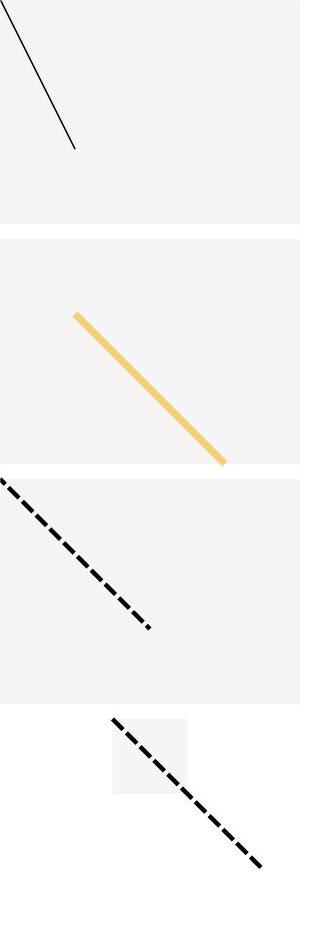
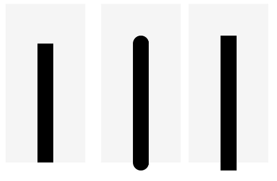
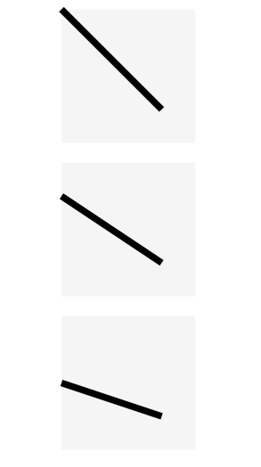
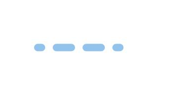

# Line
<!--Kit: ArkUI-->
<!--Subsystem: ArkUI-->
<!--Owner: @camlostshi-->
<!--Designer: @fenglinbailu-->
<!--Tester: @liuli0427-->
<!--Adviser: @Brilliantry_Rui-->
<!-- md-trans-meta sourceCommit=814c7cb9af37d443e12a84b71f28815df508c584 translatedAt=2026-08-28T01:24:46.780Z pushedAt=2026-08-31T03:40:47.858Z -->

The **Line** component is used to draw a straight line in the app UI. It supports customizing the start point, end point, color, width, opacity, dash style, and cap style of the line. It is suitable for drawing separators, decorative lines, coordinate axes or connecting lines in charts, and custom graphic borders.

>  **NOTE**
>
> This component is supported since API version 7. Updates will be marked with a superscript to indicate their earliest API version.
>
> Since API version 20, this component supports updating constructor parameters through the [updateConstructorParams](../js-apis-arkui-AttributeUpdater.md#properties) API of the [AttributeUpdater](../js-apis-arkui-AttributeUpdater.md) class.
>
> - The **Line** component cannot form a closed area, so the **fill** and **fillOpacity** attributes do not take effect.
> - The **Line** component does not support corners, so the **strokeLineJoin** and **strokeMiterLimit** attributes do not take effect.

## Child Components

None

## APIs

### Line

new Line(options?: LineOptions)

Draws a straight line. The **Line** component draws the line within the rectangular area defined by **width** and **height**. The upper left corner of the drawing area is the coordinate origin (0,0), with the x-axis extending to the right and the y-axis extending downward.

**Widget capability**: Since API version 9, this feature is supported in ArkTS widgets.

**Atomic service API**: This API can be used in atomic services since API version 11.

**System capability**: SystemCapability.ArkUI.ArkUI.Full

**Parameters**

| Name | Type | Mandatory | Description |
| -------- | -------- | -------- | -------- |
| options | [LineOptions](#lineoptions18) | No | Drawing area of the **Line** component, which contains the **width** and **height** attributes used to set the width and height of the **Line** component. If this parameter is not passed, the **width** and **height** attributes of the **Line** component are processed according to the default logic of their respective attributes (see the **LineOptions** object description).<br>The abnormal values **undefined** and **null** are processed as invalid values, and this setting does not take effect. |

### Line

Line(options?: LineOptions)

Draws a straight line. The **Line** component draws the line within the rectangular area defined by **width** and **height**. The upper left corner of the drawing area is the coordinate origin (0,0), with the x-axis extending to the right and the y-axis extending downward.

**Widget capability**: This API can be used in ArkTS widgets since API version 9.

**Atomic service API**: This API can be used in atomic services since API version 11.

**System capability**: SystemCapability.ArkUI.ArkUI.Full

**Parameters**

| Name| Type| Mandatory| Description|
| -------- | -------- | -------- | -------- |
| options | [LineOptions](#lineoptions18) | No | Drawing area of the **Line** component, which contains the **width** and **height** attributes used to set the width and height of the **Line** component. If this parameter is not passed, the **width** and **height** attributes of the Line component are processed based on their respective default logic (see **LineOptions** object description).<br>The abnormal values **undefined** and **null** are processed as invalid values, and this setting does not take effect. |

## LineOptions<sup>18+</sup>

Describes the options of the line.

> **NOTE**
>
> To standardize anonymous object definitions, the element definitions here have been revised in API version 18. While historical version information is preserved for anonymous objects, there may be cases where the outer element's @since version number is higher than inner elements'. This does not affect interface usability.

**Widget capability**: This API can be used in ArkTS widgets since API version 18.

**Atomic service API**: This API can be used in atomic services since API version 18.

**Model restriction**: This API can be used only in the stage model.

**System capability**: SystemCapability.ArkUI.ArkUI.Full

| Name| Type| Read-Only| Optional| Description|
| -------- | -------- | -------- | -------- | -------- |
| width<sup>7+</sup> | [Length](ts-types.md#length) | No | Yes | Width.<br>If the value is an abnormal value or is not set, the width of the drawing area is automatically calculated based on **startPoint** and **endPoint**.<br>Default unit: vp<br>**Widget capability:** This API can be used in ArkTS widgets since API version 9.<br>**Atomic service API:** This API can be used in atomic services since API version 11. |
| height<sup>7+</sup> | [Length](ts-types.md#length) | No | Yes | Height.<br>If the value is an abnormal value or is not set, the height of the drawing area is automatically calculated based on **startPoint** and **endPoint**.<br>Default unit: vp<br>**Widget capability:** This API can be used in ArkTS widgets since API version 9.<br>**Atomic service API:** This API can be used in atomic services since API version 11. |

## Attributes

In addition to the [universal attributes](ts-component-general-attributes.md) and [common attributes for drawing components](ts-drawing-components-common.md), the following attributes are supported:

### startPoint

startPoint(value: Array&lt;any&gt;)

Sets the coordinates of the line start point (relative to the origin at the upper left corner of the **Line** component drawing area). This attribute supports [attributeModifier](ts-universal-attributes-attribute-modifier.md#attributemodifier) for dynamic setting of the attribute method. Abnormal values are processed as the default value.

**Widget capability**: This API can be used in ArkTS widgets since API version 9.

**Atomic service API**: This API can be used in atomic services since API version 11.

**System capability**: SystemCapability.ArkUI.ArkUI.Full

**Parameters**

| Name| Type                                     | Mandatory| Description                                                        |
| ------ | ----------------------------------------- | ---- | ------------------------------------------------------------ |
| value  | Array&lt;any&gt; | Yes   | Coordinates of the start point of the line (relative to the upper left corner of the Line component's drawing area), in vp. The array format is [x-coordinate, y-coordinate]. The array length must be 2, and the elements must be of the Length type.<br>Default value: **[0, 0]** <br>The abnormal values **undefined** and **null** are processed as the default value.|

### endPoint

endPoint(value: Array&lt;any&gt;)

Sets the coordinates of the line end point (relative to the origin at the upper left corner of the **Line** component drawing area). This attribute supports [attributeModifier](ts-universal-attributes-attribute-modifier.md#attributemodifier) for dynamic setting of the attribute method. Abnormal values are processed as the default value.

**Widget capability**: This API can be used in ArkTS widgets since API version 9.

**Atomic service API**: This API can be used in atomic services since API version 11.

**System capability**: SystemCapability.ArkUI.ArkUI.Full

**Parameters**

| Name| Type                                     | Mandatory| Description                                                        |
| ------ | ----------------------------------------- | ---- | ------------------------------------------------------------ |
| value  | Array&lt;any&gt; | Yes   | End point coordinate of the line (relative to the upper left corner of the **Line** component drawing area), in vp. The array format is [x coordinate, y coordinate]. The array length must be 2, and the elements must be of the Length type.<br>Default value: **[0,&nbsp;0]** <br>Abnormal values **undefined** and **null** are processed as the default value.|

## Examples

### Example 1: Drawing a Line

This example draws the start point, end point, opacity, line color, line width, stroke gap, and drawing start point of the line through the **startPoint**, **endPoint**, **strokeOpacity**, **stroke**, **strokeWidth**, **strokeDashArray**, and **strokeDashOffset** attributes, respectively.

```ts
// xxx.ets
@Entry
@Component
struct LineExample {
  build() {
    Column({ space: 10 }) {
      // The coordinates of the start and end points of the line are determined relative to the coordinates of the drawing area of the <Line> component.
      Line()
        .width(200)
        .height(150)
        .startPoint([0, 0])
        .endPoint([50, 100])
        .stroke(Color.Black)
        .backgroundColor('#F5F5F5')
      // Set the start point to (50, 50), the end point to (150, 150), the line width to 5, the line color to orange, and the line opacity to 0.5.
      Line()
        .width(200)
        .height(150)
        .startPoint([50, 50])
        .endPoint([150, 150])
        .strokeWidth(5)
        .stroke(Color.Orange)
        .strokeOpacity(0.5)
        .backgroundColor('#F5F5F5')
      // strokeDashOffset is used to define the offset when the associated strokeDashArray array is rendered.
      Line()
        .width(200)
        .height(150)
        .startPoint([0, 0])
        .endPoint([100, 100])
        .stroke(Color.Black)
        .strokeWidth(3)
        .strokeDashArray([10, 3])
        .strokeDashOffset(5)
        .backgroundColor('#F5F5F5')
      // When the coordinate values exceed the width and height range of the Line component, the line is drawn outside the component drawing area. Set the dashed line mode: dash length 10, gap length 3.
      Line()
        .width(50)
        .height(50)
        .startPoint([0, 0])
        .endPoint([100, 100])
        .stroke(Color.Black)
        .strokeWidth(3)
        .strokeDashArray([10, 3])
        .backgroundColor('#F5F5F5')
    }
  }
}
```



### Example 2: Drawing Line Caps

This example draws the cap style of the line through the **strokeLineCap** attribute.

```ts
// xxx.ets
@Entry
@Component
struct LineExample1 {
  build() {
    Row({ space: 10 }) {
      // Set LineCapStyle to Butt.
      Line()
        .width(100)
        .height(200)
        .startPoint([50, 50])
        .endPoint([50, 200])
        .stroke(Color.Black)
        .strokeWidth(20)
        .strokeLineCap(LineCapStyle.Butt)
        .backgroundColor('#F5F5F5')
        .margin(10)
      // Set LineCapStyle to Round.
      Line()
        .width(100)
        .height(200)
        .startPoint([50, 50])
        .endPoint([50, 200])
        .stroke(Color.Black)
        .strokeWidth(20)
        .strokeLineCap(LineCapStyle.Round)
        .backgroundColor('#F5F5F5')
      // Set LineCapStyle to Square.
      Line()
        .width(100)
        .height(200)
        .startPoint([50, 50])
        .endPoint([50, 200])
        .stroke(Color.Black)
        .strokeWidth(20)
        .strokeLineCap(LineCapStyle.Square)
        .backgroundColor('#F5F5F5')
    }
  }
}
```



### Example 3: Drawing Stroke Gaps

This example draws the stroke gaps through the **strokeDashArray** attribute.

```ts
// xxx.ets
@Entry
@Component
struct LineExample {
  build() {
    Column() {
      Line()
        .width(300)
        .height(30)
        .startPoint([50, 30])
        .endPoint([300, 30])
        .stroke(Color.Black)
        .strokeWidth(10)
      // Set the interval for strokeDashArray to 50.
      Line()
        .width(300)
        .height(30)
        .startPoint([50, 20])
        .endPoint([300, 20])
        .stroke(Color.Black)
        .strokeWidth(10)
        .strokeDashArray([50])
      // Set the interval for strokeDashArray to 50, 10.
      Line()
        .width(300)
        .height(30)
        .startPoint([50, 20])
        .endPoint([300, 20])
        .stroke(Color.Black)
        .strokeWidth(10)
        .strokeDashArray([50, 10])
      // Set the interval for strokeDashArray to 50, 10, 20.
      Line()
        .width(300)
        .height(30)
        .startPoint([50, 20])
        .endPoint([300, 20])
        .stroke(Color.Black)
        .strokeWidth(10)
        .strokeDashArray([50, 10, 20])
      // Set the interval for strokeDashArray to 50, 10, 20, 30.
      Line()
        .width(300)
        .height(30)
        .startPoint([50, 20])
        .endPoint([300, 20])
        .stroke(Color.Black)
        .strokeWidth(10)
        .strokeDashArray([50, 10, 20, 30])
    }
  }
}
```

<!--Del--> <!--DelEnd-->

### Example 4: Drawing a Line with Different Parameter Types for Width and Height

This example demonstrates how to draw a line using different length types of the **width** and **height** attributes.

```ts
// xxx.ets
@Entry
@Component
struct LineTypeExample {
  build() {
    Column({ space: 10 }) {
      // Draw a line with a width of 10 in a 200 × 200 area, with the start point at (0,0) and the end point at (150,150).
      Line({ width: '200', height: '200' })// Use the string type.
        .startPoint([0, 0])
        .endPoint([150, 150])
        .stroke(Color.Black)
        .strokeWidth(10)
        .backgroundColor('#F5F5F5')
        .margin(10)
      // Draw a line with a width of 10 in a 200 × 200 area, with the start point at (0,50) and the end point at (150,150).
      Line({ width: 200, height: 200 })// Use the number type.
        .startPoint([0, 50])
        .endPoint([150, 150])
        .stroke(Color.Black)
        .strokeWidth(10)
        .backgroundColor('#F5F5F5')
        .margin(10)
      // Draw a line with a width of 10 in a 200 × 200 area, with the start point at (0,100) and the end point at (150,150).
      Line({ width: $r('app.string.LineWidth'), height: $r('app.string.LineHeight') })// Use the Resource type, which needs to be customized.
        .startPoint([0, 100])
        .endPoint([150, 150])
        .stroke(Color.Black)
        .strokeWidth(10)
        .backgroundColor('#F5F5F5')
        .margin(10)
    }.width('100%')
  }
}
```



### Example 5: Dynamically Setting Attributes of the Line Component Using attributeModifier

This example shows how to use **attributeModifier** to dynamically set the **startPoint**, **endPoint**, **stroke**, **strokeDashArray**, **strokeDashOffset**, **strokeLineCap**, **strokeOpacity**, **strokeWidth**, and **antiAlias** attributes of the **Line** component.

```ts
// xxx.ets
class MyLineModifier implements AttributeModifier<LineAttribute> {
  applyNormalAttribute(instance: LineAttribute): void {
    // A line from the start point (10, 10) to the end point (120, 10), with line color #2787D9, stroke gap [20], dash offset 15, round line cap style, line opacity 0.5, line width 10, and anti-aliasing enabled.
    instance.startPoint([10, 10])
    instance.endPoint([120, 10])
    instance.stroke('#2787D9')
    instance.strokeDashArray([20])
    instance.strokeDashOffset('15')
    instance.strokeLineCap(LineCapStyle.Round)
    instance.strokeOpacity(0.5)
    instance.strokeWidth(10)
    instance.antiAlias(true)
  }
}

@Entry
@Component
struct LineModifierDemo {
  @State modifier: MyLineModifier = new MyLineModifier()

  build() {
    Column() {
      Line()
        .attributeModifier(this.modifier)
        .offset({ x: 20, y: 20 })
    }
  }
}
```

