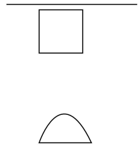
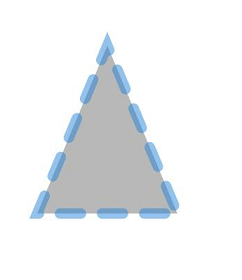

# Path
<!--Kit: ArkUI-->
<!--Subsystem: ArkUI-->
<!--Owner: @zjsxstar-->
<!--Designer: @sunbees-->
<!--Tester: @liuli0427-->
<!--Adviser: @HelloCrease-->

The **Path** component is used to draw a custom closed shape based on a specified drawing path.

> **NOTE**
>
> This component is supported since API version 7. Updates will be marked with a superscript to indicate their earliest API version.
>
> This component supports dynamic constructor parameter updates using the [updateConstructorParams](../js-apis-arkui-AttributeUpdater.md#properties) API of the [AttributeUpdater](../js-apis-arkui-AttributeUpdater.md) class since API version 20.


## Child Components

Not supported

## APIs

Path(options?: PathOptions)

**Widget capability**: This API can be used in ArkTS widgets since API version 9.

**Atomic service API**: This API can be used in atomic services since API version 11.

**System capability**: SystemCapability.ArkUI.ArkUI.Full

**Parameters**

| Name                                            | Type        | Mandatory| Description                  |
| ------ | ---------------- | ---- | ------------------------------------------------------------ |
| options  | [PathOptions](ts-drawing-components-path.md#pathoptions18) | No  | Options for path drawing.<br>Abnormal values undefined and null are processed as invalid values.|

## PathOptions<sup>18+</sup>

Describes the options for path drawing.

> **NOTE**
>
> To standardize anonymous object definitions, the element definitions here have been revised in API version 18. While historical version information is preserved for anonymous objects, there may be cases where the outer element's @since version number is higher than inner elements'. This does not affect interface usability.

**Widget capability**: This API can be used in ArkTS widgets since API version 18.

**Atomic service API**: This API can be used in atomic services since API version 18.

**System capability**: SystemCapability.ArkUI.ArkUI.Full

| Name| Type| Read-Only| Optional| Description|
| -------- | -------- | -------- | -------- | -------- |
| width<sup>7+</sup> | [Length](ts-types.md#length) | No| Yes| Width of the rectangle where the path is located.<br>If the value is invalid or the default value is used, the width required for the content is used.<br>Default unit: vp<br>**Widget capability**: This API can be used in ArkTS widgets since API version 9.<br>**Atomic service API**: This API can be used in atomic services since API version 11.|
| height<sup>7+</sup> | [Length](ts-types.md#length) | No| Yes| Height of the rectangle where the path is located.<br>If the value is invalid or the default value is used, the height required for the content is used.<br>Default unit: vp<br>**Widget capability**: This API can be used in ArkTS widgets since API version 9.<br>**Atomic service API**: This API can be used in atomic services since API version 11.|
| [commands<sup>7+</sup>](ts-drawing-components-path.md#commands) | [ResourceStr](ts-types.md#resourcestr)  | No| Yes| Command string for drawing the path.<br>If the value is invalid or the default value is used, the width and height required for the content are used. The default value is an empty string.<br>An invalid value is handled as the default value.<br>**Widget capability**: This API can be used in ArkTS widgets since API version 9.<br>**Atomic service API**: This API can be used in atomic services since API version 11.|

## Attributes

In addition to the [universal attributes](ts-component-general-attributes.md), the following attributes are supported.

### commands

commands(value: [ResourceStr](ts-types.md#resourcestr))

Sets a string of path commands that comply with the [SVG path syntax](ts-drawing-components-path.md#svg-path-syntax). The unit is px. For details about how to convert pixel units, see [Pixel Units](ts-pixel-units.md).

**Widget capability**: This API can be used in ArkTS widgets since API version 9.

**Atomic service API**: This API can be used in atomic services since API version 11.

**System capability**: SystemCapability.ArkUI.ArkUI.Full

**Parameters**

| Name| Type  | Mandatory| Description                         |
| ------ | ------ | ---- | ----------------------------- |
| value  | [ResourceStr](ts-types.md#resourcestr) | Yes  | Path for drawing a line.<br>The default value is an empty string.<br>Default unit: px<br>The **undefined** and **null** values are treated as the default value.|

### fill

fill(value: ResourceColor)

Sets the color of the fill area. This attribute can be dynamically set using [attributeModifier](ts-universal-attributes-attribute-modifier.md#attributemodifier). Invalid values are treated as the default value. If this attribute and the universal attribute **foregroundColor** are both set, whichever is set later takes effect.

**Widget capability**: This API can be used in ArkTS widgets since API version 9.

**Atomic service API**: This API can be used in atomic services since API version 11.

**System capability**: SystemCapability.ArkUI.ArkUI.Full

**Parameters**

| Name| Type                                      | Mandatory| Description                                  |
| ------ | ------------------------------------------ | ---- | -------------------------------------- |
| value  | [ResourceColor](ts-types.md#resourcecolor) | Yes  | Color of the fill area.<br>Default value: **Color.Black**<br>If the value is **undefined**, **null**, **NaN**, or **Infinity**, the default value will be used.|

### fillOpacity

fillOpacity(value: number | string | Resource)

Sets the opacity of the fill area. This attribute can be dynamically set using [attributeModifier](ts-universal-attributes-attribute-modifier.md#attributemodifier).

**Widget capability**: This API can be used in ArkTS widgets since API version 9.

**Atomic service API**: This API can be used in atomic services since API version 11.

**System capability**: SystemCapability.ArkUI.ArkUI.Full

**Parameters**

| Name| Type                                                        | Mandatory| Description                          |
| ------ | ------------------------------------------------------------ | ---- | ------------------------------ |
| value  | number \| string \| [Resource](ts-types.md#resource) | Yes  | Opacity of the fill area.<br>**NOTE**<br>The value range of the number format is [0.0, 1.0]. If the specified value is less than 0.0, the value is 0.0. If the specified value is greater than 1.0, the value is 1.0. Other abnormal values are processed as 1.0.<br>The string format supports the string format of the number format. The value range is the same as that of the number format.<br>The Resource format supports character strings in system resources or application resources. The value range is the same as that of the number format.<br>**NaN** is treated as **0.0**, while **undefined**, **null**, and **Infinity** are treated as **1.0**.<br>Default value: **1.0**.|

### stroke

stroke(value: ResourceColor)

Sets the stroke color. This attribute can be dynamically set using [attributeModifier](ts-universal-attributes-attribute-modifier.md#attributemodifier). If this attribute is not set, the default stroke color is opaque black.

**Widget capability**: This API can be used in ArkTS widgets since API version 9.

**Atomic service API**: This API can be used in atomic services since API version 11.

**System capability**: SystemCapability.ArkUI.ArkUI.Full

**Parameters**

| Name| Type                                      | Mandatory| Description      |
| ------ | ------------------------------------------ | ---- | ---------- |
| value  | [ResourceColor](ts-types.md#resourcecolor) | Yes  | Stroke color.<br>Abnormal values undefined and null are processed based on the default value, and NaN and Infinity are processed based on Color.Black.|

### strokeDashArray

strokeDashArray(value: Array&lt;any&gt;)

Sets the stroke dashes. This attribute can be dynamically set using [attributeModifier](ts-universal-attributes-attribute-modifier.md#attributemodifier). Line segments may overlap when they intersect. The value must be greater than or equal to 0. Invalid values are treated as the default value.

**Widget capability**: This API can be used in ArkTS widgets since API version 9.

**Atomic service API**: This API can be used in atomic services since API version 11.

**System capability**: SystemCapability.ArkUI.ArkUI.Full

**Parameters**

| Name| Type            | Mandatory| Description                     |
| ------ | ---------------- | ---- | ------------------------- |
| value  | Array&lt;any&gt; | Yes  | Stroke dashes.<br>Default value: [] (empty array)<br>Default unit: vp<br>The **undefined** and **null** values are treated as the default value.|

### strokeDashOffset

strokeDashOffset(value: number | string)

Sets the offset of the line drawing start point. This attribute can be dynamically set using [attributeModifier](ts-universal-attributes-attribute-modifier.md#attributemodifier). An invalid value is handled as the default value.

**Widget capability**: This API can be used in ArkTS widgets since API version 9.

**Atomic service API**: This API can be used in atomic services since API version 11.

**System capability**: SystemCapability.ArkUI.ArkUI.Full

**Parameters**

| Name| Type                      | Mandatory| Description                                |
| ------ | -------------------------- | ---- | ------------------------------------ |
| value  | number \| string | Yes  | Line dash offset.<br>Default value: **0**<br>Default unit: vp<br>Abnormal values undefined and null are processed based on the default values. NaN and Infinity will cause strokeDashArray to become invalid.|

### strokeLineCap

strokeLineCap(value: LineCapStyle)

Sets the style of end points of lines. This attribute can be dynamically set using [attributeModifier](ts-universal-attributes-attribute-modifier.md#attributemodifier).

**Widget capability**: This API can be used in ArkTS widgets since API version 9.

**Atomic service API**: This API can be used in atomic services since API version 11.

**System capability**: SystemCapability.ArkUI.ArkUI.Full

**Parameters**

| Name| Type                                             | Mandatory| Description                                            |
| ------ | ------------------------------------------------- | ---- | ------------------------------------------------ |
| value  | [LineCapStyle](ts-appendix-enums.md#linecapstyle) | Yes  | Style of the end points of lines.<br>Default value: **LineCapStyle.Butt**<br>If the value is **undefined**, **null**, **NaN**, or **Infinity**, the default value will be used.|

### strokeLineJoin

strokeLineJoin(value: LineJoinStyle)

Sets the join style of lines. This attribute can be dynamically set using [attributeModifier](ts-universal-attributes-attribute-modifier.md#attributemodifier).

**Widget capability**: This API can be used in ArkTS widgets since API version 9.

**Atomic service API**: This API can be used in atomic services since API version 11.

**System capability**: SystemCapability.ArkUI.ArkUI.Full

**Parameters**

| Name| Type                                               | Mandatory| Description                                              |
| ------ | --------------------------------------------------- | ---- | -------------------------------------------------- |
| value  | [LineJoinStyle](ts-appendix-enums.md#linejoinstyle) | Yes  | Join style of lines.<br>Default value: **LineJoinStyle.Miter**<br>If the value is **undefined**, **null**, **NaN**, or **Infinity**, the default value will be used.|

### strokeMiterLimit

strokeMiterLimit(value: number | string)

Sets the limit on the ratio of the miter length to the value of stroke width used to draw a miter join. This attribute can be dynamically set using [attributeModifier](ts-universal-attributes-attribute-modifier.md#attributemodifier). The miter length indicates the distance from the outer tip to the inner corner of the miter. This attribute works only when **strokeLineJoin** is set to **LineJoinStyle.Miter**.

The value must be greater than or equal to 1.0. If the value is in the [0, 1) range, the value **1.0** will be used. In other cases, the default value will be used.

**Widget capability**: This API can be used in ArkTS widgets since API version 9.

**Atomic service API**: This API can be used in atomic services since API version 11.

**System capability**: SystemCapability.ArkUI.ArkUI.Full

**Parameters**

| Name| Type                      | Mandatory| Description                                          |
| ------ | -------------------------- | ---- | ---------------------------------------------- |
| value  | number \| string | Yes  | Limit on the ratio of the miter length to the value of **strokeWidth** used to draw a miter join.<br>Default value: **4**<br>The abnormal values undefined, null, and NaN are processed based on the default values. Infinity causes the stroke failure.|

### strokeOpacity

strokeOpacity(value: number | string | Resource)

Sets the stroke opacity. This attribute can be dynamically set using [attributeModifier](ts-universal-attributes-attribute-modifier.md#attributemodifier). The value range of this attribute is [0.0, 1.0]. If the given value is less than 0.0, the value is 0.0. If the given value is greater than 1.0, the value is 1.0.

**Widget capability**: This API can be used in ArkTS widgets since API version 9.

**Atomic service API**: This API can be used in atomic services since API version 11.

**System capability**: SystemCapability.ArkUI.ArkUI.Full

**Parameters**

| Name| Type                                                        | Mandatory| Description                      |
| ------ | ------------------------------------------------------------ | ---- | -------------------------- |
| value  | number \| string \| [Resource](ts-types.md#resource) | Yes  | Stroke opacity.<br>Default value: **1**<br>**NaN** is treated as **0.0**, while **undefined**, **null**, and **Infinity** are treated as **1.0**.|

### strokeWidth

strokeWidth(value: Length)

Sets the stroke width. This attribute can be dynamically set using [attributeModifier](ts-universal-attributes-attribute-modifier.md#attributemodifier). If of the string type, this attribute cannot be set in percentage. A percentage is processed as 1 px.

**Widget capability**: This API can be used in ArkTS widgets since API version 9.

**Atomic service API**: This API can be used in atomic services since API version 11.

**System capability**: SystemCapability.ArkUI.ArkUI.Full

**Parameters**

| Name| Type                        | Mandatory| Description                    |
| ------ | ---------------------------- | ---- | ------------------------ |
| value  | [Length](ts-types.md#length) | Yes  | Stroke width. The value must be greater than or equal to 0.<br>Default value: **1**<br>Default unit: vp<br>Default unit: vp<br>For abnormal values undefined, null, and NaN, the default value is used. For Infinity, the value 0 is used.|

### antiAlias

antiAlias(value: boolean)

Sets whether to enable anti-aliasing. This attribute can be dynamically set using [attributeModifier](ts-universal-attributes-attribute-modifier.md#attributemodifier).

**Widget capability**: This API can be used in ArkTS widgets since API version 9.

**Atomic service API**: This API can be used in atomic services since API version 11.

**System capability**: SystemCapability.ArkUI.ArkUI.Full

**Parameters**

| Name| Type   | Mandatory| Description                                 |
| ------ | ------- | ---- | ------------------------------------- |
| value  | boolean | Yes  | Whether anti-aliasing is enabled.<br>**true**: Anti-aliasing is enabled. **false**: Anti-aliasing is disabled.<br>Default value: **true**<br>The **undefined** and **null** values are treated as the default value.|

## SVG Path Syntax

The table below lists the supported SVG path commands.

| Command  | Name                              | Parameter                                      | Description                                      |
| ---- | -------------------------------- | ---------------------------------------- | ---------------------------------------- |
| M    | moveto                           | x: x-coordinate of the start point.<br>y: y-coordinate of the start point.                                   | Starts a new subpath at the given (x, y) coordinates. For example, M 0 0 indicates that the (0, 0) point is used as the start point of the new subpath.|
| L    | lineto                           | x: x-coordinate of the end point of the line.<br>y: y-coordinate of the end point of the line.                                   | Draws a line from the current point to the given (x, y) coordinates. The coordinates become the new current point. For example, L 50 50 indicates that a line is drawn from the current point to (50, 50) and (50, 50) is used as the start point of the new subpath.|
| H    | horizontal lineto                | x: x-coordinate of the end point of the horizontal line.                                       | Draws a horizontal line to the given X coordinate. Equivalent to an **L** command with the current Y coordinate. For example, if the current point is (100, 100), H 50 indicates that a line is drawn from the current point to (50, 100) and (50, 100) is used as the start point of the new subpath.|
| V    | vertical lineto                  | y: y-coordinate of the end point of the vertical line.                                       | Draws a vertical line to the given Y coordinate. Equivalent to an **L** command with the current X coordinate. For example, if the current point is (100, 100), V 50 indicates that a line is drawn from the current point to (100, 50) and (100, 50) is used as the start point of the new subpath.|
| C    | curveto                          | x1: x-coordinate of the first control point.<br>y1: y-coordinate of the first control point.<br>x2: x-coordinate of the second control point.<br>y2: y-coordinate of the second control point.<br>x: x-coordinate of the end point.<br>y: y-coordinate of the end point.                       | Uses (x1, y1) as the control point of the curve start point and (x2, y2) as the control point of the curve end point to draw a cubic Bezier curve from the current point to (x, y). For example, C100 100 250 100 250 200 indicates that a cubic Bezier curve is drawn from the current point to (250, 200) and (250, 200) is used as the start point of the new subpath.|
| S    | smooth curveto                   | x2: x-coordinate of the second control point.<br>y2: y-coordinate of the second control point.<br>x: x-coordinate of the end point.<br>y: y-coordinate of the end point.                             |(x2, y2) is used as the control point of the curve end point to draw a cubic Bezier curve from the current point to (x, y). If the previous command is **C** or **S**, the control point of the curve start point is the mapping of the control point of the curve end point in the previous command relative to the start point. For example, C100 100 250 100 250 200 S400 300 400 200 indicates that the start control point of the second cubic Bezier curve is (250, 300). If there is no previous command or the previous command is not **C** or **S**, the control point of the curve start point coincides with the current point.|
| Q    | quadratic Belzier curve          | x1: x coordinate of the first control point.<br>y1: y coordinate of the first control point.<br>x: x coordinate of the end point.<br>y: y coordinate of the end point.                             | Uses (x1, y1) as the control point to draw a quadratic Bezier curve from the current point to (x, y). For example, Q400 50 600 300 indicates that a quadratic Bezier curve is drawn from the current point to (600, 300) and (600, 300) is used as the start point of the new subpath.|
| T    | smooth quadratic Belzier curveto | x: x coordinate of the end point.<br>y: y coordinate of the end point.                                   | Draws a quadratic Bezier curve from the current point to (x, y). If the previous command is **Q** or **T**, the control point is the mapping of the control point of the curve end point in the previous command relative to the start point. For example, Q400 50 600 300 T1000 300. The control point of the second Bezier curve is (800, 350). If there is no previous command or the previous command is not Q or T, the first control point coincides with the current point.|
| A    | elliptical Arc                   | rx: x-axis radius of the ellipse.<br>ry: y-axis radius of the ellipse.<br>x-axis-rotation: rotation angle of the ellipse relative to the coordinate system.<br>large-arc-flag: indicates whether to draw a large arc (1) or a small arc (0).<br>sweep-flag: indicates whether to draw clockwise (1) or counterclockwise (0).<br>x: x coordinate of the end point.<br>y: y coordinate of the end point.| Draws an ellipse arc from the current point to (x, y). The size and direction of the ellipse are defined by two radii (rx, ry) and x-axis-rotation, indicating how the entire ellipse is rotated relative to the current coordinate system (in degrees). **large-arc-flag** and **sweep-flag** define how the arc is drawn.|
| Z    | closepath                        | none                                     | Closes the current subpath by connecting the current path back to the initial point of the current subpath.            |

For example, **commands('M0 20 L50 50 L50 100 Z')** defines a triangle that starts from position (0, 20), by drawing a line from point (0, 20) to point (50, 50), then a line from point (50, 50) to point (50, 100), and finally a line from point (50, 100) to point (0, 20).

## Example

### Example 1: Drawing Rectangles

This example demonstrates how to use **commands**, **fillOpacity**, and **stroke** to draw a closed shape with the specified path, opacity, and stroke color.

```ts
// xxx.ets
@Entry
@Component
struct PathExample {
  build() {
    Column({ space: 10 }) {
      Text('Straight line')
        .fontSize(11)
        .fontColor(0xCCCCCC)
        .width('90%')
      // Draw a straight line whose length is 600 px and width is 3 vp.
      Path()
        .width('600px')
        .height('10px')
        .commands('M0 0 L600 0')
        .stroke(Color.Black)
        .strokeWidth(3)

      Text('Straight line graph')
        .fontSize(11)
        .fontColor(0xCCCCCC)
        .width('90%')
      // Draw a straight line.
      Flex({ justifyContent: FlexAlign.SpaceBetween }) {
        Path()
          .width('210px')
          .height('310px')
          .commands('M100 0 L200 240 L0 240 Z')
          .fillOpacity(0)
          .stroke(Color.Black)
          .strokeWidth(3)
        Path()
          .width('210px')
          .height('310px')
          .commands('M0 0 H200 V200 H0 Z')
          .fillOpacity(0)
          .stroke(Color.Black)
          .strokeWidth(3)
        Path()
          .width('210px')
          .height('310px')
          .commands('M100 0 L0 100 L50 200 L150 200 L200 100 Z')
          .fillOpacity(0)
          .stroke(Color.Black)
          .strokeWidth(3)
      }.width('95%')

      Text('Curve graphics').fontSize(11).fontColor(0xCCCCCC).width('90%')
      // Draw an arc.
      Flex({ justifyContent: FlexAlign.SpaceBetween }) {
        Path()
          .width('250px')
          .height('310px')
          .commands("M0 300 S100 0 240 300 Z")
          .fillOpacity(0)
          .stroke(Color.Black)
          .strokeWidth(3)
        Path()
          .width('210px')
          .height('310px')
          .commands('M0 150 C0 100 140 0 200 150 L100 300 Z')
          .fillOpacity(0)
          .stroke(Color.Black)
          .strokeWidth(3)
        Path()
          .width('210px')
          .height('310px')
          .commands('M0 100 A30 20 20 0 0 200 100 Z')
          .fillOpacity(0)
          .stroke(Color.Black)
          .strokeWidth(3)
      }.width('95%')
    }.width('100%')
    .margin({ top: 5 })
  }
}
```


### Example 2 (Drawing Paths Using Different Parameter Types)

The width, height, and commands attributes use different length types to draw graphics.

```ts
// xxx.ets
@Entry
@Component
struct PathTypeExample {
  build() {
    Column({ space: 10 }) {
      // Use the string type for the width, height, and command string to draw a line.
      Path({ width: '600px', height: '10px' })
        .commands('M0 0 L600 0')
        .fillOpacity(0)
        .stroke(Color.Black)
        .strokeWidth(3)
      // Use the number type for the width and height to draw an arc.
      Path({ width: 200, height: 200 })
        .commands('M0 0 H200 V200 H0 Z')
        .fillOpacity(0)
        .stroke(Color.Black)
        .strokeWidth(3)
      // Use the Resource type (customized by the user) for the width, height, and command string to draw an arc.
      Path({ width: $r('app.string.PathWidth'), height: $r('app.string.PathHeight') })
        .commands($r('app.string.PathCommands'))
        .fillOpacity(0)
        .stroke(Color.Black)
        .strokeWidth(3)
    }.width('100%')
    .margin({ top: 5 })
  }
}
```



### Example 3 (Using attributeModifier to Dynamically Set the Attributes of the Path Component)

The following example shows how to use attributeModifier to dynamically set the commands, fill, fillOpacity, stroke, strokeDashArray, strokeDashOffset, strokeLineCap, strokeLineJoin, strokeMiterLimit, strokeOpacity, strokeWidth, and antiAlias attributes of the Path component.

```ts
// xxx.ets
class MyPathModifier implements AttributeModifier<PathAttribute> {
  applyNormalAttribute(instance: PathAttribute): void {
    // Using string commands to draw a triangle with fill color #707070, fill opacity 0.5, stroke color #2787D9, stroke dash array [20], dash offset 15, line cap round, line join miter, miter limit 5, stroke opacity 0.5, stroke width 10, and anti-aliasing enabled.
    instance.commands('M100 0 L200 240 L0 240 Z')
    instance.fill("#707070")
    instance.fillOpacity(0.5)
    instance.stroke("#2787D9")
    instance.strokeDashArray([20])
    instance.strokeDashOffset("15")
    instance.strokeLineCap(LineCapStyle.Round)
    instance.strokeLineJoin(LineJoinStyle.Miter)
    instance.strokeMiterLimit(5)
    instance.strokeOpacity(0.5)
    instance.strokeWidth(10)
    instance.antiAlias(true)
  }
}

@Entry
@Component
struct PathModifierDemo {
  @State modifier: MyPathModifier = new MyPathModifier()

  build() {
    Column() {
      Path()
        .attributeModifier(this.modifier)
        .offset({ x: 20, y: 20 })
    }
  }
}
```


