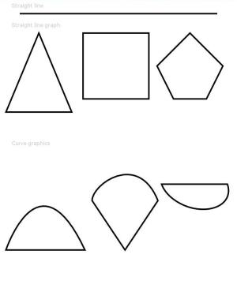
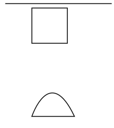

# Path
<!--Kit: ArkUI-->
<!--Subsystem: ArkUI-->
<!--Owner: @camlostshi-->
<!--Designer: @fenglinbailu-->
<!--Tester: @liuli0427-->
<!--Adviser: @Brilliantry_Rui-->
<!-- md-trans-meta sourceCommit=4a069bef211e2909151a4545b04d42a08cabac3f translatedAt=2026-08-28T01:24:59.707Z pushedAt=2026-08-31T03:42:27.773Z -->

The **Path** component generates a closed custom shape based on the drawing path, and supports defining complex geometric shapes through the SVG path syntax.

> **NOTE**
>
> This component is supported since API version 7. Updates will be marked with a superscript to indicate their earliest API version.
>
> Since API version 20, this component supports updating constructor parameters through the [updateConstructorParams](../js-apis-arkui-AttributeUpdater.md#properties) API of the [AttributeUpdater](../js-apis-arkui-AttributeUpdater.md) class.


## Child Components

None

## APIs

### Path

new Path(options?: PathOptions)

Creates a **Path** object instance, which is used to generate a closed custom shape based on the drawing path.

**Atomic service API**: This API can be used in atomic services since API version 11.

**Widget capability**: This API can be used in ArkTS widgets since API version 9.

**System capability**: SystemCapability.ArkUI.ArkUI.Full

**Parameters**

| Name                                             | Type         | Mandatory | Description                   |
| ------ | ---------------- | ---- | ------------------------------------------------------------ |
| options  | [PathOptions](#pathoptions18) | No   | Configuration object of the drawing attributes of the **Path** component.<br>If this parameter is not set, no drawing attribute is set, and the component is displayed at the default size. The default width and height are automatically calculated based on the path content.<br>The abnormal values **undefined** and **null** are processed as invalid values, and this setting does not take effect.<br>**Note:** Since API version 18, the PathOptions parameter must be used in the stage model. |

### Path

Path(options?: PathOptions)

Creates a **Path** component, which is used to generate a closed custom shape based on the drawing path.

**Atomic service API**: This API can be used in atomic services since API version 11.

**Widget capability**: Since API version 9, this feature is supported in ArkTS widgets.

**System capability**: SystemCapability.ArkUI.ArkUI.Full

**Parameters**

| Name                                            | Type        | Mandatory| Description                  |
| ------ | ---------------- | ---- | ------------------------------------------------------------ |
| options  | [PathOptions](#pathoptions18) | No   | Configuration object of the **Path** component drawing attributes.<br>If this parameter is omitted, no drawing attribute is set, and the component is displayed at the default size. The default width and height are automatically calculated based on the path content.<br>Abnormal values **undefined** and **null** are processed as invalid values, and this setting does not take effect.<br>**Note:** Since API version 18, when the **PathOptions** parameter is used, it can be used only in the stage model.|

## PathOptions<sup>18+</sup>

Describes the options of the path.

> **NOTE**
>
> To standardize anonymous object definitions, the element definitions here have been revised in API version 18. While historical version information is preserved for anonymous objects, there may be cases where the outer element's @since version number is higher than inner elements'. This does not affect interface usability.

**Widget capability**: This API can be used in ArkTS widgets since API version 18.

**Atomic service API**: This API can be used in atomic services since API version 18.

**Model restriction**: This API can be used only in the stage model.

**System capability**: SystemCapability.ArkUI.ArkUI.Full

| Name| Type| Read-Only| Optional| Description|
| -------- | -------- | -------- | -------- | -------- |
| width<sup>7+</sup> | [Length](ts-types.md#length) | No | Yes | Width of the rectangle where the path is located. The value range is ≥ 0.<br>If the value is an abnormal value or is not set, the width is automatically calculated based on the path content.<br>Default unit: vp<br>**Widget capability:** This API can be used in ArkTS widgets since API version 9.<br>**Atomic service API:** This API can be used in atomic services since API version 11. |
| height<sup>7+</sup> | [Length](ts-types.md#length) | No | Yes | Height of the rectangle where the path is located. The value range is ≥ 0.<br>If the value is an abnormal value or is not set, the height is automatically calculated based on the path content.<br>Default unit: vp<br>**Widget capability:** This API can be used in ArkTS widgets since API version 9.<br>**Atomic service API:** This API can be used in atomic services since API version 11. |
| [commands<sup>7+</sup>](#commands) | [ResourceStr](ts-types.md#resourcestr)  | No | Yes | Command string for path drawing, complying with the [SVG Path Syntax](#svg-path-syntax), in px.<br>Default value: empty string<br>An abnormal value is processed as the default value.<br>**Widget capability:** This API can be used in ArkTS widgets since API version 9.<br>**Atomic service API:** This API can be used in atomic services since API version 11. |

## Attributes

In addition to the [universal attributes](ts-component-general-attributes.md) and [universal drawing attributes](ts-drawing-components-common.md), the following attributes are supported:

### commands

commands(value: ResourceStr)

Sets the command string that complies with the [SVG path syntax](#svg-path-syntax), in px. The command string determines the drawing shape and trajectory of the path. This attribute can be dynamically set using [attributeModifier](ts-universal-attributes-attribute-modifier.md#attributemodifier). For details about the pixel unit conversion method, see [Pixel Units](ts-pixel-units.md).

**Widget capability**: This API can be used in ArkTS widgets since API version 9.

**Atomic service API**: This API can be used in atomic services since API version 11.

**System capability**: SystemCapability.ArkUI.ArkUI.Full

**Parameters**

| Name| Type                        | Mandatory| Description                    |
| ------ | ---------------------------- | ---- | ------------------------ |
| value  | [ResourceStr](ts-types.md#resourcestr) | Yes   | Command string for path drawing. It must comply with the [SVG path syntax](#svg-path-syntax), in px.<br>Default value: empty string<br>Abnormal values **undefined** and **null** are processed as the default value.|

## SVG Path Syntax

The table below lists the supported SVG path commands.

| Command  | Name                              | Parameter                                      | Description                                      |
| ---- | -------------------------------- | ---------------------------------------- | ---------------------------------------- |
| M    | moveto                           | **x**: x-axis coordinate of the start point.<br>**y**: y-axis coordinate of the start point.                                    | Starts a new subpath at the given (x, y) coordinates. For example, `M 0 0` uses the point (0, 0) as the start point of a new subpath. |
| L    | lineto                           | **x**: x-axis coordinate of the end point of the line.<br>**y**: y-axis coordinate of the end point of the line.                                    | Draws a line from the current point to the given (x, y) coordinates, which become the new current point. For example, `L 50 50` draws a line from the current point to the point (50, 50) and uses the point (50, 50) as the start point of a new subpath. |
| H    | horizontal lineto                | **x**: X-coordinate of the end point of the horizontal line.                                       | Draws a horizontal line to the given X coordinate. Equivalent to an **L** command with the current Y coordinate. For example, **H 50** draws a horizontal line from the current point to (50, current y).|
| V    | vertical lineto                  | **y**: Y-coordinate of the end point of the vertical line.                                       | Draws a vertical line to the given Y coordinate. Equivalent to an **L** command with the current X coordinate. For example, given a current point of (100, 100), the command **V 50** draws a vertical line to the point (100, 50) and then sets (100, 50) as the new current point.|
| C    | curveto                          | **x1**: x-coordinate value of the first control point parameter.<br>**y1**: y-coordinate value of the first control point parameter.<br>**x2**: x-coordinate value of the second control point parameter.<br>**y2**: y-coordinate value of the second control point parameter.<br>**x**: x-coordinate value of the end point parameter.<br>**y**: y-coordinate value of the end point parameter.                        | Draws a cubic Bézier curve from the current point to (x, y), using (x1, y1) as the control point of the curve start and (x2, y2) as the control point of the curve end. For example, `C100 100 250 100 250 200 ` draws a cubic Bézier curve from the current point to the point (250, 200) and uses the point (250, 200) as the start point of a new subpath. |
| S    | smooth curveto                   | **x2**: x-coordinate value of the second control point parameter.<br>**y2**: y-coordinate value of the second control point parameter.<br>**x**: x-coordinate value of the end point parameter.<br>**y**: y-coordinate value of the end point parameter.                              |Draws a cubic Bézier curve from the current point to (x, y), using (x2, y2) as the control point of the curve end. If the previous command is C or S, the start control point is the reflection of the end control point of the previous command relative to the current point. For example, in `C100 100 250 100 250 200 S400 300 400 200`, the start control point of the second Bézier curve is (250, 300). If there is no previous command or the previous command is not C or S, the first control point coincides with the current point. |
| Q    | quadratic Bezier curve          | **x1**: x-coordinate value of the first control point parameter.<br>**y1**: y-coordinate value of the first control point parameter.<br>**x**: x-coordinate value of the end point parameter.<br>**y**: y-coordinate value of the end point parameter.                              | Draws a quadratic Bézier curve from the current point to (x, y), using (x1, y1) as the control point. For example, `Q400 50 600 300 ` draws a quadratic Bézier curve from the current point to the point (600, 300) and uses the point (600, 300) as the start point of a new subpath. |
| T    | smooth quadratic Bezier curveto | **x**: x-coordinate value of the end point parameter.<br>**y**: y-coordinate value of the end point parameter.                                    | Draws a quadratic Bézier curve from the current point to (x, y). If the previous command is Q or T, the control point is the reflection of the end control point of the previous command relative to the current point. For example, in `Q400 50 600 300 T1000 300`, the control point of the second Bézier curve is (800, 550). If there is no previous command or the previous command is not Q or T, the first control point coincides with the current point. |
| A    | elliptical Arc                   | **rx**: x-axis radius of the ellipse.<br>**ry**: y-axis radius of the ellipse.<br>x-axis-rotation: rotation angle of the ellipse relative to the coordinate system.<br>**large-arc-flag**: flag indicating whether to draw the large arc (1) or the small arc (0).<br>**sweep-flag**: flag indicating whether to draw in the clockwise (1) or counterclockwise (0) direction.<br>**x**: x-coordinate value of the end point parameter.<br>**y**: y-coordinate value of the end point parameter. | Draws an elliptical arc from the current point to (x, y). The size and orientation of the ellipse are defined by the two radii (rx, ry) and **x-axis-rotation**, which indicates how the entire ellipse is rotated relative to the current coordinate system (in degrees). **large-arc-flag** and **sweep-flag** determine how the arc is drawn. |
| Z    | closepath                        | none                                     | Closes the current subpath by connecting the current path back to the initial point of the current subpath.            |

For example, the command string **commands('M0 20 L50 50 L50 100 Z')** defines a triangle: It starts at (0, 20), draws a line to (50, 50), then to (50, 100), and finally closes the path back to (0, 20).

## Examples

### Example 1: Drawing Rectangles

This example demonstrates how to use **commands**, **fillOpacity**, and **stroke** to draw a closed shape with the specified path, opacity, and stroke color.

```ts
// xxx.ets
@Entry
@Component
struct PathExample {
  build() {
    Column({ space: 10 }) {
      Text('Straight line')
        .fontSize(11)
        .fontColor(0xCCCCCC)
        .width('90%')
      // Draw a straight line whose length is 600 px and width is 3 vp.
      Path()
        .width('600px')
        .height('10px')
        .commands('M0 0 L600 0')
        .stroke(Color.Black)
        .strokeWidth(3)

      Text('Straight line graph')
        .fontSize(11)
        .fontColor(0xCCCCCC)
        .width('90%')
      // Draw a straight line.
      Flex({ justifyContent: FlexAlign.SpaceBetween }) {
        Path()
          .width('210px')
          .height('310px')
          .commands('M100 0 L200 240 L0 240 Z')
          .fillOpacity(0)
          .stroke(Color.Black)
          .strokeWidth(3)
        Path()
          .width('210px')
          .height('310px')
          .commands('M0 0 H200 V200 H0 Z')
          .fillOpacity(0)
          .stroke(Color.Black)
          .strokeWidth(3)
        Path()
          .width('210px')
          .height('310px')
          .commands('M100 0 L0 100 L50 200 L150 200 L200 100 Z')
          .fillOpacity(0)
          .stroke(Color.Black)
          .strokeWidth(3)
      }.width('95%')

      Text('Curve graphics').fontSize(11).fontColor(0xCCCCCC).width('90%')
      // Draw an arc.
      Flex({ justifyContent: FlexAlign.SpaceBetween }) {
        Path()
          .width('250px')
          .height('310px')
          .commands('M0 300 S100 0 240 300 Z')
          .fillOpacity(0)
          .stroke(Color.Black)
          .strokeWidth(3)
        Path()
          .width('210px')
          .height('310px')
          .commands('M0 150 C0 100 140 0 200 150 L100 300 Z')
          .fillOpacity(0)
          .stroke(Color.Black)
          .strokeWidth(3)
        Path()
          .width('210px')
          .height('310px')
          .commands('M0 100 A30 20 20 0 0 200 100 Z')
          .fillOpacity(0)
          .stroke(Color.Black)
          .strokeWidth(3)
      }.width('95%')
    }.width('100%')
    .margin({ top: 5 })
  }
}
```



### Example 2: Drawing a Path Using Different Parameter Types

This example demonstrates how to draw a path using different length types of the **width**, **height**, and **commands** attributes.

```ts
// xxx.ets
@Entry
@Component
struct PathTypeExample {
  build() {
    Column({ space: 10 }) {
      // Use the string type for the width, height, and commands attributes to draw a line.
      Path({ width: '600px', height: '10px' })
        .commands('M0 0 L600 0')
        .fillOpacity(0)
        .stroke(Color.Black)
        .strokeWidth(3)
      // Use the number type for the width and height attributes to draw a rectangle.
      Path({ width: 200, height: 100 })
        .commands('M200 0 H400 V200 H200 Z')
        .fillOpacity(0)
        .stroke(Color.Black)
        .strokeWidth(3)
      // Use the Resource type (customized by yourself) for the width, height, and commands attributes to draw an arc.
      Path({ width: $r('app.string.PathWidth'), height: $r('app.string.PathHeight') }) // In this example, PathWidth and PathHeight are both defined as 200.
        .commands($r('app.string.PathCommands')) // In this example, PathCommands is defined as "M150 300 Q300 0 450 300 Z".
        .fillOpacity(0)
        .stroke(Color.Black)
        .strokeWidth(3)
    }.width('100%')
    .margin({ top: 5 })
  }
}
```



### Example 3: Dynamically Setting Attributes of the Path Component Using attributeModifier

This example shows how to use **attributeModifier** to dynamically set the **commands**, **fill**, **fillOpacity**, **stroke**, **strokeDashArray**, **strokeDashOffset**, **strokeLineCap**, **strokeLineJoin**, **strokeMiterLimit**, **strokeOpacity**, **strokeWidth**, and **antiAlias** attributes of the **Path** component.

```ts
// xxx.ets
class MyPathModifier implements AttributeModifier<PathAttribute> {
  applyNormalAttribute(instance: PathAttribute): void {
    // Use the string type for the commands attribute to draw a triangle with the following information: fill color: #707070, fill opacity: 0.5, stroke color: #2787D9, stroke dash array: [20], offset to left: 15, cap style: semi-circle, line join: miter; miter limit: 5; stroke opacity: 0.5; stroke width: 10; anti-aliasing enabled.
    instance.commands('M100 0 L200 240 L0 240 Z')
    instance.fill("#707070")
    instance.fillOpacity(0.5)
    instance.stroke("#2787D9")
    instance.strokeDashArray([20])
    instance.strokeDashOffset("15")
    instance.strokeLineCap(LineCapStyle.Round)
    instance.strokeLineJoin(LineJoinStyle.Miter)
    instance.strokeMiterLimit(5)
    instance.strokeOpacity(0.5)
    instance.strokeWidth(10)
    instance.antiAlias(true)
  }
}

@Entry
@Component
struct PathModifierDemo {
  @State modifier: MyPathModifier = new MyPathModifier()

  build() {
    Column() {
      Path()
        .attributeModifier(this.modifier)
        .offset({ x: 20, y: 20 })
    }
  }
}
```

